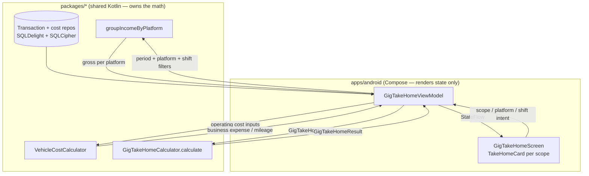
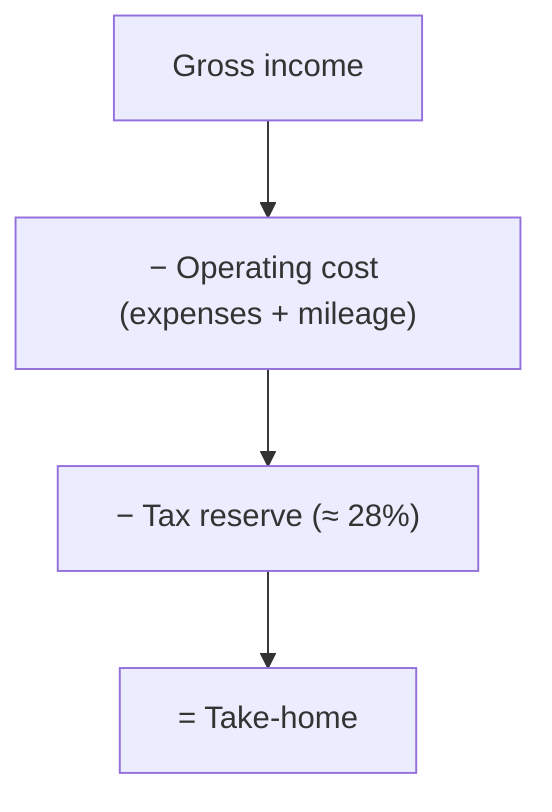

# Android Gig Take-Home Summary Cards — Design

> **Status:** PROPOSED — Pending human review
> **Issue:** [#2516](https://github.com/jrmoulckers/finance/issues/2516) — _Part of [#2135](https://github.com/jrmoulckers/finance/issues/2135)_
> **Platform:** Android / Wear OS (Jetpack Compose, Material 3)
> **Last Updated:** 2026-06-22
> **Owner:** @android-engineer

---

## Table of Contents

1. [Overview](#overview)
2. [Goals and Non-Goals](#goals-and-non-goals)
3. [Affected Android Surfaces](#affected-android-surfaces)
4. [Shared Dependencies (KMP)](#shared-dependencies-kmp)
5. [Architecture and Math Boundary](#architecture-and-math-boundary)
6. [Card Anatomy](#card-anatomy)
7. [Day / Week / Shift Scopes](#day--week--shift-scopes)
8. [Platform and Shift Filters](#platform-and-shift-filters)
9. [Offline-First Behavior](#offline-first-behavior)
10. [Screen States](#screen-states)
11. [Accessibility (TalkBack)](#accessibility-talkback)
12. [Test Plan](#test-plan)
13. [Implementation Readiness](#implementation-readiness)
14. [Open Questions](#open-questions)

---

## Overview

Gross pay is not what a gig worker keeps. After fuel, mileage, other operating costs, and a self-employment
tax reserve, the **take-home** number is what matters. This design covers Android **Compose summary cards**
that break a period into **Gross → Operating cost → Tax reserve → Take-home**, scoped by **day**, **week**,
or **shift**, and filterable by **platform** and **shift**.

The breakdown math is already implemented in shared Kotlin Multiplatform (KMP) — Compose renders the
shared `GigTakeHomeResult` and forwards filter intent only.

## Goals and Non-Goals

**Goals**

- Render the four-line waterfall (gross, operating cost, tax reserve, take-home) per scope.
- Support **day / week / shift** scopes and **platform + shift** filtering.
- Use the shared `GigTakeHomeCalculator` so figures match every other client exactly.
- Be glanceable, non-judgmental, fully offline, and TalkBack-complete.

**Non-Goals**

- No tax/expense math in Android — all of it lives in `packages/*`.
- No tax advice or filing; this is an estimate/reserve aid only.
- No Play Store distribution; design-only while distribution is gated by
  [#1242](https://github.com/jrmoulckers/finance/issues/1242).

## Affected Android Surfaces

| Surface                    | Path                                                                                                                                                    | Change                                                              |
| -------------------------- | ------------------------------------------------------------------------------------------------------------------------------------------------------- | ------------------------------------------------------------------- |
| **New** — Take-home screen | `apps/android/.../ui/screens/gig/GigTakeHomeScreen.kt`                                                                                                  | Scope tabs + filter chips + card list                               |
| **New** — Take-home VM     | `apps/android/.../ui/viewmodel/gig/GigTakeHomeViewModel.kt`                                                                                             | Builds `GigTakeHomeInput`, calls KMP, exposes `StateFlow`           |
| **New** — Take-home card   | `apps/android/.../ui/components/gig/TakeHomeCard.kt`                                                                                                    | Gross → cost → reserve → take-home waterfall card                   |
| **New** — Shift filter     | `apps/android/.../ui/components/gig/ShiftFilterChips.kt`                                                                                                | Shift selection chips                                               |
| Platform chips             | reuse `GigPlatformChips.kt` from [mapping design](./android-gig-platform-mapping.md)                                                                    | Platform multi-select                                               |
| Period scope               | reuse `DateRangePreset` from [`SearchFilterState.kt`](../../apps/android/src/main/kotlin/com/finance/android/ui/components/search/SearchFilterState.kt) | `TODAY` (day) / `THIS_WEEK` (week); shift = custom intra-day window |
| DI wiring                  | [`apps/android/.../di/AppModule.kt`](../../apps/android/src/main/kotlin/com/finance/android/di/AppModule.kt)                                            | `viewModelOf(::GigTakeHomeViewModel)`                               |
| Navigation                 | [`apps/android/.../ui/navigation/FinanceNavHost.kt`](../../apps/android/src/main/kotlin/com/finance/android/ui/navigation/FinanceNavHost.kt)            | Route `gig/take-home`                                               |
| Glance widget (follow-up)  | `apps/android/.../widget/TakeHomeWidget.kt`                                                                                                             | Home-screen "today's take-home" summary                             |

## Shared Dependencies (KMP)

The take-home breakdown is implemented in
[`packages/core/.../tax/TaxCalculators.kt`](../../packages/core/src/commonMain/kotlin/com/finance/core/tax/TaxCalculators.kt):

| KMP symbol                                                                                                                                                | Role on Android                                                                                                                                                    |
| --------------------------------------------------------------------------------------------------------------------------------------------------------- | ------------------------------------------------------------------------------------------------------------------------------------------------------------------ |
| `GigTakeHomeInput`                                                                                                                                        | Inputs: `grossIncomeCents`, `businessExpenseCents`, `mileageDeductions`, `reserveRate`, `wagesCents`, `isMarriedFilingSeparately`                                  |
| `GigTakeHomeCalculator.calculate`                                                                                                                         | Returns the full breakdown — **the only authority** for take-home math                                                                                             |
| `GigTakeHomeResult`                                                                                                                                       | `grossIncomeCents`, `businessExpenseCents`, `mileageDeductionCents`, `netSelfEmploymentIncomeCents`, `estimatedTaxReserveCents`, `estimatedSETax`, `takeHomeCents` |
| `TaxReserveCalculator`                                                                                                                                    | Default reserve rate `0.28` (suggested band `0.25`–`0.30`); used for reserve estimate                                                                              |
| `VehicleCostCalculator` ([vehicle/VehicleCostCalculator.kt](../../packages/core/src/commonMain/kotlin/com/finance/core/vehicle/VehicleCostCalculator.kt)) | Operating cost aggregation / cost-per-mile inputs                                                                                                                  |
| `MileageDeductionCalculator` / `TripDeduction`                                                                                                            | Mileage deduction component of operating cost                                                                                                                      |
| `GigPayoutCalculator.groupIncomeByPlatform`                                                                                                               | Source of per-platform gross income for the period/filters                                                                                                         |

Amounts are integer `Cents`; the UI applies locale-aware currency formatting only at render time.

## Architecture and Math Boundary

**Rule:** the ViewModel gathers period/platform/shift-scoped transactions and costs, assembles a
`GigTakeHomeInput`, and calls `GigTakeHomeCalculator.calculate`. Compose renders the returned
`GigTakeHomeResult`. **No** gross/cost/reserve/take-home arithmetic occurs in Android code.

## Card Anatomy

`TakeHomeCard` renders a four-line **waterfall** plus a headline take-home figure:

- **Headline:** `takeHomeCents`, large, with the scope label ("Today", "This week", "Evening shift").
- **Breakdown rows:** Gross (`grossIncomeCents`), Operating cost (`businessExpenseCents` +
  `mileageDeductionCents`), Tax reserve (`estimatedTaxReserveCents`), Take-home (`takeHomeCents`).
- **Reserve note:** a short, factual caption ("Set aside ~28% for self-employment tax") with a link to a
  deeper [take-home / tax reserve explainer]; never alarmist.
- **Net SE income** (`netSelfEmploymentIncomeCents`) and `estimatedSETax` available in an expandable
  "How this is calculated" disclosure for transparency.
- **Color is paired with text/icons** (color-blind safe); take-home is emphasized via type scale, not
  color alone.

## Day / Week / Shift Scopes

| Scope     | Window                                                | Bounds source                                                    |
| --------- | ----------------------------------------------------- | ---------------------------------------------------------------- |
| **Day**   | A single calendar day (default today)                 | `DateRangePreset.TODAY` (or a picked day)                        |
| **Week**  | Current ISO week                                      | `DateRangePreset.THIS_WEEK`                                      |
| **Shift** | A user-defined intra-day or cross-midnight work block | Custom start/end timestamps (a shift may span two calendar days) |

- Scope is a Material 3 tab/segmented control; switching scope re-queries transactions and recomputes via
  KMP. The selected scope drives the `from`/`to` (and time window for shift) used to gather gross income
  and costs before building `GigTakeHomeInput`.
- **Shift** is the finest grain: it bounds by timestamp, so a 6 pm–2 am shift correctly aggregates across
  midnight. Shift definitions are shared data; Android only selects and displays them.

## Platform and Shift Filters

- **Platform filter:** reuse the platform chips from the
  [mapping design](./android-gig-platform-mapping.md#platform-filter-chip-transactions). Selecting Uber +
  DoorDash restricts gross income (via `groupIncomeByPlatform`) and proportional costs to those platforms.
- **Shift filter:** `ShiftFilterChips` lets the user pick one or more named shifts (e.g., "Morning",
  "Evening"). Combined with the Day/Week scope, this answers "what did my evening shifts net this week?".
- Filters compose: scope × platform × shift. All filtering of the underlying transaction set is delegated
  to shared selection logic; Compose passes the chosen ids/bounds, never recomputes membership.

## Offline-First Behavior

- **Load:** read transactions + cost inputs from the local encrypted SQLDelight store and compute the
  breakdown in-memory; the screen is fully usable offline.
- **Recompute:** changing scope/platform/shift recomputes locally and instantly — no network dependency.
- **Sync:** new deposits/expenses arrive via the background
  [`SyncWorker`](../../apps/android/src/main/kotlin/com/finance/android/sync/SyncWorker.kt) (WorkManager);
  cards recompute reactively when local data updates.
- **Read-mostly:** this screen primarily reads. If the user edits the reserve rate or a shift definition,
  the write is **optimistic** and queued for sync, with conflicts deferred to the shared
  `ConflictStrategy.resolverFor()` path; the UI shows a non-blocking "Pending sync" affordance.
- **Staleness:** a "Last synced …" line clarifies that figures reflect the latest **local** data.

## Screen States

| State                     | Trigger                                      | Compose treatment                                                                            |
| ------------------------- | -------------------------------------------- | -------------------------------------------------------------------------------------------- |
| **Loading**               | Initial compute                              | Skeleton card; `contentDescription = "Loading take-home summary"`                            |
| **Empty (no income)**     | No matched income in scope                   | "No earnings recorded for {scope}" + link to add a transaction                               |
| **Empty (filtered out)**  | Platform/shift filter excludes all           | "No earnings for the selected platforms/shifts" + "Clear filters"                            |
| **Populated**             | `GigTakeHomeResult` present                  | Headline + waterfall + disclosure                                                            |
| **Zero take-home**        | Costs + reserve ≥ gross (result clamps to 0) | Show $0 take-home with neutral explainer (result never goes negative)                        |
| **Saving / Pending sync** | Reserve-rate or shift edit                   | Inline "Pending sync"; controls stay enabled                                                 |
| **Error**                 | Repository/sync failure                      | Non-blocking `Snackbar` + **Retry**; last good snapshot retained; `Timber.e` without amounts |
| **Offline**               | No connectivity                              | Banner "Offline — showing last synced data"; screen remains interactive                      |

## Accessibility (TalkBack)

Follows [`accessibility-patterns.md`](./accessibility-patterns.md),
[`data-visualization.md`](./data-visualization.md),
[`cognitive-accessibility.md`](./cognitive-accessibility.md), and
[`content-language-guidelines.md`](./content-language-guidelines.md).

- Each card composes one clear announcement:
  "Today: gross 180 dollars, operating cost 40 dollars, tax reserve 39 dollars, take-home 101 dollars".
- The waterfall rows read in order; the take-home headline is emphasized via heading semantics, not color.
- Reserve caption uses plain, non-judgmental language (no shame/alarm); the band is described as a
  guideline, not a demand.
- Scope tabs and filter chips announce selected state; all touch targets ≥ 48 dp; layout reflows at 200%
  font scale without truncation.
- The "How this is calculated" disclosure is keyboard/Switch-Access reachable and announces expand/collapse.

## Test Plan

| Layer                                      | Coverage                                                                                                                                                                                                                            |
| ------------------------------------------ | ----------------------------------------------------------------------------------------------------------------------------------------------------------------------------------------------------------------------------------- |
| **KMP (existing, referenced)**             | `TaxCalculatorsTest` (incl. `GigTakeHomeCalculator`) and `VehicleCostCalculatorTest` own the math; Android does not duplicate them                                                                                                  |
| **ViewModel unit (`assembleDebug` path)**  | Scope → bounds (day/week/shift incl. cross-midnight); platform/shift filter composition; `GigTakeHomeInput` assembly; mapping `GigTakeHomeResult` → card state; zero-clamp case; reserve-rate edit (optimistic save); error → retry |
| **Compose UI (androidTest / Robolectric)** | Scope/filter changes recompute; disclosure expand/collapse; empty/zero/error states render expected semantics                                                                                                                       |
| **Paparazzi snapshots**                    | Card for day/week/shift; populated, zero take-home, empty, error; with/without disclosure; light/dark + dynamic color; 1x and 2x font scale                                                                                         |
| **Accessibility checks**                   | Composed card announcement; heading semantics on take-home; non-color encoding; large-font reflow                                                                                                                                   |

## Implementation Readiness

This is a **design deliverable**; it ships as documentation only.

**Buildable now (no enrollment required), per
[`human-gated-prerequisites.md`](../ops/human-gated-prerequisites.md) §2:**

- Implement the screen, `GigTakeHomeViewModel`, filter chips, and Koin module.
- Verify with `./gradlew :apps:android:assembleDebug`, JVM unit tests, and Paparazzi snapshots.
  `GigTakeHomeCalculator`, `TaxReserveCalculator`, and `VehicleCostCalculator` already exist in
  `packages/core`.

**Distribution tail (gated by [#1242](https://github.com/jrmoulckers/finance/issues/1242)):**

- Release signing, Play Store upload, and any Glance-widget production rollout remain **human-gated**; see
  [`human-gated-prerequisites.md` §3.1](../ops/human-gated-prerequisites.md#31-android-distribution--google-play-1242).
- Nothing here requires the distribution tail to build or test locally.

## Open Questions

- How are **operating costs** attributed to a shift/platform — direct expense transactions, allocated
  vehicle cost-per-mile, or both? (Owned by `packages/*`; Android consumes the shared allocation.)
- Where do **shift definitions** live and how are they edited? (Shared model; confirm with @kmp-engineer.)
- Should the reserve rate be per-user adjustable here, or read-only from settings? (Recommend read-only on
  this screen with a deep link to the tax-reserve setting.)
- Wear OS Tile/Complication and Glance widget for "today's take-home" — scope as follow-ups under
  [#2135](https://github.com/jrmoulckers/finance/issues/2135).
