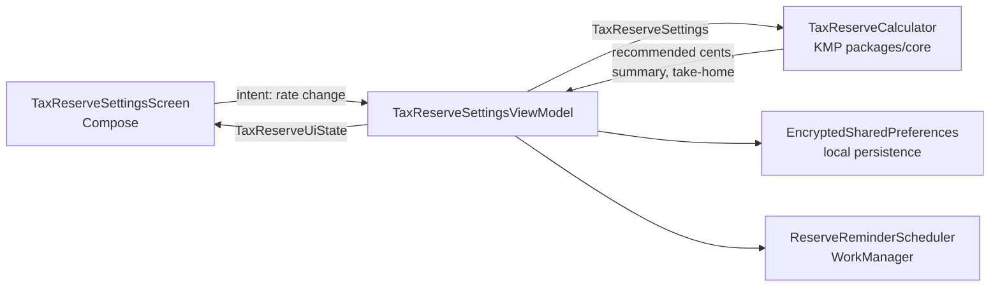
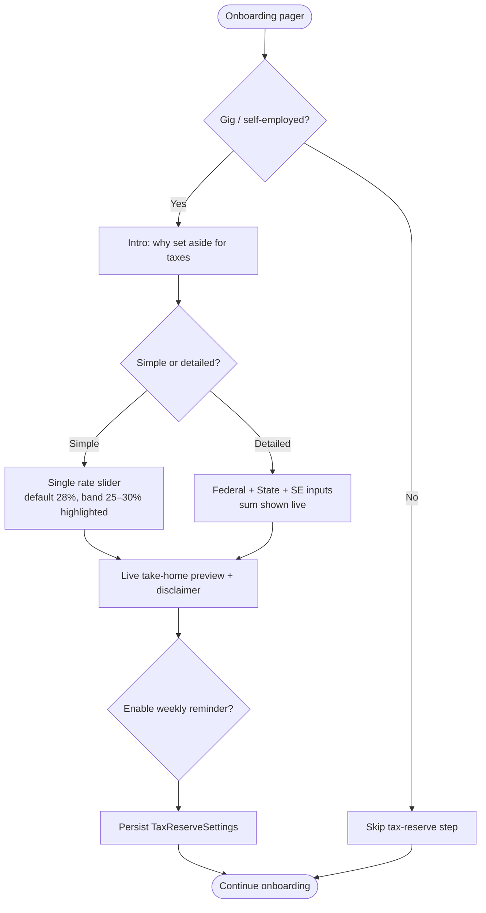

# Android — Gig Tax-Reserve Settings & Onboarding Flow

> **Status:** DRAFT — design only (pending human review)
> **Owner:** @native-app-engineer
> **Issue:** [#2517](https://github.com/jrmoulckers/finance/issues/2517) · **Part of** [#2135](https://github.com/jrmoulckers/finance/issues/2135)
> **Platform:** Android phone + tablet (Jetpack Compose, Material 3)
> **Last Updated:** 2026-06-22

This document specifies the **design** for the Android settings and onboarding flow that lets a
self-employed / gig worker configure their tax-reserve percentages, understand estimate
disclaimers, and opt in to weekly reserve reminders. It is **design + breakdown only** — no native
implementation ships while the Android _distribution_ tail is gated by
[#1242](https://github.com/jrmoulckers/finance/issues/1242) (see
[Implementation Readiness](#implementation-readiness)).

---

## Table of Contents

- [1. Goals & Non-Goals](#1-goals--non-goals)
- [2. KMP / Compose Boundary](#2-kmp--compose-boundary)
- [3. Affected Android Surfaces](#3-affected-android-surfaces)
- [4. Shared Dependencies](#4-shared-dependencies)
- [5. Onboarding Flow](#5-onboarding-flow)
- [6. Settings Surface](#6-settings-surface)
- [7. Estimate Disclaimers](#7-estimate-disclaimers)
- [8. Weekly Reserve Reminders](#8-weekly-reserve-reminders)
- [9. State Model (Offline / Empty / Error)](#9-state-model-offline--empty--error)
- [10. Accessibility (TalkBack & Font Scaling)](#10-accessibility-talkback--font-scaling)
- [11. Test Plan](#11-test-plan)
- [12. Implementation Readiness](#12-implementation-readiness)

---

## 1. Goals & Non-Goals

### Goals

- Let a gig worker set an overall tax-reserve **rate**, or break it down into federal / state /
  self-employment components, during onboarding and later in Settings.
- Render the **recommended reserve range** (25%–30%, default 28%) sourced from shared KMP constants,
  so guidance stays consistent across platforms.
- Surface clear, repeated **"this is an estimate, not tax advice"** disclaimers wherever a dollar
  figure or percentage is shown.
- Let the user **opt in** to a weekly local reminder to move money into their tax-reserve bucket.
- Work **fully offline** — all rates persist locally and never require network or backend auth.

### Non-Goals

- Computing the reserve math in Compose (owned by KMP — see [§2](#2-kmp--compose-boundary)).
- Filing, paying, or transmitting estimated taxes to any tax authority.
- Multi-jurisdiction / multi-state tax tables (out of scope; tracked separately under #2135).
- Wear OS surfacing of reserve settings (a possible follow-up, not part of this issue).

---

## 2. KMP / Compose Boundary

**All finance math stays in KMP `packages/*`.** Compose renders shared state and forwards user
intents; it never recomputes tax figures. This mirrors the
[Data Model](./data-model.md) rule that money is integer cents and computed in shared code.

| Concern                                         | Owner   | Symbol / location                                                                                                                              |
| ----------------------------------------------- | ------- | ---------------------------------------------------------------------------------------------------------------------------------------------- |
| Default & suggested reserve rates               | KMP     | `TaxReserveCalculator.DEFAULT_TAX_RESERVE_RATE` (`0.28`), `MIN_SUGGESTED_TAX_RESERVE_RATE` (`0.25`), `MAX_SUGGESTED_TAX_RESERVE_RATE` (`0.30`) |
| Rate breakdown (federal/state/SE)               | KMP     | `TaxReserveSettings`, `TaxReserveRateBreakdown`                                                                                                |
| Recommended reserve from net income             | KMP     | `TaxReserveCalculator.calculateRecommendedTaxReserveCents(...)`                                                                                |
| Quarter summary, due dates, shortfall           | KMP     | `TaxReserveCalculator.buildTaxReserveSummary(...)` → `TaxReserveSummary`                                                                       |
| Estimated take-home preview                     | KMP     | `GigTakeHomeCalculator.calculate(...)` → `GigTakeHomeResult`                                                                                   |
| Rate clamping / validation (`0.0..1.0`)         | KMP     | `normalizeRate(...)` inside the calculator                                                                                                     |
| Compose screens, ViewModels, persistence wiring | Android | `apps/android/...` (this doc)                                                                                                                  |

Source of truth:
[`packages/core/src/commonMain/kotlin/com/finance/core/tax/TaxCalculators.kt`](../../packages/core/src/commonMain/kotlin/com/finance/core/tax/TaxCalculators.kt).

> **Rule:** the Android layer must never hard-code `0.28`, the `25–30%` band, or any percentage math.
> It reads these from the shared calculator so the iOS/web/Windows clients stay consistent. The
> ViewModel holds a `TaxReserveSettings` instance and asks the calculator for derived values.

---

## 3. Affected Android Surfaces

All new Compose; **no XML layouts**. New files live under
`apps/android/src/main/kotlin/com/finance/android/`.

| Surface            | New file (proposed)                                                                               | Role                                                              |
| ------------------ | ------------------------------------------------------------------------------------------------- | ----------------------------------------------------------------- |
| Onboarding step    | `ui/onboarding/TaxReserveOnboardingStep.kt`                                                       | Optional "Set aside for taxes" step in the onboarding pager       |
| Settings screen    | `ui/screens/settings/TaxReserveSettingsScreen.kt`                                                 | Full rate editor + disclaimers + reminder toggle                  |
| Settings entry row | _edit-adjacent_ `ui/screens/SettingsScreen.kt` (new section composable only)                      | "Tax reserve" row that navigates to the screen                    |
| ViewModel          | `ui/screens/settings/TaxReserveSettingsViewModel.kt`                                              | Holds `TaxReserveUiState`, calls KMP calculator                   |
| Reminder worker    | `sync/ReserveReminderWorker.kt`                                                                   | Weekly `CoroutineWorker` posting the reserve nudge                |
| Reminder scheduler | `sync/ReserveReminderScheduler.kt`                                                                | Enqueues / cancels the periodic work                              |
| Koin wiring        | `di/AppModule.kt` (append only)                                                                   | `viewModelOf(::TaxReserveSettingsViewModel)` + scheduler `single` |
| Navigation         | `ui/navigation/FinanceNavHost.kt` (route add)                                                     | `taxReserveSettings` destination                                  |
| Preview / snapshot | `ui/screens/settings/TaxReserveSettingsPreview.kt`, `test/.../snapshot/TaxReserveSnapshotTest.kt` | Compose Preview + Paparazzi                                       |

> The existing [`SettingsScreen.kt`](../../apps/android/src/main/kotlin/com/finance/android/ui/screens/SettingsScreen.kt)
> already composes many `@Suppress("TooManyFunctions")` sections; we add one **Tax reserve** section
> composable and a nav action rather than rewriting the screen. The dedicated editor lives on its own
> route to keep the rate-breakdown UI focused.

---

## 4. Shared Dependencies

| Dependency                                                                           | Use                                                                   |
| ------------------------------------------------------------------------------------ | --------------------------------------------------------------------- |
| `com.finance.core.tax.TaxReserveCalculator`                                          | Default/suggested rates, recommended reserve, quarter summary         |
| `com.finance.core.tax.TaxReserveSettings` / `TaxReserveRateBreakdown`                | The persisted/edited model                                            |
| `com.finance.core.tax.TaxReserveSummary` / `TaxReserveSummaryInput`                  | "What you'd owe this quarter" preview                                 |
| `com.finance.core.tax.GigTakeHomeCalculator`                                         | Optional take-home preview using the chosen rate                      |
| `com.finance.models.types.Cents`                                                     | Integer-cent money type (never floats)                                |
| Koin `koin-compose-viewmodel`                                                        | `koinViewModel<TaxReserveSettingsViewModel>()`                        |
| `androidx.security.crypto.EncryptedSharedPreferences` (via `EncryptedPrefsProvider`) | Local persistence of `TaxReserveSettings` (no secrets in plain prefs) |
| WorkManager (`androidx.work`)                                                        | Weekly reserve reminder — **never** `AlarmManager`/`JobScheduler`     |
| Timber                                                                               | Structured logging — **never** log rates, amounts, or income          |

Persistence note: the rate (a percentage, not a secret) is stored in the existing encrypted
`finance_settings` store reached through
[`EncryptedPrefsProvider`](../../apps/android/src/main/kotlin/com/finance/android/security/EncryptedPrefsProvider.kt),
matching how `SettingsViewModel` already persists preferences. The reserve **bucket balance** is
derived from account data, not stored here.

---

## 5. Onboarding Flow

An **optional, skippable** step added to the onboarding pager
([`OnboardingNavigation.kt`](../../apps/android/src/main/kotlin/com/finance/android/ui/onboarding/OnboardingNavigation.kt)).
It only appears when the user self-identifies as self-employed / gig (existing onboarding profile
question); otherwise it is bypassed so non-gig users are not burdened.

Behaviour:

- **Simple mode** is default: one slider/stepper bound to `TaxReserveSettings.rate`. The
  recommended `25%–30%` band (from the KMP `MIN/MAX_SUGGESTED` constants) is visually highlighted,
  and `28%` is the pre-selected default.
- **Detailed mode** exposes federal / state / self-employment fields mapping to
  `TaxReserveRateBreakdown`. The live sum is computed by the KMP calculator and shown as the
  effective rate; Compose only displays it.
- The step is **fully skippable** and re-enterable later from Settings — never a hard gate.
- Defaults are applied even if skipped, so the rest of the app has a valid `TaxReserveSettings`.

---

## 6. Settings Surface

The dedicated `TaxReserveSettingsScreen` (Material 3, `Scaffold` + `LargeTopAppBar`) contains:

1. **Rate editor card** — Simple/Detailed toggle (same components as onboarding, reused).
   - Simple: `Slider` (or `+`/`−` stepper for precise 1% control) with the suggested band marked.
   - Detailed: three labelled `OutlinedTextField`s (federal/state/SE) with `%` suffix; live effective
     rate from KMP.
2. **Preview card** — "At a 28% reserve, on \$1,000 of net gig income you'd set aside \$280." Numbers
   come from `TaxReserveCalculator.calculateRecommendedTaxReserveCents(...)` / `GigTakeHomeCalculator`.
   Marked clearly as an example.
3. **This quarter card** (when income data exists) — `TaxReserveSummary` fields: recommended reserve,
   amount already reserved, shortfall, next quarterly due date + `daysUntilDue`, and the
   `dueDateStatus` chip (`FUTURE` / `DUE_SOON` / `DUE_TODAY`).
4. **Reminders card** — weekly reminder `Switch` + day/time preference (see [§8](#8-weekly-reserve-reminders)).
5. **Disclaimer footer** — persistent (see [§7](#7-estimate-disclaimers)).

Material 3 / Material You: inherit `MaterialTheme` dynamic color from the app; status uses
semantic color roles (e.g. `error`/`tertiary`) and **never color alone** to convey shortfall — pair
with text + icon.

---

## 7. Estimate Disclaimers

Tax math is an **estimate, not advice**. Disclaimers appear at three densities:

| Placement                                 | Copy intent                                                                                                    |
| ----------------------------------------- | -------------------------------------------------------------------------------------------------------------- |
| Onboarding intro                          | "This sets aside a portion of gig income as an estimate. It isn't tax advice — check with a tax professional." |
| Inline under every dollar/percent preview | Short: "Estimate only." linking to the full text.                                                              |
| Persistent settings footer                | Full disclaimer + "Rates are guidance based on common self-employment ranges."                                 |
| Reminder notification body                | "Estimated reserve — not tax advice." (no amounts on lock screen)                                              |

Implementation notes:

- Disclaimer copy lives in Android string resources (localizable) — **not** in KMP, since it is
  UI/legal copy, not math. Align wording with
  [`content-language-guidelines.md`](./content-language-guidelines.md).
- The inline "Estimate only" affordance is a `TextButton`/link that expands the full text in a
  `ModalBottomSheet`, keeping primary screens uncluttered.
- Disclaimers are **always visible** when a figure is shown — never gated behind a dismiss.

---

## 8. Weekly Reserve Reminders

Opt-in, **local-only**, privacy-preserving nudges to move money into the tax bucket.

- Scheduled with **WorkManager** (`PeriodicWorkRequestBuilder<ReserveReminderWorker>(7, DAYS)`),
  following the exact pattern of
  [`BillReminderWorker`](../../apps/android/src/main/kotlin/com/finance/android/sync/BillReminderWorker.kt):
  `CoroutineWorker` + `KoinComponent`, `enqueueUniquePeriodicWork(..., ExistingPeriodicWorkPolicy.KEEP)`,
  linear backoff. **Never** `AlarmManager`/`JobScheduler`.
- Reuses the existing notifications stack (`NotificationPreferences`, `NotificationContentBuilder`,
  `NotificationDispatcher`, a new `NotificationType.TAX_RESERVE_REMINDER` channel). The toggle writes
  through `NotificationScheduler` so enabling/cancelling work stays centralized.
- **Privacy:** notification uses generic copy ("Time to set aside for taxes this week") with
  `VISIBILITY_PRIVATE`; **no amounts, balances, or income** on the lock screen (matches
  `BillReminderWorker` and the project rule against logging/displaying sensitive financial data).
- Tapping the notification deep-links to `TaxReserveSettingsScreen` via `FinanceNavHost`.
- Day-of-week + time are user preferences persisted with the rate; default Sunday evening.
- POST_NOTIFICATIONS runtime permission (API 33+) is requested only when the user first enables the
  reminder; declining disables the toggle gracefully with an explanatory caption.

---

## 9. State Model (Offline / Empty / Error)

`TaxReserveUiState` is a sealed/immutable state exposed as `StateFlow` from the ViewModel.

| State                    | Trigger                             | Compose rendering                                                                                                                              |
| ------------------------ | ----------------------------------- | ---------------------------------------------------------------------------------------------------------------------------------------------- |
| **Loading**              | Reading persisted settings          | Skeleton/`CircularProgressIndicator` with `contentDescription = "Loading tax reserve settings"`                                                |
| **Ready (with income)**  | Settings + income data present      | Full editor + "this quarter" `TaxReserveSummary` card                                                                                          |
| **Ready (empty income)** | Settings present, no gig income yet | Editor + preview using an **illustrative example**; "this quarter" card shows an empty-state ("Log gig income to see your quarterly estimate") |
| **Offline**              | No connectivity                     | **No functional change** — everything is local-first; an unobtrusive caption notes figures are computed on-device                              |
| **Error (persistence)**  | Encrypted-prefs read/write failure  | Inline error card + retry; falls back to in-memory defaults so the user is never blocked; logged via `Timber.e` **without** values             |
| **Permission denied**    | POST_NOTIFICATIONS declined         | Reminder toggle reverts to off with caption + "Open settings" action                                                                           |

**Offline-first guarantee:** this feature has **no backend dependency**. Rates and reminder
preferences persist locally and compute via KMP; sync (when present) only propagates the stored
`TaxReserveSettings`, never the math. This is the source of the "buildable now" claim in
[§12](#12-implementation-readiness).

---

## 10. Accessibility (TalkBack & Font Scaling)

Follows [`accessibility-patterns.md`](./accessibility-patterns.md) and the project rule that **every
interactive/informational Composable carries a `contentDescription`** (or merged semantics).

- **Headings:** section titles use `Modifier.semantics { heading() }` for TalkBack rotor navigation.
- **Rate slider:** exposes `stateDescription` as a percentage (e.g. "28 percent") and uses
  `progressBarRangeInfo` so TalkBack announces value + range; provide a stepper alternative for users
  who can't drag (Switch Access / large-target needs).
- **Detailed fields:** each `OutlinedTextField` has a programmatic label, `%` semantics, and
  `keyboardType = Number`; error states announced via `error` semantics.
- **Preview & summary numbers:** merged into a single readable phrase, e.g.
  "Estimated reserve, 280 dollars on 1,000 dollars of net income. Estimate only." Status chips
  include text, not color alone (e.g. "Due soon, in 9 days").
- **Disclaimer:** reachable in reading order immediately after any figure; the "Estimate only" link
  has a descriptive `contentDescription` ("Read full tax estimate disclaimer").
- **Reminder toggle:** `Switch` with `stateDescription` ("On"/"Off") and a `contentDescription`
  describing the action ("Weekly tax reserve reminder").
- **Font scaling:** layouts use `sp` text + wrap/scrollable columns; verified at **200%** font scale
  and large display size with no truncation or overlap (Compose `verticalScroll`).
- **Touch targets:** ≥ 48 dp; stepper buttons spaced for Switch Access scanning.
- **Contrast:** semantic Material 3 roles meet WCAG AA in light, dark, and OLED themes.

---

## 11. Test Plan

| Layer                    | Tool                                                      | Coverage                                                                                                                             |
| ------------------------ | --------------------------------------------------------- | ------------------------------------------------------------------------------------------------------------------------------------ |
| KMP boundary (reference) | existing `TaxCalculatorsTest` in `packages/core`          | Confirms math is shared; Android tests do **not** re-assert tax math                                                                 |
| ViewModel                | JUnit + coroutines/Turbine                                | Rate edit → state update; clamp out-of-range input via KMP; simple↔detailed sum; persistence read/write; error fallback to defaults  |
| Reminder scheduling      | Robolectric + `WorkManagerTestInitHelper`                 | Enqueue on enable, cancel on disable, `KEEP` policy idempotency, permission-denied path                                              |
| Compose UI               | Compose UI test (`createComposeRule`)                     | Slider/stepper interaction, detailed-mode validation errors, disclaimer expansion, empty-income state                                |
| Accessibility            | Compose semantics assertions + Accessibility Scanner pass | `contentDescription` presence, heading semantics, slider range info, 200% font scale snapshot                                        |
| Snapshot                 | **Paparazzi**                                             | `TaxReserveSettingsScreen` in light/dark/OLED, empty vs. with-income, 200% font scale, RTL                                           |
| Edge cases               | unit + UI                                                 | 0% and 100% rate, federal+state+SE summing > 100% (clamped by KMP), no income, persistence failure, declined notification permission |

> Per project conventions, **money/percent math assertions belong to the KMP suite**; Android tests
> assert wiring, rendering, accessibility, and state transitions only.

---

## 12. Implementation Readiness

This issue is **design + breakdown only**. Per the
[Human-Gated Prerequisites runbook](../ops/human-gated-prerequisites.md), the
"blocked by #1242" status applies **only to the distribution tail**, not to feature implementation.

| Phase                                                           | Status                                                                  | Notes                                                                                             |
| --------------------------------------------------------------- | ----------------------------------------------------------------------- | ------------------------------------------------------------------------------------------------- |
| **Design** (this doc)                                           | ✅ Deliverable now                                                      | No external accounts/secrets needed                                                               |
| **Implementation** (Compose, ViewModel, WorkManager, Koin)      | ✅ Buildable now                                                        | Verifiable via `./gradlew :apps:android:assembleDebug` + sideload; all deps are local + KMP       |
| **Local tests** (unit / Compose / Paparazzi)                    | ✅ Runnable now                                                         | No enrollment required                                                                            |
| **Distribution** (Play Store, release signing, FCM-backed push) | 🔒 Gated by [#1242](https://github.com/jrmoulckers/finance/issues/1242) | Needs Google Play enrollment, release keystore, and CI secrets — **human-gated**, see the runbook |

**Buildable-now scope:** everything above ships and runs on a debug build. Local notifications use
the on-device `NotificationManager` (no FCM), so the reminder works without any paid entitlement.

**Distribution tail (human action required):** Play Store release, app signing, and any
server-pushed reserve nudge (vs. local WorkManager notification) depend on #1242 prerequisites listed
in [§3.1 of the runbook](../ops/human-gated-prerequisites.md#31-android-distribution--google-play-1242).
No AI agent performs those steps.

---

_Part of [#2135](https://github.com/jrmoulckers/finance/issues/2135). Companion designs:
[Shift mileage flow](./android-shift-mileage-flow.md) ·
[Mileage presets & IRS export](./android-mileage-presets-irs-export.md)._
