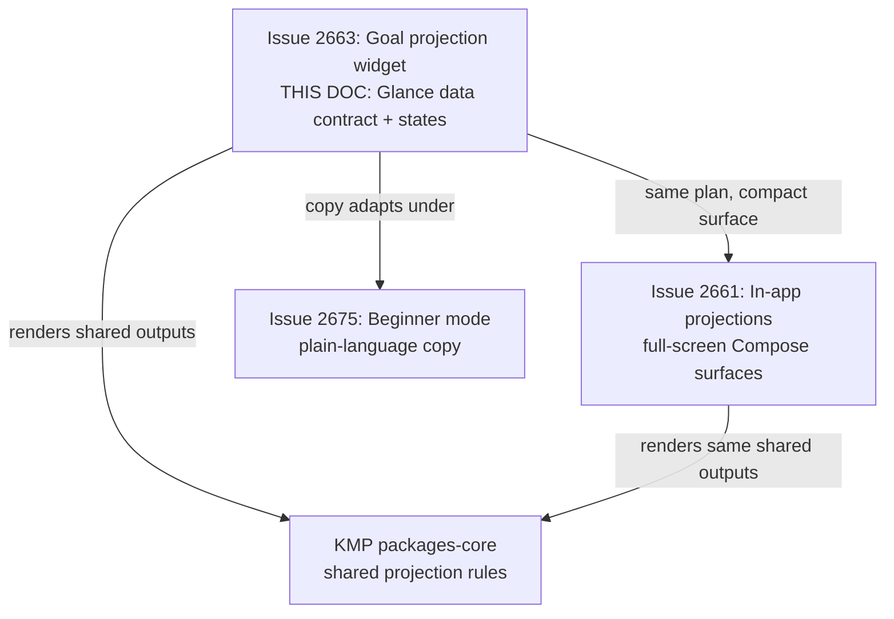
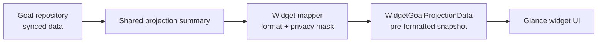
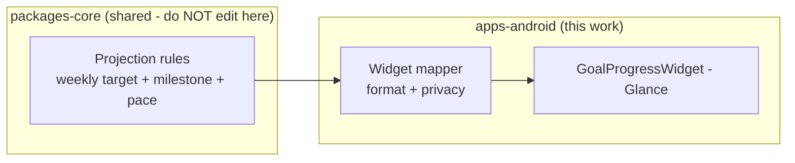
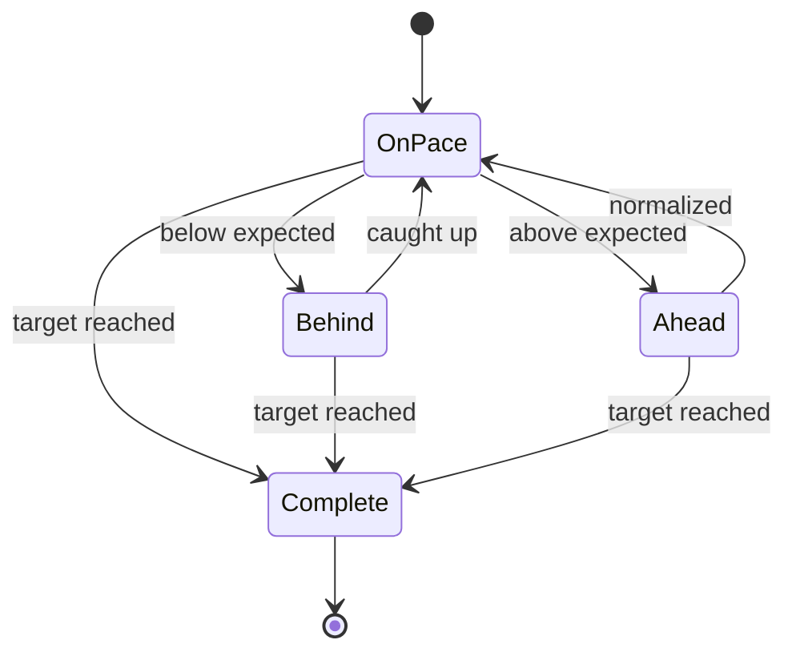
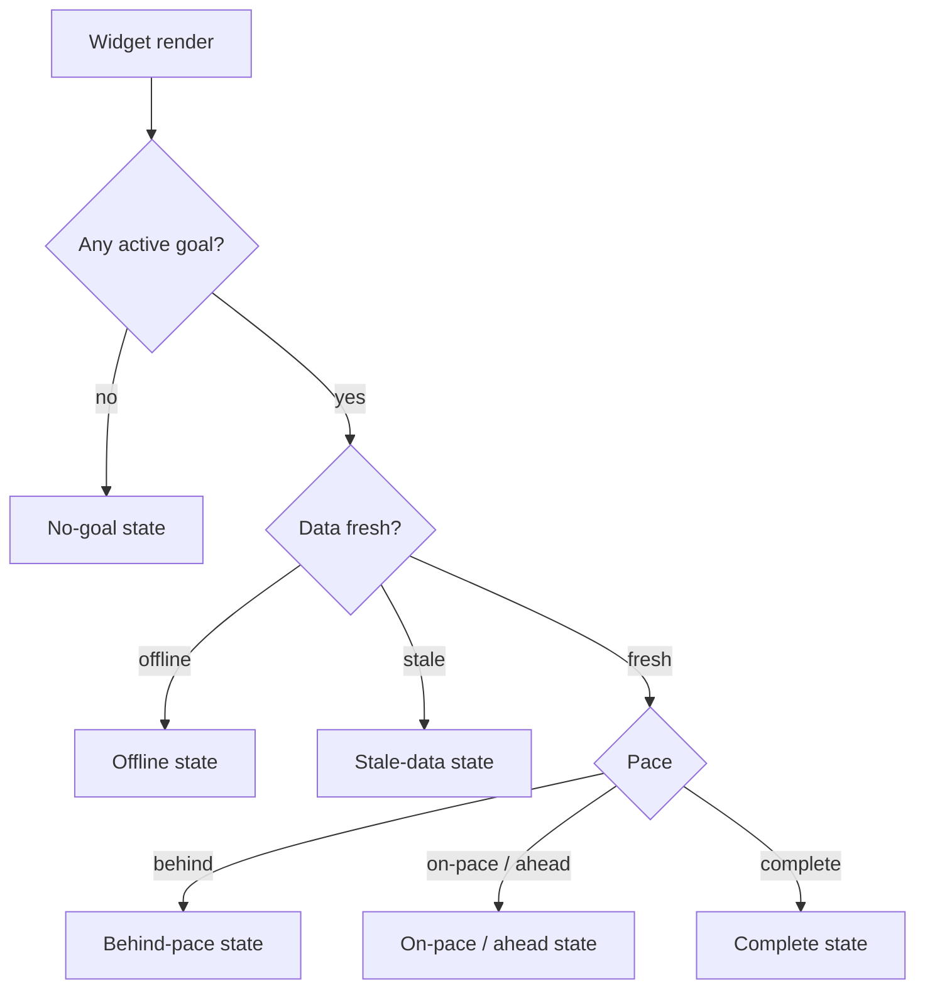
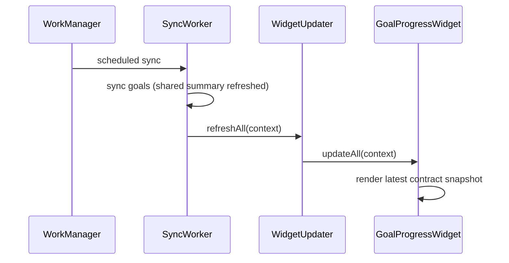

# Android Goal Projection Widget & Milestone States

> **Status:** PROPOSED — Pending human review
> **Issue:** [#2663](https://github.com/jrmoulckers/finance/issues/2663) · Part of [#2207](https://github.com/jrmoulckers/finance/issues/2207)
> **Platform:** Android (Glance home-screen widget, WorkManager)
> **Last Updated:** 2026-06-22
> **Design only:** Native implementation remains blocked by [#1242](https://github.com/jrmoulckers/finance/issues/1242)

---

## Table of Contents

1. [Purpose](#purpose)
2. [Goals and Non-Goals](#goals-and-non-goals)
3. [Scope Boundaries With Sibling Work](#scope-boundaries-with-sibling-work)
4. [Widget Data Contract](#widget-data-contract)
5. [Shared Projection Boundary](#shared-projection-boundary)
6. [Milestone and Pace States](#milestone-and-pace-states)
7. [Widget States](#widget-states)
8. [Refresh: WorkManager and Glance](#refresh-workmanager-and-glance)
9. [Privacy-Safe Lock-Screen Copy](#privacy-safe-lock-screen-copy)
10. [Estimates, Sensitivity, and Tone](#estimates-sensitivity-and-tone)
11. [Accessibility Considerations](#accessibility-considerations)
12. [Offline, Empty, and Error States](#offline-empty-and-error-states)
13. [Test Plan](#test-plan)
14. [Implementation Readiness](#implementation-readiness)
15. [References](#references)

---

## Purpose

The home-screen Goal Progress widget today renders **placeholder data** — the
existing [`GoalProgressWidget`](../../apps/android/src/main/kotlin/com/finance/android/widget/GoalProgressWidget.kt)
ships a `"No goals yet"` stub with a `TODO` to read real data. This document defines
the **real data contract** the widget should consume — top goal, projected date,
weekly target, and milestone state — and specifies every widget state (no-goal,
offline, stale, behind-pace) plus refresh and privacy expectations.

It is **design and breakdown only** while [#1242](https://github.com/jrmoulckers/finance/issues/1242)
gates Google Play distribution. The widget **consumes** shared projection outputs; it
**never** recalculates finance formulas in Glance UI.

---

## Goals and Non-Goals

**Goals**

- Define a **widget data contract** carrying top goal, projected completion date,
  weekly target, and milestone state.
- Specify the **no-goal, offline, stale-data, and behind-pace** widget states.
- Document **WorkManager / Glance refresh** expectations.
- Specify **privacy-safe** copy for at-a-glance / lock-screen contexts.

**Non-Goals**

- The in-app, full-screen projection experience — owned by
  [android-teen-goal-projections.md](android-teen-goal-projections.md).
- Implementing or editing the projection math (lives in KMP `packages/core`; the web
  `goal-projection-engine` is the parity reference).
- Beginner-mode preference plumbing and jargon mapping — owned by
  [android-teen-beginner-mode.md](android-teen-beginner-mode.md).
- Editing KMP `packages/*`, web, or any non-Android platform.

---

## Scope Boundaries With Sibling Work

The widget shows the **same plan** as the in-app card, in a glanceable surface. It
owns the **data contract**, the **state matrix**, and **refresh + privacy** for the
widget — nothing about the math.

---

## Widget Data Contract

The contract is a small, **pre-formatted, render-ready** snapshot. The widget must
not see raw balances or do arithmetic — it receives strings and an enum, mirroring
how the existing `WidgetGoalData` is already pre-formatted before it reaches Glance.

| Field             | Type        | Notes                                                       |
| ----------------- | ----------- | ----------------------------------------------------------- |
| `goalName`        | String      | Top (most advanced) active goal name.                       |
| `projectedDate`   | String?     | Pre-formatted estimate, e.g. "Aug 2027"; null when unknown. |
| `weeklyTarget`    | String?     | Pre-formatted, e.g. "$25/wk"; privacy-masked per mode.      |
| `milestone`       | Enum        | first / quarter / halfway / almost / done.                  |
| `pace`            | Enum        | behind / on-pace / ahead / complete.                        |
| `progressPercent` | Int (0–100) | For the text/bar progress indicator.                        |
| `totalGoals`      | Int         | "N active goals" footer.                                    |
| `dataFreshness`   | Enum        | fresh / stale / offline.                                    |
| `lastUpdated`     | String      | Human-readable, e.g. "Updated 2h ago".                      |

> The contract carries **already-localized, already-masked strings**, so Glance does
> no formatting or math. The mapper applies [`WidgetPrivacyFormatter`](../../apps/android/src/main/kotlin/com/finance/android/widget/WidgetPrivacyFormatter.kt)
> before the data reaches the widget.

---

## Shared Projection Boundary

The widget consumes the **same shared projection summary** as the in-app surfaces.
The web [`goal-projection-engine.ts`](../../apps/web/src/lib/savings/goal-projection-engine.ts)
is the parity reference (`weeklyTargetCents`, `milestonePercent`,
`behind | on-track | ahead | complete`). The equivalent shared model lives in KMP
`packages/core`; Glance never recomputes it.

> This document **describes** the boundary; it does **not** implement KMP changes.
> `packages/core` is owned by @native-app-engineer; the web engine by @web-engineer.

---

## Milestone and Pace States

Milestone and pace are **provided** by the shared summary; the widget only chooses a
compact label/icon.

| Milestone enum | Shared % | Compact widget label |
| -------------- | -------- | -------------------- |
| `first`        | > 0%     | "Started"            |
| `quarter`      | ≥ 25%    | "25%"                |
| `halfway`      | ≥ 50%    | "Halfway"            |
| `almost`       | ≥ 75%    | "Almost there"       |
| `done`         | 100%     | "Reached"            |

The behind-pace state never uses a "failure" framing — it shows the catch-up weekly
target in compact form (e.g. "$35/wk to stay on track") and a non-color icon.

---

## Widget States

| State         | What it shows                                                         |
| ------------- | --------------------------------------------------------------------- |
| No-goal       | Friendly prompt: "Pick something to save for" + tap-to-open.          |
| On-pace/ahead | Goal name, "$X/wk", projected date estimate, milestone, on-pace icon. |
| Behind-pace   | Same, with catch-up "$X/wk to stay on track" + neutral catch-up icon. |
| Complete      | "Goal reached" celebratory state; no nagging.                         |
| Stale-data    | Last-known plan + "Updated Nh ago" + subtle stale indicator.          |
| Offline       | Last-known plan + "Offline — showing last saved" indicator.           |

Every state remains tappable to open the app at the relevant goal
([`MainActivity`](../../apps/android/src/main/kotlin/com/finance/android/widget/GoalProgressWidget.kt)
deep-link target), matching the existing widget's `actionStartActivity` behavior.

---

## Refresh: WorkManager and Glance

- **Trigger after sync.** The existing [`SyncWorker`](../../apps/android/src/main/kotlin/com/finance/android/sync/SyncWorker.kt)
  already calls [`WidgetUpdater.refreshAll`](../../apps/android/src/main/kotlin/com/finance/android/widget/WidgetUpdater.kt)
  after a successful sync, which calls `GoalProgressWidget().updateAll(context)`.
  Real projection data flows on that existing path — no new scheduler.
- **WorkManager only.** Periodic refresh uses **WorkManager** (never AlarmManager /
  JobScheduler), with constraints and backoff tuned for battery; the widget reflects
  whatever the last sync produced.
- **Glance redraw.** On data change, the mapper produces a fresh contract snapshot
  and `updateAll` redraws; Glance does no work beyond layout.
- **Freshness, not spinners.** Widgets cannot show a live loading spinner, so the
  contract carries a `dataFreshness` enum and a `lastUpdated` string the widget
  renders as honest "Updated Nh ago" / "Offline" copy.

---

## Privacy-Safe Lock-Screen Copy

Widgets can appear on the lock screen and in screenshots, so the widget must be
**safe to show to a shoulder-surfer** by default — especially for a minor.

- **Default to masked.** Reuse [`WidgetPrivacyFormatter`](../../apps/android/src/main/kotlin/com/finance/android/widget/WidgetPrivacyFormatter.kt)
  (`Visible / Bucketed / Percent / Dots`). The widget's default mode hides exact
  amounts; "progress only" (percent + milestone) is the safest lock-screen framing.
- **No raw balances in glanceable text.** Show "Halfway to your car" or "$X/wk"
  bucketed/masked, not "$6,700 of $10,000," unless the user opts into visible amounts.
- **Goal name is optional.** Offer an option to hide the goal name (show "Your goal")
  for users who do not want it on a lock screen.
- **Never log.** Do not log goal names, amounts, targets, or projected dates via
  Timber from the widget or its mapper.

---

## Estimates, Sensitivity, and Tone

- **Label estimates.** Projected dates and targets are estimates; the widget shows
  "est." / "about" framing in the compact copy and never a guaranteed date.
- **Non-judgmental.** Behind-pace is catch-up, not failure, per
  [content-language-guidelines.md](content-language-guidelines.md).
- **Privacy-first for minors.** Masked by default; no analytics on goal contents.
- **No dark patterns.** No urgency, no pressure, no upsell in the widget.

---

## Accessibility Considerations

- **TalkBack:** the widget exposes one cohesive `contentDescription` summarizing the
  plan ("Car goal, halfway there, save about $25 a week, estimated August 2027,
  on pace; tap to open"), matching the existing widget's `semantics` approach but
  fed by real, privacy-masked data.
- **Switch Access:** the whole widget is a single actionable target (open app) with a
  ≥ 48dp touch area.
- **Font scaling:** Glance text honors system font scale; the layout must stay legible
  and avoid clipping the plan line at large scales (prefer fewer, prioritized lines).
- **Plain language / cognitive load:** the widget shows **one** plan and **one**
  milestone — never a dense dashboard — aligned with [cognitive-accessibility.md](cognitive-accessibility.md).
- **Non-color cues:** pace is conveyed with icon + text, never color alone, per
  [data-visualization.md](data-visualization.md).
- See [accessibility-patterns.md](accessibility-patterns.md) for the underlying patterns.

---

## Offline, Empty, and Error States

- **Offline:** render the **last-known** contract snapshot with an "Offline — showing
  last saved" indicator; never blank, never an error card.
- **Empty (no goal):** show the no-goal prompt inviting goal creation.
- **Stale:** when the last sync is old, keep the plan but surface "Updated Nh ago" so
  the saver knows it may have moved.
- **Error:** if a contract snapshot cannot be produced, fall back to the safest
  framing (progress-only / milestone) with "Plan unavailable right now"; never crash
  the widget host, never show a stack trace.

---

## Test Plan

| Layer             | Tooling                         | What it verifies                                                                  |
| ----------------- | ------------------------------- | --------------------------------------------------------------------------------- |
| Unit              | JUnit                           | Mapper builds the contract from a shared summary for every milestone/pace combo.  |
| Unit (privacy)    | JUnit                           | Masking modes produce no raw amounts by default; no Timber logs goal data.        |
| Unit (states)     | JUnit                           | no-goal / offline / stale / behind-pace resolve to the correct state.             |
| Compose/Glance UI | `createComposeRule` + semantics | Each state renders expected text + `contentDescription`.                          |
| Snapshot          | Paparazzi                       | no-goal, on-pace, behind-pace, complete, stale, offline at `{1x, 2x}` light/dark. |
| Refresh           | WorkManager test / instrumented | `SyncWorker` → `WidgetUpdater.refreshAll` redraws with new data.                  |
| Accessibility     | Espresso/Accessibility checks   | Single actionable target, ≥ 48dp, TalkBack summary correct.                       |

---

## Implementation Readiness

This is a design artifact. Execution splits into a **buildable-now** tier and a
**Play-distribution tail** gated by
[#1242](https://github.com/jrmoulckers/finance/issues/1242). See
[../ops/human-gated-prerequisites.md](../ops/human-gated-prerequisites.md) and
[../ops/launch-readiness-plan.md](../ops/launch-readiness-plan.md).

**Buildable now — `assembleDebug` + sideload (no human gate):**

- The **Glance widget plumbing is debug-implementable today**: define the data
  contract, build the mapper (with privacy masking), wire the state matrix, and
  render every state from mock/last-known data.
- Reuse the existing `SyncWorker` → `WidgetUpdater.refreshAll` → `updateAll` path; no
  new scheduling API.
- Verify states, privacy masking, refresh, accessibility, and snapshots on a debug
  build / emulator — **no signing, store credentials, or human-gated operations**.

**Play-distribution tail — human-gated by [#1242](https://github.com/jrmoulckers/finance/issues/1242):**

- Production signing + Play Console listing.
- Data-safety declaration covering widget surfaces and minors' data.
- Staged rollout / internal testing track.

The shared projection model is delivered by KMP `packages/core`; the widget renders it.

---

## References

**Design docs**

- [android-teen-goal-projections.md](android-teen-goal-projections.md) — in-app projection surfaces (#2661)
- [android-teen-beginner-mode.md](android-teen-beginner-mode.md) — beginner mode + plain language (#2675)
- [content-language-guidelines.md](content-language-guidelines.md) — non-judgmental, plain copy
- [cognitive-accessibility.md](cognitive-accessibility.md) — plain-language and load reduction
- [accessibility-patterns.md](accessibility-patterns.md) — screen reader, focus, touch targets
- [data-visualization.md](data-visualization.md) — progress visuals, non-color cues
- [chart-component-specs.md](chart-component-specs.md) — progress ring/bar specs
- [information-architecture.md](information-architecture.md) — surface and navigation map
- [ux-principles.md](ux-principles.md) — product UX principles
- [personas.md](personas.md) — Persona 4 (Casey)

**Ops**

- [../ops/human-gated-prerequisites.md](../ops/human-gated-prerequisites.md) — buildable-now vs. gated split
- [../ops/launch-readiness-plan.md](../ops/launch-readiness-plan.md) — launch checklist

**Android / web / KMP (read-only boundary)**

- [`GoalProgressWidget.kt`](../../apps/android/src/main/kotlin/com/finance/android/widget/GoalProgressWidget.kt) — existing widget (placeholder data)
- [`WidgetPrivacyFormatter.kt`](../../apps/android/src/main/kotlin/com/finance/android/widget/WidgetPrivacyFormatter.kt) — masking modes
- [`WidgetUpdater.kt`](../../apps/android/src/main/kotlin/com/finance/android/widget/WidgetUpdater.kt) — refresh entry point
- [`SyncWorker.kt`](../../apps/android/src/main/kotlin/com/finance/android/sync/SyncWorker.kt) — WorkManager sync entry point
- [`goal-projection-engine.ts`](../../apps/web/src/lib/savings/goal-projection-engine.ts) — web parity reference (owned by @web-engineer)
- [`Goal.kt`](../../packages/models/src/commonMain/kotlin/com/finance/models/Goal.kt) — shared goal model (owned by @native-app-engineer)

**Issues**

- [#2663](https://github.com/jrmoulckers/finance/issues/2663) — this issue
- [#2207](https://github.com/jrmoulckers/finance/issues/2207) — parent (teen goal cluster)
- [#1242](https://github.com/jrmoulckers/finance/issues/1242) — Play Console + keystore (gate)
