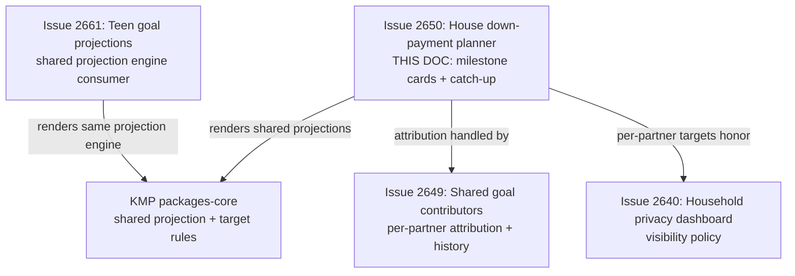
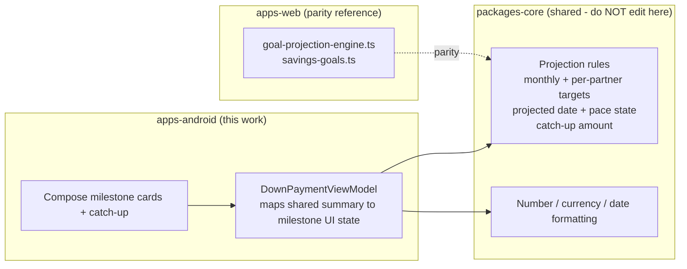
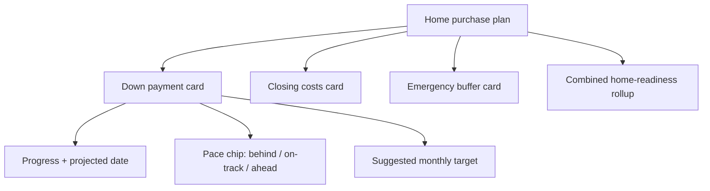
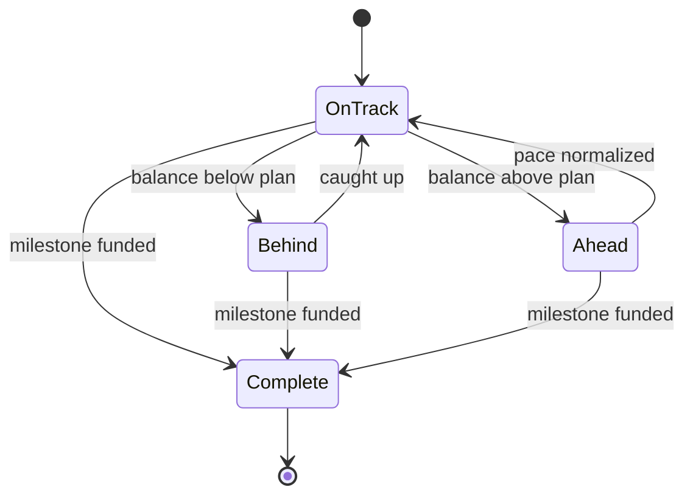

# Android House Down-Payment Milestones & Catch-Up Planner

> **Status:** PROPOSED — Pending human review
> **Issue:** [#2650](https://github.com/jrmoulckers/finance/issues/2650) · Part of [#2147](https://github.com/jrmoulckers/finance/issues/2147)
> **Platform:** Android (Jetpack Compose, Material 3)
> **Last Updated:** 2026-06-22
> **Design only:** Native implementation remains blocked by [#1242](https://github.com/jrmoulckers/finance/issues/1242)

---

## Table of Contents

1. [Purpose](#purpose)
2. [Persona and Why This Matters](#persona-and-why-this-matters)
3. [Goals and Non-Goals](#goals-and-non-goals)
4. [Scope Boundaries With Sibling Work](#scope-boundaries-with-sibling-work)
5. [Projection Math Lives in KMP](#projection-math-lives-in-kmp)
6. [Milestone Cards](#milestone-cards)
7. [Per-Partner Monthly Targets](#per-partner-monthly-targets)
8. [Behind / On-Track / Ahead and Catch-Up](#behind--on-track--ahead-and-catch-up)
9. [Plain-Language Copy](#plain-language-copy)
10. [Accessibility Considerations](#accessibility-considerations)
11. [Offline, Empty, Error, and Milestone States](#offline-empty-error-and-milestone-states)
12. [Test Plan](#test-plan)
13. [Implementation Readiness](#implementation-readiness)
14. [References](#references)

---

## Purpose

Buying a first home is one big number split into a few scary sub-numbers: the
**down payment**, the **closing costs**, and an **emergency buffer** to avoid
moving in house-poor. This document designs the Android Compose surfaces that
break that into legible **milestone cards**, show a **suggested monthly target
per partner** using shared projections, and — crucially — handle **behind/ahead
catch-up** with non-shaming copy for uneven incomes or missed months.

It is **design and breakdown only** while
[#1242](https://github.com/jrmoulckers/finance/issues/1242) gates Google Play
distribution. No Kotlin is written here, and no finance math is implemented in
Compose — the projection logic is a **shared KMP concern** that should reuse the
same engine as teen goal planning, with the web savings/projection engines as the
parity reference.

---

## Persona and Why This Matters

The persona ([#2147](https://github.com/jrmoulckers/finance/issues/2147)): a
couple saving together for a home, often with **two different incomes** and
**different months of higher and lower cash flow**. They benefit from a single
confident sentence per milestone — "Down payment: $18k of $40k, about Sep 2027 at
your current pace" — and from catch-up guidance that feels like a teammate, not a
scold. This intersects with [Persona 3 (household / couples)](personas.md) and
the plain-language goal framing in
[android-teen-goal-projections.md](android-teen-goal-projections.md).

> **Important framing:** every date, monthly target, and "catch-up" number is an
> **estimate**, visibly labelled as such, and never a promise or a mortgage-readiness
> determination. This surface plans the household's _own_ savings goal; it is not
> lending advice.

---

## Goals and Non-Goals

**Goals**

- Define **milestone cards** for down payment, closing costs, and emergency buffer,
  each with progress, a projected date, and a pace state.
- Show a **suggested monthly target per partner** derived from shared projections,
  honoring uneven incomes without prescribing a split in Compose.
- Provide **behind / on-track / ahead** messaging with **non-shaming catch-up copy**
  for missed or uneven contributions.
- Reuse the **same projection engine as teen goal planning** so the household and
  teen surfaces agree on math and never duplicate rules.
- Respect partner privacy: per-partner targets are shown only as the shared
  visibility policy permits.

**Non-Goals**

- Implementing or editing the projection/target math (lives in KMP `packages/core`;
  the web engines are the parity reference — see
  [Projection Math Lives in KMP](#projection-math-lives-in-kmp)).
- Per-partner contribution attribution and history — owned by
  [android-shared-goal-contributors.md](android-shared-goal-contributors.md).
- The visibility/RBAC policy itself — owned by
  [android-household-privacy-dashboard.md](android-household-privacy-dashboard.md).
- Mortgage pre-qualification, affordability lending decisions, or rate quotes.
- Editing KMP `packages/*`, web, or any non-Android platform.

---

## Scope Boundaries With Sibling Work

This doc owns the **home-purchase milestone and catch-up** experience. Who
contributed what is the contributors doc; what each partner may see is the privacy
dashboard. The **projection engine is shared with teen goal planning** — both
consume the same KMP outputs.

---

## Projection Math Lives in KMP

Monthly targets, projected completion dates, and catch-up amounts are **business
logic** and must be shared, not duplicated in Compose. The web references already
exist as
[`goal-projection-engine.ts`](../../apps/web/src/lib/savings/goal-projection-engine.ts)
and [`savings-goals.ts`](../../apps/web/src/lib/planning/savings-goals.ts), which
produce monthly targets, a `state` of `behind | on-track | ahead | complete`, and a
catch-up figure. The Android client consumes an **equivalent shared model from KMP
`packages/core`** — the same engine that powers teen goal planning — so all goal
surfaces agree.

> This document **describes** the boundary. It does **not** implement KMP changes —
> `packages/core` is owned by @native-app-engineer and the web engines by @web-engineer.
> Compose is a pure renderer of shared state. The existing
> [`Goal`](../../packages/models/src/commonMain/kotlin/com/finance/models/Goal.kt)
> model already carries `targetAmount`, `currentAmount`, and `targetDate`; a home
> purchase is modelled as a small set of these goals (down payment, closing costs,
> buffer) sharing a household. The per-partner split is **never** computed in
> Compose.

---

## Milestone Cards

Each milestone is a Material 3 card rendering shared state — a header, progress, a
projected date, and a pace chip. The three home-purchase milestones:

| Milestone            | What it funds                                   | Typical framing                            |
| -------------------- | ----------------------------------------------- | ------------------------------------------ |
| **Down payment**     | The deposit toward purchase price               | Usually the largest, leads the stack       |
| **Closing costs**    | Fees, taxes, and one-time purchase costs        | A meaningful add-on, often underestimated  |
| **Emergency buffer** | Post-move cash cushion to avoid house-poor risk | Protects against moving in with $0 reserve |

- Cards render in a sensible default order (down payment first) and roll up into a
  combined "home-readiness" estimate.
- Progress and pace visuals follow [data-visualization.md](data-visualization.md)
  and [chart-component-specs.md](chart-component-specs.md); they never rely on color
  alone. Cards reuse [component-library.md](component-library.md).
- A card with **no target amount yet** prompts the household to set one rather than
  showing a misleading $0-of-$0 state.

---

## Per-Partner Monthly Targets

The card shows a **suggested monthly target** and, when permitted, a per-partner
breakdown. The split is produced by the shared engine, which can weight by income
or stated preference; Compose only renders the result.

- **Default:** the household monthly target ("Save about $900/month to reach your
  down payment by Sep 2027").
- **Per-partner (permitted):** "Alex about $520 · Sam about $380" — shown only when
  the shared visibility policy allows per-partner figures; otherwise the surface
  shows the household target alone.
- **Uneven incomes are normal:** the per-partner suggestion is framed as a starting
  point the couple can adjust, never as an obligation, and never compares partners
  unfavorably.
- The remaining-paychecks / pay-cadence input is a **shared input**, not a Compose
  computation; when cadence is unknown, show a monthly target only.

> Per-partner targets are **estimates** and respect the same partner privacy
> boundaries as the contributors surface; if a partner has not consented to
> per-partner visibility, only the household target appears.

---

## Behind / On-Track / Ahead and Catch-Up

Catch-up is where tone matters most. Pace states map directly from the shared
engine `state`:

- **Behind** shows a **catch-up monthly number** ("a little behind — about
  $1,050/month keeps Sep 2027 on the table") and an alternative ("or keep $900/month
  and aim for Nov 2027"). It never says the household failed.
- **Ahead** is honest and encouraging ("you're ahead — you could be ready sooner").
- **Missed a month / uneven income:** copy normalizes it ("Some months are tighter —
  that's okay. Here's how to get back on plan"), reusing the catch-up patterns from
  [android-teen-goal-projections.md](android-teen-goal-projections.md).
- **Complete:** a clear win state per milestone, rolling into the combined readiness
  estimate with no nagging.

---

## Plain-Language Copy

Copy is part of the product here. Every string below is a placeholder for a
localized, resource-backed string and follows
[content-language-guidelines.md](content-language-guidelines.md).

| Context              | Plain-language copy (example)                                  |
| -------------------- | -------------------------------------------------------------- |
| Milestone progress   | "Down payment: $18k of $40k saved"                             |
| Monthly target       | "Save about $900/month to reach this by Sep 2027"              |
| Per-partner target   | "Alex about $520 · Sam about $380 (estimate)"                  |
| On track             | "On track for Sep 2027"                                        |
| Ahead                | "You're ahead — you could be ready sooner"                     |
| Behind (catch-up)    | "A little behind — about $1,050/month keeps Sep 2027 in reach" |
| Missed-month framing | "Some months are tighter. Here's how to get back on plan."     |
| No target yet        | "Set your down-payment target to see a monthly plan"           |
| Milestone complete   | "Down payment funded. Nice work, both of you."                 |

**Copy rules**

- Lead with the **milestone and the plan**, not with blame for a shortfall.
- Catch-up is **a new number plus an alternative date**, never a verdict.
- Always pair estimates with "about"/"around" or an explicit estimate label.
- Never imply lending readiness, approval odds, or that this is financial advice.

---

## Accessibility Considerations

- **TalkBack:** each milestone card exposes one cohesive `contentDescription`
  ("Down payment, $18,000 of $40,000 saved, on track for about September 2027,
  suggested $900 a month"). The pace chip and the catch-up action each carry their
  own label. Per-partner targets, when shown, are announced as estimates.
- **Switch Access:** the "adjust target," "set monthly amount," and catch-up
  affordances are reachable and operable with touch targets ≥ 48dp.
- **Font scaling:** milestone headers, currency, dates, and the monthly target stay
  readable and unclipped at **200%** font scale; no fixed-height containers around
  amounts.
- **Non-color cues:** behind / on-track / ahead use text and an icon, never color
  alone, per [data-visualization.md](data-visualization.md).
- **Plain language / cognitive load:** one plan per card, most important number
  first, aligned with [cognitive-accessibility.md](cognitive-accessibility.md).
- See [accessibility-patterns.md](accessibility-patterns.md) for the underlying
  screen-reader, focus, and touch-target patterns.

---

## Offline, Empty, Error, and Milestone States

- **Offline:** milestone projections are computed from already-synced goal data, so
  the cards render fully **offline** using the last-known shared summary; show data
  freshness rather than blocking the plan.
- **Empty (no home plan):** show a friendly setup state ("Plan your home purchase —
  start with a down-payment target") instead of blank cards.
- **Empty (target without a date):** show the monthly target as soon as an amount
  exists, and prompt "Add a target date to see your finish date."
- **Milestone states:** first contribution, quarter, halfway, almost there, and
  funded are derived from the shared milestone percent; Compose only chooses the
  label and the celebratory affordance.
- **Error:** if the shared summary cannot be produced, fail safe to raw progress
  ("$18k of $40k saved") with a quiet "Plan unavailable right now" — never a stack
  trace, never a blank screen.

---

## Test Plan

| Layer              | Tooling                         | What it verifies                                                                                                         |
| ------------------ | ------------------------------- | ------------------------------------------------------------------------------------------------------------------------ |
| Unit               | JUnit                           | ViewModel maps shared summary → milestone UI state for behind / on-track / ahead / complete.                             |
| Unit (math parity) | JUnit                           | Per-partner and household monthly targets read from the shared engine, not recomputed.                                   |
| Unit (safety)      | JUnit                           | No Timber call logs balances, target amounts, projected dates, or per-partner figures.                                   |
| Compose UI         | `createComposeRule` + semantics | Milestone cards, pace chip, monthly target, and catch-up resolve `contentDescription`.                                   |
| Compose UI         | `createComposeRule`             | Behind state surfaces a catch-up number and an alternative-date option.                                                  |
| Snapshot           | Paparazzi                       | Down-payment / closing / buffer cards in behind / on-track / ahead / complete + empty + no-date at {1x, 2x}, light/dark. |
| Pseudolocalization | `en-XA` / `ar-XB`               | Copy expansion and RTL mirroring for the milestone and catch-up sentences.                                               |
| Accessibility      | Espresso/Accessibility checks   | TalkBack order, Switch Access reachability, touch targets ≥ 48dp.                                                        |

---

## Implementation Readiness

This is a design artifact. Execution splits into a **buildable-now** tier and a
**Play-distribution tail** gated by
[#1242](https://github.com/jrmoulckers/finance/issues/1242). See
[../ops/human-gated-prerequisites.md](../ops/human-gated-prerequisites.md) and
[../ops/launch-readiness-plan.md](../ops/launch-readiness-plan.md).

**Buildable now — `assembleDebug` + sideload (no human gate):**

- Build the milestone cards, monthly-target and per-partner rendering, and catch-up
  states as Compose surfaces rendering a shared projection summary (mock/in-memory
  data while KMP wiring lands).
- Verify pace/milestone states, catch-up copy, accessibility, and
  pseudolocale/expansion snapshots on a debug build / emulator.
- All of this runs on an emulator with **no signing, store credentials, or
  human-gated operations**.

**Play-distribution tail — human-gated by [#1242](https://github.com/jrmoulckers/finance/issues/1242):**

- Production signing + Play Console listing.
- Any store-level data-safety declaration touching shared/household financial data.
- Staged rollout / internal testing track.

The shared projection engine (reused with teen goal planning) is delivered by KMP
`packages/core`; the web savings/projection engines are the parity reference;
Compose stays render-only.

---

## References

**Design docs**

- [android-teen-goal-projections.md](android-teen-goal-projections.md) — shared projection engine consumer + catch-up tone (#2661)
- [android-shared-goal-contributors.md](android-shared-goal-contributors.md) — per-partner attribution + history (#2649)
- [android-household-privacy-dashboard.md](android-household-privacy-dashboard.md) — visibility policy & aggregates (#2640)
- [android-goal-projection-widget.md](android-goal-projection-widget.md) — home-screen widget states (#2663)
- [content-language-guidelines.md](content-language-guidelines.md) — non-judgmental, plain copy
- [cognitive-accessibility.md](cognitive-accessibility.md) — plain-language and load reduction
- [accessibility-patterns.md](accessibility-patterns.md) — screen reader, focus, touch targets
- [data-visualization.md](data-visualization.md) — progress visuals, non-color cues
- [chart-component-specs.md](chart-component-specs.md) — progress ring/bar specs
- [component-library.md](component-library.md) — card and list components
- [information-architecture.md](information-architecture.md) — surface and navigation map
- [ux-principles.md](ux-principles.md) — product UX principles
- [personas.md](personas.md) — household / couples persona

**Ops**

- [../ops/human-gated-prerequisites.md](../ops/human-gated-prerequisites.md) — buildable-now vs. gated split
- [../ops/launch-readiness-plan.md](../ops/launch-readiness-plan.md) — launch checklist

**Android / web / KMP (read-only boundary)**

- [`goal-projection-engine.ts`](../../apps/web/src/lib/savings/goal-projection-engine.ts) — web parity reference, shared with teen planning (owned by @web-engineer)
- [`savings-goals.ts`](../../apps/web/src/lib/planning/savings-goals.ts) — savings planning rules
- [`GoalProjection.tsx`](../../apps/web/src/components/savings/GoalProjection.tsx) — web projection UI parity
- [`GoalsScreen.kt`](../../apps/android/src/main/kotlin/com/finance/android/ui/screens/GoalsScreen.kt) — host surface
- [`Goal.kt`](../../packages/models/src/commonMain/kotlin/com/finance/models/Goal.kt) — shared goal model (owned by @native-app-engineer)
- [`Household.kt`](../../packages/models/src/commonMain/kotlin/com/finance/models/Household.kt) — household model

**Issues**

- [#2650](https://github.com/jrmoulckers/finance/issues/2650) — this issue
- [#2147](https://github.com/jrmoulckers/finance/issues/2147) — parent (shared goals cluster)
- [#1242](https://github.com/jrmoulckers/finance/issues/1242) — Play Console + keystore (gate)
