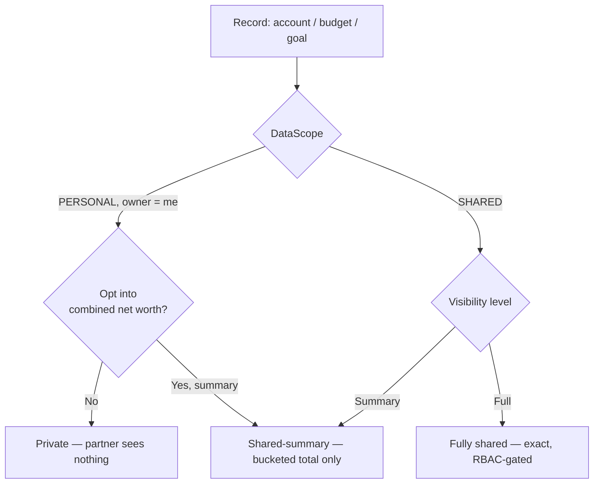
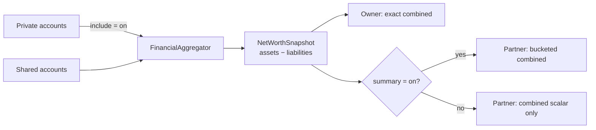

# Android Household Privacy Dashboard — Finance

> **Status:** DESIGN — Implementation-ready (native build/test unblocked; store distribution gated by [#1242](https://github.com/jrmoulckers/finance/issues/1242))
> **Issue:** [#2640](https://github.com/jrmoulckers/finance/issues/2640) — _Part of [#2142](https://github.com/jrmoulckers/finance/issues/2142)_ ("yours, mine, ours" privacy model)
> **Platform:** Android / Wear OS (Jetpack Compose · Material 3)
> **Last Updated:** 2026-06-21

This document specifies the **Household Privacy Dashboard**: a Jetpack Compose
surface that lets a couple preview exactly what each partner can see, and that
defaults shared views to **privacy-safe aggregates** rather than line-item
surveillance. It is the Android design counterpart to the web "yours, mine,
ours" foundation and **consumes the same shared privacy/aggregation APIs in
`packages/core`** — the UI renders policy, it does not invent it.

---

## Table of Contents

1. [Goals & Non-Goals](#1-goals--non-goals)
2. [Grounding in Existing Code](#2-grounding-in-existing-code)
3. [Privacy Model & Vocabulary](#3-privacy-model--vocabulary)
4. [Dashboard Sections](#4-dashboard-sections)
5. [Combined Net Worth: Include/Exclude Private Accounts](#5-combined-net-worth-includeexclude-private-accounts)
6. [Consuming Shared Privacy-Safe Aggregate APIs](#6-consuming-shared-privacy-safe-aggregate-apis)
7. [TalkBack & Accessibility Copy](#7-talkback--accessibility-copy)
8. [Composable & ViewModel Structure](#8-composable--viewmodel-structure)
9. [States, Edge Cases & Test Plan](#9-states-edge-cases--test-plan)
10. [Implementation Readiness](#10-implementation-readiness)
11. [Open Questions](#11-open-questions)

---

## 1. Goals & Non-Goals

### Goals

- Give each partner a **"what can my partner see?"** preview before they share
  anything, so consent is informed rather than assumed.
- Default partner-visible data to **category/budget summaries and bucketed
  aggregates**, never raw transaction line items.
- Let a household choose whether **combined net worth includes or excludes
  private accounts**, and make that choice transparent on both sides.
- Make every privacy state legible to **TalkBack, Switch Access, and font
  scaling** users with explicit, non-redundant announcements.
- Reuse shared business rules from `packages/core` so policy is identical across
  Web, iOS, Android, and Windows.

### Non-Goals

- **No new shared business rules.** This Android doc does not define partition
  or RBAC logic; it consumes [`DataPartitioning`](../../packages/core/src/commonMain/kotlin/com/finance/core/household/DataPartitioning.kt)
  and [`RbacPermissions`](../../packages/core/src/commonMain/kotlin/com/finance/core/household/RbacPermissions.kt).
  Any rule gap is a `packages/` change owned by @native-app-engineer, not a Compose
  workaround.
- **No store distribution work.** Release signing, Play Console upload, and the
  release CI workflow stay gated by #1242 (see §10).
- **No model schema changes.** Adding a per-record visibility/scope field to
  `Account`/`Budget`/`Goal` is parent-issue [#2142](https://github.com/jrmoulckers/finance/issues/2142)
  work in `packages/models`; this dashboard renders whatever scope the shared
  layer exposes.

---

## 2. Grounding in Existing Code

The dashboard is deliberately thin — it composes capabilities that already exist
or are planned in the shared layer.

| Concern                      | Source of truth (do **not** reimplement in Compose)                                                                                                   | Today's state                                                                             |
| ---------------------------- | ----------------------------------------------------------------------------------------------------------------------------------------------------- | ----------------------------------------------------------------------------------------- |
| Shared vs personal partition | [`DataPartitioning`](../../packages/core/src/commonMain/kotlin/com/finance/core/household/DataPartitioning.kt) (`DataScope.PERSONAL`/`SHARED`)        | Exists: `filterVisible`, `partition`, `canModify`                                         |
| Role permissions             | [`RbacPermissions`](../../packages/core/src/commonMain/kotlin/com/finance/core/household/RbacPermissions.kt) (OWNER/PARTNER/MEMBER/VIEWER)            | Exists: `viewTransactions`, `editBudgets`, `manageMembers`, …                             |
| Net worth math               | [`NetWorthSnapshot`](../../packages/core/src/commonMain/kotlin/com/finance/core/analytics/NetWorthSnapshot.kt) + `FinancialAggregator`                | Exists: assets − liabilities; consumed by `DashboardViewModel`                            |
| Amount masking for partners  | [`WidgetPrivacyFormatter`](../../apps/android/src/main/kotlin/com/finance/android/widget/WidgetPrivacyFormatter.kt) (`Visible/Bucketed/Percent/Dots`) | Exists: "shared with the web privacy foundation"                                          |
| Household roles & invites    | [`HouseholdViewModel`](../../apps/android/src/main/kotlin/com/finance/android/ui/screens/household/HouseholdViewModel.kt)                             | Exists: invites, roles, `useSharedBudget` toggle — privacy dashboard extends this surface |
| Web parity reference         | `apps/web/src/hooks/usePrivacyDashboard.ts`, `PrivacyModeContext.tsx` (`MaskingMode`, `PRIVACY_STRINGS`)                                              | Exists: reuse copy/semantics, do not fork                                                 |

> **Key models** ([`Account.kt`](../../packages/models/src/commonMain/kotlin/com/finance/models/Account.kt),
> [`Household.kt`](../../packages/models/src/commonMain/kotlin/com/finance/models/Household.kt),
> [`HouseholdMember.kt`](../../packages/models/src/commonMain/kotlin/com/finance/models/HouseholdMember.kt))
> already carry `householdId`/`ownerId` and a `HouseholdRole`. The per-record
> **scope** (Yours/Mine/Ours) is the parent-issue addition the dashboard will
> read once #2142 lands it in the shared model.

---

## 3. Privacy Model & Vocabulary

We map the persona's plain-language "yours, mine, ours" onto the shared
`DataPartitioning.DataScope` plus a visibility level. The Compose layer renders
these labels; the shared layer decides membership.

| UI label  | Shared scope                 | Who sees full detail | Who sees aggregate-only            | Notes                                                           |
| --------- | ---------------------------- | -------------------- | ---------------------------------- | --------------------------------------------------------------- |
| **Mine**  | `PERSONAL` (owner = me)      | Only me              | No one (optionally net-worth only) | Partner never sees line items; may contribute to combined total |
| **Ours**  | `SHARED`                     | Both partners        | —                                  | Fully shared; both can view (and per RBAC, edit)                |
| **Yours** | `PERSONAL` (owner = partner) | Only my partner      | Me (aggregate-only, optional)      | Symmetric mirror of "Mine" from my partner's perspective        |

Three **visibility levels** govern how a non-owner experiences a record:

1. **Private** — invisible to the partner. Not counted unless the owner opts it
   into the combined net-worth total (still without revealing the line item).
2. **Shared-summary** — the partner sees a **privacy-safe aggregate** only
   (bucketed balance, budget % used, goal % progress) via
   `WidgetPrivacyFormatter`'s `Bucketed`/`Percent` modes — never the exact
   amount, merchant, or transaction list.
3. **Fully shared** — the partner sees exact amounts and line items, subject to
   their `HouseholdRole` (a `VIEWER` still cannot edit).



---

## 4. Dashboard Sections

The dashboard is a single scrollable Compose screen
(`HouseholdPrivacyDashboardScreen`) with a top "preview as" control and four
ordered sections. Each section is a Material 3 `Card` group with a heading
(`Modifier.semantics { heading() }`) and a one-line plain-language summary.

### 4.0 Preview-As Selector (header)

A segmented control at the top lets the viewer switch between **"My view"** and
**"My partner's view"**. Choosing the partner's view re-renders every section
through the partner's `HouseholdRole` + scope filters, so the owner literally
sees what the partner sees. This is the core trust affordance.

- Default: "My view".
- The partner-view banner stays pinned: _"Previewing what {partner} can see.
  Nothing here is changed by switching views."_
- Implemented by re-running `DataPartitioning.filterVisible(...)` with the
  partner's `userId`/`role` — no separate UI-only rule.

### 4.1 Private (Yours/Mine) — `PERSONAL`, owner = viewer

Records only the viewer owns and keeps private.

- Lists accounts/budgets/goals with **exact** amounts (it's the owner's own
  data) and a **lock chip** ("Private").
- Per item: a toggle row **"Include in our combined net worth"** with a
  sub-option **"as a summary only"** vs **"exact"** (defaults to summary).
- Empty state: _"Nothing is private yet. Items you mark **Mine** appear here and
  stay hidden from {partner}."_
- In **partner-view preview**, this entire section collapses to a single
  reassurance row: _"{partner}'s private items are hidden from you."_

### 4.2 Shared-Summary (Ours, summarized) — aggregate-only

Records shared as **aggregates**, the recommended default for merging finances.

- Shows **bucketed balances** (e.g. "$1K–$5K"), **budget % used**, and **goal %
  progress** — sourced from the shared aggregate API, formatted by
  `WidgetPrivacyFormatter` (`Bucketed`/`Percent`).
- Never renders a transaction list, merchant, or exact figure here.
- Per item: **"Show exact amounts to {partner}"** toggle to promote to §4.3.
- This is the section the onboarding nudge steers couples toward ("transparency
  without surveillance").

### 4.3 Fully Shared (Ours, detailed) — `SHARED`, full visibility

Records both partners see in full, RBAC permitting.

- Exact balances, transaction lists, full budget/goal detail.
- Edit affordances are gated by `RbacPermissions` (`canEditBudgets`,
  `canCreateTransactions`); a `VIEWER` sees a read-only chip
  ("View only — ask {owner} to edit").
- Per item: **"Reduce to summary"** demotes back to §4.2.

### 4.4 Combined Net Worth Summary (footer)

A single Material 3 card showing the household combined net worth with an
explicit **include/exclude private accounts** control. See §5.

> **Section ordering rationale:** Private first (your safety), Shared-summary
> second (the encouraged default), Fully shared third (opt-in detail), Combined
> last (the payoff). This mirrors UX Principle "Clarity Over Completeness" from
> [`ux-principles.md`](./ux-principles.md).

---

## 5. Combined Net Worth: Include/Exclude Private Accounts

The combined net-worth card must make the include/exclude behavior **explicit,
symmetric, and non-leaky**.

### 5.1 Behavior

- **Math lives in the shared layer.** The card consumes a `NetWorthSnapshot`
  (assets − liabilities) computed by `FinancialAggregator` over the set of
  accounts the shared partition layer says are in scope. The Compose layer
  passes a flag for the include/exclude choice; it never re-sums balances
  itself.
- **Two toggles, owner-scoped:**
  1. **"Include my private accounts in our combined total"** (per viewer).
     Off by default. When on, the private balances contribute to the combined
     number **without** exposing the underlying accounts to the partner.
  2. **"Show partner my private accounts as a summary"** (off by default) —
     governs whether the partner sees a bucketed sub-total or nothing.

### 5.2 Include/exclude truth table

| Owner: include in total | Owner: show partner as summary | Owner's own view                      | Partner's view                                                |
| ----------------------- | ------------------------------ | ------------------------------------- | ------------------------------------------------------------- |
| Off                     | Off                            | Combined excludes my private accounts | Combined excludes them; no trace                              |
| On                      | Off                            | Combined includes them (exact)        | Combined total is higher, but **no line items**, no breakdown |
| On                      | On                             | Combined includes them (exact)        | Combined includes them; partner sees a **bucketed** sub-total |
| Off                     | On                             | _Invalid_ — coerced to Off/Off        | Same — cannot summarize what isn't counted                    |

### 5.3 Anti-leak rules

- When private accounts are **included but not summarized**, the partner sees
  only the combined scalar; the UI must **not** expose a per-account drill-down,
  an account count, or a delta that could de-anonymize a single account.
- If excluding private accounts would let a partner **infer** a hidden balance
  (e.g. combined total visibly drops to exactly one shared account), prefer the
  shared layer's bucketing; surface a quiet hint: _"Showing a rounded range to
  protect your private balances."_
- The include/exclude state is **per partner** and never silently changed by the
  other partner; changes are attributed to the owner only.



---

## 6. Consuming Shared Privacy-Safe Aggregate APIs

> **Hard rule:** policy rules are **not** computed only in the UI. The Compose
> layer is a renderer over shared decisions.

The ViewModel calls into `packages/core` and `packages/models`; it does not
branch on roles or recompute partitions ad hoc:

```kotlin
// HouseholdPrivacyDashboardViewModel (sketch — Compose-side, no business rules)
val visibleToPartner = DataPartitioning.filterVisible(
    items = accounts,
    userId = partnerId,            // previewing the partner
    role = partnerRole,            // from HouseholdMember
    getOwnerId = Account::ownerId,
    getScope = { scopeProvider.scopeOf(it) }, // shared scope source (#2142)
)

val canPartnerEditBudgets = RbacPermissions.canEditBudgets(partnerRole)

val combined: NetWorthSnapshot =
    financialAggregator.netWorth(scopeAccounts(includePrivate = includePrivate))
```

Responsibilities split:

- **Shared (`packages/core`, owned by @native-app-engineer):** what is private vs
  shared (`DataPartitioning`), who may view/edit (`RbacPermissions`), the
  net-worth math (`NetWorthSnapshot`/`FinancialAggregator`), and ideally a
  household **privacy-safe aggregate** entry point (bucketed balances, %
  progress) so every platform masks identically.
- **Android (this doc):** wiring those results into Compose, masking display via
  `WidgetPrivacyFormatter`, Koin DI, TalkBack semantics, and Material 3 theming.

If a needed aggregate (e.g. "household summary excluding private, pre-bucketed")
does not yet exist in `packages/core`, the dashboard **requests it as a shared
API** rather than computing it in the ViewModel — keeping Web/iOS/Windows in
lockstep. Track that as a follow-up `packages/` task under #2142.

### Koin wiring (additions only)

```kotlin
// di module (Android) — viewModelOf for the new dashboard
viewModelOf(::HouseholdPrivacyDashboardViewModel)
// reuses existing HouseholdIdProvider + repositories + FinancialAggregator
```

---

## 7. TalkBack & Accessibility Copy

Every privacy state and partner-visible summary needs explicit assistive-tech
copy. Per [`accessibility-patterns.md`](./accessibility-patterns.md) §7.1,
amounts always carry context and never rely on a glyph (lock icon, color) alone.
All copy below is the `contentDescription` / `semantics` string, not the visible
label. `{partner}` resolves to the partner's display name; amounts come from the
locale-aware formatter.

### 7.1 Privacy status announcements

| Surface                           | Visible UI             | TalkBack `contentDescription`                                                                  |
| --------------------------------- | ---------------------- | ---------------------------------------------------------------------------------------------- |
| Private item lock chip            | 🔒 "Private"           | "Private. Only you can see this. Hidden from {partner}."                                       |
| Shared-summary chip               | "Summary"              | "Shared as a summary. {partner} sees a rounded range, not exact amounts or transactions."      |
| Fully shared chip                 | "Shared"               | "Fully shared. {partner} can see exact amounts and transactions."                              |
| View-only (VIEWER) chip           | "View only"            | "View only. {partner} can see this but cannot edit it."                                        |
| Preview-as: partner view banner   | "Previewing {partner}" | "Previewing what {partner} can see. Switching views changes nothing."                          |
| Include-in-net-worth toggle (on)  | switch on              | "Included in your combined net worth. {partner} sees the total but not this account."          |
| Include-in-net-worth toggle (off) | switch off             | "Not included in your combined net worth. Double tap to include it privately."                 |
| Show-summary-to-partner toggle    | switch                 | "Show {partner} a rounded summary of your private accounts. Off means {partner} sees nothing." |

### 7.2 Partner-visible summary announcements

Bucketed and percentage values must announce as ranges/progress, never as a
precise figure the owner intended to hide:

| Surface                      | Visible UI    | TalkBack `contentDescription`                                                                            |
| ---------------------------- | ------------- | -------------------------------------------------------------------------------------------------------- |
| Bucketed account balance     | "$1K–$5K"     | "Balance between one thousand and five thousand dollars. Rounded for privacy."                           |
| Budget summary (% used)      | "72% used"    | "Budget 72 percent used. Shown as progress only; exact amounts are hidden."                              |
| Goal summary (% progress)    | "40%"         | "Savings goal 40 percent funded. Progress only; target amount hidden."                                   |
| Combined net worth (partner) | "$120K–$130K" | "Combined household net worth, rounded range one hundred twenty to one hundred thirty thousand dollars." |
| Combined net worth (owner)   | "$126,540.00" | "Combined household net worth, 126,540 dollars and 00 cents, including your private accounts."           |

### 7.3 Accessibility rules

- **Heading structure:** each section header uses `semantics { heading() }`; the
  preview-as control is a single labelled group so TalkBack announces context
  before items.
- **Don't double-announce:** when a chip already conveys "Private", the amount's
  `contentDescription` should not repeat "private" redundantly within the same
  focusable node — merge into one node where practical (per §7.1 do/don't).
- **Live region:** toggling a privacy state announces the result via a polite
  live region (e.g. "Now shared as a summary with {partner}").
- **Switch Access & font scaling:** all toggles meet the 48dp touch target;
  layouts reflow (no truncation) at 200% font scale — verified in Compose
  preview + Paparazzi at large-font configs.
- **No color-only signaling:** privacy state is conveyed by chip text + icon +
  `contentDescription`, never color alone (WCAG 1.4.1).

---

## 8. Composable & ViewModel Structure

All UI is Jetpack Compose + Material 3 with dynamic color; no XML. The dashboard
extends the existing Household surface rather than creating a parallel nav tree.

| Composable                        | Responsibility                                                               |
| --------------------------------- | ---------------------------------------------------------------------------- |
| `HouseholdPrivacyDashboardScreen` | Scaffold, preview-as selector, section list, snackbar/live-region host       |
| `PreviewAsSelector`               | Segmented "My view / {partner}'s view" control (re-runs partition filter)    |
| `PrivacySectionCard`              | Reusable section container with heading semantics + summary line             |
| `PrivacyItemRow`                  | Per account/budget/goal row: chip, masked/exact amount, toggles              |
| `CombinedNetWorthCard`            | Net-worth scalar + include/exclude + show-summary toggles (§5)               |
| `PrivacyStateChip`                | Private / Summary / Shared / View-only chip with merged `contentDescription` |

- **ViewModel:** `HouseholdPrivacyDashboardViewModel` (Koin `viewModelOf`,
  resolved via `koinViewModel()` in the screen). Exposes a single immutable
  `StateFlow<HouseholdPrivacyUiState>`; delegates every policy decision to
  `DataPartitioning` / `RbacPermissions` / `FinancialAggregator`.
- **Logging:** Timber only; never log balances, account names, or amounts — log
  state transitions as booleans/enum names (e.g.
  `Timber.d("privacy scope changed to %s", scope.name)`), matching the existing
  `HouseholdViewModel` convention.
- **Navigation:** reachable from `HouseholdScreen` ("Preview what your partner
  sees"); wired in the existing household nav, not a new top-level tab.
- **Theming:** Material 3 + dynamic color (Material You); chips use semantic
  tokens, never hard-coded hex.

---

## 9. States, Edge Cases & Test Plan

### Key states

- **Solo household (no partner yet):** preview-as is hidden; copy invites
  inviting a partner. Combined net worth = personal net worth.
- **Pending invite:** partner row shows "Pending — they can't see anything yet."
- **VIEWER partner:** fully-shared items render read-only; no edit affordances.
- **Loading / error:** skeleton cards; error uses a retry row with an
  announced live-region message (no raw stack traces).
- **All-private household:** combined net worth honors include/exclude;
  shared-summary section shows its empty state.

### Test plan

- **Unit (ViewModel):** include/exclude truth table (§5.2) drives net-worth
  scope; preview-as swaps `userId`/`role` and yields the partner's filtered set;
  invalid Off/On state coerces to Off/Off.
- **Paparazzi snapshots:** each section in My-view and partner-view, at default
  and 200% font scale, light/dark + dynamic-color; bucketed vs exact rendering.
- **Compose UI / semantics tests:** assert `contentDescription` on every chip,
  toggle, and amount; assert no exact amount string leaks into a partner-view
  node (regression guard against UI-only policy drift).
- **Accessibility:** TalkBack walkthrough script per §7; Switch Access focus
  order; touch-target and contrast checks.
- **Shared-rule parity:** golden test that Android's rendered visibility set
  equals `DataPartitioning.filterVisible(...)` output for the same fixtures the
  web suite uses — proves the UI didn't fork the policy.

---

## 10. Implementation Readiness

Per [`../ops/human-gated-prerequisites.md`](../ops/human-gated-prerequisites.md)
§2 (Implementation vs. Distribution), this feature is **decoupled**: design and
native implementation are buildable and testable now; only store distribution
waits on #1242.

### ✅ Buildable now (debug / free signing — no enrollment, no secrets)

- This design doc and all shared-API consumption decisions.
- All Compose UI, the `HouseholdPrivacyDashboardViewModel`, and Koin wiring.
- Unit tests, Compose semantics/UI tests, and Paparazzi snapshots.
- Local verification via `./gradlew :apps:android:assembleDebug` + sideload
  (enable "Install unknown apps"), per
  [`../ops/human-gated-prerequisites.md`](../ops/human-gated-prerequisites.md)
  §2 "Free local build/test paths".
- Any required **shared** aggregate API is a `packages/core` change (owned by
  @native-app-engineer) — also unblocked; not store-gated.

### 🔒 Distribution tail — gated by [#1242](https://github.com/jrmoulckers/finance/issues/1242)

- Release signing with the production keystore.
- Google Play Console upload / release-track promotion (internal → production).
- The `release-android.yml` signed-AAB workflow and its CI secrets
  (`ANDROID_KEYSTORE_BASE64`, `GOOGLE_PLAY_SERVICE_ACCOUNT_JSON`, …).

These are **human-gated** ($25 enrollment, identity verification, keystore
generation, GitHub secret config) and out of scope for SME agents — see the
[Human-Gated Prerequisites Runbook](../ops/human-gated-prerequisites.md) §3.1.
The feature ships to users only after a human completes that checklist; until
then it is fully exercisable via debug sideload.

---

## 11. Open Questions

1. **Scope field location** — does #2142 add `DataScope`/visibility to
   `Account`/`Budget`/`Goal` in `packages/models`, or a side `SharingConfig`
   table? The dashboard reads whichever the shared layer exposes.
2. **Household aggregate API** — should `packages/core` expose a first-class
   "privacy-safe household summary" (pre-bucketed, private-excluded) so all
   platforms mask identically? Recommended; tracked as a shared follow-up.
3. **Bucket granularity parity** — confirm `WidgetPrivacyFormatter` buckets
   match the web `MaskingMode` ranges so a partner sees the same range on every
   device.
4. **Wear OS** — should the combined net-worth summary (bucketed only) surface
   as a Tile/Complication? Likely a follow-up; private detail never leaves the
   phone.
