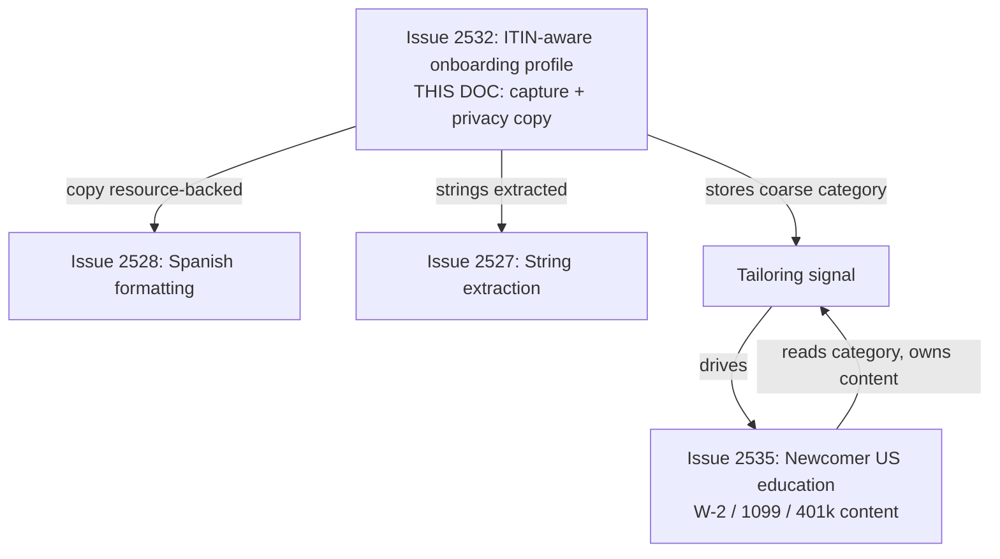
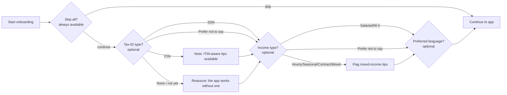
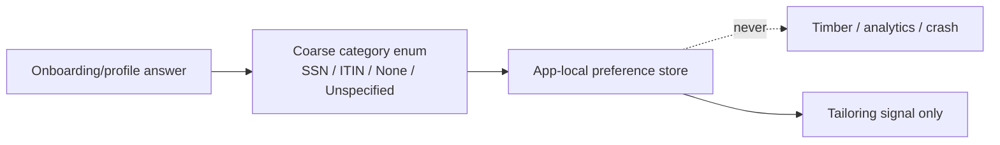
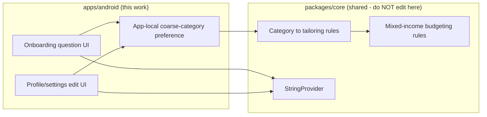

# Android ITIN-Aware Onboarding Profile

> **Status:** PROPOSED — Pending human review
> **Issue:** [#2532](https://github.com/jrmoulckers/finance/issues/2532) · Part of [#2178](https://github.com/jrmoulckers/finance/issues/2178)
> **Platform:** Android (Compose onboarding + profile/settings)
> **Last Updated:** 2026-06-22
> **Design only:** Native implementation remains blocked by [#1242](https://github.com/jrmoulckers/finance/issues/1242)

---

## Table of Contents

1. [Purpose](#purpose)
2. [Persona and Why This Matters](#persona-and-why-this-matters)
3. [Goals and Non-Goals](#goals-and-non-goals)
4. [Scope Boundaries With Sibling Work](#scope-boundaries-with-sibling-work)
5. [Profile Questions](#profile-questions)
6. [Onboarding Flow](#onboarding-flow)
7. [Privacy Copy and Data Handling](#privacy-copy-and-data-handling)
8. [Content Model and KMP Boundary](#content-model-and-kmp-boundary)
9. [Sensitivity and Tone](#sensitivity-and-tone)
10. [Localization and Text Expansion](#localization-and-text-expansion)
11. [Accessibility Considerations](#accessibility-considerations)
12. [Offline, Empty, and Error States](#offline-empty-and-error-states)
13. [Test Plan](#test-plan)
14. [Implementation Readiness](#implementation-readiness)
15. [References](#references)

---

## Purpose

A new immigrant without an SSN yet is silently excluded by onboarding that assumes
a salaried, SSN-holding US worker. The current Android onboarding
([`OnboardingScreen.kt`](../../apps/android/src/main/kotlin/com/finance/android/ui/onboarding/OnboardingScreen.kt),
[`OnboardingViewModel.kt`](../../apps/android/src/main/kotlin/com/finance/android/ui/onboarding/OnboardingViewModel.kt),
[`OnboardingNavigation.kt`](../../apps/android/src/main/kotlin/com/finance/android/ui/onboarding/OnboardingNavigation.kt))
captures none of the identity or income context that would let the app tailor
education without assuming one path.

This document designs **optional onboarding/profile questions** — tax-ID type
(SSN / ITIN / none / prefer not to say), income type (W-2 / 1099 / hourly /
seasonal / mixed), and language — plus the **privacy copy** that makes them feel
safe. It is the **profile-capture surface**; the education _content_ it tailors is
designed in [android-newcomer-us-finance-education.md](android-newcomer-us-finance-education.md).
It is **design and breakdown only** while
[#1242](https://github.com/jrmoulckers/finance/issues/1242) gates store
distribution.

> **Critical privacy rule:** we **never** capture or store the actual SSN/ITIN
> _number_. We store at most an optional, coarse _category_ used to tailor
> education. This is education only — no tax, legal, or immigration advice claims.

---

## Persona and Why This Matters

The persona ([#2178](https://github.com/jrmoulckers/finance/issues/2178)): a new
immigrant who may not have an SSN yet, may use an ITIN, works mixed W-2 / 1099 /
hourly / seasonal jobs, and is meeting US finance basics for the first time. Even a
simple, optional acknowledgement of ITIN and mixed-income realities makes the app
feel welcoming instead of exclusionary. This intersects with
[Persona 4: Casey](personas.md) on plain language and reduced cognitive load, and
relies on inclusive copy from
[content-language-guidelines.md](content-language-guidelines.md).

> **Framing:** this is **financial _education_** profiling to tailor content, not
> tax, legal, or immigration _advice_, and not identity verification. No choice
> unlocks, restricts, or gates any feature.

---

## Goals and Non-Goals

**Goals**

- **Optional, skippable** onboarding questions for tax-ID category, income type,
  and preferred language — never blocking account creation.
- Capture at most a **coarse category** (e.g. `SSN | ITIN | None/not yet | Prefer
not to say`), **never the identifier itself**.
- Use answers only to **tailor education and budgeting tips**; "none/not yet" and
  "prefer not to say" are first-class, fully-supported paths.
- Make every question **editable later** in profile/settings, with privacy copy
  that explains exactly what is and is not stored.

**Non-Goals**

- Storing, validating, or transmitting a real SSN/ITIN number, or any KYC/identity
  verification.
- Gating, unlocking, or restricting any feature based on an answer.
- Tax, legal, immigration, or financial _advice_ of any kind.
- Authoring the **education content** these answers tailor — that is owned by
  [android-newcomer-us-finance-education.md](android-newcomer-us-finance-education.md);
  this doc owns the **capture surface and privacy copy**.
- Editing KMP `packages/*` or any non-Android platform.

---

## Scope Boundaries With Sibling Work

The existing newcomer-education doc sketched an ITIN-aware onboarding _flow_ to
illustrate its content; **this doc is the authoritative design of the capture
surface, the coarse data model, the editing surface, and the privacy copy**. The
two are explicitly complementary, not duplicative.

---

## Profile Questions

All questions are optional, have a "prefer not to say" path, and default to
identity-neutral copy.

| Question           | Options (coarse category only)                                                                 | Used to tailor                            |
| ------------------ | ---------------------------------------------------------------------------------------------- | ----------------------------------------- |
| Tax-ID type        | `SSN` · `ITIN` · `None / not yet` · `Prefer not to say`                                        | ITIN-aware tips; reassurance if none      |
| Income type        | `Hourly` · `Salaried` · `Contract (1099)` · `W-2` · `Mixed` · `Seasonal` · `Prefer not to say` | Mixed-income budgeting + relevant modules |
| Preferred language | `English` · `Español` · (system default)                                                       | UI + education language                   |

- Tax-ID type stores **only the category**, never a number. There is **no numeric
  field** for SSN/ITIN anywhere in the schema, UI, or serialization.
- Income type may allow multiple selections (real lives are "mixed"); the result is
  still a set of categories.
- Preferred language hooks into the existing localization stack; it is a hint, not
  a hard switch that hides system settings.

---

## Onboarding Flow

- **Every step is skippable** and the whole block can be skipped at once; skipping
  is a first-class outcome, not a nag.
- Answers **tailor** downstream education (additive tips); they never unlock or
  restrict features.
- Default copy is **identity-neutral**; tailored tips are additive overlays, so a
  user who skips sees a complete, non-broken experience.
- The same questions are reachable later from profile/settings with identical
  options and privacy copy.

---

## Privacy Copy and Data Handling

This surface lives or dies on trust. Privacy copy is part of the design, not an
afterthought.

- **Plain-language "what we store" panel** shown before/at the tax-ID question:
  "We never ask for or store your SSN or ITIN number. We only remember the _type_
  you choose, on this device, to show more relevant tips. You can change or clear
  it anytime."
- **Coarse category only.** Stored value is one of a small enum; there is no field
  capable of holding a 9-digit identifier.
- **Local, kept out of logs and analytics.** The category is an app-local
  preference; it must never appear in Timber logs, crash reports, or analytics
  events (the implementation honors the repo's never-log-sensitive-data rule).
- **Clearable.** A single control in settings resets all profile answers to
  "unspecified".
- **No advice claims.** Copy explicitly says this tailors _education_, and is not
  tax, legal, or immigration advice.

---

## Content Model and KMP Boundary

The captured category is **data for tailoring**; any reusable rule that maps a
category to tips (or smooths mixed income) lives in **KMP `packages/core`**. Compose
renders shared state; it never owns the mapping or any finance math.

- Labels/options/privacy copy → Android string resources (localizable via
  [#2527](android-string-resource-migration-audit.md) /
  [#2528](android-spanish-education-formatting.md)).
- The category→tips mapping and any income-smoothing math live in shared KMP rules;
  the Android UI reads the result via
  [`StringProvider`](../../packages/core/src/commonMain/kotlin/com/finance/core/i18n/StringProvider.kt)
  and renders it.

> This document **describes** the boundary. It does not implement KMP changes —
> `packages/core` is owned by @kmp-engineer.

---

## Sensitivity and Tone

- **Never store the identifier.** At most an optional, coarse category; no numeric
  SSN/ITIN field exists anywhere.
- **Never log sensitive data.** Category and income answers must be omitted from
  Timber, analytics, and crash reporting.
- **Inclusive, non-judgmental tone** per
  [content-language-guidelines.md](content-language-guidelines.md): ITIN, "none/not
  yet", and mixed/seasonal income are normal, not exceptional or lesser.
- **No advice framing.** Tailoring is education only; link to authoritative primary
  sources rather than instructing the user.
- **Skippable and reversible** end to end.

---

## Localization and Text Expansion

- All question labels, options, and privacy copy are **resource-backed and
  translatable**, feeding Spanish coverage
  ([#2528](android-spanish-education-formatting.md)). US terms (W-2, 1099, ITIN)
  often lack short Spanish equivalents; expect **25–30%+ expansion** — design
  option chips and the privacy panel to wrap, never clip or truncate.
- Keep acronyms (SSN, ITIN, W-2, 1099) as-is across languages; localize the
  surrounding explanation.
- Validate under `en-XA` and at `2.0x` font scale; verify RTL with `ar-XB`.

---

## Accessibility Considerations

- **TalkBack:** every question, option, the skip control, and the privacy panel
  carry a meaningful `contentDescription`; reading order is question → options →
  privacy note → skip/continue. The "we never store your number" guarantee is part
  of the spoken description on the tax-ID question.
- **Switch Access:** all options, skip, continue, and the settings reset control are
  reachable and operable with adequate (≥ 48dp) touch targets.
- **Font scaling:** all onboarding and privacy copy stay readable and unclipped at
  **200%** font scale; no fixed-height containers; chips reflow.
- **Plain language / cognitive load:** one question per screen, short sentences,
  aligned with [cognitive-accessibility.md](cognitive-accessibility.md).
- **Non-color cues:** selected/unselected options indicated by text/shape, not
  color alone.
- See [accessibility-patterns.md](accessibility-patterns.md) for the underlying
  patterns.

---

## Offline, Empty, and Error States

- **Offline:** onboarding and profile editing are **fully available offline** — no
  question requires a network call. A newcomer on intermittent data completes setup
  without friction.
- **Empty / skipped:** if the user skips everything, the app shows a complete,
  identity-neutral experience with **no broken or empty tailored sections**;
  tailored tips are purely additive.
- **Error:** if an answer fails to persist, **fail safe** — never block onboarding
  or continuing; retry silently and surface a calm, non-judgmental message. Never
  re-prompt for an answer the user chose to skip.

---

## Test Plan

| Layer              | Tooling                         | What it verifies                                                                  |
| ------------------ | ------------------------------- | --------------------------------------------------------------------------------- |
| Unit               | JUnit                           | All questions optional; skip path produces a valid, complete profile state.       |
| Unit (privacy)     | JUnit                           | Only the coarse category persists; **no identifier field exists or serializes**.  |
| Unit (mapping)     | JUnit                           | Category → tailoring signal is read from shared rules, not computed in the UI.    |
| Compose UI         | `createComposeRule` + semantics | Question/option/privacy text + `contentDescription` resolve from resources.       |
| Snapshot           | Paparazzi                       | Onboarding questions + privacy panel at `{en, en-XA, es}` × `{1x, 2x}`.           |
| Pseudolocalization | `en-XA` / `ar-XB`               | Expansion + mirroring for privacy copy and option chips.                          |
| Accessibility      | Espresso/Accessibility checks   | TalkBack order, Switch Access reachability, touch targets ≥ 48dp, non-color cues. |
| Behavior           | Espresso                        | Every question skippable + editable later; settings reset clears all answers.     |

---

## Implementation Readiness

This is a design artifact. Execution splits into a **buildable-now** tier and a
**Play-distribution tail** gated by
[#1242](https://github.com/jrmoulckers/finance/issues/1242). See
[../ops/human-gated-prerequisites.md](../ops/human-gated-prerequisites.md) and
[../ops/launch-readiness-plan.md](../ops/launch-readiness-plan.md).

**Buildable now — `assembleDebug` + sideload (no human gate):**

- Add optional onboarding/profile questions (coarse category only, **never** the
  identifier) and the privacy panel.
- Persist answers as app-local preferences; wire the tailoring signal to shared KMP
  rules (render-only).
- Verify skip/edit/reset behavior, offline availability, accessibility, and
  pseudolocale/expansion snapshots on a debug build / emulator.

**Play-distribution tail — human-gated by [#1242](https://github.com/jrmoulckers/finance/issues/1242):**

- Production signing + Play Console listing.
- Store **Data Safety** declaration reflecting that only an optional coarse category
  (never an SSN/ITIN number) is stored locally.
- Staged rollout / internal testing track.

Everything in the buildable-now tier runs on an emulator with **no signing, store
credentials, or human-gated operations**. Spanish rendering is delivered through
[#2528](android-spanish-education-formatting.md); the education content these answers
tailor is delivered through
[android-newcomer-us-finance-education.md](android-newcomer-us-finance-education.md).

---

## References

**Design docs**

- [android-newcomer-us-finance-education.md](android-newcomer-us-finance-education.md) — education content tailored by this profile (#2535)
- [android-credit-building-education.md](android-credit-building-education.md) — credit-building education path (#2530)
- [android-secured-card-tracking.md](android-secured-card-tracking.md) — secured-card surface (#2531)
- [android-string-resource-migration-audit.md](android-string-resource-migration-audit.md) — string extraction + lint (#2527)
- [android-spanish-education-formatting.md](android-spanish-education-formatting.md) — Spanish coverage (#2528)
- [content-language-guidelines.md](content-language-guidelines.md) — non-judgmental, inclusive copy
- [accessibility-patterns.md](accessibility-patterns.md) — screen reader, focus, touch targets
- [cognitive-accessibility.md](cognitive-accessibility.md) — plain-language and load reduction
- [information-architecture.md](information-architecture.md) — onboarding/surface map
- [ux-principles.md](ux-principles.md) — product UX principles
- [personas.md](personas.md) — Persona 4 (Casey)

**Ops**

- [../ops/human-gated-prerequisites.md](../ops/human-gated-prerequisites.md) — buildable-now vs. gated split
- [../ops/launch-readiness-plan.md](../ops/launch-readiness-plan.md) — launch checklist

**Android / KMP (read-only boundary)**

- [`OnboardingScreen.kt`](../../apps/android/src/main/kotlin/com/finance/android/ui/onboarding/OnboardingScreen.kt) — existing onboarding surface
- [`OnboardingViewModel.kt`](../../apps/android/src/main/kotlin/com/finance/android/ui/onboarding/OnboardingViewModel.kt) — existing onboarding state
- [`OnboardingNavigation.kt`](../../apps/android/src/main/kotlin/com/finance/android/ui/onboarding/OnboardingNavigation.kt) — onboarding navigation
- [`StringProvider.kt`](../../packages/core/src/commonMain/kotlin/com/finance/core/i18n/StringProvider.kt) — shared string provider (owned by @kmp-engineer)

**Issues**

- [#2532](https://github.com/jrmoulckers/finance/issues/2532) — this issue
- [#2178](https://github.com/jrmoulckers/finance/issues/2178) — parent (ITIN-aware onboarding + US basics)
- [#1242](https://github.com/jrmoulckers/finance/issues/1242) — Play Console + keystore (gate)
