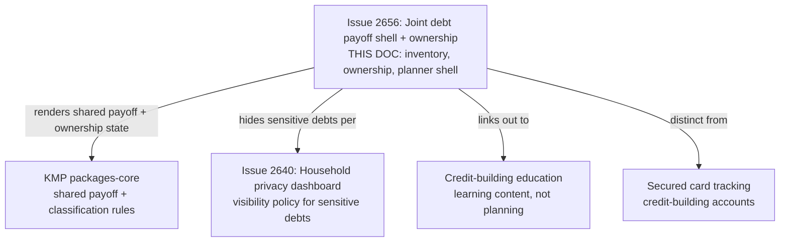
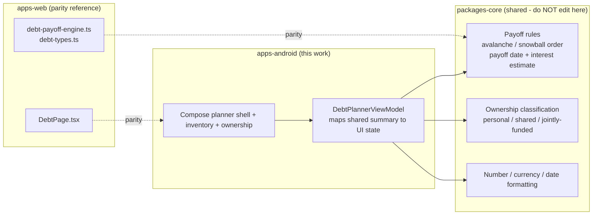
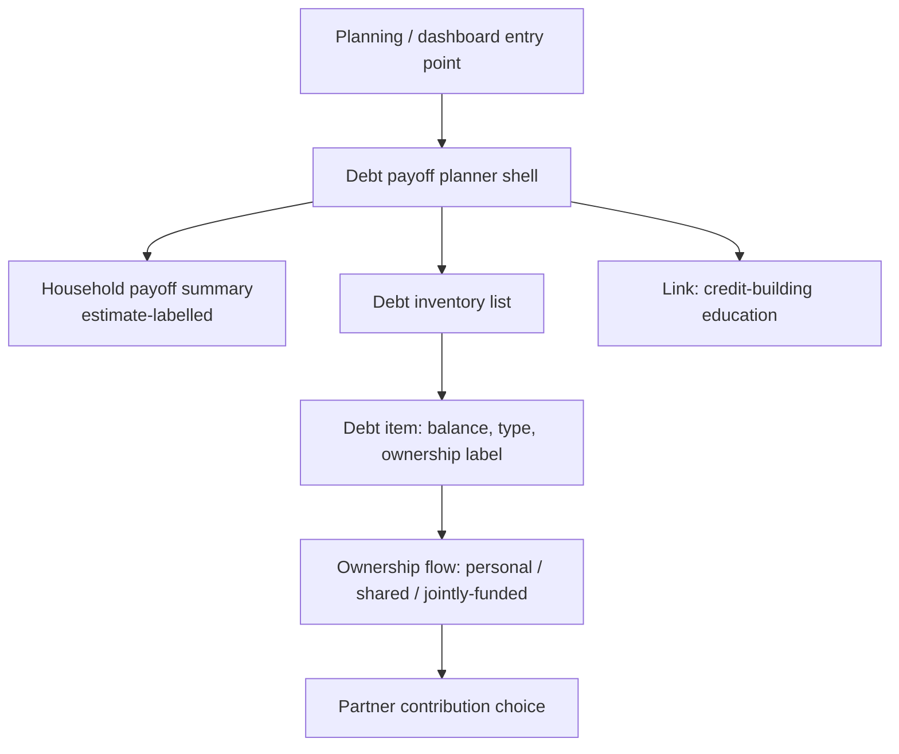
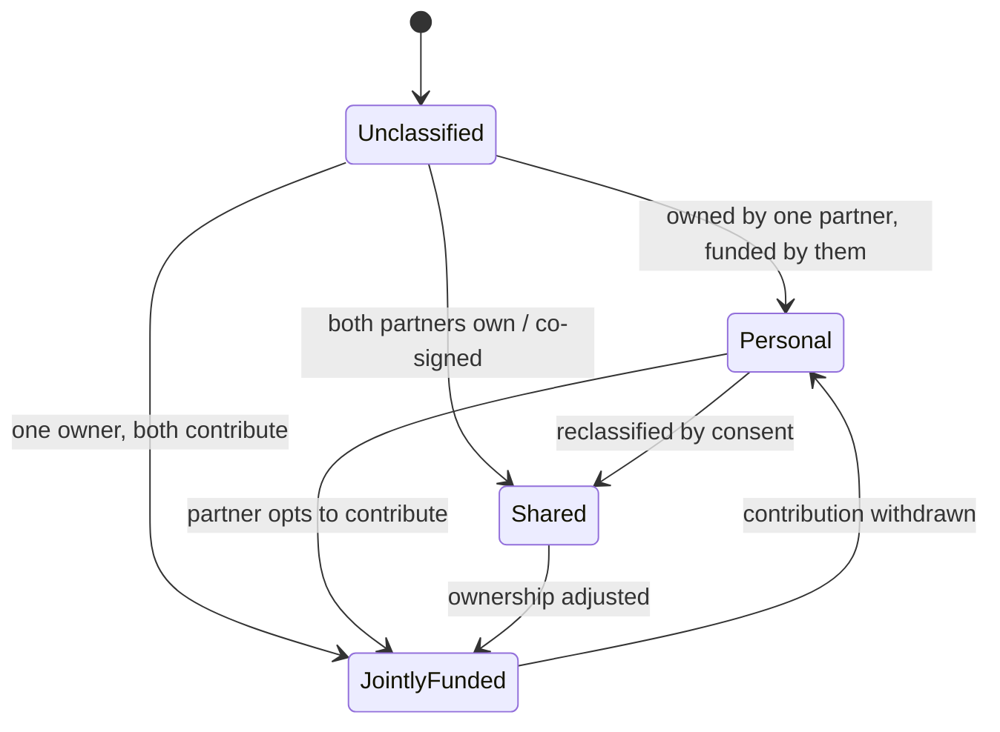

# Android Joint Debt Payoff Planner Shell & Debt Ownership Flow

> **Status:** PROPOSED — Pending human review
> **Issue:** [#2656](https://github.com/jrmoulckers/finance/issues/2656) · Part of [#2153](https://github.com/jrmoulckers/finance/issues/2153)
> **Platform:** Android (Jetpack Compose, Material 3)
> **Last Updated:** 2026-06-22
> **Design only:** Native implementation remains blocked by [#1242](https://github.com/jrmoulckers/finance/issues/1242)

---

## Table of Contents

1. [Purpose](#purpose)
2. [Persona and Why This Matters](#persona-and-why-this-matters)
3. [Goals and Non-Goals](#goals-and-non-goals)
4. [Scope Boundaries With Sibling Work](#scope-boundaries-with-sibling-work)
5. [Payoff Math Lives in KMP](#payoff-math-lives-in-kmp)
6. [Planner Shell and Entry Points](#planner-shell-and-entry-points)
7. [Debt Inventory and Ownership Classification](#debt-inventory-and-ownership-classification)
8. [Personal / Shared / Jointly-Funded States](#personal--shared--jointly-funded-states)
9. [Plain-Language Copy](#plain-language-copy)
10. [Accessibility Considerations](#accessibility-considerations)
11. [Offline, Empty, and Error States](#offline-empty-and-error-states)
12. [Test Plan](#test-plan)
13. [Implementation Readiness](#implementation-readiness)
14. [References](#references)

---

## Purpose

Debt is sensitive, and shared debt doubly so. A couple needs to **see their
liabilities in one place**, label each one as **personal, shared, or
jointly-funded**, decide **who contributes** to paying it off, and do all of that
without exposing a partner's private debt they never agreed to share. This
document designs the Android Compose **debt payoff planner shell** and the **debt
ownership flow**: entry points, the debt inventory, ownership classification, and
the personal vs. jointly-funded states — using the web `DebtPage` payoff planner as
the parity reference.

It is **design and breakdown only** while
[#1242](https://github.com/jrmoulckers/finance/issues/1242) gates Google Play
distribution. No Kotlin is written here, and no payoff math is implemented in
Compose — that logic is a **shared KMP concern**, with the web debt engines as the
parity reference.

---

## Persona and Why This Matters

The persona ([#2153](https://github.com/jrmoulckers/finance/issues/2153)): a
household managing a mix of **personal** debts (one partner's student loan, a
pre-relationship card) and **shared** debts (a joint card, a co-signed loan), some
of which both partners **fund jointly** even when only one "owns" them. They need
a clear, non-judgmental inventory and explicit, consent-driven ownership labels —
not an interface that outs someone's private balance. This intersects with
[Persona 3 (household / couples)](personas.md), the privacy foundation in
[android-household-privacy-dashboard.md](android-household-privacy-dashboard.md),
and debt education in
[android-credit-building-education.md](android-credit-building-education.md).

> **Important framing:** payoff dates, interest-saved figures, and method
> comparisons (avalanche vs. snowball) are **estimates**, visibly labelled as such.
> This surface plans the household's _own_ payoff; it is not debt counseling,
> consolidation advice, or a credit decision.

---

## Goals and Non-Goals

**Goals**

- Define the **payoff planner shell**: entry points, top-level structure, and how
  the debt inventory and planner outputs fit together.
- Define Compose screens for a **debt inventory**, **ownership labels**, and
  **partner contribution choices**.
- Document how liabilities map to **personal / shared / jointly-funded** debt, as a
  rendering of shared classification — not Compose-side logic.
- Provide **empty-state guidance** and **privacy copy** for sensitive debts so a
  partner's private liability is never exposed without consent.
- Keep parity with the web `DebtPage` payoff-planner behavior.

**Non-Goals**

- Implementing or editing payoff math — avalanche/snowball ordering, payoff dates,
  interest projections (lives in KMP `packages/core`; the web debt engines are the
  parity reference — see [Payoff Math Lives in KMP](#payoff-math-lives-in-kmp)).
- The full payoff-strategy comparison UI and amortization detail — this issue is the
  **shell and ownership flow**; deeper planner surfaces are downstream siblings.
- The household visibility/RBAC policy itself — owned by
  [android-household-privacy-dashboard.md](android-household-privacy-dashboard.md).
- Credit-building education content — owned by
  [android-credit-building-education.md](android-credit-building-education.md) and
  [android-secured-card-tracking.md](android-secured-card-tracking.md).
- Editing KMP `packages/*`, web, or any non-Android platform.

---

## Scope Boundaries With Sibling Work

This doc owns the **shell, inventory, and ownership flow**. What each partner is
allowed to see about a sensitive debt is the privacy dashboard; the actual payoff
arithmetic is shared KMP. Education and secured-card tracking are separate
surfaces this shell can link to.

---

## Payoff Math Lives in KMP

Payoff ordering, projected payoff dates, and interest-saved comparisons are
**business logic** and must be shared, not duplicated in Compose. The web
references already exist —
[`debt-payoff-engine.ts`](../../apps/web/src/lib/debt-payoff-engine.ts),
[`debt-types.ts`](../../apps/web/src/lib/debt-types.ts), and
[`debt-progress-rings.ts`](../../apps/web/src/lib/debt/debt-progress-rings.ts) —
and drive the web [`DebtPage.tsx`](../../apps/web/src/pages/DebtPage.tsx). The
Android client consumes an **equivalent shared model from KMP `packages/core`** so
both platforms agree on every payoff number and every ownership classification.

> This document **describes** the boundary. It does **not** implement KMP changes —
> `packages/core` is owned by @native-app-engineer and the web engines by @web-engineer.
> Compose is a pure renderer of shared state. The existing
> [`Liability`](../../packages/models/src/commonMain/kotlin/com/finance/models/Liability.kt)
> model already carries `householdId`, `ownerId`, `type`, `remainingBalance`,
> `originalAmount`, and `status`, with
> [`LiabilityInstallment`](../../packages/models/src/commonMain/kotlin/com/finance/models/LiabilityInstallment.kt)
> for schedules — those are the inputs a shared classification and payoff model
> needs. Ownership and split logic are **never** baked into UI-only code.

---

## Planner Shell and Entry Points

The shell is the top-level container that hosts the inventory and surfaces the
shared payoff summary. It is a new Compose screen reachable from planning and
dashboard entry points; it does not replace existing screens.

- The shell shows a **household payoff summary** (estimate-labelled) only over the
  debts the viewer is permitted to see; private debts are excluded from both the
  list and the totals.
- Entry points reuse the existing planning surfaces (for example
  [`PlanningScreen`](../../apps/android/src/main/kotlin/com/finance/android/ui/screens/PlanningScreen.kt))
  and follow [information-architecture.md](information-architecture.md) for
  placement and navigation.
- Cards, lists, and chips reuse [component-library.md](component-library.md);
  progress rings follow [chart-component-specs.md](chart-component-specs.md).

---

## Debt Inventory and Ownership Classification

The inventory is a list of liabilities, each rendered with its balance, type, and
an ownership label produced by the shared classifier.

| Liability type (`LiabilityType`) | Example                     | Notes                                  |
| -------------------------------- | --------------------------- | -------------------------------------- |
| `LOAN`                           | Student loan, auto loan     | May be personal or co-signed/shared    |
| `CREDIT_LINE`                    | Credit card, line of credit | Often the joint-vs-personal decision   |
| `BNPL`                           | Buy-now-pay-later plan      | Installment schedule from shared model |
| `OTHER`                          | Anything not above          | Falls back to generic copy             |

- The **ownership label** is read from the shared classifier; Compose renders it and
  offers a consent-driven way to change it. The transition is persisted through the
  shared layer, not decided in Compose.
- A reclassification that exposes a debt to a partner requires **explicit consent**
  and follows the privacy model in
  [android-household-privacy-dashboard.md](android-household-privacy-dashboard.md).

---

## Personal / Shared / Jointly-Funded States

| State              | Who owns it         | Who funds payoff         | Visibility default                               |
| ------------------ | ------------------- | ------------------------ | ------------------------------------------------ |
| **Personal**       | One partner         | The owner                | Private to the owner unless they choose to share |
| **Shared**         | Both partners       | Both, per agreement      | Visible to both                                  |
| **Jointly-funded** | One partner (owner) | Both partners contribute | Owner controls how much detail the partner sees  |

- **Personal & private:** appears only for the owner. The partner's planner totals
  simply do not include it; there is no placeholder hinting it exists.
- **Shared:** both partners see the debt and the planner attributes payoff progress
  to the household.
- **Jointly-funded:** the owner keeps ownership but the partner contributes; the
  **partner contribution choice** (a percentage, a fixed amount, or "as we go") is a
  shared input the surface renders, never a Compose computation.
- All payoff figures and method comparisons shown in these states are **estimates**,
  explicitly labelled.

---

## Plain-Language Copy

Copy is part of the product here, and tone is critical for debt. Every string below
is a placeholder for a localized, resource-backed string and follows
[content-language-guidelines.md](content-language-guidelines.md).

| Context                     | Plain-language copy (example)                                    |
| --------------------------- | ---------------------------------------------------------------- |
| Household payoff summary    | "About $14,200 left across your shared debts (estimate)"         |
| Personal label              | "Personal — only you can see this"                               |
| Shared label                | "Shared — you and your partner"                                  |
| Jointly-funded label        | "Yours, funded together"                                         |
| Reclassify consent prompt   | "Share this debt with your partner? They'll see its balance."    |
| Partner contribution        | "How would you like to split paying this off?"                   |
| Empty inventory             | "No debts tracked yet. Add one to plan a payoff — at your pace." |
| Sensitive-debt privacy note | "Private debts stay private. Your partner won't see these."      |

**Copy rules**

- **Non-judgmental and non-shaming:** debt is normal; the surface helps plan, it
  never lectures or ranks partners.
- **Consent before exposure:** any action that reveals a debt to a partner says so
  plainly before it happens.
- Always pair payoff dates and interest-saved figures with "about"/"around" or an
  explicit estimate label.
- Never frame this as advice, consolidation, or a credit recommendation.

---

## Accessibility Considerations

- **TalkBack:** each debt item exposes one cohesive `contentDescription` ("Auto
  loan, about $8,400 remaining, shared, on track to be paid off around March 2028,
  estimate"). Ownership labels and the contribution-choice control each carry their
  own label. Private debts are never announced on a partner's device.
- **Switch Access:** add-debt, reclassify, and contribution-choice affordances are
  reachable and operable with touch targets ≥ 48dp.
- **Font scaling:** balances, ownership labels, and payoff estimates stay readable
  and unclipped at **200%** font scale; no fixed-height rows around amounts.
- **Non-color cues:** ownership state and payoff progress use text, icon, and shape,
  never color alone, per [data-visualization.md](data-visualization.md).
- **Plain language / cognitive load:** one debt per row, clear ownership label,
  estimate-first honesty, aligned with
  [cognitive-accessibility.md](cognitive-accessibility.md).
- See [accessibility-patterns.md](accessibility-patterns.md) for the underlying
  screen-reader, focus, and touch-target patterns.

---

## Offline, Empty, and Error States

- **Offline:** the inventory and payoff summary render from already-synced
  liabilities, so the shell works fully **offline** using the last-known shared
  summary; show data freshness rather than blocking. Edits queue and sync later.
- **Empty (no debts):** show a supportive empty state ("No debts tracked yet. Add
  one to plan a payoff — at your pace.") rather than a blank screen; never imply the
  user _should_ have debt.
- **Empty (partner has private debts):** the viewer simply sees only their permitted
  set; the surface never hints that hidden debts exist.
- **Conflict:** if both partners edit a shared debt or its ownership offline, defer
  to the shared `ConflictStrategy.resolverFor()` outcome and show a quiet "updated
  from your partner's device" note; Compose never invents a merge.
- **Error:** if the shared payoff summary cannot be produced, fail safe to raw
  balances per debt with a quiet "Payoff estimate unavailable right now" — never a
  stack trace, never a blank screen.

---

## Test Plan

| Layer              | Tooling                         | What it verifies                                                                                   |
| ------------------ | ------------------------------- | -------------------------------------------------------------------------------------------------- |
| Unit               | JUnit                           | ViewModel maps shared summary → UI state for personal / shared / jointly-funded.                   |
| Unit (privacy)     | JUnit                           | A partner's private debt never appears in the other partner's list or totals.                      |
| Unit (safety)      | JUnit                           | No Timber call logs balances, providers, payoff dates, or ownership of sensitive debts.            |
| Compose UI         | `createComposeRule` + semantics | Inventory rows, ownership labels, summary, and contribution control resolve `contentDescription`.  |
| Compose UI         | `createComposeRule`             | Reclassify flow requires explicit consent before exposing a debt to a partner.                     |
| Snapshot           | Paparazzi                       | Inventory + ownership states (personal / shared / jointly-funded) + empty at {1x, 2x}, light/dark. |
| Pseudolocalization | `en-XA` / `ar-XB`               | Copy expansion and RTL mirroring for labels and consent prompts.                                   |
| Accessibility      | Espresso/Accessibility checks   | TalkBack order, Switch Access reachability, touch targets ≥ 48dp.                                  |

---

## Implementation Readiness

This is a design artifact. Execution splits into a **buildable-now** tier and a
**Play-distribution tail** gated by
[#1242](https://github.com/jrmoulckers/finance/issues/1242). See
[../ops/human-gated-prerequisites.md](../ops/human-gated-prerequisites.md) and
[../ops/launch-readiness-plan.md](../ops/launch-readiness-plan.md).

**Buildable now — `assembleDebug` + sideload (no human gate):**

- Build the planner shell, debt inventory, ownership flow, and partner-contribution
  control as Compose surfaces rendering a shared payoff + classification summary
  (mock/in-memory data while KMP wiring lands).
- Verify ownership states, consent-driven reclassification, sensitive-debt privacy,
  accessibility, and pseudolocale/expansion snapshots on a debug build / emulator.
- All of this runs on an emulator with **no signing, store credentials, or
  human-gated operations**.

**Play-distribution tail — human-gated by [#1242](https://github.com/jrmoulckers/finance/issues/1242):**

- Production signing + Play Console listing.
- Any store-level data-safety declaration touching sensitive debt / household
  financial data.
- Staged rollout / internal testing track.

The shared payoff and classification model is delivered by KMP `packages/core` (the
web `DebtPage` and debt engines are the parity reference); Compose stays
render-only.

---

## References

**Design docs**

- [android-household-privacy-dashboard.md](android-household-privacy-dashboard.md) — visibility policy for sensitive debts (#2640)
- [android-credit-building-education.md](android-credit-building-education.md) — debt/credit education content
- [android-secured-card-tracking.md](android-secured-card-tracking.md) — credit-building accounts
- [android-shared-goal-contributors.md](android-shared-goal-contributors.md) — sibling household contribution flow (#2649)
- [content-language-guidelines.md](content-language-guidelines.md) — non-judgmental, plain copy
- [cognitive-accessibility.md](cognitive-accessibility.md) — plain-language and load reduction
- [accessibility-patterns.md](accessibility-patterns.md) — screen reader, focus, touch targets
- [data-visualization.md](data-visualization.md) — progress visuals, non-color cues
- [chart-component-specs.md](chart-component-specs.md) — progress ring/bar specs
- [component-library.md](component-library.md) — list, chip, and card components
- [information-architecture.md](information-architecture.md) — surface and navigation map
- [ux-principles.md](ux-principles.md) — product UX principles
- [personas.md](personas.md) — household / couples persona

**Ops**

- [../ops/human-gated-prerequisites.md](../ops/human-gated-prerequisites.md) — buildable-now vs. gated split
- [../ops/launch-readiness-plan.md](../ops/launch-readiness-plan.md) — launch checklist

**Android / web / KMP (read-only boundary)**

- [`DebtPage.tsx`](../../apps/web/src/pages/DebtPage.tsx) — web payoff-planner parity reference (owned by @web-engineer)
- [`debt-payoff-engine.ts`](../../apps/web/src/lib/debt-payoff-engine.ts) — payoff math parity
- [`debt-types.ts`](../../apps/web/src/lib/debt-types.ts) — debt classification types
- [`debt-progress-rings.ts`](../../apps/web/src/lib/debt/debt-progress-rings.ts) — payoff progress visuals parity
- [`PlanningScreen.kt`](../../apps/android/src/main/kotlin/com/finance/android/ui/screens/PlanningScreen.kt) — candidate entry-point host
- [`Liability.kt`](../../packages/models/src/commonMain/kotlin/com/finance/models/Liability.kt) — shared liability model (owned by @native-app-engineer)
- [`LiabilityInstallment.kt`](../../packages/models/src/commonMain/kotlin/com/finance/models/LiabilityInstallment.kt) — installment schedule model
- [`DataPartitioning.kt`](../../packages/core/src/commonMain/kotlin/com/finance/core/household/DataPartitioning.kt) — shared visibility/partition rules

**Issues**

- [#2656](https://github.com/jrmoulckers/finance/issues/2656) — this issue
- [#2153](https://github.com/jrmoulckers/finance/issues/2153) — parent (joint debt cluster)
- [#1242](https://github.com/jrmoulckers/finance/issues/1242) — Play Console + keystore (gate)
