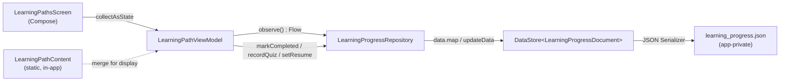
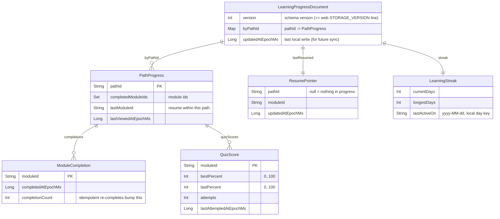
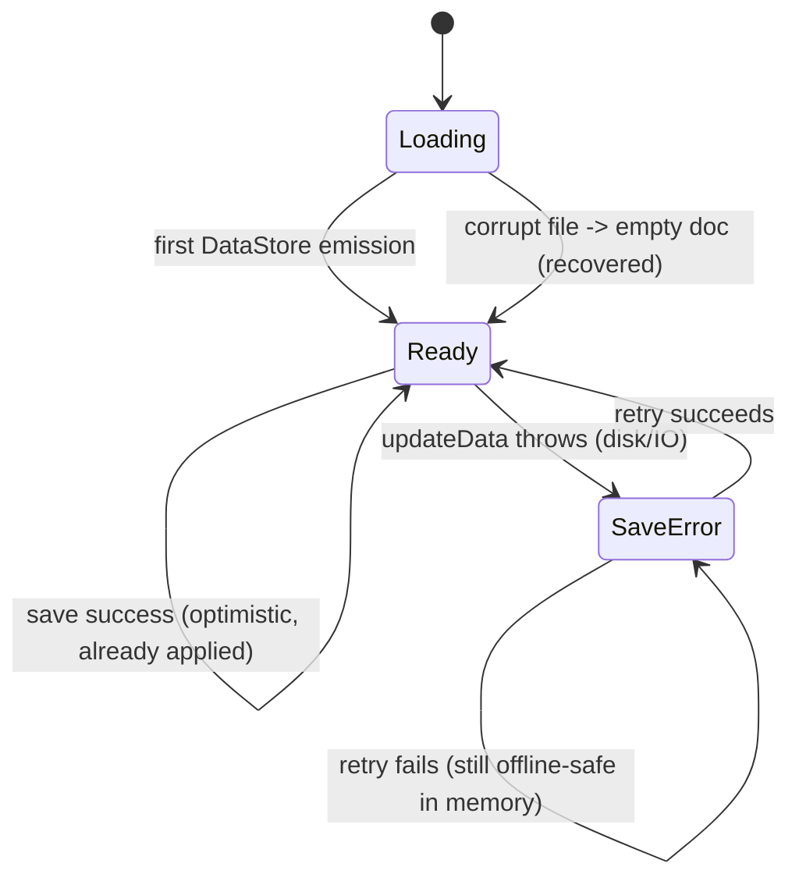
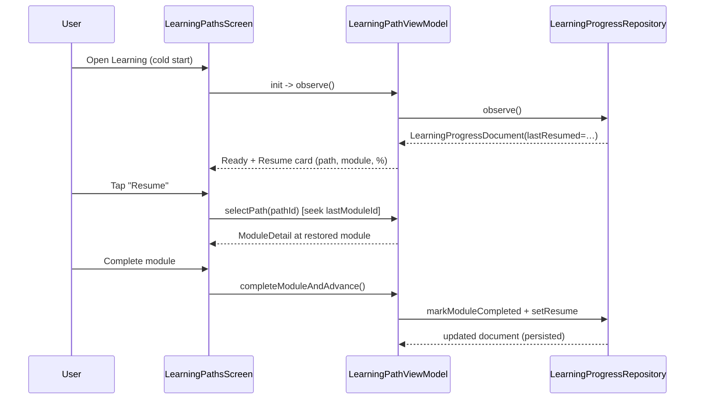

# Android Learning Progress Persistence — Design

> **Status:** DRAFT — Pending human review
> **Last Updated:** 2026-06-21
> **Owner:** @android-engineer
> **Issue:** [#2667](https://github.com/jrmoulckers/finance/issues/2667) · Part of #2208
> **Related:** [Data Model](./data-model.md) · [Human-Gated Prerequisites Runbook](../ops/human-gated-prerequisites.md)

## Summary

The Android learning paths feature (#382) currently keeps a user's progress **in memory only**.
Every quiz score, completed module, and "where I left off" pointer is discarded the moment the
process is killed or the app is swept from the background. This document specifies a local,
offline-first persistence layer so that progress survives process death, app restarts, and device
reboots — and is ready to plug into cross-device sync later.

The design deliberately **reuses the existing web learning business rules** rather than re-deriving
them in Compose. The web app already ships a versioned, well-tested progress model
([`apps/web/src/lib/learning/progress.ts`](../../apps/web/src/lib/learning/progress.ts) and
[`types.ts`](../../apps/web/src/lib/learning/types.ts)); Android adopts the same shape and semantics
so the two platforms stay behaviourally consistent.

## Table of Contents

- [Goals and Non-Goals](#goals-and-non-goals)
- [Current State (In-Memory)](#current-state-in-memory)
- [Reuse of Existing Web Behaviour](#reuse-of-existing-web-behaviour)
- [Persistence Design](#persistence-design)
  - [Storage Choice: DataStore](#storage-choice-datastore)
  - [Persisted Schema](#persisted-schema)
  - [Repository Contract](#repository-contract)
  - [Serialization and Versioning](#serialization-and-versioning)
  - [Encryption and Privacy](#encryption-and-privacy)
- [Migration Behaviour](#migration-behaviour)
- [Offline-First ViewModel States](#offline-first-viewmodel-states)
- [Resume / Pick-Up-Where-You-Left-Off](#resume--pick-up-where-you-left-off)
- [UI Requirements](#ui-requirements)
- [Koin Wiring](#koin-wiring)
- [Testing Plan](#testing-plan)
- [Implementation Readiness](#implementation-readiness)
- [Open Questions](#open-questions)
- [References](#references)

## Goals and Non-Goals

**Goals**

- Persist learning path/module completion, quiz scores, current position, and resume state across
  process death and reboots.
- Define a local repository + DataStore schema with explicit **migration behaviour** from the
  current in-memory state and across future schema versions.
- Specify offline-first **load / save / error** states for `LearningPathViewModel`.
- Specify **resume card** and **path progress restoration** UI requirements (TalkBack-complete).
- Reuse the shared/web progress model and business rules; avoid duplicating logic in Compose.

**Non-Goals**

- Cross-device cloud sync of learning progress (a follow-up; see
  [Open Questions](#open-questions)). The schema is sync-ready but sync is out of scope here.
- Any change to learning **content** (`LearningPathContent`) or quiz authoring.
- Release signing, Play Store upload, or any distribution work — gated by #1242 and explicitly out of
  scope (see [Implementation Readiness](#implementation-readiness)).
- Editing shared `packages/`, the web app, or other platform clients.

## Current State (In-Memory)

[`LearningPathViewModel`](../../apps/android/src/main/kotlin/com/finance/android/ui/learning/LearningPathViewModel.kt)
holds everything in a single `MutableStateFlow<LearningUiState>`:

```kotlin
data class LearningUiState(
    val paths: List<LearningPath> = emptyList(),
    val progress: Map<String, LearningProgress> = emptyMap(), // ← lost on process death
    val selectedPathId: String? = null,
    val currentModuleIndex: Int = 0,
    val quizAnswer: Int = -1,
    val quizSubmitted: Boolean = false,
)
```

Progress itself is modelled by
[`LearningProgress`](../../apps/android/src/main/kotlin/com/finance/android/ui/learning/LearningPathContent.kt):

```kotlin
data class LearningProgress(
    val pathId: String,
    val completedModuleIds: Set<String> = emptySet(),
    val quizScores: Map<String, Float> = emptyMap(), // 0.0..1.0 per module
)
```

The ViewModel's own KDoc already flags the gap: _"Progress is kept in-memory for now; persistence
will be added when the sync layer is wired."_ This design fills that gap.

**What is lost today:** completed modules, quiz scores, and the last-viewed module — i.e. all
durable progress. `selectedPathId`, `currentModuleIndex`, `quizAnswer`, and `quizSubmitted` are
ephemeral **navigation/UI** state (correctly transient), but the user has no way to resume a path
after leaving the screen.

## Reuse of Existing Web Behaviour

The web app is the **reference implementation** for learning-progress semantics. Android matches it
field-for-field so both clients compute completion, scores, and resume state identically.

| Concept              | Web (`progress.ts` / `types.ts`)                   | Android (this design)                             |
| -------------------- | -------------------------------------------------- | ------------------------------------------------- |
| Document root        | `LearningProgressState { version, ... }`           | `LearningProgressDocument { version, ... }`       |
| Completion set       | `completedLessonIds: string[]`                     | `completedModuleIds: Set<String>` (per path)      |
| Completion metadata  | `completions: Record<id, LessonCompletion>`        | `completions: Map<String, ModuleCompletion>`      |
| Quiz scores          | `quizScores: Record<id, QuizScore>` (0–100)        | `quizScores: Map<String, QuizScore>` (0–100)      |
| Streak               | `streak: LearningStreak`                           | `streak: LearningStreak`                          |
| Versioned + fallback | `STORAGE_VERSION`, try/parse → empty on corrupt    | `version`, `corruptValueHandler` → empty document |
| Save semantics       | Pure reducers (`markLessonCompleted`, …) + persist | Same reducer shape, ported to Kotlin in the repo  |

**Rules that MUST NOT be re-invented in Compose:**

- Quiz score normalisation (`0..100`, rounded; keep `bestPercent` vs `lastPercent`, `attempts`).
- Completion idempotency (re-completing a module bumps a counter, never duplicates the id).
- Streak/day-boundary calculation.
- Module/overview roll-ups (`completionPercent`, `bestQuizPercent`).

These live as pure, unit-tested functions. Where the rule is genuinely shared cross-platform, the
preferred long-term home is the KMP `packages/` layer (owned by @kmp-engineer) so a single source of
truth feeds both web and Android. **Until that shared module exists, Android ports the web reducers
verbatim into the repository layer** — never spread across Composables. This keeps the door open to
delete the Kotlin copy once `packages/` exposes a common `LearningProgress` API, without touching UI.

> **Note on score scale:** the in-memory Android model stores quiz scores as `Float` `0.0..1.0`,
> while web uses integer percent `0..100`. The persisted schema standardises on the **web scale
> (`0..100`)** for cross-platform parity; the migration step ([below](#migration-behaviour))
> converts any legacy in-memory `0.0..1.0` value by `round(value * 100)`.

## Persistence Design

### Storage Choice: DataStore

Jetpack **DataStore** (typed/`DataStore<T>`) is the right primitive for this data:

- It is a **single, small, document-shaped** blob (one user's progress), not a relational/queryable
  dataset — DataStore fits better than a SQLDelight table here.
- DataStore is **transactional, async, and Flow-based**, so it maps cleanly onto `StateFlow` UI and
  avoids the `SharedPreferences`-on-main-thread pitfalls. (We use typed DataStore, **not**
  `SharedPreferences`.)
- It supports a **`corruptionHandler`** for graceful recovery, mirroring the web's
  try/parse → empty fallback.

We use a **typed `DataStore<LearningProgressDocument>`** backed by a `kotlinx.serialization` JSON
`Serializer` (no protobuf toolchain needed, and the on-disk JSON mirrors the web's localStorage
document for easy cross-platform reasoning and debugging).



> **Why not SQLDelight here?** The app's encrypted [SQLDelight database](./data-model.md) is the home
> for **syncable, relational, multi-row** entities (accounts, transactions, budgets…). Learning
> progress is a single per-user document with no cross-row queries. If/when learning progress becomes
> a **synced** entity, it can be promoted to a SQLDelight table that follows the data-model sync
> conventions (`created_at`, `updated_at`, `deleted_at`, `sync_version`, `household_id`) without any
> UI change — the `LearningProgressRepository` interface is the seam.

### Persisted Schema



Kotlin shape (serialized form), kept structurally aligned with the web `LearningProgressState`:

```kotlin
@Serializable
data class LearningProgressDocument(
    val version: Int = SCHEMA_VERSION,
    val byPathId: Map<String, PathProgress> = emptyMap(),
    val lastResumed: ResumePointer? = null,
    val streak: LearningStreak = LearningStreak(),
    val updatedAtEpochMs: Long = 0L,
)

@Serializable
data class PathProgress(
    val pathId: String,
    val completedModuleIds: Set<String> = emptySet(),
    val completions: Map<String, ModuleCompletion> = emptyMap(),
    val quizScores: Map<String, QuizScore> = emptyMap(),
    val lastModuleId: String? = null,
    val lastViewedAtEpochMs: Long = 0L,
)

@Serializable
data class ResumePointer(val pathId: String, val moduleId: String, val updatedAtEpochMs: Long)
```

The existing display-only `LearningProgress` data class is reconstructable from `PathProgress` (so
`PathCard`/`ModuleDetailContent` keep their current props), but the durable store keeps the richer
web-aligned fields (`completions`, `bestPercent`/`lastPercent`/`attempts`, streak, resume pointer).

### Repository Contract

A single repository is the seam between the ViewModel and DataStore. It exposes a reactive `Flow`
and intent-style suspend functions; the **business rules (reducers) live here**, ported from web —
not in the ViewModel or Composables.

```kotlin
interface LearningProgressRepository {
    /** Cold-then-hot stream of the full document; emits the empty doc before first write. */
    fun observe(): Flow<LearningProgressDocument>

    suspend fun markModuleCompleted(pathId: String, moduleId: String)
    suspend fun recordQuizScore(pathId: String, moduleId: String, percent: Int)
    suspend fun setResume(pathId: String, moduleId: String)
    suspend fun clearResume()

    /** One-time import of legacy in-memory state on first run after rollout (see Migration). */
    suspend fun importLegacyInMemory(progress: Map<String, LearningProgress>)
}
```

`DataStoreLearningProgressRepository` implements this with `dataStore.data` (for `observe()`) and
`dataStore.updateData { current -> reducer(current) }` for atomic read-modify-write. Every write
sets `updatedAtEpochMs` and updates the `streak` via the ported streak reducer.

### Serialization and Versioning

- **Format:** `kotlinx.serialization` JSON via a custom `Serializer<LearningProgressDocument>`.
- **Version field:** `version` mirrors the web `STORAGE_VERSION` (currently `1`). All new fields are
  added with safe defaults so old documents deserialize forward without a hard migration.
- **Forward migrations:** a `migrate(doc)` step runs after read; for additive changes it is a no-op
  because defaults fill the gaps. Breaking changes bump `SCHEMA_VERSION` and add an explicit
  `when (doc.version) { … }` upgrade branch (documented inline, one branch per version).
- **Corruption recovery:** the DataStore `corruptionHandler` (`ReplaceFileCorruptionHandler`) returns
  `LearningProgressDocument()` (empty) on `SerializationException`, exactly matching the web's
  try/parse → `createEmptyLearningProgress()` behaviour. The event is logged via `Timber.w` **without
  any progress values** (no content, no scores logged).

### Encryption and Privacy

- Learning progress contains **no sensitive financial data** (no balances, account numbers, or
  amounts) — only educational completion/score metadata. It is therefore **not** subject to the
  "never log financial data" rule for its values, but we still avoid logging score contents to keep
  logs minimal.
- The DataStore file lives in **app-private internal storage** (not world-readable, excluded from
  cloud auto-backup for this file).
- If a future security review wants progress at-rest encryption on par with the financial DB, the
  repository can be re-pointed at the existing SQLCipher-backed
  [SQLDelight database](../../apps/android/src/main/kotlin/com/finance/android/di/DataModule.kt)
  without UI changes (the interface is the boundary). Default for v1: plain app-private DataStore.

## Migration Behaviour

There are **two** migration concerns; both are explicit.

**1. From current in-memory state → DataStore (one-time, on rollout).**
Because progress is in-memory today, there is no persisted legacy file to read — on the very first
launch after this ships, `observe()` emits the empty document and seeds it. However, to avoid losing
progress a user accrued **within the current session** at the moment the build updates in-process
(e.g. hot-applied via a future in-app update), the ViewModel calls
`importLegacyInMemory(currentUiState.progress)` exactly once if the persisted document is empty and
in-memory progress is non-empty. The mapping:

| In-memory (`LearningProgress`)         | Persisted (`PathProgress`)                                 |
| -------------------------------------- | ---------------------------------------------------------- |
| `pathId`                               | `pathId`                                                   |
| `completedModuleIds: Set<String>`      | `completedModuleIds` + one `ModuleCompletion` per id       |
| `quizScores: Map<String, Float>` (0–1) | `quizScores: Map<String, QuizScore>` with `round(v * 100)` |
| _(no resume pointer existed)_          | `lastModuleId = null`, `lastResumed = null`                |

The import is **idempotent and guarded** (`if persisted.byPathId.isEmpty()`), so it never overwrites
real persisted progress on subsequent launches.

**2. Across schema versions (ongoing).**
Handled by the `version` field + `migrate()` step described in
[Serialization and Versioning](#serialization-and-versioning): additive fields use defaults; breaking
changes add an explicit upgrade branch and bump `SCHEMA_VERSION`. Corruption falls back to an empty
document rather than crashing.

## Offline-First ViewModel States

Learning progress is **inherently offline**: content is bundled in the app and all reads/writes hit
local DataStore. "Offline-first" therefore means **local DataStore is the source of truth** and there
is **no network on the critical path**; any future cloud sync is a best-effort enhancement layered on
top, reconciled by `updatedAtEpochMs`/`sync_version`. Error states concern **disk I/O and
serialization**, not connectivity.

`LearningPathViewModel` gains an explicit load/save status alongside the existing UI state:

```kotlin
sealed interface ProgressStatus {
    data object Loading : ProgressStatus                 // first emission pending
    data object Ready : ProgressStatus                   // observing DataStore
    data class SaveError(val retry: suspend () -> Unit) : ProgressStatus // last write failed
}
```



**Load**

- On init, the ViewModel collects `repository.observe()`. `ProgressStatus.Loading` shows skeletons/
  placeholders until the first emission, then `Ready`.
- A corrupt file resolves to the empty document via the corruption handler → still reaches `Ready`
  (recovered), never an error screen.

**Save (optimistic, offline-safe)**

- User actions (`completeModuleAndAdvance`, `submitQuiz`, opening a module) update the in-memory
  `StateFlow` **immediately** for a responsive UI, then call the repository to persist.
- Because writes are local, they succeed even with no network. There is no spinner-blocking on save.

**Error**

- If a DataStore write throws (e.g. disk full, I/O error), the in-memory state is **kept** (so the
  user is not blocked), and `ProgressStatus.SaveError` exposes a `retry`. The UI shows a dismissible,
  non-modal message ("Couldn't save your progress — we'll retry"). A bounded auto-retry runs on the
  next successful write; the manual retry is also offered.
- Errors are logged with `Timber.w`/`Timber.e` (message/exception only — **no progress values**),
  never `Log.*`.

## Resume / Pick-Up-Where-You-Left-Off

Two granularities of "resume" are persisted:

1. **Global resume pointer** (`lastResumed: ResumePointer?`) — the single most-recent path+module the
   user was in, powering the top-level **Resume card**. Updated whenever a module detail view opens.
2. **Per-path resume** (`PathProgress.lastModuleId`) — so re-entering any path lands on the last
   module viewed in _that_ path, not always module 0.

On `selectPath(pathId)`, the ViewModel computes the initial `currentModuleIndex` from
`PathProgress.lastModuleId` (falling back to the first incomplete module, then index 0) instead of
hardcoding `0`. The ephemeral `currentModuleIndex`/`quizAnswer`/`quizSubmitted` remain transient UI
state and are **not** persisted; only the durable `lastModuleId`/`lastResumed` pointers are.



## UI Requirements

All learning Composables already follow the `contentDescription`/`semantics` conventions in
[`LearningPathsScreen.kt`](../../apps/android/src/main/kotlin/com/finance/android/ui/learning/LearningPathsScreen.kt);
the additions below MUST match that bar (Material 3, dynamic color, TalkBack-complete, font-scaling
safe).

### Resume Card

- Rendered at the **top of `PathListContent`** when `lastResumed != null`, above the path list.
- Shows: path icon + title, the module title to resume, a `LinearProgressIndicator` of that path's
  completion percent, and a primary **"Resume"** action.
- Hidden entirely when there is nothing in progress (`lastResumed == null`) — no empty placeholder.
- **Accessibility:** a single merged `contentDescription`, e.g.
  _"Resume Budgeting Basics, module The 50/30/20 Rule, 33 percent complete. Double-tap to continue."_
  The progress bar is decorative once described (`Modifier.clearAndSetSemantics {}` on the bar, with
  the percent carried in the card description). Tap target ≥ 48dp; respects large font scales without
  truncation (text wraps, no fixed heights).

### Path Progress Restoration

- `PathCard` already renders `completionPercent`; after persistence it reflects **restored** progress
  on cold start (no behavioural change to the card, just real data behind it).
- Completed-module checkmarks and quiz "best score" indicators in `ModuleDetailContent` restore from
  the persisted document, not session memory.
- While `ProgressStatus.Loading`, show neutral skeleton/placeholder progress (0% with a
  `contentDescription` of "Loading your progress") rather than flashing 0% as if reset.
- **Save error surface:** a non-modal `Snackbar`/inline message with a "Retry" action, announced
  politely to TalkBack (assertive only on explicit retry failure). Never blocks navigation.

## Koin Wiring

Follows the existing module conventions in
[`AppModule.kt`](../../apps/android/src/main/kotlin/com/finance/android/di/AppModule.kt) /
[`DataModule.kt`](../../apps/android/src/main/kotlin/com/finance/android/di/DataModule.kt):

```kotlin
// In a data/learning module (or AppModule), single-bound so all consumers share one source of truth.
single<DataStore<LearningProgressDocument>> { createLearningProgressDataStore(androidContext()) }
single<LearningProgressRepository> { DataStoreLearningProgressRepository(get()) }

// LearningPathViewModel gains the repository dependency:
viewModelOf(::LearningPathViewModel) // ctor: (LearningProgressRepository)
```

The DataStore instance is an **app-scoped singleton** (one file, one writer) — critical, since
multiple DataStore instances over the same file throw at runtime.

## Testing Plan

- **Repository unit tests** (port the web `progress.test.ts` cases): completion idempotency, quiz
  `bestPercent` vs `lastPercent` and `attempts`, streak day-boundary math, version/corruption
  fallback to empty, legacy import mapping (incl. `0.0..1.0 → 0..100`).
- **ViewModel tests** (Turbine over `uiState`/`ProgressStatus`): Loading → Ready, optimistic save,
  `SaveError` + successful retry, resume seek (`lastModuleId` → correct `currentModuleIndex`).
- **DataStore round-trip**: write → restart (new DataStore/serializer) → read equals written;
  corrupt-file → empty document recovery.
- **Paparazzi snapshots** of the new **Resume card** (present / absent), `PathCard` with restored
  progress, and the save-error inline state — across default + large font scale and light/dark.
- **Accessibility checks**: TalkBack descriptions for the resume card and progress indicators;
  tap-target sizes; no `Log.*` usage (Timber only).

## Implementation Readiness

Per the [Human-Gated Prerequisites Runbook](../ops/human-gated-prerequisites.md), feature
**implementation is decoupled from distribution**. Only the distribution tail is gated by #1242.

| Phase                                                                               | Gated by #1242? | Who       |
| ----------------------------------------------------------------------------------- | --------------- | --------- |
| This design                                                                         | No              | SME agent |
| DataStore schema, repository, ported reducers, ViewModel states, resume/UI, tests   | No              | SME agent |
| Local build + verification: `./gradlew :apps:android:assembleDebug`, unit/Paparazzi | No              | SME agent |
| Debug-APK sideload for manual QA                                                    | No              | SME agent |
| Release signing, Play Store / internal-track upload, release CI                     | **Yes**         | Human     |

**Buildable now (free/debug signing):** the entire persistence feature — schema, repository,
ViewModel offline-first states, resume card, restoration UI, and all tests — can be built, run, and
verified with `assembleDebug` and the local test suites. No keystore, paid enrollment, or secrets are
required for any of it.

**Gated distribution tail (#1242):** shipping this to users via the Play Store requires the Google
Play enrollment, release keystore, and CI secrets enumerated in
[§3.1 of the runbook](../ops/human-gated-prerequisites.md#31-android-distribution--google-play-1242).
That is the **only** blocked step and is explicitly **out of scope** for this design and its
implementation PR. Do not attempt keystore generation, account registration, or secret configuration
— those are human-gated.

## Open Questions

- **Cross-device sync:** should learning progress eventually become a synced SQLDelight entity
  (per [data-model.md](./data-model.md) sync columns) so progress follows the user across devices?
  The repository interface is designed to allow this swap later without UI changes. Needs
  @kmp-engineer alignment on whether the canonical model lives in `packages/`.
- **Shared reducer home:** confirm whether the ported web reducers should be promoted into a KMP
  `packages/` module (single source of truth) versus living in the Android repository short-term.
- **Backup policy:** include/exclude the DataStore file from Android cloud auto-backup — exclude by
  default until sync exists, to avoid stale cross-device restores.

## References

- Issue [#2667](https://github.com/jrmoulckers/finance/issues/2667) (Part of #2208)
- Android: [`LearningPathViewModel.kt`](../../apps/android/src/main/kotlin/com/finance/android/ui/learning/LearningPathViewModel.kt),
  [`LearningPathContent.kt`](../../apps/android/src/main/kotlin/com/finance/android/ui/learning/LearningPathContent.kt),
  [`LearningPathsScreen.kt`](../../apps/android/src/main/kotlin/com/finance/android/ui/learning/LearningPathsScreen.kt)
- Web (reference rules): [`progress.ts`](../../apps/web/src/lib/learning/progress.ts),
  [`types.ts`](../../apps/web/src/lib/learning/types.ts)
- DI conventions: [`AppModule.kt`](../../apps/android/src/main/kotlin/com/finance/android/di/AppModule.kt),
  [`DataModule.kt`](../../apps/android/src/main/kotlin/com/finance/android/di/DataModule.kt)
- [Data Model](./data-model.md) · [Human-Gated Prerequisites Runbook](../ops/human-gated-prerequisites.md)
