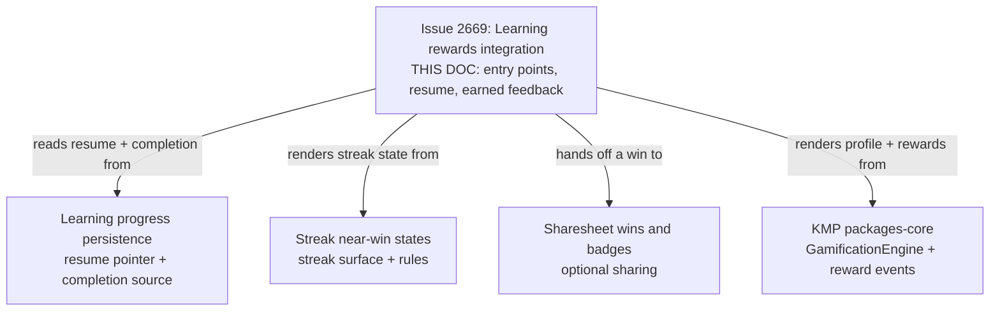
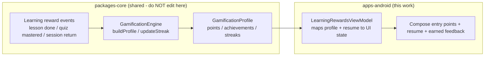
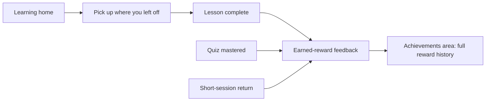
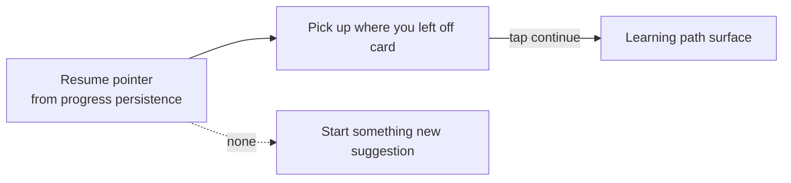

# Android Learning Rewards Integration with Gamification

> **Status:** PROPOSED — Pending human review
> **Issue:** [#2669](https://github.com/jrmoulckers/finance/issues/2669) · Part of [#2208](https://github.com/jrmoulckers/finance/issues/2208)
> **Platform:** Android (Jetpack Compose, Material 3)
> **Last Updated:** 2026-06-22
> **Design only:** Native implementation remains blocked by [#1242](https://github.com/jrmoulckers/finance/issues/1242)

---

## Table of Contents

1. [Purpose](#purpose)
2. [Persona and Why This Matters](#persona-and-why-this-matters)
3. [Goals and Non-Goals](#goals-and-non-goals)
4. [Scope Boundaries With Sibling Work](#scope-boundaries-with-sibling-work)
5. [Reward Rules Live in KMP](#reward-rules-live-in-kmp)
6. [Reward Entry Points](#reward-entry-points)
7. ["Pick Up Where You Left Off"](#pick-up-where-you-left-off)
8. [Earned-Reward Feedback](#earned-reward-feedback)
9. [Healthy, Non-Manipulative Design](#healthy-non-manipulative-design)
10. [Plain-Language Copy](#plain-language-copy)
11. [Accessibility Considerations](#accessibility-considerations)
12. [Offline, Empty, and Error States](#offline-empty-and-error-states)
13. [Test Plan](#test-plan)
14. [Implementation Readiness](#implementation-readiness)
15. [References](#references)

---

## Purpose

Learning sticks when finishing a lesson, passing a quiz, or returning for a short
session **feels recognized** — without turning the app into a slot machine. This
document designs the Android Compose UX that connects **lesson completion, quiz
mastery, and short-session returns** to the existing gamification system: where reward
**entry points** live on the learning and achievements surfaces, how
**"pick up where you left off"** is shown, how **earned-reward feedback** is presented,
and how all of it stays **healthy and non-manipulative**.

It is **design and breakdown only** while
[#1242](https://github.com/jrmoulckers/finance/issues/1242) gates Google Play
distribution. No Kotlin is written here. The reward rules — what a lesson or quiz is
worth, when an achievement unlocks, how a streak advances — are a **shared concern**
that builds on the existing `GamificationEngine`; Compose only renders the resulting
state.

> **Important framing:** rewards here mark **effort and consistency**, not money. They
> never imply a financial outcome, never pressure a return, and never expose any
> financial data. Progress shown is the user's own learning activity.

---

## Persona and Why This Matters

The persona ([#2208](https://github.com/jrmoulckers/finance/issues/2208)): someone
building money confidence in **short sessions** between other commitments. They open
the app, do one lesson or quiz, and want to feel they made progress — then leave and
come back later. If the reward loop is manipulative (loss-framed streaks, FOMO timers,
endless dings) it backfires into stress; if it is invisible, momentum dies. They need
**gentle, honest recognition** and a frictionless way to resume. This intersects with
[android-learning-progress-persistence.md](android-learning-progress-persistence.md)
(the resume + progress source of truth),
[android-streak-near-win-states.md](android-streak-near-win-states.md) (streak surface),
and [android-sharesheet-wins-badges.md](android-sharesheet-wins-badges.md) (optional
sharing of wins).

---

## Goals and Non-Goals

**Goals**

- Define **reward entry points** from the **learning screens** (lesson/quiz completion)
  and the **achievements area**, so earning and viewing rewards are coherent.
- Provide **"pick up where you left off"** — a resume affordance backed by the existing
  learning progress state — plus clear **earned-reward feedback** when XP, an
  achievement, or a streak advances.
- Keep rewards **non-manipulative**: focused on healthy learning behavior, never
  exploitative loops, never guilt, never dark patterns.
- Build on the existing **`GamificationEngine` patterns** and future shared
  learning-reward events; render only shared state in Compose.
- Be fully accessible (TalkBack, Switch Access, 200% font, plain language) and define
  offline/empty/error states.

**Non-Goals**

- Implementing the reward economy, achievement evaluation, or streak transitions — that
  is the shared `GamificationEngine` / `packages/core` (owned by @kmp-engineer), with
  the web gamification + wellness libraries as parity.
- Owning **streak near-win visuals** — those belong to
  [android-streak-near-win-states.md](android-streak-near-win-states.md); this doc
  links to them and reuses their state.
- Owning **learning progress persistence / resume storage** — owned by
  [android-learning-progress-persistence.md](android-learning-progress-persistence.md);
  this doc consumes its resume pointer.
- Owning the **share-card** flow — owned by
  [android-sharesheet-wins-badges.md](android-sharesheet-wins-badges.md).
- Editing KMP `packages/*`, web, or any non-Android platform.

---

## Scope Boundaries With Sibling Work

This doc owns the **integration UX** — connecting learning moments to reward feedback
and resume. The progress persistence doc owns _where_ completion and the resume pointer
live; the streak doc owns streak rules and near-win visuals; the sharesheet doc owns
sharing. All reward math is the shared engine.

---

## Reward Rules Live in KMP

What a lesson is worth, when an achievement unlocks, and how a streak advances are
**business rules** that already live in the shared engine and must not be duplicated in
Compose. The Kotlin source of truth is
[`GamificationEngine`](../../packages/core/src/commonMain/kotlin/com/finance/core/gamification/GamificationEngine.kt)
over the types in
[`GamificationTypes.kt`](../../packages/core/src/commonMain/kotlin/com/finance/core/gamification/GamificationTypes.kt)
(`AchievementDefinition`, `AchievementProgress`, `Streak`, `GamificationProfile`). The
web parity for the _learning-reward_ mapping is
[`learning-progress-rewards.ts`](../../apps/web/src/lib/wellness/learning-progress-rewards.ts)
and
[`achievements-engine.ts`](../../apps/web/src/components/gamification/achievements-engine.ts),
driving [`AchievementsPage.tsx`](../../apps/web/src/pages/AchievementsPage.tsx) and
[`LearningPage.tsx`](../../apps/web/src/pages/LearningPage.tsx).

> This document **describes** the boundary. It does **not** implement KMP changes —
> `GamificationEngine` and the reward events are owned by @kmp-engineer; the web
> gamification/wellness libraries by @web-engineer. The Android
> [`GamificationViewModel`](../../apps/android/src/main/kotlin/com/finance/android/ui/gamification/GamificationViewModel.kt)
> and
> [`LearningPathViewModel`](../../apps/android/src/main/kotlin/com/finance/android/ui/learning/LearningPathViewModel.kt)
> already expose immutable state; this work maps a shared profile + resume pointer into
> UI state. Compose **never** awards XP, evaluates an achievement, or advances a streak
> on its own — it renders what the shared engine produced. Today
> `GamificationViewModel` and the learning resume are wired through these seams, which
> this design reuses rather than re-implements.

---

## Reward Entry Points

Rewards appear at the **moments they are earned** and in **one place to review them**,
so the loop is coherent and never nags:

- **From learning screens** — at the end of a lesson or quiz, an inline, dismissible
  feedback surface (not a blocking modal) acknowledges the win and shows any XP /
  achievement / streak change. It never auto-launches the next lesson.
- **From the achievements area** — the durable home for reviewing earned rewards,
  achievement progress, and active streaks (reusing the existing gamification screen),
  reachable any time, with no pressure to act.
- **From learning home** — the **resume** affordance (next section), so returning users
  land directly on momentum.

Entry points are **pull, not push**: the app does not interrupt unrelated screens with
reward popovers, and there is no persistent badge nag count.

---

## "Pick Up Where You Left Off"

The resume affordance is a single, calm card on the learning home that reads the
**resume pointer** owned by
[android-learning-progress-persistence.md](android-learning-progress-persistence.md) and
offers a one-tap continue.

- Shows the **lesson/path title** and a quiet progress indicator ("Lesson 3 of 6"),
  derived from shared progress state — never a guilt line about time away.
- If nothing is in progress, it becomes a gentle **"Start something new"** suggestion
  (see [empty states](#offline-empty-and-error-states)), not an empty void.
- Resume is **stateless to this surface**: it carries the pointer to the learning path
  surface and does not itself mutate progress.

---

## Earned-Reward Feedback

When the shared engine reports a change, the UI gives **proportional, honest**
feedback:

| Trigger              | Feedback                                                                   | Restraint                              |
| -------------------- | -------------------------------------------------------------------------- | -------------------------------------- |
| Lesson completed     | Inline "Lesson complete" with any XP delta                                 | One acknowledgement, dismissible       |
| Quiz mastered        | "You've got this" with mastery + any achievement unlock                    | Celebrate mastery, not just attempts   |
| Achievement unlocked | A labelled badge appears in feedback and persists in the achievements area | No confetti spam, single announcement  |
| Streak advanced      | Reuses [streak near-win states](android-streak-near-win-states.md) visuals | No loss-framing, no countdown pressure |

- Animations are **brief and reduced-motion aware** (honor the system setting via
  [animation-library.md](animation-library.md)); a static, equivalent state always
  exists.
- Feedback is **announced once** to assistive tech (polite live region) — never a
  repeating chime.
- No numeric "you’ll lose your streak" threats and no time-pressure timers anywhere in
  the feedback.

---

## Healthy, Non-Manipulative Design

This is a guardrail section, not decoration:

- **No dark patterns:** no FOMO countdowns, no loss-framed streak warnings, no
  variable-ratio "surprise" reward gambling, no artificial scarcity, no nagging push to
  return.
- **Effort over addiction:** rewards recognize **completion and mastery**, not raw time
  in app or session count for its own sake. Short, complete sessions are celebrated as
  much as long ones.
- **Always opt-out-able:** a setting can quiet reward animations/sounds entirely while
  preserving the learning content and the resume affordance.
- **Truthful:** XP and achievements are clearly **learning markers**, never implying a
  monetary reward or a financial result.
- **Privacy:** reward state is the user's own activity; nothing here logs or shares
  financial data. If a minor uses learning content, the same minors-privacy posture as
  the teen surfaces applies — no behavioral profiling, no external sharing by default
  (see [android-teen-beginner-mode.md](android-teen-beginner-mode.md)).

---

## Plain-Language Copy

| Surface               | Plain-language copy                                                 |
| --------------------- | ------------------------------------------------------------------- |
| Resume card           | "Pick up where you left off — Lesson 3 of 6."                       |
| Resume (empty)        | "Ready to learn something new? Here's a good place to start."       |
| Lesson complete       | "Lesson complete. Nice work."                                       |
| Quiz mastered         | "You've got this — quiz mastered."                                  |
| Achievement unlocked  | "New badge: [name]. You earned it by [how]."                        |
| Streak advanced       | "That's [n] sessions in a row. No pressure to keep it going."       |
| Quiet-rewards setting | "Turn off reward animations and sounds. Your progress still saves." |

Copy avoids urgency, guilt, and money implications. See
[cognitive-accessibility.md](cognitive-accessibility.md) and
[content-language-guidelines.md](content-language-guidelines.md).

---

## Accessibility Considerations

- **TalkBack:** the resume card announces title + progress as one phrase ("Pick up
  where you left off. Lesson 3 of 6. Double-tap to continue."). Earned-reward feedback
  is a **polite live region** announced exactly once; badges expose a text
  `contentDescription` ("New badge: Consistent Learner").
- **Switch Access / keyboard:** focus order is resume card → earned-reward feedback (if
  present) → dismiss → achievements entry. Every reward control is reachable without
  gestures; nothing is dismiss-by-timeout only — a visible control always exists.
- **200% font / large text:** the resume card and feedback reflow and never truncate
  titles or badge names; badge rows stack instead of clipping.
- **Reduced motion:** all celebration animation respects the system reduced-motion
  setting and degrades to a static state with identical information.
- **Touch targets:** continue, dismiss, and achievement entry are ≥ 48dp.
- **Cognitive load:** one acknowledgement per moment; no stacked popups; the durable
  review lives in the achievements area so feedback can stay light.
- See [accessibility-patterns.md](accessibility-patterns.md) and
  [cognitive-accessibility.md](cognitive-accessibility.md).

---

## Offline, Empty, and Error States

| State                      | Behavior                                                                                                                                                            |
| -------------------------- | ------------------------------------------------------------------------------------------------------------------------------------------------------------------- |
| **Offline**                | Lessons, resume, and locally-computed reward feedback all work; the shared profile renders from the last snapshot. Nothing waits on a network.                      |
| **Empty (new user)**       | No resume pointer → "Start something new" suggestion; achievements area shows "Your badges will appear here as you learn," not a barren grid.                       |
| **Empty (no rewards yet)** | Feedback still acknowledges completion warmly even before any badge exists.                                                                                         |
| **Reward compute lag**     | If the shared profile hasn't refreshed, show the completion acknowledgement immediately and reconcile the badge/streak when state arrives — never block the lesson. |
| **Error**                  | If the profile can't load, the lesson and resume still work; the rewards strip shows a quiet "Rewards will update shortly," never a blocking error.                 |

No reward state shows fabricated numbers, and **no financial data and no learning PII
are written to Timber** in any state (see [Test Plan](#test-plan)).

---

## Test Plan

| Layer              | Tooling                         | What it verifies                                                                                           |
| ------------------ | ------------------------------- | ---------------------------------------------------------------------------------------------------------- |
| Unit               | JUnit                           | ViewModel maps shared `GamificationProfile` + resume pointer → UI state; no reward math in the VM.         |
| Unit               | JUnit                           | A lesson/quiz completion event is forwarded to the shared engine; UI never awards XP itself.               |
| Unit (healthy)     | JUnit                           | No loss-framed streak copy, countdown timer, or push-to-return is emitted by the reward state.             |
| Unit (safety)      | JUnit                           | No Timber call logs financial data or learning PII; minors-privacy posture honored.                        |
| Compose UI         | `createComposeRule` + semantics | Resume card, earned-reward feedback, and badges resolve `contentDescription`; live region announces once.  |
| Compose UI         | `createComposeRule`             | Reduced-motion setting collapses celebration animation to a static, equivalent state.                      |
| Compose UI         | `createComposeRule`             | Empty (new user) and no-rewards states render their warm copy without fabricated numbers.                  |
| Snapshot           | Paparazzi                       | Resume card, completion feedback, achievement-unlock, streak-advance, and empties at {1x, 2x}, light/dark. |
| Pseudolocalization | `en-XA` / `ar-XB`               | Copy expansion and RTL mirroring for resume, feedback, and badge names.                                    |
| Accessibility      | Espresso/Accessibility checks   | TalkBack order, single-announcement live region, Switch Access reachability, touch targets ≥ 48dp.         |

---

## Implementation Readiness

This is a design artifact. Execution splits into a **buildable-now** tier and a
**Play-distribution tail** gated by
[#1242](https://github.com/jrmoulckers/finance/issues/1242). See
[../ops/human-gated-prerequisites.md](../ops/human-gated-prerequisites.md) and
[../ops/launch-readiness-plan.md](../ops/launch-readiness-plan.md).

**Buildable now — `assembleDebug` + sideload (no human gate):**

- Build the reward entry points, "pick up where you left off" card, and earned-reward
  feedback as Compose surfaces rendering a shared `GamificationProfile` + resume pointer
  (mock/in-memory while shared reward events and KMP wiring land).
- Verify healthy-design guardrails, reduced-motion fallback, empties, accessibility, and
  pseudolocale/expansion snapshots on a debug build / emulator.
- All of this runs on an emulator with **no signing, store credentials, or human-gated
  operations**.

**Play-distribution tail — human-gated by [#1242](https://github.com/jrmoulckers/finance/issues/1242):**

- Production signing + Play Console listing.
- Any store-level data-safety / families-policy declaration if learning content is used
  by minors.
- Staged rollout / internal testing track.

The reward rules and learning-reward events are delivered by the shared
`GamificationEngine` in KMP `packages/core` (the web gamification + wellness libraries
are the parity reference); Compose stays render-only.

---

## References

**Design docs**

- [android-learning-progress-persistence.md](android-learning-progress-persistence.md) — resume pointer + completion source
- [android-streak-near-win-states.md](android-streak-near-win-states.md) — streak surface + near-win visuals (#2688)
- [android-sharesheet-wins-badges.md](android-sharesheet-wins-badges.md) — optional win sharing
- [android-teen-beginner-mode.md](android-teen-beginner-mode.md) — minors-privacy posture for learning
- [android-credit-building-education.md](android-credit-building-education.md) — learning content context
- [android-newcomer-us-finance-education.md](android-newcomer-us-finance-education.md) — adjacent learning content
- [content-language-guidelines.md](content-language-guidelines.md) — non-manipulative, plain copy
- [cognitive-accessibility.md](cognitive-accessibility.md) — plain-language and load reduction
- [accessibility-patterns.md](accessibility-patterns.md) — screen reader, focus, live regions
- [animation-library.md](animation-library.md) — reduced-motion and celebration motion
- [component-library.md](component-library.md) — card, badge, chip components
- [information-architecture.md](information-architecture.md) — surface and navigation map
- [ux-principles.md](ux-principles.md) — product UX principles
- [personas.md](personas.md) — learner persona

**Ops**

- [../ops/human-gated-prerequisites.md](../ops/human-gated-prerequisites.md) — buildable-now vs. gated split
- [../ops/launch-readiness-plan.md](../ops/launch-readiness-plan.md) — launch checklist

**Android / web / KMP (read-only boundary)**

- [`GamificationEngine.kt`](../../packages/core/src/commonMain/kotlin/com/finance/core/gamification/GamificationEngine.kt) — shared reward rules (owned by @kmp-engineer)
- [`GamificationTypes.kt`](../../packages/core/src/commonMain/kotlin/com/finance/core/gamification/GamificationTypes.kt) — achievement / streak / profile types
- [`GamificationViewModel.kt`](../../apps/android/src/main/kotlin/com/finance/android/ui/gamification/GamificationViewModel.kt) — existing gamification state seam
- [`GamificationScreen.kt`](../../apps/android/src/main/kotlin/com/finance/android/ui/gamification/GamificationScreen.kt) — achievements area host
- [`LearningPathViewModel.kt`](../../apps/android/src/main/kotlin/com/finance/android/ui/learning/LearningPathViewModel.kt) — learning state seam
- [`LearningPathContent.kt`](../../apps/android/src/main/kotlin/com/finance/android/ui/learning/LearningPathContent.kt) — lesson/path content model
- [`learning-progress-rewards.ts`](../../apps/web/src/lib/wellness/learning-progress-rewards.ts) — learning-reward mapping parity (owned by @web-engineer)
- [`achievements-engine.ts`](../../apps/web/src/components/gamification/achievements-engine.ts) — achievement evaluation parity
- [`AchievementsPage.tsx`](../../apps/web/src/pages/AchievementsPage.tsx) — achievements surface parity
- [`LearningPage.tsx`](../../apps/web/src/pages/LearningPage.tsx) — learning surface parity

**Issues**

- [#2669](https://github.com/jrmoulckers/finance/issues/2669) — this issue
- [#2208](https://github.com/jrmoulckers/finance/issues/2208) — parent (learning rewards cluster)
- [#1242](https://github.com/jrmoulckers/finance/issues/1242) — Play Console + keystore (gate)
