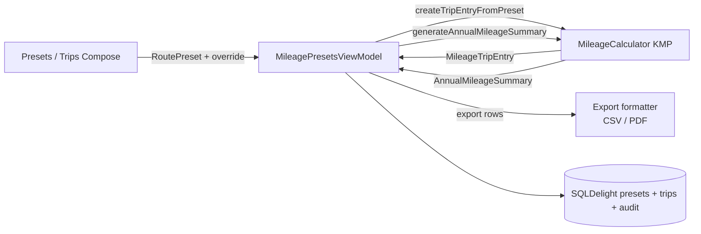
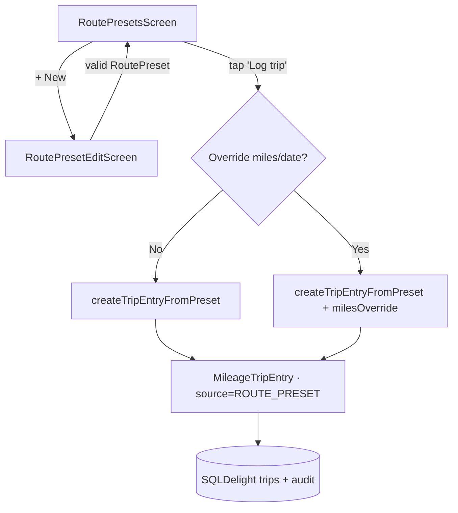
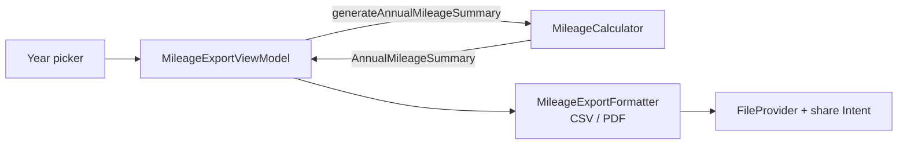

# Android — Mileage Presets, Platform Attachment & IRS Export/Audit Trail

> **Status:** DRAFT — design only (pending human review)
> **Owner:** @android-engineer
> **Issue:** [#2519](https://github.com/jrmoulckers/finance/issues/2519) · **Part of** [#2137](https://github.com/jrmoulckers/finance/issues/2137)
> **Platform:** Android phone + tablet, Compose + Material 3
> **Last Updated:** 2026-06-22

This document specifies the **design** for reusable route/hotspot **presets**, **gig-platform
attachment**, free-text **notes**, and the **export / audit trail** needed to substantiate mileage
deductions for the **IRS**. It is **design + breakdown only** — implementation is unblocked, but the
_distribution_ tail is gated by [#1242](https://github.com/jrmoulckers/finance/issues/1242) (see
[Implementation Readiness](#implementation-readiness)).

---

## Table of Contents

- [1. Goals & Non-Goals](#1-goals--non-goals)
- [2. KMP / Compose Boundary](#2-kmp--compose-boundary)
- [3. Affected Android Surfaces](#3-affected-android-surfaces)
- [4. Shared Dependencies](#4-shared-dependencies)
- [5. Route / Hotspot Presets](#5-route--hotspot-presets)
- [6. Platform Attachment](#6-platform-attachment)
- [7. Notes](#7-notes)
- [8. IRS Export & Audit Trail](#8-irs-export--audit-trail)
- [9. State Model (Offline / Empty / Error)](#9-state-model-offline--empty--error)
- [10. Accessibility (TalkBack & Font Scaling)](#10-accessibility-talkback--font-scaling)
- [11. Test Plan](#11-test-plan)
- [12. Implementation Readiness](#12-implementation-readiness)

---

## 1. Goals & Non-Goals

### Goals

- Let a gig worker save **route presets** (start/end, default miles, purpose, business-use %) and
  **hotspot** presets for frequent trips, then log a trip in one tap.
- **Attach a gig platform** (Uber, Lyft, DoorDash, …) to presets, trips, and shifts using the shared
  platform model.
- Capture **notes** per preset/trip/shift for substantiation context.
- Produce an **IRS-ready export** (annual summary + per-trip detail) and maintain an **audit trail**
  (source, timestamps, external IDs) so deductions are defensible.

### Non-Goals

- The running start/pause/end flow — see [Shift mileage flow](./android-shift-mileage-flow.md) (#2518).
- Tax-reserve percentages — see [Gig tax-reserve settings](./android-gig-tax-reserve-settings.md) (#2517).
- Live GPS route capture (future; v1 presets are user-defined).
- Automated platform API import of trips (a future audit `source`; the model already reserves
  `PLATFORM_IMPORT`, but no integration ships here).
- Generating official IRS forms; we export a substantiation report, **not** a filed return.

---

## 2. KMP / Compose Boundary

Preset modelling, deduction math, and summary generation are **owned by KMP `packages/core`**.
Compose manages CRUD UI, file/share plumbing, and rendering of shared results.

| Concern                                     | Owner   | Symbol / location                                                                                                  |
| ------------------------------------------- | ------- | ------------------------------------------------------------------------------------------------------------------ |
| Route preset model + validation             | KMP     | `RoutePreset` (`com.finance.core.mileage`)                                                                         |
| Platform attachment model                   | KMP     | `GigPlatformLink`; defaults in `GigPlatformDefaults`                                                               |
| Trip from preset                            | KMP     | `MileageCalculator.createTripEntryFromPreset(...)`                                                                 |
| Trip deduction & validation                 | KMP     | `MileageCalculator.calculateTripDeduction(...)`, `validateTripEntry(...)`                                          |
| Annual / shift summaries                    | KMP     | `MileageCalculator.generateAnnualMileageSummary(...)` → `AnnualMileageSummary`; `summarizeShift(...)`              |
| Audit metadata & source                     | KMP     | `MileageAuditMetadata`, `MileageAuditSource` (`MANUAL`, `PLATFORM_IMPORT`, `CALENDAR`, `ODOMETER`, `ROUTE_PRESET`) |
| IRS rates (cents/mile by year)              | KMP     | `MileageCalculator.getMileageRate(...)` (2024: 67¢ business; 2025: 70¢)                                            |
| Compose CRUD, export formatting, file/share | Android | `apps/android/...` (this doc)                                                                                      |

Source of truth:
[`MileageModels.kt`](../../packages/core/src/commonMain/kotlin/com/finance/core/mileage/MileageModels.kt)
and
[`MileageCalculator.kt`](../../packages/core/src/commonMain/kotlin/com/finance/core/mileage/MileageCalculator.kt).

> **Rule:** Android does not compute deductible miles, apply business-use %, or pick the IRS rate.
> It collects fields, calls KMP to build `MileageTripEntry` / `AnnualMileageSummary`, then renders
> and serializes the returned values. Export formatting (CSV/PDF text) is Android UI work, but the
> **numbers come from KMP**.

---

## 3. Affected Android Surfaces

All new Compose; **no XML**. Files under `apps/android/src/main/kotlin/com/finance/android/`.

| Surface            | New file (proposed)                                                          | Role                                            |
| ------------------ | ---------------------------------------------------------------------------- | ----------------------------------------------- |
| Presets list       | `ui/screens/mileage/RoutePresetsScreen.kt`                                   | Manage saved routes/hotspots                    |
| Preset editor      | `ui/screens/mileage/RoutePresetEditScreen.kt`                                | Create/edit a `RoutePreset`                     |
| Trip log           | `ui/screens/mileage/MileageTripListScreen.kt`                                | View/filter logged trips                        |
| Trip editor        | `ui/screens/mileage/MileageTripEditScreen.kt`                                | Manual trip incl. platform + notes              |
| Platform picker    | `ui/screens/mileage/PlatformPickerSheet.kt`                                  | Choose a `GigPlatformLink`                      |
| Export screen      | `ui/screens/mileage/MileageExportScreen.kt`                                  | Year picker, format, share intent               |
| ViewModel(s)       | `ui/screens/mileage/MileagePresetsViewModel.kt`, `MileageExportViewModel.kt` | Hold UI state, call KMP                         |
| Export formatter   | `data/mileage/MileageExportFormatter.kt`                                     | CSV/PDF rows from KMP summaries                 |
| Audit store        | `data/mileage/MileageAuditStore.kt`                                          | Persist `MileageAuditMetadata` with each record |
| Koin wiring        | `di/AppModule.kt` (append)                                                   | `viewModelOf(...)`, formatter/store `single`s   |
| Navigation         | `ui/navigation/FinanceNavHost.kt`                                            | `routePresets`, `mileageExport` routes          |
| Preview / snapshot | `.../mileage/*Preview.kt`, `test/.../snapshot/MileageExportSnapshotTest.kt`  | Preview + Paparazzi                             |

Export sharing reuses the existing export plumbing pattern from
[`DataExportManager`](../../apps/android/src/main/kotlin/com/finance/android/ui/viewmodel) (CSV/PDF
via Android `FileProvider` + share `Intent`).

---

## 4. Shared Dependencies

| Dependency                                                                                     | Use                                                                     |
| ---------------------------------------------------------------------------------------------- | ----------------------------------------------------------------------- |
| `com.finance.core.mileage.RoutePreset`                                                         | Saved route/hotspot template + validation                               |
| `com.finance.core.mileage.MileageCalculator`                                                   | `createTripEntryFromPreset`, deductions, `generateAnnualMileageSummary` |
| `com.finance.core.mileage.MileageTripEntry` / `MileagePurposeSummary` / `AnnualMileageSummary` | Trip + summary models for the audit/export                              |
| `com.finance.core.mileage.GigPlatformLink` / `GigPlatformDefaults`                             | Platform attachment + seed list                                         |
| `com.finance.core.mileage.MileageAuditMetadata` / `MileageAuditSource`                         | Audit trail provenance                                                  |
| `com.finance.core.gig.payout.GigPlatformDefaults`                                              | Uber/Lyft/DoorDash/Instacart/Grubhub/Shipt/Upwork/Fiverr defaults       |
| SQLDelight (+ SQLCipher)                                                                       | Encrypted local storage of presets, trips, audit metadata               |
| Android `FileProvider` + share `Intent`                                                        | Export delivery (CSV/PDF)                                               |
| Koin `koin-compose-viewmodel`                                                                  | `koinViewModel<...>()`                                                  |
| Timber                                                                                         | Logging — **never** notes, locations, miles, or platform account IDs    |

---

## 5. Route / Hotspot Presets

A `RoutePreset` (KMP) captures: `name`, `startLocation`, `endLocation`, optional `defaultMiles`,
`defaultPurpose` (default `BUSINESS`), `defaultBusinessUsePercent` (0–100, default 100), optional
`platform`, and `notes`. KMP `init` blocks enforce non-blank fields and valid ranges; Android shows
those validation messages.

- **Hotspot** presets are a UX flavor of the same model — a named location pair (e.g. "Home →
  Airport queue") for frequent gig staging trips.
- **Log from preset:** one tap calls `MileageCalculator.createTripEntryFromPreset(...)`, optionally
  with a `milesOverride` and date; the audit `source` is set to `ROUTE_PRESET`.
- **CRUD** lives in `RoutePresetsScreen` (list, with swipe/overflow edit/delete) + `RoutePresetEditScreen`.
- Presets sync offline-first via the standard sync queue (client-generated IDs).

---

## 6. Platform Attachment

Trips, presets, and shifts can carry a `GigPlatformLink` (`platformId`, `displayName`, optional
`accountId`).

- The `PlatformPickerSheet` is seeded from `GigPlatformDefaults` (Uber, Lyft, DoorDash, Instacart,
  Grubhub, Shipt, Upwork, Fiverr) and allows a custom platform.
- Attaching a platform sets `MileageAuditMetadata.platform` for substantiation and enables
  **per-platform** filtering/grouping in the trip log and export.
- `accountId` (e.g. a driver handle) is **optional** and treated as low-sensitivity metadata — it is
  **never logged via Timber** and is excluded from lock-screen/notification content.
- Platform attachment is consistent with the shared gig-payout matching model (same platform IDs),
  so mileage and income can later be correlated in shared code without Android duplicating logic.

---

## 7. Notes

- Free-text `notes` exist on `RoutePreset`, `MileageTripEntry`, and `WorkShiftSession` (all KMP
  models). Notes provide IRS substantiation context (e.g. "client meeting", "surge in downtown").
- The Compose editor trims and length-limits notes (UI concern); the KMP model stores the string.
- Notes are **sensitive free text** — they may contain client/personal info, so they:
  - are stored only in the **encrypted** SQLDelight DB,
  - are **never** written to Timber logs,
  - are excluded from notifications and Glance widgets.
- Notes are included in the IRS export detail rows (the user is exporting their own substantiation).

---

## 8. IRS Export & Audit Trail

### Audit trail

Every mileage record carries `MileageAuditMetadata`:

- `source` — `MANUAL`, `ROUTE_PRESET`, `ODOMETER`, `CALENDAR`, or `PLATFORM_IMPORT` (future).
- `platform` — the attached `GigPlatformLink`, if any.
- `externalTripId` / `externalShiftId` / `supportReference` — correlation IDs.
- `createdAt` / `updatedAt` / `importedAt` — timestamps (KMP enforces `updatedAt >= createdAt`).

The Android `MileageAuditStore` writes/updates this metadata on every create/edit so the provenance
chain is complete and tamper-evident-by-timestamp. The audit trail is **read-only in the export**.

### Export

The export is built from KMP `generateAnnualMileageSummary(trips, year)` →
`AnnualMileageSummary`, which provides per-purpose totals (`MileagePurposeSummary`: total deductible
miles, IRS `rateCentsPerMile`, `deductionCents`) plus annual totals. Android formats, it does not
compute.

| Export part       | Content                                                                                         | Source                                      |
| ----------------- | ----------------------------------------------------------------------------------------------- | ------------------------------------------- |
| **Header**        | Tax year, generated date, applied IRS rates per purpose                                         | `AnnualMileageSummary` + `getMileageRate`   |
| **Summary table** | Per purpose: deductible miles × rate = deduction                                                | `MileagePurposeSummary`                     |
| **Detail rows**   | Per trip: date, start, end, miles, purpose, business-use %, platform, notes, source, timestamps | `MileageTripEntry` + `MileageAuditMetadata` |
| **Disclaimer**    | "Estimate for substantiation; not tax advice or a filed return."                                | Android string resource                     |

- **Formats:** CSV (spreadsheet-friendly, primary) and a printable **PDF** report. Money rendered
  from integer cents (never floats).
- **Delivery:** Android `FileProvider` + share `Intent` (email, Drive, print). No backend upload
  required; export is fully **offline**.
- **Determinism:** given the same trips, the export is byte-stable (sorted by date then id) so a user
  can re-generate identical substantiation.

---

## 9. State Model (Offline / Empty / Error)

`StateFlow`-backed UI state per screen (presets, trips, export).

| State                    | Trigger                                     | Compose rendering                                                                              |
| ------------------------ | ------------------------------------------- | ---------------------------------------------------------------------------------------------- |
| **Loading**              | Reading presets/trips                       | Skeleton + `contentDescription`                                                                |
| **Empty (presets)**      | No presets yet                              | Illustration + "Create your first route preset" CTA                                            |
| **Empty (trips/export)** | No trips for the year                       | "No trips logged for {year}" empty state; export disabled with explanation                     |
| **Ready**                | Data present                                | Lists / editor / export preview                                                                |
| **Offline**              | No connectivity                             | **No functional change** — CRUD + export are local; "Saved on device" caption                  |
| **Validation error**     | Blank name, end < start odometer, miles ≤ 0 | KMP messages inline on the field                                                               |
| **Export error**         | File write / share failure                  | Non-destructive error + retry; partial file cleaned up; `Timber.e` **without** notes/locations |
| **Permission**           | (PDF print/share)                           | Standard share sheet; no special runtime permission needed for `FileProvider`                  |

**Offline-first guarantee:** presets, trips, audit metadata, and export all function with **zero
network**. Sync only mirrors stored records. This is why the feature is "buildable now" in
[§12](#12-implementation-readiness).

---

## 10. Accessibility (TalkBack & Font Scaling)

Per [`accessibility-patterns.md`](./accessibility-patterns.md) and the **`contentDescription` on every
interactive/informational Composable** rule.

- **Preset list items:** merged semantics read name + route + platform, e.g. "Home to Airport, 12.4
  miles, business, Uber. Double-tap to log a trip." Edit/delete affordances individually labelled.
- **Editor fields:** programmatic labels for name, start, end, miles, business-use %, purpose,
  platform; validation errors via `error` semantics and announced.
- **Platform picker:** each option labelled with platform name; selection state via
  `stateDescription`; custom-platform entry clearly labelled.
- **Export screen:** year picker announces selection; format toggle labelled; the "Export" button
  describes the result ("Export {year} mileage as CSV"); disabled empty-state button explains why.
- **Summary/preview numbers:** read as phrases — "Business: 1,240 deductible miles at 67 cents, 830
  dollars 80 cents deduction." Status/purpose conveyed with text, not color alone.
- **Notes field:** labelled, with a character-count `stateDescription`; reachable in reading order.
- **Font scaling:** verified at **200%**; tables/rows reflow (wrap or horizontal scroll) without
  truncation; export preview remains legible.
- **Touch targets** ≥ 48 dp; list actions spaced for Switch Access scanning.
- **Contrast:** AA across light/dark/OLED.

---

## 11. Test Plan

| Layer                    | Tool                                               | Coverage                                                                                                                                 |
| ------------------------ | -------------------------------------------------- | ---------------------------------------------------------------------------------------------------------------------------------------- |
| KMP boundary (reference) | existing `MileageCalculatorTest` (`packages/core`) | Preset→trip, deduction, annual summary validated in shared code; Android does **not** re-assert math                                     |
| Presets CRUD             | JUnit + Compose UI                                 | Create/edit/delete; KMP validation surfaced; log-from-preset with/without override                                                       |
| Platform attachment      | JUnit + UI                                         | Defaults seeded; custom platform; audit `platform` set; filtering by platform                                                            |
| Notes                    | unit + UI                                          | Trim/limit; stored; **excluded** from logs/notifications/widgets                                                                         |
| Audit trail              | unit                                               | `source` set correctly per entry path; timestamps monotonic (`updatedAt >= createdAt`)                                                   |
| Export formatter         | JUnit (golden files)                               | CSV/PDF byte-stable; cents rendered correctly; totals equal `AnnualMileageSummary`; empty-year handling                                  |
| Export delivery          | instrumented                                       | `FileProvider` URI + share `Intent`; offline export succeeds                                                                             |
| ViewModel                | JUnit + Turbine                                    | State emissions; KMP calls; error/empty/offline paths                                                                                    |
| Accessibility            | semantics + Accessibility Scanner                  | `contentDescription`, merged item semantics, 200% font scale                                                                             |
| Snapshot                 | **Paparazzi**                                      | Presets list (empty + populated), editor, export preview — light/dark/OLED, 200% font, RTL                                               |
| Edge cases               | unit + UI                                          | Preset with no `defaultMiles` (requires override), miles ≤ 0, end < start odometer, year with no trips, very long notes, custom platform |

> Deduction and summary math assertions live in the **KMP suite**; Android tests cover CRUD,
> attachment, audit provenance, export formatting/stability, rendering, and accessibility.

---

## 12. Implementation Readiness

**Design + breakdown only** for this issue. Per the
[Human-Gated Prerequisites runbook](../ops/human-gated-prerequisites.md), "blocked by #1242" gates
**only distribution**, not implementation.

| Phase                                                                                            | Status                                                                  | Notes                                                                    |
| ------------------------------------------------------------------------------------------------ | ----------------------------------------------------------------------- | ------------------------------------------------------------------------ |
| **Design** (this doc)                                                                            | ✅ Deliverable now                                                      | No accounts/secrets needed                                               |
| **Implementation** (Compose CRUD, KMP calls, SQLDelight, export formatter, `FileProvider` share) | ✅ Buildable now                                                        | `./gradlew :apps:android:assembleDebug` + sideload; all deps local + KMP |
| **Local tests** (unit / Compose / golden-file / Paparazzi)                                       | ✅ Runnable now                                                         | No enrollment                                                            |
| **Distribution** (Play Store, release signing)                                                   | 🔒 Gated by [#1242](https://github.com/jrmoulckers/finance/issues/1242) | Google Play enrollment, keystore, CI secrets — **human-gated**           |

**Buildable-now scope:** presets CRUD, platform attachment, notes, audit trail, and CSV/PDF export
(shared via `FileProvider`) all run on a debug build entirely on-device — no paid entitlement.

**Distribution tail (human action required):** Play Store release and signing depend on the #1242
prerequisites in
[§3.1 of the runbook](../ops/human-gated-prerequisites.md#31-android-distribution--google-play-1242).
No AI agent performs those steps.

---

_Part of [#2137](https://github.com/jrmoulckers/finance/issues/2137). Companion designs:
[Shift mileage flow](./android-shift-mileage-flow.md) ·
[Gig tax-reserve settings](./android-gig-tax-reserve-settings.md)._
