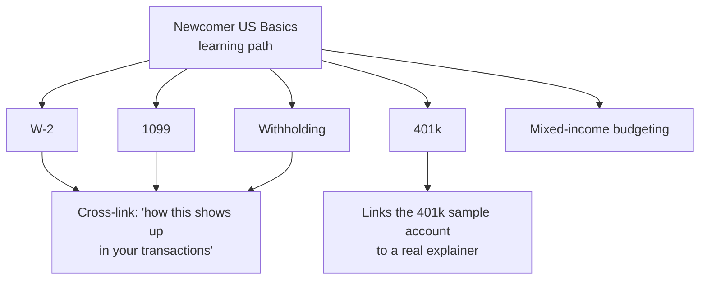
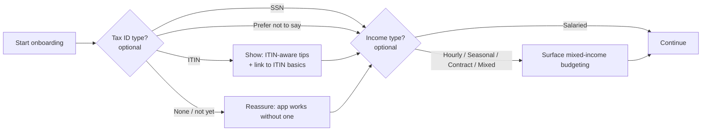
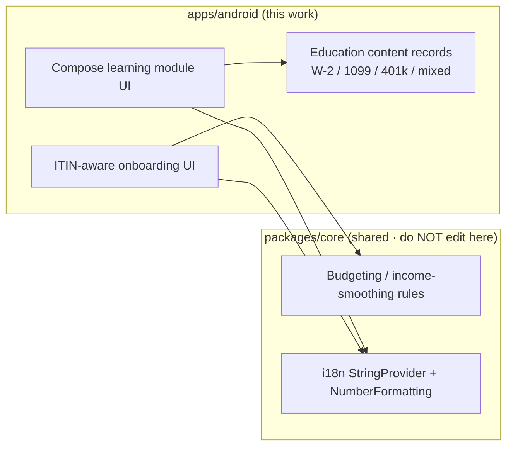

# Android Newcomer US Finance Education

> **Status:** PROPOSED — Pending human review
> **Issue:** [#2535](https://github.com/jrmoulckers/finance/issues/2535) · Part of [#2178](https://github.com/jrmoulckers/finance/issues/2178)
> **Platform:** Android (Compose education modules, onboarding)
> **Last Updated:** 2026-06-22
> **Design only:** Native implementation remains blocked by [#1242](https://github.com/jrmoulckers/finance/issues/1242)

---

## Table of Contents

1. [Purpose](#purpose)
2. [Persona and Why This Matters](#persona-and-why-this-matters)
3. [Goals and Non-Goals](#goals-and-non-goals)
4. [Education Modules](#education-modules)
5. [ITIN-Aware Onboarding](#itin-aware-onboarding)
6. [Content Model and KMP Boundary](#content-model-and-kmp-boundary)
7. [Mixed-Income Budgeting](#mixed-income-budgeting)
8. [Sensitivity, Privacy, and Tone](#sensitivity-privacy-and-tone)
9. [Localization and Text Expansion](#localization-and-text-expansion)
10. [Accessibility Considerations](#accessibility-considerations)
11. [Offline, Empty, and Error States](#offline-empty-and-error-states)
12. [Test Plan](#test-plan)
13. [Implementation Readiness](#implementation-readiness)
14. [References](#references)

---

## Purpose

Newcomers to the US financial system frequently lack the assumed background the
app silently relies on. A repo scan found **no SSN, ITIN, W-2, 1099, or 401(k)
educational content**; the existing learning paths in
[`LearningPathContent.kt`](../../apps/android/src/main/kotlin/com/finance/android/ui/learning/LearningPathContent.kt)
cover general budgeting/investing/debt, and a sample `401(k)` account name exists
in `SampleData.kt` with no explainer. The onboarding flow is generic and never
captures whether income is hourly, contract, W-2, or 1099, or whether the user
has an SSN, an ITIN, or neither.

This document designs **plain-language education modules** (W-2, 1099,
withholding, 401(k), mixed-income budgeting) and **ITIN-aware onboarding** so the
app does not assume a salaried, SSN-holding US worker. It is design and breakdown
only while [#1242](https://github.com/jrmoulckers/finance/issues/1242) gates store
distribution.

---

## Persona and Why This Matters

The persona ([#2178](https://github.com/jrmoulckers/finance/issues/2178)): a new
immigrant who may not have an SSN yet, uses an ITIN, works mixed W-2 / 1099 jobs,
and is encountering 401(k) for the first time. If the app assumes one identity
path, it quietly excludes many immigrant users. Even simple acknowledgement of
ITIN and mixed-income realities makes the app feel welcoming and useful. This
intersects with [Persona 4: Casey](personas.md) on plain-language and
cognitive-load reduction (see [cognitive-accessibility.md](cognitive-accessibility.md)).

> **Important framing:** this is **financial _education_**, not tax, legal, or
> immigration _advice_. Every module must say so, link to authoritative primary
> sources, and avoid prescribing actions. See
> [Sensitivity, Privacy, and Tone](#sensitivity-privacy-and-tone).

---

## Goals and Non-Goals

**Goals**

- Beginner explainers for **W-2, 1099, withholding, and 401(k)**, written in
  plain language and translatable.
- Optional, **non-blocking** onboarding choices: SSN / ITIN / none / prefer not
  to say; and income type: hourly / salaried / contract / mixed / seasonal.
- **Mixed-income budgeting** tips for hourly/seasonal/contract earners.
- Reuse the existing learning-path UI scaffolding rather than inventing a new one.

**Non-Goals**

- Tax filing, tax calculation, or immigration guidance of any kind.
- Collecting or storing the actual SSN/ITIN _number_ (see privacy section — we
  store at most a coarse, optional _category_, never the identifier).
- Editing KMP `packages/*` or non-Android platforms.
- The general string-migration mechanics (owned by
  [#2527](android-string-resource-migration-audit.md)) and Spanish copy review
  (owned by [#2528](android-spanish-education-formatting.md)).

---

## Education Modules

Each module is short, plain-language, and structured like existing learning
modules (title, body, key takeaways, optional quiz) so it slots into the current
[`LearningPath`/`LearningModule`](../../apps/android/src/main/kotlin/com/finance/android/ui/learning/LearningPathContent.kt)
model.

| Module       | One-line scope                                                | Key takeaways focus                                |
| ------------ | ------------------------------------------------------------- | -------------------------------------------------- |
| W-2          | What a W-2 is and when/why you get one as an employee.        | Employer reports wages + taxes withheld.           |
| 1099         | What a 1099 means for contract/gig income.                    | No automatic withholding; you may owe at tax time. |
| Withholding  | Why money is taken out of a paycheck before you see it.       | Withholding ≠ your final tax; it's a prepayment.   |
| 401(k)       | What an employer retirement plan is and what "match" means.   | Pre-tax contributions; matching is "free" money.   |
| Mixed income | Budgeting when income is hourly/seasonal/contract and varies. | Budget from a baseline; smooth irregular income.   |

**Content rules**

- Define the acronym on first use; never assume prior knowledge.
- Use concrete, low-stakes examples; keep amounts illustrative and obviously
  fictional (no real or sensitive financial data).
- Every module ends with "this is general education, not tax advice" and a link
  to an authoritative source (e.g. IRS) rather than an in-app instruction to act.
- A short, optional quiz reinforces understanding (reusing the existing
  `QuizQuestion` model), never gates progress.

---

## ITIN-Aware Onboarding

Onboarding gains **optional** profile questions. They are skippable, editable
later in settings, and never block account creation.

- **Choices:** Tax ID = `SSN | ITIN | None/not yet | Prefer not to say`. Income =
  `Hourly | Salaried | Contract | Mixed | Seasonal | Prefer not to say`.
- The choice **tailors education and budgeting tips**; it does not unlock or
  restrict features. "None/not yet" and "Prefer not to say" are first-class paths.
- Avoid any flow that assumes a standard salaried, SSN-holding worker. Default
  copy is identity-neutral; tailored tips are additive.

---

## Content Model and KMP Boundary

Education content is _content_, but the app's **finance math and any reusable
business rules stay in KMP `packages/core`**. Compose renders shared state; it
does not compute withholding, contributions, or budgets locally.

**Content storage decision (to confirm in implementation):**

- Short labels/titles → Android string resources (localizable via
  [#2527](android-string-resource-migration-audit.md) /
  [#2528](android-spanish-education-formatting.md)).
- Long-form module bodies → structured content records (as today's
  `LearningModule` does) whose **text fields are still resource-backed or
  translation-managed**, so Spanish coverage is achievable. Long prose as raw
  Kotlin literals is explicitly disallowed (that is the very anti-pattern
  [#2166](https://github.com/jrmoulckers/finance/issues/2166) flags).
- Any numeric example that touches budgeting logic defers to shared KMP rules /
  [`NumberFormatting`](../../packages/core/src/commonMain/kotlin/com/finance/core/i18n/NumberFormatting.kt);
  the module never re-implements finance math.

> This document **describes** the boundary. It does not implement KMP changes —
> `packages/core` is owned by @native-app-engineer.

---

## Mixed-Income Budgeting

For hourly/seasonal/contract earners, the standard "fixed monthly salary"
assumption breaks. The module (and tailored tips) teach:

- **Budget from a baseline:** plan against a conservative low month, not the best
  month.
- **Smooth the peaks:** route surplus from high months into a buffer for lean
  months.
- **Set aside for taxes on 1099 income:** because nothing is withheld
  automatically — framed as education, with a link to authoritative guidance, not
  a calculated number.
- **Irregular-income goals:** percentage-of-income contributions rather than
  fixed amounts.

The underlying smoothing/budget logic, if any is computed, lives in KMP shared
rules; the Android module renders explanations and the shared state.

---

## Sensitivity, Privacy, and Tone

This content area is high-trust and high-stakes. Non-negotiables:

- **No advice framing.** Every module is labeled financial _education_, not tax,
  legal, or immigration advice, and links to primary sources (IRS, etc.).
- **Never store the identifier.** We store at most an optional, coarse _category_
  (`SSN | ITIN | None | Unspecified`) used to tailor content — **never** the
  actual SSN/ITIN number. This category is an app-local preference, kept out of
  logs and analytics.
- **Never log sensitive data.** Per the observability guardrails, do not log
  SSN/ITIN/income values; Timber calls must omit them. (The repo's CI sensitive-
  data check scans code, not docs; the rule still binds the implementation.)
- **Inclusive, non-judgmental tone** per
  [content-language-guidelines.md](content-language-guidelines.md): acknowledge
  ITIN and mixed-income realities as normal, not exceptional.
- **Skippable and reversible.** All onboarding identity/income questions are
  optional and editable later.

---

## Localization and Text Expansion

- All module text and onboarding copy are **resource-backed and translatable**,
  feeding directly into Spanish coverage
  ([#2528](android-spanish-education-formatting.md)). US tax terms (W-2, 1099)
  often have no short Spanish equivalent, so expect **25–30%+ expansion**; design
  modules and onboarding cards to wrap, not clip.
- Keep acronyms (W-2, 1099, 401(k), ITIN) as-is across languages but localize the
  surrounding explanation.
- Validate layouts under the `en-XA` pseudolocale and at `2.0x` font scale.

---

## Accessibility Considerations

- **TalkBack:** every module card, quiz option, and onboarding choice carries a
  meaningful `contentDescription`; reading order follows the module structure
  (title → body → takeaways → quiz).
- **Plain language / cognitive load:** short sentences, one concept per screen,
  glossary cross-links — aligned with
  [cognitive-accessibility.md](cognitive-accessibility.md).
- **Font scaling:** education prose must remain readable and unclipped at 200%
  font scale; no fixed-height text containers.
- **Switch Access:** quiz and onboarding controls are reachable and operable via
  Switch Access with adequate (≥ 48dp) targets.
- **RTL readiness:** resource-backed text + start/end modifiers keep the modules
  RTL-safe for future locales; `ar-XB` pseudolocale exercises mirroring.
- See [accessibility-patterns.md](accessibility-patterns.md) for the underlying
  patterns.

---

## Offline, Empty, and Error States

- **Offline:** education content is static and must be **fully available
  offline** — bundle it with the app rather than fetching at read time. A
  newcomer on a budget device with intermittent data must still learn.
- **Empty:** if a tailored path has no modules yet for a chosen profile, show a
  helpful empty state ("more guides coming") rather than a blank screen.
- **Error:** if onboarding choices fail to persist, fail safe — never block the
  user from continuing; retry silently and surface a non-judgmental message.

---

## Test Plan

| Layer              | Tooling                         | What it verifies                                                                        |
| ------------------ | ------------------------------- | --------------------------------------------------------------------------------------- |
| Unit               | JUnit                           | Each module has title/body/takeaways; profile→tailoring mapping is correct.             |
| Unit (privacy)     | JUnit                           | Only the coarse category is persisted; no identifier field exists/serializes.           |
| Compose UI         | `createComposeRule` + semantics | Module + onboarding text and `contentDescription` resolve from resources.               |
| Snapshot           | Paparazzi                       | W-2/1099/withholding/401(k)/mixed cards + onboarding at `{en, en-XA, es}` × `{1x, 2x}`. |
| Pseudolocalization | `en-XA` / `ar-XB`               | Expansion + mirroring for long education prose.                                         |
| Accessibility      | Espresso/Accessibility checks   | TalkBack order, Switch Access reachability, touch targets ≥ 48dp.                       |
| Behavior           | Espresso                        | All identity/income questions are skippable and editable later.                         |

---

## Implementation Readiness

This is a design artifact. Execution splits into a **buildable-now** tier and a
**Play-distribution tail** gated by
[#1242](https://github.com/jrmoulckers/finance/issues/1242). See
[../ops/human-gated-prerequisites.md](../ops/human-gated-prerequisites.md) and
[../ops/launch-readiness-plan.md](../ops/launch-readiness-plan.md).

**Buildable now — `assembleDebug` + sideload (no human gate):**

- Author the five education modules as resource-backed content records.
- Add optional ITIN-aware onboarding choices (category only, never the identifier).
- Wire tailored tips and the mixed-income budgeting module to shared rules.
- Verify offline availability, accessibility, and pseudolocale/expansion
  snapshots on a debug build / emulator.

**Play-distribution tail — human-gated by [#1242](https://github.com/jrmoulckers/finance/issues/1242):**

- Production signing + Play Console listing.
- Any store-level data-safety / content declarations referencing the optional
  profile category.
- Staged rollout / internal testing track.

Everything in the buildable-now tier runs on an emulator with no signing, store
credentials, or human-gated operations. Spanish rendering of these modules is
delivered through [#2528](android-spanish-education-formatting.md).

---

## References

**Design docs**

- [android-string-resource-migration-audit.md](android-string-resource-migration-audit.md) — string extraction + lint (#2527)
- [android-spanish-education-formatting.md](android-spanish-education-formatting.md) — Spanish coverage (#2528)
- [content-language-guidelines.md](content-language-guidelines.md) — non-judgmental, inclusive copy
- [accessibility-patterns.md](accessibility-patterns.md) — screen reader, focus, touch targets
- [cognitive-accessibility.md](cognitive-accessibility.md) — plain-language and load reduction
- [information-architecture.md](information-architecture.md) — surface and navigation map
- [ux-principles.md](ux-principles.md) — product UX principles
- [personas.md](personas.md) — Persona 4 (Casey), accessibility-first

**Ops**

- [../ops/human-gated-prerequisites.md](../ops/human-gated-prerequisites.md) — buildable-now vs. gated split
- [../ops/launch-readiness-plan.md](../ops/launch-readiness-plan.md) — launch checklist

**Android / KMP (read-only boundary)**

- [`LearningPathContent.kt`](../../apps/android/src/main/kotlin/com/finance/android/ui/learning/LearningPathContent.kt) — existing module model
- [`FinancialConceptContent.kt`](../../apps/android/src/main/kotlin/com/finance/android/ui/education/FinancialConceptContent.kt) — existing glossary content
- [`NumberFormatting.kt`](../../packages/core/src/commonMain/kotlin/com/finance/core/i18n/NumberFormatting.kt) — shared formatting (owned by @native-app-engineer)

**Issues**

- [#2535](https://github.com/jrmoulckers/finance/issues/2535) — this issue
- [#2178](https://github.com/jrmoulckers/finance/issues/2178) — parent (ITIN-aware onboarding + US basics)
- [#1242](https://github.com/jrmoulckers/finance/issues/1242) — Play Console + keystore (gate)
