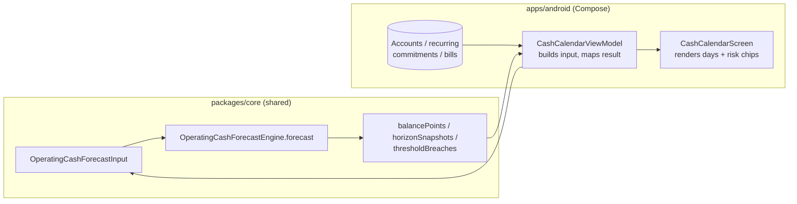
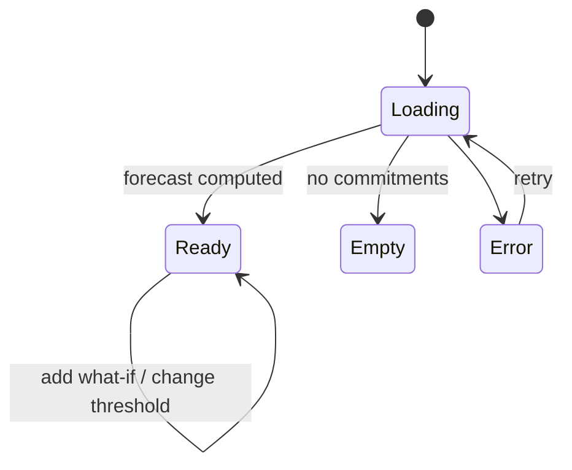

# Android Operating Cash Calendar — Design

> **Status:** PROPOSED — Pending human review
> **Issue:** #2555 · **Part of** #2185
> **Platform:** Android (Jetpack Compose · Material 3)
> **Priority:** P1 · **Effort:** L (1–2 weeks)
> **Last Updated:** 2026-06-22

This document specifies the Android design for an **operating cash calendar** that
projects whether a small-business/food-truck operator can cover **payroll**,
**taxes**, and **bills** before revenue lands. It renders daily and weekly
projected balances with **risk indicators** for upcoming shortfalls.

> **User story (#2185):** _"As a food-truck owner, I want to forecast whether I can
> cover payroll, taxes, and truck bills before revenue lands, so I don't get caught
> short."_

---

## Table of Contents

1. [Goals & Non-Goals](#1-goals--non-goals)
2. [Architecture Boundary (Compose ↔ KMP)](#2-architecture-boundary-compose--kmp)
3. [Affected Android Surfaces](#3-affected-android-surfaces)
4. [Shared Dependencies](#4-shared-dependencies)
5. [Calendar Layout & Risk Indicators](#5-calendar-layout--risk-indicators)
6. [UI States: Loading, Empty, Error, Offline](#6-ui-states-loading-empty-error-offline)
7. [Accessibility (TalkBack)](#7-accessibility-talkback)
8. [Test Plan](#8-test-plan)
9. [Implementation Readiness](#9-implementation-readiness)
10. [Open Questions](#10-open-questions)

---

## 1. Goals & Non-Goals

**Goals**

- Show a forward-looking **cash calendar** with **daily projected balances** and a
  **weekly roll-up**, driven by recurring payroll/tax/bill commitments and one-off
  what-ifs.
- Highlight **risk indicators**: the first day a projected balance breaches a floor
  (e.g. goes negative or below a buffer), and per-horizon (7/30/90-day) outlooks
  with low/high confidence bands.
- Let an operator tap a day to see the commitments due that day.
- Work fully **offline-first**; the forecast is deterministic and local.
- Be fully operable with **TalkBack** and large font scaling.

**Non-Goals**

- No forecast math in Compose — projection, expansion of recurring commitments,
  confidence bands, and breach detection live in the shared engine
  ([§2](#2-architecture-boundary-compose--kmp)).
- No bank-connection / live-balance ingestion in this issue (starting balance and
  commitments come from existing local data and user entries).
- No push notifications for breaches in this issue (reminders are a follow-up; FCM/
  push delivery is also distribution-adjacent).

---

## 2. Architecture Boundary (Compose ↔ KMP)

**The rule:** Compose renders a pre-computed forecast. It never expands recurring
schedules, sums balances day-by-day, computes confidence bands, or decides when a
threshold is breached. The shared engine owns all of it.

The shared engine already exists:
[`packages/core/.../forecast/OperatingCashForecast.kt`](../../packages/core/src/commonMain/kotlin/com/finance/core/forecast/OperatingCashForecast.kt).
`OperatingCashForecastEngine.forecast(input)` consumes an
`OperatingCashForecastInput` (starting balance, horizons, recurring commitments,
one-off entries, thresholds, baseline daily net + deviation, confidence) and
returns an `OperatingCashForecastResult` with:

- `balancePoints: List<ForecastBalancePoint>` — per-day `date`, `startingBalance`,
  `committedInflow`, `committedOutflow`, `baselineNet`, `endingBalance`, and the
  `occurrences` due that day. **This is the daily calendar data.**
- `horizonSnapshots: List<ForecastHorizonSnapshot>` — per horizon (7/30/90)
  `expectedBalance`, `lowBalance`, `highBalance`, committed in/out, confidence.
- `thresholdBreaches: List<ForecastThresholdBreach>` — first date each floor is
  breached + the projected balance. **This drives the risk indicators.**
- Commitments carry a `ForecastCashFlowKind` (`PAYROLL`, `TAX`, `BILL`, …) so the
  UI can group/icon them without inventing categories.

| Concern                                                             | Owner                                    |
| ------------------------------------------------------------------- | ---------------------------------------- |
| Expanding recurring payroll/tax/bill schedules to dated occurrences | KMP `OperatingCashForecastEngine`        |
| Day-by-day running balance, weekly roll-up                          | KMP (`balancePoints`)                    |
| Confidence bands (low/high) per horizon                             | KMP (`horizonSnapshots`, z-score math)   |
| First-breach detection vs. thresholds (risk)                        | KMP (`thresholdBreaches`)                |
| Calendar grid layout, day cells, color of risk state                | Android (presentation)                   |
| Cents → currency, date → label                                      | Android (presentation, shared formatter) |
| Reading balances/commitments, persisting what-ifs                   | Android repositories (offline-first)     |

> Android's only "logic" is **building the input** (collecting starting balance +
> commitments + thresholds from local data) and **mapping the output** to display
> models. If it computes a balance or a band, it is in the wrong layer. All edits
> stay in `apps/android/`; the engine is consumed as-is.

---

## 3. Affected Android Surfaces

All paths under `apps/android/src/main/kotlin/com/finance/android/`.

**New**

- `ui/screens/planning/cashcalendar/CashCalendarScreen.kt` — the calendar surface:
  month grid + weekly roll-up + horizon outlook header + a selected-day detail
  sheet.
- `ui/screens/planning/cashcalendar/CashCalendarViewModel.kt` — `koinViewModel`;
  assembles `OperatingCashForecastInput` from repositories, calls
  `OperatingCashForecastEngine.forecast`, exposes
  `StateFlow<CashCalendarUiState>`.
- `ui/screens/planning/cashcalendar/CashCalendarUiState.kt` — sealed state +
  display models (day cell model with formatted balance, risk level, occurrence
  count).
- `ui/screens/planning/cashcalendar/components/DayCell.kt`,
  `WeeklyRollupRow.kt`, `HorizonOutlookHeader.kt`, `RiskBanner.kt`,
  `DayDetailSheet.kt`.

**Modified**

- `ui/navigation/FinanceNavHost.kt` — add `Route.CashCalendar` and link it from the
  existing **Planning** destination (follows the `Route` sealed-class pattern; the
  app already has a `Planning` route).
- `ui/screens/planning/` host — add an entry card "Operating cash calendar".

**Reused (reference)**

- `widget/BudgetSummaryWidget.kt` — Glance pattern for a future "days until cash
  crunch" home-screen widget (noted; out of scope here).
- `ui/insights/InsightsScreen.kt` — Material 3 card + `Canvas` patterns for an
  optional balance sparkline.

---

## 4. Shared Dependencies

| Dependency                                                                                                                                                                                                                     | Location                                              | Use                                                     |
| ------------------------------------------------------------------------------------------------------------------------------------------------------------------------------------------------------------------------------ | ----------------------------------------------------- | ------------------------------------------------------- |
| `OperatingCashForecastEngine`, `OperatingCashForecastInput/Result`, `ForecastBalancePoint`, `ForecastHorizonSnapshot`, `ForecastThresholdBreach`, `RecurringForecastCommitment`, `OneOffForecastEntry`, `ForecastCashFlowKind` | `packages/core/.../forecast/OperatingCashForecast.kt` | All projection, banding, and breach math                |
| `Cents` / money formatting                                                                                                                                                                                                     | `packages/core/.../money`, `.../multicurrency`        | Display formatting                                      |
| Account / recurring / bill repositories                                                                                                                                                                                        | `apps/android/.../data/repository/`                   | Offline-first source of balance + commitments           |
| Koin modules                                                                                                                                                                                                                   | `apps/android/.../di/`                                | `viewModelOf(::CashCalendarViewModel)`                  |
| WorkManager (existing `SyncWorker`)                                                                                                                                                                                            | `apps/android/.../sync/`                              | Background refresh of source data only (never the math) |
| Timber                                                                                                                                                                                                                         | `apps/android/.../logging/`                           | Logging without balances/amounts                        |

> **Boundary note:** Android consumes `packages/core` directly (no bridging). All
> edits in this issue stay within `apps/android/`. The forecast engine already
> exists — **no `packages/` changes are required** for this feature.

---

## 5. Calendar Layout & Risk Indicators

**Top to bottom:**

1. **Top app bar** — "Operating Cash Calendar", back nav, overflow (edit
   commitments, add what-if).
2. **Horizon outlook header** (`HorizonOutlookHeader`) — three compact tiles for
   **7 / 30 / 90 days** from `horizonSnapshots`: `expectedBalance` with a
   `lowBalance–highBalance` band and a confidence tag. These come straight from the
   engine; no recomputation.
3. **Risk banner** (`RiskBanner`) — if `thresholdBreaches` is non-empty, a
   prominent banner: _"Projected to fall below $0 on Fri, Jul 3"_ using the first
   breach (earliest date). Severity escalates if the breach is within 7 days.
4. **Month grid** — `DayCell` per `ForecastBalancePoint`:
   - Date number + the day's **projected ending balance** (compact).
   - A small **risk dot / band**: neutral (comfortably above floor), **watch**
     (within buffer), **risk** (at/below a threshold on or after this day).
   - A marker when `occurrences` is non-empty (payroll/tax/bill due that day),
     icon-coded by `ForecastCashFlowKind`.
5. **Weekly roll-up** (`WeeklyRollupRow`) — per ISO week: net committed in/out and
   the week-end projected balance, summarized from the daily `balancePoints`.
6. **Selected-day detail sheet** (`DayDetailSheet`) — tap a day to see its
   `occurrences` (description, kind, amount, direction) and the starting/ending
   balance for that day.

**Risk-level mapping (presentation only):** a day's risk level is derived from the
engine's `endingBalance` vs. the `ForecastBalanceThreshold` floor and the
`thresholdBreaches` list — Compose maps a shared comparison result to a color +
label; it does not compute the band. The default floor is
`ForecastBalanceThreshold.ZERO` (overdraft); an optional buffer threshold can be
added by the operator and is passed into the engine input.

**Formatting:** balances via the shared currency formatter; dates via the shared
date formatter; bands shown as "low–high".

---

## 6. UI States: Loading, Empty, Error, Offline

- **Loading** — skeleton grid + outlook tiles; announces "Calculating cash
  forecast".
- **Empty** — no commitments and a flat baseline → render the grid with the
  starting balance carried forward and an inline hint "Add payroll, taxes, or bills
  to forecast risk". (`balancePoints` still exist; just no occurrences/breaches.)
- **Error** — repository/input-assembly failure → retry; `Timber.e(t, "Cash
forecast failed")` **without** balances or amounts.
- **Offline** — default mode. The forecast is deterministic and computed locally
  from the encrypted store; no network is required. If source data is stale, show a
  subtle "Updated <time> ago" affordance — never a blocking spinner.

---

## 7. Accessibility (TalkBack)

Per [`docs/design/accessibility-patterns.md`](./accessibility-patterns.md) §7
(Financial Data) and §5 (Color & Contrast):

- **Risk never relies on color alone** (WCAG 1.4.1). Each `DayCell` exposes a
  merged semantics node combining date, projected balance, risk **label**, and
  whether commitments are due, e.g. _"July 3, projected balance negative 120
  dollars, at risk, payroll due"_. Use `Modifier.semantics(mergeDescendants =
true)`.
- **Risk banner** is announced assertively on first appearance via a live region
  ("Projected to fall below zero dollars on Friday, July 3") and is a `heading()`.
- **Horizon tiles** read as single nodes: _"30 day outlook, expected 1,250 dollars,
  range 900 to 1,600 dollars, medium confidence"_; "dollars"/"percent" spelled out,
  negatives announced as "negative".
- **Calendar traversal:** the month grid uses a logical reading order (week by
  week); each day is individually focusable; the selected-day sheet receives focus
  on open and restores focus on dismiss (accessibility-patterns §1, focus
  management).
- **Touch targets** ≥ 48×48 dp for day cells and controls; grid reflows and day
  balances remain readable at 200% font scale (consider a list fallback for very
  large fonts so balances are not truncated).
- **Contrast** ≥ 4.5:1 for balances, risk labels, and band text.

---

## 8. Test Plan

**Shared engine (already covered in `packages/`; not edited here)** — referenced
for traceability: recurring expansion, daily balance roll-forward, confidence
bands, and first-breach detection are unit-tested in the `forecast` package. The
Android work depends on, but does not re-test, that math.

**Android unit tests** (`apps/android/src/test/...`)

- `CashCalendarViewModelTest` — builds a correct `OperatingCashForecastInput` from
  fixture repositories; maps a fixture `OperatingCashForecastResult` to day cells,
  weekly roll-ups, horizon tiles, and a risk banner; Empty when no commitments;
  Error on failure. Asserts it passes engine balances/breaches through **without**
  arithmetic.
- `CashCalendarFormattingTest` — cents→currency (sign-aware), date→label, and
  band "low–high" rendering only.
- `RiskLevelMappingTest` — given engine `endingBalance` + threshold + breaches,
  the mapping to neutral/watch/risk labels is correct (comparison only, no band
  math).

**Compose UI tests** (`apps/android/src/androidTest/...`)

- `CashCalendarScreenTest` — risk banner shows when a breach exists and hides when
  not; tapping a day opens the detail sheet with that day's occurrences; horizon
  tiles render; Empty/Error states render their CTAs.
- **Accessibility assertions** — every day cell and tile has a non-empty merged
  content description; risk banner is a heading and announces; focus moves to the
  sheet on open and back on close.

**Snapshot tests (Paparazzi)**

- `CashCalendarSnapshotTest` — healthy month, month with a breach (risk banner),
  empty, light/dark, large font (1.5×/2.0×).

**Manual QA**

- Airplane mode: full forecast renders from local data.
- TalkBack: day cells read date + balance + risk + due commitments; risk banner
  announced; sheet focus handling correct.
- Largest font: balances not truncated (list fallback engages if needed).

---

## 9. Implementation Readiness

This is a **design deliverable**; the feature is implementable now up to the
distribution boundary. Per
[`docs/ops/human-gated-prerequisites.md`](../ops/human-gated-prerequisites.md) §2,
the "blocked by #1242" reference on #2555 is a **distribution** gate only.

**Buildable now (SME-completable):**

- Compose calendar/sheet, ViewModel, Koin wiring, navigation, and all tests above.
- Local verification: `./gradlew :apps:android:assembleDebug`,
  `:apps:android:testDebugUnitTest`, Paparazzi `verifyPaparazziDebug`, and sideload.
- The shared `OperatingCashForecastEngine` already exists — **no `packages/`
  changes** required.

**Distribution tail (human-gated by #1242):**

- Google Play release signing + upload only.
- A future **breach reminder** would use FCM/push, which is distribution-adjacent
  (paid entitlement) — explicitly out of scope here. See
  [Android distribution checklist](../ops/human-gated-prerequisites.md#31-android-distribution--google-play-1242).

---

## 10. Open Questions

1. **Default buffer threshold** — ship with overdraft-only (`ZERO`) or a small
   default safety buffer? Proposed: overdraft-only by default, operator-configurable
   buffer passed into the engine input.
2. **Horizon set** — keep the engine default `7/30/90` for the outlook header, or
   offer a "next payday" horizon? Proposed: start with `7/30/90`.
3. **Baseline daily net** — whether to seed `baselineDailyNet`/`dailyNetDeviation`
   from historical averages (a shared concern) or leave at zero until enough data
   exists. Proposed: zero until the shared layer provides a baseline.
