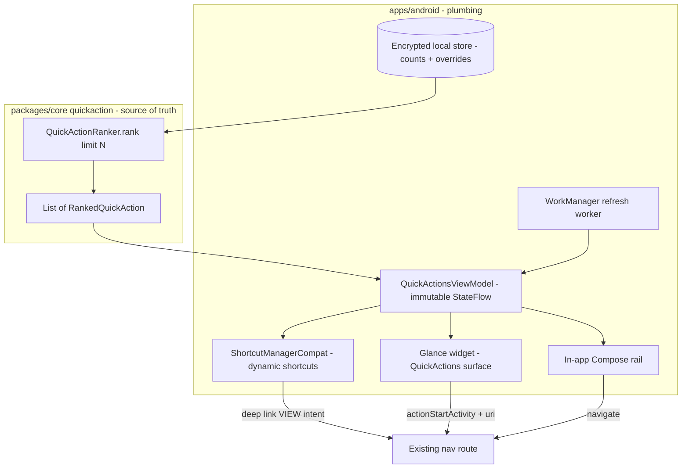
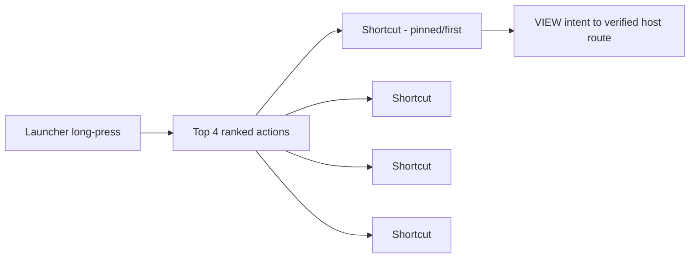
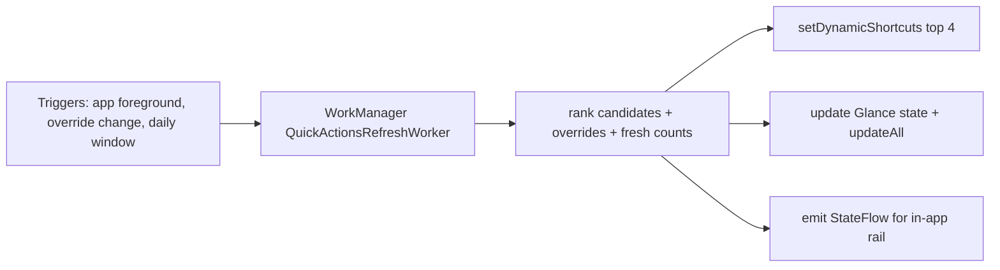

# Android Predictive Shortcuts & Widget Surfaces — Design

> **Status:** DESIGN — Implementation-ready (debug build/test unblocked; Play distribution gated by [#1242](https://github.com/jrmoulckers/finance/issues/1242))
> **Issue:** [#2569](https://github.com/jrmoulckers/finance/issues/2569) — _Part of [#2396](https://github.com/jrmoulckers/finance/issues/2396)_ (predictive quick actions)
> **Platform:** Android (Jetpack Compose · Material 3 · Glance · App Shortcuts · WorkManager) · **minSdk 28 / target 35**
> **Companion designs:** [Quick-Action Ranking Contract](./android-quick-action-ranking-contract.md) · [Cash Quick-Entry Deep Links](./android-cash-quick-entry-deep-links.md) · [Goal Projection Widget](./android-goal-projection-widget.md)
> **Last Updated:** 2026-06-22

This document designs the **three Android surfaces** that render predictive quick
actions — **App Shortcuts** (launcher long-press), a **Glance home-screen widget**,
and an **in-app quick-action rail** — plus the **pin / dismiss / disable** controls
users wield to take charge of what appears. All three surfaces draw from the **same
ranked list** produced by the shared
[ranking contract](./android-quick-action-ranking-contract.md); none of them invent
ordering or finance math.

Prediction is **on-device** and **privacy-preserving**: no behavioral data leaves
the device. This is a **design + breakdown** only — the App Shortcut and Glance
plumbing is **implementable now in debug** (`assembleDebug` sideload); only Play
Store distribution is human-gated by
[#1242](https://github.com/jrmoulckers/finance/issues/1242).

---

## Table of Contents

1. [Goals & Non-Goals](#1-goals--non-goals)
2. [Architecture Boundary (Compose ↔ KMP)](#2-architecture-boundary-compose--kmp)
3. [Grounding in Existing Code](#3-grounding-in-existing-code)
4. [Surface 1 — App Shortcuts](#4-surface-1--app-shortcuts)
5. [Surface 2 — Glance Home-Screen Widget](#5-surface-2--glance-home-screen-widget)
6. [Surface 3 — In-App Quick-Action Rail](#6-surface-3--in-app-quick-action-rail)
7. [Pin / Dismiss / Disable Controls](#7-pin--dismiss--disable-controls)
8. [Refresh: WorkManager & Glance](#8-refresh-workmanager--glance)
9. [Privacy & On-Device Prediction](#9-privacy--on-device-prediction)
10. [Accessibility (TalkBack, Switch Access, Font Scaling, Reduced Motion)](#10-accessibility-talkback-switch-access-font-scaling-reduced-motion)
11. [Offline, Empty & Error States](#11-offline-empty--error-states)
12. [Test Plan](#12-test-plan)
13. [Implementation Readiness](#13-implementation-readiness)
14. [Open Questions](#14-open-questions)
15. [References](#15-references)

---

## 1. Goals & Non-Goals

### Goals

- Surface predictive quick actions on **App Shortcuts**, a **Glance widget**, and an
  **in-app rail**, all bound to the same shared ranked list.
- Give users **pin / dismiss / disable** controls with predictable, explained
  outcomes (per the [ranking contract](./android-quick-action-ranking-contract.md)).
- Deep-link each surface action to the **existing destination route** (reusing the
  app's verified App Links host) — no new navigation math.
- Keep prediction **on device** and **privacy-safe** — counts only, no behavioral
  data off device.
- Refresh surfaces efficiently with **WorkManager** + Glance state (never
  AlarmManager/JobScheduler).

### Non-Goals

- **No ranking logic here.** Ordering, scoring, overrides precedence, and fallback
  are the shared `QuickActionRanker` — this doc only **renders** its output
  (see [ranking contract](./android-quick-action-ranking-contract.md)).
- **No finance math in Glance/Compose.** Surfaces show labels and route to flows;
  any amounts shown obey existing widget privacy formatting.
- **No new deep-link infrastructure.** Reuse the verified `https://finance.app`
  host and the route taxonomy from the
  [cash quick-entry deep links](./android-cash-quick-entry-deep-links.md) design.
- **No XML/View UI.** Glance + Compose only.
- **No Play distribution work** (gated by #1242 — see §13).

---

## 2. Architecture Boundary (Compose ↔ KMP)

The shared module ranks; Android renders the **same** ranked list to three
surfaces. The Android layer owns only platform plumbing (ShortcutManager, Glance,
deep-link routing) and privacy-safe persistence.

- One **source list**, three **renderers**. This guarantees parity: the App
  Shortcut order, widget order, and rail order agree because they all call
  `rank(...)` with the appropriate `limit`.
- The **destination** strings on each `QuickActionCandidate` map to existing routes;
  surfaces translate them into deep-link `Uri`s on the verified host.

---

## 3. Grounding in Existing Code

| Concern                  | Existing source (reuse — do **not** fork)                                                                                           | Today's state                                                               |
| ------------------------ | ----------------------------------------------------------------------------------------------------------------------------------- | --------------------------------------------------------------------------- |
| Ranked output            | [`QuickActionRanker`](../../packages/core/src/commonMain/kotlin/com/finance/core/quickaction/QuickActionRanking.kt)                 | Exists — see [ranking contract](./android-quick-action-ranking-contract.md) |
| Existing widgets         | [`QuickEntryWidget`](../../apps/android/src/main/kotlin/com/finance/android/widget/QuickEntryWidget.kt), `QuickTransactionWidget`   | Exist (Glance) — quick-entry buttons launch the app                         |
| Widget privacy formatter | [`WidgetPrivacyFormatter`](../../apps/android/src/main/kotlin/com/finance/android/widget/WidgetPrivacyFormatter.kt)                 | Exists — privacy-safe widget text                                           |
| Widget refresh           | [`WidgetUpdater`](../../apps/android/src/main/kotlin/com/finance/android/widget/WidgetUpdater.kt)                                   | Exists — widget update plumbing                                             |
| Deep-link host           | `AndroidManifest.xml` App Links (`https://finance.app`, `autoVerify`)                                                               | Exists — `/auth/callback`, `/invite`, `/transaction`                        |
| Deep-link design         | [Cash Quick-Entry Deep Links](./android-cash-quick-entry-deep-links.md)                                                             | Exists — route taxonomy + App Shortcut wiring pattern                       |
| Default candidates       | [`DefaultQuickActions`](../../packages/core/src/commonMain/kotlin/com/finance/core/quickaction/QuickActionRanking.kt)               | Exists — fallback ordered set                                               |
| The gap to fill          | Dynamic App Shortcuts + a predictive Glance "Quick Actions" widget + in-app rail bound to the ranked list, with pin/dismiss/disable | **Not built** — this is the design target                                   |

> No static `<shortcuts>` resource exists in the manifest yet — predictive shortcuts
> are **dynamic** (`ShortcutManagerCompat.pushDynamicShortcut`), which is exactly
> what a learned, reorderable set needs.

---

## 4. Surface 1 — App Shortcuts

Long-pressing the launcher icon shows up to **four** dynamic shortcuts, drawn from
`rank(..., limit = 4)`.

- **Dynamic, not static.** Use `ShortcutManagerCompat.pushDynamicShortcut` /
  `setDynamicShortcuts` so the set reflects the current ranking and overrides.
- **Pinned-first.** Pinned actions always lead (the ranker guarantees this);
  remaining slots fill by score / default order.
- **Stable IDs.** Shortcut `id` = `QuickActionCandidate.id` (a product id, never a
  user/entity id), so the launcher can de-dupe and the user can pin a shortcut to
  the home screen.
- **Deep link.** Each shortcut's intent is a `VIEW` intent to
  `https://finance.app/<destination>` (verified host), landing in the existing flow.
- **Labels.** `shortLabel`/`longLabel` come from the candidate's `titleKey` /
  `descriptionKey` (localized; never hardcoded English).
- **Rank-rate limiting.** Android throttles shortcut updates; refresh is coalesced
  through WorkManager (§8) — never per-tap.

---

## 5. Surface 2 — Glance Home-Screen Widget

A small **Glance** "Quick Actions" widget shows the top **3–4** ranked actions as
tappable tiles.

- **Glance only** (no RemoteViews XML). Mirrors the existing
  [`QuickEntryWidget`](../../apps/android/src/main/kotlin/com/finance/android/widget/QuickEntryWidget.kt)
  pattern but renders the **ranked** set instead of fixed buttons.
- **Each tile** = icon + localized label + `contentDescription`; tapping fires
  `actionStartActivity` with the deep-link `Uri` to the existing route.
- **No finance numbers** required for action tiles; if any future variant shows a
  value, it must route through
  [`WidgetPrivacyFormatter`](../../apps/android/src/main/kotlin/com/finance/android/widget/WidgetPrivacyFormatter.kt)
  and respect lock-screen privacy (see [goal projection widget](./android-goal-projection-widget.md)).
- **State** is provided via Glance state updated by the refresh worker (§8); the
  widget never computes ranking — it reads a serialized ranked list snapshot.
- **Resilient sizing** — tiles wrap/scale for 2×2 up to 4×1; degrade to fewer tiles
  on small sizes rather than truncating labels.

---

## 6. Surface 3 — In-App Quick-Action Rail

A horizontally scrollable **Compose** rail (e.g. atop the dashboard) renders the
**full** ranked list (`limit = all`), and is the primary place users manage
overrides.

- **Material 3** assist/suggestion chips or cards; dynamic color (Material You).
- **Each item** carries label + description + state; tap navigates via the existing
  NavHost route (no deep link round-trip needed in-app).
- **Overflow menu** per item exposes **Pin**, **Dismiss**, and **Disable** (§7).
- **Fallback labeling** — when `fallbackApplied` is true, the rail header reads
  "Suggested" (defaults) rather than "Recent"/"For you", so we never imply learning
  that did not happen.

---

## 7. Pin / Dismiss / Disable Controls

These map directly to `QuickActionOverrides` in the
[ranking contract §5](./android-quick-action-ranking-contract.md#5-override-behavior-pin--dismiss--disable).
The UI only **collects intent** and persists override sets; the shared ranker
applies precedence.

| Control     | Where exposed                          | Result (per shared ranker)                   | Reversible?                 |
| ----------- | -------------------------------------- | -------------------------------------------- | --------------------------- |
| **Pin**     | Rail overflow; launcher "pin shortcut" | Locked to top, in pin order                  | Yes — unpin                 |
| **Dismiss** | Rail overflow; widget tile long-press  | Demoted below normal actions (still present) | Yes — reappears by score    |
| **Disable** | Rail overflow → Settings list          | Removed from all surfaces                    | Yes — re-enable in Settings |

- **Confirmation & undo.** Dismiss/disable show a Snackbar with **Undo** so an
  accidental action is recoverable; disable is also always reversible in Settings.
- **State announced.** Each control announces the outcome for TalkBack (§10).
- **Persistence.** Override sets live in the encrypted local store and feed
  `rank(...)`; a refresh (§8) re-pushes shortcuts/widget to reflect the change.
- **No dark patterns.** Disable truly hides the action; we never re-surface a
  disabled action through a "you might have missed this" nudge.

---

## 8. Refresh: WorkManager & Glance

Surfaces are refreshed by a single coalesced path — **never** per interaction and
**never** with AlarmManager/JobScheduler.

- **Worker** (extends the existing WorkManager setup; see
  [`SyncWorker`](../../apps/android/src/main/kotlin/com/finance/android/sync/SyncWorker.kt)
  for the established pattern) recomputes ranking and re-pushes shortcuts + widget.
- **Triggers**: app foreground, any override change (immediate, debounced), and a
  light daily/periodic window to roll the freshness window.
- **Coalesced** to respect launcher shortcut rate limits and battery.
- **In-app** the rail observes the `StateFlow` directly — no worker needed while the
  screen is live.

---

## 9. Privacy & On-Device Prediction

- **All prediction is local.** Counts and overrides live in the **encrypted**
  local store; ranking runs in-process via the shared pure function. **No behavioral
  data leaves the device.**
- **No identifiers off device.** Only bounded aggregate **counts**
  (`QuickActionUsefulnessEvent`) are eligible for **opt-in** telemetry, and only via
  the allow-list guard — see
  [ranking contract §8](./android-quick-action-ranking-contract.md#8-privacy-safe-aggregate-metrics).
- **Widget/lock-screen** action tiles show **labels only**, no balances/amounts; any
  future value uses `WidgetPrivacyFormatter` + lock-screen redaction.
- **Logging** via Timber, debug builds only, aggregate event name only — never raw
  per-action behavior, never financial data.

---

## 10. Accessibility (TalkBack, Switch Access, Font Scaling, Reduced Motion)

- **TalkBack** — every shortcut, widget tile, and rail item has a localized
  `contentDescription` ("Add transaction. Suggested action."). Override controls
  announce **state and result**: "Pinned — kept at the top", "Dismissed — moved
  down. Undo available.", "Disabled — hidden from suggestions. Re-enable in
  Settings."
- **Switch Access** — pin/dismiss/disable are reachable as focusable controls in the
  rail overflow menu; no gesture-only paths. Widget tiles and shortcuts are standard
  activatable targets.
- **200% font scaling** — rail chips/cards and widget tiles use `sp` text and
  wrap/scale; labels never truncate. The widget degrades to fewer tiles rather than
  clipping text at large scales.
- **Reduced motion** — rail reorder/enter animations respect the system
  reduced-motion setting (animator duration scale = 0 → no animation); the new order
  still applies instantly. Widget/shortcut updates are non-animated by nature.
- **Order stability** — deterministic ranking yields a predictable traversal order;
  it does not reshuffle mid-session. Cognitive mode may prefer the stable default
  order — see [Cognitive Accessibility Mode](./cognitive-accessibility.md) and
  [Accessibility Patterns Library](./accessibility-patterns.md).
- **Touch targets** — all interactive targets ≥ 48dp; overflow affordances have
  long-press alternatives surfaced as explicit menu items.

---

## 11. Offline, Empty & Error States

| Condition                         | Behavior                                                                                                                                                                              |
| --------------------------------- | ------------------------------------------------------------------------------------------------------------------------------------------------------------------------------------- |
| **Offline**                       | Fully local; surfaces work unchanged. No network needed.                                                                                                                              |
| **First run / no signals**        | `fallbackApplied = true` → default ordered set; rail header reads "Suggested" (see ranking contract §7).                                                                              |
| **All actions disabled**          | Rail shows a single "Turn suggestions back on in Settings" row; widget shows a quiet empty state, never blank; App Shortcuts fall back to a minimal default (e.g. "Add transaction"). |
| **Glance state stale/unreadable** | Render last-known snapshot or `DefaultQuickActions`; schedule a refresh; log via Timber (no sensitive data).                                                                          |
| **Shortcut push rate-limited**    | Skip this cycle; next coalesced refresh applies. No user-visible error.                                                                                                               |
| **Deep-link route missing**       | Land on a safe default (dashboard) and log; never crash from a stale destination string.                                                                                              |

---

## 12. Test Plan

### Shared unit tests (reuse)

- Ordering / override / fallback covered by
  [`QuickActionRankingTest`](../../packages/core/src/commonTest/kotlin/com/finance/core/quickaction/QuickActionRankingTest.kt).
  This doc adds **no** new shared math.

### Android unit tests (`apps/android/src/test`)

- `QuickActionsRefreshWorker` recomputes and pushes top-N to shortcuts + Glance.
- Destination → deep-link `Uri` mapping is correct for every `QuickActionType`.
- Override change triggers a debounced refresh; disabled actions are absent from
  pushed shortcuts.

### Compose / instrumentation tests

- Rail renders ranked order; overflow Pin/Dismiss/Disable mutate state and re-rank;
  Snackbar Undo restores.
- Deep-link instrumentation: launching each shortcut `Uri` (via `adb`) lands on the
  correct route.
- Semantics assertions for labels and announced override results.

### Paparazzi snapshot tests

- In-app rail: **learned order**, **fallback/Suggested**, **pinned-first**,
  **all-disabled empty state**.
- Glance widget preview at 2×2 and 4×1, normal + 200% font + reduced-motion (static).

---

## 13. Implementation Readiness

| Phase                                                                                                                                                       | Status               | Gate                                                                                                      |
| ----------------------------------------------------------------------------------------------------------------------------------------------------------- | -------------------- | --------------------------------------------------------------------------------------------------------- |
| This design doc                                                                                                                                             | ✅ Done              | None                                                                                                      |
| Shared ranking contract (consumed, not modified)                                                                                                            | ✅ Exists            | None — `packages/core`, owned by `@native-app-engineer`                                                   |
| Dynamic App Shortcuts, Glance "Quick Actions" widget, in-app rail, WorkManager refresh, deep-link routing, unit/Compose/Paparazzi, `assembleDebug` sideload | 🟢 **Buildable now** | None — debug sideload per [`../ops/human-gated-prerequisites.md` §2](../ops/human-gated-prerequisites.md) |
| Play Store release + production widget / App Shortcut distribution on the live listing                                                                      | 🔒 **Gated**         | [#1242](https://github.com/jrmoulckers/finance/issues/1242) — keystore + Play Console                     |

App Shortcuts (`ShortcutManagerCompat`) and Glance widget plumbing are **standard
local Android code** — fully implementable and testable today with
`./gradlew :apps:android:assembleDebug`, `adb`-driven deep-link instrumentation, and
Paparazzi snapshots. The verified App Links host already exists in the manifest.
Ranking math stays in `packages/core`. **Only Play distribution** (release signing,
Play Console upload, production listing) is human-gated by #1242 — see
[`../ops/human-gated-prerequisites.md`](../ops/human-gated-prerequisites.md) §§2–3.1.
No build, signing, or store action is performed by this design.

---

## 14. Open Questions

1. **Widget tile count by size.** Confirm 3 (2×2) vs 4 (4×1) tile counts and the
   small-size degrade order.
2. **Pin vs launcher pin.** Reconcile in-app "Pin" (override) with the launcher's
   own "pin shortcut to home" — keep them independent but consistent in copy.
3. **Shortcut icons.** Need per-action vector icons from `@design-engineer`'s icon
   system; placeholders until provided.
4. **Refresh cadence.** Final WorkManager periodic window (e.g. once daily) plus the
   foreground/override triggers — tuned against launcher rate limits.

---

## 15. References

- Ranking contract (companion): [Quick-Action Ranking Contract](./android-quick-action-ranking-contract.md)
- Deep links / App Shortcuts pattern: [Cash Quick-Entry Deep Links](./android-cash-quick-entry-deep-links.md)
- Widget privacy & states: [Goal Projection Widget](./android-goal-projection-widget.md)
- Defaults persistence: [Quick-Add Defaults & Persistence](./android-quick-add-defaults-persistence.md)
- Accessibility: [Accessibility Patterns Library](./accessibility-patterns.md) · [Cognitive Accessibility Mode](./cognitive-accessibility.md)
- WorkManager pattern: [`SyncWorker`](../../apps/android/src/main/kotlin/com/finance/android/sync/SyncWorker.kt)
- Gating: [`../ops/human-gated-prerequisites.md`](../ops/human-gated-prerequisites.md)
