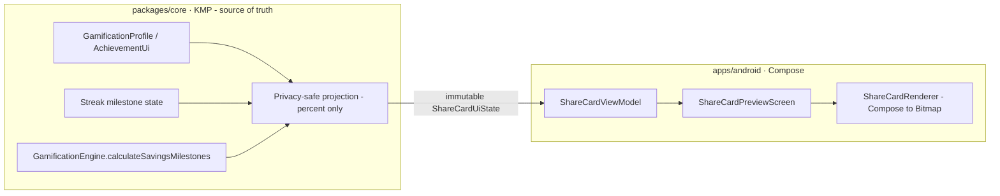
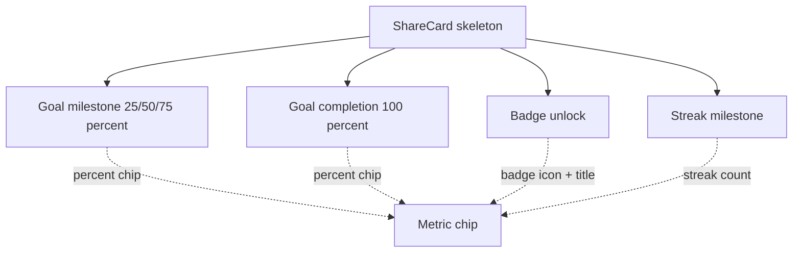
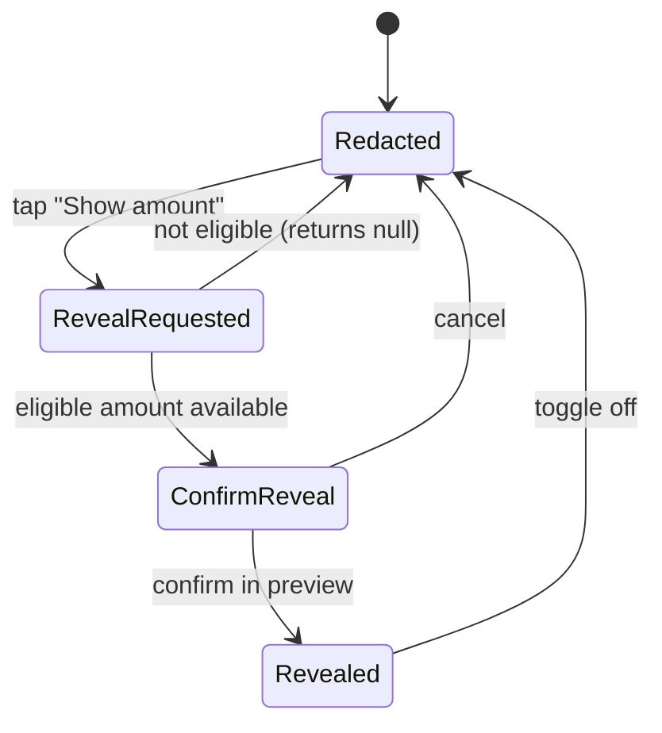

# Android Privacy-Safe Goal & Achievement Share Cards — Design

> **Status:** DESIGN — Implementation-ready (native build/test unblocked; store distribution gated by [#1242](https://github.com/jrmoulckers/finance/issues/1242))
> **Issue:** [#2682](https://github.com/jrmoulckers/finance/issues/2682) — _Part of [#2210](https://github.com/jrmoulckers/finance/issues/2210)_ (gamification sharing)
> **Platform:** Android (Jetpack Compose · Material 3)
> **Last Updated:** 2026-06-22

This document specifies **privacy-safe share cards** for goal milestones, goal
completions, badge unlocks, and streak milestones. A share card is a small,
celebratory image the user can hand to the **Android Sharesheet** (designed in
[android-sharesheet-wins-badges.md](./android-sharesheet-wins-badges.md)).

The single most important rule: **a share card must never leak a real balance or
dollar amount by default.** The default card shows **progress (percent) and
badges only**. Revealing any amount is an **explicit, per-share opt-in** with a
**redacted preview** the user must confirm before handoff.

This is a **rendering and consent surface.** All achievement, streak, and goal
math lives in the shared KMP layer (`packages/core`); Compose only renders the
already-computed, already-masked state.

---

## Table of Contents

1. [Goals & Non-Goals](#1-goals--non-goals)
2. [Architecture Boundary (Compose ↔ KMP)](#2-architecture-boundary-compose--kmp)
3. [Grounding in Existing Code](#3-grounding-in-existing-code)
4. [Share-Card Catalog & Templates](#4-share-card-catalog--templates)
5. [Privacy Model & Redaction](#5-privacy-model--redaction)
6. [Preview & Edit States](#6-preview--edit-states)
7. [Card Rendering (Compose → Bitmap)](#7-card-rendering-compose--bitmap)
8. [Accessibility (TalkBack, Switch Access, Font Scaling, Reduced Motion)](#8-accessibility-talkback-switch-access-font-scaling-reduced-motion)
9. [Offline, Empty & Error States](#9-offline-empty--error-states)
10. [Test Plan](#10-test-plan)
11. [Implementation Readiness](#11-implementation-readiness)
12. [Open Questions](#12-open-questions)

---

## 1. Goals & Non-Goals

### Goals

- Define **card templates** for four moments: goal milestone (25/50/75%), goal
  completion (100%), badge unlock, and streak milestone.
- Make every template render in a **percent-only / badge-only** mode that
  **hides dollar amounts** by default.
- Specify the **preview and edit** states the user sees **before** the Android
  Sharesheet handoff, including the **redaction toggle** and its confirmation.
- Provide **TalkBack labels** for every card, control, and preview surface.
- Define **safe defaults for parent-linked (teen / guardian-managed) accounts**
  so amounts are never shareable without guardian-level consent.
- Reuse the existing Android **ReferralScreen** share pattern and shared
  gamification models instead of duplicating business rules in Compose.

### Non-Goals

- **No money math in Compose.** Progress fractions, milestone thresholds, and
  unlock state come from `packages/core` (see §2–§3).
- **No amount in the default card.** Showing an amount is opt-in only (§5); the
  default never exposes `Goal.currentAmount` or any balance.
- **No Sharesheet plumbing here.** Intent dispatch, chooser, cancel/retry, and
  telemetry are specified in
  [android-sharesheet-wins-badges.md](./android-sharesheet-wins-badges.md).
- **No streak/near-win logic here.** Streak states are specified in
  [android-streak-near-win-states.md](./android-streak-near-win-states.md); this
  doc only renders a streak _milestone_ card from already-computed streak state.
- **No new shared models.** If a privacy-safe field is missing, it is an
  @native-app-engineer follow-up — not a Compose workaround that reaches for raw data.
- **No store distribution work** (gated by #1242 — see §11).

---

## 2. Architecture Boundary (Compose ↔ KMP)

The share card is a **pure projection** of shared state into pixels. Compose owns
the visual template, the redaction toggle, and the bitmap render; KMP owns every
number and unlock decision.

- The ViewModel exposes **one immutable `StateFlow<ShareCardUiState>`**.
- `ShareCardUiState` carries **only display-ready, already-masked fields**:
  a percent (`Int 0..100`), a badge title/icon token, a streak count, and an
  **optional** `revealableAmountLabel: String?` that is **null unless** the
  shared layer says an amount is eligible to be revealed.
- The **redaction toggle is a Compose UI state**, but the **amount string it can
  reveal is supplied (or withheld) by the shared projection** — Compose can never
  format a raw `Cents` value itself.
- For **parent-linked accounts**, the shared projection returns
  `revealableAmountLabel = null` regardless of the toggle, so the amount path is
  structurally unreachable on those accounts.

---

## 3. Grounding in Existing Code

| Concern                | Source of truth (do **not** reimplement in Compose)                                                                                                             | Today's state                                         |
| ---------------------- | --------------------------------------------------------------------------------------------------------------------------------------------------------------- | ----------------------------------------------------- |
| Achievement / badge    | [`AchievementDefinition` / `AchievementProgress`](../../packages/core/src/commonMain/kotlin/com/finance/core/gamification/GamificationTypes.kt)                 | Exists: title, icon token, rarity, `progressFraction` |
| Achievement UI model   | [`AchievementUi`](../../apps/android/src/main/kotlin/com/finance/android/ui/gamification/GamificationViewModel.kt)                                              | Exists: `isUnlocked`, `progressFraction`, `points`    |
| Goal progress          | [`GamificationEngine.calculateSavingsMilestones`](../../packages/core/src/commonMain/kotlin/com/finance/core/gamification/GamificationEngine.kt)                | Exists: 25/50/75/100% via milestone thresholds        |
| Streak milestone       | [`Streak`](../../packages/core/src/commonMain/kotlin/com/finance/core/gamification/GamificationTypes.kt) + [streak design](./android-streak-near-win-states.md) | `currentCount` / `bestCount` already shared           |
| Sensitive amount       | `Goal.currentAmount` (`Cents`) consumed by the engine — **never rendered by default**                                                                           | Exists; masked out of the default card                |
| Share text pattern     | [`ReferralScreen` + `getShareText()`](../../apps/android/src/main/kotlin/com/finance/android/ui/screens/referral/ReferralScreen.kt)                             | Exists: `onShare: (String) -> Unit` callback          |
| Privacy / masking      | Household privacy foundation — [android-household-privacy-dashboard.md](./android-household-privacy-dashboard.md)                                               | Exists: bucketed / percent summaries                  |
| Parent-linked defaults | Teen / guardian mode — [android-teen-beginner-mode.md](./android-teen-beginner-mode.md)                                                                         | Exists: restricted teen surfaces                      |

> The card **reuses** these models. It introduces **no new financial figures** and
> renders **percent + badge** by default. The only amount a card can ever show is
> one the **shared projection explicitly marks revealable** _and_ the user opts in
> to per share.

---

## 4. Share-Card Catalog & Templates

All templates share one layout skeleton (square + portrait variants) and differ
only in the celebratory headline and the metric chip.

| Template         | Default metric shown        | Never shown by default      | Headline copy (example)   |
| ---------------- | --------------------------- | --------------------------- | ------------------------- |
| Goal milestone   | Progress percent (e.g. 50%) | Saved amount, target amount | "Halfway to my goal!"     |
| Goal completion  | "Goal reached" + 100%       | Final saved amount          | "Goal complete!"          |
| Badge unlock     | Badge icon + title + rarity | Any financial figure        | "Unlocked: Budget Boss"   |
| Streak milestone | Streak count + unit         | Any financial figure        | "30-day tracking streak!" |

Design constraints for every template:

- **No raw amount node** exists in the default composition tree — there is nothing
  to accidentally un-hide.
- The metric chip binds to `ShareCardUiState.percent` /
  `badgeTitle` / `streakCount` — all non-financial.
- App brand mark + first-name-or-handle only (never full name / email).
- Square (1080×1080) for most apps; portrait (1080×1920) story variant.

---

## 5. Privacy Model & Redaction

The privacy model is **deny-by-default**: amounts are off, and turning them on is
a deliberate, visible, confirmable action.

Rules:

1. **Default = Redacted.** Every card opens with amounts hidden; the metric is a
   **percent or badge**, never currency.
2. **Reveal is per-share and non-sticky.** Opting in applies to the current share
   only and resets to redacted next time (no "remember amount" default).
3. **Eligibility is decided in shared code.** The toggle asks the shared
   projection for `revealableAmountLabel`. If it returns `null` (parent-linked
   account, household privacy rule, or unsupported template), the toggle is
   **disabled with an explanatory caption** — Compose never formats the value.
4. **Confirmation before reveal.** Turning amounts on shows a confirm step in the
   preview ("This card will show $1,000. Show it?") so the user sees exactly what
   would leave the device.
5. **Parent-linked safe default.** Teen / guardian-managed accounts always get
   `revealableAmountLabel = null`; sharing is **badge / percent only**, and a
   caption states amounts are off for linked accounts (see
   [android-teen-beginner-mode.md](./android-teen-beginner-mode.md)).
6. **Redaction also covers metadata.** No account name, institution, full name,
   or email is ever drawn — only an opt-in first name / handle.

---

## 6. Preview & Edit States

Before any Sharesheet handoff the user lands on a **preview** they can edit.

| State              | What the user sees                                                         | Primary action        |
| ------------------ | -------------------------------------------------------------------------- | --------------------- |
| Preview (default)  | Redacted card, template picker, "Show amount" toggle (off), "Share" button | Share                 |
| Editing            | Template swap (square ↔ portrait), light/dark, toggle accent color         | Apply                 |
| Reveal confirm     | Inline confirm sheet naming the exact amount that would appear             | Confirm / Cancel      |
| Amount disabled    | Toggle greyed with caption ("Amounts are off for linked accounts")         | (Share badge/percent) |
| Render in progress | Skeleton + "Preparing your card…" with progress semantics                  | (Cancelable)          |

- **Edits never touch numbers.** Only template, orientation, theme, and the
  redaction toggle are editable — the metric value is read-only shared state.
- The **"Share" button is disabled until the preview bitmap is ready**, so the
  handoff always carries a fully rendered, fully redacted image.
- Handoff itself (intent + chooser) is delegated to
  [android-sharesheet-wins-badges.md](./android-sharesheet-wins-badges.md) via an
  `onShare(card: ShareableCard)` callback, mirroring `ReferralScreen.onShare`.

---

## 7. Card Rendering (Compose → Bitmap)

The card is a normal `@Composable` rendered off-screen to a bitmap so the exact
preview pixels are what get shared.

- Use a Compose **`GraphicsLayer` capture** (`rememberGraphicsLayer()` +
  `drawWithContent { ... record }` → `toImageBitmap()`) on the same composable the
  user previews — preview and exported image cannot diverge.
- The bitmap is written to **app-internal cache** and shared via **FileProvider**
  content URI (no `WRITE_EXTERNAL_STORAGE`, no secrets on disk). File plumbing and
  grant flags are specified in the Sharesheet doc.
- Rendering is **deterministic and side-effect free** so Paparazzi snapshots match
  the exported image (§10).
- The exported image is a **picture, not data**: it contains only the redacted
  visuals — there is no embedded metadata, EXIF amount, or hidden payload.

---

## 8. Accessibility (TalkBack, Switch Access, Font Scaling, Reduced Motion)

- **TalkBack:** every card exposes one summarizing `contentDescription`, e.g.
  _"Share card: Halfway to my goal, fifty percent. Amounts hidden."_ When reveal
  is on it becomes _"…shows one thousand dollars."_ so the spoken description
  always matches the redaction state. The toggle, template chips, confirm, and
  share controls each have their own `contentDescription`.
- **Switch Access:** preview → template chips → reveal toggle → share form a
  logical, fully operable traversal order; the reveal-confirm sheet traps focus
  until confirmed or cancelled.
- **Font scaling (200%):** the card image renders at a **fixed internal density**
  (so shared images are legible everywhere), while the **surrounding preview UI**
  reflows with system font scale and never truncates the toggle caption.
- **Reduced motion:** the unlock/celebration shimmer respects
  `Settings.Global.ANIMATOR_DURATION_SCALE == 0` (and the app reduced-motion
  preference) by rendering a **static** celebratory card — no looping particles.
  See [animation-library.md](./animation-library.md) and
  [accessibility-patterns.md](./accessibility-patterns.md).
- **Color independence:** rarity / progress are conveyed by **text + icon**, not
  color alone, per [accessibility-patterns.md](./accessibility-patterns.md).
- **Plain language:** headline and caption copy follows
  [content-language-guidelines.md](./content-language-guidelines.md) — celebratory,
  never boastful about money.

---

## 9. Offline, Empty & Error States

| Condition                    | Behavior                                                                                  |
| ---------------------------- | ----------------------------------------------------------------------------------------- |
| Offline                      | Card generation is **fully local** — rendering and preview work with no network.          |
| No unlock / no milestone yet | Empty state: "No wins to share yet — reach a milestone to unlock a card" (no card shown). |
| Amount eligibility unknown   | Treat as **not eligible**: toggle disabled, fail closed to redacted.                      |
| Bitmap render failure        | Show retry with an apologetic message; **never** hand off a partial/blank image.          |
| Profile still loading        | Skeleton card with `contentDescription = "Loading your achievement"`.                     |
| Reveal requested but null    | Toggle stays off with caption; share proceeds with the redacted card.                     |

Fail-closed is the rule: any uncertainty about whether an amount may be shown
resolves to **hidden**.

---

## 10. Test Plan

- **Unit (ViewModel):** `ShareCardUiState` exposes percent/badge/streak and
  `revealableAmountLabel`; assert it is `null` for parent-linked accounts and for
  templates that never reveal amounts; assert reveal is non-sticky (resets each
  open).
- **Privacy parity (critical):** a semantics + render test asserts the **default**
  card contains **no currency glyph and no digit string matching an amount**, and
  that no `Goal.currentAmount` value reaches the composition unless the shared
  projection marked it revealable _and_ the toggle is confirmed.
- **Redaction state machine:** Redacted → RevealRequested → (null ⇒ Redacted) and
  (eligible ⇒ ConfirmReveal ⇒ Revealed/Redacted) all transition correctly.
- **Compose UI / semantics:** `contentDescription` present on card, toggle,
  template chips, confirm sheet, and share button; spoken description flips with
  redaction state; reveal-confirm traps Switch-Access focus.
- **Paparazzi snapshots:** each of the four templates, square + portrait, redacted
  vs revealed, light/dark + dynamic color, at default and 200% font scale, and a
  reduced-motion static variant.
- **Renderer determinism:** the captured bitmap equals the previewed composable
  (golden-image compare) so preview ≡ exported image.
- **Parent-linked:** snapshot + unit test that the reveal toggle is disabled and
  captioned on teen / guardian-managed accounts.

---

## 11. Implementation Readiness

Per [`../ops/human-gated-prerequisites.md`](../ops/human-gated-prerequisites.md)
§2 (Implementation vs. Distribution), this feature is **decoupled**: design and
native implementation are buildable and testable now; only store distribution
waits on #1242. Card images are generated and previewed entirely on-device.

### ✅ Buildable now (debug / free signing — no enrollment, no secrets)

- This design doc and the privacy/redaction contract.
- All Compose UI, `ShareCardViewModel`, the `ShareCardRenderer` (Compose → bitmap),
  FileProvider cache wiring, and Koin registration.
- Unit tests, the privacy-parity tests, Compose semantics/UI tests, and Paparazzi
  snapshots.
- Local verification via `./gradlew :apps:android:assembleDebug` + sideload, per
  [`../ops/human-gated-prerequisites.md`](../ops/human-gated-prerequisites.md)
  §2 "Free local build/test paths."
- Any missing privacy-safe projection field is a `packages/core` change (owned by
  @native-app-engineer) — also unblocked; not store-gated.

### 🔒 Distribution tail — gated by [#1242](https://github.com/jrmoulckers/finance/issues/1242)

- Release signing with the production keystore.
- Google Play Console upload / release-track promotion.
- The signed-AAB release workflow and its CI secrets.
- Any Play data-safety declaration covering shared imagery.

These are **human-gated** and out of scope for SME agents — see the
[Human-Gated Prerequisites Runbook](../ops/human-gated-prerequisites.md) §3.1.
Until then the cards are fully exercisable via debug sideload (the Sharesheet
chooser opens locally; see the Sharesheet doc).

---

## 12. Open Questions

1. **Revealable eligibility owner** — should the "amount is revealable" decision be
   a new field on the shared gamification projection, or derived from the existing
   household privacy rule set? (@native-app-engineer)
2. **Handle vs first name** — is the opt-in identity on a card a profile handle, a
   first name, or fully anonymous by default?
3. **Story variant scope** — do we ship the portrait/story template in v1, or
   start with the square card only?
4. **Brand mark policy** — confirm the brand mark/wordmark usage on user-generated
   share imagery with @design-engineer.
5. **Locale formatting** — when an amount _is_ revealed, confirm currency/locale
   formatting comes from the shared formatter (never a Compose `String.format`).
