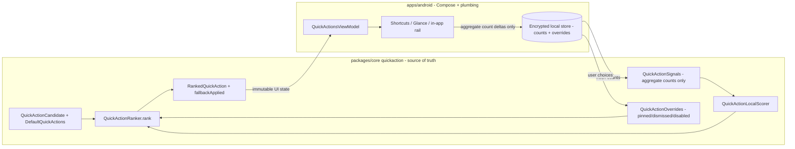
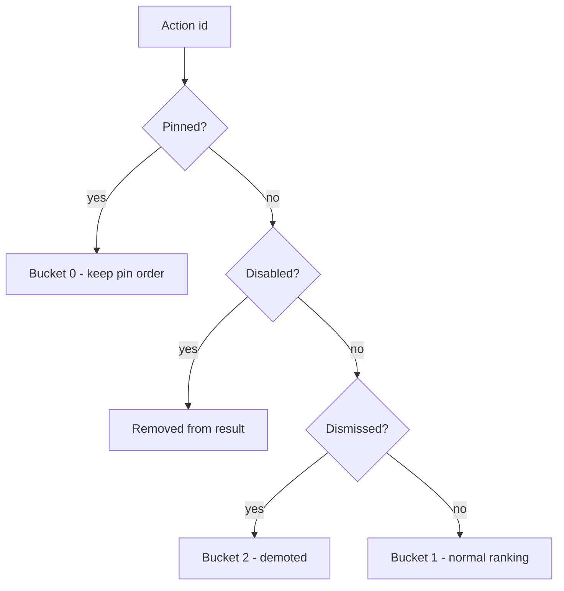

# Android Quick-Action Ranking Contract — Design

> **Status:** DESIGN — Implementation-ready (debug build/test unblocked; Play distribution gated by [#1242](https://github.com/jrmoulckers/finance/issues/1242))
> **Issue:** [#2567](https://github.com/jrmoulckers/finance/issues/2567) — _Part of [#2396](https://github.com/jrmoulckers/finance/issues/2396)_ (predictive quick actions)
> **Platform:** Android (Jetpack Compose · Material 3 · Glance · App Shortcuts) · **minSdk 28 / target 35**
> **Companion designs:** [Predictive Shortcuts & Widget Surfaces](./android-predictive-shortcuts-widgets.md) · [Cash Quick-Entry Deep Links](./android-cash-quick-entry-deep-links.md) · [Quick-Add Defaults & Persistence](./android-quick-add-defaults-persistence.md)
> **Last Updated:** 2026-06-22

This document defines the **ranking contract** that decides _which_ quick actions
the Android client surfaces, _in what order_, and _how the user can override_ that
order. It specifies the **local candidate/scoring inputs**, **override behavior**
(pin / dismiss / disable), the **stale fallback** used when there is no signal, and
the **privacy-safe aggregate metrics** that let us measure usefulness **without any
behavioral data leaving the device**.

The ranking math already lives in shared KMP code at
[`packages/core/.../quickaction/QuickActionRanking.kt`](../../packages/core/src/commonMain/kotlin/com/finance/core/quickaction/QuickActionRanking.kt).
This doc treats that file as the **source of truth** and describes the
**Compose-renders-shared-state boundary** — Android consumes a ranked list, never
re-implements scoring. No Kotlin is written here; this is a design + breakdown only.

---

## Table of Contents

1. [Goals & Non-Goals](#1-goals--non-goals)
2. [Architecture Boundary (Compose ↔ KMP)](#2-architecture-boundary-compose--kmp)
3. [Grounding in Existing Code](#3-grounding-in-existing-code)
4. [Candidate & Scoring Inputs](#4-candidate--scoring-inputs)
5. [Override Behavior (Pin / Dismiss / Disable)](#5-override-behavior-pin--dismiss--disable)
6. [Deterministic Ranking & Tie-Breaks](#6-deterministic-ranking--tie-breaks)
7. [Stale Fallback](#7-stale-fallback)
8. [Privacy-Safe Aggregate Metrics](#8-privacy-safe-aggregate-metrics)
9. [Android Adapter Responsibilities](#9-android-adapter-responsibilities)
10. [Accessibility (TalkBack, Switch Access, Font Scaling, Reduced Motion)](#10-accessibility-talkback-switch-access-font-scaling-reduced-motion)
11. [Offline, Empty & Error States](#11-offline-empty--error-states)
12. [Test Plan](#12-test-plan)
13. [Implementation Readiness](#13-implementation-readiness)
14. [Open Questions](#14-open-questions)
15. [References](#15-references)

---

## 1. Goals & Non-Goals

### Goals

- Define a **stable contract** for ranking quick actions that every Android surface
  (App Shortcuts, Glance widget, in-app rail) consumes identically.
- Describe the **local signal inputs** (impression / selection / completion /
  dismissal counts) and how the shared scorer turns them into an ordered list.
- Specify **override precedence** so a user can **pin**, **dismiss**, or **disable**
  an action and get a predictable, explainable result.
- Define the **stale fallback** ordering used on first run or when no fresh signal
  exists, and the `fallbackApplied` flag the UI may surface.
- Define **privacy-safe aggregate metrics** (counts only) that measure ranking
  usefulness while keeping **all behavioral data on device**.

### Non-Goals

- **No scoring math in Compose.** Weights, caps, tie-breaks, and fallback logic are
  the shared `QuickActionRanker` / `QuickActionLocalScorer` — the UI renders the
  result (see §2).
- **No new Kotlin in this issue.** The shared contract already exists; this doc
  scopes the Android binding and states. Implementation follows once agreed.
- **No surface layout here.** App Shortcut / widget / rail visuals and the
  pin/dismiss/disable affordances live in the companion
  [predictive shortcuts & widget surfaces](./android-predictive-shortcuts-widgets.md)
  doc; this doc is the **contract** they both bind to.
- **No off-device profiling.** No payees, amounts, account ids, or per-action ids
  ever leave the device. Only bounded aggregate **counts** (see §8).
- **No server-side ranking.** Prediction is **on-device** and deterministic.
- **No Play distribution work** (gated by #1242 — see §13).

---

## 2. Architecture Boundary (Compose ↔ KMP)

Ranking is **shared state rendered by Compose**. The shared module owns the
candidate set, the scorer, the overrides model, and the deterministic ranker. The
Android side supplies _local, privacy-safe signals_ and _user overrides_, then
renders the returned `List<RankedQuickAction>`.



- The **only** numbers Android feeds in are **bounded aggregate counts** and the
  user's **override sets** — never raw events, timestamps of individual taps, or any
  entity identifiers.
- `QuickActionRanker.rank(candidates, overrides, limit)` is **pure and
  deterministic**: same inputs → same order. This makes it trivially testable and
  reproducible in Paparazzi snapshots.
- The ViewModel maps the ranked list into an **immutable UI state**; Compose draws
  it. No ranking decision is ever made in a Composable.

---

## 3. Grounding in Existing Code

| Concern                   | Source of truth (do **not** reimplement in Compose)                                                                                                 | Today's state                                                          |
| ------------------------- | --------------------------------------------------------------------------------------------------------------------------------------------------- | ---------------------------------------------------------------------- |
| Action taxonomy           | [`QuickActionType`](../../packages/core/src/commonMain/kotlin/com/finance/core/quickaction/QuickActionRanking.kt)                                   | Exists: 7 platform-neutral types; enum order is a tie-break input      |
| Candidate model           | [`QuickActionCandidate`](../../packages/core/src/commonMain/kotlin/com/finance/core/quickaction/QuickActionRanking.kt)                              | Exists: `id`, `titleKey`, `descriptionKey`, `destination`, `baseScore` |
| Local signals             | [`QuickActionSignals`](../../packages/core/src/commonMain/kotlin/com/finance/core/quickaction/QuickActionRanking.kt)                                | Exists: counts only; `contributesToPrediction` requires `isFresh`      |
| Scoring                   | [`QuickActionLocalScorer`](../../packages/core/src/commonMain/kotlin/com/finance/core/quickaction/QuickActionRanking.kt)                            | Exists: weighted + capped, clamped at 0                                |
| Overrides                 | [`QuickActionOverrides` / `QuickActionOverrideState`](../../packages/core/src/commonMain/kotlin/com/finance/core/quickaction/QuickActionRanking.kt) | Exists: pinned / dismissed / disabled precedence                       |
| Ranker                    | [`QuickActionRanker.rank`](../../packages/core/src/commonMain/kotlin/com/finance/core/quickaction/QuickActionRanking.kt)                            | Exists: deterministic ordering + `fallbackApplied`                     |
| Stale fallback set        | [`DefaultQuickActions`](../../packages/core/src/commonMain/kotlin/com/finance/core/quickaction/QuickActionRanking.kt)                               | Exists: sensible default ordered candidates                            |
| Aggregate metric          | [`QuickActionUsefulnessEvent`](../../packages/core/src/commonMain/kotlin/com/finance/core/quickaction/QuickActionRanking.kt)                        | Exists: counts only; `hasOnlyAggregateCountProperties()` guard         |
| Contract tests            | [`QuickActionRankingTest`](../../packages/core/src/commonTest/kotlin/com/finance/core/quickaction/QuickActionRankingTest.kt)                        | Exists: shared deterministic ranking coverage                          |
| The gap to fill (Android) | A `QuickActionsViewModel` + encrypted local store that supplies counts/overrides and renders `RankedQuickAction`                                    | **Not built** — this is the design target                              |

> The shared layer is already complete. The Android work is **wiring + states +
> persistence**: store counts/overrides encrypted, call `rank(...)`, render the
> result, and emit aggregate metrics. No new finance/ranking math.

---

## 4. Candidate & Scoring Inputs

### Candidate set

Candidates come from the shared `DefaultQuickActions.candidates` (or a
product-curated subset). Each `QuickActionCandidate` carries a **stable `id`**
(never a user/account/entity id), localization keys (`titleKey`,
`descriptionKey`), a `destination` route, a `defaultOrder`, and a `baseScore`.

### Signals (counts only)

`QuickActionSignals` carries four bounded aggregate counts plus an `isFresh` flag:

| Signal            | Meaning                                 | Used by scorer when               |
| ----------------- | --------------------------------------- | --------------------------------- |
| `impressionCount` | times the action was shown              | `contributesToPrediction` is true |
| `selectionCount`  | times the user tapped it                | `contributesToPrediction` is true |
| `completionCount` | times the action's flow was completed   | `contributesToPrediction` is true |
| `dismissalCount`  | times the user dismissed it             | `contributesToPrediction` is true |
| `isFresh`         | recency gate — stale counts are ignored | gates _all_ of the above          |

`contributesToPrediction = isFresh && hasUsefulnessCounts`. If a candidate is not
fresh, its counts are ignored and the **base score** is used — this is how the
contract avoids letting old behavior dominate forever.

### Scoring (shared, capped)

`QuickActionLocalScorer.score(candidate)` computes:

```text
score = baseScore
      + min(impressionCount * 2, 20)
      + min(selectionCount  * 8, 40)
      + min(completionCount * 12, 48)
      - min(dismissalCount  * 15, 45)
      clamped to >= 0
```

- **Completion is weighted highest** (the user finished what they intended) and
  **dismissal is the strongest negative** (they actively rejected it).
- Each term is **capped** so no single signal can run away.
- Android **never** computes this — it reads `RankedQuickAction.score` if it needs
  to display or debug, but ordering already encodes it.

> **Freshness is an Android responsibility to _supply_, not to _interpret_.** The
> local store decides whether a count window is fresh (e.g. rolling N-day window)
> and sets `isFresh`; the shared scorer decides what fresh means for scoring.

---

## 5. Override Behavior (Pin / Dismiss / Disable)

User control beats prediction. `QuickActionOverrides` holds three disjoint
intentions, resolved by `stateFor(actionId)`:

| Override      | User intent                   | Effect on ranking                               |
| ------------- | ----------------------------- | ----------------------------------------------- |
| **Pinned**    | "Always keep this at the top" | Highest bucket; ordered by the user's pin order |
| **Normal**    | (no override)                 | Ranked by score / defaults                      |
| **Dismissed** | "Not now — push it down"      | Demoted below all normal actions, still present |
| **Disabled**  | "Never show this"             | Removed entirely from the result                |



- **Precedence is deterministic**: pinned > disabled > dismissed (see
  `QuickActionOverrides.stateFor`). Pinned wins even if also dismissed.
- **Disable is reversible** and lives in settings (an "off" action is not lost — the
  user can re-enable it). This is the safety valve for users who find prediction
  noisy.
- Android persists these three sets in the **encrypted local store** and feeds them
  straight into `rank(...)`. The UI exposes pin/dismiss/disable affordances (see the
  [surfaces doc](./android-predictive-shortcuts-widgets.md)).

---

## 6. Deterministic Ranking & Tie-Breaks

`QuickActionRanker.rank` sorts by, in order:

1. **Override bucket** — pinned (0), normal (1), dismissed (2); disabled is dropped.
2. **Pinned list order** — within pinned, the user's explicit order.
3. **Score descending** — _only when fresh signals exist_ (`fallbackApplied` false).
4. **`defaultOrder`** — product-curated ordering.
5. **`QuickActionType` enum ordinal** — stable taxonomy order.
6. **`id`** — final lexicographic tie-break.

Because every tie-break terminates in a unique `id`, the ranking is **total and
reproducible** — essential for snapshot tests and for not "jittering" the App
Shortcut list on every refresh. The `limit` parameter lets each surface ask for the
top _N_ (e.g. 4 App Shortcuts, 3 widget slots) from the same ordered list.

---

## 7. Stale Fallback

When **no candidate** has fresh, useful signals, `rank(...)` sets
`fallbackApplied = true` and orders by `baseScore`/`defaultOrder` using
`DefaultQuickActions`. This covers:

- **First run** — no behavioral history yet.
- **Post-reset / reinstall** — counts cleared.
- **Stale window** — all counts aged out of the freshness window.

Android behavior in fallback:

- Render the **default ordered set** so the surface is never empty or random.
- Optionally show a quiet **"Suggested"** label (vs. "Recent") so users understand
  these are defaults, not learned. Never imply personalization that did not happen.
- Continue collecting counts so the next refresh can transition out of fallback.

---

## 8. Privacy-Safe Aggregate Metrics

We measure _whether ranking helps_ without learning _what any individual did_.
`QuickActionUsefulnessEvent` carries **counts only** and self-validates via
`hasOnlyAggregateCountProperties()` against a fixed allow-list of keys:

| Property               | Meaning                        |
| ---------------------- | ------------------------------ |
| `shown_count`          | actions shown in the window    |
| `selected_count`       | actions tapped (≤ shown)       |
| `completed_count`      | flows completed (≤ selected)   |
| `dismissed_count`      | actions dismissed (≤ shown)    |
| `pinned_count`         | currently pinned actions       |
| `disabled_count`       | currently disabled actions     |
| `stale_fallback_count` | refreshes served from fallback |

**Privacy invariants (must hold):**

- **No identifiers** — no action ids, account ids, transaction ids, payees, amounts,
  or timestamps of individual taps. The model's `init` enforces non-negativity and
  the `selected ≤ shown`, `completed ≤ selected`, `dismissed ≤ shown` envelopes.
- **On-device aggregation** — counts are accumulated locally over a window; only the
  rolled-up event is eligible for telemetry, and only if the user has opted into
  analytics. No behavioral data leaves the device by default.
- **Allow-list enforced** — emit only if `hasOnlyAggregateCountProperties()` is true.
- **Logging** — never log raw counts that could fingerprint; use Timber at debug only
  with the aggregate event name (`quick_action_usefulness`), never per-action detail.
  Never log financial data.

---

## 9. Android Adapter Responsibilities

The Android layer is a thin, privacy-respecting adapter around the shared ranker:

1. **Persist** counts and overrides in an **encrypted** store (SQLDelight +
   SQLCipher; secrets/keys via Keystore — never SharedPreferences for sensitive
   state). Counts are not "secrets" but stay in the encrypted DB for consistency.
2. **Compute freshness** (rolling window) and set `isFresh` per candidate.
3. **Call** `QuickActionRanker.rank(candidates, overrides, limit)` off the main
   thread; expose the result as an immutable `StateFlow` UI state.
4. **Render** to App Shortcuts (`ShortcutManagerCompat`), Glance widget, and the
   in-app rail — all from the **same** ranked list (see surfaces doc).
5. **Record** count deltas on impression / selection / completion / dismissal and
   roll them into `QuickActionUsefulnessEvent` for opt-in telemetry only.
6. **Background refresh** via **WorkManager** only (never AlarmManager/JobScheduler).

---

## 10. Accessibility (TalkBack, Switch Access, Font Scaling, Reduced Motion)

The contract itself is invisible, but every surface that renders its output must be
accessible. Requirements that the ranking contract makes easier:

- **TalkBack** — each ranked action has a localized `titleKey` + `descriptionKey`,
  so `contentDescription` is always available (e.g. "Add transaction. Suggested
  action."). Pin/dismiss/disable controls announce **state and result** ("Pinned —
  will stay at the top", "Dismissed — moved down", "Disabled — hidden from
  suggestions").
- **Order stability** — deterministic ranking means screen-reader and Switch Access
  users get a **predictable traversal order** that does not reshuffle between
  glances within a session.
- **Switch Access** — pin/dismiss/disable are standard focusable controls with clear
  labels; no gesture-only affordances (long-press alternatives required).
- **200% font scaling** — action rows use `sp` text and wrap; never truncate the
  action label. Surfaces must remain usable at the largest font scale.
- **Reduced motion** — any reorder animation when ranking changes must respect the
  system reduced-motion setting (animator duration scale = 0 → no motion); the new
  order still applies instantly without animation.
- See [Accessibility Patterns Library](./accessibility-patterns.md) and
  [Cognitive Accessibility Mode](./cognitive-accessibility.md). Cognitive mode may
  prefer the **stable default order** (fallback set) over learned reordering to
  reduce surprise — expose that as a setting.

---

## 11. Offline, Empty & Error States

| Condition                        | Behavior                                                                                              |
| -------------------------------- | ----------------------------------------------------------------------------------------------------- |
| **Offline**                      | Ranking is fully **local**; no network needed. No degraded state.                                     |
| **No signals (first run)**       | `fallbackApplied = true` → default ordered set; quiet "Suggested" labeling (§7).                      |
| **All actions disabled**         | Surface shows a minimal "Turn suggestions back on in Settings" affordance — never a blank widget.     |
| **Store read failure**           | Fall back to `DefaultQuickActions` in-memory; log via Timber (no sensitive data); retry next refresh. |
| **Limit larger than candidates** | Return all candidates; surfaces pad gracefully (no empty slots implying loss).                        |
| **Corrupt overrides**            | Treat as empty overrides (all normal); never crash; rebuild on next user action.                      |

---

## 12. Test Plan

### Shared unit tests (already present, extend as needed)

- [`QuickActionRankingTest`](../../packages/core/src/commonTest/kotlin/com/finance/core/quickaction/QuickActionRankingTest.kt)
  covers deterministic ordering, override precedence, scorer caps/clamp, and the
  fallback flag. Extend with edge cases the Android adapter relies on (limit
  boundaries, all-disabled, tie-break exhaustion).

### Android unit tests (`apps/android/src/test`)

- `QuickActionsViewModel` maps `List<RankedQuickAction>` → immutable UI state.
- Freshness windowing sets `isFresh` correctly across boundary dates.
- `QuickActionUsefulnessEvent` is only emitted when
  `hasOnlyAggregateCountProperties()` is true and analytics is opted in.
- Override persistence round-trips through the encrypted store.

### Compose / instrumentation tests

- Rail renders the ranked order; pin/dismiss/disable update state and re-rank.
- Semantics: each action exposes label + state; controls announce results.
- Disabled action disappears; re-enable restores it.

### Paparazzi snapshot tests

- In-app rail in: **fresh-learned order**, **fallback/default order**,
  **pinned-on-top**, **all-disabled empty affordance**.
- 200% font scale variant and reduced-motion (static) variant.

---

## 13. Implementation Readiness

| Phase                                                                                                                             | Status               | Gate                                                                                                      |
| --------------------------------------------------------------------------------------------------------------------------------- | -------------------- | --------------------------------------------------------------------------------------------------------- |
| This design doc                                                                                                                   | ✅ Done              | None                                                                                                      |
| Shared ranking contract (`QuickActionRanking.kt` + tests)                                                                         | ✅ Exists            | None — in `packages/core`, owned by `@native-app-engineer`                                                |
| Android adapter: encrypted store, `QuickActionsViewModel`, freshness, telemetry, unit/Compose/Paparazzi, `assembleDebug` sideload | 🟢 **Buildable now** | None — debug sideload per [`../ops/human-gated-prerequisites.md` §2](../ops/human-gated-prerequisites.md) |
| App Shortcuts / Glance widget rendering of ranked output (debug)                                                                  | 🟢 **Buildable now** | None — see [surfaces doc](./android-predictive-shortcuts-widgets.md)                                      |
| Play Store release + production App Shortcut / widget distribution                                                                | 🔒 **Gated**         | [#1242](https://github.com/jrmoulckers/finance/issues/1242) — keystore + Play Console                     |

The ranking adapter is **standard local Android code** — fully implementable and
testable today with `./gradlew :apps:android:assembleDebug` plus unit, Compose, and
Paparazzi tests. Ranking math stays in `packages/core` (owned by `@native-app-engineer`).
**Only Play distribution** (release signing, Play Console upload) is human-gated by
#1242 — see [`../ops/human-gated-prerequisites.md`](../ops/human-gated-prerequisites.md)
§§2–3.1. No build, signing, or store action is performed by this design.

---

## 14. Open Questions

1. **Freshness window length.** What rolling window (e.g. 14 vs 30 days) best
   balances responsiveness vs. stability before the shared `isFresh` gate kicks in?
   Default proposal: 30-day rolling, decay handled by ignoring stale counts.
2. **Per-surface limits.** Confirm slot counts: App Shortcuts (4 long-press), Glance
   widget (3–4), in-app rail (all). All drawn from the same ranked list via `limit`.
3. **"Suggested" vs "Recent" labeling.** Final copy for fallback vs learned states,
   reviewed for honesty (never imply learning that did not happen).
4. **Cognitive-mode default.** Should cognitive accessibility mode default to the
   stable fallback order rather than learned reordering? Proposed: yes, opt-out.

---

## 15. References

- Shared contract: [`QuickActionRanking.kt`](../../packages/core/src/commonMain/kotlin/com/finance/core/quickaction/QuickActionRanking.kt)
- Surfaces (companion): [Predictive Shortcuts & Widget Surfaces](./android-predictive-shortcuts-widgets.md)
- Deep links / App Shortcuts: [Cash Quick-Entry Deep Links](./android-cash-quick-entry-deep-links.md)
- Defaults persistence: [Quick-Add Defaults & Persistence](./android-quick-add-defaults-persistence.md)
- Accessibility: [Accessibility Patterns Library](./accessibility-patterns.md) · [Cognitive Accessibility Mode](./cognitive-accessibility.md)
- Gating: [`../ops/human-gated-prerequisites.md`](../ops/human-gated-prerequisites.md)
