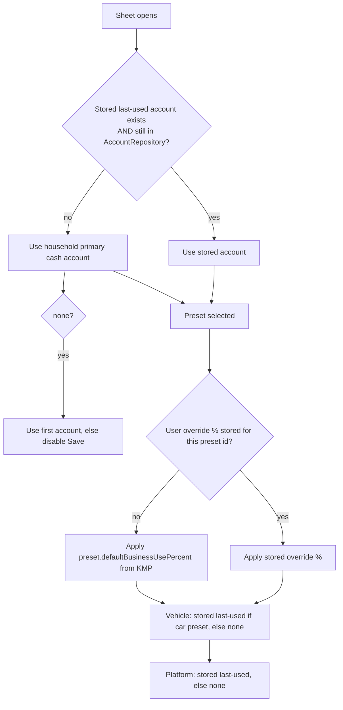
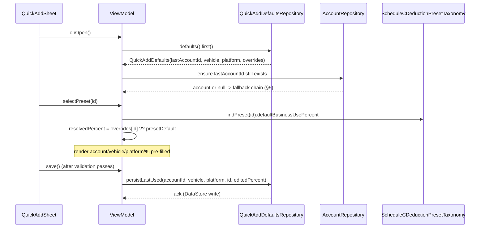

# Android Quick-Add Defaults & Preset Persistence — Design

> **Status:** Design / breakdown · **Issue:** [#2525](https://github.com/jrmoulckers/finance/issues/2525) · **Part of [#2141](https://github.com/jrmoulckers/finance/issues/2141)**
> **Platform:** Android (Jetpack Compose · Material 3) · **minSdk 28 / target 35**
> **Companion designs:** [Schedule C Quick-Add Sheet](./android-schedule-c-quick-add-sheet.md) · [Cash Quick-Entry Deep Links](./android-cash-quick-entry-deep-links.md)

Defines how the Android quick-add experience remembers the user's **last-used
account, vehicle, platform, business-use %, and category** so that logging the
next gig deduction is as close to zero-tap as possible — while keeping every
deduction _rule_ in shared KMP code.

This is a **design + breakdown** document. The persistence + Compose wiring is
**buildable now** in debug (`assembleDebug`); only **Play Store distribution** is
human-gated by [#1242](https://github.com/jrmoulckers/finance/issues/1242). See
[Implementation readiness](#implementation-readiness) and
[`../ops/human-gated-prerequisites.md`](../ops/human-gated-prerequisites.md).

---

## Table of Contents

1. [Problem & Goals](#1-problem--goals)
2. [What Gets Remembered](#2-what-gets-remembered)
3. [Architecture Boundary (KMP vs. Compose vs. Storage)](#3-architecture-boundary-kmp-vs-compose-vs-storage)
4. [Affected Android Surfaces & Shared Dependencies](#4-affected-android-surfaces--shared-dependencies)
5. [Default-Resolution Rules](#5-default-resolution-rules)
6. [Storage Design (DataStore — not SharedPreferences for secrets)](#6-storage-design-datastore--not-sharedpreferences-for-secrets)
7. [Lifecycle: Read, Apply, Persist](#7-lifecycle-read-apply-persist)
8. [Offline-First, Empty & Error States](#8-offline-first-empty--error-states)
9. [Accessibility (TalkBack, Switch Access, Font Scaling)](#9-accessibility-talkback-switch-access-font-scaling)
10. [Test Plan](#10-test-plan)
11. [Implementation readiness](#implementation-readiness)
12. [Open Questions](#open-questions)

---

## 1. Problem & Goals

From [#2141](https://github.com/jrmoulckers/finance/issues/2141): _"Keep the
last-used account / vehicle / platform selected to minimize taps... When I'm
parked between deliveries, every extra tap is friction."_

The [Schedule C quick-add sheet](./android-schedule-c-quick-add-sheet.md) is
only "two-tap" if the account, vehicle, platform, and business-use % are already
filled. This doc defines how those defaults are **resolved, applied, and
persisted** across sessions and across entry points (FAB, widget, App Shortcut).

**Goals**

- Restore the user's **last-used** selections instantly when the sheet opens.
- Provide **sensible fallbacks** when no history exists (e.g. preset default
  business-use %, the household's primary cash account).
- Keep the **rules** (what a preset's default business-use % _is_, proration,
  validation) in shared KMP — Android only stores _user preferences_.
- Make defaults **per-preset where it matters** (a Gas default % differs from a
  Phone % default).

**Non-goals**

- Storing any secret/credential (those use Keystore/biometric — see boundaries).
- Owning the Schedule C taxonomy or deductible math (lives in `packages/core`).
- Cross-device sync of these UI preferences (local-first; revisit if needed).

---

## 2. What Gets Remembered

| Default            | Scope                          | Source of truth for the _value set_                           | Fallback when no history                                       |
| ------------------ | ------------------------------ | ------------------------------------------------------------- | -------------------------------------------------------------- |
| **Account**        | Global (last-used overall)     | `AccountRepository` (household accounts)                      | Household primary cash account → first account → none.         |
| **Vehicle**        | Global, applies to car presets | App-local vehicle list (gig vehicles)                         | Most-recently-used → single vehicle → none.                    |
| **Platform**       | Global (Uber/Lyft/DoorDash…)   | App-local platform tag list                                   | Last-used → none (optional field).                             |
| **Business-use %** | **Per-preset**                 | Override value the user last confirmed for _that preset_      | Preset's `defaultBusinessUsePercent` from the shared taxonomy. |
| **Category**       | Per-preset (derived)           | The preset's `category` (shared); not user-editable per entry | Always the preset's Schedule C category.                       |

**Key distinction:** _Category_ and the _default_ business-use % are **shared
rules** (read from `ScheduleCDeductionPresetTaxonomy`). What Android persists is
the user's **last confirmed override** of business-use % and their **last-used
account/vehicle/platform** — i.e. preferences, not finance logic.

---

## 3. Architecture Boundary (KMP vs. Compose vs. Storage)

```mermaid
flowchart TD
    subgraph KMP["packages/core (rules — read only here)"]
        TAX[ScheduleCDeductionPresetTaxonomy]
        PRE[preset.defaultBusinessUsePercent\npreset.category\npreset.deductibleByDefault]
    end
    subgraph Android["apps/android"]
        VM[ScheduleCQuickAddViewModel]
        STORE[QuickAddDefaultsRepository\n(DataStore-backed)]
        DS[(Preferences DataStore\nlast-used prefs)]
        ACC[(AccountRepository)]
    end
    TAX --> PRE
    PRE -->|default % if no user override| VM
    STORE <--> DS
    STORE -->|last account/vehicle/platform/per-preset %| VM
    ACC -->|resolve account still exists| VM
    VM -->|on save: persist last-used| STORE
```

**Boundary rules:**

- The **default** business-use % for a preset is _always_ read from the shared
  taxonomy (`preset.defaultBusinessUsePercent`). Android only stores an
  **override** keyed by preset id, applied _on top of_ the shared default.
- Category is never persisted as an editable preference — it is the preset's
  shared `category`.
- Proration / deductible math stays in `ScheduleCDeductionPresetTaxonomy.createDraft`
  (see the [sheet design](./android-schedule-c-quick-add-sheet.md#6-transaction-draft-contract)).
- Account/vehicle/platform are **Android-local UI preferences** with referential
  re-validation against the repository (a remembered account may have been
  deleted/archived).

---

## 4. Affected Android Surfaces & Shared Dependencies

| Surface (new/modified)                                 | Type        | Role                                                                                       |
| ------------------------------------------------------ | ----------- | ------------------------------------------------------------------------------------------ |
| `data/quickadd/QuickAddDefaultsRepository.kt` (new)    | Repository  | Reads/writes last-used defaults via Preferences DataStore; exposes a `Flow`.               |
| `data/quickadd/QuickAddDefaults.kt` (new)              | Data class  | Snapshot of resolved defaults (account id, vehicle, platform, per-preset % overrides map). |
| `ui/quickadd/ScheduleCQuickAddViewModel.kt` (modified) | ViewModel   | Resolves defaults at load; persists last-used on successful save.                          |
| `ui/quickadd/AccountVehiclePlatformPickers.kt` (new)   | Composables | Small dropdown/segmented pickers for account, vehicle, platform with `contentDescription`. |
| `di/QuickAddModule.kt` (modified)                      | Koin module | `singleOf(::QuickAddDefaultsRepository)` (+ DataStore provider).                           |

**Shared (KMP) dependencies — read only, no edits:**

- `ScheduleCDeductionPresetTaxonomy` / `ScheduleCDeductionPreset`
  (`defaultBusinessUsePercent`, `category`, `deductibleByDefault`).
- `com.finance.models.Account`, `com.finance.models.types.SyncId`.
- `AccountRepository` (Android data layer) for resolving/validating accounts.

**DI / storage pattern:**

```kotlin
val quickAddModule = module {
    single { provideQuickAddDataStore(androidContext()) }   // Preferences DataStore
    singleOf(::QuickAddDefaultsRepository)
    viewModelOf(::ScheduleCQuickAddViewModel)
}
```

---

## 5. Default-Resolution Rules

When the sheet opens (or a preset is selected), the ViewModel resolves defaults
in this deterministic order:



**Per-preset business-use % override**

- Stored as a `Map<presetId, Int>` of the user's _last confirmed_ override.
- On preset select: `resolvedPercent = storedOverride[presetId] ?? preset.defaultBusinessUsePercent`.
- On successful save with an edited %, persist `storedOverride[presetId] = editedPercent`.
- Reset affordance ("Use suggested 90%") clears the stored override for that
  preset and falls back to the shared default.

**Account / vehicle / platform**

- Global "last-used" — persisted on each successful save.
- Vehicle only auto-applies for vehicle-relevant presets (Gas, Tolls/Parking,
  car & truck, vehicle lease); for non-vehicle presets the vehicle picker is
  hidden.
- Platform is optional metadata (added as a transaction tag, e.g.
  `platform:doordash`); never required to save.

---

## 6. Storage Design (DataStore — not SharedPreferences for secrets)

These are **non-secret UI preferences**, so **Jetpack Preferences DataStore** is
the store (modern, coroutine/Flow-based, replaces raw SharedPreferences). No
account numbers, balances, or credentials are stored here — only ids and a
percentage map.

> **Security boundary:** secrets (biometric keys, tokens) continue to use the
> Android Keystore via
> [`BiometricAuthManager`](../../apps/android/src/main/kotlin/com/finance/android/security/BiometricAuthManager.kt)
> — **never** SharedPreferences/DataStore/plain files. The defaults here are not
> secrets, but they still must not contain amounts or PII.

**Keys (Preferences DataStore):**

| Key                               | Type    | Example                                | Notes                                                                               |
| --------------------------------- | ------- | -------------------------------------- | ----------------------------------------------------------------------------------- |
| `quickadd.last_account_id`        | String  | `acct-cash-01`                         | Re-validated against `AccountRepository` on read.                                   |
| `quickadd.last_vehicle_id`        | String? | `veh-civic`                            | App-local vehicle id.                                                               |
| `quickadd.last_platform`          | String? | `doordash`                             | Lowercase tag.                                                                      |
| `quickadd.business_use_overrides` | String  | JSON `{"schedule-c-car-and-truck":85}` | Serialized `Map<String,Int>`; values clamped 0..100 on write via shared validation. |

**Write discipline**

- Only persist on **successful save** (avoid remembering abandoned/exploratory
  selections).
- Before persisting a business-use override, route the value through the shared
  `validateDraftRequest`/range check so we never store an out-of-range %.
- Migrations: DataStore schema is additive; unknown keys ignored; corrupt JSON
  for the overrides map falls back to an empty map (logged via `Timber.w`, no
  values logged).

---

## 7. Lifecycle: Read, Apply, Persist



---

## 8. Offline-First, Empty & Error States

| Scenario                            | Behavior                                                                                                                                                                                 |
| ----------------------------------- | ---------------------------------------------------------------------------------------------------------------------------------------------------------------------------------------- |
| **Offline**                         | DataStore is fully local — defaults resolve and persist with no network. Unaffected by sync state.                                                                                       |
| **First run (no stored defaults)**  | Fall back per [§5](#5-default-resolution-rules): primary cash account, preset's shared default %, no vehicle/platform. No empty-looking pickers.                                         |
| **Stored account deleted/archived** | Re-validation fails → silently fall back to the next account in the chain; no error shown, just a sensible default.                                                                      |
| **No accounts at all**              | Account picker shows "Add an account"; Save disabled with helper text (consistent with the [sheet design](./android-schedule-c-quick-add-sheet.md#8-offline-first-empty--error-states)). |
| **Corrupt overrides JSON**          | Treated as empty map; preset shared defaults apply. `Timber.w("Resetting quick-add overrides; unreadable")` — no values logged.                                                          |
| **DataStore write failure**         | Save of the _transaction_ still succeeds (preference persistence is best-effort); failure logged via `Timber.w`, no user-blocking error.                                                 |

---

## 9. Accessibility (TalkBack, Switch Access, Font Scaling)

- **Every picker has a `contentDescription`** stating the current value, e.g.
  account picker: `"Account, Cash Wallet. Double-tap to change."` Vehicle/platform
  likewise.
- **Announce resolved defaults on open** via a polite live region:
  `"Defaults restored: Cash Wallet, Honda Civic, 90 percent business use."` so a
  TalkBack user knows what is pre-filled without exploring every field.
- **Business-use % field** announces both current value and origin:
  `"Business use 90 percent, suggested default"` vs. `"…, your saved value"`.
- **Reset affordance** ("Use suggested 90%") has a clear `contentDescription` and
  announces the change.
- **Font scaling 200%**: pickers wrap/scroll; the per-preset % control stays
  reachable; never truncate the value (truncate the label, keep value in
  `contentDescription`).
- **Switch Access** focus order: account → vehicle → platform → business-use →
  (returns to sheet flow). Pickers are single focusable groups.

---

## 10. Test Plan

**Android unit (`apps/android/src/test`, JVM, CI without device):**

- `QuickAddDefaultsRepositoryTest`
  - round-trips account/vehicle/platform/overrides through a test DataStore.
  - clamps/rejects out-of-range % on write (delegates to shared range check).
  - corrupt overrides JSON → empty map, no crash.
- `ScheduleCQuickAddViewModelTest` (defaults aspects)
  - resolution order: stored account valid → used; deleted → fallback chain.
  - `overrides[presetId] ?? preset.defaultBusinessUsePercent` honored
    (e.g. stored 85 beats Gas's shared 90; absent → 90; Meals → 50; Home office → 25).
  - successful save persists last-used; abandoned sheet persists nothing.
  - non-vehicle preset hides vehicle and does not persist a vehicle.

**Compose UI / instrumentation (`androidTest`, debug build):**

- reopening the sheet restores the previously saved account + % (end-to-end with
  a temp DataStore).
- "Use suggested" reset returns the field to the shared default.

**Accessibility tests:**

- pickers expose non-empty `contentDescription` with current value.
- defaults-restored live-region announcement asserted.
- `fontScale = 2.0` keeps the % value visible.

**Paparazzi snapshots:** default-restored state, override-applied state,
no-account state, large-font variant.

---

## Implementation readiness

| Phase                                                                                           | Status               | Gate                                                                                                      |
| ----------------------------------------------------------------------------------------------- | -------------------- | --------------------------------------------------------------------------------------------------------- |
| This design doc                                                                                 | ✅ Done              | None                                                                                                      |
| `QuickAddDefaultsRepository` + DataStore + ViewModel wiring, unit/UI/Paparazzi, `assembleDebug` | 🟢 **Buildable now** | None — debug sideload per [`../ops/human-gated-prerequisites.md` §2](../ops/human-gated-prerequisites.md) |
| Play Store release                                                                              | 🔒 **Gated**         | [#1242](https://github.com/jrmoulckers/finance/issues/1242) — keystore + Play Console                     |

Preferences DataStore, the defaults repository, and the resolution logic are
all standard local Android code — fully implementable and testable today with
`./gradlew :apps:android:assembleDebug`. The deduction _rules_ already exist in
`packages/core`. **Only Play distribution** is human-gated by #1242; see
[`../ops/human-gated-prerequisites.md`](../ops/human-gated-prerequisites.md)
§§2–3.1. No build, signing, or store action is performed by this design.

---

## Open Questions

1. **Per-household scoping**: should last-used defaults be keyed by household id
   (multi-household users)? Proposed: yes — prefix DataStore keys with the active
   household id. Low risk to add now.
2. **Platform list source**: hardcoded gig-platform enum vs. user-managed tags —
   leaning user-managed tags to avoid a maintenance list; confirm with product.
3. **Override expiry**: should a stale per-preset % override (e.g. > 1 year old)
   revert to the shared default? Out of scope for v1; note for later.
