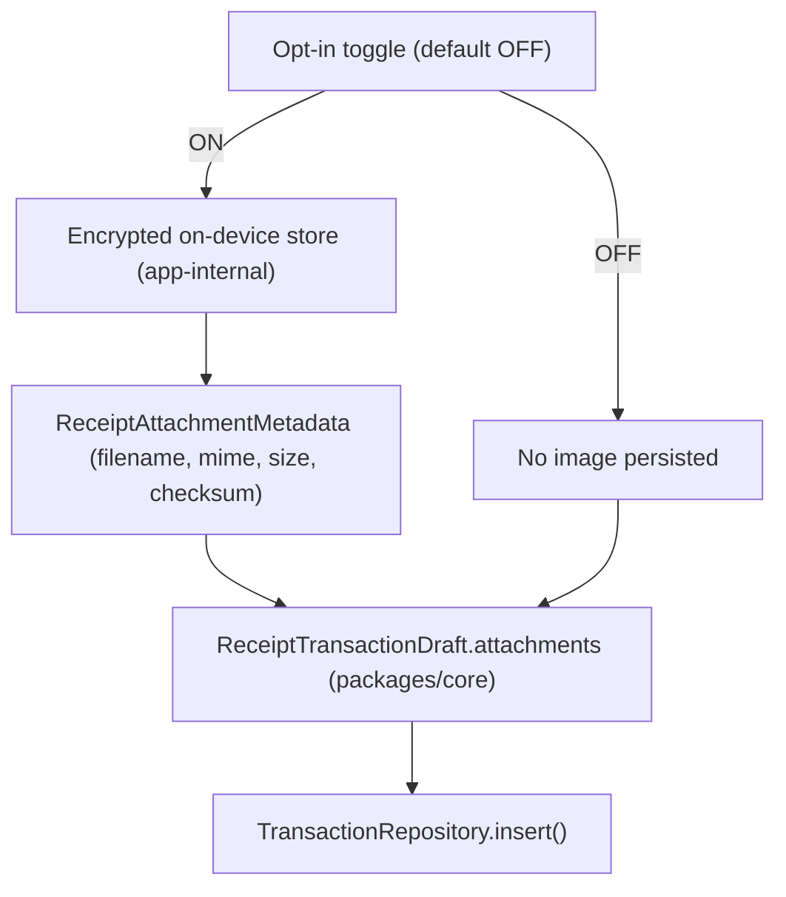
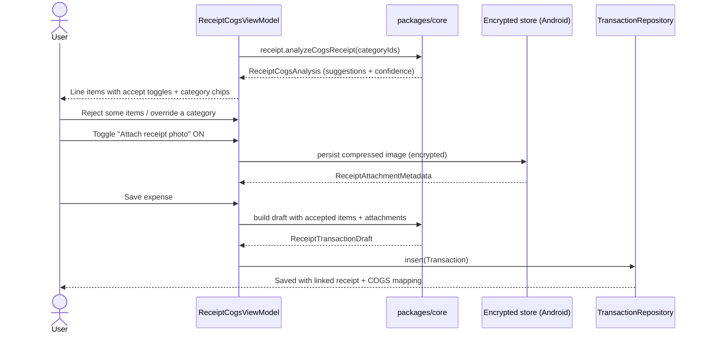

# Android Receipt Attachments & COGS Mapping — Design

> **Status:** Design / breakdown only — native implementation gated by [#1242](https://github.com/jrmoulckers/finance/issues/1242)
> **Issue:** [#2549](https://github.com/jrmoulckers/finance/issues/2549) · **Part of:** [#2183](https://github.com/jrmoulckers/finance/issues/2183)
> **Platform:** Android (Jetpack Compose + Material 3) · **Audience:** Android engineers, design, QA

This document designs two opt-in capabilities layered on top of the
[receipt-to-expense draft flow](./android-receipt-to-expense-draft.md):

1. **Opt-in receipt photo attachment** tied to the saved transaction, stored
   on-device with **no upload**.
2. **Line-item accept/reject** and **COGS / inventory / supplies** category
   mapping for itemized receipts, so a food-truck owner can later do margin math.

As with all receipt work, **Compose renders shared state**. The COGS
classification, attachment metadata model, and confidence scoring already exist
in KMP `packages/core`
([`ReceiptCogsExtensions.kt`](../../packages/core/src/commonMain/kotlin/com/finance/core/receipt/cogs/ReceiptCogsExtensions.kt)).
Android collects the opt-in, stores bytes locally, and presents the mapping — it
does not classify or score on the JVM side.

---

## Table of Contents

1. [Goals & non-goals](#1-goals--non-goals)
2. [Shared COGS & attachment contracts](#2-shared-cogs--attachment-contracts)
3. [Opt-in attachment model & on-device storage](#3-opt-in-attachment-model--on-device-storage)
4. [Line-item accept/reject UX](#4-line-item-acceptreject-ux)
5. [COGS / inventory / supplies mapping](#5-cogs--inventory--supplies-mapping)
6. [Flows](#6-flows)
7. [Offline-first, empty, and error states](#7-offline-first-empty-and-error-states)
8. [Accessibility](#8-accessibility)
9. [Test plan](#9-test-plan)
10. [Implementation readiness](#10-implementation-readiness)
11. [Cross-links](#11-cross-links)

---

## 1. Goals & non-goals

### Goals

- Persist the **receipt image as an attachment** linked to the transaction, only
  after **explicit opt-in** (acceptance criterion from
  [#2388](https://github.com/jrmoulckers/finance/issues/2388): "Store receipt
  images only after explicit user opt-in").
- Let the user **accept or reject each extracted line item**.
- Map accepted items to business categories — **COGS**, **inventory**, or
  **supplies** — using the shared classifier, with user override.
- Keep all storage **encrypted, on-device, and offline** until the user later
  syncs through the existing sync path.

### Non-goals

- Capture and OCR — see [Android CameraX Receipt Capture & Fallback](./android-cameraX-receipt-capture.md) ([#2563](https://github.com/jrmoulckers/finance/issues/2563)).
- The base draft + correction + save flow — see [Android Receipt-to-Expense Draft Flow](./android-receipt-to-expense-draft.md) ([#2547](https://github.com/jrmoulckers/finance/issues/2547)).
- Defining the **persisted** transaction-attachment table. The Android app today
  has no transaction-level attachment model in
  [`packages/models`](../../packages/models/src/commonMain/kotlin/com/finance/models/Transaction.kt);
  that schema is a KMP-owned follow-up (see §3). This doc designs the Android UX
  and the platform storage adapter around the shared metadata contract.

---

## 2. Shared COGS & attachment contracts

These types already exist in `packages/core` and are the source of truth. Compose
binds to them; it does not duplicate the rules.

| Shared type / function                                                           | Role                                                                             |
| -------------------------------------------------------------------------------- | -------------------------------------------------------------------------------- |
| `ReceiptCogsCategory` (`COST_OF_GOODS_SOLD`, `INVENTORY`, `SUPPLIES`, `UNKNOWN`) | The business categories rendered as mapping options.                             |
| `ReceiptCogsCategoryIds`                                                         | Maps each COGS category to an optional app category ID for the saved draft.      |
| `ReceiptLineItemCategorySuggestion`                                              | Per-line description, cents, suggested category, matched keywords, confidence.   |
| `ReceiptCategorySuggestion`                                                      | Overall deterministic category + reason + matched amount.                        |
| `ReceiptCogsAnalysis`                                                            | Bundles draft, per-line suggestions, tax/payment hints, confidence, attachments. |
| `ReceiptAttachmentMetadata`                                                      | Platform-neutral file metadata (filename, MIME type, size, checksum).            |
| `ExtractedReceiptText.analyzeCogsReceipt(…)` / `.toCogsTransactionDraft(…)`      | Extension entry points the ViewModel calls.                                      |
| `ReceiptCogsExtensions.suggestLineItemCategories(…)` / `analyzeReceipt(…)`       | Deterministic classification + scoring.                                          |

All of the above are defined in
[`ReceiptCogsExtensions.kt`](../../packages/core/src/commonMain/kotlin/com/finance/core/receipt/cogs/ReceiptCogsExtensions.kt).
The Android ViewModel calls `analyzeCogsReceipt()` and exposes the resulting
`ReceiptCogsAnalysis` as immutable UI state — no category math on the Android side.

---

## 3. Opt-in attachment model & on-device storage

### Opt-in is mandatory and explicit

- The receipt image is **not** stored unless the user toggles **"Attach receipt
  photo to this expense."** Default is **off**.
- The opt-in copy states plainly that the image stays on the device and is
  encrypted — see [Content & Language Guidelines](./content-language-guidelines.md).
- Declining attachment never blocks saving the expense; it only omits the image.

### Storage adapter (Android-owned)

- Bytes are written to **app-internal encrypted storage** (the same SQLCipher /
  encrypted-at-rest posture the app uses for its database — see
  [Android Architecture](../architecture/android-architecture.md)). Never to
  shared/public media, `SharedPreferences`, or plain files.
- The Android adapter computes `ReceiptAttachmentMetadata` (filename, MIME type,
  `sizeBytes`, `checksum`) and hands the metadata to the shared draft via
  `ReceiptTransactionDraft.attachments`. **Bytes and checksums are supplied by the
  platform adapter; the shared layer only carries the metadata.**
- Images are downscaled/compressed on-device before storage to bound size; the
  original is never uploaded.

### KMP follow-up (not implemented here)

The persisted transaction↔attachment relationship (a new table/column and DAO)
belongs in KMP `packages/*` and is owned by the KMP engineer. This document
defines the **Android UX, opt-in gate, and encrypted local storage adapter** that
consume the shared `ReceiptAttachmentMetadata` contract; it deliberately does not
add the shared persistence schema. The dependency is called out so the work can be
sequenced.

---

## 4. Line-item accept/reject UX

The base draft screen already lists line items with accept checkboxes (see the
existing pattern in
[`ReceiptOcrScreen`](../../apps/android/src/main/kotlin/com/finance/android/ui/screens/ReceiptOcrScreen.kt)).
This design formalizes it:

| Element                   | Behaviour                                                                                      |
| ------------------------- | ---------------------------------------------------------------------------------------------- |
| Per-line accept toggle    | Material 3 `Checkbox`/`Switch`; default **accepted** for items above the confidence threshold. |
| Line description + amount | Description and shared-formatted cents; never editable into financial math by the UI.          |
| Suggested category chip   | Shows `ReceiptLineItemCategorySuggestion.category`; tapping opens the mapping sheet (§5).      |
| Bulk actions              | "Accept all" / "Reject all" for fast entry from the truck.                                     |
| Running summary           | Count + total of accepted items, formatted from shared cents.                                  |

- Accept/reject only filters which items flow into the draft; it does not change
  any amount. The accepted set is plain UI state.
- Rejected items are visually de-emphasized but remain reachable by assistive tech
  so a mistaken reject is recoverable.

---

## 5. COGS / inventory / supplies mapping

For each accepted line item (and for the overall draft category), the user can
keep the shared suggestion or override it:

| Suggestion source                            | Default                               | Override                                                                  |
| -------------------------------------------- | ------------------------------------- | ------------------------------------------------------------------------- |
| `ReceiptLineItemCategorySuggestion.category` | Pre-selected chip per line            | Single-select among COGS / Inventory / Supplies / Unknown.                |
| `ReceiptCategorySuggestion` (overall)        | Header chip + plain-language `reason` | Override applies to the draft's category ID via `ReceiptCogsCategoryIds`. |

- The mapping sheet presents the four `ReceiptCogsCategory` values with their
  `displayName` ("Cost of Goods Sold", "Inventory", "Supplies", "Unknown").
- The "**ingredients → inventory/COGS**" follow-up from
  [#2183](https://github.com/jrmoulckers/finance/issues/2183) is surfaced as a
  one-tap suggestion when the overall suggestion is `INVENTORY` or
  `COST_OF_GOODS_SOLD`; the actual category-to-ID resolution uses the shared
  `ReceiptCogsCategoryIds.idFor(category)`.
- Confidence/`reason` text is shown so the user understands the suggestion,
  following [Cognitive Accessibility Mode](./cognitive-accessibility.md). The UI
  never recomputes the suggestion — overrides simply replace the selected value.

---

## 6. Flows

---

## 7. Offline-first, empty, and error states

Everything here works offline; attachment bytes live locally until the existing
sync path uploads them later (out of scope).

| State                 | Trigger                                          | UX                                                                                |
| --------------------- | ------------------------------------------------ | --------------------------------------------------------------------------------- |
| No line items         | Receipt parsed to total only                     | Hide the itemized section; still allow attachment + single-category draft.        |
| All items rejected    | User rejects everything                          | Keep the header total; warn that no items map to COGS; saving still allowed.      |
| Attachment opt-in off | Default                                          | No storage performed; expense saves without an image.                             |
| Storage failure       | Disk full / write error                          | Non-blocking error card with **Retry**; expense can still save without the image. |
| Ambiguous category    | `AMBIGUOUS_CATEGORY` flag from shared confidence | Surface as a "Choose a category" prompt; do not auto-commit `UNKNOWN`.            |
| Offline               | No connectivity                                  | No blocking; "Saved locally — receipt will sync later" affordance.                |

Sensitive financial values (amounts, totals, line items) are **never** logged via
Timber. Attachment logs record only non-sensitive events ("attachment stored",
size band) — never the image contents or the merchant total.

---

## 8. Accessibility

Follows the shared [Accessibility Patterns Library](./accessibility-patterns.md);
target WCAG 2.2 AA.

- **TalkBack:** Each line item row announces description, amount, accept state, and
  mapped category as one coherent label ("Buns, 6 dollars, accepted, mapped to
  Cost of Goods Sold"). The attachment toggle announces its on/off state and the
  privacy consequence.
- **Switch Access:** Accept toggles, category chips, and the attachment switch are
  ≥ 48 dp, single-purpose, and ordered logically. "Accept all"/"Reject all" give a
  fast scan-free path.
- **200% font scaling:** Rows reflow to multi-line; category chips wrap; amounts
  never truncate. The mapping sheet scrolls rather than clipping options.
- **Color independence:** Accepted/rejected and category are conveyed by text +
  icon, not color alone.
- **Live regions:** Bulk accept/reject and attachment success/failure announce via
  a polite live region.

Every interactive Composable defined here has a `contentDescription`.

---

## 9. Test plan

| Layer                  | Tooling                | Coverage                                                                                                                                                                |
| ---------------------- | ---------------------- | ----------------------------------------------------------------------------------------------------------------------------------------------------------------------- |
| Unit (ViewModel)       | JUnit + coroutine test | `analyzeCogsReceipt` results mapped to state; accept/reject filters items only; override replaces shared suggestion without recomputation; opt-in OFF persists nothing. |
| Unit (storage adapter) | JUnit (Robolectric)    | Image written to encrypted internal storage; correct `ReceiptAttachmentMetadata`; storage failure does not block save.                                                  |
| Compose UI             | `compose-ui-test`      | Accept/reject toggles; category mapping sheet selection; attachment toggle gates storage; semantics assertions; font-scale `2.0f`.                                      |
| Snapshot               | Paparazzi              | Line-item list (mixed accepted/rejected), mapping sheet, attachment opt-in on/off — default + 200% font, light/dark + dynamic color.                                    |

Shared COGS classification, confidence scoring, and tax/payment extraction are
covered by existing `packages/core` tests and are not re-tested here.

---

## 10. Implementation readiness

This is a design artifact. See [Human-Gated Prerequisites](../ops/human-gated-prerequisites.md)
and the [Launch Readiness Plan](../ops/launch-readiness-plan.md) for gating.

### Buildable now (debug, no human gate)

- Line-item accept/reject UI, the COGS mapping sheet, and the attachment opt-in
  toggle are pure Compose + KMP consumption — runnable via
  `./gradlew :apps:android:assembleDebug` and sideload.
- The encrypted on-device storage adapter reuses the app's existing
  encryption-at-rest posture and is unit-testable (Robolectric) without signing.
- All COGS/attachment rendering binds to existing `packages/core` contracts.

### Cross-team dependency (additive, not store-gated)

- The **persisted** transaction↔attachment schema/DAO is a KMP `packages/*`
  follow-up owned by the KMP engineer (see §3). It is not blocked by
  [#1242](https://github.com/jrmoulckers/finance/issues/1242); it is simply
  out of Android's file ownership and must be sequenced.

### Play-distribution tail (gated by [#1242](https://github.com/jrmoulckers/finance/issues/1242))

- Production signing keystore + Google Play Console onboarding.
- Privacy declarations covering on-device image storage, internal-testing-track
  upload, and staged rollout.
- Anything requiring a release-signed AAB (not `assembleDebug`).

---

## 11. Cross-links

- Sibling: [Android Receipt-to-Expense Draft Flow](./android-receipt-to-expense-draft.md) — [#2547](https://github.com/jrmoulckers/finance/issues/2547)
- Sibling: [Android CameraX Receipt Capture & Fallback](./android-cameraX-receipt-capture.md) — [#2563](https://github.com/jrmoulckers/finance/issues/2563)
- [Android Architecture](../architecture/android-architecture.md)
- [Accessibility Patterns Library](./accessibility-patterns.md) · [Cognitive Accessibility Mode](./cognitive-accessibility.md)
- [Component Library](./component-library.md) · [UX Design Principles](./ux-principles.md) · [Content & Language Guidelines](./content-language-guidelines.md)
- [Data Model](./data-model.md) · [Information Architecture](./information-architecture.md) · [User Personas](./personas.md)
- Ops: [Human-Gated Prerequisites](../ops/human-gated-prerequisites.md) · [Launch Readiness Plan](../ops/launch-readiness-plan.md)
