# Android Receipt OCR Review → Transaction Draft — Design

> **Status:** Design / breakdown only — native implementation gated by [#1242](https://github.com/jrmoulckers/finance/issues/1242)
> **Issue:** [#2565](https://github.com/jrmoulckers/finance/issues/2565) · **Part of:** [#2388](https://github.com/jrmoulckers/finance/issues/2388)
> **Platform:** Android (Jetpack Compose + Material 3) · **minSdk 28 / target 35** · **Audience:** Android engineers, design, QA

This document designs the **on-device OCR review and correction surface** that
turns **ML Kit text recognition** output into a **shared transaction draft** with
an **optional receipt attachment**. It is the _review_ step of the receipt
cluster: capture happens upstream, and the saved draft flows downstream through
the existing draft/attachment designs.

It is a **design / breakdown only** document and adds **no native code** while
production signing and Play distribution remain blocked by
[#1242](https://github.com/jrmoulckers/finance/issues/1242).

The guiding rule, as everywhere in the Android client: **Compose renders shared
state; it does not own finance math.** OCR text parsing, field extraction,
confidence scoring, and draft assembly already live in Kotlin Multiplatform (KMP)
[`packages/core`](../../packages/core/). ML Kit runs **on-device**; the Android
layer collects recognized text, observes the shared analysis as state, and
presents correction affordances. **No receipt text or image leaves the device.**

> **Relationship to existing receipt docs.** This doc focuses on the **review /
> correction interaction and confidence presentation** for the
> [#2388](https://github.com/jrmoulckers/finance/issues/2388) capture cluster. It
> deliberately **reuses** — and does not duplicate — the draft-building contract
> in [Android Receipt-to-Expense Draft Flow](./android-receipt-to-expense-draft.md)
> and the capture front-end in
> [Android CameraX Receipt Capture & Fallback](./android-cameraX-receipt-capture.md).

---

## Table of Contents

1. [Goals & non-goals](#1-goals--non-goals)
2. [Personas & jobs to be done](#2-personas--jobs-to-be-done)
3. [The Compose-renders-shared-state boundary](#3-the-compose-renders-shared-state-boundary)
4. [OCR review pipeline](#4-ocr-review-pipeline)
5. [Review & correction UI](#5-review--correction-ui)
6. [Confidence presentation](#6-confidence-presentation)
7. [Optional receipt attachment](#7-optional-receipt-attachment)
8. [On-device privacy](#8-on-device-privacy)
9. [Offline-first, empty, and error states](#9-offline-first-empty-and-error-states)
10. [Accessibility](#10-accessibility)
11. [Test plan](#11-test-plan)
12. [Implementation readiness](#12-implementation-readiness)
13. [Cross-links](#13-cross-links)

---

## 1. Goals & non-goals

### Goals

- Present **ML Kit on-device OCR** output as a **reviewable, correctable** set of
  fields (merchant, date, total, tax hint, payment hint) that the user confirms
  before saving.
- Make **low-confidence fields obvious** and easy to fix without retyping the
  whole receipt.
- Produce a **shared transaction draft** (the same
  `ReceiptTransactionDraft` shape used by the existing draft flow) that saves to a
  normal [`Transaction`](../../packages/models/src/commonMain/kotlin/com/finance/models/Transaction.kt).
- Offer the receipt image as an **optional attachment** on the resulting
  transaction.
- Keep everything **on-device and offline-first** — no receipt text or image
  leaves the device during review (acceptance theme of
  [#2388](https://github.com/jrmoulckers/finance/issues/2388)).

### Non-goals

- Camera capture, permissions, crop/retake — designed in
  [Android CameraX Receipt Capture & Fallback](./android-cameraX-receipt-capture.md)
  ([#2563](https://github.com/jrmoulckers/finance/issues/2563)).
- The downstream save semantics and attachment/COGS persistence — designed in
  [Android Receipt-to-Expense Draft Flow](./android-receipt-to-expense-draft.md)
  ([#2547](https://github.com/jrmoulckers/finance/issues/2547)) and
  [Android Receipt Attachments & COGS Mapping](./android-receipt-attachments-cogs.md)
  ([#2549](https://github.com/jrmoulckers/finance/issues/2549)).
- Any change to KMP business rules. The parser, draft builder, and confidence
  model in `packages/core` are consumed **as-is**.
- Server-side OCR or any cloud vision API — explicitly excluded for privacy.

---

## 2. Personas & jobs to be done

The driving context from [#2388](https://github.com/jrmoulckers/finance/issues/2388)
is a small-business / field user who snaps a receipt and wants a correct expense
without manual data entry. See [User Personas & MVP Scope](./personas.md).

Jobs this surface must satisfy:

- "After I scan, **show me what it read** and let me fix the wrong bits."
- "**Don't make me retype** the merchant and total when only the date is off."
- "Prove to me the **scan stayed on my phone**."

Each job maps to a section: review (§5), targeted correction (§5–§6), privacy (§8).

This surface is the natural **review step** invoked from the field flow's receipt
entry point (see [Android Field-Mode Transaction & Receipt Flow](./android-field-mode-transaction-flow.md),
[#2561](https://github.com/jrmoulckers/finance/issues/2561)).

---

## 3. The Compose-renders-shared-state boundary

All finance/business logic stays in KMP `packages/core`. The Android layer is a
thin renderer over ML Kit text and shared analysis. The contract types and
functions below already exist and are the single source of truth:

| Shared type / function                                                    | Source                                                                                                                         | Role in this flow                                            |
| ------------------------------------------------------------------------- | ------------------------------------------------------------------------------------------------------------------------------ | ------------------------------------------------------------ |
| `ExtractedReceiptText`, `ExtractedReceiptLineItem`, `parseReceiptText(…)` | [`ReceiptTextParser.kt`](../../packages/core/src/commonMain/kotlin/com/finance/core/dataimport/ReceiptTextParser.kt)           | Normalises raw OCR text into merchant/date/total/line items. |
| `ReceiptCogsExtensions.buildTransactionDraft(…)`                          | [`ReceiptCogsExtensions.kt`](../../packages/core/src/commonMain/kotlin/com/finance/core/receipt/cogs/ReceiptCogsExtensions.kt) | Assembles a `ReceiptTransactionDraft` from parsed output.    |
| `ReceiptTransactionDraft`                                                 | `ReceiptCogsExtensions.kt`                                                                                                     | Category, amount (cents), tax, payment method, attachments.  |
| `ReceiptConfidence` / `ReceiptConfidenceBand` / `ReceiptConfidenceFlag`   | `ReceiptCogsExtensions.kt`                                                                                                     | Decides which fields are auto-filled vs. flagged for review. |

The on-device OCR adapter that feeds these shared functions already exists:
[`AndroidMlKitReceiptOcrAdapter`](../../apps/android/src/main/kotlin/com/finance/android/receipt/AndroidMlKitReceiptOcrAdapter.kt).

**Boundary rules**

- The ViewModel calls shared functions and exposes their results as immutable UI
  state. It never re-implements totals, tax math, or category rules in Kotlin/JVM
  code.
- All money is integer **cents** (`Cents`) across the boundary. Compose only
  formats for display via the shared [`CurrencyFormatter`](../../packages/core/src/commonMain/kotlin/com/finance/core/currency/CurrencyFormatter.kt).
- Confidence drives **presentation only**: a `LOW`/`UNUSABLE` band changes which
  fields are highlighted, never the underlying values.

```mermaid
flowchart LR
    subgraph Device["On-device, no network"]
        MLKit["ML Kit text recognition"]
        Adapter["AndroidMlKitReceiptOcrAdapter"]
    end
    subgraph Core["KMP packages/core (shared, no UI)"]
        Parser["parseReceiptText()"]
        Draft["buildTransactionDraft()"]
        Conf["scoreConfidence() -> ReceiptConfidence"]
    end
    subgraph Android["apps/android (Compose, renders only)"]
        VM["ReceiptOcrReviewViewModel"]
        UI["ReceiptOcrReviewScreen"]
        Repo["TransactionRepository.insert()"]
    end
    Image["Captured image (Issue 2563)"] --> MLKit
    MLKit --> Adapter
    Adapter --> Parser
    Parser --> Draft
    Draft --> Conf
    Conf --> VM
    VM --> UI
    UI -->|"Confirm & save"| Repo
```

---

## 4. OCR review pipeline

The end-to-end path from a captured image to a saved draft:

1. **Recognize** — the captured image (from [#2563](https://github.com/jrmoulckers/finance/issues/2563))
   is passed to ML Kit text recognition on-device via
   [`AndroidMlKitReceiptOcrAdapter`](../../apps/android/src/main/kotlin/com/finance/android/receipt/AndroidMlKitReceiptOcrAdapter.kt).
2. **Parse** — recognized text is handed to the shared `parseReceiptText(…)`,
   which yields merchant/date/total/line items as `ExtractedReceiptText`.
3. **Assemble** — `buildTransactionDraft(…)` produces a `ReceiptTransactionDraft`.
4. **Score** — `scoreConfidence(…)` yields a `ReceiptConfidence` per field/band.
5. **Review** — Compose renders the draft with confidence cues and per-field
   correction affordances.
6. **Confirm & save** — on confirm, the (possibly corrected) draft saves to a
   normal `Transaction` via the existing repository, with the receipt image
   optionally attached.

| Composable                  | Type          | Responsibility                                                |
| --------------------------- | ------------- | ------------------------------------------------------------- |
| `ReceiptOcrReviewScreen`    | `@Composable` | Hosts the parsed-field list, confidence cues, and action bar. |
| `OcrFieldRow`               | `@Composable` | One reviewable field: label, value, confidence, edit control. |
| `OcrLineItemsSection`       | `@Composable` | Optional expandable line-item list for itemised receipts.     |
| `ReceiptThumbnailCard`      | `@Composable` | Shows the on-device image; opt-in attach toggle.              |
| `ReviewActionBar`           | `@Composable` | Bottom-anchored Confirm & save / Retake / Discard.            |
| `ReceiptOcrReviewViewModel` | `ViewModel`   | Calls KMP parse/assemble/score; holds the draft as UI state.  |

---

## 5. Review & correction UI

The review surface shows **what OCR read** and makes **fixing it cheap**:

- **Pre-filled fields.** Merchant, date, total, tax hint, and payment hint are
  rendered from the shared draft, each in an `OcrFieldRow`.
- **Targeted edits.** Tapping a field opens an inline editor scoped to _just_ that
  field — correcting the date never disturbs the merchant or total. Edits update
  UI state only; the shared math is re-derived where appropriate (for example,
  total stays integer cents).
- **Line items, deferred.** Itemised receipts expose an expandable
  `OcrLineItemsSection`, collapsed by default so the common case (merchant +
  total) stays simple.
- **Save reuses the proven path.** Confirm maps the reviewed draft to a real
  `Transaction` through the existing repository — the same save path used by the
  [receipt-to-expense draft flow](./android-receipt-to-expense-draft.md).

The user never has to clear and retype the whole receipt — the explicit design
goal is **correct the few wrong fields, accept the rest**.

---

## 6. Confidence presentation

Confidence comes entirely from the shared `ReceiptConfidence` model and drives
**presentation only**:

| Band       | Meaning                          | Presentation                                                        |
| ---------- | -------------------------------- | ------------------------------------------------------------------- |
| `HIGH`     | Trustworthy extraction           | Plain field; no nag; editable on tap.                               |
| `LOW`      | Probably right, double-check     | Badge "double-check" + icon; field pre-focused for quick edit.      |
| `UNUSABLE` | Missing/unreliable required data | Inline prompt to fill manually or **Retake**; Save gated as needed. |

Rules:

- A band **never changes a value** — it only changes highlighting and focus order.
- Confidence is conveyed by **badge text + icon**, never color alone, satisfying
  the contrast guidance in the [Accessibility Patterns Library](./accessibility-patterns.md).
- `ReceiptConfidenceFlag`s map to specific field hints (for example,
  `MISSING_TOTAL`) and to inline validation at save time.

---

## 7. Optional receipt attachment

- The captured image is shown in a `ReceiptThumbnailCard` with an explicit
  **Attach receipt** toggle — attachment is **optional**, never required to save.
- When attachment is on, persistence and any COGS/supplies mapping are handled by
  [Android Receipt Attachments & COGS Mapping](./android-receipt-attachments-cogs.md)
  ([#2549](https://github.com/jrmoulckers/finance/issues/2549)); this surface only
  passes the on-device image reference into the draft's `attachments`.
- The attachment links to the saved transaction; the image stays in app-private,
  encrypted storage and is never uploaded as part of review.

---

## 8. On-device privacy

Privacy is a first-class requirement of [#2388](https://github.com/jrmoulckers/finance/issues/2388):

- **On-device OCR only.** ML Kit text recognition runs locally; there is **no**
  cloud vision call. The captured image and recognized text never leave the
  device during capture or review.
- **No-upload copy.** The review screen reiterates the capture-time assurance
  ("Stays on your phone") so the user can trust the flow at the point of review.
- **No sensitive logging.** No merchant, total, amount, or account value is ever
  written to Timber. Structured logs record flow milestones only (for example
  "draft built", "review confirmed") via `Timber.d`/`Timber.w` with **no**
  sensitive values, per the client logging rules.
- **Encrypted at rest.** If attached, the image lands in app-private storage on
  the SQLCipher-encrypted data path; it is not written to shared/public media.

---

## 9. Offline-first, empty, and error states

| State                    | Trigger                                          | UX                                                                                        |
| ------------------------ | ------------------------------------------------ | ----------------------------------------------------------------------------------------- |
| Empty / no recognition   | ML Kit returns no usable text                    | Friendly empty card: offer **Enter manually** and **Retake**.                             |
| Unusable scan            | `band == UNUSABLE`, `merchant`/`total` both null | Manual-entry fallback (per #2563) + **Retake**; Save gated until required fields present. |
| Partial extraction       | Some fields null                                 | Pre-fill what exists; flag the rest with `LOW`/`UNUSABLE` cues (see §6).                  |
| Offline                  | No connectivity                                  | Fully functional — OCR and review are on-device; draft saved locally and synced later.    |
| Save validation error    | `MISSING_TOTAL` etc. at confirm                  | Inline errors; assertive live region; focus first invalid field; draft preserved.         |
| Repository/save failure  | `insert` throws                                  | Non-destructive error card with **Retry**; the reviewed draft is preserved.               |
| Process death mid-review | App killed before save                           | `SavedStateHandle` restores the reviewed field values so no correction work is lost.      |

---

## 10. Accessibility

This flow targets WCAG 2.2 AA and follows the shared
[Accessibility Patterns Library](./accessibility-patterns.md).

- **TalkBack:** Every `OcrFieldRow` exposes a `contentDescription` combining
  label, value, and confidence ("Total, 24 dollars 80 cents, please
  double-check"). Headings use `semantics { heading() }`. Confirm/Retake/Discard
  announce their action and result. The thumbnail card is labelled and the attach
  toggle announces its on/off state.
- **Switch Access:** Logical top-to-bottom focus; the sticky `ReviewActionBar` is
  reachable last with large, single-purpose targets (≥ 48 dp, ≥ 56 dp under
  [rugged mode](./android-rugged-mode-tokens.md)). No action depends on a gesture
  or long-press only.
- **200% font scaling:** All text uses `sp` and wraps rather than truncates; the
  action bar collapses Confirm/Retake/Discard into a vertical stack at large
  scale; field rows grow in height and never clip the value.
- **Live regions:** Validation errors and save confirmation use an assertive live
  region so non-visual users hear the outcome immediately.
- **Color independence:** Confidence is conveyed by badge text + icon, never color
  alone.
- **Field / rugged conditions:** When rugged mode is on, targets grow, contrast
  rises, and motion reduces — this surface consumes those tokens, making review
  usable in sunlight with gloves.

---

## 11. Test plan

| Layer                | Tooling                | Coverage                                                                                                                                                                                          |
| -------------------- | ---------------------- | ------------------------------------------------------------------------------------------------------------------------------------------------------------------------------------------------- |
| Unit (ViewModel)     | JUnit + coroutine test | Draft seeded from shared parse/assemble/score; per-field edits do not mutate shared math; confirm maps to a valid `Transaction`; validation gates on `MISSING_TOTAL`/`MISSING_MERCHANT`.          |
| Unit (state machine) | JUnit                  | `Recognizing → Reviewing → Saving → Saved` transitions; error path preserves the reviewed draft; process-death restore from `SavedStateHandle`.                                                   |
| Compose UI           | `compose-ui-test`      | Low-confidence field shows the badge + correction control; Save disabled until required fields present; error card exposes **Retry**; attach toggle state; semantics assertions; font-scale 2.0f. |
| Snapshot             | Paparazzi              | `ReceiptOcrReviewScreen` in: high-confidence, low-confidence, unusable, saving, error — at default and 200% font scale, standard vs. rugged theme, light/dark.                                    |

Shared business rules (`parseReceiptText`, `buildTransactionDraft`,
`scoreConfidence`) are covered by existing `packages/core` tests and are **not**
re-tested here — only the Android rendering, correction, and save wiring are. ML
Kit recognition is exercised through the adapter with fixture text so review logic
is testable without a camera.

---

## 12. Implementation readiness

This is a design artifact. Implementation splits into a part that is fully
buildable today and a tail that is gated by Play onboarding.

See [Human-Gated Prerequisites](../ops/human-gated-prerequisites.md) and the
[Launch Readiness Plan](../ops/launch-readiness-plan.md) for the gating context.

### Buildable now (debug, no human gate)

- `ReceiptOcrReviewScreen`, `ReceiptOcrReviewViewModel`, the field rows,
  confidence cues, attachment card, state model, and Koin wiring are pure Compose
  - KMP consumption over the existing on-device ML Kit adapter — fully
    implementable and runnable via `./gradlew :apps:android:assembleDebug` and
    sideload.
- On-device OCR (ML Kit) and the shared parse/assemble/score functions need no
  signing or store presence; review logic is testable with fixture text.
- Save wiring reuses the existing local `TransactionRepository`; verifiable with
  unit, Compose, and Paparazzi tests on CI and emulator/sideload.

### Play-distribution tail (gated by [#1242](https://github.com/jrmoulckers/finance/issues/1242))

- Production signing keystore + Google Play Console onboarding.
- Internal-testing-track upload, privacy declarations (camera + on-device OCR),
  and staged rollout.
- Anything requiring a release-signed AAB (not `assembleDebug`).

No part of this review flow itself is blocked from being built and tested in debug;
only its production distribution is.

---

## 13. Cross-links

- Sibling: [Android CameraX Receipt Capture & Fallback](./android-cameraX-receipt-capture.md) — [#2563](https://github.com/jrmoulckers/finance/issues/2563)
- Sibling: [Android Receipt-to-Expense Draft Flow](./android-receipt-to-expense-draft.md) — [#2547](https://github.com/jrmoulckers/finance/issues/2547)
- Sibling: [Android Receipt Attachments & COGS Mapping](./android-receipt-attachments-cogs.md) — [#2549](https://github.com/jrmoulckers/finance/issues/2549)
- Field cluster: [Android Field-Mode Transaction & Receipt Flow](./android-field-mode-transaction-flow.md) — [#2561](https://github.com/jrmoulckers/finance/issues/2561) · [Android Rugged Mode — Design Tokens & Preference](./android-rugged-mode-tokens.md) — [#2559](https://github.com/jrmoulckers/finance/issues/2559)
- [Accessibility Patterns Library](./accessibility-patterns.md) · [Cognitive Accessibility Mode](./cognitive-accessibility.md)
- [Component Library](./component-library.md) · [UX Design Principles](./ux-principles.md) · [Content & Language Guidelines](./content-language-guidelines.md)
- [Android Architecture](../architecture/android-architecture.md) · [Data Model](./data-model.md) · [Information Architecture](./information-architecture.md) · [User Personas](./personas.md)
- Ops: [Human-Gated Prerequisites](../ops/human-gated-prerequisites.md) · [Launch Readiness Plan](../ops/launch-readiness-plan.md)
