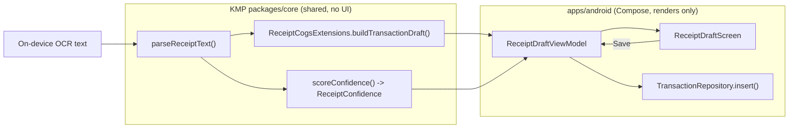
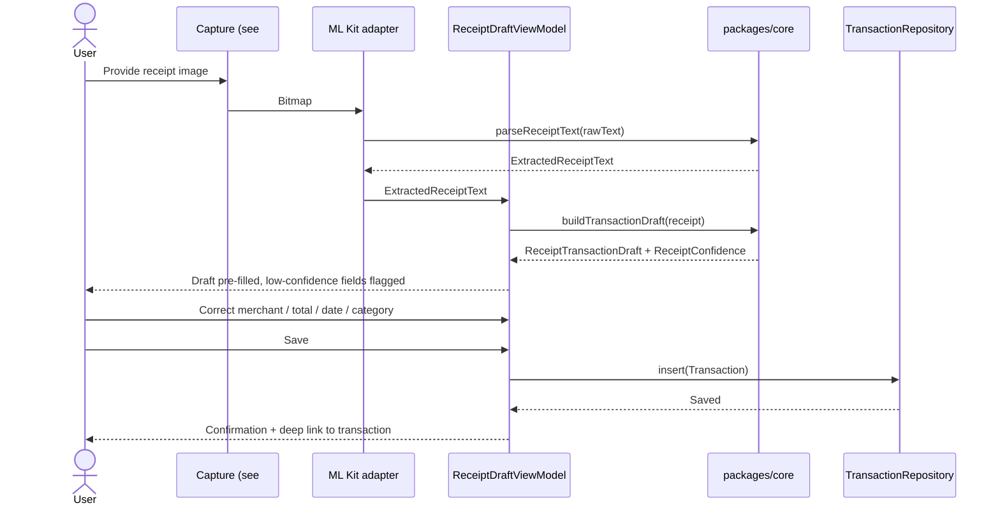

# Android Receipt-to-Expense Draft Flow — Design

> **Status:** Design / breakdown only — native implementation gated by [#1242](https://github.com/jrmoulckers/finance/issues/1242)
> **Issue:** [#2547](https://github.com/jrmoulckers/finance/issues/2547) · **Part of:** [#2183](https://github.com/jrmoulckers/finance/issues/2183)
> **Platform:** Android (Jetpack Compose + Material 3) · **Audience:** Android engineers, design, QA

This document designs the Jetpack Compose flow that turns **on-device receipt
OCR output** into a **reviewable, correctable expense draft** that the user can
save as a real transaction. It is a design/breakdown only — it does not add
native code while production signing and Play distribution remain blocked by
[#1242](https://github.com/jrmoulckers/finance/issues/1242).

The guiding rule for every screen below: **Compose renders shared state; it does
not own finance math.** Receipt parsing, category suggestion, confidence
scoring, and draft assembly already live in Kotlin Multiplatform (KMP)
`packages/core`. The Android layer only collects an image, observes the shared
analysis as state, and presents correction affordances.

---

## Table of Contents

1. [Goals & non-goals](#1-goals--non-goals)
2. [Personas & jobs to be done](#2-personas--jobs-to-be-done)
3. [The Compose-renders-shared-state boundary](#3-the-compose-renders-shared-state-boundary)
4. [End-to-end flow](#4-end-to-end-flow)
5. [Composable & ViewModel inventory](#5-composable--viewmodel-inventory)
6. [State management](#6-state-management)
7. [Low-confidence field correction UX](#7-low-confidence-field-correction-ux)
8. [Offline-first, empty, and error states](#8-offline-first-empty-and-error-states)
9. [Accessibility](#9-accessibility)
10. [Test plan](#10-test-plan)
11. [Implementation readiness](#11-implementation-readiness)
12. [Cross-links](#12-cross-links)

---

## 1. Goals & non-goals

### Goals

- Take the output of on-device OCR (already produced by
  [`AndroidMlKitReceiptOcrAdapter`](../../apps/android/src/main/kotlin/com/finance/android/receipt/AndroidMlKitReceiptOcrAdapter.kt))
  and present a **draft expense** with merchant, date, total, tax hint, and
  payment hint pre-filled.
- Let the user **correct low-confidence fields** before saving.
- Provide an explicit **Save** action that creates a real
  [`Transaction`](../../packages/models/src/commonMain/kotlin/com/finance/models/Transaction.kt)
  via the existing repository, reusing the proven save path in
  [`TransactionCreateViewModel`](../../apps/android/src/main/kotlin/com/finance/android/ui/viewmodel/TransactionCreateViewModel.kt).
- Keep everything **on-device and offline-first** — no receipt text or image
  leaves the device during drafting.

### Non-goals

- OCR capture and the camera/gallery surface — designed separately in
  [Android CameraX Receipt Capture & Fallback](./android-cameraX-receipt-capture.md)
  ([#2563](https://github.com/jrmoulckers/finance/issues/2563)).
- Attachment persistence and COGS / inventory / supplies mapping — designed in
  [Android Receipt Attachments & COGS Mapping](./android-receipt-attachments-cogs.md)
  ([#2549](https://github.com/jrmoulckers/finance/issues/2549)).
- Any change to KMP business rules. The parser, draft builder, and confidence
  model in `packages/core` are consumed as-is.

---

## 2. Personas & jobs to be done

The driving persona from [#2183](https://github.com/jrmoulckers/finance/issues/2183)
is a **food-truck owner** entering expenses from the truck with limited time and
messy hands. See [User Personas & MVP Scope](./personas.md) for the broader
persona set.

Jobs this flow must satisfy:

- "Scan a receipt and **save the extracted total as an expense** in one flow."
- "**Fix what the scan got wrong** without retyping everything."
- "Trust that nothing was uploaded while I review."

Each job maps to a section: save (§4–§6), correction (§7), privacy (§8).

---

## 3. The Compose-renders-shared-state boundary

All finance/business logic stays in KMP `packages/core`. The Android layer is a
thin renderer. The contract types and functions below already exist and are the
single source of truth:

| Shared type / function                                                    | Source                                                                                                                         | Role in this flow                                            |
| ------------------------------------------------------------------------- | ------------------------------------------------------------------------------------------------------------------------------ | ------------------------------------------------------------ |
| `ExtractedReceiptText`, `ExtractedReceiptLineItem`, `parseReceiptText(…)` | [`ReceiptTextParser.kt`](../../packages/core/src/commonMain/kotlin/com/finance/core/dataimport/ReceiptTextParser.kt)           | Normalises raw OCR text into merchant/date/total/line items. |
| `ReceiptCogsExtensions.buildTransactionDraft(…)`                          | [`ReceiptCogsExtensions.kt`](../../packages/core/src/commonMain/kotlin/com/finance/core/receipt/cogs/ReceiptCogsExtensions.kt) | Assembles a `ReceiptTransactionDraft` from parsed output.    |
| `ReceiptTransactionDraft`                                                 | `ReceiptCogsExtensions.kt`                                                                                                     | Category, amount (cents), tax, payment method, attachments.  |
| `ReceiptConfidence` / `ReceiptConfidenceBand` / `ReceiptConfidenceFlag`   | `ReceiptCogsExtensions.kt`                                                                                                     | Decides which fields are auto-filled vs. flagged for review. |

**Boundary rules**

- The ViewModel calls shared functions and exposes their results as immutable UI
  state. It never re-implements totals, tax math, or category rules in Kotlin/JVM
  code.
- All money is integer **cents** (`Cents`) across the boundary. Compose only
  formats for display via the shared `CurrencyFormatter`.
- Confidence drives presentation only: a `LOW`/`UNUSABLE` band changes which
  fields are highlighted, never the underlying values.



---

## 4. End-to-end flow



The draft screen is reached from the capture surface ([#2563](https://github.com/jrmoulckers/finance/issues/2563))
and, on save, hands off to the existing transaction detail destination wired in
[`FinanceNavHost`](../../apps/android/src/main/kotlin/com/finance/android/ui/navigation/FinanceNavHost.kt).

---

## 5. Composable & ViewModel inventory

| Composable / class      | Type          | Responsibility                                                                |
| ----------------------- | ------------- | ----------------------------------------------------------------------------- |
| `ReceiptDraftScreen`    | `@Composable` | Top-level screen; observes `ReceiptDraftUiState`; hosts sections below.       |
| `DraftHeaderSection`    | `@Composable` | Merchant + date + total summary card with confidence badge.                   |
| `DraftFieldRow`         | `@Composable` | One correctable field (label, value, confidence flag, edit affordance).       |
| `DraftConfidenceBanner` | `@Composable` | Explains why review is needed when band is `MEDIUM`/`LOW`/`UNUSABLE`.         |
| `DraftSaveBar`          | `@Composable` | Sticky bottom bar with **Save expense** and **Discard** actions.              |
| `ReceiptDraftViewModel` | `ViewModel`   | Calls shared `buildTransactionDraft`; holds correction edits; saves via repo. |

- The screen is obtained with `koinViewModel<ReceiptDraftViewModel>()`; the
  ViewModel is registered with `viewModelOf(::ReceiptDraftViewModel)` in the
  receipt Koin module (new module, additive, no edits to shared DI).
- Save reuses the validated mapping in
  [`TransactionCreateViewModel.save()`](../../apps/android/src/main/kotlin/com/finance/android/ui/viewmodel/TransactionCreateViewModel.kt)
  — same `Transaction` construction, `householdId`, and `TransactionRepository`
  contract — so drafted expenses are indistinguishable from manually entered ones.
- Every interactive and informational Composable carries a `contentDescription`
  (see §9). Reuse shared building blocks from the
  [Component Library](./component-library.md).

---

## 6. State management

A single immutable `ReceiptDraftUiState` is exposed as a `StateFlow` and
collected with `collectAsStateWithLifecycle()`.

```text
ReceiptDraftUiState(
    status: Loading | Ready | Saving | Saved | Error,
    draft: ReceiptTransactionDraft?,      // from packages/core
    confidence: ReceiptConfidence?,       // from packages/core
    editableMerchant: String,
    editableTotalText: String,            // formatted; parsed back to Cents on save
    editableDate: LocalDate,
    fieldFlags: Set<ReceiptConfidenceFlag>,
    validationErrors: List<String>,
)
```

- The ViewModel seeds editable fields from the shared draft, then tracks user
  edits locally. **It re-derives nothing financial** — it only echoes the user's
  corrected values into the `Transaction` at save time.
- `status` is a sealed hierarchy so Compose can exhaustively render each branch
  (mirrors the existing `ReceiptOcrUiState` pattern in
  [`ReceiptOcrScreen`](../../apps/android/src/main/kotlin/com/finance/android/ui/screens/ReceiptOcrScreen.kt)).
- Process death: editable fields and the source `rawText` survive via
  `SavedStateHandle`, so a corrected draft is not lost if the system reclaims the
  process.

---

## 7. Low-confidence field correction UX

Acceptance criterion from [#2388](https://github.com/jrmoulckers/finance/issues/2388):
"Provide correction UI for low-confidence fields." Confidence is computed in
`packages/core` (`scoreConfidence` → `ReceiptConfidence`), and the band/flag map
to presentation:

| Band / flag                          | Presentation                                                             |
| ------------------------------------ | ------------------------------------------------------------------------ |
| `HIGH`                               | Field shown filled, no badge; editable on tap.                           |
| `MEDIUM`                             | Subtle "Double-check" badge; field focusable first by assistive tech.    |
| `LOW` / `UNUSABLE`                   | Field rendered empty with inline hint; flagged in the confidence banner. |
| `MISSING_TOTAL` / `MISSING_MERCHANT` | Required-field error state; **Save** disabled until provided.            |
| `TAX_DETECTED` / `PAYMENT_DETECTED`  | Read-only hints surfaced as helper text, not editable values.            |

- Corrections use Material 3 `OutlinedTextField` with `supportingText` for hints
  and `isError` for required gaps — consistent with
  [UX Design Principles](./ux-principles.md) and
  [Content & Language Guidelines](./content-language-guidelines.md).
- Plain-language helper copy follows the
  [Cognitive Accessibility Mode](./cognitive-accessibility.md) guidance: short
  sentences, no jargon ("We could not read the total — please type it").
- Edits never silently mutate other fields. Totals are not recomputed by the UI.

---

## 8. Offline-first, empty, and error states

The flow is fully functional **with no network**. Drafting, correction, and save
all run against the local repository; sync happens later through the existing
PowerSync/WorkManager path and is out of scope here.

| State                   | Trigger                                          | UX                                                                                                                      |
| ----------------------- | ------------------------------------------------ | ----------------------------------------------------------------------------------------------------------------------- |
| Empty / first run       | Screen entered with no parsed draft              | Friendly empty card: "Scan or pick a receipt to start a draft."                                                         |
| Unusable scan           | `band == UNUSABLE`, `merchant`/`total` both null | Offer **Enter manually** (manual path from [#2563](https://github.com/jrmoulckers/finance/issues/2563)) and **Retake**. |
| Partial extraction      | Some fields null                                 | Pre-fill what exists; flag the rest (see §7).                                                                           |
| Save validation error   | `MISSING_TOTAL` etc. at save                     | Inline errors; announce via assertive live region; focus first invalid field.                                           |
| Repository/save failure | `insert` throws                                  | Non-destructive error card with **Retry**; draft preserved.                                                             |
| Offline                 | No connectivity                                  | No blocking; optional "Saved locally — will sync later" affordance.                                                     |

No financial data (amounts, merchant totals, account numbers) is ever written to
Timber. Structured logs use `Timber.d`/`Timber.w` for flow milestones only
(for example "draft built", "save succeeded") with no sensitive values.

---

## 9. Accessibility

This flow targets WCAG 2.2 AA and follows the shared
[Accessibility Patterns Library](./accessibility-patterns.md).

- **TalkBack:** Every field row exposes a `contentDescription` combining label,
  value, and confidence ("Total, 24 dollars 80 cents, please double-check").
  Headings use `semantics { heading() }`. Save/Discard announce their action and
  result.
- **Switch Access:** Logical focus order top-to-bottom; the sticky `DraftSaveBar`
  is reachable last and its actions are large, single-purpose targets (≥ 48 dp).
  No action depends on a gesture or long-press only.
- **200% font scaling:** All layouts use `sp` text and wrap rather than truncate.
  The save bar collapses Save/Discard into a vertical stack at large scale; the
  summary card grows in height, never clipping the total.
- **Live regions:** Validation errors and save confirmation use an assertive live
  region so non-visual users hear the outcome immediately.
- **Color independence:** Confidence is conveyed by badge text + icon, never color
  alone, satisfying contrast guidance in the patterns library.

---

## 10. Test plan

| Layer                | Tooling                | Coverage                                                                                                                                                                                             |
| -------------------- | ---------------------- | ---------------------------------------------------------------------------------------------------------------------------------------------------------------------------------------------------- |
| Unit (ViewModel)     | JUnit + coroutine test | Draft seeding from shared output; edits do not mutate shared math; save maps to a valid `Transaction`; validation gates on `MISSING_TOTAL`/`MISSING_MERCHANT`.                                       |
| Unit (state machine) | JUnit                  | `Loading → Ready → Saving → Saved` transitions; error path preserves the draft; process-death restore from `SavedStateHandle`.                                                                       |
| Compose UI           | `compose-ui-test`      | Low-confidence field shows correction UI; Save disabled until required fields present; error card exposes **Retry**; semantics/`contentDescription` assertions; font-scale `2.0f` layout assertions. |
| Snapshot             | Paparazzi              | `ReceiptDraftScreen` in: high-confidence, low-confidence, unusable, saving, error — at default and 200% font scale, light/dark and dynamic-color themes.                                             |

Shared business rules (`parseReceiptText`, `buildTransactionDraft`,
`scoreConfidence`) are covered by existing `packages/core` tests and are **not**
re-tested here — only the Android rendering and save wiring are.

---

## 11. Implementation readiness

This is a design artifact. Implementation splits into a part that is fully
buildable today and a tail that is gated by Play onboarding.

See [Human-Gated Prerequisites](../ops/human-gated-prerequisites.md) and the
[Launch Readiness Plan](../ops/launch-readiness-plan.md) for the gating context.

### Buildable now (debug, no human gate)

- The `ReceiptDraftScreen`, `ReceiptDraftViewModel`, state model, and Koin module
  are pure Compose + KMP consumption — fully implementable and runnable via
  `./gradlew :apps:android:assembleDebug` and sideload.
- Save wiring reuses the existing local `TransactionRepository`; verifiable with
  unit, Compose, and Paparazzi tests on CI and emulator/sideload.
- Correction UX, confidence presentation, and accessibility semantics need no
  signing or store presence.

### Play-distribution tail (gated by [#1242](https://github.com/jrmoulckers/finance/issues/1242))

- Production signing keystore + Google Play Console onboarding.
- Internal-testing-track upload, privacy declarations, and staged rollout.
- Anything requiring a release-signed AAB (not `assembleDebug`).

No part of this draft flow itself is blocked from being built and tested in debug;
only its production distribution is.

---

## 12. Cross-links

- Sibling: [Android CameraX Receipt Capture & Fallback](./android-cameraX-receipt-capture.md) — [#2563](https://github.com/jrmoulckers/finance/issues/2563)
- Sibling: [Android Receipt Attachments & COGS Mapping](./android-receipt-attachments-cogs.md) — [#2549](https://github.com/jrmoulckers/finance/issues/2549)
- [Android Architecture](../architecture/android-architecture.md)
- [Accessibility Patterns Library](./accessibility-patterns.md) · [Cognitive Accessibility Mode](./cognitive-accessibility.md)
- [Component Library](./component-library.md) · [UX Design Principles](./ux-principles.md) · [Content & Language Guidelines](./content-language-guidelines.md)
- [Data Model](./data-model.md) · [Information Architecture](./information-architecture.md) · [User Personas](./personas.md)
- Ops: [Human-Gated Prerequisites](../ops/human-gated-prerequisites.md) · [Launch Readiness Plan](../ops/launch-readiness-plan.md)
