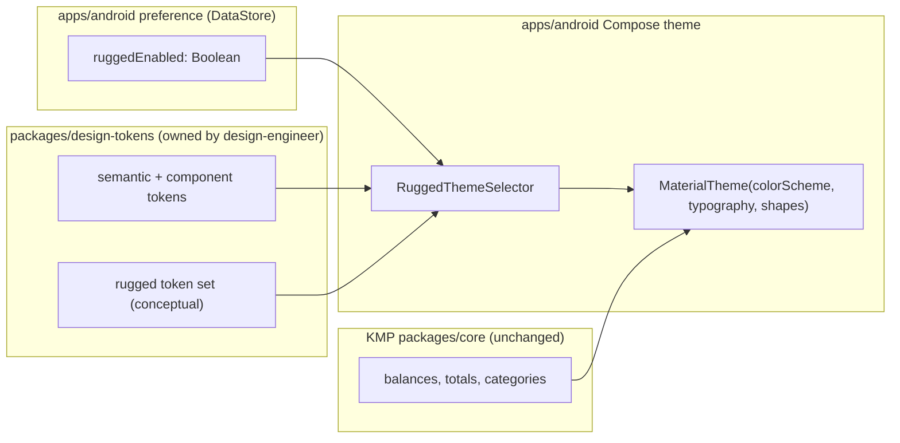
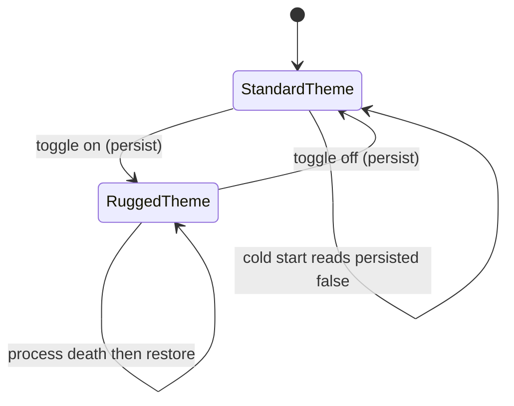

# Android Rugged Mode — Design Tokens & Preference

> **Status:** Design / breakdown only — native implementation gated by [#1242](https://github.com/jrmoulckers/finance/issues/1242)
> **Issue:** [#2559](https://github.com/jrmoulckers/finance/issues/2559) · **Part of:** [#2186](https://github.com/jrmoulckers/finance/issues/2186)
> **Platform:** Android (Jetpack Compose + Material 3) · **minSdk 28 / target 35** · **Audience:** Android engineers, design, QA

This document designs **Rugged mode** for the Android client: a user-selectable
display profile tuned for **field conditions** — direct outdoor sunlight, gloved
or wet hands, cold fingers, and one-handed use on a budget device. It defines the
**preference model**, the **persistence expectations**, and — _conceptually_ —
the **design-token additions** that a Rugged theme would consume.

It is a **design / breakdown only** document. It does **not** add native code or
edit any token source, while production signing and Play distribution remain
blocked by [#1242](https://github.com/jrmoulckers/finance/issues/1242).

> **Token ownership note.** This doc describes the Rugged-mode token set
> _conceptually_. The actual token JSON under
> [`packages/design-tokens/`](../../packages/design-tokens/) (and any generated
> output) is owned by the design-engineer. **No token files are added or edited
> here** — this is the Android-side intent and consumption contract that the
> design-engineer can implement against.

The guiding rule, as everywhere in the Android client: **Compose renders shared
state; it does not own finance math.** Rugged mode changes _how_ surfaces look
and _how big_ targets are; it never changes balances, totals, or category logic,
which stay in Kotlin Multiplatform (KMP) [`packages/core`](../../packages/core/).

---

## Table of Contents

1. [Goals & non-goals](#1-goals--non-goals)
2. [Personas & field conditions](#2-personas--field-conditions)
3. [The Compose-renders-shared-state boundary](#3-the-compose-renders-shared-state-boundary)
4. [Rugged-mode preference & persistence](#4-rugged-mode-preference--persistence)
5. [Token additions (conceptual)](#5-token-additions-conceptual)
6. [Token → Compose theme mapping](#6-token--compose-theme-mapping)
7. [Preference UI & quick toggle](#7-preference-ui--quick-toggle)
8. [Offline-first, empty, and error states](#8-offline-first-empty-and-error-states)
9. [Accessibility](#9-accessibility)
10. [Test plan](#10-test-plan)
11. [Implementation readiness](#11-implementation-readiness)
12. [Cross-links](#12-cross-links)

---

## 1. Goals & non-goals

### Goals

- Add a **Rugged mode** preference the user can turn on/off, plus a fast
  in-context toggle for the field.
- Define a **token-driven** display profile that, when active, raises contrast,
  enlarges touch targets and text, thickens borders/focus rings, and reduces
  glare-prone surfaces — _without_ changing data.
- Specify **persistence**: rugged mode survives process death, app restart, and
  is restored on the next cold start, fully offline.
- Keep all visual changes **token-mapped** so the design-engineer owns the values
  and the Android theme simply consumes them.
- Compose with existing accessibility surfaces (high-contrast, font scaling,
  cognitive mode) rather than competing with them.

### Non-goals

- **Editing token source.** Token JSON/generation under
  [`packages/design-tokens/`](../../packages/design-tokens/) is out of scope here
  (see ownership note above).
- The simplified field navigation and add-expense flow — designed separately in
  [Android Field-Mode Transaction & Receipt Flow](./android-field-mode-transaction-flow.md)
  ([#2561](https://github.com/jrmoulckers/finance/issues/2561)).
- Any change to KMP finance rules, money math, or category logic.
- Display-only hardware controls (screen brightness, torch) — Rugged mode hints
  at them but the OS owns them.

---

## 2. Personas & field conditions

The driving persona from [#2186](https://github.com/jrmoulckers/finance/issues/2186)
is a **mobile/field worker** — gig driver, food-truck operator, trades or
on-site worker — logging money _while working_, not at a desk. See
[User Personas & MVP Scope](./personas.md) for the broader set.

Rugged mode is designed against five concrete field conditions:

| Condition           | Problem it causes                                 | Rugged-mode response                                            |
| ------------------- | ------------------------------------------------- | --------------------------------------------------------------- |
| Direct sunlight     | Low perceived contrast; washed-out color          | Max-contrast palette, darker text on lighter solids, less glare |
| Gloved / cold hands | Reduced touch precision; capacitive misses        | Larger touch targets (≥ 56 dp), bigger spacing, fewer gestures  |
| Wet screen          | Phantom touches; mis-taps; accidental destructive | Confirm-before-destructive, generous hit slop, no swipe-to-act  |
| One-handed use      | Top of screen unreachable while holding cargo     | Bottom-anchored primary actions; reachable toggle               |
| Budget device       | Slow GPU; dynamic-color/animation cost            | Reduced motion, simpler elevation, static high-contrast palette |

Jobs this preference must satisfy:

- "Make the screen **readable in the sun** without fighting brightness."
- "Make the buttons **big enough to hit with gloves**."
- "**Remember** I'm in the field — don't make me re-enable this every time."

---

## 3. The Compose-renders-shared-state boundary

Rugged mode is a **presentation concern**. The split:

| Concern                                 | Where it lives                              | Notes                                                        |
| --------------------------------------- | ------------------------------------------- | ------------------------------------------------------------ |
| Rugged on/off + restore                 | Android preference store (DataStore)        | A display preference; not finance data, not a secret.        |
| Token values (color, size, motion)      | `packages/design-tokens/` (conceptual)      | Owned by design-engineer; Android consumes generated values. |
| Balances, totals, category math         | KMP [`packages/core`](../../packages/core/) | Unchanged by rugged mode; Compose renders shared state.      |
| Theme assembly from tokens + preference | `apps/android` Compose theme layer          | Picks the rugged token set when the preference is on.        |

**Boundary rules**

- Rugged mode never reaches into KMP business logic. It only selects a token set
  and a few layout flags consumed by the Compose theme.
- All money remains integer **cents** across the boundary and is formatted by the
  shared [`CurrencyFormatter`](../../packages/core/src/commonMain/kotlin/com/finance/core/currency/CurrencyFormatter.kt);
  rugged mode changes type size/contrast, never the value or its formatting.
- The preference is a **plain display flag** — it carries no account, balance, or
  PII — so it lives in standard DataStore, not the Keystore-backed secret store.

---

## 4. Rugged-mode preference & persistence

### Preference model

Rugged mode is exposed as a small, render-only state object owned by a Compose
`ViewModel` and backed by DataStore:

| Field                   | Type      | Default | Meaning                                                        |
| ----------------------- | --------- | ------- | -------------------------------------------------------------- |
| `ruggedEnabled`         | `Boolean` | `false` | Master switch for the rugged display profile.                  |
| `ruggedFollowsSunlight` | `Boolean` | `false` | Optional: auto-suggest rugged when ambient light is very high. |
| `lastChangedAtEpochMs`  | `Long`    | `0`     | For diagnostics/telemetry only — never a financial value.      |

> `ruggedFollowsSunlight` only ever _suggests_ via a dismissible hint; it never
> silently flips the visual profile, so the screen never changes under the user's
> hands unexpectedly.

### Persistence expectations

- **Store:** Jetpack **DataStore (Preferences)** — a display flag, not a secret.
  Secrets stay in the Keystore-backed path; rugged mode does **not**.
- **Survives:** process death (`SavedStateHandle` mirrors the in-flight value),
  app restart, and device reboot. On cold start the theme reads the persisted
  value _before first composition_ so there is **no flash** of the standard theme.
- **Offline:** fully local; no network, no sync dependency. Setting it works in
  airplane mode.
- **Scope:** per-device display preference (a co-driver's phone shouldn't inherit
  it via account sync). It is intentionally **not** synced through PowerSync.
- **Migration safety:** absent key ⇒ `false`; unknown future keys ignored.

---

## 5. Token additions (conceptual)

This section describes the **intent** of the Rugged token set so the
design-engineer can implement it under
[`packages/design-tokens/`](../../packages/design-tokens/). It deliberately
**mirrors the existing cognitive-mode precedent** (a semantic + component
override layer) rather than inventing a new mechanism. **No files are added or
edited here.**

### Proposed semantic layer

A high-contrast, low-glare semantic color set conceptually named
`colors.rugged` (analogous to the existing `colors.high-contrast` /
`colors.dark-oled` semantic sets):

| Conceptual token   | Intent                                                        |
| ------------------ | ------------------------------------------------------------- |
| `rugged.surface`   | Lighter, matte solid; minimal translucency to cut glare.      |
| `rugged.onSurface` | Near-black text for max sunlight legibility (target ≥ 7:1).   |
| `rugged.primary`   | Saturated, high-contrast accent that survives bright ambient. |
| `rugged.outline`   | Thicker, darker dividers/borders for shape definition.        |
| `rugged.error`     | Distinct from `primary` by shape + icon, not hue alone.       |
| `rugged.focusRing` | Extra-bold focus indicator for Switch Access in the field.    |

### Proposed component / dimension layer

Mirrors `component/cognitive.json` (`touchTargetMin`, increased padding):

| Conceptual token        | Intent                                                       |
| ----------------------- | ------------------------------------------------------------ |
| `rugged.touchTargetMin` | ≥ 56 dp minimum hit target (above the 48 dp baseline).       |
| `rugged.spacingScale`   | Larger inter-control spacing to reduce wet-screen mis-taps.  |
| `rugged.borderWidth`    | Thicker control/borders (e.g. 2–3 dp) for definition.        |
| `rugged.typeScaleBoost` | Additional type-scale step on top of the user's font scale.  |
| `rugged.motionReduced`  | Disable non-essential animation on budget GPUs.              |
| `rugged.elevationFlat`  | Flatter elevation to avoid glare-prone shadows/translucency. |

### Relationship to existing accessibility settings

Rugged mode **composes with**, and never silently overrides, existing settings:

- It is a sibling to high-contrast and [cognitive mode](./cognitive-accessibility.md),
  reusing the same override pattern.
- It **respects the OS font scale** and adds `typeScaleBoost` on top — it never
  caps or shrinks user-chosen text size.
- If the user already runs system high-contrast, rugged mode layers field-specific
  sizing/motion changes without double-darkening text.

---

## 6. Token → Compose theme mapping

The Android theme layer reads the persisted preference and assembles
`MaterialTheme` from the appropriate token set. The mapping is mechanical: tokens
flow into `ColorScheme`, `Typography`, and `Shapes`; dimension tokens flow into a
small `LocalRuggedMetrics` provider consumed by components.

| Compose surface                    | Standard source                | Rugged source (conceptual)         |
| ---------------------------------- | ------------------------------ | ---------------------------------- |
| `ColorScheme`                      | dynamic-color / semantic light | `colors.rugged` semantic set       |
| `Typography`                       | type tokens × OS font scale    | + `rugged.typeScaleBoost`          |
| Min touch target (`LocalMinTouch`) | 48 dp baseline                 | `rugged.touchTargetMin` (≥ 56 dp)  |
| Border / focus width               | 1 dp / default ring            | `rugged.borderWidth` / bold ring   |
| Motion (`LocalAnimationSpec`)      | default specs                  | reduced per `rugged.motionReduced` |
| Elevation / overlay                | tonal elevation                | `rugged.elevationFlat`             |

Existing Android theming surfaces this plugs into (read-only references):
[`FinanceTheme`](../../apps/android/src/main/kotlin/com/finance/android/ui/theme/FinanceTheme.kt),
[`ThemeManager`](../../apps/android/src/main/kotlin/com/finance/android/ui/theme/ThemeManager.kt),
[`ThemePreference`](../../apps/android/src/main/kotlin/com/finance/android/ui/theme/ThemePreference.kt),
[`Color`](../../apps/android/src/main/kotlin/com/finance/android/ui/theme/Color.kt),
[`Spacing`](../../apps/android/src/main/kotlin/com/finance/android/ui/theme/Spacing.kt),
and the existing [`HighContrastTheme`](../../apps/android/src/main/kotlin/com/finance/android/ui/accessibility/HighContrastTheme.kt).
A `RuggedThemeSelector` would slot alongside these and pick the rugged token set
when `ruggedEnabled` is true.

> **Dynamic color note.** Material You dynamic color can wash out under sunlight
> and is GPU-costly on budget devices. When rugged mode is on, the theme prefers
> the **static** `colors.rugged` set over wallpaper-derived dynamic color.

---

## 7. Preference UI & quick toggle

Two entry points, both Compose:

1. **Settings → Appearance** — a labelled switch row with a one-line explanation
   and an inline preview chip showing the larger, higher-contrast button. This
   joins the existing
   [`AppearanceSettingsScreen`](../../apps/android/src/main/kotlin/com/finance/android/ui/screens/settings/AppearanceSettingsScreen.kt)
   / [`AccessibilityPreferencesScreen`](../../apps/android/src/main/kotlin/com/finance/android/ui/screens/AccessibilityPreferencesScreen.kt)
   surfaces.
2. **In-context quick toggle** — a bottom-reachable affordance (e.g. a Quick
   Settings tile or a long-press on the field FAB) so a user can switch to rugged
   mode _without_ digging into settings while wearing gloves.

| Composable             | Type          | Responsibility                                               |
| ---------------------- | ------------- | ------------------------------------------------------------ |
| `RuggedModeSettingRow` | `@Composable` | Labelled switch + explanation + live preview chip.           |
| `RuggedQuickToggle`    | `@Composable` | Large, bottom-anchored toggle for in-field switching.        |
| `RuggedModeViewModel`  | `ViewModel`   | Reads/writes the DataStore-backed preference; exposes state. |

Every interactive element carries a `contentDescription` and a state description
("Rugged mode, on" / "off") so TalkBack announces both the control and its value.

---

## 8. Offline-first, empty, and error states

| State                    | Trigger                                 | UX                                                                                       |
| ------------------------ | --------------------------------------- | ---------------------------------------------------------------------------------------- |
| First run / never set    | No persisted key                        | Defaults to off; setting row shows a short "what this does" explanation.                 |
| Toggle while offline     | Airplane mode / no network              | Works fully; no spinner, no network call — it is a local flag.                           |
| Persist write fails      | DataStore I/O error                     | In-memory value still applies for the session; non-blocking retry; log a milestone only. |
| Process death mid-toggle | App killed before write flushes         | `SavedStateHandle` restores the in-flight value; reconciled on next write.               |
| Cold start               | App launches with rugged persisted true | Theme reads value before first composition — no flash of standard theme.                 |

No financial data is ever written to Timber for this feature. Structured logs
record flow milestones only (for example "rugged toggled") via `Timber.d`/`Timber.w`
with **no** sensitive values, per the client logging rules.

---

## 9. Accessibility

Rugged mode is itself an accessibility feature, and its own surfaces must meet
WCAG 2.2 AA and the shared [Accessibility Patterns Library](./accessibility-patterns.md).

- **TalkBack:** The switch row and quick toggle expose role, label, and on/off
  state ("Rugged mode, switch, on"). The settings heading uses
  `semantics { heading() }`. The preview chip is `contentDescription`-labelled
  and not focus-trapping.
- **Switch Access:** Logical top-to-bottom focus; the quick toggle is a single,
  large, bottom-reachable target. Rugged mode bumps the focus-ring weight via
  `rugged.focusRing` for outdoor visibility.
- **200% font scaling:** All copy uses `sp` and wraps; rugged `typeScaleBoost`
  adds to — never replaces — the user's OS font scale. No truncation of the
  setting label or explanation at max scale.
- **High contrast & sunlight:** Rugged palette targets ≥ 7:1 text contrast; state
  is conveyed by text + icon + shape, never color alone, so it survives glare and
  color-vision differences.
- **Gloves / wet / outdoor:** Touch targets ≥ 56 dp with generous hit slop; no
  swipe-to-act or long-press-only paths for the core toggle; destructive actions
  always confirm to defend against phantom wet-screen touches.
- **Large touch targets & reduced motion:** `rugged.touchTargetMin` and
  `rugged.motionReduced` keep the field experience tappable and calm on budget
  GPUs.

---

## 10. Test plan

| Layer               | Tooling                | Coverage                                                                                                                                                   |
| ------------------- | ---------------------- | ---------------------------------------------------------------------------------------------------------------------------------------------------------- |
| Unit (ViewModel)    | JUnit + coroutine test | Default is off; toggle persists; restore after process death; absent-key migration ⇒ off; offline toggle applies without network.                          |
| Unit (theme select) | JUnit                  | `RuggedThemeSelector` picks the rugged token set iff `ruggedEnabled`; respects OS font scale; composes with high-contrast without double-darkening.        |
| Compose UI          | `compose-ui-test`      | Switch announces on/off state; quick toggle is reachable and ≥ 56 dp; semantics/`contentDescription` assertions; font-scale `2.0f` layout has no clipping. |
| Snapshot            | Paparazzi              | A representative screen in standard vs. rugged, at default and 200% font scale, light/dark — asserting larger targets, thicker borders, flatter elevation. |

Token _values_ themselves are validated in the design-tokens package by the
design-engineer; this plan covers only the Android **preference, persistence, and
theme consumption**.

---

## 11. Implementation readiness

This is a design artifact. Implementation splits into a part that is fully
buildable today and a tail that is gated by Play onboarding.

See [Human-Gated Prerequisites](../ops/human-gated-prerequisites.md) and the
[Launch Readiness Plan](../ops/launch-readiness-plan.md) for the gating context.

### Buildable now (debug, no human gate)

- The `RuggedModeViewModel`, DataStore persistence, `RuggedThemeSelector`, setting
  row, and quick toggle are pure Compose + Android plumbing — fully implementable
  and runnable via `./gradlew :apps:android:assembleDebug` and sideload.
- Theme consumption can be wired against the existing standard token set today and
  swapped to the rugged set once the design-engineer lands the conceptual tokens.
- Unit, Compose, and Paparazzi tests run on CI and emulator/sideload with no
  signing or store presence.

### Play-distribution tail (gated by [#1242](https://github.com/jrmoulckers/finance/issues/1242))

- Production signing keystore + Google Play Console onboarding.
- Internal-testing-track upload, privacy declarations, and staged rollout.
- Anything requiring a release-signed AAB (not `assembleDebug`).

The rugged-mode preference and theme are not blocked from being built and tested
in debug; only their production distribution is. The token _values_ are a parallel
dependency owned by the design-engineer, not a build blocker for the Android
plumbing.

---

## 12. Cross-links

- Sibling: [Android Field-Mode Transaction & Receipt Flow](./android-field-mode-transaction-flow.md) — [#2561](https://github.com/jrmoulckers/finance/issues/2561)
- Sibling: [Android Receipt OCR Review → Transaction Draft](./android-receipt-ocr-review-draft.md) — [#2565](https://github.com/jrmoulckers/finance/issues/2565)
- [Cognitive Accessibility Mode](./cognitive-accessibility.md) · [Accessibility Patterns Library](./accessibility-patterns.md)
- [OLED & Dark Mode](./oled-dark-mode.md) · [Token Preview](./token-preview.md) · [Component Library](./component-library.md)
- [UX Design Principles](./ux-principles.md) · [Content & Language Guidelines](./content-language-guidelines.md) · [Responsive Breakpoints](./responsive-breakpoints.md)
- [Android Architecture](../architecture/android-architecture.md) · [User Personas](./personas.md)
- Ops: [Human-Gated Prerequisites](../ops/human-gated-prerequisites.md) · [Launch Readiness Plan](../ops/launch-readiness-plan.md)
