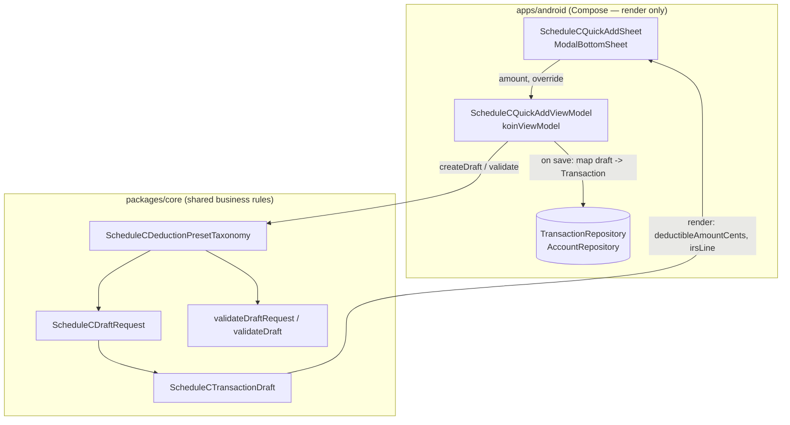
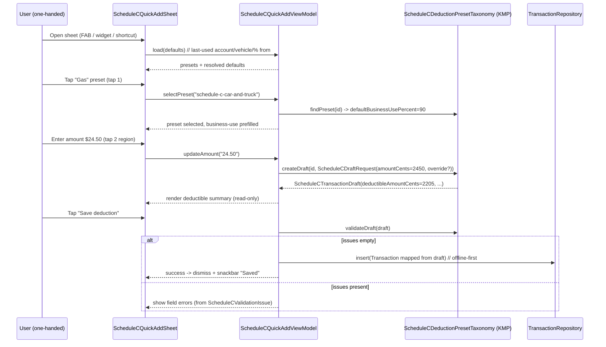

# Android Schedule C Quick-Add Sheet — Design

> **Status:** Design / breakdown · **Issue:** [#2523](https://github.com/jrmoulckers/finance/issues/2523) · **Part of [#2141](https://github.com/jrmoulckers/finance/issues/2141)**
> **Platform:** Android (Jetpack Compose · Material 3) · **minSdk 28 / target 35**
> **Companion designs:** [Quick-Add Defaults & Persistence](./android-quick-add-defaults-persistence.md) · [Cash Quick-Entry Deep Links](./android-cash-quick-entry-deep-links.md)

A one-handed Compose bottom sheet that lets a parked gig worker log a common
business deduction in two taps, with IRS Schedule C presets, large thumb-reach
touch targets, and a draft contract backed entirely by shared KMP business rules.

This is a **design + breakdown** document. Native implementation is _unblocked
for local debug builds_ (`assembleDebug` sideload); only **Play Store
distribution** is human-gated by
[#1242](https://github.com/jrmoulckers/finance/issues/1242). See
[Implementation readiness](#implementation-readiness) and
[`../ops/human-gated-prerequisites.md`](../ops/human-gated-prerequisites.md).

---

## Table of Contents

1. [Problem & Goals](#1-problem--goals)
2. [Architecture Boundary (KMP vs. Compose)](#2-architecture-boundary-kmp-vs-compose)
3. [Affected Android Surfaces & Shared Dependencies](#3-affected-android-surfaces--shared-dependencies)
4. [Sheet Anatomy & One-Handed Layout](#4-sheet-anatomy--one-handed-layout)
5. [Interaction Flow](#5-interaction-flow)
6. [Transaction-Draft Contract](#6-transaction-draft-contract)
7. [State Model](#7-state-model)
8. [Offline-First, Empty & Error States](#8-offline-first-empty--error-states)
9. [Accessibility (TalkBack, Switch Access, Font Scaling)](#9-accessibility-talkback-switch-access-font-scaling)
10. [Test Plan](#10-test-plan)
11. [Implementation readiness](#implementation-readiness)
12. [Open Questions](#open-questions)

---

## 1. Problem & Goals

From [#2141](https://github.com/jrmoulckers/finance/issues/2141): _"I'm using a
mid-range Android phone one-handed while parked. I need a thumb-friendly way to
log common gig expenses without opening a heavy form."_

The current path is the 3-step
[`TransactionCreateScreen`](../../apps/android/src/main/kotlin/com/finance/android/ui/screens/TransactionCreateScreen.kt)
wizard (Amount → Category/Account → Confirm), which is too heavy for a quick
deduction between deliveries.

**Goals**

- **Two-tap capture** for the most common gig deductions (preset → amount → save).
- **Thumb-reachable** controls anchored to the bottom of a one-handed sheet.
- **Schedule C alignment**: each preset pre-fills the IRS category, line, default
  business-use %, and deductible default from the shared taxonomy.
- **No finance math in Compose** — the sheet renders shared draft state and shows
  shared validation results.

**Non-goals**

- Replacing the full create/edit wizard (it remains for complex/transfer entries).
- Mileage tracking (separate workflow) — this sheet logs _expense amounts_, not trips.
- Owning preset definitions or proration math in the Android layer.

---

## 2. Architecture Boundary (KMP vs. Compose)

All deduction rules, preset definitions, validation, and proration live in the
shared module
[`packages/core/.../schedulec/ScheduleCDeductionPresets.kt`](../../packages/core/src/commonMain/kotlin/com/finance/core/schedulec/ScheduleCDeductionPresets.kt).
The Compose sheet is a **pure renderer of shared state** plus a thin Android
ViewModel that calls into the shared API.



**Boundary rules (do not violate in implementation):**

- The ViewModel never computes proration or deductible amounts — it calls
  `ScheduleCDeductionPresetTaxonomy.createDraft(presetId, request)`.
- Validation messages shown in the sheet come from
  `validateDraftRequest(...)` / `validateDraft(...)`; the Compose layer never
  re-implements the `amount > 0` or `0..100` business-use checks.
- The Android layer **maps** the resulting `ScheduleCTransactionDraft` to a
  [`Transaction`](../../packages/models/src/commonMain/kotlin/com/finance/models/Transaction.kt)
  at save time (category, amount, tags, memo) — see
  [§6](#6-transaction-draft-contract).
- If a new preset or rule is needed, it is added in `packages/*` by
  `@native-app-engineer`; this design does not implement it here.

---

## 3. Affected Android Surfaces & Shared Dependencies

| Surface (new/modified)                            | Type        | Role                                                                                                                         |
| ------------------------------------------------- | ----------- | ---------------------------------------------------------------------------------------------------------------------------- |
| `ui/quickadd/ScheduleCQuickAddSheet.kt` (new)     | Composable  | `ModalBottomSheet` host: preset grid, amount pad, deductible summary, save bar.                                              |
| `ui/quickadd/ScheduleCPresetChip.kt` (new)        | Composable  | Large preset chip/card (icon + label + IRS line), ≥ 56 dp target.                                                            |
| `ui/quickadd/ScheduleCQuickAddViewModel.kt` (new) | ViewModel   | Holds UI state; delegates draft creation/validation to shared taxonomy.                                                      |
| `ui/screens/TransactionsScreen.kt` (modified)     | Composable  | Adds the FAB / entry affordance that launches the sheet (see [deep-links design](./android-cash-quick-entry-deep-links.md)). |
| `di/QuickAddModule.kt` (new)                      | Koin module | `viewModelOf(::ScheduleCQuickAddViewModel)`; wired in `FinanceApplication`.                                                  |

**Shared (KMP) dependencies — already exist, no edits here:**

- `com.finance.core.schedulec.ScheduleCDeductionPresetTaxonomy` — preset list,
  `createDraft`, `validateDraftRequest`, `validateDraft`, `findPreset`.
- `ScheduleCDeductionPreset`, `ScheduleCDraftRequest`, `ScheduleCTransactionDraft`,
  `ScheduleCValidationIssue`, `ScheduleCExpenseCategory`.
- `com.finance.models.types.Cents`, `Currency`, `SyncId`.
- `com.finance.core.currency.CurrencyFormatter` for display formatting.
- `com.finance.models.Transaction` for the persisted entity.

**Koin pattern** (per repo convention):

```kotlin
val quickAddModule = module {
    viewModelOf(::ScheduleCQuickAddViewModel)
}
// In the sheet host:
val vm = koinViewModel<ScheduleCQuickAddViewModel>()
```

---

## 4. Sheet Anatomy & One-Handed Layout

A Material 3 `ModalBottomSheet`, expandable but usable at a partial height that
keeps every interactive control in the bottom ~60% of the screen (thumb arc on a
6.5" device held one-handed).

```
┌──────────────────────────────────────────┐  ← drag handle (44dp hit area)
│  ▒▒▒▒▒                                     │
│  Quick add deduction                       │  ← title (TalkBack heading)
│  Account: Cash Wallet ▾   Vehicle: Civic ▾ │  ← last-used defaults (#2525)
│                                            │
│  ┌──────┐ ┌──────┐ ┌──────┐               │
│  │ ⛽   │ │ 🅿️   │ │ 📱   │               │  preset grid (2 cols × N rows,
│  │ Gas  │ │ Toll │ │Phone%│               │  large chips, scrolls vertically)
│  │ Ln 9 │ │ Ln 9 │ │ Ln25 │               │
│  └──────┘ └──────┘ └──────┘               │
│  ┌──────┐ ┌──────┐ ┌──────┐               │
│  │ 🛡️   │ │ 📦   │ │  …   │               │
│  │Insur.│ │Suppl.│ │ More │               │
│  └──────┘ └──────┘ └──────┘               │
│ ── selected: Gas · Line 9 ─────────────── │
│  Amount   $ [ 24.50 ]                      │  ← amount field + numeric pad
│  Business use  [ 90% ]  Deductible ✓       │  ← editable override (default 90%)
│  Deductible amount:  $22.05                │  ← READ-ONLY, from shared draft
│                                            │
│  ┌──────────────────────────────────────┐ │
│  │            Save deduction             │ │  ← primary, full-width, ≥ 56dp,
│  └──────────────────────────────────────┘ │     anchored bottom (thumb zone)
└──────────────────────────────────────────┘
```

**Layout principles**

- **Touch targets ≥ 56 dp** (preset chips and Save), exceeding the 48 dp minimum
  in [`accessibility-patterns.md`](./accessibility-patterns.md), because the user
  may be in a moving-vehicle-adjacent context.
- **Primary action anchored bottom**, full-width, never requiring a stretch to
  the top of the screen.
- **Preset grid scrolls**, not the whole sheet, so the amount/save controls stay
  pinned and reachable.
- **Material You dynamic color** via `MaterialTheme`/`dynamicColorScheme`; chips
  use `primaryContainer`/`onPrimaryContainer` and the selected chip elevates.
- **No emoji-only meaning** — every chip pairs an icon with a text label and an
  IRS line caption; the icon is decorative (`contentDescription = null`), the
  label carries the semantics.

**Preset ordering** for gig drivers (subset surfaced first, full taxonomy behind
"More"): Gas/Fuel (`schedule-c-car-and-truck`, Line 9), Tolls & Parking (Line 9),
Phone % (`schedule-c-utilities`, Line 25), Insurance (Line 15), Supplies (Line
22), Commissions/Platform fees (Line 10). Order is a presentation concern in the
Android layer; the canonical definitions stay in the shared taxonomy.

---

## 5. Interaction Flow



**Two-tap promise:** with last-used defaults resolved, the minimum path is
_tap preset → type amount → Save_. Business-use % and deductible are pre-filled
from the preset and only need touching when the user wants to override.

---

## 6. Transaction-Draft Contract

The shared layer owns the draft; the Android layer owns the **mapping to a
persisted `Transaction`**. Contract:

**Inputs the sheet provides to KMP**

| Field                          | Source                       | Notes                                       |
| ------------------------------ | ---------------------------- | ------------------------------------------- |
| `presetId: String`             | Selected preset chip         | e.g. `schedule-c-car-and-truck`.            |
| `amountCents: Cents`           | Amount field (parsed)        | Must be `> 0` (shared validation enforces). |
| `businessUsePercentOverride`   | Editable field (nullable)    | `null` → preset default; else `0..100`.     |
| `deductibleOverride: Boolean?` | Deductible toggle (nullable) | `null` → preset `deductibleByDefault`.      |
| `memo: String?`                | Optional note                | Trimmed/normalized by shared `createDraft`. |

**Output from `createDraft(presetId, request)` → `ScheduleCTransactionDraft`**

`presetId`, `category`, `categoryDisplayName`, `irsLine`, `amountCents`,
`deductible`, `businessUsePercent`, `deductibleAmountCents` (pre-prorated, **read
only** in UI), `memo`.

**Android mapping `ScheduleCTransactionDraft` → `Transaction` (at save):**

| `Transaction` field | Value                                                                                    |
| ------------------- | ---------------------------------------------------------------------------------------- |
| `type`              | `TransactionType.EXPENSE`                                                                |
| `amount`            | `Cents(-draft.amountCents.amount)` (expense sign, matches wizard convention)             |
| `accountId`         | Resolved last-used account (see [#2525](./android-quick-add-defaults-persistence.md))    |
| `categoryId`        | Mapped from `draft.category` to the household category (mapping owned by repository/KMP) |
| `tags`              | `["schedule-c", draft.irsLine, "business-use:${draft.businessUsePercent}"]`              |
| `note` / `memo`     | `draft.memo`                                                                             |
| `currency`          | `Currency.USD` (household currency)                                                      |
| `status`            | `TransactionStatus.CLEARED`                                                              |
| `date`              | Today (system zone), matching wizard default                                             |

> **Boundary note:** the deductible **amount** is a derived/reporting value; it is
> not a separate ledger entry. It is carried via tag/metadata so Schedule C
> reporting (shared) can reconstruct it. The exact persistence of
> `deductibleAmountCents` and the category-mapping table are KMP/repository
> decisions — this doc defines the _contract_, not the storage. Do not invent a
> new column in the Android layer.

---

## 7. State Model

```kotlin
// Android-only UI state — no finance math, mirrors shared draft.
data class ScheduleCQuickAddUiState(
    val presets: List<ScheduleCDeductionPreset> = emptyList(),
    val selectedPresetId: String? = null,
    val amountText: String = "",
    val businessUsePercentText: String = "",   // prefilled from preset default
    val deductibleOverride: Boolean? = null,
    val memo: String = "",
    val accounts: List<Account> = emptyList(),
    val selectedAccountId: SyncId? = null,      // last-used default (#2525)
    val draft: ScheduleCTransactionDraft? = null,  // produced by shared createDraft
    val fieldErrors: List<ScheduleCValidationIssue> = emptyList(),
    val isSaving: Boolean = false,
    val isSaved: Boolean = false,
    val isOffline: Boolean = false,
)
```

- `draft` is recomputed by calling the shared taxonomy whenever amount/preset/
  override changes; the deductible summary renders `draft.deductibleAmountCents`.
- `fieldErrors` are the shared `ScheduleCValidationIssue`s mapped to per-field
  messages — never authored in Compose.

---

## 8. Offline-First, Empty & Error States

| Scenario                        | Behavior                                                                                                                                                                                                                       |
| ------------------------------- | ------------------------------------------------------------------------------------------------------------------------------------------------------------------------------------------------------------------------------ |
| **Offline (no network)**        | Full functionality. `TransactionRepository.insert` writes to the local SQLDelight/SQLCipher store; sync happens later via `SyncWorker` (WorkManager). A subtle "Saved offline — will sync" snackbar with `contentDescription`. |
| **No accounts yet**             | Preset grid still renders; Save is disabled with helper text "Add a cash or bank account to save." CTA deep-links to account create. Announced politely via TalkBack.                                                          |
| **No amount entered**           | Save disabled; the shared `validateDraftRequest` reports `amountCents` "Amount must be greater than zero" only on attempted save (avoid nagging while typing).                                                                 |
| **Business-use out of range**   | Inline error from `businessUsePercentOverride` validation ("Business-use percent must be in 0..100"); Save blocked.                                                                                                            |
| **Save failure (DB/exception)** | Non-dismissing error snackbar with Retry; the sheet stays open with input preserved. Logged via `Timber.e(t, "Quick-add save failed")` — **never** log amount/account values.                                                  |
| **Preset taxonomy empty**       | Should never happen (static list); defensive empty state shows "Presets unavailable" and routes to the full wizard.                                                                                                            |

**Logging:** use Timber only; never `Log.*`. Never log `amountCents`,
`deductibleAmountCents`, account names, or balances.

---

## 9. Accessibility (TalkBack, Switch Access, Font Scaling)

Per [`accessibility-patterns.md`](./accessibility-patterns.md) and
[`cognitive-accessibility.md`](./cognitive-accessibility.md):

- **`contentDescription` on every interactive/informational element.** Preset
  chip: `"Gas, Schedule C line 9, business use 90 percent. Selects this deduction."`
  Decorative icons are `null`; the label text carries meaning.
- **Sheet title is a TalkBack heading** (`semantics { heading() }`); focus moves
  to the title on open.
- **Deductible summary is a live region** (`liveRegion = Polite`) so the announced
  deductible amount updates as the user types the amount (announce the formatted
  string from `CurrencyFormatter`, e.g. "Deductible amount $22.05").
- **Logical focus order**: title → defaults → preset grid → amount → business-use
  → save. Save button reachable by Switch Access scanning early (it is large and
  late in DOM but grouped).
- **Touch targets ≥ 56 dp**; spacing ≥ 8 dp to avoid mis-taps one-handed.
- **Font scaling to 200%**: chips use flexible height + `maxLines` with ellipsis
  on label but full text in `contentDescription`; the sheet scrolls rather than
  truncating the amount/save controls. Verify at `fontScale = 2.0`.
- **State announcements**: selecting a preset announces the new business-use
  default; save success announces "Deduction saved".
- **Color independence**: the selected chip is conveyed by elevation + a check
  glyph + `stateDescription = "Selected"`, not color alone.

---

## 10. Test Plan

**Shared (already covered in KMP; reference only):**
[`ScheduleCDeductionPresetTaxonomyTest`](../../packages/core/src/commonTest/kotlin/com/finance/core/schedulec/ScheduleCDeductionPresetTaxonomyTest.kt)
covers `createDraft`, proration, and validation — the Android layer must not
duplicate these.

**Android unit (`apps/android/src/test`, JVM, runs in CI without a device):**

- `ScheduleCQuickAddViewModelTest`
  - selecting a preset prefills `businessUsePercentText` from the preset default
    (Gas → 90, Meals → 50, Home office → 25).
  - amount change recomputes `draft` via the shared taxonomy; `deductibleAmountCents`
    matches the shared result (no local math).
  - `validateDraftRequest` errors surface as `fieldErrors` and block save.
  - save maps draft → `Transaction` with EXPENSE type, negative amount, schedule-c
    tags, and the selected account; calls `repository.insert` exactly once.
  - offline insert path sets `isSaved` without requiring network.

**Compose UI / instrumentation (`androidTest`, debug build):**

- two-tap happy path: open → tap preset → type amount → Save → dismiss.
- Save disabled when no account / no amount; helper text present.
- robot pattern consistent with existing
  [`TransactionRobot`](../../apps/android/src/androidTest/kotlin/com/finance/android/e2e/robot/TransactionRobot.kt).

**Accessibility tests:**

- TalkBack semantics assertions (every chip + save has non-empty
  `contentDescription`; title is a heading; deductible summary is a live region).
- `fontScale = 2.0` layout does not clip amount/save.
- Switch Access focus-order test.

**Paparazzi snapshot tests** (no device, runs in CI):

- collapsed sheet, expanded sheet, preset-selected state, error state, large-font
  (`fontScale = 1.5`) variant, dark/OLED theme
  ([`oled-dark-mode.md`](./oled-dark-mode.md)).

---

## Implementation readiness

| Phase                                                                                           | Status               | Gate                                                                                                      |
| ----------------------------------------------------------------------------------------------- | -------------------- | --------------------------------------------------------------------------------------------------------- |
| This design doc                                                                                 | ✅ Done              | None                                                                                                      |
| Compose sheet + ViewModel + Koin wiring, unit/UI/Paparazzi tests, `:apps:android:assembleDebug` | 🟢 **Buildable now** | None — debug sideload per [`../ops/human-gated-prerequisites.md` §2](../ops/human-gated-prerequisites.md) |
| Play Store release (signed AAB, internal/production tracks)                                     | 🔒 **Gated**         | [#1242](https://github.com/jrmoulckers/finance/issues/1242) — keystore + Play Console                     |

The deduction logic already exists in `packages/core`; the entire sheet is
renderable and testable today against the shared taxonomy with
`./gradlew :apps:android:assembleDebug` and unit/instrumentation/Paparazzi
suites. **Only Play distribution** (release signing, Play Console upload) is
human-gated by #1242 — see
[`../ops/human-gated-prerequisites.md`](../ops/human-gated-prerequisites.md)
§§2–3.1. No native build, signing, or store action is performed by this design.

---

## Open Questions

1. **Category mapping** `ScheduleCExpenseCategory` → household `Category` row:
   owned by KMP/repository. Does a mapping table already exist, or does
   `@native-app-engineer` need to add one? (Tracked separately; does not block the sheet.)
2. **Deductible-amount persistence**: tag/metadata vs. a dedicated field — KMP
   decision; this design carries it via tags pending that call.
3. **Vehicle selector** scope here vs. fully in
   [#2525](./android-quick-add-defaults-persistence.md) — defaults doc owns the
   persistence; this sheet only renders the chosen vehicle.
