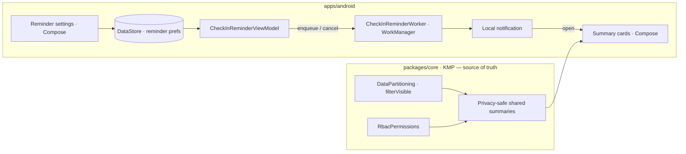
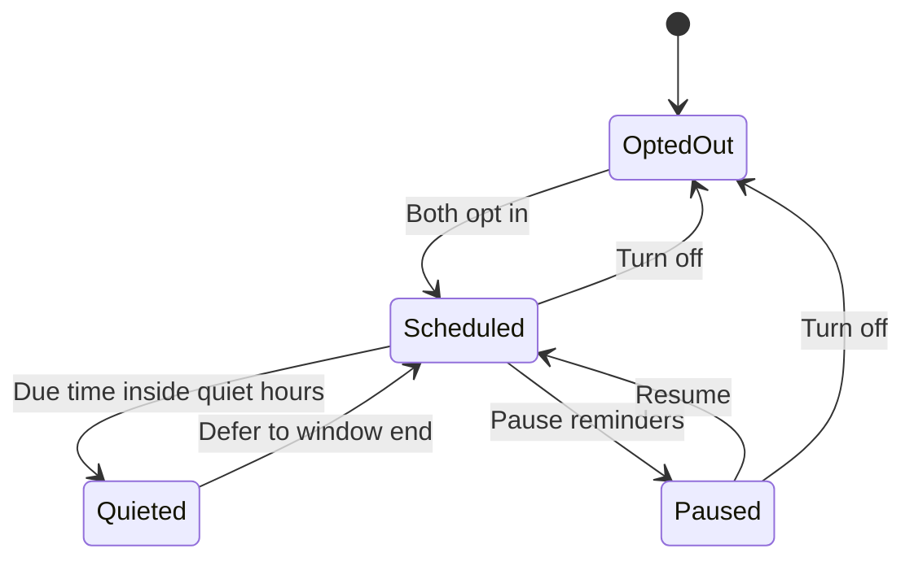
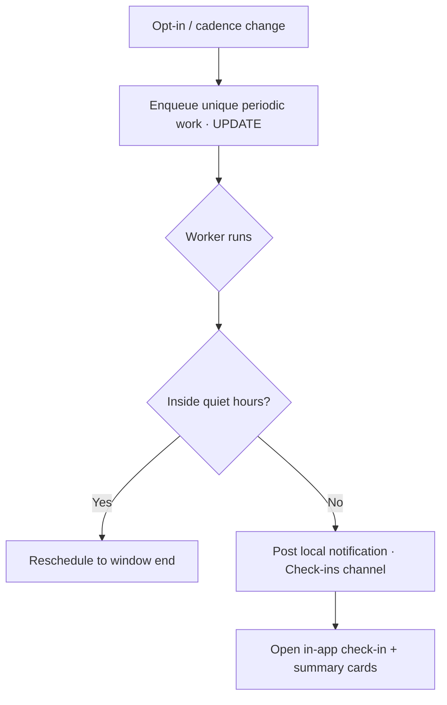
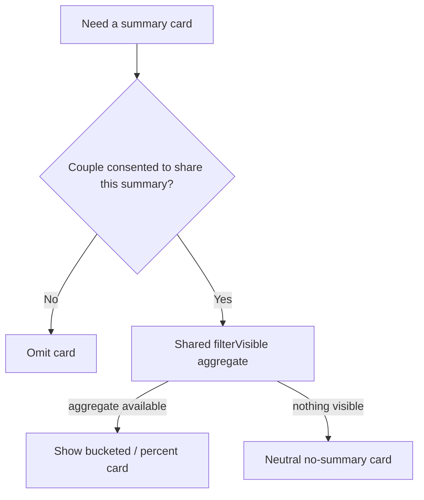

# Android Scheduled Check-In Reminders & Privacy-Safe Summaries — Design

> **Status:** DESIGN — Implementation-ready (native build/test unblocked; store distribution gated by [#1242](https://github.com/jrmoulckers/finance/issues/1242))
> **Issue:** [#2653](https://github.com/jrmoulckers/finance/issues/2653) — _Part of [#2150](https://github.com/jrmoulckers/finance/issues/2150)_ (couples collaboration)
> **Platform:** Android (Jetpack Compose · Material 3 · WorkManager · DataStore)
> **Last Updated:** 2026-06-22

This document specifies the **scheduling and summary** layer for the couples money
check-in: the **reminder preferences** (cadence, quiet hours, opt-in), the
**WorkManager** behavior that fires the reminder **locally**, and the
**privacy-safe summary cards** (budget drift, shared goals, wedding changes) a
partner consents to share. It is the scheduling companion to the
[Couples Money Check-In Flow](android-couples-money-checkin.md), which owns the
in-session ritual itself.

Two principles govern everything here:

1. **Reminders are local.** They fire via **WorkManager** on the device — **no
   remote push, no FCM/Supabase notification** for check-in reminders. This keeps
   the cadence private to the device and avoids a server learning a couple's
   check-in rhythm.
2. **Summaries are privacy-safe.** Every card shows a **shared, consented
   aggregate** computed in `packages/core` — never a partner's private line items,
   exact balances, or transactions. A summary card can **never** leak a record the
   owner kept private.

---

## Table of Contents

1. [Goals & Non-Goals](#1-goals--non-goals)
2. [Architecture Boundary (Compose ↔ KMP ↔ WorkManager)](#2-architecture-boundary-compose--kmp--workmanager)
3. [Grounding in Existing Code](#3-grounding-in-existing-code)
4. [Reminder Preferences (Opt-In, Cadence, Quiet Hours)](#4-reminder-preferences-opt-in-cadence-quiet-hours)
5. [WorkManager Reminder Behavior](#5-workmanager-reminder-behavior)
6. [Cancellation & Reschedule Paths](#6-cancellation--reschedule-paths)
7. [Privacy-Safe Summary Cards](#7-privacy-safe-summary-cards)
8. [Composable & ViewModel Structure](#8-composable--viewmodel-structure)
9. [Accessibility (TalkBack, Switch Access, Font Scaling)](#9-accessibility-talkback-switch-access-font-scaling)
10. [Offline, Empty & Error States](#10-offline-empty--error-states)
11. [Test Plan](#11-test-plan)
12. [Implementation Readiness](#12-implementation-readiness)
13. [Open Questions](#13-open-questions)
14. [References](#14-references)

---

## 1. Goals & Non-Goals

### Goals

- Define **opt-in cadence**, **quiet-hours**, and **reminder preference** states for
  the couples check-in.
- Specify **WorkManager** reminder behavior and the **cancellation / reschedule**
  paths (pause, opt-out, cadence change, quiet-hours change).
- Design **summary-only cards** for **budget drift**, **shared goals**, and
  **wedding changes** that show consented aggregates only.
- Persist preferences in **DataStore** (non-secret UI preferences) and keep all
  privacy/aggregation policy in the shared layer.
- Make every reminder and summary fully usable with **TalkBack, Switch Access, and
  200% font scaling**.

### Non-Goals

- **No remote push.** Check-in reminders are **local WorkManager** notifications;
  this design does not add FCM/Supabase push for reminders (see §2, §5).
- **No money math in Compose.** Budget drift, goal progress, and wedding deltas are
  computed in `packages/core`; the cards render privacy-safe results.
- **No new shared rules here.** Where a summary is missing, that is an
  @kmp-engineer follow-up under [#2150](https://github.com/jrmoulckers/finance/issues/2150),
  not a Compose workaround.
- **No `AlarmManager` / `JobScheduler`.** Scheduling uses WorkManager exclusively.
- **No store distribution work** (gated by #1242 — see §12).

---

## 2. Architecture Boundary (Compose ↔ KMP ↔ WorkManager)

Preferences and scheduling live in the Android layer; **every figure on a summary
card is privacy-safe shared state from `packages/core`.**

**Rule:** WorkManager fires a **local** reminder; opening it leads to summary cards
whose every number is a **consented aggregate** filtered by
`DataPartitioning.filterVisible`. There is **no network round-trip to deliver the
reminder** and **no raw private data** on any card.

---

## 3. Grounding in Existing Code

The feature reuses established notification, scheduling, and preference patterns —
do not fork them.

| Concern                    | Existing reference (reuse, don't reinvent)                                                                                                                                                                                                                             | Notes                                                      |
| -------------------------- | ---------------------------------------------------------------------------------------------------------------------------------------------------------------------------------------------------------------------------------------------------------------------- | ---------------------------------------------------------- |
| WorkManager scheduling     | [`NotificationScheduler`](../../apps/android/src/main/kotlin/com/finance/android/notifications/NotificationScheduler.kt), [`BillReminderWorker`](../../apps/android/src/main/kotlin/com/finance/android/sync/BillReminderWorker.kt)                                    | Same enqueue/backoff/cancel patterns as bill reminders     |
| Notification preferences   | [`NotificationPreferences`](../../apps/android/src/main/kotlin/com/finance/android/notifications/NotificationPreferences.kt)                                                                                                                                           | DataStore-backed prefs; extend the same approach           |
| Channels & content         | [`NotificationChannelManager`](../../apps/android/src/main/kotlin/com/finance/android/notifications/NotificationChannelManager.kt), [`NotificationContentBuilder`](../../apps/android/src/main/kotlin/com/finance/android/notifications/NotificationContentBuilder.kt) | A dedicated, mutable "Check-ins" channel                   |
| Shared partition / masking | [`DataPartitioning`](../../packages/core/src/commonMain/kotlin/com/finance/core/household/DataPartitioning.kt), [`RbacPermissions`](../../packages/core/src/commonMain/kotlin/com/finance/core/household/RbacPermissions.kt)                                           | Decides what a partner may see; Compose never re-derives   |
| In-session ritual          | [Couples Money Check-In Flow](android-couples-money-checkin.md)                                                                                                                                                                                                        | This doc schedules and previews; that doc runs the session |

> **Boundary note:** the existing `Notification*` stack already proves the
> WorkManager + DataStore + channel pattern with **no remote push** for local
> reminders. The check-in reminder is a new, opt-in instance of that pattern, not a
> new mechanism.

---

## 4. Reminder Preferences (Opt-In, Cadence, Quiet Hours)

Preferences are stored in **DataStore** (non-secret UI state) and read by the
ViewModel to (re)enqueue work. Defaults are **off** — nothing schedules until both
partners opt in (consistent with the ritual's mutual opt-in).

| Preference         | Values                                   | Default    | Notes                                                      |
| ------------------ | ---------------------------------------- | ---------- | ---------------------------------------------------------- |
| **Opt-in**         | On / Off                                 | **Off**    | Mutual opt-in; turning off cancels all scheduled work      |
| **Cadence**        | Weekly · Biweekly · Monthly · Custom day | Weekly     | Anchored to a chosen weekday/time the couple agrees on     |
| **Preferred time** | Time-of-day                              | 7:00 PM    | Local device time; reflowed for 24h locale formatting      |
| **Quiet hours**    | Start–End window                         | 10 PM–7 AM | A reminder due inside quiet hours defers to the window end |
| **Snooze**         | 1 day / Next cadence                     | —          | From the notification or in-app                            |

- **Quiet hours** never drop a reminder; they **shift** it to the end of the window,
  so a couple is never silently skipped or pinged at night.
- **Cadence change** reschedules from "now" forward; it never retroactively fires a
  missed past reminder.
- Preferences are **device-local UI prefs**; the couple's _consent_ to share a
  given summary is a shared concern (see §7), not a DataStore toggle.

---

## 5. WorkManager Reminder Behavior

Reminders use a **periodic WorkManager** request with a unique name, mirroring the
existing bill-reminder worker.

- **Enqueue:** on opt-in (and on any cadence/time change) the ViewModel enqueues a
  uniquely-named periodic work request via the shared scheduler, using
  `ExistingPeriodicWorkPolicy.UPDATE` so re-config replaces cleanly without
  duplicates.
- **Worker job:** `CheckInReminderWorker` checks current prefs, evaluates quiet
  hours, then posts a **local** notification on the dedicated "Check-ins" channel
  via `NotificationContentBuilder`. It performs **no money math** and reads only the
  flag of whether a privacy-safe summary is available — never the figures.
- **No remote delivery:** there is **no FCM/Supabase path** for check-in reminders;
  the worker posts the notification directly on-device.
- **Constraints & backoff:** the reminder itself needs no network; if it opportun-
  istically warms a cached summary it does so under a relaxed constraint with
  exponential backoff, and a missed run **never double-fires** (idempotent unique
  work).
- **Permissions:** on Android 13+ the settings screen requests
  `POST_NOTIFICATIONS` before enabling reminders, with a graceful in-app fallback
  banner if denied (the in-app check-in still works without notifications).

---

## 6. Cancellation & Reschedule Paths

Every preference change maps to an explicit WorkManager action; the ViewModel is the
single owner of these transitions.

| Trigger                        | WorkManager action                                 | User-visible result                                    |
| ------------------------------ | -------------------------------------------------- | ------------------------------------------------------ |
| Turn reminders **off**         | `cancelUniqueWork(checkInReminder)`                | No future reminders; prefs retained for easy re-enable |
| **Pause**                      | Cancel unique work, set `paused` flag in DataStore | "Paused" state; resume re-enqueues                     |
| **Resume**                     | Re-enqueue unique periodic work                    | Next reminder at the configured cadence                |
| **Cadence / time change**      | Re-enqueue with `UPDATE` policy                    | Schedule shifts forward; no duplicate, no backfill     |
| **Quiet-hours change**         | No re-enqueue; worker re-reads prefs at run time   | Next run respects the new window                       |
| **Snooze** (from notification) | One-off deferred work or skip to next cadence      | Single shifted reminder; periodic schedule intact      |
| **Either partner opts out**    | Cancel unique work                                 | Mutual opt-in broken → reminders stop for both         |

- **Idempotency:** all transitions use the **unique work name**, so rapid toggling
  cannot leave orphaned or duplicated periodic work.
- **Reversibility:** turning off/pausing **retains preferences** so re-enabling is
  one tap; no re-onboarding.

---

## 7. Privacy-Safe Summary Cards

Three opt-in card types appear in the reminder preview and the in-session recap.
**Each renders a consented aggregate only** — sourced from `packages/core`, filtered
by `DataPartitioning.filterVisible`, and consistent with
[Privacy-Safe Share Cards](android-privacy-safe-share-cards.md).

| Card                | Privacy-safe content (consented aggregate)                                                      | Never shows                                             |
| ------------------- | ----------------------------------------------------------------------------------------------- | ------------------------------------------------------- |
| **Budget drift**    | Direction + bucketed magnitude for **shared** budgets (e.g., "Dining a little over this month") | Exact amounts, merchants, or a partner's private budget |
| **Shared goals**    | % progress + on/off-track for **Ours** goals                                                    | Per-partner exact contributions a partner kept private  |
| **Wedding changes** | Net direction of shared wedding actuals vs. plan, bucketed                                      | Itemized vendor amounts or a partner's private spend    |

Hard privacy rules:

- **No leakage of a partner's private items.** A card is built only from records the
  viewer is permitted to see per the shared filter. If a contributing record is
  `PERSONAL`/private, it is **excluded from the aggregate**, not summarized around —
  there is no "everything but the number" peek.
- **Consent gate:** a card type only appears if the couple has **consented to share
  that summary**; consent is a shared-layer flag, not a local toggle.
- **Bucketed / percent only:** magnitudes use the shared masking path
  (bucketed bands, percent, direction) — Compose never formats a raw private amount.
- **Empty over guess:** when no consented summary exists, the card is **omitted**
  (or shows a neutral "no shared summary yet"), never a blank, error, or inferred
  figure.

> **Wedding linkage:** the wedding-changes card consumes the shared wedding actuals
> aggregate referenced by
> [Wedding Actuals & Cashflow](android-wedding-actuals-cashflow.md); it shows
> direction-vs-plan only, never itemized vendor figures.

---

## 8. Composable & ViewModel Structure

Indicative structure (no Kotlin until #1242 unblocks native work):

- **`CheckInReminderSettingsScreen`** — opt-in toggle, cadence picker, preferred
  time, quiet-hours window, and per-summary consent rows; writes DataStore prefs.
- **`CheckInReminderViewModel`** — single owner of preference state and all
  WorkManager enqueue/cancel/reschedule transitions (§5–§6); exposes a
  `koinViewModel<…>()`-provided instance. Delegates any figure to the shared
  summary path; never computes drift/progress itself.
- **`CheckInReminderWorker`** — WorkManager `CoroutineWorker` posting the local
  notification; reads only the "summary available" flag.
- **`SummaryCard` family** (`BudgetDriftCard`, `SharedGoalsCard`,
  `WeddingChangesCard`) — stateless Composables rendering a privacy-safe aggregate
  prop; no data access of their own.
- **Koin:** ViewModel via `viewModelOf(...)`; the worker obtains shared deps via
  Koin per existing worker patterns.
- **Logging:** **Timber** only; never log amounts, balances, budget figures, or
  whether a specific named summary went over.

---

## 9. Accessibility (TalkBack, Switch Access, Font Scaling)

- **TalkBack:** every preference control and summary card has a `contentDescription`
  (e.g., card: _"Shared dining budget, a little over this month"_ — bucketed, never
  an exact figure). Cadence and quiet-hours pickers announce current values clearly.
- **Switch Access:** logical order opt-in → cadence → time → quiet hours → consent
  rows → save; targets ≥ 48dp; everything operable without gestures.
- **200% font scaling:** settings rows and summary cards reflow and never truncate
  copy; verified via Compose previews + Paparazzi at large-font configs.
- **Notification accessibility:** the reminder uses a concise, non-accusatory title
  and body; no sensitive figure in the notification text or preview.
- **No color-only signaling:** drift direction and on/off-track pair an icon + text
  with color; never color alone.
- **Live region:** toggling reminders on/off or pausing announces the new state
  politely ("Reminders on, weekly on Sundays at 7 PM").

---

## 10. Offline, Empty & Error States

- **Offline:** scheduling and the local reminder work fully offline — WorkManager
  enqueues locally and fires without network. Summary cards use the **last cached**
  privacy-safe aggregate with a "may be a few minutes old" note.
- **Empty (not opted in):** settings show the opt-in invitation; nothing schedules
  until both partners agree.
- **Empty (opted in, no consented summaries):** reminders still fire as a pure
  conversation nudge; summary cards are simply omitted — never a blank/error card.
- **Solo (no partner yet):** the screen explains check-ins are designed for two and
  offers to invite a partner; it does not schedule a one-sided reminder.
- **Error (summary fetch fails):** cards degrade to a quiet "couldn't load context"
  and the reminder still opens the conversation; no stack traces, no sensitive data.
- **Permission denied (Android 13+):** an in-app banner explains reminders need
  notification permission; the in-app check-in remains fully usable meanwhile.
- **Missed run:** WorkManager retries with backoff; a missed reminder **never
  double-fires**.

---

## 11. Test Plan

- **Unit (ViewModel):** opt-in/opt-out, cadence/time changes, quiet-hours deferral,
  pause/resume, and snooze each map to the correct unique-work enqueue/cancel; mutual
  opt-out cancels; no duplicate or orphaned work after rapid toggling.
- **WorkManager:** periodic work enqueues/cancels/updates correctly; quiet-hours
  defers to window end; offline retry/backoff verified; idempotent (no double-fire).
- **Privacy parity (critical):** assert every summary card renders only a consented
  aggregate from the shared filter; assert a `PERSONAL`/private record is **excluded**
  from aggregates and never partially summarized; assert notification text carries no
  figure.
- **Copy / tone tests:** string-resource test asserts reminder, settings, and card
  copy contain no blame/surveillance phrasing.
- **Compose UI / semantics:** assert `contentDescription` on every setting control
  and summary card; assert Switch-Access order and operability.
- **Paparazzi snapshots:** settings (opted-out / scheduled / paused), and each
  summary card (available / neutral-empty) at default and 200% font scale, light/dark
  - dynamic color.
- **Accessibility:** TalkBack walkthrough per §9; quiet-hours and cadence picker
  announcements; permission-denied banner.
- **State coverage:** offline scheduling, no-partner, no-consented-summary,
  summary-fetch failure, and permission-denied all verified.

---

## 12. Implementation Readiness

Per [`../ops/human-gated-prerequisites.md`](../ops/human-gated-prerequisites.md) §2
(Implementation vs. Distribution), this feature is **decoupled**: design and native
implementation are buildable and testable now; only store distribution waits on
[#1242](https://github.com/jrmoulckers/finance/issues/1242).

### ✅ Buildable now (debug / free signing — no enrollment, no secrets)

- This design doc and all preference/scheduling/summary decisions.
- The `CheckInReminderSettingsScreen`, `CheckInReminderViewModel`,
  `CheckInReminderWorker`, DataStore prefs, the "Check-ins" channel, and the summary
  card Composables.
- Unit tests, WorkManager tests, privacy-parity tests, copy/tone tests, Compose
  semantics/UI tests, and Paparazzi snapshots.
- Local verification via `./gradlew :apps:android:assembleDebug` + sideload, per
  [`../ops/human-gated-prerequisites.md`](../ops/human-gated-prerequisites.md) §2
  "Free local build/test paths." Local WorkManager reminders fire on-device with **no
  enrollment required**.
- Any missing **shared** summary is a `packages/core` change owned by @kmp-engineer —
  also unblocked; not store-gated.

### 🔒 Distribution tail — gated by [#1242](https://github.com/jrmoulckers/finance/issues/1242)

- Release signing with the production keystore.
- Google Play Console upload / release-track promotion.
- The signed-AAB release workflow and its CI secrets.

> **Note:** because check-in reminders are **local WorkManager** notifications, they
> need **no push infrastructure** and nothing in the distribution tail beyond
> ordinary release signing. There is no FCM/Supabase configuration to gate.

These are **human-gated** and out of scope for SME agents — see the
[Human-Gated Prerequisites Runbook](../ops/human-gated-prerequisites.md) §3.1.

---

## 13. Open Questions

1. **Cadence default** — weekly vs. biweekly for couples mid-wedding-planning, and
   who can change it (either partner, or mutual)?
2. **Consent model** — is per-summary consent a single household flag or per-partner,
   and where does it live in `packages/core`?
3. **Snooze semantics** — should snooze shift only the next occurrence or the whole
   periodic anchor?
4. **Wedding card source** — confirm the shared wedding actuals aggregate exposes a
   direction-vs-plan summary suitable for a privacy-safe card, or whether that is a
   shared follow-up under [#2150](https://github.com/jrmoulckers/finance/issues/2150).

---

## 14. References

- [Couples Money Check-In Flow (in-session ritual)](android-couples-money-checkin.md)
- [Privacy-Safe Share Cards](android-privacy-safe-share-cards.md)
- [Shared Goal Contributors & Contribution History](android-shared-goal-contributors.md)
- [Household Privacy Dashboard](android-household-privacy-dashboard.md)
- [Wedding Actuals & Cashflow](android-wedding-actuals-cashflow.md)
- [Personas (household / couples)](personas.md)
- [Human-Gated Prerequisites Runbook](../ops/human-gated-prerequisites.md)
