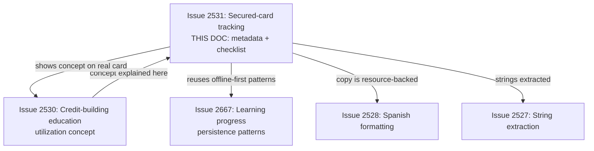
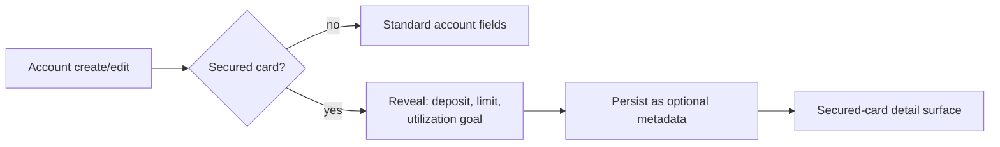
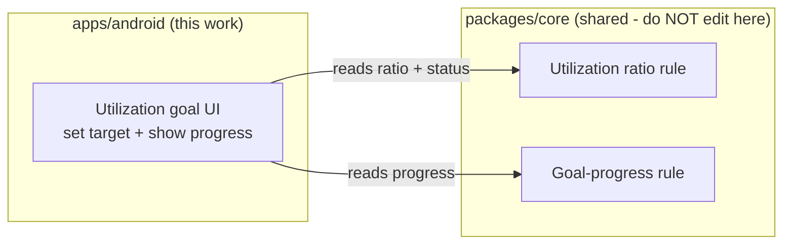
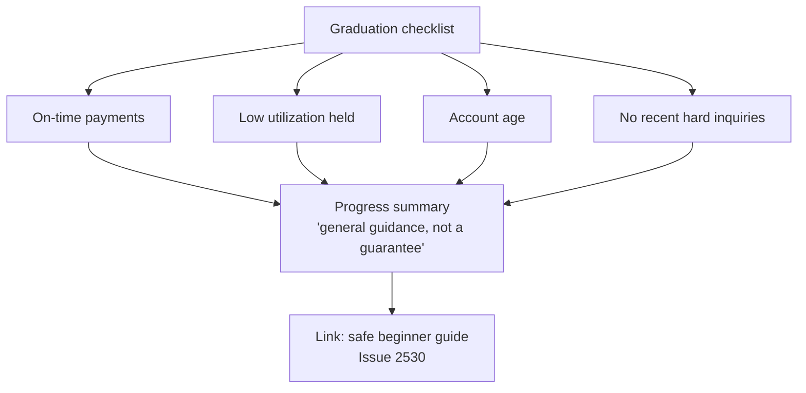
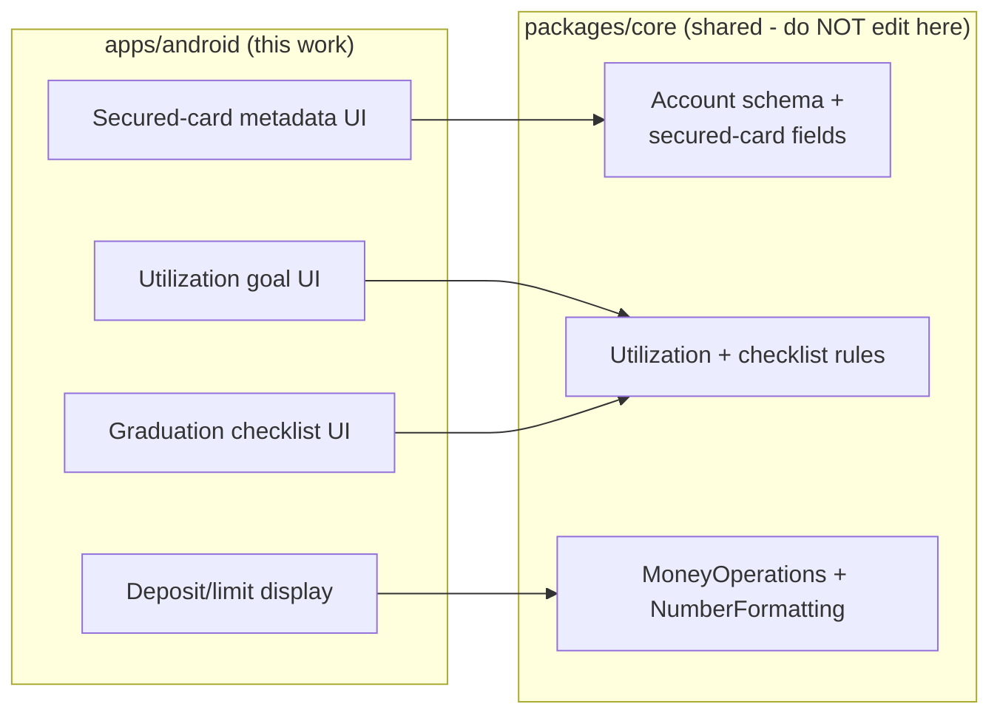

# Android Secured-Card Tracking and Checklist

> **Status:** PROPOSED — Pending human review
> **Issue:** [#2531](https://github.com/jrmoulckers/finance/issues/2531) · Part of [#2174](https://github.com/jrmoulckers/finance/issues/2174)
> **Platform:** Android (Compose account surfaces, checklist)
> **Last Updated:** 2026-06-22
> **Design only:** Native implementation remains blocked by [#1242](https://github.com/jrmoulckers/finance/issues/1242)

---

## Table of Contents

1. [Purpose](#purpose)
2. [Persona and Why This Matters](#persona-and-why-this-matters)
3. [Goals and Non-Goals](#goals-and-non-goals)
4. [Scope Boundaries With Sibling Work](#scope-boundaries-with-sibling-work)
5. [Secured-Card Account Metadata](#secured-card-account-metadata)
6. [Deposit and Limit Display](#deposit-and-limit-display)
7. [Utilization Goals](#utilization-goals)
8. [Graduation Checklist](#graduation-checklist)
9. [Content Model and KMP Boundary](#content-model-and-kmp-boundary)
10. [Estimates, Sensitivity, and Tone](#estimates-sensitivity-and-tone)
11. [Localization and Text Expansion](#localization-and-text-expansion)
12. [Accessibility Considerations](#accessibility-considerations)
13. [Offline, Empty, and Error States](#offline-empty-and-error-states)
14. [Test Plan](#test-plan)
15. [Implementation Readiness](#implementation-readiness)
16. [References](#references)

---

## Purpose

A secured credit card is the most common first rung for someone building credit
from zero: the user puts down a refundable deposit that usually equals the credit
limit, uses the card responsibly, and eventually "graduates" to an unsecured card
or gets the deposit back. The app today models generic accounts
([`AccountsScreen.kt`](../../apps/android/src/main/kotlin/com/finance/android/ui/screens/AccountsScreen.kt),
[`AccountRepository.kt`](../../apps/android/src/main/kotlin/com/finance/android/data/repository/AccountRepository.kt))
but has **no concept of a secured card** — no deposit, no limit relationship, no
utilization goal, and no graduation milestones.

This document designs the Compose surfaces for **secured-card tracking**: optional
account metadata (deposit, limit, secured flag), a clear deposit/limit display, a
utilization goal, and a **graduation checklist**. It is **design and breakdown
only** while [#1242](https://github.com/jrmoulckers/finance/issues/1242) gates store
distribution. It tracks and explains; it never gives credit advice and never owns
finance math — utilization and goal rules live in KMP `packages/core`.

---

## Persona and Why This Matters

The persona ([#2174](https://github.com/jrmoulckers/finance/issues/2174)): a
newcomer to US credit using a secured card as their on-ramp. They want to _see_
that keeping the balance low matters, and to know **what milestones lead to
graduation** — without scary jargon, fee traps, or shame. This pairs directly with
the credit-building education path
([android-credit-building-education.md](android-credit-building-education.md)): the
utilization module explains the concept, and this surface shows it on the user's
own card. It also aligns with [Persona 4: Casey](personas.md) on plain language and
low cognitive load.

> **Important framing:** this is **tracking + financial _education_**, not credit,
> legal, or financial _advice_. Utilization figures and "graduation readiness" are
> labelled **estimates / general guidance**, never a guarantee that an issuer will
> upgrade the card. See [Estimates, Sensitivity, and Tone](#estimates-sensitivity-and-tone).

---

## Goals and Non-Goals

**Goals**

- Optional **secured-card metadata** on an account: a `secured` flag, refundable
  **deposit** amount, and **credit limit** (often equal to the deposit).
- A clear **deposit/limit display** that explains the deposit↔limit relationship in
  plain language.
- A **utilization goal** the user can set (e.g. "keep usage under a target
  percentage"), rendered from shared state with progress framed as an estimate.
- A **graduation checklist** of educational, non-binding milestones (on-time
  payments, low utilization, account age) with progress and clear "this is general
  guidance" copy.

**Non-Goals**

- Connecting to a real card issuer, reading a real limit/balance from a bureau, or
  predicting an actual graduation/upgrade decision.
- Computing utilization or goal/checklist progress in Compose — those rules live in
  KMP `packages/core`; the UI renders the result.
- Tax, legal, immigration, or credit _advice_ of any kind.
- Editing KMP `packages/*`, the shared account schema, or any non-Android platform.
- The credit _concept_ explainers themselves (owned by
  [android-credit-building-education.md](android-credit-building-education.md)).

---

## Scope Boundaries With Sibling Work

This doc owns **only** the secured-card account surface and the graduation
checklist UI. The "what is utilization" teaching lives in the credit-building
education path; this surface links to it.

---

## Secured-Card Account Metadata

Secured-card fields are **optional, additive metadata** layered onto an account.
They never change how non-secured accounts behave.

| Field             | Type (conceptual)     | Notes                                                         |
| ----------------- | --------------------- | ------------------------------------------------------------- |
| `isSecured`       | boolean (optional)    | Marks the account as a secured card; default off.             |
| `depositAmount`   | money (optional)      | Refundable security deposit; rendered via shared formatting.  |
| `creditLimit`     | money (optional)      | The card's limit; often equals the deposit.                   |
| `utilizationGoal` | percentage (optional) | User-set target (e.g. "under 30%"); a goal, not a prediction. |
| `openedDate`      | date (optional)       | Used to surface account-age milestone context.                |

- The secured fields appear only when the user marks the account secured; they are
  editable later from the same surfaces
  ([`AccountEditScreen.kt`](../../apps/android/src/main/kotlin/com/finance/android/ui/screens/AccountEditScreen.kt)
  is the read-only boundary reference).
- The **shared account schema is owned by @native-app-engineer**; this doc only describes
  the Android-side rendering and the metadata it expects to read from shared state.

---

## Deposit and Limit Display

Newcomers are frequently confused that the deposit _is_ (usually) the limit. The
display makes the relationship explicit and reassuring.

- Show deposit and limit side by side with a one-line plain-language explainer:
  "Your deposit is refundable and usually sets your credit limit."
- All monetary values render through shared formatting
  ([`MoneyOperations.kt`](../../packages/core/src/commonMain/kotlin/com/finance/core/money/MoneyOperations.kt),
  [`NumberFormatting.kt`](../../packages/core/src/commonMain/kotlin/com/finance/core/i18n/NumberFormatting.kt)) —
  never formatted ad hoc in Compose.
- If deposit and limit differ, show both without judgment; do not imply one is
  "wrong".

---

## Utilization Goals

Utilization = balance ÷ limit. The **calculation lives in KMP `packages/core`**;
Compose renders the shared result and the user's chosen goal.

- The user sets a target (default suggestion framed as **general guidance**, e.g.
  "many people aim to keep usage low"); the UI never claims a specific number
  guarantees a score change.
- Progress is shown with a labelled **estimate** ("estimated utilization") plus a
  non-color cue (text/icon), and links to the utilization education module in
  [android-credit-building-education.md](android-credit-building-education.md).

---

## Graduation Checklist

The checklist is a set of **educational, non-binding milestones** that commonly
precede graduating from a secured to an unsecured card. It tracks habits; it does
**not** predict or promise an issuer's decision.

| Milestone (illustrative)       | What it tracks                                       | Framing                                  |
| ------------------------------ | ---------------------------------------------------- | ---------------------------------------- |
| On-time payments               | A streak of payments made on time.                   | "Helps build history" — general guidance |
| Low utilization held           | Utilization kept under the user's goal over time.    | Estimate, links to utilization module    |
| Account age                    | How long the card has been open.                     | Context only, from `openedDate`          |
| No new hard inquiries (recent) | Whether the user reports no recent new applications. | Self-reported, educational               |

- Checklist progress is computed from **shared rules in KMP `packages/core`**; the
  Compose checklist renders booleans/progress it is given.
- Every checklist surface repeats the **"this is general guidance, not a guarantee
  of graduation or credit advice"** disclaimer.
- Completing the checklist celebrates the _habits_, not a promised outcome.

---

## Content Model and KMP Boundary

- **All finance math and eligibility-style logic stay in KMP `packages/core`.**
  Compose renders shared state — it never computes utilization, goal progress, or
  checklist completion locally.
- Labels/titles → Android string resources (localizable via
  [#2527](android-string-resource-migration-audit.md) /
  [#2528](android-spanish-education-formatting.md)).
- Monetary and percentage values → shared formatting only.

> This document **describes** the boundary. It does not implement KMP or schema
> changes — `packages/core` is owned by @native-app-engineer.

---

## Estimates, Sensitivity, and Tone

- **No advice framing.** Utilization status and graduation readiness are labelled
  **estimates / general guidance**, never financial or credit advice, and never a
  promise an issuer will upgrade the card.
- **Never log sensitive data.** Deposit, limit, balance, and utilization values are
  sensitive financial data; do not log them through Timber — calls must omit them.
- **Inclusive, non-judgmental tone** per
  [content-language-guidelines.md](content-language-guidelines.md): a secured card
  is a normal, smart on-ramp, not a sign of failure; avoid shame language.
- **No dark patterns / fee-trap awareness.** No urgency, no "spend to graduate
  faster" nudges; the safe beginner guidance in #2530 warns about fee traps.

---

## Localization and Text Expansion

- All labels, explainers, and checklist copy are **resource-backed and
  translatable**, feeding Spanish coverage
  ([#2528](android-spanish-education-formatting.md)). Expect **25–30%+ expansion**
  on terms like "refundable security deposit" and "credit utilization"; design
  cards and checklist rows to wrap, never clip.
- Currency and percentage rendering follows shared locale-aware formatting.
- Validate under `en-XA` and at `2.0x` font scale; verify RTL with `ar-XB`.

---

## Accessibility Considerations

- **TalkBack:** every metadata field, the deposit/limit pair, the utilization goal
  control, and each checklist row carry a meaningful `contentDescription`. The
  deposit/limit relationship is announced as a sentence, not two bare numbers.
  Estimate labels are spoken ("estimated utilization").
- **Switch Access:** the secured toggle, goal control, and checklist items are
  reachable and operable with adequate (≥ 48dp) touch targets.
- **Font scaling:** deposit/limit, goal, and checklist text stay readable and
  unclipped at **200%** font scale; no fixed-height containers.
- **Non-color cues:** utilization "good/caution" and checklist done/not-done use
  text + icon, never color alone.
- **Plain language / cognitive load:** one idea per row, aligned with
  [cognitive-accessibility.md](cognitive-accessibility.md).
- See [accessibility-patterns.md](accessibility-patterns.md) for the underlying
  patterns.

---

## Offline, Empty, and Error States

- **Offline:** secured-card metadata and the checklist are **local-first** — the
  user can view and edit deposit/limit/goal and see checklist progress fully
  offline. Nothing in this surface requires a network call.
- **Empty:** before the user marks an account secured (or sets a goal), show a
  helpful empty state explaining what a secured card is and inviting setup —
  never a blank panel. A checklist with no milestones yet shows "track your
  progress here".
- **Error:** if metadata fails to persist, **fail safe** — never block account
  editing; retry silently and surface a calm, non-judgmental message. Never show a
  graduation outcome as if it were guaranteed.

---

## Test Plan

| Layer              | Tooling                         | What it verifies                                                                       |
| ------------------ | ------------------------------- | -------------------------------------------------------------------------------------- |
| Unit               | JUnit                           | Secured fields are optional/additive; non-secured accounts are unaffected.             |
| Unit (boundary)    | JUnit                           | UI reads utilization/checklist results from shared state; no local finance math.       |
| Compose UI         | `createComposeRule` + semantics | Deposit/limit, goal, and checklist text + `contentDescription` resolve from resources. |
| Snapshot           | Paparazzi                       | Secured-card detail + checklist at `{en, en-XA, es}` × `{1x, 2x}`, empty + populated.  |
| Pseudolocalization | `en-XA` / `ar-XB`               | Expansion + mirroring for deposit/limit/checklist copy.                                |
| Accessibility      | Espresso/Accessibility checks   | TalkBack order, Switch Access reachability, touch targets ≥ 48dp, non-color cues.      |
| Behavior           | Espresso                        | Estimate/guidance disclaimers present; no "guaranteed graduation" claims; fail-safe.   |

---

## Implementation Readiness

This is a design artifact. Execution splits into a **buildable-now** tier and a
**Play-distribution tail** gated by
[#1242](https://github.com/jrmoulckers/finance/issues/1242). See
[../ops/human-gated-prerequisites.md](../ops/human-gated-prerequisites.md) and
[../ops/launch-readiness-plan.md](../ops/launch-readiness-plan.md).

**Buildable now — `assembleDebug` + sideload (no human gate):**

- Render optional secured-card metadata, deposit/limit display, utilization goal,
  and graduation checklist from shared state (mock/stub repository as needed).
- Wire utilization and checklist progress to shared KMP rules (render-only).
- Verify offline editing, accessibility, and pseudolocale/expansion snapshots on a
  debug build / emulator.

**Play-distribution tail — human-gated by [#1242](https://github.com/jrmoulckers/finance/issues/1242):**

- Production signing + Play Console listing.
- Any store-level data-safety declaration referencing the optional financial
  metadata.
- Staged rollout / internal testing track.

Everything in the buildable-now tier runs on an emulator with **no signing, store
credentials, or human-gated operations**. The shared account-schema additions are
coordinated with @native-app-engineer and are not implemented in this Android-only doc.

---

## References

**Design docs**

- [android-credit-building-education.md](android-credit-building-education.md) — credit concepts incl. utilization (#2530)
- [android-newcomer-us-finance-education.md](android-newcomer-us-finance-education.md) — sibling newcomer education (#2535)
- [android-itin-onboarding-profile.md](android-itin-onboarding-profile.md) — onboarding profile capture (#2532)
- [android-learning-progress-persistence.md](android-learning-progress-persistence.md) — offline-first persistence patterns (#2667)
- [android-string-resource-migration-audit.md](android-string-resource-migration-audit.md) — string extraction + lint (#2527)
- [android-spanish-education-formatting.md](android-spanish-education-formatting.md) — Spanish coverage (#2528)
- [content-language-guidelines.md](content-language-guidelines.md) — non-judgmental, inclusive copy
- [accessibility-patterns.md](accessibility-patterns.md) — screen reader, focus, touch targets
- [cognitive-accessibility.md](cognitive-accessibility.md) — plain-language and load reduction
- [component-library.md](component-library.md) — card/list/checklist component patterns
- [data-model.md](data-model.md) — data-model conventions
- [personas.md](personas.md) — Persona 4 (Casey)

**Ops**

- [../ops/human-gated-prerequisites.md](../ops/human-gated-prerequisites.md) — buildable-now vs. gated split
- [../ops/launch-readiness-plan.md](../ops/launch-readiness-plan.md) — launch checklist

**Android / KMP (read-only boundary)**

- [`AccountsScreen.kt`](../../apps/android/src/main/kotlin/com/finance/android/ui/screens/AccountsScreen.kt) — existing accounts surface
- [`AccountEditScreen.kt`](../../apps/android/src/main/kotlin/com/finance/android/ui/screens/AccountEditScreen.kt) — existing account edit surface
- [`AccountRepository.kt`](../../apps/android/src/main/kotlin/com/finance/android/data/repository/AccountRepository.kt) — existing account repository
- [`MoneyOperations.kt`](../../packages/core/src/commonMain/kotlin/com/finance/core/money/MoneyOperations.kt) — shared money math (owned by @native-app-engineer)
- [`NumberFormatting.kt`](../../packages/core/src/commonMain/kotlin/com/finance/core/i18n/NumberFormatting.kt) — shared formatting (owned by @native-app-engineer)

**Issues**

- [#2531](https://github.com/jrmoulckers/finance/issues/2531) — this issue
- [#2174](https://github.com/jrmoulckers/finance/issues/2174) — parent (credit education + secured-card support)
- [#1242](https://github.com/jrmoulckers/finance/issues/1242) — Play Console + keystore (gate)
