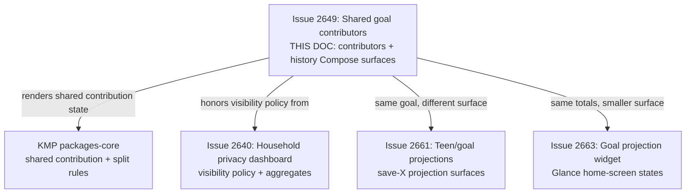
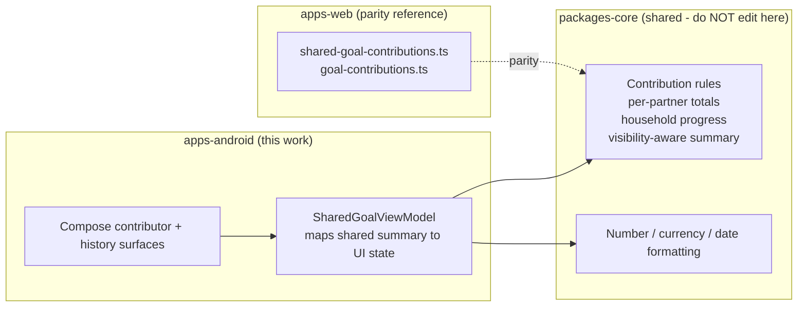
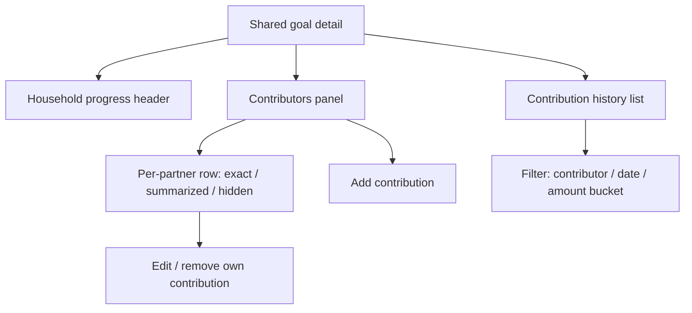

# Android Shared Goal Contributors & Contribution History

> **Status:** PROPOSED — Pending human review
> **Issue:** [#2649](https://github.com/jrmoulckers/finance/issues/2649) · Part of [#2147](https://github.com/jrmoulckers/finance/issues/2147)
> **Platform:** Android (Jetpack Compose, Material 3)
> **Last Updated:** 2026-06-22
> **Design only:** Native implementation remains blocked by [#1242](https://github.com/jrmoulckers/finance/issues/1242)

---

## Table of Contents

1. [Purpose](#purpose)
2. [Persona and Why This Matters](#persona-and-why-this-matters)
3. [Goals and Non-Goals](#goals-and-non-goals)
4. [Scope Boundaries With Sibling Work](#scope-boundaries-with-sibling-work)
5. [Contribution Math Lives in KMP](#contribution-math-lives-in-kmp)
6. [Privacy: Exact Amount vs. Summarized Effort](#privacy-exact-amount-vs-summarized-effort)
7. [Compose Surfaces](#compose-surfaces)
8. [Add / Edit Contribution UX](#add--edit-contribution-ux)
9. [Contribution History and Filtering](#contribution-history-and-filtering)
10. [Plain-Language Copy](#plain-language-copy)
11. [Accessibility Considerations](#accessibility-considerations)
12. [Offline, Empty, and Error States](#offline-empty-and-error-states)
13. [Test Plan](#test-plan)
14. [Implementation Readiness](#implementation-readiness)
15. [References](#references)

---

## Purpose

When two partners save toward the same goal — a vacation, a shared emergency
buffer, a new couch — each person wants to see **household progress** _and_ a
fair, honest picture of **who has put in what**, without that turning into
surveillance. This document designs the Android Compose surfaces for **shared
goal contributors** and **contribution history**: household total progress,
per-partner contribution progress, an add/edit contribution flow, history
filtering, and the privacy controls that decide whether a contribution shows as
an **exact amount** or as **summarized effort**.

It is **design and breakdown only** while
[#1242](https://github.com/jrmoulckers/finance/issues/1242) gates Google Play
distribution. No Kotlin is written here, and no split/contribution business rules
are implemented in Compose — that logic is a **shared KMP concern**, with the web
`shared-goal-contributions` engine as the parity reference.

---

## Persona and Why This Matters

The persona ([#2147](https://github.com/jrmoulckers/finance/issues/2147)): a
couple or household sharing financial goals under a "yours, mine, ours" model.
They want to feel like a team, not auditors. The product's job is to celebrate
**household momentum** first, surface **per-partner contribution** in a way each
person has consented to, and never weaponize the numbers. This intersects with
[Persona 3 (household / couples)](personas.md) and the privacy foundation in
[android-household-privacy-dashboard.md](android-household-privacy-dashboard.md).

> **Important framing:** progress figures, projected completion dates, and any
> "fair share" suggestion are **estimates**, visibly labelled as such. They
> describe the household's own goal; they are never financial advice or a verdict
> on a partner.

---

## Goals and Non-Goals

**Goals**

- Render **household total progress** and **per-partner contribution progress**
  for a shared goal, as a pure renderer of shared state.
- Define an **add / edit contribution** flow that attributes a contribution to a
  contributor without baking split math into Compose.
- Provide **contribution history** with filtering (by contributor, by date
  range, by amount bucket) and clear empty/loading states.
- Make the **visibility choice** — exact contribution amounts vs. summarized
  effort — first-class, per-partner, and respected on both partners' devices.
- Keep parity with the web shared-goal-contribution surface so both platforms
  agree on totals, attribution, and rounding.

**Non-Goals**

- Implementing or editing the contribution/split math (lives in KMP
  `packages/core`; the web engine is the parity reference — see
  [Contribution Math Lives in KMP](#contribution-math-lives-in-kmp)).
- Defining the household privacy/RBAC model itself — owned by
  [android-household-privacy-dashboard.md](android-household-privacy-dashboard.md)
  and the shared partition layer; this doc **consumes** those rules.
- The save-$X projection surfaces and home-screen widget — owned by
  [android-teen-goal-projections.md](android-teen-goal-projections.md) and
  [android-goal-projection-widget.md](android-goal-projection-widget.md).
- Editing KMP `packages/*`, web, or any non-Android platform.

---

## Scope Boundaries With Sibling Work

This doc owns the **in-app contributor breakdown and history** for a shared goal.
The privacy dashboard owns _what each partner is allowed to see_; this surface
**asks** that policy and renders accordingly. Projection and widget docs render
the same goal totals on other surfaces.

---

## Contribution Math Lives in KMP

Attribution, per-partner totals, and any "fair share" suggestion are **business
logic** and must be shared, not duplicated in Compose. The web reference already
exists as
[`shared-goal-contributions.ts`](../../apps/web/src/lib/savings/shared-goal-contributions.ts)
and [`goal-contributions.ts`](../../apps/web/src/lib/household/goal-contributions.ts),
which derive per-contributor totals, household progress, and a visibility-aware
summary. The Android client consumes an **equivalent shared model from KMP
`packages/core`** so both platforms agree on every number.

> This document **describes** the boundary. It does **not** implement KMP changes
> — `packages/core` is owned by @kmp-engineer and the web engine by @web-engineer.
> Compose is a pure renderer of shared state. The existing
> [`Goal`](../../packages/models/src/commonMain/kotlin/com/finance/models/Goal.kt)
> model already carries `householdId`, `ownerId`, and `currentAmount`; those are
> the baseline inputs a shared contribution model needs. Per the issue, **do not
> bake split logic into UI-only code** — Compose renders the shared summary, it
> does not compute it.

---

## Privacy: Exact Amount vs. Summarized Effort

The acceptance criteria require documenting **visibility choices for exact
contribution amounts vs. summarized effort**. Each partner controls how their own
contributions appear to the other; the rendering is decided by the shared
visibility policy, not by Compose.

| Visibility mode       | What the partner sees                                   | When to default to it                           |
| --------------------- | ------------------------------------------------------- | ----------------------------------------------- |
| **Exact amounts**     | "Alex contributed $120 on Jun 3"                        | Both partners opted into full transparency      |
| **Summarized effort** | "Alex contributed — about a third of this month"        | One partner prefers privacy on exact figures    |
| **Household only**    | Only the combined total shows; no per-partner breakdown | Either partner has not consented to attribution |

**Privacy rules**

- The **stricter** of the two partners' choices wins for any given pair — consent
  is mutual, never assumed (consistent with
  [android-household-privacy-dashboard.md](android-household-privacy-dashboard.md)).
- A summarized view shows **relative effort** (share of the period, a coarse
  bucket, or a progress proportion), never a recoverable exact figure.
- The viewer always sees **their own** contributions in full; the policy only
  governs what they see of the _other_ partner.
- Compose never decides visibility locally — it renders the
  `visibility`-tagged summary returned by the shared layer. If the policy says
  "household only," the per-partner rows are simply absent from the model.

---

## Compose Surfaces

Three Compose surfaces, all pure renderers of shared state, slotting into the
existing
[`GoalsScreen`](../../apps/android/src/main/kotlin/com/finance/android/ui/screens/GoalsScreen.kt)
and the goal-detail flow:

1. **Household progress header** — the combined total ("$1,840 of $3,000 saved")
   and a progress indicator for the whole goal.
2. **Contributors panel** — a row per contributor showing that partner's progress
   _as permitted by the visibility policy_ (exact, summarized, or hidden).
3. **Contribution history list** — a chronological, filterable list of
   contributions with attribution rendered per the same policy.

Progress visuals follow [data-visualization.md](data-visualization.md) and the
progress/ring guidance in [chart-component-specs.md](chart-component-specs.md);
they never rely on color alone (see [Accessibility](#accessibility-considerations)).
Layout and list components reuse [component-library.md](component-library.md).

---

## Add / Edit Contribution UX

A contribution records that a contributor moved money toward the goal. The flow is
a Material 3 bottom sheet launched from the contributors panel or goal detail.

- **Add:** amount, contributor (defaults to the current user; choosing another
  partner is only offered when the shared layer permits attribution), optional
  date and note. The sheet shows a live "new household total" preview that is read
  back from the shared summary, not computed in Compose.
- **Edit / remove:** a partner can edit or remove **their own** contributions.
  Editing another partner's contribution is gated by the shared permission model,
  never by a Compose-side check alone.
- **Validation** (positive amount, valid date, contributor membership) is surfaced
  inline, but the authoritative rule set lives in the shared layer; Compose mirrors
  its result.
- **Confirmation:** removing a contribution asks for confirmation and explains the
  effect ("This lowers the household total by $120"), reusing the non-destructive
  patterns in [content-language-guidelines.md](content-language-guidelines.md).

> The "new household total" preview is an **estimate** until the contribution is
> persisted and synced; label it as a preview, not a committed balance.

---

## Contribution History and Filtering

The history list answers "where did our progress come from?" without becoming a
ledger to police a partner.

| Filter        | Options                                         | Notes                                                       |
| ------------- | ----------------------------------------------- | ----------------------------------------------------------- |
| Contributor   | All · This partner · Other partner(s)           | "Other partner" rows respect the visibility policy          |
| Date range    | This month · Last 3 months · This year · Custom | Custom uses the shared date formatting                      |
| Amount bucket | Any · Small · Medium · Large (coarse buckets)   | Buckets, not exact thresholds, support summarized-effort UX |

- When visibility is **summarized** or **household only**, history rows for the
  other partner collapse to effort language ("Alex contributed — about a third of
  June") rather than exact lines.
- Filtering operates on the **shared, already-permission-filtered** dataset — the
  client never reconstructs hidden amounts from totals.
- The list is paged and renders the most recent contributions first; older entries
  load on demand to keep the surface responsive.

---

## Plain-Language Copy

Copy is part of the product here. Every string below is a placeholder for a
localized, resource-backed string and follows
[content-language-guidelines.md](content-language-guidelines.md).

| Context                | Plain-language copy (example)                          |
| ---------------------- | ------------------------------------------------------ |
| Household progress     | "$1,840 of $3,000 saved together"                      |
| Exact contributor row  | "Alex contributed $120"                                |
| Summarized contributor | "Alex contributed — about a third this month"          |
| Household-only mode    | "Per-partner breakdown is private for this goal"       |
| Add success            | "Added. You're $120 closer together"                   |
| Empty history          | "No contributions yet — add the first one"             |
| Behind-but-encouraging | "A bit behind plan — every contribution still adds up" |

**Copy rules**

- Lead with **shared progress and teamwork**, not with comparison between partners.
- Never frame one partner's smaller contribution as a deficiency; uneven incomes
  are normal (see the catch-up tone in
  [android-house-downpayment-planner.md](android-house-downpayment-planner.md)).
- Pair any projected total or "fair share" hint with "about"/"around" or an
  explicit estimate label.

---

## Accessibility Considerations

- **TalkBack:** the household progress header exposes one cohesive
  `contentDescription` ("Saved $1,840 of $3,000 together, 61 percent"). Each
  contributor row carries its own label reflecting the visibility mode ("Alex
  contributed about a third this month"), and never leaks an exact figure that the
  policy hides. The add-contribution sheet announces the live total preview as an
  estimate.
- **Switch Access:** the add button, per-row edit affordances, and every filter
  control are reachable and operable with touch targets ≥ 48dp.
- **Font scaling:** contributor rows, currency, and history entries stay readable
  and unclipped at **200%** font scale; no fixed-height rows around amounts.
- **Non-color cues:** progress and contributor share are conveyed with text and
  shape, never color alone, per [data-visualization.md](data-visualization.md).
- **Plain language / cognitive load:** one number per row, teamwork-first framing,
  aligned with [cognitive-accessibility.md](cognitive-accessibility.md).
- See [accessibility-patterns.md](accessibility-patterns.md) for the underlying
  screen-reader, focus, and touch-target patterns.

---

## Offline, Empty, and Error States

- **Offline:** contributor totals and history render from already-synced data, so
  the surface works fully **offline** using the last-known shared summary. New
  contributions queue and sync later; the header shows the data's freshness rather
  than blocking.
- **Empty (no contributions):** show a friendly empty state inviting the first
  contribution ("Start your shared progress — add the first contribution"), not a
  blank panel.
- **Empty (household-only privacy):** the contributors panel cleanly states that
  the per-partner breakdown is private for this goal, instead of showing blank
  rows.
- **Conflict:** if two partners edit overlapping contributions offline, defer to
  the shared `ConflictStrategy.resolverFor()` outcome and show a quiet "updated
  from your partner's device" note; Compose never invents a merge.
- **Error:** if the shared summary cannot be produced, fail safe to the raw
  household total ("$1,840 of $3,000 saved") with a quiet "Breakdown unavailable
  right now" — never a stack trace, never a blank screen.

---

## Test Plan

| Layer              | Tooling                         | What it verifies                                                                                     |
| ------------------ | ------------------------------- | ---------------------------------------------------------------------------------------------------- |
| Unit               | JUnit                           | ViewModel maps shared summary → UI state for exact / summarized / household-only modes.              |
| Unit (privacy)     | JUnit                           | Hidden amounts are never reconstructable from totals; stricter partner choice wins.                  |
| Unit (safety)      | JUnit                           | No Timber call logs contributor names, amounts, or goal balances.                                    |
| Compose UI         | `createComposeRule` + semantics | Header, contributor rows, add sheet, and filters resolve `contentDescription`.                       |
| Compose UI         | `createComposeRule`             | Add/edit contribution updates the previewed household total; remove confirms first.                  |
| Snapshot           | Paparazzi                       | Contributors panel + history in exact / summarized / household-only + empty at {1x, 2x}, light/dark. |
| Pseudolocalization | `en-XA` / `ar-XB`               | Copy expansion and RTL mirroring for progress and contributor rows.                                  |
| Accessibility      | Espresso/Accessibility checks   | TalkBack order, Switch Access reachability, touch targets ≥ 48dp.                                    |

---

## Implementation Readiness

This is a design artifact. Execution splits into a **buildable-now** tier and a
**Play-distribution tail** gated by
[#1242](https://github.com/jrmoulckers/finance/issues/1242). See
[../ops/human-gated-prerequisites.md](../ops/human-gated-prerequisites.md) and
[../ops/launch-readiness-plan.md](../ops/launch-readiness-plan.md).

**Buildable now — `assembleDebug` + sideload (no human gate):**

- Build the household progress header, contributors panel, add/edit sheet, and
  filterable history as Compose surfaces rendering a shared contribution summary
  (mock/in-memory data while KMP wiring lands).
- Verify exact / summarized / household-only visibility rendering, accessibility,
  and pseudolocale/expansion snapshots on a debug build / emulator.
- All of this runs on an emulator with **no signing, store credentials, or
  human-gated operations**.

**Play-distribution tail — human-gated by [#1242](https://github.com/jrmoulckers/finance/issues/1242):**

- Production signing + Play Console listing.
- Any store-level data-safety declaration touching shared/household financial data.
- Staged rollout / internal testing track.

The shared contribution model is delivered by KMP `packages/core` (the web
`shared-goal-contributions` engine is the parity reference); Compose stays
render-only.

---

## References

**Design docs**

- [android-household-privacy-dashboard.md](android-household-privacy-dashboard.md) — visibility policy & aggregates (#2640)
- [android-teen-goal-projections.md](android-teen-goal-projections.md) — save-$X projection surfaces (#2661)
- [android-goal-projection-widget.md](android-goal-projection-widget.md) — home-screen widget states (#2663)
- [android-house-downpayment-planner.md](android-house-downpayment-planner.md) — sibling shared-goal planner (#2650)
- [content-language-guidelines.md](content-language-guidelines.md) — non-judgmental, plain copy
- [cognitive-accessibility.md](cognitive-accessibility.md) — plain-language and load reduction
- [accessibility-patterns.md](accessibility-patterns.md) — screen reader, focus, touch targets
- [data-visualization.md](data-visualization.md) — progress visuals, non-color cues
- [chart-component-specs.md](chart-component-specs.md) — progress ring/bar specs
- [component-library.md](component-library.md) — list, sheet, and card components
- [information-architecture.md](information-architecture.md) — surface and navigation map
- [ux-principles.md](ux-principles.md) — product UX principles
- [personas.md](personas.md) — household / couples persona

**Ops**

- [../ops/human-gated-prerequisites.md](../ops/human-gated-prerequisites.md) — buildable-now vs. gated split
- [../ops/launch-readiness-plan.md](../ops/launch-readiness-plan.md) — launch checklist

**Android / web / KMP (read-only boundary)**

- [`shared-goal-contributions.ts`](../../apps/web/src/lib/savings/shared-goal-contributions.ts) — web parity reference (owned by @web-engineer)
- [`goal-contributions.ts`](../../apps/web/src/lib/household/goal-contributions.ts) — household contribution rules
- [`GoalContributionDialog.tsx`](../../apps/web/src/components/goals/GoalContributionDialog.tsx) — web add/edit parity
- [`GoalDetailPage.tsx`](../../apps/web/src/pages/GoalDetailPage.tsx) — web goal detail parity
- [`GoalsScreen.kt`](../../apps/android/src/main/kotlin/com/finance/android/ui/screens/GoalsScreen.kt) — host surface
- [`Goal.kt`](../../packages/models/src/commonMain/kotlin/com/finance/models/Goal.kt) — shared goal model (owned by @kmp-engineer)
- [`Household.kt`](../../packages/models/src/commonMain/kotlin/com/finance/models/Household.kt) — household model
- [`HouseholdMember.kt`](../../packages/models/src/commonMain/kotlin/com/finance/models/HouseholdMember.kt) — member/contributor model
- [`DataPartitioning.kt`](../../packages/core/src/commonMain/kotlin/com/finance/core/household/DataPartitioning.kt) — shared visibility/partition rules

**Issues**

- [#2649](https://github.com/jrmoulckers/finance/issues/2649) — this issue
- [#2147](https://github.com/jrmoulckers/finance/issues/2147) — parent (shared goals cluster)
- [#1242](https://github.com/jrmoulckers/finance/issues/1242) — Play Console + keystore (gate)
