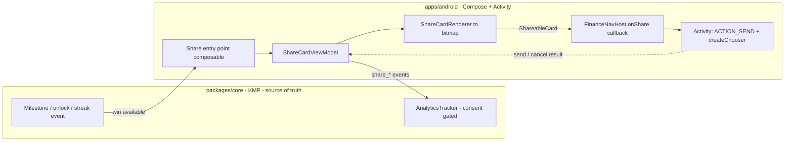
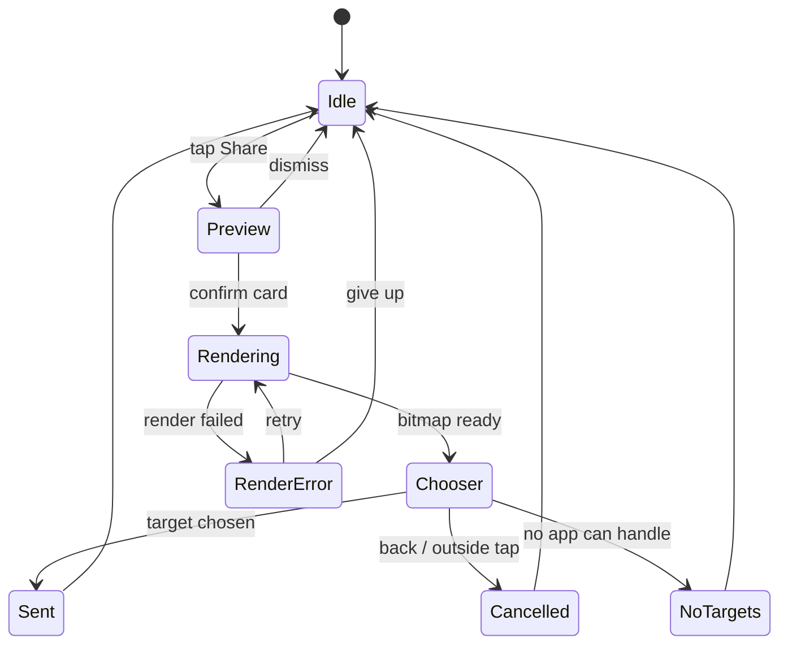
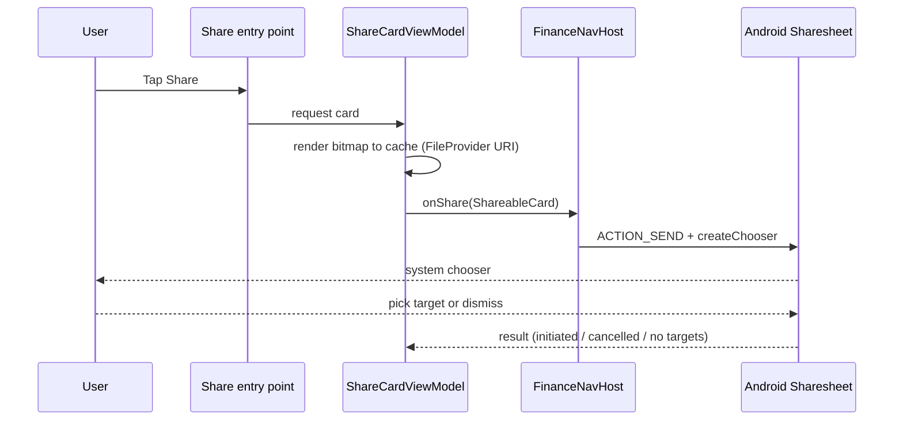

# Android Sharesheet Entry Points for Wins & Badges — Design

> **Status:** DESIGN — Implementation-ready (native build/test unblocked; store distribution gated by [#1242](https://github.com/jrmoulckers/finance/issues/1242))
> **Issue:** [#2684](https://github.com/jrmoulckers/finance/issues/2684) — _Part of [#2210](https://github.com/jrmoulckers/finance/issues/2210)_ (gamification sharing)
> **Platform:** Android (Jetpack Compose · Material 3)
> **Last Updated:** 2026-06-22

This document specifies the **entry points and flows** for sharing savings wins
and badges from goals and gamification screens, and the **Android Sharesheet
handoff** (`Intent.ACTION_SEND` via the system chooser). It covers **25/50/75/100%
goal milestones, goal completion, badge unlocks, and streak milestones**, plus
**cancellation, retry, and unsupported-app** handling and **privacy-safe
telemetry**.

The card _artwork_ and its **redaction rules** are owned by
[android-privacy-safe-share-cards.md](./android-privacy-safe-share-cards.md). This
doc is about **where the "Share" affordance appears and what happens after the
user taps it** — it never re-derives financial figures and never shares an
un-redacted card.

---

## Table of Contents

1. [Goals & Non-Goals](#1-goals--non-goals)
2. [Architecture Boundary (Compose ↔ KMP)](#2-architecture-boundary-compose--kmp)
3. [Grounding in Existing Code](#3-grounding-in-existing-code)
4. [Entry Points](#4-entry-points)
5. [Flow Overview](#5-flow-overview)
6. [Sharesheet Plumbing](#6-sharesheet-plumbing)
7. [Cancellation, Retry & Unsupported-App Handling](#7-cancellation-retry--unsupported-app-handling)
8. [Telemetry](#8-telemetry)
9. [Accessibility (TalkBack, Switch Access, Font Scaling, Reduced Motion)](#9-accessibility-talkback-switch-access-font-scaling-reduced-motion)
10. [Offline, Empty & Error States](#10-offline-empty--error-states)
11. [Test Plan](#11-test-plan)
12. [Implementation Readiness](#12-implementation-readiness)
13. [Open Questions](#13-open-questions)

---

## 1. Goals & Non-Goals

### Goals

- Define **share entry points** for 25/50/75/100% goal milestones, goal
  completion, badge unlocks, and streak milestones.
- Specify the **Android-native Sharesheet handoff** built on `Intent.ACTION_SEND`
  - `Intent.createChooser`, reusing the existing **ReferralScreen** pattern.
- Define **cancellation, retry, and unsupported-app** handling so a failed or
  abandoned share is graceful and never blocks the user.
- Document **privacy-safe telemetry** for share **preview, send, cancel, and
  redaction choice** — counts and enums only, never amounts.
- Keep the affordance **opt-in and unobtrusive** — celebrate, don't nag.

### Non-Goals

- **No card artwork or redaction rules.** Templates and the amount-hiding contract
  live in [android-privacy-safe-share-cards.md](./android-privacy-safe-share-cards.md).
- **No streak math or near-win copy.** That is
  [android-streak-near-win-states.md](./android-streak-near-win-states.md); this
  doc only triggers a share from an already-computed streak milestone.
- **No new shared business rules in Compose.** Milestone detection comes from
  `packages/core` (see §3); the UI only reacts to it.
- **No background or auto-sharing.** A share is always an explicit user tap; no
  WorkManager job ever opens a chooser.
- **No custom in-app share targets.** We hand off to the **system** Sharesheet —
  no bespoke contact picker or social SDK.
- **No store distribution work** (gated by #1242 — see §12).

---

## 2. Architecture Boundary (Compose ↔ KMP)

The Sharesheet handoff is **platform glue**. The decision _that_ a win occurred is
shared state; the decision _to share_ is a user tap; the act of sharing is an
Android `Intent`.

- The screen exposes an **`onShare(card: ShareableCard)` callback** — identical in
  spirit to `ReferralScreen.onShare: (String) -> Unit`, extended to carry a
  rendered image URI plus a redaction-safe text fallback.
- `FinanceNavHost` is the **only** place that touches an `Activity` `Intent`,
  replacing the existing `TODO(#1296): Wire to Android Sharesheet via Activity
intent` stubs.
- **Telemetry goes through the shared `AnalyticsTracker`**, which is consent-gated
  and contractually forbidden from transmitting PII or financial amounts.

---

## 3. Grounding in Existing Code

| Concern               | Source of truth / reference                                                                                                                                                                                                 | Today's state                                                  |
| --------------------- | --------------------------------------------------------------------------------------------------------------------------------------------------------------------------------------------------------------------------- | -------------------------------------------------------------- |
| Share callback shape  | [`ReferralScreen.onShare` + `getShareText()`](../../apps/android/src/main/kotlin/com/finance/android/ui/screens/referral/ReferralScreen.kt)                                                                                 | Exists: `onShare: (String) -> Unit` from a `FilledTonalButton` |
| Intent dispatch point | [`FinanceNavHost`](../../apps/android/src/main/kotlin/com/finance/android/ui/navigation/FinanceNavHost.kt) (`onShare` / `onShareInvite` lambdas)                                                                            | Exists with `TODO(#1296)` to wire `ACTION_SEND`                |
| Existing ACTION_SEND  | `PrivacySettingsScreen` / `SettingsScreen` (`Intent.createChooser`)                                                                                                                                                         | Exists: the app already uses the system chooser elsewhere      |
| Win detection         | [`GamificationEngine` / `AchievementUi`](../../apps/android/src/main/kotlin/com/finance/android/ui/gamification/GamificationViewModel.kt)                                                                                   | Exists: unlock + milestone + streak state                      |
| Milestone thresholds  | [`GamificationEngine.calculateSavingsMilestones`](../../packages/core/src/commonMain/kotlin/com/finance/core/gamification/GamificationEngine.kt)                                                                            | Exists: 25/50/75/100% buckets                                  |
| Telemetry transport   | [`AnalyticsTracker`](../../packages/core/src/commonMain/kotlin/com/finance/core/analytics/AnalyticsTracker.kt) + [`AnalyticsEvent`](../../packages/core/src/commonMain/kotlin/com/finance/core/analytics/AnalyticsEvent.kt) | Exists: consent-gated, "never transmit PII / amounts"          |
| Card artwork          | [android-privacy-safe-share-cards.md](./android-privacy-safe-share-cards.md)                                                                                                                                                | Designed under #2682                                           |

> The handoff **reuses** the proven ReferralScreen callback shape and the existing
> `ACTION_SEND` usage; it only adds **gamification entry points** and an image
> payload. No new financial computation is introduced.

---

## 4. Entry Points

Each entry point is a small, optional **"Share" affordance** placed next to a win.
None of them is modal or blocking.

| Entry point       | Where it lives                             | Trigger                               | Card template    |
| ----------------- | ------------------------------------------ | ------------------------------------- | ---------------- |
| 25% milestone     | Goal detail / goal projection surfaces     | Crosses 25% (debounced)               | Goal milestone   |
| 50% milestone     | Goal detail / goal projection surfaces     | Crosses 50%                           | Goal milestone   |
| 75% milestone     | Goal detail / goal projection surfaces     | Crosses 75%                           | Goal milestone   |
| 100% / completion | Goal detail + completion celebration       | Goal status COMPLETED                 | Goal completion  |
| Badge unlock      | Gamification screen + unlock toast/overlay | `AchievementUi.isUnlocked` flips true | Badge unlock     |
| Streak milestone  | Gamification streak card                   | Streak hits a milestone count         | Streak milestone |

Placement rules:

- The affordance appears as a **secondary `FilledTonalButton` / icon button** with
  an explicit `contentDescription` (mirroring the Referral "Share" button), never a
  primary CTA that competes with the financial action.
- **Milestone shares are de-duplicated**: each threshold offers a share **once**
  (the "already celebrated" flag is shared/persisted state, not a Compose
  heuristic) so re-opening a goal does not re-nag.
- See goal surfaces in
  [android-goal-projection-widget.md](./android-goal-projection-widget.md) and
  [android-shared-goal-contributors.md](./android-shared-goal-contributors.md)
  for where the goal-side buttons sit.

---

## 5. Flow Overview

- **Preview** is owned by the share-card doc (redaction toggle lives there); this
  flow begins when the user confirms the card.
- Android does **not** report which app was chosen or whether the user completed
  the send; we therefore treat reaching the chooser as `share_send_initiated` and
  record `Cancelled` only when we detect dismissal without a chooser result (§8).

---

## 6. Sharesheet Plumbing

The handoff is centralized in `FinanceNavHost` (the one place allowed to touch an
`Activity`/`Intent`), replacing the `TODO(#1296)` stubs:

- Build an `Intent(Intent.ACTION_SEND)` with `type = "image/png"`, set
  `EXTRA_STREAM` to the **FileProvider content URI** of the rendered card, and add
  a **redaction-safe `EXTRA_TEXT`** caption fallback.
- Grant read access with `FLAG_GRANT_READ_URI_PERMISSION` and attach the URI via
  **`ClipData`** so target apps inherit the grant.
- Wrap in **`Intent.createChooser(...)`** so the user always gets the system
  Sharesheet (consistent with `SettingsScreen` / `PrivacySettingsScreen`).
- Prefer **`androidx.core.app.ShareCompat.IntentBuilder`** to construct the intent
  (sets MIME, stream, and clip data correctly) over hand-rolled extras.
- The image lives in **app-internal cache** behind a configured `FileProvider`
  (no external-storage permission, no secrets on disk).
- Text-only fallback (e.g. a target that rejects images) sends the
  **redaction-safe caption** only — never an amount.

---

## 7. Cancellation, Retry & Unsupported-App Handling

| Situation                    | Detection                                 | UX response                                                           |
| ---------------------------- | ----------------------------------------- | --------------------------------------------------------------------- |
| User dismisses chooser       | Returns to app with no chooser selection  | Silently return to preview; record `share_cancelled`; no error toast  |
| No app can handle the intent | `resolveActivity == null` / empty targets | Inline message "No apps available to share" + "Copy caption" fallback |
| Bitmap render failed         | Renderer throws / returns null            | Retry affordance; never open the chooser with a missing/blank image   |
| FileProvider grant failed    | `SecurityException` on URI grant          | Fall back to **text-only** `ACTION_SEND`; log via Timber (no amounts) |
| Target rejects image MIME    | Chosen app cannot accept `image/png`      | System falls back to `EXTRA_TEXT` caption (already redaction-safe)    |
| Offline                      | n/a (handoff is local)                    | Works fully offline; the _target_ app handles its own connectivity    |

- **Retry** re-renders and re-dispatches; it never reuses a stale bitmap.
- **Give up** returns to Idle with no penalty — sharing is always optional.
- Errors are logged with **Timber** (`Timber.e` / `Timber.w`) and **never include
  amounts, account IDs, or the chosen target package**.

---

## 8. Telemetry

Telemetry flows through the shared **`AnalyticsTracker`**, which is consent-gated
and forbidden from transmitting PII or financial amounts. Events use the existing
`FeatureAdopted`-style shape (`feature_key` + anonymous enums), so no new
amount-bearing event is introduced.

| Event                    | When                                  | Properties (anonymous only)                              |
| ------------------------ | ------------------------------------- | -------------------------------------------------------- |
| `share_preview_opened`   | Preview shown                         | `surface` (goal/badge/streak), `milestone` (25/50/…)     |
| `share_send_initiated`   | Chooser launched                      | `surface`, `milestone`, `template`                       |
| `share_cancelled`        | Chooser dismissed without a target    | `surface`, `milestone`                                   |
| `share_redaction_choice` | User toggled amount reveal in preview | `revealed` (true/false) — **the choice, not the amount** |
| `share_no_targets`       | No app could handle the intent        | `surface`                                                |
| `share_render_error`     | Bitmap render failed                  | `surface`, `reason_code`                                 |

Rules:

- **No amounts, no balances, no account identifiers, no chosen-app package name.**
- `share_redaction_choice` records **whether** the user opted to show an amount —
  never the value — to measure how often redaction is bypassed.
- All events are **no-ops without analytics consent** (`AnalyticsTracker.isEnabled`)
  and buffer offline like every other event.

---

## 9. Accessibility (TalkBack, Switch Access, Font Scaling, Reduced Motion)

- **TalkBack:** every share entry point has a descriptive `contentDescription`
  (e.g. _"Share your 50 percent goal milestone"_), mirroring the Referral "Share
  referral code" label. The system Sharesheet provides its own accessibility.
- **Switch Access:** the share button is reachable in the screen's normal
  traversal order and is not a hidden long-press-only action.
- **Font scaling (200%):** the entry-point button and any inline error
  ("No apps available to share") reflow and never truncate at large font scales.
- **Reduced motion:** a badge-unlock that auto-surfaces a share affordance must not
  rely on a looping celebration; with reduced motion the affordance appears
  statically (see [animation-library.md](./animation-library.md) and
  [accessibility-patterns.md](./accessibility-patterns.md)).
- **Non-blocking:** the share affordance is never a focus trap; dismissing the
  chooser always returns focus to the originating control.
- **Plain language** per
  [content-language-guidelines.md](./content-language-guidelines.md) and
  [cognitive-accessibility.md](./cognitive-accessibility.md).

---

## 10. Offline, Empty & Error States

| Condition              | Behavior                                                                             |
| ---------------------- | ------------------------------------------------------------------------------------ |
| Offline                | Entry points and the handoff are **fully local**; the chooser opens without network. |
| No wins yet            | No share affordance is shown (nothing to celebrate).                                 |
| Win already shared     | The one-time milestone affordance is hidden (de-dup flag is shared state).           |
| No share-capable apps  | Inline "No apps available to share" + "Copy caption" fallback (§7).                  |
| Render/handoff failure | Graceful retry/give-up; never a blank or partial image leaves the app.               |
| Analytics consent off  | Sharing still works; telemetry events are silently dropped.                          |

---

## 11. Test Plan

- **Unit (ViewModel):** entry-point visibility per surface; one-time milestone
  de-dup; `share_cancelled` vs `share_send_initiated` resolution; redaction-choice
  event carries a boolean, never a value.
- **Telemetry parity (critical):** assert no `share_*` event property contains a
  currency string, digit-amount, account ID, or target package name; assert all
  events no-op when consent is off.
- **Intent construction:** verify `ACTION_SEND` has `image/png`, a FileProvider
  `EXTRA_STREAM`, `FLAG_GRANT_READ_URI_PERMISSION`, `ClipData`, and a
  redaction-safe `EXTRA_TEXT`; verify `createChooser` is used.
- **Cancellation / no-targets:** simulate empty resolver → inline fallback;
  simulate dismissal → `share_cancelled`, no error toast.
- **Compose UI / semantics:** `contentDescription` on every entry point; share
  button is in Switch-Access traversal order; large-font reflow has no truncation.
- **Paparazzi snapshots:** each entry point (goal milestone button on goal detail,
  badge-unlock share affordance, streak-milestone share) light/dark + dynamic
  color, default and 200% font, plus the "no apps available" inline state.
- **NavHost wiring:** the `onShare` lambda dispatches a chooser and replaces the
  `TODO(#1296)` stub (instrumented or Robolectric).

---

## 12. Implementation Readiness

Per [`../ops/human-gated-prerequisites.md`](../ops/human-gated-prerequisites.md)
§2 (Implementation vs. Distribution), this feature is **decoupled**: the Sharesheet
plumbing is **fully debug-implementable** — `ACTION_SEND` + `createChooser` works
on a sideloaded debug build today; only store distribution waits on #1242.

### ✅ Buildable now (debug / free signing — no enrollment, no secrets)

- This design doc and the entry-point/telemetry contract.
- All share entry-point composables, the `onShare` NavHost wiring (replacing the
  `TODO(#1296)` stubs), FileProvider config, and Koin registration.
- The consent-gated `share_*` telemetry on the shared `AnalyticsTracker`.
- Unit tests, telemetry-parity tests, intent-construction tests, Compose
  semantics/UI tests, and Paparazzi snapshots.
- Local verification via `./gradlew :apps:android:assembleDebug` + sideload, per
  [`../ops/human-gated-prerequisites.md`](../ops/human-gated-prerequisites.md)
  §2 "Free local build/test paths." The chooser opens locally end-to-end.

### 🔒 Distribution tail — gated by [#1242](https://github.com/jrmoulckers/finance/issues/1242)

- Release signing with the production keystore.
- Google Play Console upload / release-track promotion.
- The signed-AAB release workflow and its CI secrets.
- Play data-safety declaration covering shared content and analytics.

These are **human-gated** and out of scope for SME agents — see the
[Human-Gated Prerequisites Runbook](../ops/human-gated-prerequisites.md) §3.1.
Until then, sharing is fully exercisable via debug sideload.

---

## 13. Open Questions

1. **One-time de-dup storage** — confirm the "already celebrated this milestone"
   flag is a shared/persisted record (synced) rather than a device-local flag, so
   it does not re-prompt across devices. (@native-app-engineer)
2. **Completed-send signal** — Android hides which app was chosen and whether the
   send completed; do we accept `share_send_initiated` as our success proxy, or add
   a returning-foreground heuristic?
3. **Caption text source** — confirm the redaction-safe `EXTRA_TEXT` caption is
   produced alongside the card (share-card doc) and localized via the shared
   formatter.
4. **Auto-surface vs manual** — should a fresh badge unlock auto-offer a share
   affordance, or only ever show it on the gamification screen?
5. **Per-surface opt-out** — do users get a setting to disable share affordances on
   goal screens independently of the gamification screen?
