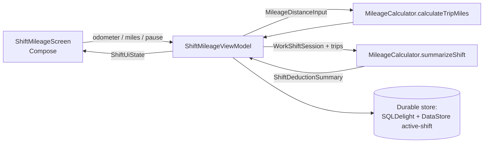
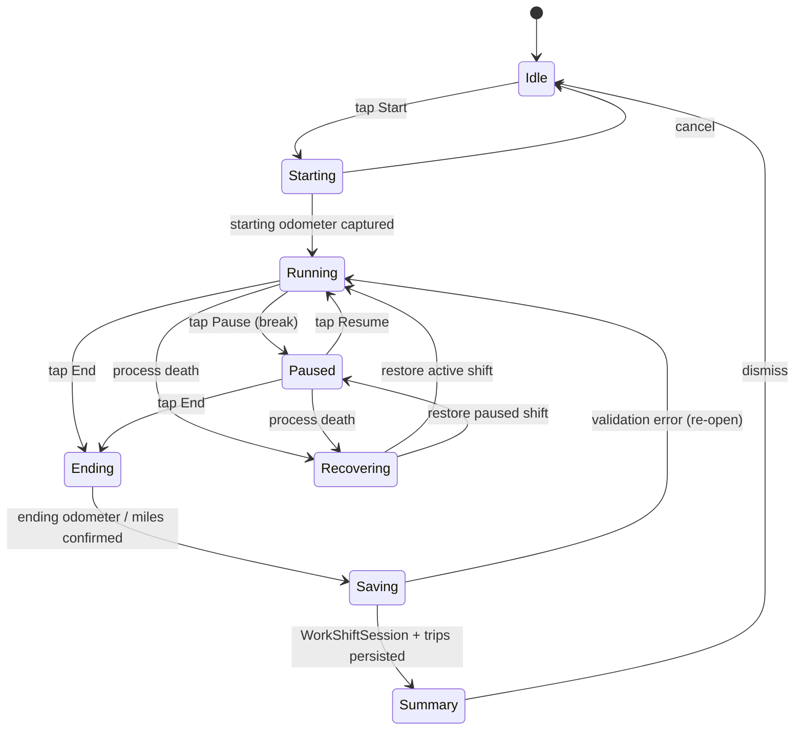
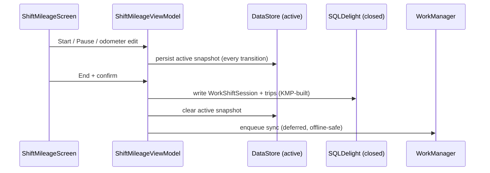

# Android — One-Handed Shift Mileage Flow (Start / Pause / End)

> **Status:** DRAFT — design only (pending human review)
> **Owner:** @native-app-engineer
> **Issue:** [#2518](https://github.com/jrmoulckers/finance/issues/2518) · **Part of** [#2137](https://github.com/jrmoulckers/finance/issues/2137)
> **Platform:** Android phone (one-handed, on-the-go), Compose + Material 3
> **Last Updated:** 2026-06-22

This document specifies the **design** for a one-handed Jetpack Compose shift-mileage flow: a gig
worker starts, pauses, resumes, and ends a work shift while tracking mileage, entirely operable with
a thumb. It defines the **state machine**, offline persistence expectations, and shortcut entry
points. It is **design + breakdown only** — native implementation is unblocked, but the
_distribution_ tail stays gated by [#1242](https://github.com/jrmoulckers/finance/issues/1242)
(see [Implementation Readiness](#12-implementation-readiness)).

---

## Table of Contents

- [1. Goals & Non-Goals](#1-goals--non-goals)
- [2. KMP / Compose Boundary](#2-kmp--compose-boundary)
- [3. Affected Android Surfaces](#3-affected-android-surfaces)
- [4. Shared Dependencies](#4-shared-dependencies)
- [5. Shift State Machine](#5-shift-state-machine)
- [6. One-Handed Compose Layout](#6-one-handed-compose-layout)
- [7. Offline Persistence Expectations](#7-offline-persistence-expectations)
- [8. Shortcut Entry Points](#8-shortcut-entry-points)
- [9. State Model (Offline / Empty / Error)](#9-state-model-offline--empty--error)
- [10. Accessibility (TalkBack & Font Scaling)](#10-accessibility-talkback--font-scaling)
- [11. Test Plan](#11-test-plan)
- [12. Implementation Readiness](#12-implementation-readiness)

---

## 1. Goals & Non-Goals

### Goals

- Let a driver **start a shift** in one tap and reach the running controls with a thumb.
- Support **pause / resume** (e.g. a break) without ending the shift, and a clear **end** that
  produces a `WorkShiftSession` plus its mileage trips.
- Capture mileage either by **odometer start/end** or a **direct miles** entry, deferring all math
  to KMP.
- **Survive process death, app kill, and offline** — a running shift is durable.
- Provide fast **shortcut entry points** (app shortcut, Quick Settings-style widget tile, deep link)
  to start/resume.

### Non-Goals

- GPS / live-tracking of distance (battery + privacy heavy; future work, not this issue). Mileage is
  user-entered (odometer or miles) for v1.
- IRS export / audit trail and route presets — covered by the companion doc
  [Mileage presets & IRS export](./android-mileage-presets-irs-export.md) (#2519).
- The tax-reserve settings flow — see [Gig tax-reserve settings](./android-gig-tax-reserve-settings.md) (#2517).
- Wear OS shift control surface — a desirable follow-up (DataLayer to phone), explicitly out of scope
  here; no `apps/wear` module exists yet.

---

## 2. KMP / Compose Boundary

Mileage and deduction math live in **KMP `packages/core`**; Compose only renders shared state and
collects raw inputs (odometer readings, miles, timestamps, platform).

| Concern                                           | Owner   | Symbol / location                                                                                |
| ------------------------------------------------- | ------- | ------------------------------------------------------------------------------------------------ |
| Shift session model                               | KMP     | `WorkShiftSession` (`com.finance.core.mileage`)                                                  |
| Trip entry model                                  | KMP     | `MileageTripEntry`, `MileageDistanceInput`                                                       |
| Miles from odometer vs. direct                    | KMP     | `MileageCalculator.calculateTripMiles(...)`                                                      |
| Trip + shift deduction totals                     | KMP     | `MileageCalculator.calculateTripDeduction(...)`, `summarizeShift(...)` → `ShiftDeductionSummary` |
| IRS rate by year/purpose                          | KMP     | `MileageCalculator.getMileageRate(...)` (2024: 67¢ business; 2025: 70¢)                          |
| Audit metadata                                    | KMP     | `MileageAuditMetadata`, `MileageAuditSource`                                                     |
| Compose UI, state machine, persistence, shortcuts | Android | `apps/android/...` (this doc)                                                                    |

Source of truth:
[`packages/core/.../mileage/MileageCalculator.kt`](../../packages/core/src/commonMain/kotlin/com/finance/core/mileage/MileageCalculator.kt)
and
[`MileageModels.kt`](../../packages/core/src/commonMain/kotlin/com/finance/core/mileage/MileageModels.kt).

> **Rule:** the UI never multiplies miles × rate, never rounds miles, and never derives miles from
> odometer arithmetic itself. It calls `MileageCalculator`. The IRS cents-per-mile values
> (67¢/70¢ …) are **owned by KMP** and must never be duplicated in Android code.



---

## 3. Affected Android Surfaces

All new Compose; **no XML**. Files under `apps/android/src/main/kotlin/com/finance/android/`.

| Surface                       | New file (proposed)                                                                   | Role                                                   |
| ----------------------------- | ------------------------------------------------------------------------------------- | ------------------------------------------------------ |
| Shift screen                  | `ui/screens/mileage/ShiftMileageScreen.kt`                                            | One-handed running-shift UI                            |
| Start sheet                   | `ui/screens/mileage/ShiftStartSheet.kt`                                               | Quick start (platform, starting odometer)              |
| End sheet                     | `ui/screens/mileage/ShiftEndSheet.kt`                                                 | Capture ending odometer/miles + confirm                |
| ViewModel                     | `ui/screens/mileage/ShiftMileageViewModel.kt`                                         | Owns `ShiftUiState`, drives the state machine          |
| Active-shift store            | `data/mileage/ActiveShiftStore.kt`                                                    | Durable in-progress shift (survives kill)              |
| Foreground service (optional) | `mileage/ShiftTimerService.kt`                                                        | Keeps elapsed-time notification while running          |
| Shortcuts                     | `mileage/ShiftShortcuts.kt`                                                           | Dynamic `ShortcutInfoCompat` for start/resume          |
| Glance tile                   | `widget/ShiftQuickStartWidget.kt`                                                     | Home-screen start/stop tile (Glance)                   |
| Koin wiring                   | `di/AppModule.kt` (append)                                                            | `viewModelOf(::ShiftMileageViewModel)`, store `single` |
| Navigation                    | `ui/navigation/FinanceNavHost.kt`                                                     | `shiftMileage` route + deep link                       |
| Preview / snapshot            | `.../mileage/ShiftMileagePreview.kt`, `test/.../snapshot/ShiftMileageSnapshotTest.kt` | Preview + Paparazzi                                    |

Reuses the existing Glance widget patterns in
[`apps/android/.../widget/`](../../apps/android/src/main/kotlin/com/finance/android/widget) (e.g.
`QuickEntryWidget`, `WidgetUpdater`, `WidgetPrivacyFormatter`).

---

## 4. Shared Dependencies

| Dependency                                                             | Use                                                             |
| ---------------------------------------------------------------------- | --------------------------------------------------------------- |
| `com.finance.core.mileage.MileageCalculator`                           | Miles, trip & shift deductions, validation, `taxYearFor`        |
| `com.finance.core.mileage.WorkShiftSession` / `MileageTripEntry`       | Persisted shift + trips                                         |
| `com.finance.core.mileage.MileageDistanceInput`                        | Odometer/miles raw input → KMP                                  |
| `com.finance.core.mileage.MileageAuditMetadata` / `MileageAuditSource` | `ODOMETER` / `MANUAL` provenance                                |
| `com.finance.core.mileage.GigPlatformLink`                             | Attach Uber/Lyft/DoorDash to the shift                          |
| WorkManager                                                            | Flush/finalize closed shifts to sync queue                      |
| SQLDelight (+ SQLCipher)                                               | Durable storage of closed shifts/trips                          |
| Jetpack DataStore                                                      | The single **active** in-progress shift snapshot                |
| Koin `koin-compose-viewmodel`                                          | `koinViewModel<ShiftMileageViewModel>()`                        |
| Timber                                                                 | Logging — **never** odometer values, earnings, or location text |

---

## 5. Shift State Machine

The shift is a finite state machine owned by `ShiftMileageViewModel` and mirrored to durable storage
on every transition.



| State        | Meaning                                                            | Durable?                    |
| ------------ | ------------------------------------------------------------------ | --------------------------- |
| `Idle`       | No active shift                                                    | n/a                         |
| `Starting`   | Collecting platform + starting odometer                            | snapshot written on confirm |
| `Running`    | Shift active, clock ticking                                        | yes — DataStore snapshot    |
| `Paused`     | Break; elapsed paused-time accumulated                             | yes                         |
| `Ending`     | Collecting ending odometer/miles                                   | yes (still recoverable)     |
| `Saving`     | Building `WorkShiftSession` via KMP, persisting to SQLDelight      | transient                   |
| `Summary`    | Shows `ShiftDeductionSummary` (miles, deductible miles, deduction) | persisted closed shift      |
| `Recovering` | App relaunched with an unfinished shift                            | restores to prior state     |

Rules:

- **Pause accounting:** the ViewModel tracks active vs. paused elapsed time; the persisted
  `WorkShiftSession` keeps `startedAt`/`endedAt` (KMP requires `endedAt >= startedAt`). Pause is a UI
  concept layered on top; total miles come from odometer/miles, not the clock.
- **Validation** is delegated: ending odometer `>= starting odometer` and miles finiteness are
  enforced by `MileageCalculator` / model `init` blocks; the ViewModel surfaces those messages.
- **Single active shift** invariant: starting a second shift while one runs prompts to end/resume the
  current one.

---

## 6. One-Handed Compose Layout

Designed for thumb reach on a phone held in one hand, in motion-adjacent contexts (stopped/parked).

- **Primary actions anchored to the bottom** within the thumb arc: a single large `Start` FAB-style
  button when idle; `Pause`/`Resume` + `End` as bottom buttons when running. Top of the screen is
  read-only status (elapsed time, platform, running miles estimate).
- **Large touch targets:** primary buttons ≥ 64 dp tall, full-width or wide, generous spacing so they
  can't be mis-tapped; secondary actions kept out of the bottom hot zone.
- **Minimal text entry while running:** odometer/miles entry uses a numeric keypad sheet
  (`ModalBottomSheet`) that rises into the thumb zone; supports a "same as last trip" quick fill.
- **Single decision per screen:** start, then run, then end — no multi-field forms mid-shift.
- **Confirmation, not accidental loss:** `End` shows a bottom sheet to confirm; destructive cancel is
  guarded.
- **Material 3 / Material You:** dynamic color; the running state uses a distinct, high-contrast
  container (e.g. `primaryContainer`) so it's glanceable; status conveyed with text + icon, never
  color alone.
- **Optional foreground notification** (`ShiftTimerService`) shows elapsed time and a stop action so
  the worker doesn't have to keep the app open; uses `VISIBILITY_PRIVATE`, no earnings shown.

```mermaid
flowchart TB
    subgraph Screen[Running shift — thumb zone at bottom]
        S[Status: 01:24 elapsed · Uber · ~18.0 mi] --- C[Pause | End buttons, bottom]
    end
```

---

## 7. Offline Persistence Expectations

The shift flow is **offline-first and durable** — it must never lose a running shift.

- **Active shift** is written to **Jetpack DataStore** on every state transition (start, pause,
  resume, odometer edit). This is the single source of truth for `Recovering` after process death or
  app kill.
- **Closed shifts + trips** are committed to the encrypted **SQLDelight** store (SQLCipher), then
  enqueued for background sync via **WorkManager** when connectivity returns. No network is required
  to start, run, or end a shift.
- **Crash / kill recovery:** on launch, if a non-`Idle` snapshot exists, the app routes into
  `Recovering` and restores the prior state; elapsed-time is recomputed from stored `startedAt` and
  accumulated pause duration.
- **No data loss on offline end:** ending a shift offline persists locally and shows the
  `ShiftDeductionSummary` immediately (computed by KMP on-device); sync happens later.
- **Idempotent sync:** closed shifts carry client-generated IDs (per the offline-first ID rule in the
  [Data Model](./data-model.md)) so re-sync is safe.



---

## 8. Shortcut Entry Points

Fast ways to start/resume without navigating the app:

| Entry point                                 | Mechanism                                              | Behaviour                                                         |
| ------------------------------------------- | ------------------------------------------------------ | ----------------------------------------------------------------- |
| **App shortcut** (long-press launcher icon) | Dynamic `ShortcutInfoCompat` (`ShortcutManagerCompat`) | "Start shift" when idle; "Resume shift" when one is active/paused |
| **Home-screen tile**                        | **Glance** widget (`ShiftQuickStartWidget`)            | Toggle start/stop + elapsed time; reuses `WidgetUpdater`          |
| **Deep link**                               | `finance://shift` route in `FinanceNavHost`            | Used by shortcut, widget, and the foreground notification         |
| **Notification action**                     | `ShiftTimerService` foreground notification            | Pause / End directly from the shade                               |

Notes:

- Shortcuts are **dynamic** and updated on each state transition (e.g. label flips to "Resume").
- All entry points converge on the same `shiftMileage` destination + ViewModel, so state stays
  consistent regardless of how the user arrived.
- The Glance tile follows the existing widget privacy pattern
  ([`WidgetPrivacyFormatter`](../../apps/android/src/main/kotlin/com/finance/android/widget/WidgetPrivacyFormatter.kt)):
  shows elapsed time + miles, **no earnings**.
- A Wear OS complication/tile for one-tap start is a noted **future** entry point (DataLayer to
  phone), not implemented here.

---

## 9. State Model (Offline / Empty / Error)

`ShiftUiState` exposed as `StateFlow`; mirrors the state machine plus transient UI concerns.

| State                           | Trigger                       | Compose rendering                                                                            |
| ------------------------------- | ----------------------------- | -------------------------------------------------------------------------------------------- |
| **Empty / Idle**                | No active shift, no history   | Large `Start shift` CTA + brief explainer                                                    |
| **Empty / Idle (with history)** | Past shifts exist             | `Start` CTA + recent shifts summary list                                                     |
| **Running / Paused**            | Active shift                  | Status + thumb-zone controls; paused shows a "Paused" banner                                 |
| **Saving**                      | Ending                        | Inline progress on the End sheet; buttons disabled                                           |
| **Summary**                     | Shift closed                  | `ShiftDeductionSummary` card (miles, deductible miles, deduction cents)                      |
| **Offline**                     | No connectivity               | **No functional change**; subtle "Saved on device, will sync" caption                        |
| **Recovering**                  | Unfinished shift on launch    | "Resume your shift?" prompt restoring prior state                                            |
| **Error (validation)**          | Ending odometer < start, etc. | KMP validation message inline on the End sheet; stay in `Ending`                             |
| **Error (persistence)**         | DataStore/DB write failure    | Non-destructive error + retry; active snapshot kept in memory; `Timber.e` **without** values |

**Offline-first guarantee:** start/run/pause/end all work with **zero network**. Sync only mirrors
already-persisted shifts. This underpins the "buildable now" claim in
[§12](#12-implementation-readiness).

---

## 10. Accessibility (TalkBack & Font Scaling)

Per [`accessibility-patterns.md`](./accessibility-patterns.md) and the **`contentDescription` on every
interactive/informational Composable** rule.

- **Primary buttons:** explicit `contentDescription` describing action + current state — e.g. "Start
  shift", "Pause shift, currently running", "End shift". State changes announced via
  `stateDescription`.
- **Elapsed time:** announced as a readable phrase ("1 hour 24 minutes elapsed"), updated via a live
  region only at meaningful intervals to avoid TalkBack chatter (not every second).
- **Running miles estimate:** merged semantics, "Approximately 18.0 miles so far. Estimate."
- **Odometer/miles entry:** numeric fields labelled programmatically; validation errors surfaced with
  `error` semantics and announced.
- **One-handed = reachable, also operable by Switch Access:** the linear, single-decision flow maps
  cleanly to sequential scanning; targets ≥ 48 dp (primary ≥ 64 dp).
- **Recovering prompt:** focus moves to the "Resume your shift?" dialog on launch; clearly labelled
  Resume/Discard actions.
- **Font scaling:** verified at **200%**; status + controls reflow without truncation; bottom buttons
  remain fully visible (scrollable content above the fixed action bar).
- **Contrast & no-color-only:** running/paused states distinguished by text + icon + container, not
  hue alone; AA contrast across light/dark/OLED.
- **Foreground notification** is fully described for TalkBack with actionable Pause/End buttons.

---

## 11. Test Plan

| Layer                    | Tool                                               | Coverage                                                                                                                    |
| ------------------------ | -------------------------------------------------- | --------------------------------------------------------------------------------------------------------------------------- |
| KMP boundary (reference) | existing `MileageCalculatorTest` (`packages/core`) | Miles/odometer/deduction math validated in shared code; Android does **not** re-assert it                                   |
| State machine            | JUnit                                              | Every transition incl. pause/resume, end, cancel, single-active invariant, validation re-entry                              |
| Recovery                 | Robolectric / instrumented                         | Kill during Running/Paused/Ending → correct `Recovering` restore; elapsed-time recomputed                                   |
| Persistence              | DataStore + SQLDelight tests                       | Active snapshot written each transition; closed shift committed; offline end persists                                       |
| ViewModel                | JUnit + Turbine                                    | `ShiftUiState` emissions; KMP calls for miles + `summarizeShift`                                                            |
| WorkManager              | `WorkManagerTestInitHelper`                        | Sync enqueued after close; idempotent re-sync                                                                               |
| Compose UI               | `createComposeRule`                                | Thumb-zone controls, end-confirm sheet, numeric entry, summary render                                                       |
| Shortcuts/Widget         | instrumented + Glance test                         | Dynamic shortcut label flips; deep link resolves; tile start/stop                                                           |
| Accessibility            | semantics assertions + Accessibility Scanner       | `contentDescription`, state announcements, 200% font scale                                                                  |
| Snapshot                 | **Paparazzi**                                      | Idle / Running / Paused / Summary in light/dark/OLED + 200% font + RTL                                                      |
| Edge cases               | unit + UI                                          | Equal start/end odometer (zero miles), missing ending reading, second-start-while-running, persistence failure, offline end |

> Mileage/deduction math assertions live in the **KMP suite**; Android tests cover the state machine,
> recovery, persistence, rendering, shortcuts, and accessibility.

---

## 12. Implementation Readiness

**Design + breakdown only** for this issue. Per the
[Human-Gated Prerequisites runbook](../ops/human-gated-prerequisites.md), "blocked by #1242" gates
**only distribution**, not implementation.

| Phase                                                                                             | Status                                                                  | Notes                                                                    |
| ------------------------------------------------------------------------------------------------- | ----------------------------------------------------------------------- | ------------------------------------------------------------------------ |
| **Design** (this doc)                                                                             | ✅ Deliverable now                                                      | No accounts/secrets needed                                               |
| **Implementation** (Compose, state machine, DataStore/SQLDelight, WorkManager, shortcuts, Glance) | ✅ Buildable now                                                        | `./gradlew :apps:android:assembleDebug` + sideload; all deps local + KMP |
| **Local tests** (unit / Robolectric / Compose / Paparazzi)                                        | ✅ Runnable now                                                         | No enrollment                                                            |
| **Distribution** (Play Store, release signing)                                                    | 🔒 Gated by [#1242](https://github.com/jrmoulckers/finance/issues/1242) | Google Play enrollment, keystore, CI secrets — **human-gated**           |

**Buildable-now scope:** the full start/pause/end flow, durable recovery, shortcuts, foreground
notification, and Glance tile all run on a debug build with on-device storage — no paid entitlement.

**Distribution tail (human action required):** Play Store release and signing depend on the #1242
prerequisites in
[§3.1 of the runbook](../ops/human-gated-prerequisites.md#31-android-distribution--google-play-1242).
No AI agent performs those steps.

---

_Part of [#2137](https://github.com/jrmoulckers/finance/issues/2137). Companion designs:
[Mileage presets & IRS export](./android-mileage-presets-irs-export.md) ·
[Gig tax-reserve settings](./android-gig-tax-reserve-settings.md)._
