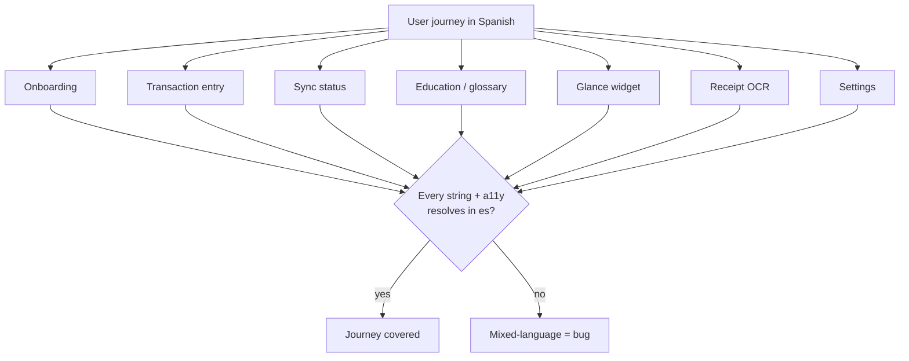
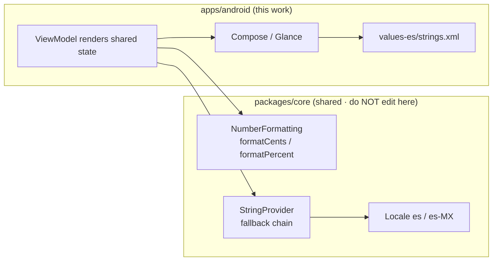
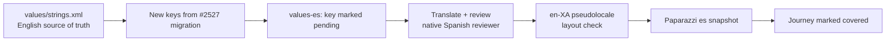

# Android Spanish Education and Formatting Coverage

> **Status:** PROPOSED — Pending human review
> **Issue:** [#2528](https://github.com/jrmoulckers/finance/issues/2528) · Part of [#2166](https://github.com/jrmoulckers/finance/issues/2166)
> **Platform:** Android (Compose, Glance widgets, receipt OCR, settings)
> **Last Updated:** 2026-06-22
> **Design only:** Native implementation remains blocked by [#1242](https://github.com/jrmoulckers/finance/issues/1242)

---

## Table of Contents

1. [Purpose](#purpose)
2. [Persona and Why This Matters](#persona-and-why-this-matters)
3. [Goals and Non-Goals](#goals-and-non-goals)
4. [Coverage Map](#coverage-map)
5. [Architecture Boundary: Formatting Lives in KMP](#architecture-boundary-formatting-lives-in-kmp)
6. [Locale-Aware Formatting](#locale-aware-formatting)
7. [Translation Workflow](#translation-workflow)
8. [Text Expansion Considerations](#text-expansion-considerations)
9. [Accessibility Considerations](#accessibility-considerations)
10. [Offline, Empty, and Error States](#offline-empty-and-error-states)
11. [Receipt OCR and Settings Specifics](#receipt-ocr-and-settings-specifics)
12. [Test Plan](#test-plan)
13. [Implementation Readiness](#implementation-readiness)
14. [References](#references)

---

## Purpose

Spanish resources already exist in
[`values-es/strings.xml`](../../apps/android/src/main/res/values-es/strings.xml),
but they rarely reach the screen because the UI is hardcoded in English (see the
[string-resource migration audit](android-string-resource-migration-audit.md),
#2527). This document designs **complete Spanish coverage** across the surfaces a
Spanish-preferred user actually touches — finance education, onboarding, widgets,
receipt OCR, settings — and the **locale-aware formatting** that must accompany
the words.

The guiding rule from [#2166](https://github.com/jrmoulckers/finance/issues/2166):
**a screen that switches between Spanish and English mid-flow is a bug.** Coverage
is measured end-to-end per user journey, not per string.

---

## Persona and Why This Matters

The driving persona ([#2166](https://github.com/jrmoulckers/finance/issues/2166)):
a 35-year-old who moved from Mexico two years ago, uses a budget Samsung Galaxy
A14, and prefers Spanish for financial terms. Financial terminology is already
stressful; mixing languages mid-flow erodes trust and increases mistakes. This
aligns with [Persona 4: Casey](personas.md) on the accessibility-first axis —
clarity and predictability reduce cognitive load (see
[cognitive-accessibility.md](cognitive-accessibility.md)).

---

## Goals and Non-Goals

**Goals**

- Define Spanish coverage targets per journey: transaction entry, sync, education
  / glossary, onboarding, widgets, receipt OCR, and settings.
- Specify **locale-aware formatting** (currency, numbers, dates, percentages)
  that is correct for `es` / `es-MX` users.
- Define a translation workflow and a "no mixed-language journey" acceptance bar.
- Respect the architecture boundary: **formatting and terminology rules live in
  KMP `packages/core`**; Android renders the results.

**Non-Goals**

- The string-extraction mechanics and lint gate (owned by
  [#2527](android-string-resource-migration-audit.md)).
- Newcomer-specific US finance modules (owned by
  [#2535](android-newcomer-us-finance-education.md)); this doc covers their
  Spanish rendering, not their authoring.
- Editing KMP `packages/*` or any non-Android platform.
- Play Store listing localization (gated by
  [#1242](https://github.com/jrmoulckers/finance/issues/1242)).

---

## Coverage Map

Coverage is tracked per surface and per journey. A surface is "covered" only when
every visible string **and** every `contentDescription` resolve from Spanish
resources at the active locale.

| Surface              | Spanish copy                    | Locale-aware formatting           | Owner of formatting logic  |
| -------------------- | ------------------------------- | --------------------------------- | -------------------------- |
| Onboarding           | `strings.xml`                   | Dates, currency previews          | KMP `packages/core`        |
| Transaction entry    | `strings.xml`                   | Amount input, currency symbol     | KMP `NumberFormatting`     |
| Sync status          | `strings.xml`                   | Relative timestamps               | KMP + Android `Context`    |
| Education / glossary | `strings.xml` / content records | Inline amounts in examples        | KMP                        |
| Glance widgets       | `strings.xml`                   | Balance + budget %                | KMP `NumberFormatting`     |
| Receipt OCR          | `strings.xml`                   | Parsed amount/date normalization  | KMP (parse) + Android (UI) |
| Settings             | `strings.xml`                   | Language picker, regional formats | Android + KMP              |

---

## Architecture Boundary: Formatting Lives in KMP

Currency, number, and percentage formatting are **business rules**, not UI
concerns. They live in KMP `packages/core` and are shared across platforms so
that "$1,234.56" vs. "1.234,56 $" is decided once, consistently.

- Composables call into the shared layer for any amount/date/percent rendering;
  they never re-implement formatting locally.
- The KMP [`NumberFormatting`](../../packages/core/src/commonMain/kotlin/com/finance/core/i18n/NumberFormatting.kt)
  baseline already knows `MXN → "MX$"`. Platform apps **may** delegate to
  `java.text.NumberFormat`/`android.icu` for full locale fidelity (grouping
  separators, decimal commas), but the _decision of which formatter and which
  locale_ remains shared state, not a Compose detail.
- The KMP [`Locale`](../../packages/core/src/commonMain/kotlin/com/finance/core/i18n/Locale.kt)
  type already models `es` and `es-MX`; Android maps the user's per-app language
  selection onto it.

> This document **describes** the boundary. It does not implement KMP changes —
> `packages/core` is owned by @native-app-engineer.

---

## Locale-Aware Formatting

Words alone are not "Spanish coverage." A Spanish user expects regionally correct
formatting. The following must be verified per locale:

| Element    | `en-US`        | `es-MX` (example)          | Notes                                                         |
| ---------- | -------------- | -------------------------- | ------------------------------------------------------------- |
| Currency   | `$1,234.56`    | `$1,234.56` (MXN as `MX$`) | Symbol + grouping/decimal separators are locale-driven.       |
| Percentage | `75.5%`        | `75,5 %`                   | Some `es` locales use a comma decimal and a space before `%`. |
| Date       | `Jun 22, 2026` | `22 jun 2026`              | Day-first ordering; month abbreviations localized.            |
| Large nums | `1,000,000`    | `1.000.000`                | Grouping separator differs; never hardcode `,`.               |
| Relative   | `2 hours ago`  | `hace 2 horas`             | Sync timestamps must localize, not just translate the noun.   |

Rules:

- **Never** build amount strings via interpolation in Compose
  (`"$" + value`). Route through the shared formatter so separators and symbol
  placement follow the locale.
- **Decimal-comma locales** must round-trip in the **transaction amount input**:
  parsing "1.234,56" must yield the same `Cents` as "1234.56". The parse rule is
  shared (KMP), the keyboard/IME affordance is Android.
- **Receipt OCR** normalizes parsed amounts/dates to the canonical `Cents`/ISO
  representation in the shared layer before display, so a receipt scanned in any
  format renders consistently in the user's locale.

---

## Translation Workflow

- English `values/strings.xml` is the **source of truth**; every key added by the
  [#2527](android-string-resource-migration-audit.md) migration appears in
  `values-es` as `pending` until translated.
- Translations are reviewed by a native Spanish speaker for **financial-term
  accuracy** (e.g. "saldo," "presupuesto," "movimiento") and for the
  non-judgmental tone in [content-language-guidelines.md](content-language-guidelines.md).
- A **missing-translation report** (diff of `values` vs. `values-es` keys) runs
  in CI; any key present in English but missing/`pending` in Spanish fails the
  coverage check for that journey.
- The KMP fallback chain
  ([`StringProvider`](../../packages/core/src/commonMain/kotlin/com/finance/core/i18n/StringProvider.kt))
  means a missing key degrades to English rather than crashing — useful in dev,
  but **not acceptable as a shipped state** for an in-scope journey.

---

## Text Expansion Considerations

Spanish copy runs **~25–30% longer than English** (occasionally more for
finance phrases that lack a short Spanish equivalent). Every Spanish surface must
be validated for expansion:

- Snapshot each covered screen in `es` **and** `en-XA` (the pseudolocale pads and
  accents text to simulate expansion) at `1.0x` and `2.0x` font scale.
- Buttons, chips, and tab labels are the most fragile — design for two-line wrap
  or icon+label fallbacks rather than truncation.
- Glance widgets have tight, fixed real estate; prioritize abbreviation rules
  (shared in KMP) over clipping, and expose the full value to TalkBack.
- This 25–30% budget is shared with the
  [migration audit](android-string-resource-migration-audit.md#text-expansion-and-layout-resilience).

---

## Accessibility Considerations

- **TalkBack in Spanish:** `contentDescription` strings must be translated too —
  an English description on a Spanish screen is a coverage bug. Use `a11y_*`
  keys (matching existing `values-es` conventions like
  `a11y_add_new_transaction`).
- **Pronunciation:** ensure TalkBack reads amounts and dates using the localized
  formatted string, not a raw numeric literal, so currency and separators are
  spoken naturally in Spanish.
- **Font scaling:** Spanish + 2.0x font scale is the worst-case layout; it must
  not clip. Combine the expansion and font-scale axes in snapshots.
- **RTL readiness:** Spanish is LTR, but routing everything through resources and
  start/end modifiers keeps the pipeline RTL-safe for future locales; `ar-XB`
  pseudolocale exercises mirroring in CI.
- Follow [accessibility-patterns.md](accessibility-patterns.md) for focus order,
  touch targets (≥ 48dp), and screen-reader semantics.

---

## Offline, Empty, and Error States

- **Offline:** the offline/sync banner is high-frequency for users on budget
  devices and intermittent data; it must be fully Spanish, including relative
  timestamps ("hace 2 horas").
- **Empty:** empty states (no transactions, no accounts, no budgets) often ship
  last; here they are explicitly in scope, with translated illustration
  `contentDescription`s.
- **Error:** validation and failure copy must be Spanish and follow "inform, then
  offer an action." Map shared error concepts to the KMP
  [`Strings.ERROR_*`](../../packages/core/src/commonMain/kotlin/com/finance/core/i18n/Strings.kt)
  vocabulary so phrasing stays consistent across platforms.
- **Receipt OCR failure:** "couldn't read this receipt" and the manual-entry
  fallback must be Spanish, with the parsed-but-uncertain fields clearly marked.

---

## Receipt OCR and Settings Specifics

**Receipt OCR**

- OCR text recognition runs on-device; the _parsing_ of amounts/dates into
  canonical `Cents`/ISO form is shared (KMP). The **review UI** (confirm amount,
  category, date) is Android and must be fully Spanish.
- Decimal-comma and day-first receipts must parse correctly; surface low-
  confidence fields for user confirmation rather than guessing silently.

**Settings**

- A **per-app language** control (Android 13+ per-app languages;
  `LocaleManager`/`AppCompatDelegate`) lets the user choose Spanish without
  changing the whole device — critical for the "don't force me back into English"
  requirement.
- Regional format preferences (currency display, first day of week) read from the
  shared locale and render via the shared formatter.
- The language picker itself and its `contentDescription`s are localized.

---

## Test Plan

| Layer              | Tooling                           | What it verifies                                                                 |
| ------------------ | --------------------------------- | -------------------------------------------------------------------------------- |
| Unit (formatting)  | JUnit (Android) over shared API   | `es-MX` currency/percent/date format correctly; decimal-comma parse round-trips. |
| Unit (coverage)    | Keys diff `values` vs `values-es` | No English-only keys remain for an in-scope journey.                             |
| Compose UI         | `createComposeRule` + semantics   | Visible text + `contentDescription` resolve in `es`, not English.                |
| Snapshot           | Paparazzi                         | `es` and `en-XA` render without clipping at 1x/2x font for each journey.         |
| Pseudolocalization | `en-XA` / `ar-XB`                 | Expansion + mirroring exercised without waiting on real translations.            |
| End-to-end journey | Espresso (es locale)              | A full journey (onboard → add txn → view widget) shows zero English.             |

**Coverage acceptance bar:** a journey passes only when the journey-level E2E and
the key-diff both show **zero English leakage**. Per-string translation is
necessary but not sufficient.

---

## Implementation Readiness

This is a design artifact. Execution splits into a **buildable-now** tier and a
**Play-distribution tail** gated by
[#1242](https://github.com/jrmoulckers/finance/issues/1242). See
[../ops/human-gated-prerequisites.md](../ops/human-gated-prerequisites.md) and
[../ops/launch-readiness-plan.md](../ops/launch-readiness-plan.md).

**Buildable now — `assembleDebug` + sideload (no human gate):**

- Spanish translation of all extracted keys (depends on
  [#2527](android-string-resource-migration-audit.md) extraction).
- Locale-aware formatting wired through the shared layer and verified on a debug
  build / emulator set to `es-MX`.
- Per-app language picker in settings, testable without the Play Store.
- Pseudolocale (`en-XA`) expansion snapshots and the `values`/`values-es`
  key-diff coverage check.

**Play-distribution tail — human-gated by [#1242](https://github.com/jrmoulckers/finance/issues/1242):**

- Spanish Play Store listing (title, description, screenshots) and store-level
  language declarations.
- Signing + internal testing track for the localized build.

Everything in the buildable-now tier is exercisable today on an emulator with the
device or per-app language set to Spanish — no signing, store credentials, or
human-gated operations.

---

## References

**Design docs**

- [android-string-resource-migration-audit.md](android-string-resource-migration-audit.md) — string extraction + lint (#2527)
- [android-newcomer-us-finance-education.md](android-newcomer-us-finance-education.md) — newcomer modules (#2535)
- [content-language-guidelines.md](content-language-guidelines.md) — non-judgmental copy
- [accessibility-patterns.md](accessibility-patterns.md) — screen reader, focus, touch targets
- [cognitive-accessibility.md](cognitive-accessibility.md) — plain-language and load reduction
- [information-architecture.md](information-architecture.md) — surface and navigation map
- [ux-principles.md](ux-principles.md) — product UX principles
- [personas.md](personas.md) — Persona 4 (Casey), accessibility-first

**Ops**

- [../ops/human-gated-prerequisites.md](../ops/human-gated-prerequisites.md) — buildable-now vs. gated split
- [../ops/launch-readiness-plan.md](../ops/launch-readiness-plan.md) — launch checklist

**KMP i18n (read-only boundary — owned by @native-app-engineer)**

- [`StringProvider.kt`](../../packages/core/src/commonMain/kotlin/com/finance/core/i18n/StringProvider.kt)
- [`NumberFormatting.kt`](../../packages/core/src/commonMain/kotlin/com/finance/core/i18n/NumberFormatting.kt)
- [`Locale.kt`](../../packages/core/src/commonMain/kotlin/com/finance/core/i18n/Locale.kt)
- [`Strings.kt`](../../packages/core/src/commonMain/kotlin/com/finance/core/i18n/Strings.kt)

**Android resources**

- [`values-es/strings.xml`](../../apps/android/src/main/res/values-es/strings.xml) — existing Spanish bundle

**Issues**

- [#2528](https://github.com/jrmoulckers/finance/issues/2528) — this issue
- [#2166](https://github.com/jrmoulckers/finance/issues/2166) — parent (Spanish-preferred localization)
- [#1242](https://github.com/jrmoulckers/finance/issues/1242) — Play Console + keystore (gate)
