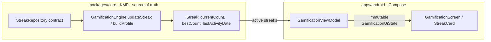
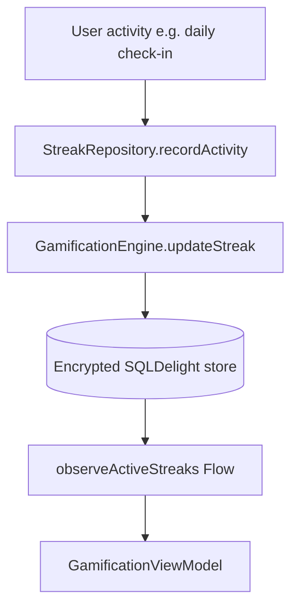
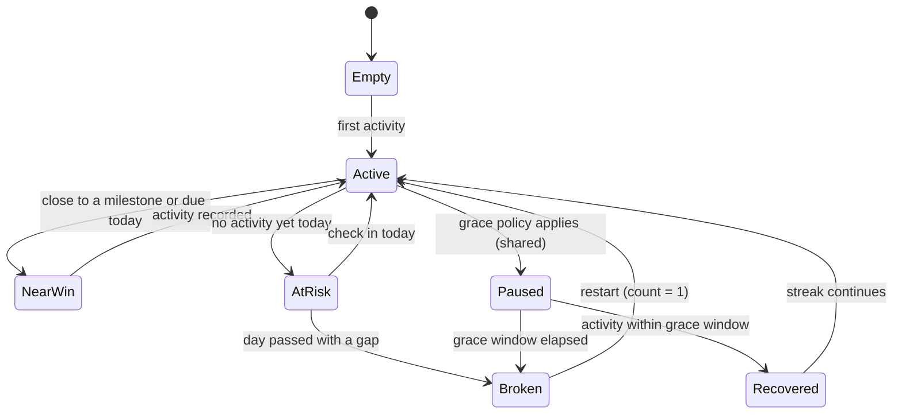
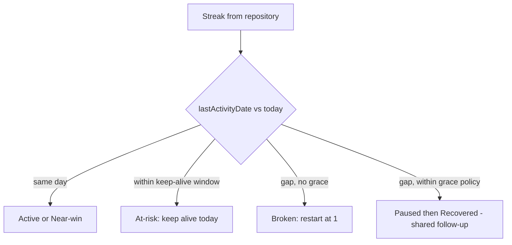

# Android Real Streak Integration & Near-Win States — Design

> **Status:** DESIGN — Implementation-ready (native build/test unblocked; store distribution gated by [#1242](https://github.com/jrmoulckers/finance/issues/1242))
> **Issue:** [#2688](https://github.com/jrmoulckers/finance/issues/2688) — _Part of [#2211](https://github.com/jrmoulckers/finance/issues/2211)_ (gamification depth)
> **Platform:** Android (Jetpack Compose · Material 3)
> **Last Updated:** 2026-06-22

This document designs the Android gamification surface for **real streak data**
and **near-win feedback**, replacing today's static, always-empty streak list. It
defines the **streak data contract**, the **near-win messaging** ("2 more
check-ins", "keep your streak alive today"), and the **empty, paused, recovered,
and broken** streak states.

Today `GamificationViewModel` builds its profile with `streaks = emptyList()` and a
comment that streaks are _"tracked separately via `StreakRepository`."_ This doc
specifies that repository contract and the Compose states it feeds — **without
writing Kotlin yet**. All streak math stays in the shared KMP
`GamificationEngine`; Compose only renders the resulting state.

---

## Table of Contents

1. [Goals & Non-Goals](#1-goals--non-goals)
2. [Architecture Boundary (Compose ↔ KMP)](#2-architecture-boundary-compose--kmp)
3. [Grounding in Existing Code](#3-grounding-in-existing-code)
4. [Streak Data Contract](#4-streak-data-contract)
5. [Streak States](#5-streak-states)
6. [Near-Win Messaging](#6-near-win-messaging)
7. [State Derivation (Today vs. Last Activity)](#7-state-derivation-today-vs-last-activity)
8. [UI Composition](#8-ui-composition)
9. [Accessibility (TalkBack, Switch Access, Font Scaling, Reduced Motion)](#9-accessibility-talkback-switch-access-font-scaling-reduced-motion)
10. [Offline, Empty & Error States](#10-offline-empty--error-states)
11. [Test Plan](#11-test-plan)
12. [Implementation Readiness](#12-implementation-readiness)
13. [Open Questions](#13-open-questions)

---

## 1. Goals & Non-Goals

### Goals

- Define a **streak data contract** (`StreakRepository`) that supplies real active
  streaks to `GamificationViewModel` instead of `emptyList()`.
- Specify **near-win messages** such as _"2 more check-ins"_ and _"keep your streak
  alive today"_ driven by shared state, not Compose guesswork.
- Define **empty, paused, recovered, and broken** streak states plus the **active**
  and **near-win** states, each with copy and accessibility.
- Keep all **streak rules in `packages/core`** (`GamificationEngine.updateStreak`)
  and have Compose render the shared result.
- Reuse the existing `Streak` model and `StreakCard` composable rather than
  inventing parallel structures.

### Non-Goals

- **No streak math in Compose.** Extend/reset/grace logic belongs to the shared
  engine (see §2–§3). The UI never computes day deltas itself for business logic.
- **No new Kotlin in this issue.** This is design-ready scoping; implementation
  follows once the contract is agreed (#2211).
- **No achievement/badge changes.** Badge unlocks are
  [android-sharesheet-wins-badges.md](./android-sharesheet-wins-badges.md) /
  existing achievements; this doc is streaks only.
- **No notifications design here.** "Keep your streak alive today" _reminders_ (if
  any) ride the existing WorkManager + push path and are a separate follow-up — no
  AlarmManager / JobScheduler.
- **No financial amounts.** Streak surfaces show **counts and dates only** — never
  balances (and any future streak share card obeys
  [android-privacy-safe-share-cards.md](./android-privacy-safe-share-cards.md)).
- **No store distribution work** (gated by #1242 — see §12).

---

## 2. Architecture Boundary (Compose ↔ KMP)

Streaks are **shared state rendered by Compose**. The repository persists/serves
streaks; the engine decides how they evolve; the ViewModel maps them to an
immutable UI state; the screen draws them.

- `GamificationViewModel` already exposes one immutable
  `StateFlow<GamificationUiState>` carrying `activeStreaks: List<Streak>`; today it
  is fed `emptyList()`. This design **fills that list from `StreakRepository`**.
- **All transitions** (extend on consecutive day, no-op same day, reset on gap) are
  the shared `GamificationEngine.updateStreak` rules — Compose never re-implements
  them.
- The ViewModel may compute **presentation-only** derivations (e.g. "is this a
  near-win banner") from shared `currentCount`/`lastActivityDate` plus the shared
  "today" — but the **near-win threshold and grace policy are shared inputs**, not
  Compose magic numbers.

---

## 3. Grounding in Existing Code

| Concern            | Source of truth (do **not** reimplement in Compose)                                                                                                   | Today's state                                                        |
| ------------------ | ----------------------------------------------------------------------------------------------------------------------------------------------------- | -------------------------------------------------------------------- |
| Streak model       | [`Streak`](../../packages/core/src/commonMain/kotlin/com/finance/core/gamification/GamificationTypes.kt)                                              | Exists: `type`, `currentCount`, `bestCount`, `lastActivityDate`      |
| Streak transitions | [`GamificationEngine.updateStreak`](../../packages/core/src/commonMain/kotlin/com/finance/core/gamification/GamificationEngine.kt)                    | Exists: +1 consecutive, no-op same day, reset on gap                 |
| Profile assembly   | [`GamificationEngine.buildProfile(progress, streaks)`](../../packages/core/src/commonMain/kotlin/com/finance/core/gamification/GamificationEngine.kt) | Exists: filters `currentCount > 0` into `activeStreaks`              |
| The gap to fill    | [`GamificationViewModel`](../../apps/android/src/main/kotlin/com/finance/android/ui/gamification/GamificationViewModel.kt) (`streaks = emptyList()`)  | **Empty today** — comment: "tracked separately via StreakRepository" |
| Streak UI          | `StreakCard` in [`GamificationScreen`](../../apps/android/src/main/kotlin/com/finance/android/ui/gamification/GamificationScreen.kt)                  | Exists: renders count + best, hidden when list is empty              |
| Streak category    | `AchievementCategory.STREAKS`                                                                                                                         | Exists: streak achievements already categorized                      |

> The work is **wiring + states**, not new math: feed real `Streak`s into the
> existing `buildProfile`/`activeStreaks` path and render the states below. The
> `updateStreak` engine already encodes the extend/reset rules.

---

## 4. Streak Data Contract

`StreakRepository` is a **shared (`packages/core`) contract** that the Android repo
layer observes; the ViewModel consumes it the same way it observes transactions,
accounts, budgets, and goals today.

Conceptual shape (design only — owned by @native-app-engineer, **not** implemented here):

- `observeActiveStreaks(householdId): Flow<List<Streak>>` — emits the current
  streaks (already `currentCount`-filtered by `buildProfile`).
- `recordActivity(type, date): Streak` — delegates to
  `GamificationEngine.updateStreak(existing, type, date)` and persists the result;
  it is the **only** writer of streak state.
- Streak persistence reuses the encrypted SQLDelight store (SQLCipher) like other
  finance data; **no streak state in SharedPreferences**.

Notes:

- The repository never recomputes day math — it **delegates to `updateStreak`** so
  the "consecutive vs gap" rule has exactly one home.
- `recordActivity` is **idempotent per day** because `updateStreak` returns the
  existing streak unchanged when `daysSinceLast == 0`.
- The `type` string (e.g. `"daily-tracking"`, `"budget-adherence"`) is the existing
  `Streak.type`; UI titles humanize it (today `StreakCard` already does
  `type.replaceFirstChar { … }.replace("-", " ")`).

---

## 5. Streak States

The engine's primitive transitions (`updateStreak`) plus the shared "today" yield
the following **presentation states**. Note the engine **resets to 1 on any gap**
(it has no built-in pause); "paused" and "recovered" are therefore states that
require a **shared grace-period policy** — see §7 and the open questions.

| State     | Meaning                                                   | Source signal                                           |
| --------- | --------------------------------------------------------- | ------------------------------------------------------- |
| Empty     | No streak of this type yet                                | `activeStreaks` has no entry for `type`                 |
| Active    | Ongoing streak, not due/at-risk right now                 | `currentCount > 0`, last activity recent                |
| Near-win  | One/two activities from a milestone, or due today         | shared near-win threshold + `lastActivityDate` vs today |
| At-risk   | Streak alive but no activity **yet today**                | `lastActivityDate < today` within the keep-alive window |
| Broken    | A gap elapsed; `updateStreak` reset `currentCount` to 1   | engine reset on `daysSinceLast > 1`                     |
| Paused    | Grace policy is holding the streak (shared follow-up)     | shared grace policy (not yet in engine — §13)           |
| Recovered | Activity landed inside the grace window; streak continues | shared grace policy resolves to continue                |

---

## 6. Near-Win Messaging

Near-win copy turns a number into momentum. It is **derived from shared state**
(`currentCount`, milestone thresholds, and `lastActivityDate` vs today) and chosen
in the ViewModel as a **presentation string**, with thresholds supplied by shared
config — never hardcoded business rules in Compose.

| State / trigger                       | Message (example)                         | Tone                 |
| ------------------------------------- | ----------------------------------------- | -------------------- |
| 2 from a milestone                    | "2 more check-ins to hit 30 days"         | Encouraging          |
| 1 from a milestone                    | "1 more check-in for your 30-day badge"   | Encouraging          |
| Alive but no activity today (at-risk) | "Keep your streak alive today"            | Gentle nudge         |
| Just hit a milestone                  | "30-day streak! Nice work."               | Celebratory          |
| Recovered within grace                | "Welcome back — your streak continues"    | Reassuring           |
| Broken / restarted                    | "Fresh start — day 1 of a new streak"     | Kind, non-judgmental |
| Empty                                 | "Start a streak with your first check-in" | Inviting             |

Copy rules (per [content-language-guidelines.md](./content-language-guidelines.md)
and [cognitive-accessibility.md](./cognitive-accessibility.md)):

- **No shame on broken streaks** — never "you lost your streak" / "you failed".
- **No financial figures** — streaks are about consistency, not amounts.
- Numbers are **localized via the shared formatter**; plurals handled by Android
  plural string resources, not string concatenation.

---

## 7. State Derivation (Today vs. Last Activity)

The only time-sensitive input is **"today"**. To keep it testable and consistent
with the engine (which already takes `now`/`activityDate`):

- "Today" is a **shared, injected clock value** (kotlinx-datetime `LocalDate`),
  passed in like `updateStreak(existing, type, activityDate)` already accepts a
  date — never `LocalDate.now()` read ad hoc in a composable.
- **At-risk** = streak active **and** `lastActivityDate < today` within the
  keep-alive window. This is a presentation flag computed from shared inputs.
- **Near-win threshold** (how close counts as "near") is a **shared constant/config
  value**, so product can tune it once for all platforms.
- **Paused / recovered** depend on a **grace-period policy that does not yet exist
  in `GamificationEngine`** (the engine resets on any gap). Until that shared policy
  lands, the UI treats a gap as **Broken/restart** and the Paused/Recovered states
  are specified-but-dormant (flagged in §13 as an @native-app-engineer follow-up).

---

## 8. UI Composition

The existing `StreakCard` is extended (not replaced) to carry state + near-win
copy. Today it renders `currentCount` and `bestCount`; the evolution adds a state
badge and an optional near-win line.

- **Streak list** stays a section in `GamificationScreen` (`activeStreaks`),
  rendered with `LazyColumn` items keyed by `Streak.type` (as today).
- **`StreakCard` additions:** a state chip (Active / Near-win / At-risk /
  Recovered / restarted) using **text + icon, not color alone**, and an optional
  near-win caption from §6.
- **Empty state:** when `activeStreaks` is empty, show an inviting empty card
  ("Start a streak…") instead of hiding the section silently, so the surface is no
  longer a dead, always-empty list.
- **Celebration on milestone:** reuse the reduced-motion-aware celebration pattern
  (see the Referral `CelebrationOverlay` and
  [animation-library.md](./animation-library.md)); static fallback when reduced
  motion is on.
- A **streak milestone** may offer a share affordance, which defers entirely to
  [android-sharesheet-wins-badges.md](./android-sharesheet-wins-badges.md) and
  [android-privacy-safe-share-cards.md](./android-privacy-safe-share-cards.md).

---

## 9. Accessibility (TalkBack, Switch Access, Font Scaling, Reduced Motion)

- **TalkBack:** each `StreakCard` keeps a single summarizing `contentDescription`
  that now includes **state and near-win** info, e.g. _"Daily tracking streak: 28
  days. Best: 40 days. 2 more check-ins to hit 30 days."_ — extending the existing
  card description rather than adding chatty child nodes.
- **At-risk** is announced as actionable, e.g. _"Daily tracking streak, 28 days.
  Keep your streak alive today."_
- **Switch Access:** the streak section and any per-card action (share, check-in)
  are in the normal traversal order; the empty-state CTA is operable.
- **Font scaling (200%):** count, best, state chip, and near-win caption reflow
  and wrap; the big streak number scales without clipping the card.
- **Reduced motion:** milestone celebration honors the system animator scale and
  the app reduced-motion preference — static celebratory card, no looping
  particles (see [accessibility-patterns.md](./accessibility-patterns.md)).
- **Color independence:** state is never color-only — Active/At-risk/Broken each
  carry text + icon per [accessibility-patterns.md](./accessibility-patterns.md).

---

## 10. Offline, Empty & Error States

| Condition                    | Behavior                                                                                   |
| ---------------------------- | ------------------------------------------------------------------------------------------ |
| Offline                      | Streaks read from the local encrypted store; fully usable offline.                         |
| No streaks yet               | Inviting empty card ("Start a streak with your first check-in"), not a blank section.      |
| Repository load error        | Section shows a non-blocking retry; the rest of the gamification screen still renders.     |
| Clock/timezone edge          | Day boundaries use the shared injected date; at-risk/broken are computed from it.          |
| Grace policy absent          | Gaps render as **Broken/restart**; Paused/Recovered remain dormant until shared follow-up. |
| Streak with `currentCount` 0 | Already filtered out by `buildProfile`; never rendered as active.                          |

---

## 11. Test Plan

- **Unit (ViewModel):** with a fake `StreakRepository`, `activeStreaks` is
  populated (not empty); state derivation yields Active / Near-win / At-risk /
  Broken correctly from `lastActivityDate` vs an injected "today"; near-win copy
  selection matches thresholds.
- **Engine parity:** assert the UI never recomputes streak transitions — extend /
  same-day no-op / gap-reset are asserted against `GamificationEngine.updateStreak`
  directly (shared tests already exist) and the ViewModel only reads results.
- **Copy / tone tests:** broken-streak and near-win strings contain **no blame**
  language and **no financial amounts** (string-resource assertions).
- **Compose UI / semantics:** `contentDescription` on every `StreakCard` includes
  state + near-win; empty-state CTA present and operable; state chips are not
  color-only.
- **Paparazzi snapshots:** Empty, Active, Near-win (1-from and 2-from), At-risk,
  Broken/restart, and Recovered cards — light/dark + dynamic color, default and
  200% font, plus a reduced-motion static milestone celebration.
- **Idempotency:** `recordActivity` twice on the same day does not advance the
  count (mirrors `updateStreak` same-day no-op).

---

## 12. Implementation Readiness

Per [`../ops/human-gated-prerequisites.md`](../ops/human-gated-prerequisites.md)
§2 (Implementation vs. Distribution), this feature is **decoupled**: wiring real
streaks and rendering the states is fully buildable/testable now; only store
distribution waits on #1242. This issue intentionally **writes no Kotlin yet** — it
locks the contract so implementation under #2211 is unambiguous.

### ✅ Buildable now (debug / free signing — no enrollment, no secrets)

- This design doc, the `StreakRepository` contract, and the state/near-win spec.
- Once approved: the Android `StreakRepository` observer wiring,
  `GamificationViewModel` change (real streaks instead of `emptyList()`), the
  `StreakCard` state/near-win additions, and Koin registration.
- The shared `StreakRepository` + any grace-period policy are `packages/core`
  changes (owned by @native-app-engineer) — also unblocked; not store-gated.
- Unit tests, copy/tone tests, Compose semantics/UI tests, and Paparazzi snapshots.
- Local verification via `./gradlew :apps:android:assembleDebug` + sideload, per
  [`../ops/human-gated-prerequisites.md`](../ops/human-gated-prerequisites.md)
  §2 "Free local build/test paths."

### 🔒 Distribution tail — gated by [#1242](https://github.com/jrmoulckers/finance/issues/1242)

- Release signing with the production keystore.
- Google Play Console upload / release-track promotion.
- The signed-AAB release workflow and its CI secrets.
- Push delivery configuration for any "keep your streak alive" production reminder.

These are **human-gated** and out of scope for SME agents — see the
[Human-Gated Prerequisites Runbook](../ops/human-gated-prerequisites.md) §3.1.
Until then the streak surface is fully exercisable via debug sideload.

---

## 13. Open Questions

1. **Grace-period policy** — should `GamificationEngine` gain an explicit
   pause/recover/grace concept (so Paused/Recovered are real), or do we ship
   Broken/restart only in v1? This is the key @native-app-engineer decision for #2211.
2. **Near-win threshold source** — confirm "near" (1 vs 2 activities, or a percent
   of the next milestone) is a single shared config value across platforms.
3. **Streak types in v1** — which `Streak.type` values do we surface first
   (daily-tracking, budget-adherence, …) and where does each `recordActivity` fire?
4. **Reminder ownership** — is the "keep your streak alive today" reminder a
   WorkManager/push concern designed in a separate notifications issue rather than
   here?
5. **Timezone / day boundary** — confirm the shared "today" uses the user's local
   timezone consistently with how `updateStreak` callers pass `activityDate`.
