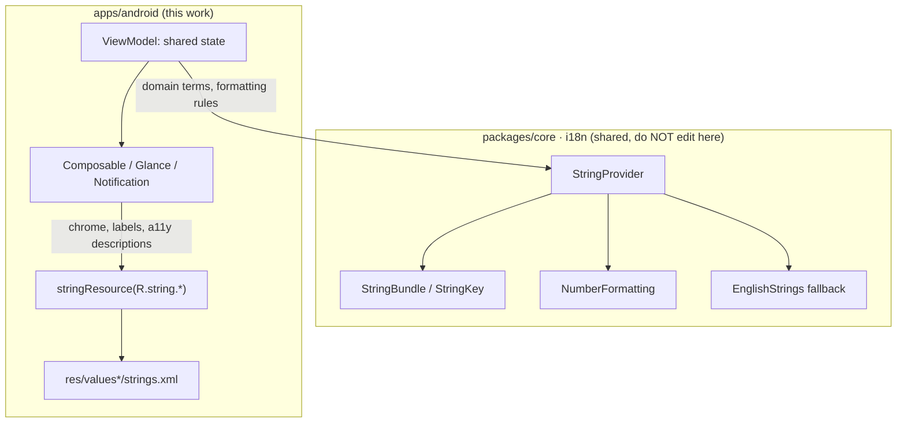
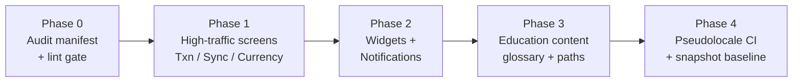

# Android Compose String-Resource Migration Audit

> **Status:** PROPOSED — Pending human review
> **Issue:** [#2527](https://github.com/jrmoulckers/finance/issues/2527) · Part of [#2166](https://github.com/jrmoulckers/finance/issues/2166)
> **Platform:** Android (Jetpack Compose, Glance widgets, notifications)
> **Last Updated:** 2026-06-22
> **Design only:** Native implementation remains blocked by [#1242](https://github.com/jrmoulckers/finance/issues/1242)

---

## Table of Contents

1. [Purpose](#purpose)
2. [Problem Statement](#problem-statement)
3. [Goals and Non-Goals](#goals-and-non-goals)
4. [Architecture Boundary: KMP vs. Android Resources](#architecture-boundary-kmp-vs-android-resources)
5. [Audit Inventory](#audit-inventory)
6. [Migration Strategy](#migration-strategy)
7. [Lint Gates](#lint-gates)
8. [Accessibility Considerations](#accessibility-considerations)
9. [Text Expansion and Layout Resilience](#text-expansion-and-layout-resilience)
10. [Offline, Empty, and Error States](#offline-empty-and-error-states)
11. [Test Plan](#test-plan)
12. [Implementation Readiness](#implementation-readiness)
13. [References](#references)

---

## Purpose

The Android client currently renders user-facing copy as hardcoded Kotlin string
literals inside Composables, Glance widgets, and notification builders. A grep
across `apps/android/src/main/kotlin` finds **no `stringResource(...)` usage at
all**, which means localized resources (including the existing
[`values-es/strings.xml`](../../apps/android/src/main/res/values-es/strings.xml))
never reach the screen.

This document is the **migration audit and plan**: it inventories the hardcoded
surfaces, defines the target architecture, and specifies lint gates that prevent
regressions. It is a design and breakdown artifact only — no native code is
written here while [#1242](https://github.com/jrmoulckers/finance/issues/1242)
(Play Console + signing) gates store distribution.

This work unblocks [#2528 (Spanish coverage)](android-spanish-education-formatting.md)
and [#2535 (newcomer education)](android-newcomer-us-finance-education.md): both
depend on a string-resource pipeline existing first.

---

## Problem Statement

| Symptom                          | Evidence                                                                           | Impact                                                             |
| -------------------------------- | ---------------------------------------------------------------------------------- | ------------------------------------------------------------------ |
| Hardcoded English in Composables | `TransactionCreateScreen.kt`, `CurrencyConversionScreen.kt`, `SyncStatusScreen.kt` | Spanish users see mixed-language screens; trust drops.             |
| Hardcoded education content      | `FinancialConceptContent.kt`, `LearningPathContent.kt`                             | Glossary and learning paths are English-only and untranslatable.   |
| No `stringResource()` usage      | Repo-wide grep returns zero hits                                                   | Translations in `values-es/strings.xml` are never displayed.       |
| No lint gate                     | No Compose/Glance hardcoded-string detector configured                             | New literals slip in continuously; the backlog grows every sprint. |

The product principle is explicit: **mixed-language screens are bugs, not
acceptable fallback behavior** (see [#2166](https://github.com/jrmoulckers/finance/issues/2166)).

---

## Goals and Non-Goals

**Goals**

- Produce a complete inventory of hardcoded user-facing text on Android.
- Define a phased migration to Android string resources + the KMP i18n layer.
- Specify a lint gate (Android Lint `HardcodedText` + a Compose-aware custom
  rule) so the zero-`stringResource` regression cannot recur.
- Preserve the **separation of concerns**: finance math and terminology rules
  live in KMP `packages/core`; Compose only renders shared state.

**Non-Goals**

- Translating strings (owned by [#2528](android-spanish-education-formatting.md)).
- Authoring new education modules (owned by [#2535](android-newcomer-us-finance-education.md)).
- Editing KMP `packages/*` or any platform other than Android.
- Shipping to Google Play (blocked by [#1242](https://github.com/jrmoulckers/finance/issues/1242)).

---

## Architecture Boundary: KMP vs. Android Resources

Two complementary localization systems coexist. The audit must route each string
to the correct layer rather than collapsing them.

**Routing rule of thumb:**

- **Android `strings.xml`** owns UI chrome, button labels, screen titles,
  `contentDescription` text, notification titles/bodies, and Glance widget
  labels — anything the platform localizes by resource qualifier
  (`values-es`, `values-night`, etc.).
- **KMP `packages/core` i18n** owns _domain terminology and formatting rules_:
  budget status vocabulary, currency/number formatting
  ([`NumberFormatting`](../../packages/core/src/commonMain/kotlin/com/finance/core/i18n/NumberFormatting.kt)),
  and the cross-platform fallback chain
  ([`StringProvider`](../../packages/core/src/commonMain/kotlin/com/finance/core/i18n/StringProvider.kt)).
  Composables render the resulting strings; they never compute amounts or invent
  financial vocabulary locally.

> The KMP `StringProvider` fallback chain is _exact locale → language-only →
> default (English) → key-as-is_. The Android resource resolver does the same by
> qualifier. We deliberately **do not implement** changes in `packages/core`
> here — this doc only describes the boundary so the migration respects it.

---

## Audit Inventory

The following surfaces were identified from [#2166](https://github.com/jrmoulckers/finance/issues/2166)
and a repository scan. Each entry will become a tracked migration task. Line
numbers are indicative anchors; the implementation PR will re-verify against HEAD.

| Surface             | File                                                                                                                                    | Examples of hardcoded text             | Target         |
| ------------------- | --------------------------------------------------------------------------------------------------------------------------------------- | -------------------------------------- | -------------- |
| Transaction entry   | [`TransactionCreateScreen.kt`](../../apps/android/src/main/kotlin/com/finance/android/ui/screens/TransactionCreateScreen.kt)            | Field labels, validation copy, buttons | `strings.xml`  |
| Currency conversion | [`CurrencyConversionScreen.kt`](../../apps/android/src/main/kotlin/com/finance/android/ui/screens/currency/CurrencyConversionScreen.kt) | Titles, helper text, action labels     | `strings.xml`  |
| Sync status         | [`SyncStatusScreen.kt`](../../apps/android/src/main/kotlin/com/finance/android/ui/sync/SyncStatusScreen.kt)                             | Status messages, retry copy            | `strings.xml`  |
| Education tooltips  | [`FinancialConceptContent.kt`](../../apps/android/src/main/kotlin/com/finance/android/ui/education/FinancialConceptContent.kt)          | Concept titles + descriptions          | `strings.xml`† |
| Learning paths      | [`LearningPathContent.kt`](../../apps/android/src/main/kotlin/com/finance/android/ui/learning/LearningPathContent.kt)                   | Module titles, body copy, quiz options | `strings.xml`† |
| Glance widgets      | `apps/android/.../widget/*`                                                                                                             | Balance/budget summary labels          | `strings.xml`  |
| Notifications       | `apps/android/.../notifications/*`                                                                                                      | Channel names, titles, bodies          | `strings.xml`  |
| Shared fallback     | [`EnglishStrings.kt`](../../packages/core/src/commonMain/kotlin/com/finance/core/i18n/EnglishStrings.kt) (KMP, read-only here)          | Domain term defaults                   | KMP (no edit)  |

† Education content is long-form. See
[android-spanish-education-formatting.md](android-spanish-education-formatting.md)
and [android-newcomer-us-finance-education.md](android-newcomer-us-finance-education.md)
for the content-modeling decision (resource strings vs. structured content
records). This audit only records that the text must become localizable; it does
not pick the storage format for prose modules.

**Audit deliverable:** a machine-checkable manifest (CSV or JSON under
`apps/android/`) listing each literal, its file/line, proposed resource key, and
migration status (`pending` / `migrated` / `keep-as-literal`). "Keep-as-literal"
is reserved for non-user-facing strings (test tags, log tags, analytics event
names) and must carry a justification comment.

### Resource key naming

Follow the existing `values-es/strings.xml` conventions:

- `screen_element` for visible copy (e.g. `transaction_create_amount_label`).
- `a11y_*` for `contentDescription` and TalkBack-only labels
  (e.g. `a11y_add_new_transaction`).
- Reuse domain vocabulary keys already modeled in the KMP
  [`Strings`](../../packages/core/src/commonMain/kotlin/com/finance/core/i18n/Strings.kt)
  registry where a 1:1 concept exists, to avoid drift between platforms.

---

## Migration Strategy

A phased rollout keeps each PR small, reviewable, and independently testable.

- **Phase 0 — Baseline.** Land the audit manifest and the lint gate _in warning
  mode_ so the current backlog is visible without breaking the build. Establish
  Paparazzi snapshot baselines for the target screens in English.
- **Phase 1 — High-traffic screens.** Migrate transaction entry, sync status,
  and currency conversion. These are the screens most cited in
  [#2166](https://github.com/jrmoulckers/finance/issues/2166).
- **Phase 2 — Widgets and notifications.** Glance widgets and notification
  builders also resolve resources via a `Context`; migrate their labels and
  channel names.
- **Phase 3 — Education content.** Coordinate with
  [#2535](android-newcomer-us-finance-education.md) on the storage format before
  migrating long-form modules.
- **Phase 4 — Enforce.** Flip the lint gate to error, add the `en-XA`/`ar-XB`
  pseudolocale CI job, and freeze the snapshot baseline.

Each migrated string follows the same mechanical recipe:

1. Add the key/value to `values/strings.xml` (English source of truth).
2. Replace the literal with `stringResource(R.string.<key>)` in Compose (or
   `context.getString(...)` in Glance/notification code).
3. Move any `contentDescription` literal to an `a11y_*` resource key.
4. Add the key to `values-es/strings.xml` as `pending` (the actual Spanish copy
   is owned by [#2528](android-spanish-education-formatting.md)).

---

## Lint Gates

The regression that produced "zero `stringResource` usage" must be made
impossible to reintroduce silently.

- **Android Lint `HardcodedText`** — enabled at `error` severity for the
  `:apps:android` module once Phase 1 lands. Catches literal `text = "…"` in
  XML-adjacent contexts.
- **Custom Compose detector** — Android Lint's built-in `HardcodedText` does not
  see Compose `Text("literal")`. A lightweight custom lint rule (or a
  Detekt/ktlint rule) flags string literals passed to `Text(`,
  `contentDescription =`, and notification/Glance builders, with an allowlist
  for non-user-facing tags.
- **CI wiring.** The gate runs in the existing Android CI lane
  ([`ci-android.yml`](../../.github/workflows/ci-android.yml), owned by
  @devops-engineer — referenced, not edited). Severity escalates from `warning`
  (Phase 0) to `error` (Phase 4).

> **Boundary note:** workflow files are owned by @devops-engineer. This doc
> _specifies_ the gate; the actual `.github/workflows/` change is requested via
> that owner.

---

## Accessibility Considerations

Localization and accessibility are inseparable: a migrated string is only
"done" when its accessibility metadata is migrated too.

- **TalkBack:** every interactive or informational Composable keeps a
  `contentDescription`, and that description must come from an `a11y_*` resource
  key — never a hardcoded literal. Decorative elements use `null` explicitly.
- **Font scaling:** all migrated text uses `sp` units and must survive 200% font
  scale (Android `fontScale = 2.0`) without truncation or clipping. Avoid fixed
  heights on text containers.
- **RTL readiness:** although Spanish is LTR, routing all copy through resources
  is the prerequisite for future RTL locales (e.g. Arabic). Use
  start/end (not left/right) modifiers and `supportsRtl="true"` so the pipeline
  is RTL-safe before any RTL language ships. The `ar-XB` pseudolocale exercises
  this in CI.
- **Reading level:** keep migrated copy plain-language per
  [content-language-guidelines.md](content-language-guidelines.md) and the
  cognitive-accessibility guidance in
  [cognitive-accessibility.md](cognitive-accessibility.md).

See [accessibility-patterns.md](accessibility-patterns.md) for the
cross-platform screen-reader and touch-target patterns this migration must honor.

---

## Text Expansion and Layout Resilience

Migrating to resources exposes layouts to translated lengths. **Spanish strings
run roughly 25–30% longer than English** (German and French longer still).
Layouts that "fit" hardcoded English will overflow once real translations load.

- Design and snapshot every migrated screen against a **+30% length** assumption.
- Prefer flexible/wrapping layouts; never assume a label fits on one line.
- The `en-XA` pseudolocale (which pads and accents text) is the automated
  expansion check; treat clipping under `en-XA` as a layout bug.
- Truncation, when unavoidable, must be `TextOverflow.Ellipsis` with the full
  text exposed to TalkBack via `contentDescription`.

This expansion budget is shared with
[android-spanish-education-formatting.md](android-spanish-education-formatting.md),
which owns the actual Spanish copy.

---

## Offline, Empty, and Error States

These states are frequently the _last_ to be localized and the _first_ a
newcomer hits. They are in scope for the audit:

- **Offline:** sync-status and "you're offline" banners must be resource-backed;
  no English "Offline" leaking through while the rest of the screen is Spanish.
- **Empty:** empty-state copy (no transactions, no budgets, no accounts) is
  user-facing and must migrate, with an `a11y_*` description for the illustration.
- **Error:** validation and failure copy (invalid amount, sync failed, network
  error) maps to the KMP error vocabulary
  ([`Strings.ERROR_*`](../../packages/core/src/commonMain/kotlin/com/finance/core/i18n/Strings.kt))
  where a shared concept exists, and to `strings.xml` for Android-specific phrasing.
  Error copy follows the "inform, then offer an action" rule from
  [content-language-guidelines.md](content-language-guidelines.md).

---

## Test Plan

| Layer              | Tooling                         | What it verifies                                                                     |
| ------------------ | ------------------------------- | ------------------------------------------------------------------------------------ |
| Unit               | JUnit + Robolectric             | Resource keys resolve; no `MissingResourceException`; `a11y_*` keys exist.           |
| Compose UI         | `createComposeRule` + semantics | Visible text and `contentDescription` come from resources, not literals.             |
| Lint               | Android Lint / Detekt rule      | Hardcoded `Text("…")` / `contentDescription = "…"` fails the build (Phase 4).        |
| Snapshot           | Paparazzi                       | English baseline + `en-XA` (expansion) + `es` render without clipping at 1x/2x font. |
| Pseudolocalization | `en-XA`, `ar-XB` resConfigs     | Expansion + RTL mirroring exercised in CI without waiting on real translations.      |
| Accessibility      | Espresso/Accessibility checks   | TalkBack focus order intact; touch targets ≥ 48dp; contrast unaffected.              |

**Snapshot matrix (key screens):** transaction entry, sync status, currency
conversion, one Glance widget, one notification, one education module — each at
`{en, en-XA, es}` × `{1.0x, 2.0x}` font scale.

**Pseudolocalization** is the cornerstone: it lets us validate expansion and
mirroring _in the debug build, today_, before any Play distribution or external
translation vendor is involved.

---

## Implementation Readiness

This is a design artifact. Execution splits cleanly into a **buildable-now** tier
and a **Play-distribution tail** gated by
[#1242](https://github.com/jrmoulckers/finance/issues/1242). See
[../ops/human-gated-prerequisites.md](../ops/human-gated-prerequisites.md) for
the canonical gate list and
[../ops/launch-readiness-plan.md](../ops/launch-readiness-plan.md) for
launch sequencing.

**Buildable now — debug-only, `assembleDebug` + sideload (no human gate):**

- Audit manifest of hardcoded literals.
- String-resource extraction and `stringResource()` plumbing.
- Locale-switch plumbing (per-app language / `LocaleManager`) verifiable on a
  debug build or emulator.
- Pseudolocale (`en-XA`, `ar-XB`) resConfigs and CI snapshot baselines.
- Lint gate in warning mode, then error mode.

**Play-distribution tail — human-gated by [#1242](https://github.com/jrmoulckers/finance/issues/1242):**

- Production signing keystore and Play Console app listing.
- Per-locale Play Store listing metadata and store-level language declarations.
- Staged rollout / internal testing track for localized builds.

Nothing in the buildable-now tier requires signing, store credentials, or any
human-gated operation; all of it is exercisable via `assembleDebug` and a
sideloaded APK on an emulator or test device.

---

## References

**Design docs**

- [android-spanish-education-formatting.md](android-spanish-education-formatting.md) — Spanish coverage (#2528)
- [android-newcomer-us-finance-education.md](android-newcomer-us-finance-education.md) — newcomer education (#2535)
- [accessibility-patterns.md](accessibility-patterns.md) — screen reader, focus, touch targets
- [cognitive-accessibility.md](cognitive-accessibility.md) — plain-language and load reduction
- [content-language-guidelines.md](content-language-guidelines.md) — non-judgmental copy standard
- [information-architecture.md](information-architecture.md) — navigation and surface map
- [ux-principles.md](ux-principles.md) — product UX principles
- [personas.md](personas.md) — including Persona 4 (Casey, accessibility-first)

**Ops**

- [../ops/human-gated-prerequisites.md](../ops/human-gated-prerequisites.md) — buildable-now vs. gated split
- [../ops/launch-readiness-plan.md](../ops/launch-readiness-plan.md) — launch checklist

**KMP i18n (read-only boundary — owned by @kmp-engineer)**

- [`StringProvider.kt`](../../packages/core/src/commonMain/kotlin/com/finance/core/i18n/StringProvider.kt)
- [`Strings.kt`](../../packages/core/src/commonMain/kotlin/com/finance/core/i18n/Strings.kt)
- [`NumberFormatting.kt`](../../packages/core/src/commonMain/kotlin/com/finance/core/i18n/NumberFormatting.kt)
- [`EnglishStrings.kt`](../../packages/core/src/commonMain/kotlin/com/finance/core/i18n/EnglishStrings.kt)

**Issues**

- [#2527](https://github.com/jrmoulckers/finance/issues/2527) — this issue
- [#2166](https://github.com/jrmoulckers/finance/issues/2166) — parent (Spanish-preferred localization)
- [#1242](https://github.com/jrmoulckers/finance/issues/1242) — Play Console + keystore (gate)
