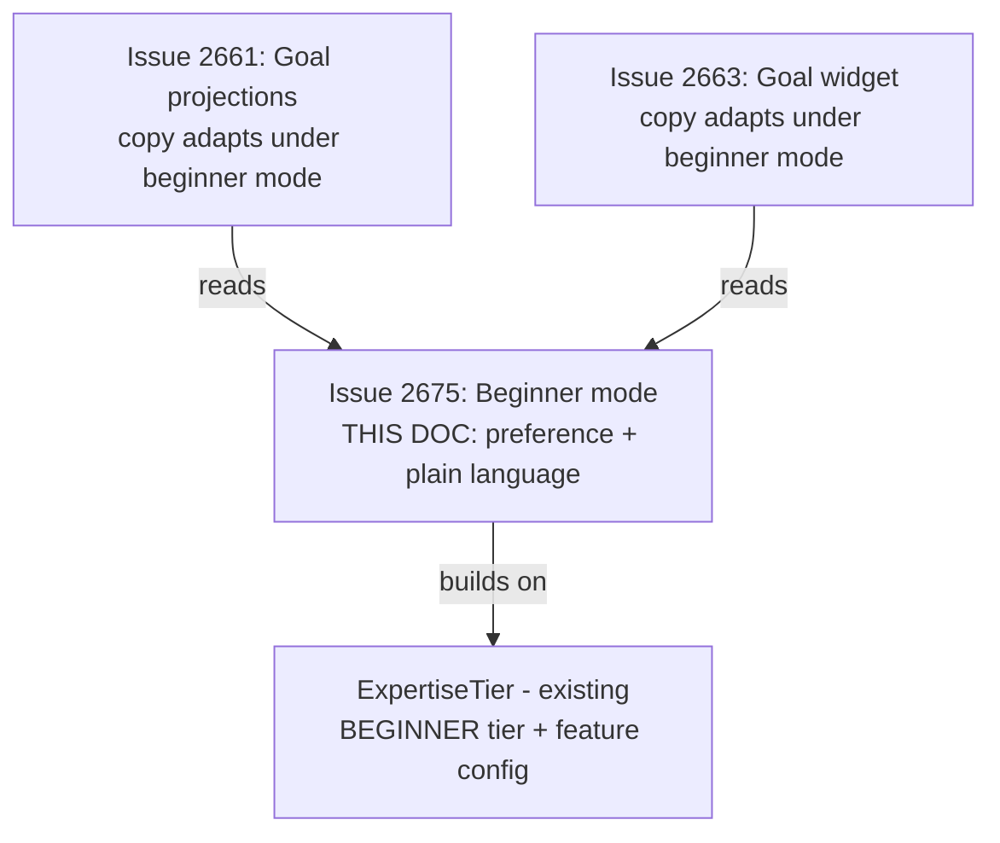
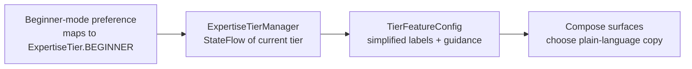
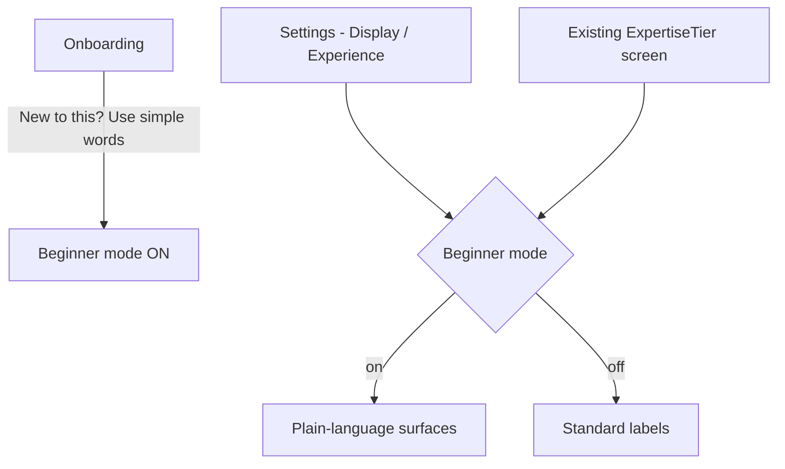
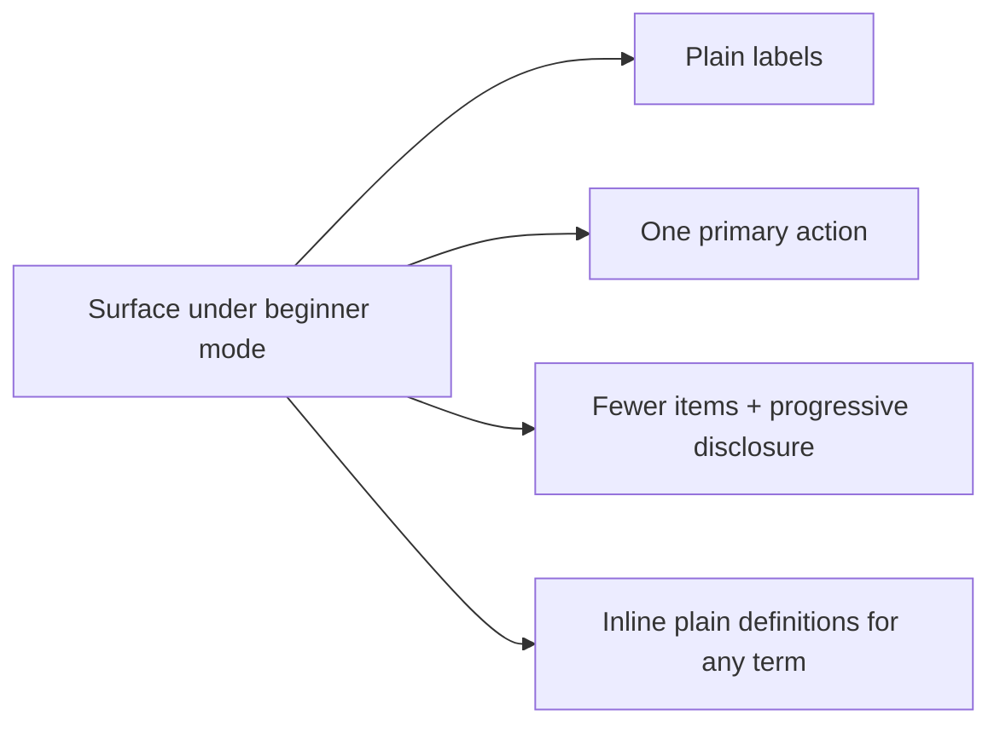

# Android Teen Beginner Mode & Plain-Language Surfaces

> **Status:** PROPOSED — Pending human review
> **Issue:** [#2675](https://github.com/jrmoulckers/finance/issues/2675) · Part of [#2209](https://github.com/jrmoulckers/finance/issues/2209)
> **Platform:** Android (Jetpack Compose, preference-driven)
> **Last Updated:** 2026-06-22
> **Design only:** Native implementation remains blocked by [#1242](https://github.com/jrmoulckers/finance/issues/1242)

---

## Table of Contents

1. [Purpose](#purpose)
2. [Persona and Why This Matters](#persona-and-why-this-matters)
3. [Goals and Non-Goals](#goals-and-non-goals)
4. [Scope Boundaries With Sibling Work](#scope-boundaries-with-sibling-work)
5. [The Beginner-Mode Preference](#the-beginner-mode-preference)
6. [Entry Points](#entry-points)
7. [Copy Transformations](#copy-transformations)
8. [Cognitive Accessibility Patterns](#cognitive-accessibility-patterns)
9. [Estimates, Privacy, and Tone](#estimates-privacy-and-tone)
10. [Accessibility Considerations](#accessibility-considerations)
11. [Offline, Empty, and Error States](#offline-empty-and-error-states)
12. [Test Plan](#test-plan)
13. [Implementation Readiness](#implementation-readiness)
14. [References](#references)

---

## Purpose

A teen or first-time saver opening the app meets words like "budget variance,"
"net worth," and "allocation" — vocabulary that signals "this app isn't for me."
This document designs a **preference-driven beginner mode**: a single toggle that
swaps finance jargon for plain, teen-first language (needs / wants / saving for
later), simplifies categories, and applies cognitive-accessibility patterns across
key surfaces.

It is **design and breakdown only** while [#1242](https://github.com/jrmoulckers/finance/issues/1242)
gates Google Play distribution. It reuses the existing
[`ExpertiseTier`](../../apps/android/src/main/kotlin/com/finance/android/ui/expertise/ExpertiseTier.kt)
concept and the cognitive-accessibility design rather than inventing a parallel
system, and writes **no Kotlin** here.

---

## Persona and Why This Matters

The persona ([#2209](https://github.com/jrmoulckers/finance/issues/2209)): a teen or
absolute beginner who is capable and motivated but not yet fluent in finance terms.
Jargon is a barrier to entry, not a feature. This persona maps closely to
[Persona 4: Casey](personas.md) (plain language, low cognitive load) and the existing
`ExpertiseTier.BEGINNER`, which already promises "simplified views with helpful
guidance."

> Beginner mode is a **presentation preference**, not a different data model. The same
> goals, budgets, and transactions are shown — just named and framed in plain
> language. No finance math changes.

---

## Goals and Non-Goals

**Goals**

- Define a **beginner-mode preference**: where it lives, how it is set, how surfaces
  read it reactively.
- Define **onboarding and settings entry points** for turning beginner mode on.
- Specify **copy transformations** from finance jargon (budgets, goals, learning) to
  plain language (needs / wants / saving for later).
- Apply **cognitive-accessibility patterns** to teen-first surfaces.

**Non-Goals**

- Goal projection surfaces and copy — owned by
  [android-teen-goal-projections.md](android-teen-goal-projections.md).
- Widget rendering — owned by [android-goal-projection-widget.md](android-goal-projection-widget.md).
- Changing any finance calculation, category model, or data schema (KMP `packages/*`).
- Editing KMP `packages/*`, web, or any non-Android platform.

---

## Scope Boundaries With Sibling Work

This doc owns the **preference** and the **plain-language layer**. Sibling surfaces
read the preference to decide which copy to show; they do not define the preference
themselves.

---

## The Beginner-Mode Preference

Beginner mode reuses the existing tier infrastructure rather than adding a competing
flag. The app already has
[`ExpertiseTierManager`](../../apps/android/src/main/kotlin/com/finance/android/ui/expertise/ExpertiseTierManager.kt),
which persists the selected tier and exposes it as a reactive `StateFlow` for Compose.
`ExpertiseTier.BEGINNER` already drives
[`TierFeatureConfig`](../../apps/android/src/main/kotlin/com/finance/android/ui/expertise/ExpertiseTier.kt)
(`showSimplifiedLabels = true`, `showGuidedWorkflows = true`, fewer categories).

- **Storage:** the tier flag is a **non-sensitive UI preference**; it persists via the
  existing preference-backed `ExpertiseTierManager` `StateFlow`. (Secrets never go in
  SharedPreferences — but a display-mode flag is not a secret.)
- **Reactive:** surfaces observe the tier flow; flipping the toggle updates copy
  immediately without a restart.
- **Independent of accessibility mode:** beginner mode and
  [cognitive-accessibility.md](cognitive-accessibility.md) mode can be combined; they
  are orthogonal toggles.

---

## Entry Points

- **Onboarding:** during onboarding
  ([`OnboardingScreen`](../../apps/android/src/main/kotlin/com/finance/android/ui/onboarding/OnboardingScreen.kt)),
  offer a friendly, opt-in choice ("New to money apps? We'll use simple words") that
  maps to the beginner tier — never assumed, never a dark pattern.
- **Settings:** a discoverable toggle in the experience/display settings, co-located
  with the existing
  [`ExpertiseTierScreen`](../../apps/android/src/main/kotlin/com/finance/android/ui/expertise/ExpertiseTierScreen.kt)
  so beginner mode is just the friendly name for the BEGINNER tier.
- **Reversible anywhere:** the saver can turn it on or off at any time with no data
  loss and no penalty.

---

## Copy Transformations

Beginner mode swaps presentation strings only; the underlying records are unchanged.
All copy is resource-backed and follows
[content-language-guidelines.md](content-language-guidelines.md).

| Standard term        | Plain-language (beginner mode) |
| -------------------- | ------------------------------ |
| Budget               | Spending plan                  |
| Budget category      | What I spend on                |
| Needs                | Stuff I have to pay for        |
| Wants                | Stuff I choose to buy          |
| Goal / target amount | What I'm saving for            |
| Savings goal         | Saving for later               |
| Net worth            | What I have                    |
| Allocation           | How it's split                 |
| Variance / over      | A little more than planned     |
| Transaction          | Money in / money out           |
| Projection           | Estimate of what's next        |

**Copy rules**

- One idea per label; avoid compound finance terms.
- Frame "needs / wants / saving for later" as the simplified category trio rather than
  formal budgeting buckets.
- Never shame: "a little more than planned" instead of "over budget."
- Estimates stay labelled as estimates even in plain language ("an estimate, not a
  promise").
- Plain language must not become **inaccurate** language — simpler words, same truth.

---

## Cognitive Accessibility Patterns

Beginner mode adopts the patterns in
[cognitive-accessibility.md](cognitive-accessibility.md) on teen-first surfaces:

- **One primary action per screen**; defer secondary options behind "More."
- **Fewer categories at once** (the BEGINNER `maxBudgetCategories` already caps this).
- **Short sentences, concrete nouns, no acronyms** without an inline plain definition.
- **Guided workflows** (BEGINNER `showGuidedWorkflows = true`) for first-time tasks.
- **Generous touch targets and spacing**; calm, low-novelty visuals.
- **Progressive disclosure**: advanced metrics are hidden, not removed, and reachable
  when the saver is ready.

---

## Estimates, Privacy, and Tone

- **Label every estimate.** Plain-language framing never drops the estimate label;
  projections remain "an estimate, not a promise."
- **Privacy-first for minors.** Beginner mode is a display preference only — it must
  not enable extra data collection or analytics on what a minor is saving for. Never
  log goal names, amounts, or category contents via Timber.
- **Encouraging, non-judgmental tone** per
  [content-language-guidelines.md](content-language-guidelines.md).
- **No dark patterns.** The onboarding prompt is a neutral, opt-in choice — no
  pressure, no pre-checked manipulation, fully reversible.

---

## Accessibility Considerations

- **TalkBack:** the beginner-mode toggle has a clear `contentDescription` and announces
  its on/off state and effect ("Beginner mode, on: uses simple words"). Surfaces that
  re-label in plain language keep correct, updated descriptions.
- **Switch Access:** the toggle and all re-labelled controls are reachable and operable
  with touch targets ≥ 48dp.
- **Font scaling:** plain-language labels (often longer) stay unclipped at **200%**
  font scale; no fixed-height chips or single-line truncation of category names.
- **Plain language / cognitive load:** this entire mode _is_ a cognitive-accessibility
  feature — see [cognitive-accessibility.md](cognitive-accessibility.md).
- **Non-color cues:** any "needs vs. wants vs. saving" distinction uses text/icon, not
  color alone, per [data-visualization.md](data-visualization.md).
- See [accessibility-patterns.md](accessibility-patterns.md) for the underlying patterns.

---

## Offline, Empty, and Error States

- **Offline:** beginner mode is a local preference and **must work fully offline** —
  the toggle and all re-labelled copy are available without a network.
- **Empty:** empty states get the friendliest plain-language framing ("Nothing here
  yet — let's add your first thing to save for").
- **Error (preference read/write):** if the preference cannot be read, **default to
  standard labels** (the safe, accurate baseline) rather than a broken half-state; if
  it cannot be written, surface a quiet "Couldn't save that setting" and keep the
  in-memory choice for the session.
- **Toggle race:** flipping the toggle quickly must settle on the last value with no
  flicker between vocabularies mid-screen.

---

## Test Plan

| Layer              | Tooling                         | What it verifies                                                                       |
| ------------------ | ------------------------------- | -------------------------------------------------------------------------------------- |
| Unit               | JUnit                           | Beginner preference maps to `ExpertiseTier.BEGINNER` + simplified `TierFeatureConfig`. |
| Unit (copy)        | JUnit                           | Each standard term has a plain-language string; no plain string changes a number.      |
| Unit (privacy)     | JUnit                           | Toggling mode triggers no extra data collection; no Timber logs goal/category data.    |
| Compose UI         | `createComposeRule` + semantics | Toggle announces state; surfaces swap labels reactively from the tier flow.            |
| Snapshot           | Paparazzi                       | Key surfaces in standard vs. beginner copy at `{1x, 2x}`, light/dark.                  |
| Pseudolocalization | `en-XA` / `ar-XB`               | Longer plain-language labels expand/mirror without clipping.                           |
| Accessibility      | Espresso/Accessibility checks   | TalkBack toggle label, Switch Access reachability, touch targets ≥ 48dp.               |

---

## Implementation Readiness

This is a design artifact. Execution splits into a **buildable-now** tier and a
**Play-distribution tail** gated by
[#1242](https://github.com/jrmoulckers/finance/issues/1242). See
[../ops/human-gated-prerequisites.md](../ops/human-gated-prerequisites.md) and
[../ops/launch-readiness-plan.md](../ops/launch-readiness-plan.md).

**Buildable now — `assembleDebug` + sideload (no human gate):**

- Wire the beginner-mode preference onto the existing `ExpertiseTierManager` tier flow
  and add the onboarding + settings entry points.
- Author resource-backed plain-language strings and apply them reactively on key
  surfaces.
- Verify copy transformations, cognitive-accessibility patterns, accessibility, and
  pseudolocale/expansion snapshots on a debug build / emulator — **no signing, store
  credentials, or human-gated operations**.

**Play-distribution tail — human-gated by [#1242](https://github.com/jrmoulckers/finance/issues/1242):**

- Production signing + Play Console listing.
- Content-rating / data-safety declarations that reference a teen/beginner experience.
- Staged rollout / internal testing track.

No finance math or schema changes are involved — beginner mode is a presentation layer
over existing shared data.

---

## References

**Design docs**

- [android-teen-goal-projections.md](android-teen-goal-projections.md) — goal projection surfaces (#2661)
- [android-goal-projection-widget.md](android-goal-projection-widget.md) — home-screen widget states (#2663)
- [cognitive-accessibility.md](cognitive-accessibility.md) — plain-language and load reduction
- [content-language-guidelines.md](content-language-guidelines.md) — non-judgmental, plain copy
- [accessibility-patterns.md](accessibility-patterns.md) — screen reader, focus, touch targets
- [data-visualization.md](data-visualization.md) — non-color cues
- [information-architecture.md](information-architecture.md) — surface and navigation map
- [ux-principles.md](ux-principles.md) — product UX principles
- [personas.md](personas.md) — Persona 4 (Casey)

**Ops**

- [../ops/human-gated-prerequisites.md](../ops/human-gated-prerequisites.md) — buildable-now vs. gated split
- [../ops/launch-readiness-plan.md](../ops/launch-readiness-plan.md) — launch checklist

**Android (read-only boundary)**

- [`ExpertiseTier.kt`](../../apps/android/src/main/kotlin/com/finance/android/ui/expertise/ExpertiseTier.kt) — tier enum + `TierFeatureConfig`
- [`ExpertiseTierManager.kt`](../../apps/android/src/main/kotlin/com/finance/android/ui/expertise/ExpertiseTierManager.kt) — reactive tier preference
- [`ExpertiseTierScreen.kt`](../../apps/android/src/main/kotlin/com/finance/android/ui/expertise/ExpertiseTierScreen.kt) — existing tier settings surface
- [`OnboardingScreen.kt`](../../apps/android/src/main/kotlin/com/finance/android/ui/onboarding/OnboardingScreen.kt) — onboarding entry point

**Issues**

- [#2675](https://github.com/jrmoulckers/finance/issues/2675) — this issue
- [#2209](https://github.com/jrmoulckers/finance/issues/2209) — parent (beginner/teen mode cluster)
- [#1242](https://github.com/jrmoulckers/finance/issues/1242) — Play Console + keystore (gate)
