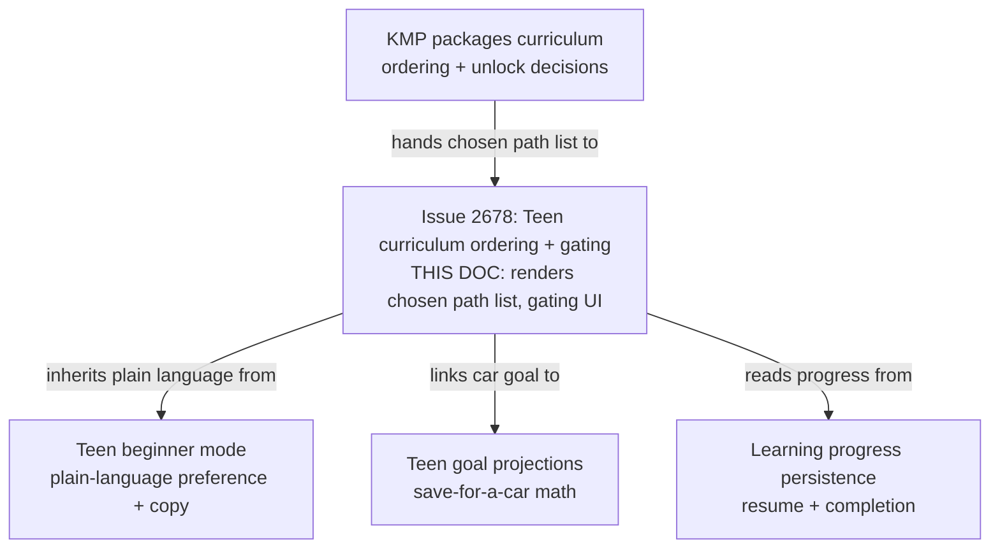
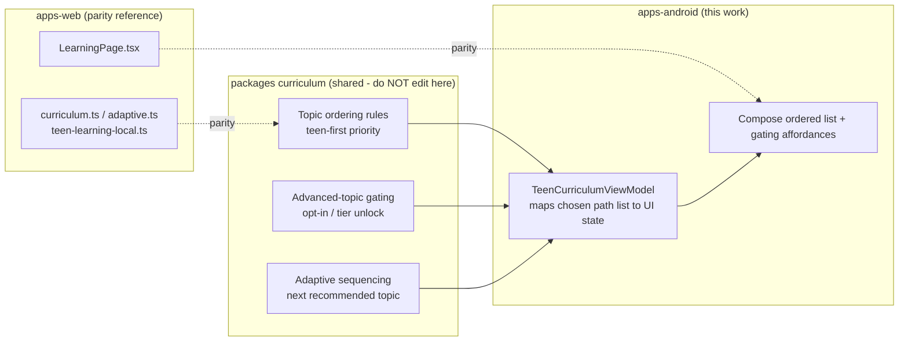
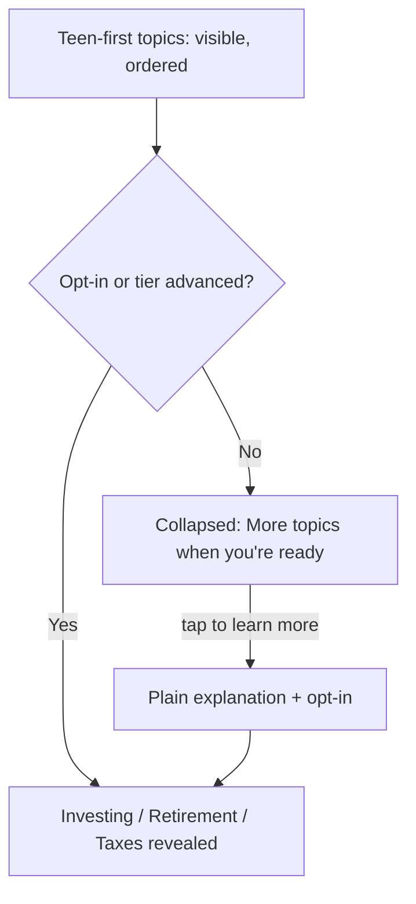

# Android Teen Curriculum Ordering & Advanced-Topic Gating

> **Status:** PROPOSED — Pending human review
> **Issue:** [#2678](https://github.com/jrmoulckers/finance/issues/2678) · Part of [#2209](https://github.com/jrmoulckers/finance/issues/2209)
> **Platform:** Android (Jetpack Compose, Material 3)
> **Last Updated:** 2026-06-22
> **Design only:** Native implementation remains blocked by [#1242](https://github.com/jrmoulckers/finance/issues/1242)

---

## Table of Contents

1. [Purpose](#purpose)
2. [Persona and Why This Matters](#persona-and-why-this-matters)
3. [Goals and Non-Goals](#goals-and-non-goals)
4. [Scope Boundaries With Sibling Work](#scope-boundaries-with-sibling-work)
5. [Curriculum Ordering Lives in KMP](#curriculum-ordering-lives-in-kmp)
6. [Teen-First Topic Order](#teen-first-topic-order)
7. [Advanced-Topic Gating](#advanced-topic-gating)
8. [Teen-Relevant Examples and Empty States](#teen-relevant-examples-and-empty-states)
9. [Privacy-First for Minors](#privacy-first-for-minors)
10. [Plain-Language Copy](#plain-language-copy)
11. [Accessibility Considerations](#accessibility-considerations)
12. [Offline, Empty, and Error States](#offline-empty-and-error-states)
13. [Test Plan](#test-plan)
14. [Implementation Readiness](#implementation-readiness)
15. [References](#references)

---

## Purpose

A teen with a **first job** does not need a retirement-account comparison on day one —
they need to understand their **paycheck**, their **debit card**, why an **impulse buy**
stings, how to **save for a car**, and the difference between **needs and wants**. This
document designs how the Android learning catalog **orders** those teen-first topics and
**gates** advanced paths (investing, retirement, tax) behind an explicit opt-in or tier
advancement — so the experience feels like _their_ money, not adult homework.

It is **design and breakdown only** while
[#1242](https://github.com/jrmoulckers/finance/issues/1242) gates Google Play
distribution. No Kotlin is written here. **Ordering and gating decisions are a shared
curriculum concern** — Compose only renders the chosen path list it is handed; it never
decides ordering or unlock rules itself.

> **Important framing:** topic ordering and gating are **curriculum rules owned by the
> shared layer**. The Android client is a renderer. Teen content uses **plain language**
> and a **privacy-first posture for minors** throughout.

---

## Persona and Why This Matters

The persona ([#2209](https://github.com/jrmoulckers/finance/issues/2209)): a teen
earning their **first paycheck**, often with a parent nearby. Their money life is
concrete and near-term — a paycheck, a debit card, a car they are saving for, the candy
aisle. Investing, retirement, and taxes are real but **distant and abstract**, and
leading with them reads as boring or intimidating. Showing the right topics in the right
order, and quietly deferring the complex ones, is what keeps a teen engaged. This
intersects with [android-teen-beginner-mode.md](android-teen-beginner-mode.md) (the
plain-language beginner posture), [android-teen-goal-projections.md](android-teen-goal-projections.md)
(saving for a car / "save X per week"), and the persistence/resume foundation in
[android-learning-progress-persistence.md](android-learning-progress-persistence.md).

---

## Goals and Non-Goals

**Goals**

- **Prioritize** teen-first topics in the catalog: **paycheck, debit card, impulse
  spending, saving for a car, and needs vs. wants**.
- **Collapse or hide** investing, retirement, and tax paths until the user **opts in**
  or **advances a tier** — never dead-ends, always a respectful "more when you're ready."
- Add **teen-relevant examples** and **empty states** that read like a teen's life, not
  adult homework.
- Render only the **shared, chosen path list** from KMP curriculum gating; keep ordering
  and unlock rules out of Compose.
- Be fully accessible (TalkBack, Switch Access, 200% font, plain language) and define
  offline/empty/error states.
- Hold a **privacy-first posture for minors** across every surface.

**Non-Goals**

- Implementing the curriculum ordering/gating engine — that is shared `packages/`
  curriculum logic (owned by @native-app-engineer), with the web learning libraries as parity.
- Owning the **beginner-mode preference** or its copy transforms — owned by
  [android-teen-beginner-mode.md](android-teen-beginner-mode.md); this doc consumes it.
- Owning **goal projections** (save-for-a-car math) — owned by
  [android-teen-goal-projections.md](android-teen-goal-projections.md).
- Owning **progress persistence / resume** — owned by
  [android-learning-progress-persistence.md](android-learning-progress-persistence.md).
- Defining parental-control account mechanics or any KYC for minors.
- Editing KMP `packages/*`, web, or any non-Android platform.

---

## Scope Boundaries With Sibling Work

This doc owns **how the chosen catalog is presented and how gating reads** to a teen.
The shared curriculum layer owns _which_ topics come in _what_ order and _when_ advanced
paths unlock. Beginner mode owns language; goal projections own the car-saving math;
persistence owns progress.

---

## Curriculum Ordering Lives in KMP

Topic priority and advanced-topic unlock rules are **business logic** and must be
shared, not hard-coded in Compose. The web parity already exists —
[`curriculum.ts`](../../apps/web/src/lib/learning/curriculum.ts),
[`adaptive.ts`](../../apps/web/src/lib/learning/adaptive.ts),
[`types.ts`](../../apps/web/src/lib/learning/types.ts), and the teen-specific
[`teen-learning-local.ts`](../../apps/web/src/lib/household/teen-learning-local.ts) —
driving [`LearningPage.tsx`](../../apps/web/src/pages/LearningPage.tsx). The Android
client consumes an **equivalent shared curriculum model** so both platforms agree on the
ordered, gated path list.

> This document **describes** the boundary. It does **not** implement curriculum
> changes — ordering/gating logic is owned by @native-app-engineer and the web learning
> libraries by @web-engineer. **Compose only renders the chosen path list**; it never
> sorts topics, decides what is "advanced," or evaluates an unlock condition. The
> existing
> [`LearningPathViewModel`](../../apps/android/src/main/kotlin/com/finance/android/ui/learning/LearningPathViewModel.kt)
> and
> [`LearningPathContent`](../../apps/android/src/main/kotlin/com/finance/android/ui/learning/LearningPathContent.kt)
> are the seams this design reuses; the ViewModel maps a shared
> `TeenCurriculumPlan` (ordered topics + gating flags) into immutable UI state.

---

## Teen-First Topic Order

The catalog leads with concrete, near-term topics. Ordering is **supplied by the shared
layer**; the table below documents the _intended_ teen-first priority the renderer
displays:

| Order | Topic                | Why it leads                                             |
| ----- | -------------------- | -------------------------------------------------------- |
| 1     | **Your paycheck**    | The first real money event; gross vs. take-home.         |
| 2     | **Your debit card**  | How spending actually happens day to day.                |
| 3     | **Impulse spending** | The candy-aisle moment; pause-before-buy.                |
| 4     | **Saving for a car** | A concrete, motivating goal (links to goal projections). |
| 5     | **Needs vs. wants**  | The framework that ties the others together.             |

- The list presents as a clear, **single-column** path with a visible "next" item, not a
  sprawling grid.
- Each item shows a short, plain title and a one-line "what you'll learn," never a wall
  of text.
- The **adaptive next topic** comes from the shared layer; the UI highlights it as a
  gentle suggestion, never a forced sequence.

---

## Advanced-Topic Gating

Investing, retirement, and tax paths are **collapsed or hidden** until the teen opts in
or advances a tier. Gating is a **respectful door, not a wall**:

- **Default:** advanced paths are collapsed under a calm, optional affordance — e.g.
  _"More topics, like investing and taxes, unlock as you go."_ Nothing flashes "locked"
  in a punitive way; there are **no countdowns and no FOMO**.
- **Opt-in:** a teen (or parent, per household setup) can choose to reveal an advanced
  path early; the copy explains in one plain line what it covers before revealing it.
- **Tier advancement:** completing the teen-first path can unlock advanced topics
  automatically, surfaced as an encouraging _"You've unlocked more"_ — recognition, not
  pressure.
- The **decision of what is gated and when** is the shared layer's; the UI only renders
  the resulting visible/collapsed/unlocked state. The renderer never hides or reveals a
  topic on its own.

---

## Teen-Relevant Examples and Empty States

Examples and empties are written for a teen's life, deliberately **not** adult homework:

- **Examples:** a paycheck from a part-time shift, a $40 impulse buy, saving $15/week
  toward a used car, choosing between a want (new game) and a need (phone bill). Dollar
  amounts are small and realistic; no mortgages, no 401(k) match math.
- **Empty states:** instead of "No data," surfaces say things like _"Nothing here yet —
  start with your paycheck"_ or _"Add what you're saving for and we'll cheer you on."_
- **Tone:** encouraging, curious, never schoolish; aligns with
  [android-teen-beginner-mode.md](android-teen-beginner-mode.md) and
  [content-language-guidelines.md](content-language-guidelines.md).

---

## Privacy-First for Minors

Because the audience includes minors, privacy is a first-class constraint, not a
footnote:

- **No behavioral profiling or ad targeting** of teens; learning activity is used only to
  sequence their own next topic.
- **Local-first:** progress and any teen-relevant examples stay on-device through the
  existing learning persistence; nothing about a minor's learning is shared externally by
  default (mirrors [android-teen-beginner-mode.md](android-teen-beginner-mode.md) and the
  household privacy posture).
- **No data exhaust in logs:** Timber never records a minor's amounts, goal targets, or
  topic-level behavior. Reward/streak hooks (if reused from
  [android-learning-rewards-gamification.md](android-learning-rewards-gamification.md))
  inherit the same minors posture.
- **Plain consent:** revealing advanced paths early is an explicit, understandable choice
  — never a silent toggle and never a default-on for minors.
- Any store-level **families-policy / data-safety** declaration is part of the
  Play-distribution tail, not buildable-now (see
  [Implementation Readiness](#implementation-readiness)).

---

## Plain-Language Copy

| Surface             | Plain-language copy                                        |
| ------------------- | ---------------------------------------------------------- |
| Path intro          | "Let's start with the money stuff you'll use right away."  |
| Next-topic hint     | "Up next: your debit card."                                |
| Advanced collapsed  | "More topics, like investing and taxes, unlock as you go." |
| Advanced opt-in     | "Want to peek at investing? Here's what it covers."        |
| Tier unlocked       | "Nice — you've unlocked more topics."                      |
| Empty (no progress) | "Nothing here yet — start with your paycheck."             |
| Empty (no car goal) | "Saving for something? Add it and we'll cheer you on."     |

Copy is short, concrete, jargon-free, and never schoolish or guilt-laden. See
[cognitive-accessibility.md](cognitive-accessibility.md),
[android-spanish-education-formatting.md](android-spanish-education-formatting.md), and
[content-language-guidelines.md](content-language-guidelines.md).

---

## Accessibility Considerations

- **TalkBack:** the path reads as an ordered list with position ("Topic 1 of 5: Your
  paycheck. What you'll learn: …"). The collapsed-advanced affordance announces its state
  ("Collapsed. More topics unlock as you go. Double-tap to learn more."), never just
  "locked."
- **Switch Access / keyboard:** linear focus order follows the visible teen-first order,
  then the advanced affordance; every reveal/opt-in control is operable without gestures.
- **200% font / large text:** single-column list reflows cleanly; titles and "what you'll
  learn" lines wrap without truncation; the advanced section expands without clipping.
- **Touch targets:** topic rows, the next-topic hint, and the advanced affordance are
  ≥ 48dp.
- **Cognitive load:** one clear path, one highlighted next step, advanced complexity kept
  out of sight until chosen — the lowest-load presentation by design.
- **Non-color cues:** "unlocked" / "collapsed" use icon + text, never color alone.
- See [accessibility-patterns.md](accessibility-patterns.md) and
  [cognitive-accessibility.md](cognitive-accessibility.md).

---

## Offline, Empty, and Error States

| State                     | Behavior                                                                                                                                          |
| ------------------------- | ------------------------------------------------------------------------------------------------------------------------------------------------- |
| **Offline**               | The full teen-first path and any unlocked advanced topics render from the last shared curriculum snapshot; learning works with no network.        |
| **Empty (new teen)**      | No progress → "Start with your paycheck" suggestion; never a blank "No data" screen.                                                              |
| **Empty (no car goal)**   | The save-for-a-car topic invites adding a goal (handing off to teen goal projections), not an error.                                              |
| **Gating not yet loaded** | Until the shared plan arrives, show the teen-first topics and keep advanced collapsed — never reveal advanced topics by guessing.                 |
| **Error**                 | If the curriculum plan can't load, show the teen-first defaults read-only with a quiet "More topics will appear shortly," never a blocking error. |

Empties and errors use plain, encouraging language and never read as failure. **No
minor's amounts, goals, or topic behavior are written to Timber** in any state (see
[Test Plan](#test-plan)).

---

## Test Plan

| Layer              | Tooling                         | What it verifies                                                                                        |
| ------------------ | ------------------------------- | ------------------------------------------------------------------------------------------------------- |
| Unit               | JUnit                           | ViewModel maps a shared `TeenCurriculumPlan` → ordered UI state; the UI never re-sorts topics.          |
| Unit               | JUnit                           | Advanced topics stay collapsed until the shared plan flags opt-in / tier unlock; UI never gates itself. |
| Unit (privacy)     | JUnit                           | No minor learning PII (amounts, goals, topic behavior) is logged or shared by default.                  |
| Unit (safety)      | JUnit                           | No Timber call logs a minor's amounts, goal targets, or behavioral detail.                              |
| Compose UI         | `createComposeRule` + semantics | Ordered path rows, next-topic hint, and collapsed/unlocked affordances resolve `contentDescription`.    |
| Compose UI         | `createComposeRule`             | Collapsed-advanced affordance announces state (not just "locked") and reveals only on opt-in.           |
| Compose UI         | `createComposeRule`             | Teen empty states render encouraging copy, not "No data."                                               |
| Snapshot           | Paparazzi                       | Teen-first path, collapsed advanced, unlocked advanced, and empties at {1x, 2x}, light/dark.            |
| Pseudolocalization | `en-XA` / `ar-XB`               | Copy expansion and RTL mirroring for topic titles, hints, and gating copy (with Spanish formatting).    |
| Accessibility      | Espresso/Accessibility checks   | TalkBack list order/position, Switch Access reachability, touch targets ≥ 48dp.                         |

---

## Implementation Readiness

This is a design artifact. Execution splits into a **buildable-now** tier and a
**Play-distribution tail** gated by
[#1242](https://github.com/jrmoulckers/finance/issues/1242). See
[../ops/human-gated-prerequisites.md](../ops/human-gated-prerequisites.md) and
[../ops/launch-readiness-plan.md](../ops/launch-readiness-plan.md).

**Buildable now — `assembleDebug` + sideload (no human gate):**

- Build the ordered teen-first path, the next-topic hint, the collapsed/opt-in/tier
  advanced-topic affordances, and teen-relevant examples/empties as Compose surfaces
  rendering a shared `TeenCurriculumPlan` (mock/in-memory while shared curriculum gating
  and KMP wiring land).
- Verify ordering display, gating presentation, minors-privacy posture, accessibility,
  and pseudolocale/expansion snapshots on a debug build / emulator.
- All of this runs on an emulator with **no signing, store credentials, or human-gated
  operations**.

**Play-distribution tail — human-gated by [#1242](https://github.com/jrmoulckers/finance/issues/1242):**

- Production signing + Play Console listing.
- Any store-level **families-policy / data-safety** declaration for an experience used by
  minors.
- Staged rollout / internal testing track.

Curriculum ordering and advanced-topic gating are delivered by the shared curriculum
layer in KMP `packages/` (the web learning libraries are the parity reference); Compose
only renders the chosen path list.

---

## References

**Design docs**

- [android-teen-beginner-mode.md](android-teen-beginner-mode.md) — plain-language beginner posture + copy
- [android-teen-goal-projections.md](android-teen-goal-projections.md) — save-for-a-car projections (#2661)
- [android-learning-progress-persistence.md](android-learning-progress-persistence.md) — progress + resume source
- [android-learning-rewards-gamification.md](android-learning-rewards-gamification.md) — reward hooks (shared minors posture)
- [android-credit-building-education.md](android-credit-building-education.md) — adjacent education content
- [android-newcomer-us-finance-education.md](android-newcomer-us-finance-education.md) — adjacent learning catalog
- [android-spanish-education-formatting.md](android-spanish-education-formatting.md) — localized education formatting
- [content-language-guidelines.md](content-language-guidelines.md) — plain, non-schoolish copy
- [cognitive-accessibility.md](cognitive-accessibility.md) — plain-language and load reduction
- [accessibility-patterns.md](accessibility-patterns.md) — screen reader, focus, touch targets
- [component-library.md](component-library.md) — list, card, disclosure components
- [information-architecture.md](information-architecture.md) — surface and navigation map
- [ux-principles.md](ux-principles.md) — product UX principles
- [personas.md](personas.md) — teen / first-job persona

**Ops**

- [../ops/human-gated-prerequisites.md](../ops/human-gated-prerequisites.md) — buildable-now vs. gated split
- [../ops/launch-readiness-plan.md](../ops/launch-readiness-plan.md) — launch checklist

**Android / web / KMP (read-only boundary)**

- [`curriculum.ts`](../../apps/web/src/lib/learning/curriculum.ts) — curriculum ordering parity (owned by @web-engineer)
- [`adaptive.ts`](../../apps/web/src/lib/learning/adaptive.ts) — adaptive next-topic parity
- [`types.ts`](../../apps/web/src/lib/learning/types.ts) — learning catalog types
- [`teen-learning-local.ts`](../../apps/web/src/lib/household/teen-learning-local.ts) — teen learning local-first parity
- [`LearningPage.tsx`](../../apps/web/src/pages/LearningPage.tsx) — web learning surface parity
- [`LearningPathViewModel.kt`](../../apps/android/src/main/kotlin/com/finance/android/ui/learning/LearningPathViewModel.kt) — learning state seam
- [`LearningPathContent.kt`](../../apps/android/src/main/kotlin/com/finance/android/ui/learning/LearningPathContent.kt) — lesson/path content model

**Issues**

- [#2678](https://github.com/jrmoulckers/finance/issues/2678) — this issue
- [#2209](https://github.com/jrmoulckers/finance/issues/2209) — parent (teen curriculum cluster)
- [#1242](https://github.com/jrmoulckers/finance/issues/1242) — Play Console + keystore (gate)
