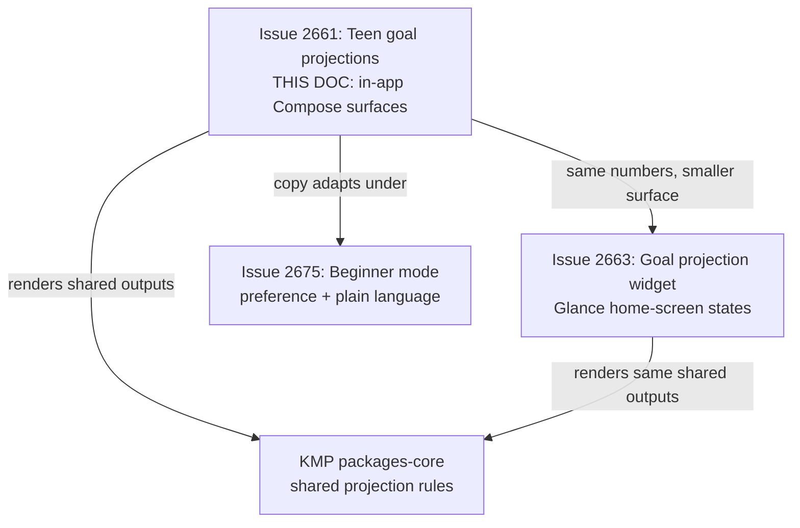
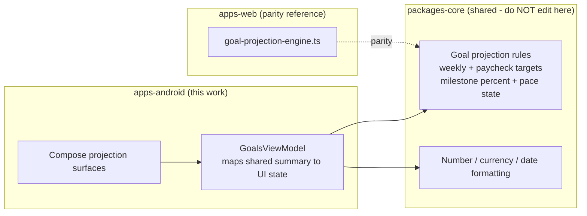
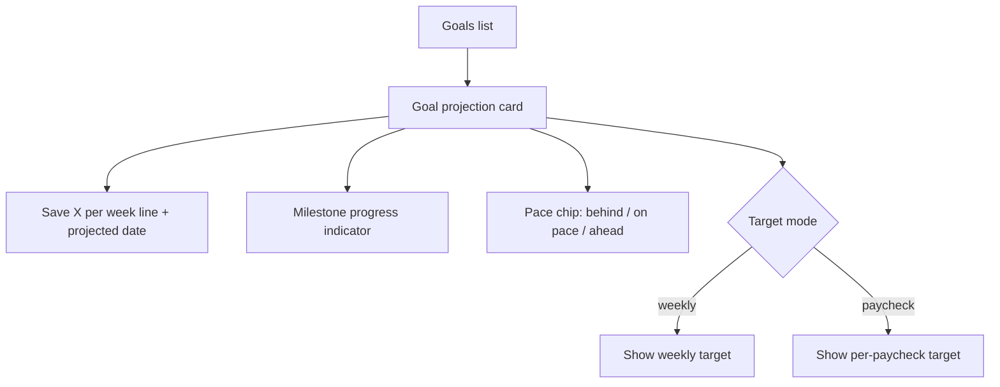
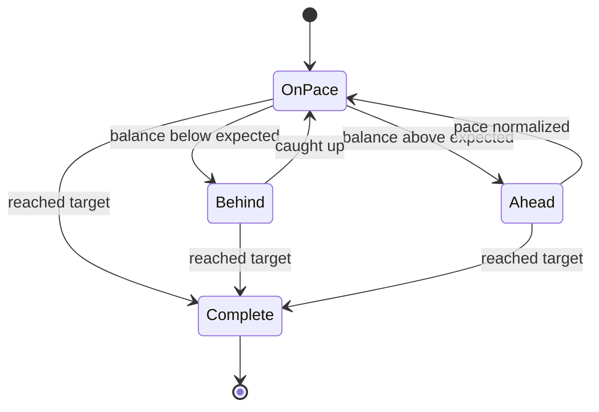

# Android Teen Goal Projections & Save-X-Per-Week UI

> **Status:** PROPOSED — Pending human review
> **Issue:** [#2661](https://github.com/jrmoulckers/finance/issues/2661) · Part of [#2207](https://github.com/jrmoulckers/finance/issues/2207)
> **Platform:** Android (Jetpack Compose, Material 3)
> **Last Updated:** 2026-06-22
> **Design only:** Native implementation remains blocked by [#1242](https://github.com/jrmoulckers/finance/issues/1242)

---

## Table of Contents

1. [Purpose](#purpose)
2. [Persona and Why This Matters](#persona-and-why-this-matters)
3. [Goals and Non-Goals](#goals-and-non-goals)
4. [Scope Boundaries With Sibling Work](#scope-boundaries-with-sibling-work)
5. [Projection Math Lives in KMP](#projection-math-lives-in-kmp)
6. [Plain-Language Copy](#plain-language-copy)
7. [Compose Surfaces](#compose-surfaces)
8. [Milestone and Pace States](#milestone-and-pace-states)
9. [Paycheck-Based Targets](#paycheck-based-targets)
10. [Estimates, Sensitivity, and Tone](#estimates-sensitivity-and-tone)
11. [Accessibility Considerations](#accessibility-considerations)
12. [Offline, Empty, and Error States](#offline-empty-and-error-states)
13. [Test Plan](#test-plan)
14. [Implementation Readiness](#implementation-readiness)
15. [References](#references)

---

## Purpose

A teen saving for a first car, a phone, or a concert ticket does not think in
"savings rate" or "time-to-goal velocity." They think: _"How much do I put aside
each week, and when do I get the thing?"_ This document designs the Compose
surfaces that answer exactly those two questions for the **top goals** on Android,
using teen-friendly, plain-language copy and clearly labelled **estimates**.

It is **design and breakdown only** while [#1242](https://github.com/jrmoulckers/finance/issues/1242)
gates Google Play distribution. No Kotlin is written here, and no finance math is
implemented in Compose — the projection logic is a **shared KMP concern**, with the
web `goal-projection-engine` as the parity reference.

---

## Persona and Why This Matters

The persona ([#2207](https://github.com/jrmoulckers/finance/issues/2207)): a teen or
beginner saver who is motivated by a concrete _thing_ and a concrete _date_, not by
abstract financial dashboards. They benefit from a single, confident sentence —
"Save $25/week to get your car by Aug 2027" — far more than from a chart full of
projections. This intersects with [Persona 4: Casey](personas.md) (plain language,
low cognitive load) and the broader beginner-mode work in
[android-teen-beginner-mode.md](android-teen-beginner-mode.md).

> **Important framing:** every date and dollar figure on these surfaces is an
> **estimate**, visibly labelled as such, and never a promise. See
> [Estimates, Sensitivity, and Tone](#estimates-sensitivity-and-tone).

---

## Goals and Non-Goals

**Goals**

- Show **save-$X/week** and a **projected completion date** for each top goal.
- Offer a **paycheck-based target** option alongside the weekly target.
- Provide **behind / on-pace / ahead** messaging in encouraging, non-judgmental copy.
- Define **milestone checkpoints** (first deposit, quarter, halfway, almost there,
  done) and the catch-up language used when a saver falls behind.
- Keep parity with the web `GoalProjection` surface so the two platforms agree.

**Non-Goals**

- Implementing or editing the projection math (lives in KMP `packages/core`; the web
  engine is the parity reference — see [Projection Math Lives in KMP](#projection-math-lives-in-kmp)).
- The home-screen Glance widget rendering of these outputs — owned by
  [android-goal-projection-widget.md](android-goal-projection-widget.md).
- Beginner-mode preference plumbing and jargon-to-plain copy mapping — owned by
  [android-teen-beginner-mode.md](android-teen-beginner-mode.md).
- Editing KMP `packages/*`, web, or any non-Android platform.

---

## Scope Boundaries With Sibling Work

This doc owns the **in-app, full-screen Compose** projection experience. The compact
home-screen rendering is the widget doc; the preference that flips copy into
plain-language teen mode is the beginner-mode doc. All three consume the **same**
shared projection outputs.

---

## Projection Math Lives in KMP

The projection calculation is **business logic** and must be shared, not duplicated
in Compose. The web reference already exists as
[`goal-projection-engine.ts`](../../apps/web/src/lib/savings/goal-projection-engine.ts),
which produces a summary of `weeklyTargetCents`, `paycheckTargetCents`,
`milestonePercent`, a `state` of `behind | on-track | ahead | complete`, and a
`messageToken`. The Android client should consume an **equivalent shared model from
KMP `packages/core`** so both platforms agree on every number and every state.

> This document **describes** the boundary. It does **not** implement KMP changes —
> `packages/core` is owned by @kmp-engineer, and the web engine is owned by
> @web-engineer. Compose is a pure renderer of shared state. The current
> [`Goal`](../../packages/models/src/commonMain/kotlin/com/finance/models/Goal.kt)
> model already carries `targetAmount`, `currentAmount`, and `targetDate`, which are
> the inputs a shared projection needs.

---

## Plain-Language Copy

Copy is the product here. Every string below is a placeholder for a localized,
resource-backed string and follows [content-language-guidelines.md](content-language-guidelines.md).

| Context             | Plain-language copy (example)                            |
| ------------------- | -------------------------------------------------------- |
| Primary target line | "Save $25/week to get your car by Aug 2027"              |
| Paycheck target     | "That's about $50 from each paycheck"                    |
| On pace             | "Nice — you're on track for Aug 2027"                    |
| Ahead               | "You're ahead! You could reach this sooner"              |
| Behind (catch-up)   | "A little behind — save $35/week to still make Aug 2027" |
| No date yet         | "Add a target date to see your weekly plan"              |
| Complete            | "Goal reached. You did it!"                              |

**Copy rules**

- Lead with the **action and the reward** ("Save $X/week to get your car").
- Behind messaging is **catch-up, never shame**: it offers a new weekly number, not
  a verdict.
- Always pair an estimate with the word "about," "around," or an explicit
  "Estimate" label so the number never reads as a guarantee.
- Reuse non-judgmental goal-progress patterns from
  [content-language-guidelines.md](content-language-guidelines.md).

---

## Compose Surfaces

Two Compose surfaces, both pure renderers of shared state, slotting into the
existing [`GoalsScreen`](../../apps/android/src/main/kotlin/com/finance/android/ui/screens/GoalsScreen.kt):

1. **Goal projection card** (in the goals list / goal detail): the primary
   save-$X/week line, projected date, a milestone progress indicator, and the pace
   chip.
2. **Target-mode toggle**: lets the saver switch between a **weekly** and a
   **per-paycheck** target without changing any underlying number — it only reframes
   the same remaining amount.

Progress and pace visuals follow [data-visualization.md](data-visualization.md) and
the progress/ring guidance in [chart-component-specs.md](chart-component-specs.md);
they never rely on color alone (see [Accessibility](#accessibility-considerations)).

---

## Milestone and Pace States

Milestone checkpoints give a teen a sense of momentum between "0" and "done." They
are derived from the shared `milestonePercent`; Compose only chooses a label.

| Milestone     | Trigger (shared %) | Teen-friendly label          |
| ------------- | ------------------ | ---------------------------- |
| First deposit | > 0%               | "You started — nice!"        |
| Quarter       | ≥ 25%              | "A quarter of the way there" |
| Halfway       | ≥ 50%              | "Halfway! Keep going"        |
| Almost there  | ≥ 75%              | "So close now"               |
| Done          | 100%               | "Goal reached. You did it!"  |

Pace states map directly from the shared engine `state`:

- **Behind** shows the **catch-up** weekly number, never a red "failure" framing.
- **Ahead** is celebratory but honest ("you could reach this sooner").
- **Complete** is a clear win state with no further nagging.

---

## Paycheck-Based Targets

Many teens are paid per shift or per paycheck rather than weekly, so a per-paycheck
target is often more actionable. The shared engine already exposes a
`paycheckTargetCents` derived from a paychecks-remaining input; Compose renders it as
"about $X from each paycheck." The number of remaining paychecks is a **shared input**
(pay cadence), not something Compose computes. When pay cadence is unknown, hide the
paycheck option rather than guessing, and keep the weekly target as the default.

---

## Estimates, Sensitivity, and Tone

This is a minor-facing, money-adjacent surface. Non-negotiables:

- **Label every estimate.** Dates and weekly/paycheck amounts are projections, shown
  with "about/around" or an explicit "Estimate" label — never a promise.
- **No advice framing.** This shows a plan to hit the saver's _own_ goal; it never
  recommends financial products or actions.
- **Encouraging, non-judgmental tone** per
  [content-language-guidelines.md](content-language-guidelines.md): falling behind is
  normal and recoverable; the surface offers a next step, not a scolding.
- **Privacy-first for minors.** Never log goal names, balances, target amounts, or
  projected dates through Timber — calls must omit them. No analytics on a minor's
  goal contents.
- **No dark patterns.** No urgency countdowns, no "you'll fail" pressure, no upsell.

---

## Accessibility Considerations

- **TalkBack:** the projection card exposes one cohesive `contentDescription` that
  reads the plain-language plan first ("Save about $25 a week to reach your car goal,
  estimated August 2027, you're on pace"), then the milestone. The pace chip and the
  target-mode toggle each carry their own label.
- **Switch Access:** the target-mode toggle and any "see details" affordance are
  reachable and operable with touch targets ≥ 48dp.
- **Font scaling:** the save-$X/week line and projected date stay readable and
  unclipped at **200%** font scale; no fixed-height containers around currency or
  date text.
- **Plain language / cognitive load:** one plan per card, short sentences, the most
  important number first — aligned with [cognitive-accessibility.md](cognitive-accessibility.md).
- **Non-color cues:** behind / on-pace / ahead are conveyed with text and an icon,
  never color alone, per [data-visualization.md](data-visualization.md).
- See [accessibility-patterns.md](accessibility-patterns.md) for the underlying
  screen-reader, focus, and touch-target patterns.

---

## Offline, Empty, and Error States

- **Offline:** projections are computed from already-synced goal data, so the card
  must render fully **offline** using the last-known shared summary. Show the
  freshness of the underlying data rather than blocking the plan.
- **Empty (no goal):** show a friendly empty state inviting the saver to create a
  goal ("Pick something to save for and we'll show your weekly plan"), not a blank
  card.
- **Empty (no target date):** show the weekly plan as soon as an amount exists, and
  prompt "Add a target date to see your finish date" rather than a silent gap.
- **Error:** if the shared summary cannot be produced (e.g. malformed inputs), fail
  safe to the raw progress ("$X of $Y saved") with a quiet "Plan unavailable right
  now" message — never a stack trace, never a blank screen.

---

## Test Plan

| Layer              | Tooling                         | What it verifies                                                                   |
| ------------------ | ------------------------------- | ---------------------------------------------------------------------------------- |
| Unit               | JUnit                           | ViewModel maps shared summary → UI state for behind/on-track/ahead/complete.       |
| Unit (safety)      | JUnit                           | Every projected number renders with an estimate label; no Timber logs goal data.   |
| Compose UI         | `createComposeRule` + semantics | Save-$X/week line, pace chip, milestone, and toggle resolve `contentDescription`.  |
| Compose UI         | `createComposeRule`             | Target-mode toggle swaps weekly ↔ paycheck without changing remaining amount.      |
| Snapshot           | Paparazzi                       | Card in behind/on-pace/ahead/complete + no-date + empty at `{1x, 2x}`, light/dark. |
| Pseudolocalization | `en-XA` / `ar-XB`               | Copy expansion and mirroring for the plan sentence.                                |
| Accessibility      | Espresso/Accessibility checks   | TalkBack order, Switch Access reachability, touch targets ≥ 48dp.                  |

---

## Implementation Readiness

This is a design artifact. Execution splits into a **buildable-now** tier and a
**Play-distribution tail** gated by
[#1242](https://github.com/jrmoulckers/finance/issues/1242). See
[../ops/human-gated-prerequisites.md](../ops/human-gated-prerequisites.md) and
[../ops/launch-readiness-plan.md](../ops/launch-readiness-plan.md).

**Buildable now — `assembleDebug` + sideload (no human gate):**

- Build the projection card and target-mode toggle as Compose surfaces that render a
  shared projection summary (mock/in-memory data while KMP wiring lands).
- Verify milestone/pace states, plain-language copy, accessibility, and
  pseudolocale/expansion snapshots on a debug build / emulator.
- All of this runs on an emulator with **no signing, store credentials, or
  human-gated operations**.

**Play-distribution tail — human-gated by [#1242](https://github.com/jrmoulckers/finance/issues/1242):**

- Production signing + Play Console listing.
- Any store-level content/data-safety declaration touching minors' financial data.
- Staged rollout / internal testing track.

The shared projection model is delivered by KMP `packages/core` (the web
`goal-projection-engine` is the parity reference); Compose stays render-only.

---

## References

**Design docs**

- [android-goal-projection-widget.md](android-goal-projection-widget.md) — home-screen widget states (#2663)
- [android-teen-beginner-mode.md](android-teen-beginner-mode.md) — beginner mode + plain language (#2675)
- [content-language-guidelines.md](content-language-guidelines.md) — non-judgmental, plain copy
- [cognitive-accessibility.md](cognitive-accessibility.md) — plain-language and load reduction
- [accessibility-patterns.md](accessibility-patterns.md) — screen reader, focus, touch targets
- [data-visualization.md](data-visualization.md) — progress visuals, non-color cues
- [chart-component-specs.md](chart-component-specs.md) — progress ring/bar specs
- [information-architecture.md](information-architecture.md) — surface and navigation map
- [ux-principles.md](ux-principles.md) — product UX principles
- [personas.md](personas.md) — Persona 4 (Casey)

**Ops**

- [../ops/human-gated-prerequisites.md](../ops/human-gated-prerequisites.md) — buildable-now vs. gated split
- [../ops/launch-readiness-plan.md](../ops/launch-readiness-plan.md) — launch checklist

**Android / web / KMP (read-only boundary)**

- [`goal-projection-engine.ts`](../../apps/web/src/lib/savings/goal-projection-engine.ts) — web parity reference (owned by @web-engineer)
- [`GoalProjection.tsx`](../../apps/web/src/components/savings/GoalProjection.tsx) — web projection UI parity
- [`GoalsScreen.kt`](../../apps/android/src/main/kotlin/com/finance/android/ui/screens/GoalsScreen.kt) — host surface
- [`Goal.kt`](../../packages/models/src/commonMain/kotlin/com/finance/models/Goal.kt) — shared goal model (owned by @kmp-engineer)

**Issues**

- [#2661](https://github.com/jrmoulckers/finance/issues/2661) — this issue
- [#2207](https://github.com/jrmoulckers/finance/issues/2207) — parent (teen goal cluster)
- [#1242](https://github.com/jrmoulckers/finance/issues/1242) — Play Console + keystore (gate)
