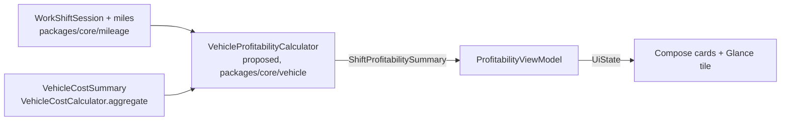
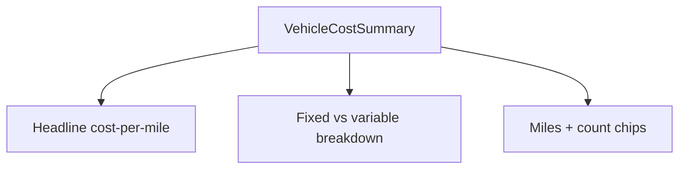
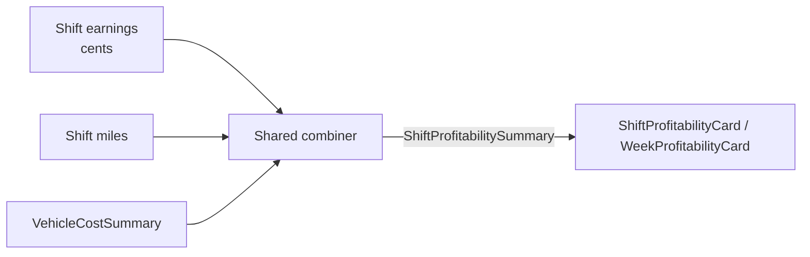

# Android — Vehicle Cost-Per-Mile Profitability Surfaces

> **Status:** DRAFT — design only (pending human review)
> **Owner:** @native-app-engineer
> **Issue:** [#2522](https://github.com/jrmoulckers/finance/issues/2522) · **Part of** [#2139](https://github.com/jrmoulckers/finance/issues/2139)
> **Platform:** Android phone (Jetpack Compose · Material 3 · Glance) · **minSdk 28 / compile-target 35**
> **Last Updated:** 2026-06-22

This document specifies the **design** for Android **cost-per-mile cards** and **shift / week
profitability** surfaces that answer the [#2139](https://github.com/jrmoulckers/finance/issues/2139)
question: _"was this shift profitable?"_ It reads earnings and miles already captured elsewhere,
combines them with **shared vehicle-cost calculations**, and renders the result. Compose owns **no**
finance math.

It is **design + breakdown only**. The Compose cards and Glance plumbing are **buildable now** in a
debug build (`assembleDebug` sideload); only **Play Store distribution** is human-gated by
[#1242](https://github.com/jrmoulckers/finance/issues/1242). See
[§10 Implementation readiness](#10-implementation-readiness) and
[`../ops/human-gated-prerequisites.md`](../ops/human-gated-prerequisites.md). All effort figures are
**estimates**.

---

## Table of Contents

- [1. Goals & Non-Goals](#1-goals--non-goals)
- [2. KMP / Compose Boundary](#2-kmp--compose-boundary)
- [3. Surfaces — Cards & Integrations](#3-surfaces--cards--integrations)
- [4. Shared Dependencies](#4-shared-dependencies)
- [5. Cost-Per-Mile Card](#5-cost-per-mile-card)
- [6. Shift & Week Profitability](#6-shift--week-profitability)
- [7. State Model — Offline / Empty / Error](#7-state-model--offline--empty--error)
- [8. Accessibility (TalkBack, Switch Access, Font Scaling)](#8-accessibility-talkback-switch-access-font-scaling)
- [9. Test Plan](#9-test-plan)
- [10. Implementation readiness](#10-implementation-readiness)
- [11. Open Questions](#11-open-questions)

---

## 1. Goals & Non-Goals

### Goals

- Show a **cost-per-mile card**: total operating cost-per-mile and a **fixed vs. variable** breakdown,
  sourced from the shared `VehicleCostSummary`.
- Show **cost per active shift** and **profitability per shift / per week** by combining shared vehicle
  cost with shift earnings and miles.
- Integrate the profitability read-out into the **shift summary** and a **dashboard card**, and offer
  an optional **Glance home-screen tile**.
- Keep **all** cost-per-mile and profitability arithmetic in **KMP `packages/core`** — Compose renders.

### Non-Goals

- **Logging** vehicle costs, profiles, or maintenance reminders — owned by the companion doc
  [Vehicle expense & maintenance logging](./android-vehicle-expense-maintenance-logging.md)
  ([#2521](https://github.com/jrmoulckers/finance/issues/2521)).
- **Capturing** miles / shifts — owned by [Shift mileage flow](./android-shift-mileage-flow.md) and
  [Mileage presets & IRS export](./android-mileage-presets-irs-export.md); this doc consumes their
  output (`WorkShiftSession`, miles).
- **Computing** any new profitability number in Compose. The profitability combiner is shared
  (see [§2](#2-kmp--compose-boundary)).
- Tax-reserve and take-home calculations — see
  [Gig take-home summary](./android-gig-take-home-summary.md); profitability here is pre-tax operating
  profit and links out for the rest.

---

## 2. KMP / Compose Boundary

Cost-per-mile already exists in **KMP `packages/core/vehicle`** via
`VehicleCostCalculator.aggregate(...)` → `VehicleCostSummary` (which carries `costPerMileCents`,
`fixedCostCents`, `variableCostCents`, business-allocated variants, and counts). The **profitability
combiner** — vehicle cost ⊕ shift earnings ⊕ miles → "profitable?" — is **domain logic** and must also
live in KMP. Compose only renders.

| Concern                                                  | Owner   | Symbol / location                                                                          |
| -------------------------------------------------------- | ------- | ------------------------------------------------------------------------------------------ |
| Aggregated vehicle cost & cost-per-mile                  | KMP     | `VehicleCostCalculator.aggregate(...)` → `VehicleCostSummary` (`com.finance.core.vehicle`) |
| Fixed vs. variable split, fuel/repair/maintenance totals | KMP     | fields on `VehicleCostSummary`                                                             |
| Business-use allocation                                  | KMP     | `BusinessUseAllocation`, `VehicleCostCalculator.allocateBusinessCost(...)`                 |
| Miles per shift / week                                   | KMP     | `WorkShiftSession`, `MileageCalculator.summarizeShift(...)` (`com.finance.core.mileage`)   |
| **Shift / week profitability combiner**                  | KMP     | **proposed** shared projection (see note below) — **not** implemented in Android           |
| Currency / number / percent formatting                   | KMP     | `com.finance.core.i18n.NumberFormatting`, `com.finance.core.currency.CurrencyFormatter`    |
| Cards, integration points, Glance tile                   | Android | `apps/android/...` (this doc)                                                              |

Source of truth:
[`VehicleCostCalculator.kt`](../../packages/core/src/commonMain/kotlin/com/finance/core/vehicle/VehicleCostCalculator.kt),
[`VehicleModels.kt`](../../packages/core/src/commonMain/kotlin/com/finance/core/vehicle/VehicleModels.kt).

> **Proposed shared combiner (out of scope to implement here — flag `@native-app-engineer`):** a
> `VehicleProfitabilityCalculator` in `packages/core/vehicle` that takes a `VehicleCostSummary` plus
> shift/week earnings (cents) and miles, and returns a `ShiftProfitabilitySummary`
> (`earningsCents`, `vehicleCostCents`, `operatingProfitCents`, `costPerMileCents`,
> `profitPerMileCents`, `costPerShiftCents`, `breakEvenMiles`). Android **must not** add this math —
> it renders the returned summary. This doc defines the **Android consumption contract** only.

> **Rule:** Compose never subtracts cost from earnings, never divides by miles, never rounds money.
> If a number is not already on a shared summary, the fix is a **KMP** change, not Compose arithmetic.

---

## 3. Surfaces — Cards & Integrations

All new, all Compose — **no XML layouts**.

| Surface                      | Type                          | Responsibility                                                                |
| ---------------------------- | ----------------------------- | ----------------------------------------------------------------------------- |
| `CostPerMileCard`            | Composable                    | Cost-per-mile + fixed/variable breakdown from `VehicleCostSummary`.           |
| `ShiftProfitabilityCard`     | Composable                    | Per-shift earnings vs. cost, operating profit, profit/mile, break-even miles. |
| `WeekProfitabilityCard`      | Composable                    | Same read-out aggregated over a week; trend vs. prior week.                   |
| Shift summary integration    | Composable (host) edit-point  | Embeds `ShiftProfitabilityCard` into the existing shift-end summary.          |
| Dashboard integration        | Composable (host) edit-point  | Adds an at-a-glance profitability card to the home dashboard.                 |
| `VehicleProfitabilityWidget` | Glance widget (optional)      | Home-screen cost-per-mile / week-profit tile; reads shared summary.           |
| `ProfitabilityViewModel`     | `ViewModel` (`koinViewModel`) | Collects cost + mileage state; calls the shared combiner; exposes `UiState`.  |
| `ProfitabilityModule`        | Koin module                   | `viewModelOf(::ProfitabilityViewModel)` and shared-calculator wiring.         |

Integration points are **additive** — new cards slot into existing summary/dashboard hosts; this doc
does not redesign those screens. Cross-links:
[Shift mileage flow](./android-shift-mileage-flow.md) (shift summary host),
[Gig take-home summary](./android-gig-take-home-summary.md) (earnings/take-home context),
[Operating cash calendar](./android-operating-cash-calendar.md) (week framing),
[Food-truck P&L report](./android-foodtruck-pnl-report.md) (small-business profitability sibling).

---

## 4. Shared Dependencies

| Dependency                                          | Use                                                | Notes                                            |
| --------------------------------------------------- | -------------------------------------------------- | ------------------------------------------------ |
| `VehicleCostCalculator`, `VehicleCostSummary` (KMP) | Cost-per-mile + fixed/variable + totals            | Already present in `packages/core`.              |
| `MileageCalculator`, `WorkShiftSession` (KMP)       | Miles per shift / week                             | Read-only; owned by mileage docs.                |
| Proposed `VehicleProfitabilityCalculator` (KMP)     | Combine cost + earnings + miles → profitability    | **@native-app-engineer**; not implemented here.  |
| `NumberFormatting` / `CurrencyFormatter` (KMP)      | Locale-aware money / percent strings               | Compose never builds money strings.              |
| Koin 4.0.1 (`koin-compose-viewmodel`)               | DI for ViewModel                                   | `koinViewModel()` in Composables.                |
| Glance (optional widget)                            | Home-screen profitability tile                     | Debug-implementable plumbing.                    |
| Timber 5.0.1                                        | Structured logs (never `Log.*`, never log amounts) | See [§7](#7-state-model--offline--empty--error). |

---

## 5. Cost-Per-Mile Card

`CostPerMileCard` renders a single `VehicleCostSummary` for the chosen window/vehicle:

- **Headline:** `costPerMileCents` formatted via shared formatter, e.g. "$0.51 / mile" (business-use
  variant `businessAllocatedCostPerMileCents` shown when allocation < 100%).
- **Breakdown:** **fixed vs. variable** using `fixedCostCents`, `variableCostCents`, `fuelCostCents`,
  `repairCostCents`, `maintenanceReserveCents`. The split is **read** from the summary — Compose does
  not re-sum.
- **Miles + count chips:** `totalMiles`, plus `fillUpCount` / `repairCount` for context.
- **Zero-miles guard:** when `totalMiles == 0`, the shared calculator returns `0` cost-per-mile; the
  card shows "—" with a caption "Log miles to see cost per mile" rather than a misleading $0.00.

---

## 6. Shift & Week Profitability

The profitability cards render the **proposed shared** `ShiftProfitabilitySummary` (see
[§2](#2-kmp--compose-boundary)):

- **Cost per active shift** = vehicle cost attributed to the shift window, from the shared combiner.
- **Operating profit** = earnings − vehicle cost (computed in KMP); shown with a clear
  profitable / break-even / loss state.
- **Profit per mile** and **break-even miles** give the driver a fast "was it worth it?" read.
- **Week view** aggregates the same fields and shows a **trend vs. prior week** (delta computed in
  KMP).

**State cues (no color-only):** profitable / break-even / loss are conveyed by **text + icon +
container shape**, never hue alone; AA contrast across light / dark / OLED. An "estimate" caption is
shown whenever miles or costs are partial (e.g. a fill-up without odometer).

> **Boundary reminder:** earnings come from the gig/earnings domain, miles from the mileage domain,
> and cost from `VehicleCostSummary`; the **only** place they are combined is the shared combiner.
> Android passes the three inputs and renders one summary.

---

## 7. State Model — Offline / Empty / Error

| Scenario                    | Behavior                                                                                                                                     |
| --------------------------- | -------------------------------------------------------------------------------------------------------------------------------------------- |
| **Offline**                 | Cards render from locally stored cost + shift data; no network needed; a small "Offline" chip with `contentDescription`.                     |
| **No vehicle / no costs**   | Cards show a guidance empty state linking to [logging](./android-vehicle-expense-maintenance-logging.md) ("Add costs to see profitability"). |
| **No shifts / zero miles**  | Profitability shows "—" with "Log a shift to see profit per mile"; cost-per-mile guarded to "—" (KMP returns 0).                             |
| **Partial data (estimate)** | Cards render with an explicit **"Estimate"** caption when inputs are incomplete; never silently imply precision.                             |
| **Stale Glance tile**       | Tile shows a "last updated" timestamp; refreshed via WorkManager/Glance update, never AlarmManager.                                          |
| **Combiner / data error**   | Card shows a non-blocking error state + Retry; `Timber.e(t, "Profitability render failed")` — **never** log amounts/earnings.                |

> **Logging rule:** Timber only — never `Log.*`. Never log earnings, costs, profit, or miles. Event
> names and non-sensitive identifiers only.

---

## 8. Accessibility (TalkBack, Switch Access, Font Scaling)

- **`contentDescription` on every card and chip** — e.g. "Cost per mile, about 51 cents", "Operating
  profit this shift, 38 dollars, profitable".
- **Merged semantics** so a profitability card reads as one coherent sentence, not glyph-by-glyph;
  trend deltas read as "up 6 dollars versus last week".
- **State announced**, not just shown: profitable / break-even / loss are part of the spoken label and
  carry a non-color icon.
- **Switch Access:** cards expose a single actionable focus (e.g. "View breakdown"); breakdown rows
  are individually focusable with clear labels.
- **Font scaling verified at 200%:** headline + breakdown reflow without truncation; numbers wrap
  gracefully; the Glance tile degrades to a compact layout.
- **Charts/visuals** (if any) provide a text alternative summarizing the same numbers (see
  [Data visualization](./data-visualization.md)).

See [Accessibility Patterns Library](./accessibility-patterns.md) and
[Cognitive Accessibility Mode](./cognitive-accessibility.md).

---

## 9. Test Plan

| Layer                | Tool                                                          | Coverage                                                                                                            |
| -------------------- | ------------------------------------------------------------- | ------------------------------------------------------------------------------------------------------------------- |
| KMP math (reference) | existing vehicle tests + new combiner tests (`packages/core`) | `aggregate`, cost-per-mile, and the proposed combiner — owned by `@native-app-engineer`, Android does not re-assert |
| ViewModel            | JUnit + Turbine                                               | `ProfitabilityUiState` emissions; combiner called with correct inputs; no Compose-side math                         |
| Card rendering       | `createComposeRule`                                           | Cost-per-mile, fixed/variable split, profit/break-even/loss states, "estimate" caption                              |
| Empty / zero-miles   | Compose UI                                                    | "—" and guidance states; no misleading $0.00                                                                        |
| Glance widget        | Glance test + instrumented                                    | Tile renders shared summary; "last updated"; WorkManager refresh                                                    |
| Accessibility        | semantics assertions + Accessibility Scanner                  | `contentDescription`, spoken state, 200% font scale                                                                 |
| Snapshot             | **Paparazzi**                                                 | Cost-per-mile, shift profit (profitable/break-even/loss), week trend — light / dark / OLED + 200% font + RTL        |
| Edge cases           | unit + UI                                                     | Zero miles, partial inputs (estimate), negative/loss profit, business-use < 100%, stale tile                        |

---

## 10. Implementation readiness

**Design + breakdown only** for this issue. Per the
[Human-Gated Prerequisites runbook](../ops/human-gated-prerequisites.md), "blocked by #1242" gates
**only distribution**, not implementation
([decoupling §2](../ops/human-gated-prerequisites.md#2-implementation-vs-distribution--the-decoupling)).

| Phase                                                             | Status                                                                  | Notes                                                                             |
| ----------------------------------------------------------------- | ----------------------------------------------------------------------- | --------------------------------------------------------------------------------- |
| **Design** (this doc)                                             | ✅ Deliverable now                                                      | No accounts/secrets needed.                                                       |
| **Shared combiner** (`VehicleProfitabilityCalculator`, KMP)       | ⏳ KMP prerequisite                                                     | `@native-app-engineer` adds it in `packages/core`; Android renders its output.    |
| **Implementation** (Compose cards, integration points, ViewModel) | ✅ Buildable now                                                        | `./gradlew :apps:android:assembleDebug` + sideload; cost-per-mile already shared. |
| **Glance profitability tile** (optional)                          | ✅ Buildable now                                                        | Glance widget plumbing is debug-implementable.                                    |
| **Local tests** (unit / Compose / Paparazzi)                      | ✅ Runnable now                                                         | No enrollment.                                                                    |
| **Distribution** (Play Store, release signing)                    | 🔒 Gated by [#1242](https://github.com/jrmoulckers/finance/issues/1242) | Google Play enrollment, keystore, CI secrets — **human-gated**.                   |

**Buildable-now scope (estimate):** the cost-per-mile card and fixed/variable breakdown render today
against the existing shared `VehicleCostSummary`; profitability cards render as soon as the proposed
KMP combiner lands. The optional Glance tile is debug-implementable. None require a paid entitlement.

**Distribution tail (human action required):** Play Store release and signing depend on the #1242
prerequisites in
[§3.1 of the runbook](../ops/human-gated-prerequisites.md#31-android-distribution--google-play-1242).
No AI agent performs those steps.

---

## 11. Open Questions

- Which window defines "a shift's vehicle cost" — the trips' time window, or a daily/period
  proration? Proposed: the shared combiner takes explicit miles + period earnings; the **proration
  rule lives in KMP**, not Android.
- Should break-even be expressed in **miles** or **dollars**? Proposed: surface both from the shared
  summary; Compose chooses presentation only.
- Does the week trend belong here or on the dashboard? Proposed: same card, embedded in both hosts.

---

_Part of [#2139](https://github.com/jrmoulckers/finance/issues/2139). Companion designs:
[Vehicle expense & maintenance logging](./android-vehicle-expense-maintenance-logging.md) ·
[Shift mileage flow](./android-shift-mileage-flow.md) ·
[Gig take-home summary](./android-gig-take-home-summary.md)._
