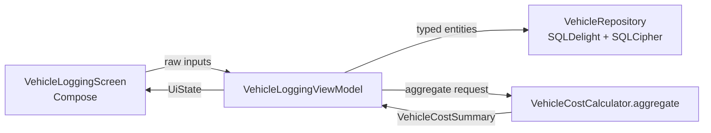
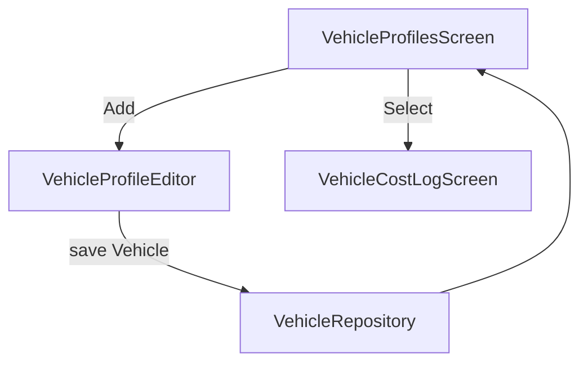
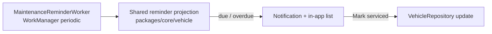

# Android — Vehicle Expense & Maintenance Logging

> **Status:** DRAFT — design only (pending human review)
> **Owner:** @native-app-engineer
> **Issue:** [#2521](https://github.com/jrmoulckers/finance/issues/2521) · **Part of** [#2139](https://github.com/jrmoulckers/finance/issues/2139)
> **Platform:** Android phone (Jetpack Compose · Material 3 · Glance) · **minSdk 28 / compile-target 35**
> **Last Updated:** 2026-06-22

This document specifies the **design** for logging a driver's true vehicle operating costs on Android:
**vehicle profiles**, quick entry for **gas / repair / insurance / phone allocation**, and
**odometer- and date-driven maintenance reminders**. "My car is the business" — gas, tires, oil
changes, insurance, and phone usage all decide whether driving is profitable
([#2139](https://github.com/jrmoulckers/finance/issues/2139)).

It is **design + breakdown only**. The Compose surfaces, local persistence, and reminder plumbing are
**buildable now** in a debug build (`assembleDebug` sideload); only **Play Store distribution** is
human-gated by [#1242](https://github.com/jrmoulckers/finance/issues/1242). See
[§11 Implementation readiness](#11-implementation-readiness) and
[`../ops/human-gated-prerequisites.md`](../ops/human-gated-prerequisites.md). All effort figures are
**estimates**.

---

## Table of Contents

- [1. Goals & Non-Goals](#1-goals--non-goals)
- [2. KMP / Compose Boundary](#2-kmp--compose-boundary)
- [3. Affected Android Surfaces](#3-affected-android-surfaces)
- [4. Shared Dependencies](#4-shared-dependencies)
- [5. Vehicle Profiles](#5-vehicle-profiles)
- [6. Cost Entry — Gas, Repair, Insurance, Phone Allocation](#6-cost-entry--gas-repair-insurance-phone-allocation)
- [7. Maintenance Reminders (Odometer + Recent Spend)](#7-maintenance-reminders-odometer--recent-spend)
- [8. State Model — Offline / Empty / Error](#8-state-model--offline--empty--error)
- [9. Accessibility (TalkBack, Switch Access, Font Scaling)](#9-accessibility-talkback-switch-access-font-scaling)
- [10. Test Plan](#10-test-plan)
- [11. Implementation readiness](#11-implementation-readiness)
- [12. Open Questions](#12-open-questions)

---

## 1. Goals & Non-Goals

### Goals

- Create and edit **vehicle profiles** (display name, optional make/model/year) on Android.
- Provide **low-friction logging** for the cost types that decide profitability:
  - **Gas fill-ups** (cost, gallons, optional odometer/vendor).
  - **Repairs** (mechanical, body, tires, diagnostic).
  - **Fixed costs** (insurance, registration, loan/lease, depreciation, permits, parking subscriptions).
  - **Variable costs** (tolls, parking, car washes, supplies).
  - **Phone allocation** — the business-use share of a phone bill applied to vehicle operating cost.
- Define **maintenance reminders** from odometer milestones (service intervals) and recent spend.
- Persist everything **offline-first**; never block entry on connectivity.
- Render all monetary math from **shared KMP state** — Compose never owns the finance math.

### Non-Goals

- **Cost-per-mile cards and shift/week profitability** surfaces — covered by the companion doc
  [Vehicle cost-per-mile profitability surfaces](./android-vehicle-cost-per-mile.md)
  ([#2522](https://github.com/jrmoulckers/finance/issues/2522)).
- **Mileage capture** (start/pause/end shift, odometer vs. direct miles) — owned by
  [Shift mileage flow](./android-shift-mileage-flow.md) and
  [Mileage presets & IRS export](./android-mileage-presets-irs-export.md); this doc consumes miles, it
  does not record trips.
- GPS / live tracking, OCR of fuel receipts (receipt capture is covered by
  [Receipt-to-expense draft](./android-receipt-to-expense-draft.md)), and Wear OS surfaces.
- Owning any cents-per-mile or allocation arithmetic in Compose (see [§2](#2-kmp--compose-boundary)).

---

## 2. KMP / Compose Boundary

All vehicle cost math already lives in **KMP `packages/core/vehicle`**. Compose only collects raw
inputs (amounts in cents, gallons, odometer readings, dates) and renders shared state. This is the
non-negotiable rule from [#2139](https://github.com/jrmoulckers/finance/issues/2139): "keep reusable
business rules in KMP `packages/*`; Compose should render shared state rather than own finance math."

| Concern                                                     | Owner   | Symbol / location                                                                           |
| ----------------------------------------------------------- | ------- | ------------------------------------------------------------------------------------------- |
| Vehicle profile model                                       | KMP     | `Vehicle` (`com.finance.core.vehicle`)                                                      |
| Fixed cost (insurance, registration, loan/lease, …)         | KMP     | `VehicleFixedCost`, `VehicleFixedCostCategory`                                              |
| Variable cost (tolls, parking, washes, supplies)            | KMP     | `VehicleVariableCost`, `VehicleVariableCostCategory`                                        |
| Fuel fill-up                                                | KMP     | `VehicleFillUp`                                                                             |
| Repair                                                      | KMP     | `VehicleRepair`, `VehicleRepairCategory`                                                    |
| Maintenance interval / reserve                              | KMP     | `VehicleMaintenanceInterval`, `VehicleCostCalculator.calculateMaintenanceReserveCents(...)` |
| Business-use allocation (incl. phone share)                 | KMP     | `BusinessUseAllocation`, `VehicleCostCalculator.allocateBusinessCost(...)`                  |
| Aggregated cost summary (cost-per-mile cents, totals)       | KMP     | `VehicleCostCalculator.aggregate(...)` → `VehicleCostSummary`                               |
| Currency / number formatting                                | KMP     | `com.finance.core.i18n.NumberFormatting`, `com.finance.core.currency.CurrencyFormatter`     |
| Compose UI, entry forms, local persistence, reminder worker | Android | `apps/android/...` (this doc)                                                               |

Source of truth:
[`packages/core/.../vehicle/VehicleCostCalculator.kt`](../../packages/core/src/commonMain/kotlin/com/finance/core/vehicle/VehicleCostCalculator.kt)
and
[`VehicleModels.kt`](../../packages/core/src/commonMain/kotlin/com/finance/core/vehicle/VehicleModels.kt).

> **Rule:** Compose never sums cents, never computes cost-per-mile, never prorates a maintenance
> reserve, and never rounds money. It passes typed inputs to `VehicleCostCalculator` and renders the
> returned `VehicleCostSummary`. All monetary values are **integer cents** end-to-end.

### Phone allocation — where the math lives

A driver's phone bill is only **partly** a business cost. The user enters the **full** bill once (a
`VehicleFixedCost`, category `OTHER` until a dedicated phone category is added in KMP) plus a
business-use percentage; the **allocated** share is computed by
`VehicleCostCalculator.allocateBusinessCost(...)` / `BusinessUseAllocation`. Compose shows both the
entered amount and the shared allocated result, but performs no percentage arithmetic itself.

> **KMP follow-up (out of scope here, flag `@native-app-engineer`):** a first-class
> `VehicleFixedCostCategory.PHONE` and a per-line allocation helper would make phone allocation
> self-describing. Until then Android surfaces an "allocation %" field and defers the math to the
> existing shared allocator. Android **must not** add a category or allocation rule of its own.

---

## 3. Affected Android Surfaces

All new, all Compose — **no XML layouts**.

| Surface                     | Type                          | Responsibility                                                             |
| --------------------------- | ----------------------------- | -------------------------------------------------------------------------- |
| `VehicleProfilesScreen`     | Composable (list)             | Lists vehicles; add/edit/select; empty state.                              |
| `VehicleProfileEditor`      | Composable (form)             | Create/edit a `Vehicle`; validates via shared `init` requirements.         |
| `VehicleCostLogScreen`      | Composable (hub)              | Per-vehicle log: fill-ups, repairs, fixed, variable, reminders.            |
| `VehicleCostEntrySheet`     | `ModalBottomSheet`            | Quick-log a cost; type-specific fields; offline save.                      |
| `MaintenanceReminderList`   | Composable                    | Upcoming/overdue reminders with due-by odometer/date.                      |
| `VehicleLoggingViewModel`   | `ViewModel` (`koinViewModel`) | Holds `VehicleLoggingUiState`; calls repository + `VehicleCostCalculator`. |
| `VehicleRepository`         | Repository                    | CRUD over local SQLDelight/SQLCipher; offline-first.                       |
| `MaintenanceReminderWorker` | `CoroutineWorker`             | Periodic WorkManager check; posts due reminders (**never** AlarmManager).  |
| `VehicleModule`             | Koin module                   | `viewModelOf(::VehicleLoggingViewModel)`, `singleOf(::VehicleRepository)`. |

Navigation: a `Route.VehicleLog` entry is added to
[`FinanceNavHost`](../../apps/android/src/main/kotlin/com/finance/android/ui/navigation/FinanceNavHost.kt);
profile selection and entry sheets stay in-process (no deep-link URI round-trip needed for v1).

---

## 4. Shared Dependencies

| Dependency                                     | Use                                                | Notes                                            |
| ---------------------------------------------- | -------------------------------------------------- | ------------------------------------------------ |
| `VehicleCostCalculator`, `VehicleModels` (KMP) | All cost math + entity models                      | Already present in `packages/core`.              |
| `NumberFormatting` / `CurrencyFormatter` (KMP) | Locale-aware money + percent formatting            | Compose never builds money strings.              |
| `MileageCalculator` / `WorkShiftSession` (KMP) | Miles-driven input for `aggregate(...)`            | Read-only here; owned by mileage docs.           |
| SQLDelight Android driver + SQLCipher 4.6.1    | Encrypted local store                              | Per repo security rules.                         |
| Koin 4.0.1 (`koin-compose-viewmodel`)          | DI for ViewModel + repository                      | `koinViewModel()` in Composables.                |
| WorkManager                                    | `MaintenanceReminderWorker`                        | No AlarmManager / JobScheduler.                  |
| Timber 5.0.1                                   | Structured logs (never `Log.*`, never log amounts) | See [§8](#8-state-model--offline--empty--error). |

---

## 5. Vehicle Profiles

- A user can keep **multiple vehicles**; one is marked **active** for quick logging.
- The editor maps 1:1 to the shared `Vehicle` model: `displayName` (required), optional
  `make` / `model` / `year`. Validation messages mirror the shared `require(...)` rules so the UI and
  KMP never disagree (e.g. "Year must be positive").
- Empty state on `VehicleProfilesScreen`: an illustrated "Add your vehicle" CTA — see
  [§8](#8-state-model--offline--empty--error).
- Editing a profile **never** rewrites historical cost rows; it only changes display metadata.

---

## 6. Cost Entry — Gas, Repair, Insurance, Phone Allocation

`VehicleCostEntrySheet` opens from the log hub with a **type selector** that switches the field set.
Every numeric money field is captured as **integer cents**; gallons/odometer as validated `Double`.

| Type                 | Maps to (KMP)                                | Key fields                                                        |
| -------------------- | -------------------------------------------- | ----------------------------------------------------------------- |
| **Gas fill-up**      | `VehicleFillUp`                              | total cost, gallons (> 0), optional odometer, vendor, full-tank   |
| **Repair**           | `VehicleRepair`                              | description, total cost, category, optional odometer              |
| **Insurance**        | `VehicleFixedCost`                           | name, amount, category `INSURANCE`, optional due date             |
| **Other fixed**      | `VehicleFixedCost`                           | registration / loan-lease / depreciation / permit / parking-sub   |
| **Variable**         | `VehicleVariableCost`                        | tolls / parking / car-wash / supplies, amount, optional date      |
| **Phone allocation** | `VehicleFixedCost` + `BusinessUseAllocation` | full bill, business-use %, shared-allocated share shown read-only |

**Quick logging principles**

- Default to the **active vehicle**; the type last used floats to the top of the selector.
- Amount field is focused on open; keypad is numeric/decimal; currency symbol comes from
  `NumberFormatting.currencySymbol(...)`, never hardcoded.
- **Save writes locally first** (offline-first) and returns immediately; sync reconciles later.
- After save, a confirmation snackbar with a localized `contentDescription` is shown; the running
  cost summary on the hub re-renders from a fresh `VehicleCostSummary`.

> Compose validates only **shape** (non-empty, parseable, > 0 where the model requires it) so it can
> show inline errors before calling KMP; the **authoritative** invariants remain the shared model's
> `require(...)` blocks. No duplicated business rules.

---

## 7. Maintenance Reminders (Odometer + Recent Spend)

A `VehicleMaintenanceInterval` (e.g. "Oil change every 5,000 mi, expected $60") already lives in KMP
and carries `intervalMiles`, `expectedCostCents`, and `lastServicedOdometerMiles`. Two reminder
signals are surfaced:

1. **Odometer milestone** — next-due odometer = `lastServicedOdometerMiles + intervalMiles`; a
   reminder becomes **due soon** as the latest known odometer (from fill-ups / mileage) approaches it,
   and **overdue** once passed.
2. **Recent spend** — if repairs/fuel for a category spike, surface a soft nudge ("Tires trending
   high this month") sourced from shared aggregates, not Compose math.

> **KMP boundary:** the _due/overdue determination_ and the "miles remaining to service" derivation
> are **finance/domain logic** and belong in `packages/core/vehicle` (a shared
> `VehicleMaintenanceReminder` projection over `VehicleMaintenanceInterval` + latest odometer).
> Proposing/implementing that shared helper is **out of scope for this Android doc** —
> flag `@native-app-engineer`. Compose renders whatever the shared layer computes.

**Scheduling**

- A periodic `MaintenanceReminderWorker` (WorkManager, ~daily, constraints: battery-not-low) reads the
  shared reminder projection and posts a notification for newly **due/overdue** items.
- **No AlarmManager / JobScheduler** — WorkManager only, per repo rules.
- Notifications are fully described for TalkBack with actionable "Mark serviced" / "Snooze" actions;
  "Mark serviced" records a new `lastServicedOdometerMiles` via the repository.

---

## 8. State Model — Offline / Empty / Error

| Scenario                          | Behavior                                                                                                                             |
| --------------------------------- | ------------------------------------------------------------------------------------------------------------------------------------ |
| **Offline (typical for drivers)** | Full create/edit/log works against the encrypted local store; "Saved offline" snackbar; `SyncWorker` reconciles later.               |
| **No vehicles yet**               | `VehicleProfilesScreen` shows an illustrated empty state + "Add your vehicle" CTA; logging is disabled until a profile exists.       |
| **No costs logged yet**           | Hub shows a friendly zero state ("No costs yet — log a fill-up to start") and a $0.00 summary from `aggregate(...)` with 0 miles.    |
| **Invalid input**                 | Inline field error before any KMP call (empty name, gallons ≤ 0, negative amount); Save disabled; nothing persisted.                 |
| **Save failure**                  | Non-dismissing error snackbar + Retry; inputs preserved; `Timber.e(t, "Vehicle cost save failed")` — **never** log amounts/odometer. |
| **Reminder worker failure**       | Worker returns `Result.retry()`; no user-facing crash; next periodic run re-evaluates.                                               |
| **Zero miles for cost-per-mile**  | Shared calculator returns `0` cost-per-mile (division-by-zero guarded in KMP); UI shows "—" with an explanatory caption.             |

> **Logging rule:** Timber only — never `Log.*`. Never log account numbers, balances, amounts,
> gallons, vendor, or odometer values. Log event names and non-sensitive identifiers only.

---

## 9. Accessibility (TalkBack, Switch Access, Font Scaling)

- **`contentDescription` on every interactive/informational Composable** — type chips, amount fields,
  Save, reminder rows, summary tiles.
- **Summary tiles** use merged semantics, e.g. "Total operating cost this period, 412 dollars and 30
  cents" rather than reading each glyph; cost-per-mile reads as "About 51 cents per mile."
- **Form fields** are programmatically labelled; validation errors use `error` semantics and are
  announced; focus moves to the first invalid field on a failed Save.
- **Switch Access:** the linear type-selector → fields → Save flow maps cleanly to sequential
  scanning; targets ≥ 48 dp (primary actions ≥ 56 dp).
- **Font scaling verified at 200%:** the entry sheet and hub reflow without truncation; the Save bar
  stays visible (content scrolls above a fixed action bar).
- **No color-only meaning:** "overdue" reminders are conveyed by text + icon + container, not hue
  alone; AA contrast across light / dark / OLED.
- **Reminder notifications** are fully described and expose accessible actions.

See [Accessibility Patterns Library](./accessibility-patterns.md) and
[Cognitive Accessibility Mode](./cognitive-accessibility.md) for shared patterns.

---

## 10. Test Plan

| Layer                | Tool                                         | Coverage                                                                                                      |
| -------------------- | -------------------------------------------- | ------------------------------------------------------------------------------------------------------------- |
| KMP math (reference) | existing vehicle tests (`packages/core`)     | `aggregate`, `calculateCostPerMile`, `allocateBusinessCost`, maintenance reserve — Android does not re-assert |
| ViewModel            | JUnit + Turbine                              | `VehicleLoggingUiState` emissions; correct entity construction; KMP `aggregate` called, not re-implemented    |
| Repository           | SQLDelight + SQLCipher tests                 | CRUD round-trips; offline insert; "mark serviced" updates `lastServicedOdometerMiles`                         |
| Input validation     | JUnit                                        | Shape checks mirror shared `require(...)`; empty name, gallons ≤ 0, negative cents rejected pre-KMP           |
| WorkManager          | `WorkManagerTestInitHelper`                  | Periodic reminder worker enqueues; idempotent; `Result.retry()` on failure                                    |
| Compose UI           | `createComposeRule`                          | Type selector switches fields; offline save snackbar; reminder list renders due/overdue                       |
| Accessibility        | semantics assertions + Accessibility Scanner | `contentDescription` present; error announcements; 200% font scale                                            |
| Snapshot             | **Paparazzi**                                | Profiles empty, log hub, entry sheet, reminder list — light / dark / OLED + 200% font + RTL                   |
| Edge cases           | unit + UI                                    | Zero miles (cost-per-mile "—"), missing odometer on fill-up, save failure retry, phone allocation share       |

---

## 11. Implementation readiness

**Design + breakdown only** for this issue. Per the
[Human-Gated Prerequisites runbook](../ops/human-gated-prerequisites.md), "blocked by #1242" gates
**only distribution**, not implementation
([decoupling §2](../ops/human-gated-prerequisites.md#2-implementation-vs-distribution--the-decoupling)).

| Phase                                                                                | Status                                                                  | Notes                                                                             |
| ------------------------------------------------------------------------------------ | ----------------------------------------------------------------------- | --------------------------------------------------------------------------------- |
| **Design** (this doc)                                                                | ✅ Deliverable now                                                      | No accounts/secrets needed.                                                       |
| **Implementation** (Compose, `VehicleRepository`, Koin, `MaintenanceReminderWorker`) | ✅ Buildable now                                                        | `./gradlew :apps:android:assembleDebug` + sideload; all deps local + KMP.         |
| **Glance summary tile** (optional, if surfaced)                                      | ✅ Buildable now                                                        | Glance widget plumbing is debug-implementable; reads shared `VehicleCostSummary`. |
| **Local tests** (unit / Robolectric / Compose / Paparazzi)                           | ✅ Runnable now                                                         | No enrollment.                                                                    |
| **Distribution** (Play Store, release signing)                                       | 🔒 Gated by [#1242](https://github.com/jrmoulckers/finance/issues/1242) | Google Play enrollment, keystore, CI secrets — **human-gated**.                   |

**Buildable-now scope (estimate):** vehicle profiles, all five cost-entry types, phone allocation
display, the WorkManager reminder worker, offline persistence, and an optional Glance summary tile all
run on a debug build with on-device encrypted storage — no paid entitlement.

**Distribution tail (human action required):** Play Store release and signing depend on the #1242
prerequisites in
[§3.1 of the runbook](../ops/human-gated-prerequisites.md#31-android-distribution--google-play-1242).
No AI agent performs those steps.

---

## 12. Open Questions

- Should phone allocation get a first-class `VehicleFixedCostCategory.PHONE` in KMP, or stay `OTHER`
  with an allocation field? (Flag `@native-app-engineer`; Android renders either way.)
- Does the shared maintenance-reminder projection belong to #2521's KMP slice or #2522's? Proposed:
  the **due/overdue projection** ships with the logging slice so reminders work without the
  profitability surfaces.
- Default reminder lead distance (miles) before "due soon" — product-tunable; placeholder 250 mi.

---

_Part of [#2139](https://github.com/jrmoulckers/finance/issues/2139). Companion designs:
[Vehicle cost-per-mile profitability surfaces](./android-vehicle-cost-per-mile.md) ·
[Shift mileage flow](./android-shift-mileage-flow.md) ·
[Mileage presets & IRS export](./android-mileage-presets-irs-export.md)._
