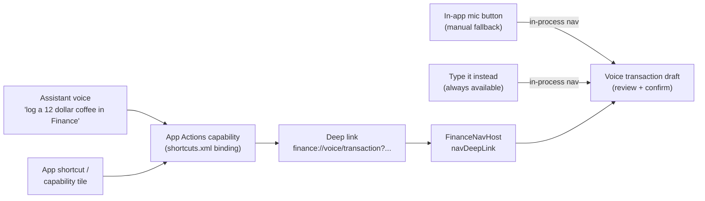
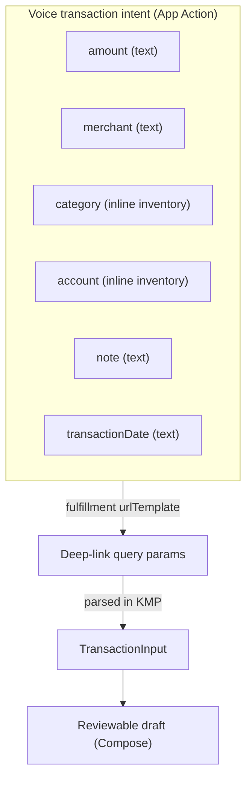

# Android Voice Transaction — App Actions & Intent Schema — Design

> **Status:** Design / breakdown only — native implementation gated by [#1242](https://github.com/jrmoulckers/finance/issues/1242)
> **Issue:** [#2696](https://github.com/jrmoulckers/finance/issues/2696) · **Part of [#2396](https://github.com/jrmoulckers/finance/issues/2396)** · **Voice-entry epic [#2383](https://github.com/jrmoulckers/finance/issues/2383)**
> **Platform:** Android (Jetpack Compose · Material 3 · App Actions / Assistant) · **minSdk 28 / target 35**
> **Audience:** Android engineers, design, QA · **Companion designs:** [Draft Confirmation & Ambiguity Prompts](./android-voice-draft-confirmation.md) · [Privacy, Offline Parsing & Telemetry](./android-voice-privacy-offline-parsing.md)

This document defines the **Android App Actions / Google Assistant entry points,
the voice transaction intent schema, its parameters, and the deep-link handoff**
that lands a spoken transaction in a reviewable draft. It exists so a commuter
(see [#2383](https://github.com/jrmoulckers/finance/issues/2383)) can say
_"Hey Google, log a 12 dollar coffee at Blue Bottle in Finance"_ and finish
hands-free — while every spoken value is still parsed, normalized, and scored by
**shared Kotlin Multiplatform (KMP) logic**, not by Compose.

This is **design only**. The App Actions / `shortcuts.xml` / deep-link plumbing is
**buildable now** in debug (`assembleDebug` sideload, App Actions Test Tool,
`adb` deep links); only **Play-validated Assistant distribution** is human-gated
by [#1242](https://github.com/jrmoulckers/finance/issues/1242) and the Google
Actions setup tracked under [#2383](https://github.com/jrmoulckers/finance/issues/2383).
See [Implementation readiness](#10-implementation-readiness) and
[`../ops/human-gated-prerequisites.md`](../ops/human-gated-prerequisites.md).

---

## Table of Contents

1. [Problem & goals](#1-problem--goals)
2. [Invocation surfaces & single destination](#2-invocation-surfaces--single-destination)
3. [Architecture boundary (KMP vs. Compose vs. App Actions plumbing)](#3-architecture-boundary-kmp-vs-compose-vs-app-actions-plumbing)
4. [Intent schema & parameters](#4-intent-schema--parameters)
5. [Invocation phrases, locales & inline inventory](#5-invocation-phrases-locales--inline-inventory)
6. [Deep-link contract & handoff](#6-deep-link-contract--handoff)
7. [Offline, empty, error & low-confidence states](#7-offline-empty-error--low-confidence-states)
8. [Accessibility & localization](#8-accessibility--localization)
9. [Test plan](#9-test-plan)
10. [Implementation readiness](#10-implementation-readiness)
11. [Open questions](#11-open-questions)

---

## 1. Problem & goals

From [#2383](https://github.com/jrmoulckers/finance/issues/2383): _"As an Android
commuter, I want Google Assistant voice transaction entry, so that I can log
spending hands-free."_ Today the only fast paths are the
[`QuickEntryWidget`](../../apps/android/src/main/kotlin/com/finance/android/widget/QuickEntryWidget.kt)
and the in-app
[`TransactionCreateScreen`](../../apps/android/src/main/kotlin/com/finance/android/ui/screens/TransactionCreateScreen.kt)
wizard — neither is hands-free.

**Goals**

- One canonical **voice intent** that captures amount, merchant, category,
  account, note, and transaction-date.
- A single **deep-link contract** that hands those values to a draft, reusing the
  existing navigation graph.
- **Reuse the shared parser** — [`NaturalLanguageParser`](../../packages/core/src/commonMain/kotlin/com/finance/core/nlp/NaturalLanguageParser.kt)
  already maps free text to a `TransactionInput` with a `ParseConfidence`; the
  voice layer feeds it, it does not reimplement parsing in Compose.
- **Locale-aware** phrasing (Spanish first, consistent with the program's i18n
  posture in [String Resource Migration Audit](./android-string-resource-migration-audit.md)).
- A **non-voice fallback** so Assistant is an accelerator, never the only path.

**Non-goals**

- The draft review / confirmation / ambiguity UX — owned by
  [Draft Confirmation & Ambiguity Prompts](./android-voice-draft-confirmation.md).
- On-device speech, storage, and telemetry boundaries — owned by
  [Privacy, Offline Parsing & Telemetry](./android-voice-privacy-offline-parsing.md).
- Any change to KMP business rules; `NaturalLanguageParser`, `Transaction`, and
  validation are consumed as-is.

---

## 2. Invocation surfaces & single destination



All surfaces converge on **one destination** — the voice transaction draft —
so behavior, accessibility, and tests are defined once. External surfaces
(Assistant, shortcut) arrive via the **deep-link URI**; in-app surfaces (mic
button, "type it instead") use **in-process navigation** to the same route. The
**manual paths are first-class**, satisfying "voice as an alternative input, not
the sole path."

---

## 3. Architecture boundary (KMP vs. Compose vs. App Actions plumbing)

- **App Actions plumbing** (this doc): the `shortcuts.xml` `<capability>`, the
  Built-In Intent (BII) / custom-intent binding, the fulfillment deep link, and
  the `navDeepLink` route in
  [`FinanceNavHost`](../../apps/android/src/main/kotlin/com/finance/android/ui/navigation/FinanceNavHost.kt).
  All platform glue, debug-implementable.
- **Compose** renders the draft and observes shared state — covered in the
  [confirmation design](./android-voice-draft-confirmation.md). It owns **no**
  parsing or finance math.
- **KMP `packages/core`** owns the rules. The handoff calls
  [`NaturalLanguageParser.parse(input, referenceDate)`](../../packages/core/src/commonMain/kotlin/com/finance/core/nlp/NaturalLanguageParser.kt),
  which returns `ParseResult.Success(TransactionInput)` or `ParseResult.Failure`.
  `TransactionInput` carries `amount: Cents`, `date`, `payee`, `categoryHint`,
  `type`, `rawInput`, and `confidence: ParseConfidence`. Account resolution and
  validation reuse the existing
  [`Transaction`](../../packages/models/src/commonMain/kotlin/com/finance/models/Transaction.kt)
  and
  [`TransactionValidator`](../../packages/core/src/commonMain/kotlin/com/finance/core/validation/TransactionValidator.kt).

> **Boundary rule:** the deep link carries only **raw spoken hints** (the
> utterance fragment and/or the typed parameter strings). It never carries
> computed results — no resolved `Cents`, no resolved account id, no confidence.
> Normalization and scoring happen **in KMP after** the handoff, so the same
> input produces the same draft regardless of entry surface.

---

## 4. Intent schema & parameters

The voice intent maps Assistant/BII parameters to deep-link query parameters to a
shared `TransactionInput`. Conceptually:



| Intent parameter  | Deep-link key | Example spoken value | Maps to (`TransactionInput`)          | Resolved by                                                 |
| ----------------- | ------------- | -------------------- | ------------------------------------- | ----------------------------------------------------------- |
| `amount`          | `amount`      | "twelve dollars"     | `amount: Cents`                       | `NaturalLanguageParser` amount extraction → `Cents`         |
| `merchant`        | `merchant`    | "Blue Bottle"        | `payee: String?`                      | `NaturalLanguageParser` merchant extraction                 |
| `category`        | `category`    | "coffee"             | `categoryHint: String?`               | Inline inventory synonyms → shared category taxonomy        |
| `account`         | `account`     | "credit card"        | account selection (resolved in draft) | Inline inventory of the user's accounts; default if omitted |
| `note`            | `note`        | "with a coworker"    | free-text note on the draft           | Passed through verbatim, length-capped                      |
| `transactionDate` | `date`        | "yesterday"          | `date: LocalDate`                     | `NaturalLanguageParser` date extraction (relative + ISO)    |

Notes:

- **Only `amount` is effectively required** for a usable draft;
  `NaturalLanguageParser` returns `ParseResult.Failure` when no amount is found,
  which the draft surfaces as a missing-field prompt (see the
  [confirmation design](./android-voice-draft-confirmation.md)).
- **`type`** (expense vs. income) is inferred by the shared parser from phrasing
  ("spent", "paid", "received") — it is not a separate spoken parameter.
- Every parameter is **optional at the intent layer**; missing values become
  prompts downstream rather than parse errors, so partial utterances still
  produce a draft.

---

## 5. Invocation phrases, locales & inline inventory

**Capability strategy.** A dedicated finance "log a transaction" Built-In Intent
does not exist in Google's catalog, so the recommended approach is a **custom App
Action capability** declared in `res/xml/shortcuts.xml` and bound to dynamic
shortcuts via `ShortcutManagerCompat`. The capability's `<fulfillment>` uses a
`urlTemplate` that renders the deep link in [§6](#6-deep-link-contract--handoff).
A generic-BII path (for example a transfer-style BII) is explicitly **not** used
because it would misrepresent intent semantics.

**Supported phrases (illustrative, English + Spanish):**

| Locale | Phrase pattern                                       |
| ------ | ---------------------------------------------------- |
| en     | "log a {amount} {category} at {merchant} in Finance" |
| en     | "add an expense in Finance"                          |
| en     | "I spent {amount} on {category} {date}"              |
| es     | "registra un gasto de {amount} en {merchant}"        |
| es     | "anota {amount} de {category} en Finanzas"           |

- **Inline inventory** provides synonym lists for `category` and `account` so
  Assistant can match spoken aliases ("gas" → "Fuel", "tarjeta" → the user's
  card) without sending free text to a server. The inventory is generated
  on-device from the user's categories/accounts.
- **Fallback deep links** cover discovery: an "Add an expense" app shortcut and an
  in-app mic button both reach the same destination if Assistant matching fails
  or the phrase is unrecognized.
- Phrase strings, shortcut labels, and `<capability>` `shortcutLabel`s are
  **localized resources** (no hardcoded English), aligned with
  [String Resource Migration Audit](./android-string-resource-migration-audit.md)
  and [Content & Language Guidelines](./content-language-guidelines.md).

---

## 6. Deep-link contract & handoff

A single canonical route receives every voice handoff:

```text
finance://voice/transaction
  ?amount={amount}
  &merchant={merchant}
  &category={category}
  &account={account}
  &note={note}
  &date={date}
  &source=assistant
```

An `https://finance.app/voice/add?...` autoVerify variant mirrors it for App
Links discovery. Contract rules:

- **All keys optional.** A bare `finance://voice/transaction` opens an empty
  voice-ready draft (mic primed, nothing pre-filled).
- **`source`** distinguishes `assistant`, `shortcut`, and `manual` for
  privacy-safe telemetry only (see
  [Privacy, Offline Parsing & Telemetry](./android-voice-privacy-offline-parsing.md));
  it never alters financial logic.
- **No computed values** ever appear in the URI — only raw hints. The route's
  `VoiceTransactionDraftViewModel` (covered in the confirmation design) calls the
  shared parser to resolve them.
- **Validation & sanitization:** a `VoiceIntentArgs` parser trims, length-caps,
  and URL-decodes each value; oversized or malformed input degrades to a prompt,
  never a crash.


The new route is registered in
[`FinanceNavHost`](../../apps/android/src/main/kotlin/com/finance/android/ui/navigation/FinanceNavHost.kt)
with a `navDeepLink { uriPattern = "..." }`, matching the existing deep-link
pattern documented in
[Cash Quick-Entry Deep Links](./android-cash-quick-entry-deep-links.md).

---

## 7. Offline, empty, error & low-confidence states

| State               | Trigger                                | Behavior                                                                                 |
| ------------------- | -------------------------------------- | ---------------------------------------------------------------------------------------- |
| Empty / first run   | Bare deep link, no params              | Voice-ready empty draft; mic primed; "Say or type an amount" prompt.                     |
| Partial fill        | Some params present                    | Pre-fill what arrived; remaining fields become prompts (not errors).                     |
| No amount           | Parser returns `ParseResult.Failure`   | Draft opens focused on the amount field with an inline hint; nothing is saved.           |
| Low confidence      | `ParseConfidence.LOW` / `VERY_LOW`     | Fields flagged "Double-check"; assistive tech focuses them first.                        |
| Ambiguous merchant  | Multiple inventory matches             | Disambiguation handed to the [confirmation flow](./android-voice-draft-confirmation.md). |
| Assistant offline   | Handoff completes but speech was local | Parsing still runs on-device; draft opens normally (no network needed).                  |
| Unrecognized phrase | Assistant cannot match the capability  | Falls back to the app shortcut / mic button → same empty draft.                          |

All parsing runs **on-device and offline-first** — the deep-link handoff never
requires network. No financial values are written to logs (see the
[privacy design](./android-voice-privacy-offline-parsing.md)).

---

## 8. Accessibility & localization

Targets WCAG 2.2 AA via the shared
[Accessibility Patterns Library](./accessibility-patterns.md).

- **Voice is an alternative, not a requirement.** The destination always offers a
  fully keyboard/touch-operable draft; users who cannot or prefer not to speak
  reach the identical form via the mic button's "type it instead" affordance and
  the app shortcut.
- **TalkBack:** the entry button exposes a `contentDescription` ("Add a
  transaction by voice"); the destination announces it opened and what was
  pre-filled. Capability/shortcut labels are descriptive, not icon-only.
- **Switch Access:** every entry affordance is a single-purpose target ≥ 48 dp;
  no action depends on a long-press or gesture only.
- **200% font scaling:** the handoff draft (rendered per the confirmation design)
  reflows rather than truncates; the mic-vs-type choice stacks vertically at large
  scale.
- **Localization:** phrases, labels, and prompts are localized resources;
  spoken-number and date phrasing are locale-aware so "doce dólares" parses like
  "twelve dollars" (see [Content & Language Guidelines](./content-language-guidelines.md)).

---

## 9. Test plan

| Layer           | Tooling                | Coverage                                                                                                                     |
| --------------- | ---------------------- | ---------------------------------------------------------------------------------------------------------------------------- |
| Unit (args)     | JUnit                  | `VoiceIntentArgs` decode/trim/length-cap; malformed/oversized params degrade to empty, never throw; `source` parsing.        |
| Unit (parse)    | JUnit + fixtures       | Deterministic phrase fixtures → expected `TransactionInput`/`ParseConfidence` (reuses `NaturalLanguageParser` shared tests). |
| Instrumentation | `androidx.test` + `am` | `adb shell am start -d "finance://voice/transaction?..."` routes to the draft with the right pre-fill across param sets.     |
| Compose UI      | `compose-ui-test`      | Empty vs. pre-filled draft entry; mic and "type it instead" both reachable; semantics/`contentDescription` assertions.       |
| Snapshot        | Paparazzi              | Voice entry button + empty/pre-filled handoff at default and 200% font, light/dark + dynamic color.                          |

Shared parsing rules are **not** re-tested here — only the intent-to-args-to-draft
wiring. A frozen **parse fixture set** (phrase → expected fields) keeps voice and
typed entry behaviorally identical.

---

## 10. Implementation readiness

This is a design artifact. Work splits into a part buildable today and a tail
gated by Play / Assistant distribution. See
[Human-Gated Prerequisites](../ops/human-gated-prerequisites.md) and the
[Launch Readiness Plan](../ops/launch-readiness-plan.md) for context.

### Buildable now (debug, no human gate)

- `shortcuts.xml` `<capability>`, dynamic-shortcut binding, the fulfillment
  `urlTemplate`, the `navDeepLink` route, and `VoiceIntentArgs` parsing are pure
  Android + KMP consumption — runnable via `./gradlew :apps:android:assembleDebug`
  and sideload.
- Deep-link routing is verifiable with `adb shell am start -d "finance://..."`.
- The capability and parameter mapping are verifiable locally with the **App
  Actions Test Tool** (Android Studio plugin) against a debug build.
- Unit, instrumentation, Compose, and Paparazzi tests run on CI without signing.

### Play / Assistant-validated distribution tail (gated by [#1242](https://github.com/jrmoulckers/finance/issues/1242))

- Production Assistant invocation requires the app published to a Play track with
  the capability verified — **human-gated** by Google Play enrollment
  ([#1242](https://github.com/jrmoulckers/finance/issues/1242)) and the Google
  Actions Console / App Actions validation setup tracked under
  [#2383](https://github.com/jrmoulckers/finance/issues/2383).
- Per [`../ops/human-gated-prerequisites.md`](../ops/human-gated-prerequisites.md)
  §2, only this **distribution** tail is gated; the implementation above is not.
  Agents must not perform enrollment, signing, or secret configuration.

---

## 11. Open questions

- Final custom-capability name and whether a future Google finance BII supersedes
  it.
- Whether `account` should resolve at the intent layer (inline inventory only) or
  always defer to the draft's account picker for safety.
- Spanish phrase coverage breadth for v1 vs. fast-follow locales.
- Whether `https` App Links autoVerify is enabled at launch or shortcut-only.

---

**Related:** [Draft Confirmation & Ambiguity Prompts](./android-voice-draft-confirmation.md)
· [Privacy, Offline Parsing & Telemetry](./android-voice-privacy-offline-parsing.md)
· [Cash Quick-Entry Deep Links](./android-cash-quick-entry-deep-links.md)
· [Information Architecture](./information-architecture.md)
· [User Personas](./personas.md)
