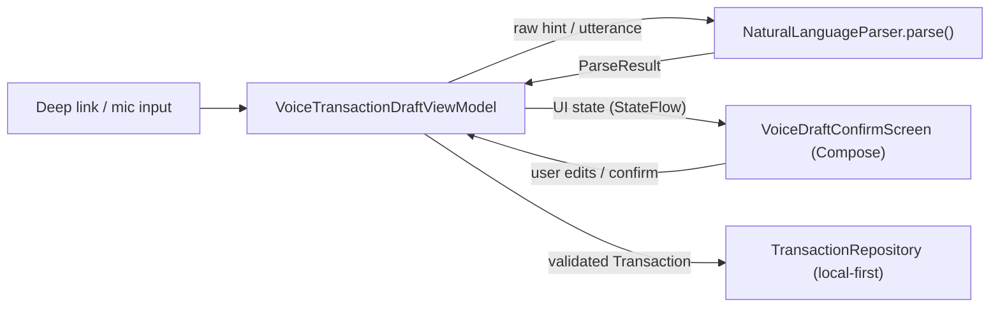
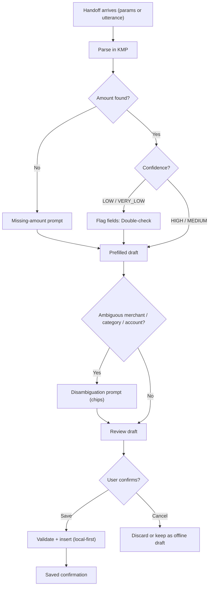

# Android Voice Transaction — Draft Confirmation & Ambiguity Prompts — Design

> **Status:** Design / breakdown only — native implementation gated by [#1242](https://github.com/jrmoulckers/finance/issues/1242)
> **Issue:** [#2697](https://github.com/jrmoulckers/finance/issues/2697) · **Part of [#2396](https://github.com/jrmoulckers/finance/issues/2396)** · **Voice-entry epic [#2383](https://github.com/jrmoulckers/finance/issues/2383)**
> **Platform:** Android (Jetpack Compose · Material 3) · **minSdk 28 / target 35**
> **Audience:** Android engineers, design, QA · **Companion designs:** [App Actions & Intent Schema](./android-voice-app-actions-intent-schema.md) · [Privacy, Offline Parsing & Telemetry](./android-voice-privacy-offline-parsing.md)

This document designs the **draft review flow** that a spoken transaction lands
in: prefilled fields, **missing-field prompts**, **ambiguity disambiguation**,
correction UX, offline-safe draft state, and the **explicit confirm-before-save**
gate. It is the human-in-the-loop checkpoint between Assistant and the ledger.

The guiding rule for every screen below: **Compose renders shared state; it does
not own finance math.** Parsing, confidence scoring, and mapping to a
`TransactionInput` already live in KMP
[`NaturalLanguageParser`](../../packages/core/src/commonMain/kotlin/com/finance/core/nlp/NaturalLanguageParser.kt);
the Android layer observes that draft and presents review and correction
affordances, then saves through the existing repository.

This is **design only** — the confirmation flow is **buildable now** in debug
(`assembleDebug` sideload); only Play distribution is human-gated by
[#1242](https://github.com/jrmoulckers/finance/issues/1242). See
[Implementation readiness](#12-implementation-readiness) and
[`../ops/human-gated-prerequisites.md`](../ops/human-gated-prerequisites.md).

---

## Table of Contents

1. [Goals & non-goals](#1-goals--non-goals)
2. [The Compose-renders-shared-state boundary](#2-the-compose-renders-shared-state-boundary)
3. [Voice-to-draft flow](#3-voice-to-draft-flow)
4. [Composable & ViewModel inventory](#4-composable--viewmodel-inventory)
5. [State model](#5-state-model)
6. [Missing-field & ambiguity prompts](#6-missing-field--ambiguity-prompts)
7. [Correction UX & confirm-before-save](#7-correction-ux--confirm-before-save)
8. [Offline-safe draft & failed handoff](#8-offline-safe-draft--failed-handoff)
9. [Empty, error & low-confidence states](#9-empty-error--low-confidence-states)
10. [Accessibility](#10-accessibility)
11. [Test plan](#11-test-plan)
12. [Implementation readiness](#12-implementation-readiness)
13. [Open questions](#13-open-questions)

---

## 1. Goals & non-goals

From [#2697](https://github.com/jrmoulckers/finance/issues/2697): require explicit
confirmation before saving any spoken transaction; handle missing or ambiguous
amount, merchant, account, and category fields; and keep the draft offline-safe
when the Assistant handoff cannot complete.

**Goals**

- **No silent saves.** A spoken transaction always pauses on a reviewable draft
  with an explicit **Save** action.
- **Reuse the existing entry form.** The draft reuses the proven save path in
  [`TransactionCreateViewModel`](../../apps/android/src/main/kotlin/com/finance/android/ui/viewmodel/TransactionCreateViewModel.kt)
  and the field patterns of
  [`TransactionCreateScreen`](../../apps/android/src/main/kotlin/com/finance/android/ui/screens/TransactionCreateScreen.kt)
  rather than inventing a parallel form.
- **Resolve missing / ambiguous fields** with clear, low-friction prompts.
- **Survive a broken handoff** — keep an offline draft if Assistant or navigation
  fails mid-flow.

**Non-goals**

- The intent schema, capability, and deep-link contract — owned by
  [App Actions & Intent Schema](./android-voice-app-actions-intent-schema.md).
- On-device speech, storage, and telemetry boundaries — owned by
  [Privacy, Offline Parsing & Telemetry](./android-voice-privacy-offline-parsing.md).
- Any change to KMP business rules; the parser and validator are consumed as-is.

---

## 2. The Compose-renders-shared-state boundary



- The ViewModel calls the **shared parser** and exposes an immutable UI state.
  Compose only renders that state and forwards user intents back.
- Confidence and field presence come from `ParseResult.Success(TransactionInput)`
  (`confidence: ParseConfidence` ∈ `HIGH, MEDIUM, LOW, VERY_LOW`) or
  `ParseResult.Failure(reason)` — the UI **re-derives nothing financial**.
- Save maps the reviewed values to a
  [`Transaction`](../../packages/models/src/commonMain/kotlin/com/finance/models/Transaction.kt)
  validated by
  [`TransactionValidator`](../../packages/core/src/commonMain/kotlin/com/finance/core/validation/TransactionValidator.kt),
  reusing the existing repository insert path.

---

## 3. Voice-to-draft flow



Confirmation is **mandatory**: the flow cannot reach "Saved" (`N`) without the
user taking the explicit **Save** action at `J`.

---

## 4. Composable & ViewModel inventory

| Component (new/reused)                 | Type       | Role                                                                                      |
| -------------------------------------- | ---------- | ----------------------------------------------------------------------------------------- |
| `VoiceDraftConfirmScreen` (new)        | Composable | Hosts the prefilled draft, prompts, and the sticky confirm bar.                           |
| `VoiceDraftFieldRow` (new)             | Composable | One field row with value, confidence badge, and inline edit.                              |
| `AmbiguityPromptSheet` (new)           | Composable | `ModalBottomSheet` with candidate chips for ambiguous merchant/category/account.          |
| `MissingFieldPrompt` (new)             | Composable | Inline required-field prompt (amount/account) with focus + hint.                          |
| `DraftConfirmBar` (new)                | Composable | Sticky **Save** / **Cancel** bar; Save disabled until required fields valid.              |
| `VoiceTransactionDraftViewModel` (new) | ViewModel  | Calls shared parser, holds UI state, resolves prompts, performs validated save.           |
| `TransactionCreateViewModel` (reused)  | ViewModel  | Underlying validated insert path; not duplicated.                                         |
| Field inputs (reused patterns)         | Composable | Material 3 `OutlinedTextField` with `supportingText`/`isError`, as in transaction create. |

`VoiceTransactionDraftViewModel` is provided via Koin (`viewModelOf(::...)`) and
obtained in Compose with `koinViewModel<VoiceTransactionDraftViewModel>()`,
consistent with the app's DI pattern.

---

## 5. State model

```kotlin
// Illustrative — final shape lives in the Android module, state derived from KMP.
sealed interface VoiceDraftState {
    data object Parsing : VoiceDraftState
    data class Draft(
        val fields: VoiceDraftFields,           // amount, merchant, category, account, note, date
        val confidence: ParseConfidence,        // HIGH | MEDIUM | LOW | VERY_LOW
        val missing: Set<VoiceField>,           // required fields still empty
        val ambiguities: List<FieldAmbiguity>,  // candidate sets per field
        val canSave: Boolean,                   // false until required fields valid
    ) : VoiceDraftState
    data object Saving : VoiceDraftState
    data class Saved(val transactionId: SyncId) : VoiceDraftState
    data class Error(val kind: VoiceDraftError) : VoiceDraftState   // recoverable; draft preserved
}
```

- `confidence`, field values, and the `rawInput` survive process death via
  `SavedStateHandle`, so a half-corrected draft is never lost.
- `canSave` gates the **Save** action; the UI cannot bypass it.
- `Error` is always **non-destructive** — the draft is preserved for retry.

---

## 6. Missing-field & ambiguity prompts

Acceptance criterion: handle missing or ambiguous **amount, merchant, account, and
category**. Confidence comes from `ParseConfidence`; presence and candidate sets
come from the shared parse + on-device inventory match.

| Field    | Missing behavior                                               | Ambiguous behavior                                                          |
| -------- | -------------------------------------------------------------- | --------------------------------------------------------------------------- |
| amount   | Required; **Save** disabled; focus the amount field with hint. | If multiple numbers heard, prompt "Which amount?" with candidate chips.     |
| account  | Required; default to the user's preferred account, editable.   | Multiple inventory matches → chip picker; never auto-pick silently.         |
| merchant | Optional; show "Add merchant" affordance.                      | Multiple matches → chip picker ("Blue Bottle" vs. "Blue Bottle Coffee").    |
| category | Optional; shared parser may infer `categoryHint`.              | Low-confidence hint → "Suggested: Coffee" chip the user accepts or changes. |

- Disambiguation uses Material 3 **filter/assist chips** in an
  `AmbiguityPromptSheet`; selecting a chip updates the field and re-checks
  `canSave`.
- Prompts use plain language per [Cognitive Accessibility](./cognitive-accessibility.md)
  ("We heard two amounts — tap the right one"), no jargon.
- Resolving one prompt **never silently changes** another field; totals are never
  recomputed by the UI.

---

## 7. Correction UX & confirm-before-save

- Every prefilled field is **editable inline** via the same `OutlinedTextField`
  patterns as
  [`TransactionCreateScreen`](../../apps/android/src/main/kotlin/com/finance/android/ui/screens/TransactionCreateScreen.kt),
  with `supportingText` for hints and `isError` for required gaps.
- Confidence presentation:

  | Band               | Presentation                                                  |
  | ------------------ | ------------------------------------------------------------- |
  | `HIGH`             | Filled, no badge; editable on tap.                            |
  | `MEDIUM`           | Subtle "Double-check" badge.                                  |
  | `LOW` / `VERY_LOW` | "Double-check" badge; assistive tech focuses the field first. |

- **Confirm-before-save is the core gate.** Saving requires the explicit
  **Save** action in `DraftConfirmBar`; there is no auto-save timer and no
  save-on-dismiss. **Cancel** offers "Discard" or "Keep draft" (see §8).
- On save, the reviewed values map to a `Transaction`, run through
  `TransactionValidator`, and insert via the existing repository — identical to
  the manual create path, so voice entries are indistinguishable from typed ones
  in the ledger.

---

## 8. Offline-safe draft & failed handoff

The flow is fully functional **with no network** — drafting, correction, and save
run against the local-first repository; sync happens later via the existing
PowerSync / WorkManager path and is out of scope here.

| Scenario                         | Behavior                                                                                          |
| -------------------------------- | ------------------------------------------------------------------------------------------------- |
| Assistant handoff fails mid-flow | If any partial input exists, persist a **local offline draft**; reopenable from the app.          |
| App killed before confirm        | `SavedStateHandle` restores the in-progress draft on relaunch.                                    |
| User taps Cancel                 | Offer "Discard" or "Keep draft"; "Keep" stores the offline draft, never a saved transaction.      |
| Connectivity absent at save      | Save succeeds locally; optional "Saved — will sync later" affordance.                             |
| Stale offline drafts             | Deferred cleanup uses **WorkManager only** (never AlarmManager/JobScheduler); see privacy design. |

> Offline drafts hold **unconfirmed** input only. They are never treated as saved
> transactions and never sync as such until the user confirms.

---

## 9. Empty, error & low-confidence states

| State                 | Trigger                            | UX                                                                             |
| --------------------- | ---------------------------------- | ------------------------------------------------------------------------------ |
| Empty / voice-ready   | Bare entry, nothing parsed         | "Say or type an amount" with mic primed and a type affordance.                 |
| Parse failure         | `ParseResult.Failure` (no amount)  | Draft focused on amount with inline hint; nothing saved.                       |
| Low confidence        | `ParseConfidence.LOW` / `VERY_LOW` | Fields flagged; assistive tech focuses them first; Save still requires review. |
| Validation error      | Required field empty at Save       | Inline error; assertive live-region announce; focus first invalid field.       |
| Save/repository error | `insert` throws                    | Non-destructive error card with **Retry**; draft preserved.                    |

No financial values (amounts, merchant, account) are written to Timber; structured
logs record flow milestones only (see
[Privacy, Offline Parsing & Telemetry](./android-voice-privacy-offline-parsing.md)).

---

## 10. Accessibility

Targets WCAG 2.2 AA via the shared
[Accessibility Patterns Library](./accessibility-patterns.md).

- **Voice is an alternative, not the sole path.** The draft is fully operable by
  touch, keyboard, and switch; the explicit visual confirm step is exactly what
  lets non-voice and assistive-tech users verify and edit before saving.
- **TalkBack:** each `VoiceDraftFieldRow` exposes a `contentDescription` combining
  label, value, and confidence ("Amount, 12 dollars, please double-check").
  Headings use `semantics { heading() }`. Ambiguity chips announce their candidate
  and selection state. Save/Cancel announce action and result.
- **Switch Access:** logical top-to-bottom focus; the sticky `DraftConfirmBar` is
  reached last; all targets ≥ 48 dp; no gesture-only or long-press-only actions.
- **200% font scaling:** fields and prompts wrap, never truncate; the confirm bar
  stacks Save/Cancel vertically at large scale; the ambiguity sheet scrolls.
- **Live regions:** disambiguation requests, validation errors, and save
  confirmation use an assertive live region so non-visual users hear outcomes
  immediately.
- **Color independence:** confidence and required state use badge text + icon,
  never color alone.

---

## 11. Test plan

| Layer                | Tooling                | Coverage                                                                                                                                                  |
| -------------------- | ---------------------- | --------------------------------------------------------------------------------------------------------------------------------------------------------- |
| Unit (ViewModel)     | JUnit + coroutine test | Draft seeded from `ParseResult`; **no save without explicit confirm**; `canSave` gating; edits don't mutate shared math.                                  |
| Unit (state machine) | JUnit                  | `Parsing → Draft → Saving → Saved`; error path preserves draft; `SavedStateHandle` restore; offline "Keep draft" stays unsaved.                           |
| Unit (prompts)       | JUnit + fixtures       | Deterministic phrase fixtures → expected missing/ambiguity sets for amount/account/merchant/category.                                                     |
| Compose UI           | `compose-ui-test`      | Save disabled until required fields valid; ambiguity chips resolve fields; confirm-required assertion; semantics/`contentDescription`.                    |
| Snapshot             | Paparazzi              | `VoiceDraftConfirmScreen` in high-confidence, low-confidence, missing-amount, ambiguity, saving, error — default + 200% font, light/dark + dynamic color. |

A frozen **parse fixture set** keeps confirmation behavior deterministic and in
lock-step with typed entry. Shared parser rules are covered by `packages/core`
tests and are **not** re-tested here.

---

## 12. Implementation readiness

This is a design artifact. Work splits into a part buildable today and a tail
gated by Play distribution. See
[Human-Gated Prerequisites](../ops/human-gated-prerequisites.md) and the
[Launch Readiness Plan](../ops/launch-readiness-plan.md) for context.

### Buildable now (debug, no human gate)

- `VoiceDraftConfirmScreen`, `VoiceTransactionDraftViewModel`, the state model,
  prompts, and the Koin module are pure Compose + KMP consumption — implementable
  and runnable via `./gradlew :apps:android:assembleDebug` and sideload.
- Save reuses the existing local `TransactionRepository`; verifiable with unit,
  Compose, and Paparazzi tests on CI and emulator/sideload.
- The confirm-before-save gate, ambiguity prompts, and accessibility semantics
  need no signing or store presence and can be reached via the
  [deep-link contract](./android-voice-app-actions-intent-schema.md#6-deep-link-contract--handoff)
  using `adb`.

### Play-distribution tail (gated by [#1242](https://github.com/jrmoulckers/finance/issues/1242))

- End-to-end Assistant invocation into this flow needs the Play-validated
  capability — **human-gated** by Google Play enrollment
  ([#1242](https://github.com/jrmoulckers/finance/issues/1242)) and Actions setup
  under [#2383](https://github.com/jrmoulckers/finance/issues/2383). Per
  [`../ops/human-gated-prerequisites.md`](../ops/human-gated-prerequisites.md) §2,
  only this distribution tail is gated; the draft flow itself is implementable now.

---

## 13. Open questions

- Default account behavior when none is spoken and the user has multiple accounts.
- Whether "Keep draft" exposes a visible offline-draft inbox or is reopen-only.
- Maximum number of ambiguity candidates to show before falling back to a picker.
- Whether biometric re-auth is required before saving above a configurable amount.

---

**Related:** [App Actions & Intent Schema](./android-voice-app-actions-intent-schema.md)
· [Privacy, Offline Parsing & Telemetry](./android-voice-privacy-offline-parsing.md)
· [Receipt-to-Expense Draft Flow](./android-receipt-to-expense-draft.md)
· [UX Design Principles](./ux-principles.md)
· [Component Library](./component-library.md)
