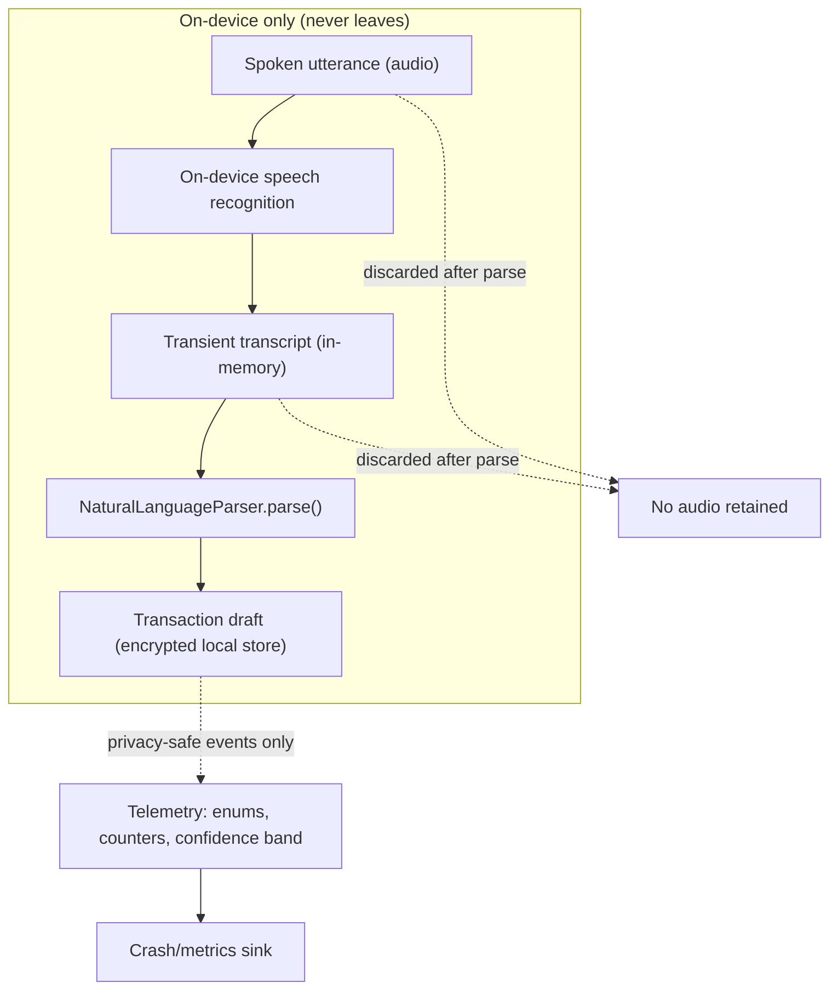

# Android Voice Transaction — Privacy, Offline Parsing & Telemetry Boundaries — Design

> **Status:** Design / breakdown only — native implementation gated by [#1242](https://github.com/jrmoulckers/finance/issues/1242)
> **Issue:** [#2698](https://github.com/jrmoulckers/finance/issues/2698) · **Part of [#2396](https://github.com/jrmoulckers/finance/issues/2396)** · **Voice-entry epic [#2383](https://github.com/jrmoulckers/finance/issues/2383)**
> **Platform:** Android (Jetpack Compose · Material 3 · ML Kit on-device) · **minSdk 28 / target 35**
> **Audience:** Android engineers, design, QA, privacy review · **Companion designs:** [App Actions & Intent Schema](./android-voice-app-actions-intent-schema.md) · [Draft Confirmation & Ambiguity Prompts](./android-voice-draft-confirmation.md)

This document defines the **privacy boundaries, on-device parsing assumptions,
and telemetry rules** for voice transaction entry. The governing principle for a
financial app is **default to the most private option**: speech and the spoken
transaction are processed **on-device**, and **no raw utterance or transaction
text ever leaves the device**. Telemetry is privacy-preserving — enums, counters,
and coarse confidence bands only.

The parsing/mapping logic stays in KMP
[`NaturalLanguageParser`](../../packages/core/src/commonMain/kotlin/com/finance/core/nlp/NaturalLanguageParser.kt);
Android contributes only the on-device speech surface, encrypted local storage,
and a redacting telemetry bridge.

This is **design only** — on-device parsing and telemetry redaction are
**buildable now** in debug (`assembleDebug` sideload); the Play **Data safety**
declaration and store distribution are human-gated by
[#1242](https://github.com/jrmoulckers/finance/issues/1242). See
[Implementation readiness](#11-implementation-readiness) and
[`../ops/human-gated-prerequisites.md`](../ops/human-gated-prerequisites.md).

---

## Table of Contents

1. [Goals & privacy principles](#1-goals--privacy-principles)
2. [Data boundary model](#2-data-boundary-model)
3. [On-device speech & parsing assumptions](#3-on-device-speech--parsing-assumptions)
4. [What is and is not stored](#4-what-is-and-is-not-stored)
5. [Offline draft behavior & local parse failure](#5-offline-draft-behavior--local-parse-failure)
6. [Telemetry boundaries](#6-telemetry-boundaries)
7. [Privacy-safe error reporting](#7-privacy-safe-error-reporting)
8. [Permissions & consent](#8-permissions--consent)
9. [Accessibility & empty/error states](#9-accessibility--emptyerror-states)
10. [Test plan](#10-test-plan)
11. [Implementation readiness](#11-implementation-readiness)
12. [Open questions](#12-open-questions)

---

## 1. Goals & privacy principles

From [#2698](https://github.com/jrmoulckers/finance/issues/2698): document
transcription boundaries and what is/is not stored; define offline draft behavior
and local parse-failure states; and specify telemetry for success, cancellation,
correction, ambiguity, and privacy-safe error reporting.

**Principles**

- **On-device by default.** Speech recognition and parsing run locally; the
  network is never required to draft a transaction.
- **No raw content off device.** Utterances, transcripts, merchant names, notes,
  amounts, and account identifiers are **never** transmitted as telemetry, crash
  metadata, or logs.
- **Data minimization.** Capture the minimum needed to build a draft; discard the
  transcript as soon as a draft exists.
- **Explicit consent.** Microphone use is opt-in with a clear rationale and is
  revocable; voice is an accelerator, never the only way to add a transaction.
- **Encryption at rest.** Any persisted draft uses the existing SQLCipher-backed
  store; nothing sensitive lands in SharedPreferences or plain files.

---

## 2. Data boundary model

- The dashed path to telemetry carries **no raw content** — only categorical
  signals (see [§6](#6-telemetry-boundaries)).
- Audio and transcript are **transient and in-memory**; they are discarded once a
  draft is produced.
- The only durable artifact is the **encrypted draft / saved transaction**, which
  stays local-first and syncs through existing channels — outside this design's
  scope.

---

## 3. On-device speech & parsing assumptions

- **Speech recognition:** prefer Android's on-device recognition
  (`SpeechRecognizer` with `EXTRA_PREFER_OFFLINE` / on-device intent, or the
  Assistant-provided transcript when the App Action path is used). The design
  assumes the **on-device** language pack is available; if only a network
  recognizer exists, the user is told and offered manual entry (no silent upload).
- **Entity extraction:** lightweight normalization (numbers, relative dates,
  merchant spans) can use **ML Kit Entity Extraction**, which runs **on-device**.
  Its output is fed into the shared parser; ML Kit is a pre-normalizer, not a
  replacement for KMP logic.
- **Authoritative parsing in KMP:** the transcript string (or App Action
  parameters) goes to
  [`NaturalLanguageParser.parse(input, referenceDate)`](../../packages/core/src/commonMain/kotlin/com/finance/core/nlp/NaturalLanguageParser.kt),
  returning `ParseResult.Success(TransactionInput)` with `confidence:
ParseConfidence` ∈ `HIGH, MEDIUM, LOW, VERY_LOW`, or `ParseResult.Failure`. The
  same input yields the same draft regardless of which speech surface produced the
  transcript.
- **No server round-trip** is introduced for parsing. This keeps the feature
  consistent with the on-device posture of
  [Receipt-to-Expense Draft Flow](./android-receipt-to-expense-draft.md).

---

## 4. What is and is not stored

| Data                          | Stored?          | Where / lifetime                                                                                             |
| ----------------------------- | ---------------- | ------------------------------------------------------------------------------------------------------------ |
| Raw audio                     | **No**           | Never persisted; discarded after recognition.                                                                |
| Transcript text               | **No (durable)** | In-memory only; discarded once the draft is built.                                                           |
| `rawInput` on the draft       | Transient        | Held in memory / `SavedStateHandle` for the session; not synced as text.                                     |
| Confirmed transaction         | Yes              | Existing SQLCipher-encrypted local store; syncs via existing channels.                                       |
| Unconfirmed offline draft     | Yes (encrypted)  | Same encrypted store; cleaned up via WorkManager (see [§5](#5-offline-draft-behavior--local-parse-failure)). |
| Telemetry events              | Yes (redacted)   | Enums/counters only — **no raw content** (see [§6](#6-telemetry-boundaries)).                                |
| Microphone-consent preference | Yes              | Encrypted preference; never a secret in plain SharedPreferences.                                             |

> **Rule:** the `rawInput`/transcript may live briefly to support correction and
> process-death restore, but it is **never** sent off device and **never** written
> to logs or telemetry.

---

## 5. Offline draft behavior & local parse failure

The feature is **offline-first** — no network is needed to capture, parse, or save.

| State                       | Trigger                                   | Behavior                                                                                  |
| --------------------------- | ----------------------------------------- | ----------------------------------------------------------------------------------------- |
| Offline capture             | No connectivity                           | Speech + parse + draft all run locally; save persists locally and syncs later.            |
| On-device pack missing      | No offline recognition language pack      | Inform the user, offer manual entry; do not silently fall back to a network recognizer.   |
| Parse failure (no amount)   | `ParseResult.Failure`                     | Open the draft focused on amount with a hint; nothing is saved (see confirmation design). |
| Low confidence              | `ParseConfidence.LOW` / `VERY_LOW`        | Flag fields for review; never auto-save.                                                  |
| Handoff incomplete          | Assistant/navigation fails mid-flow       | Persist an encrypted **offline draft**; reopenable later.                                 |
| Stale offline-draft cleanup | Draft unconfirmed past a retention window | **WorkManager only** deferred cleanup (never AlarmManager/JobScheduler); see boundaries.  |

Unconfirmed drafts are never treated as saved transactions and never sync as such
until the user explicitly confirms in the
[draft confirmation flow](./android-voice-draft-confirmation.md).

---

## 6. Telemetry boundaries

Telemetry exists to measure feature health, **not** to reconstruct what a user
spent. Events flow through the shared
[`MetricsCollector`](../../packages/core/src/commonMain/kotlin/com/finance/core/monitoring/MetricsCollector.kt)
abstraction; the Android side is a redacting bridge.

**Allowed events (categorical only):**

| Event                   | Allowed payload                                                         |
| ----------------------- | ----------------------------------------------------------------------- |
| `voice_entry_started`   | `source` enum (`assistant` / `shortcut` / `manual`).                    |
| `voice_parse_result`    | `confidence` band enum; `fieldsPresent` bitmask (presence, not values). |
| `voice_ambiguity`       | which field type was ambiguous (enum); candidate **count** (integer).   |
| `voice_correction`      | which field type was corrected (enum); correction **count**.            |
| `voice_entry_saved`     | boolean success; coarse latency bucket.                                 |
| `voice_entry_cancelled` | cancel reason enum (`user` / `parse_failure` / `handoff_failed`).       |
| `voice_error`           | error-kind enum; **no** message text, **no** stack with content.        |

**Never permitted in any event, log, or crash report:**

- Raw utterance or transcript text; merchant names; notes.
- Amounts or balances (not even rounded), account numbers, or account names.
- Any free-text field value or `rawInput`.

Additional rules:

- **Presence, not content:** report _that_ a field was filled/corrected, never its
  value (e.g., `fieldsPresent = {amount, merchant}`).
- **Sampling & opt-out:** telemetry respects the app's existing analytics
  consent/opt-out; voice events are never collected when analytics is disabled.
- **No PII keys:** event names and dimensions are a fixed enum allow-list;
  free-form dimensions are prohibited.

---

## 7. Privacy-safe error reporting

- Crashes and recoverable errors route through the shared
  [`CrashReporter`](../../packages/core/src/commonMain/kotlin/com/finance/core/monitoring/CrashReporter.kt),
  bridged on Android by
  [`TimberCrashReporter`](../../apps/android/src/main/kotlin/com/finance/android/logging/TimberCrashReporter.kt).
- **Never** `Log.d()` / `Log.e()` directly — always `Timber`. Voice flow logs
  record **milestones only** ("voice draft opened", "parse failed",
  "save succeeded") with **no** field values.
- Error metadata is restricted to **enums and identifiers** (error kind, `source`,
  confidence band). Exception messages are mapped to safe codes before reporting;
  raw transcripts and amounts are **redacted at the boundary**, not relied on to be
  absent.
- This mirrors the categorization privacy posture in
  [iOS Categorization Privacy & Telemetry](./ios-categorization-privacy-telemetry.md)
  so both platforms make the same guarantees.

---

## 8. Permissions & consent

- **Microphone (`RECORD_AUDIO`)** is requested **just-in-time** with a plain-language
  rationale ("Used only on your device to turn speech into a transaction draft").
- Consent is **opt-in and revocable** from settings; revoking it disables voice
  entry and routes users to manual entry without losing any saved data.
- **Voice is never the sole path.** Every voice capability has a typed/touch
  equivalent (mic button "type it instead", app shortcut, manual create), per the
  [app-actions design](./android-voice-app-actions-intent-schema.md).
- The consent preference is stored encrypted; it is **never** a secret in plain
  SharedPreferences or a plain file.
- A short, accessible **privacy explainer** states what is processed on-device and
  that nothing is uploaded, surfaced the first time voice entry is used.

---

## 9. Accessibility & empty/error states

Targets WCAG 2.2 AA via the shared
[Accessibility Patterns Library](./accessibility-patterns.md).

- **Consent & explainer screens** are fully accessible: headings via
  `semantics { heading() }`, all controls labeled with `contentDescription`,
  reflow at 200% font, Switch Access targets ≥ 48 dp.
- **Voice as an alternative:** screen-reader and switch users can complete the
  entire flow by typing; the mic is an optional accelerator. Permission prompts
  never block manual entry.
- **Empty / offline / error states:**

  | State                 | UX                                                                   |
  | --------------------- | -------------------------------------------------------------------- |
  | Mic permission denied | Explain impact; offer "Add manually"; never dead-end.                |
  | No on-device pack     | Inform + offer manual entry; no silent network upload.               |
  | Parse failure         | Accessible inline hint; assistive tech focuses the amount field.     |
  | Telemetry/consent off | Feature still works; no events emitted; no user-visible degradation. |

- Status changes (permission result, parse failure) are announced via an
  assertive live region.

---

## 10. Test plan

| Layer            | Tooling                  | Coverage                                                                                                                              |
| ---------------- | ------------------------ | ------------------------------------------------------------------------------------------------------------------------------------- |
| Unit (redaction) | JUnit                    | **Telemetry payload contains no raw content** — assert enums/counters only for every event; reject any field value/`rawInput`.        |
| Unit (parse)     | JUnit + fixtures         | Deterministic transcript fixtures → expected `TransactionInput`/`ParseConfidence` offline; failure path yields `ParseResult.Failure`. |
| Unit (logging)   | JUnit + Timber test tree | Assert no amount/merchant/account/transcript string ever reaches a log/crash sink (planted test tree captures + scans output).        |
| Unit (lifecycle) | JUnit                    | Audio/transcript discarded after draft built; offline draft persisted encrypted; WorkManager cleanup enqueued, not AlarmManager.      |
| Compose UI       | `compose-ui-test`        | Consent/explainer accessible; permission-denied offers manual entry; semantics/`contentDescription` assertions; 200% font reflow.     |
| Snapshot         | Paparazzi                | Consent explainer, permission-denied, no-pack, parse-failure states at default + 200% font, light/dark + dynamic color.               |

The **privacy assertions** (no raw content in telemetry/logs/crash metadata) are
first-class, deterministic tests that gate the feature. Shared parser rules are
covered by `packages/core` tests and are not re-tested here.

---

## 11. Implementation readiness

This is a design artifact. Work splits into a part buildable today and a tail
gated by Play distribution / Data safety. See
[Human-Gated Prerequisites](../ops/human-gated-prerequisites.md) and the
[Launch Readiness Plan](../ops/launch-readiness-plan.md) for context.

### Buildable now (debug, no human gate)

- On-device speech wiring, ML Kit Entity Extraction pre-normalization, the KMP
  parse call, encrypted offline-draft storage, WorkManager cleanup, and the
  **redacting telemetry/error bridge** are pure Android + KMP — implementable and
  runnable via `./gradlew :apps:android:assembleDebug` and sideload.
- Privacy assertions, redaction unit tests, deterministic offline parse fixtures,
  and Paparazzi snapshots of consent/error states run on CI without signing.

### Play-distribution tail (gated by [#1242](https://github.com/jrmoulckers/finance/issues/1242))

- The Play **Data safety** form (declaring on-device processing, microphone use,
  no off-device content) and store distribution are **human-gated** by Google Play
  enrollment ([#1242](https://github.com/jrmoulckers/finance/issues/1242)); the
  Assistant validation surface is set up under
  [#2383](https://github.com/jrmoulckers/finance/issues/2383). Per
  [`../ops/human-gated-prerequisites.md`](../ops/human-gated-prerequisites.md) §2,
  only this distribution tail is gated; the on-device implementation above is not.
  Agents must not complete enrollment, the Data safety submission, or secret
  configuration.

---

## 12. Open questions

- Retention window for unconfirmed encrypted offline drafts before WorkManager
  cleanup.
- Whether ML Kit Entity Extraction ships in v1 or normalization stays entirely in
  `NaturalLanguageParser`.
- Exact latency-bucket boundaries for `voice_entry_saved`.
- Whether a user-facing "what we collect" voice-entry privacy card links into a
  broader privacy dashboard.

---

**Related:** [App Actions & Intent Schema](./android-voice-app-actions-intent-schema.md)
· [Draft Confirmation & Ambiguity Prompts](./android-voice-draft-confirmation.md)
· [iOS Categorization Privacy & Telemetry](./ios-categorization-privacy-telemetry.md)
· [Receipt-to-Expense Draft Flow](./android-receipt-to-expense-draft.md)
· [Accessibility Patterns Library](./accessibility-patterns.md)
