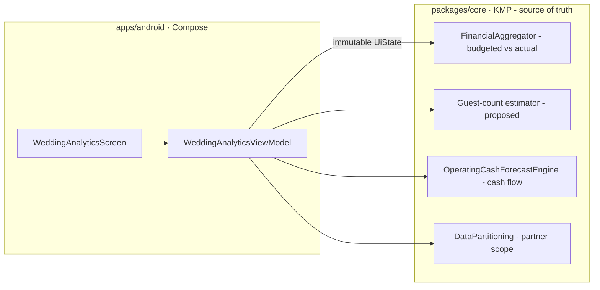
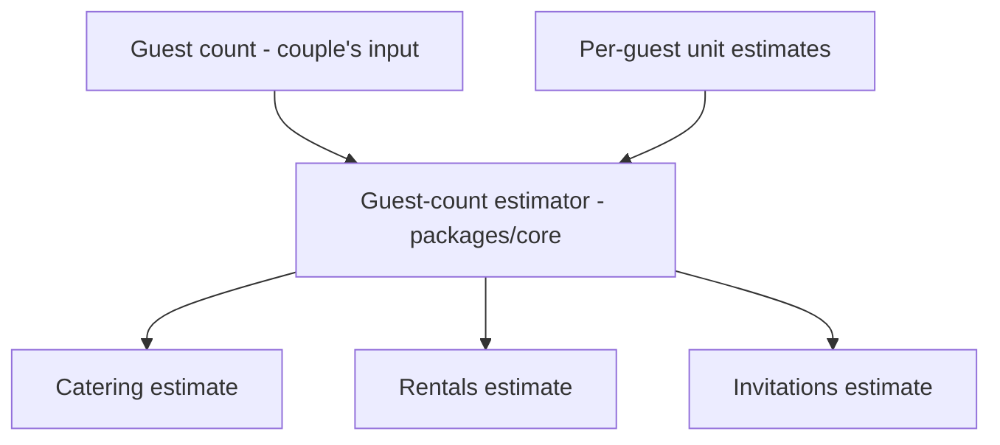

# Android Wedding Actuals, Guest-Count Estimates & Cash-Flow Views — Design

> **Status:** DESIGN — Implementation-ready (native build/test unblocked; store distribution gated by [#1242](https://github.com/jrmoulckers/finance/issues/1242))
> **Issue:** [#2647](https://github.com/jrmoulckers/finance/issues/2647) — _Part of [#2145](https://github.com/jrmoulckers/finance/issues/2145)_ (couples / life-event planning)
> **Platform:** Android (Jetpack Compose · Material 3)
> **Last Updated:** 2026-06-22

This document specifies the Android **analytics views** for the Wedding
Workspace: **budgeted-vs-actual**, **per-guest estimate rows**, **remaining
wedding spend with the next due date**, and links to **shared goals and
household cash-flow planning**. These views build on the workspace shell and
vendor tracker in
[Android Shared Wedding Workspace Shell](./android-wedding-workspace-shell.md)
([#2645](https://github.com/jrmoulckers/finance/issues/2645)).

Every total, estimate, and date bucket here is **computed in `packages/core`**
and rendered by Compose. **Estimates and projections are explicitly labeled** so
a couple never mistakes a guest-count projection for a committed amount, and all
partner-visible values respect the household privacy boundary.

---

## Table of Contents

1. [Goals & Non-Goals](#1-goals--non-goals)
2. [Architecture Boundary (Compose ↔ KMP)](#2-architecture-boundary-compose--kmp)
3. [Grounding in Existing Code](#3-grounding-in-existing-code)
4. [Budgeted-vs-Actual View](#4-budgeted-vs-actual-view)
5. [Per-Guest Estimate Rows](#5-per-guest-estimate-rows)
6. [Remaining Spend & Next Due Date](#6-remaining-spend--next-due-date)
7. [Links to Shared Goals & Household Cash Flow](#7-links-to-shared-goals--household-cash-flow)
8. [Partner Privacy in Analytics](#8-partner-privacy-in-analytics)
9. [Composable & ViewModel Structure](#9-composable--viewmodel-structure)
10. [Accessibility (TalkBack, Switch Access, Font Scaling)](#10-accessibility-talkback-switch-access-font-scaling)
11. [Offline, Empty & Error States](#11-offline-empty--error-states)
12. [Test Plan](#12-test-plan)
13. [Implementation Readiness](#13-implementation-readiness)
14. [Open Questions](#14-open-questions)

---

## 1. Goals & Non-Goals

### Goals

- Show **budgeted-vs-actual** per vendor category so the couple sees where they
  are over or under plan.
- Provide **guest-count-sensitive estimate rows** for **catering, rentals, and
  invitations** — values that scale with headcount, always labeled "Estimate."
- Surface **remaining wedding spend** and the **next due date** as a single
  glanceable summary.
- **Link to shared goals** (the wedding savings `Goal`) and **household
  cash-flow planning** so the wedding sits in the couple's overall money picture.
- Keep every view legible to **TalkBack, Switch Access, and 200% font scaling**,
  with text alternatives for any chart.

### Non-Goals

- **No money math in Compose.** Totals, per-guest multiplications, remaining
  spend, date bucketing, and cash-flow projections are computed in
  `packages/core` (see §2–§3). Compose renders and formats only.
- **No new shared planner rules here.** When shared planner rules don't yet
  exist, this doc labels the dependency; it does not implement the rules
  (owned by @kmp-engineer under #2145).
- **No vendor CRUD here.** Vendor entry/states live in the shell doc (#2645).
- **No check-in ritual here.** See
  [Android Couples Money Check-In](./android-couples-money-checkin.md) (#2652).
- **No store distribution work** (gated by #1242 — see §13).

---

## 2. Architecture Boundary (Compose ↔ KMP)

These analytics are **derived views over shared state**. Compose subscribes to a
single immutable UI state; the shared layer does the arithmetic and the
projection.

- **Per-guest estimate = headcount × per-unit estimate**, computed in shared code
  (the proposed guest-count estimator), never multiplied in Compose.
- **Cash-flow projection** reuses the existing
  [`OperatingCashForecastEngine`](../../packages/core/src/commonMain/kotlin/com/finance/core/forecast/OperatingCashForecast.kt)
  so the wedding's upcoming due dates fold into the household's projected
  balances — the same engine the
  [operating cash calendar](./android-operating-cash-calendar.md) renders.
- **Projection confidence** (the engine already models a confidence enum) is
  surfaced as a label, never hidden.

---

## 3. Grounding in Existing Code

| Concern                 | Source of truth (do **not** reimplement in Compose)                                                                                                                                                           | Today's state                                      |
| ----------------------- | ------------------------------------------------------------------------------------------------------------------------------------------------------------------------------------------------------------- | -------------------------------------------------- |
| Budgeted vs actual      | [`FinancialAggregator`](../../packages/core/src/commonMain/kotlin/com/finance/core/aggregation/FinancialAggregator.kt) + [`Budget`](../../packages/models/src/commonMain/kotlin/com/finance/models/Budget.kt) | Exists: spend-by-category, totals vs budget amount |
| Cash-flow projection    | [`OperatingCashForecastEngine`](../../packages/core/src/commonMain/kotlin/com/finance/core/forecast/OperatingCashForecast.kt)                                                                                 | Exists: horizon snapshots, threshold breaches      |
| Next due date / buckets | [`BillReminderEngine`](../../packages/core/src/commonMain/kotlin/com/finance/core/recurring/BillReminderEngine.kt)                                                                                            | Exists: `scheduleNextN`, monthly calendar          |
| Wedding savings goal    | [`Goal`](../../packages/models/src/commonMain/kotlin/com/finance/models/Goal.kt)                                                                                                                              | Exists: target/current/`progress`                  |
| Savings suggestions     | [`SavingsEngine`](../../packages/core/src/commonMain/kotlin/com/finance/core/savings/SavingsEngine.kt)                                                                                                        | Exists: suggestion generation (optional surface)   |
| Partner scope           | [`DataPartitioning`](../../packages/core/src/commonMain/kotlin/com/finance/core/household/DataPartitioning.kt)                                                                                                | Exists: `filterVisible`, `partition`               |
| Guest-count estimator   | **Proposed** thin `packages/core` addition (headcount × per-unit)                                                                                                                                             | Not yet — @kmp-engineer follow-up under #2145      |

> The **guest-count estimator** and any wedding-specific planner rules are a
> small shared addition. Until they land, Compose renders the actuals it can
> derive from existing engines and shows the estimate rows in an empty/seed
> state.

---

## 4. Budgeted-vs-Actual View

A per-category list comparing the couple's **budgeted** amount to **actual**
spend (deposits + paid installments), driven by `FinancialAggregator` and the
shared `Budget` rows.

| Column   | Meaning                                              | Source                |
| -------- | ---------------------------------------------------- | --------------------- |
| Category | Venue / Catering / Photography / …                   | Vendor category       |
| Budgeted | Planned amount for the category                      | `Budget` (shared)     |
| Actual   | Paid so far                                          | `FinancialAggregator` |
| Variance | Actual − budgeted (over/under) — **computed shared** | `FinancialAggregator` |
| Progress | Actual ÷ budgeted, shown as a bar + text             | Shared ratio          |

- **Over/under** is conveyed by text + icon + a non-color bar fill — never color
  alone (see [data-visualization.md](./data-visualization.md)).
- Each bar has a **text alternative** (e.g., "Catering: 80% of budget used").
- A **header total** shows the wedding's overall budgeted vs actual; both are
  shared figures, formatted by Compose.

---

## 5. Per-Guest Estimate Rows

Some costs scale with the guest count. These rows are **estimates** and are
labeled as such everywhere they appear.

| Estimate row | Scales with        | Example label                           |
| ------------ | ------------------ | --------------------------------------- |
| Catering     | Guests × per-plate | "Catering — estimate for 120 guests"    |
| Rentals      | Guests × per-seat  | "Rentals — estimate for 120 guests"     |
| Invitations  | Guests × per-card  | "Invitations — estimate for 120 guests" |

- **Headcount is a couple's input** (a stepper / field). Changing it re-runs the
  **shared estimator** and the UI re-renders; Compose performs no multiplication.
- Every value carries an **"Estimate" badge** and a `contentDescription` that
  says "estimated," distinct from committed/actual amounts (§4).
- A **range affordance** (e.g., "100–140 guests") can show low/high estimates if
  the shared estimator returns a band; the band is labeled, not implied.
- Editing a per-unit estimate is a shared-model value; the row updates from
  shared output.

---

## 6. Remaining Spend & Next Due Date

A compact summary card answers _"how much is left, and what's next?"_

- **Remaining wedding spend** = estimated total − actual paid, **computed in
  `packages/core`** and labeled as including estimates where guest-count rows
  contribute.
- **Next due date** = the soonest unpaid installment across all vendors, from the
  shared due-date bucket (`BillReminderEngine`). Shown as "Next: {vendor} due
  {date}."
- **Countdown context:** an optional "X days away" line, derived from the shared
  bucket against the platform clock (not computed in Compose).
- **Empty / paid:** if nothing is due, the card reads _"All caught up — no
  payments due."_

---

## 7. Links to Shared Goals & Household Cash Flow

The wedding is one part of the couple's finances; these views link out rather
than duplicating those surfaces.

- **Shared goal link:** a row shows the linked **wedding savings `Goal`** with
  its shared `progress` (e.g., "Wedding fund — 62% funded"), deep-linking to the
  existing goal surface. Progress is the shared `Goal.progress`, not recomputed.
  See [android-goal-projection-widget.md](./android-goal-projection-widget.md)
  for the projection pattern reused here.
- **Household cash-flow link:** a row summarizes how upcoming wedding due dates
  affect the household's **projected balance**, using
  [`OperatingCashForecastEngine`](../../packages/core/src/commonMain/kotlin/com/finance/core/forecast/OperatingCashForecast.kt)
  output, and deep-links to the
  [operating cash calendar](./android-operating-cash-calendar.md). Any **threshold
  breach** (projected shortfall) is surfaced as a labeled projection warning.
- These links keep the wedding views thin — they **reference** shared
  goal/cash-flow state instead of forking it.

---

## 8. Partner Privacy in Analytics

Analytics aggregate money, so they must honor the same partner boundary as the
shell (see
[android-household-privacy-dashboard.md](./android-household-privacy-dashboard.md)).

- **Aggregates respect scope:** budgeted-vs-actual and remaining-spend totals are
  computed over the **partner-visible set** via `DataPartitioning.filterVisible`
  — a partner never sees a total that includes amounts they aren't allowed to
  see.
- **Summary-only partners** see **bucketed ranges / percent** for goal and
  cash-flow links, not exact figures.
- **No private leakage in projections:** a Compose semantics test asserts a
  partner-view projection never renders an exact amount the owner kept private.

---

## 9. Composable & ViewModel Structure

| Composable               | Responsibility                                                 |
| ------------------------ | -------------------------------------------------------------- |
| `WeddingAnalyticsScreen` | Scaffold, summary card, sectioned analytics, live-region host  |
| `BudgetVsActualSection`  | Per-category list with text-alternative progress bars (§4)     |
| `GuestEstimateSection`   | Headcount stepper + estimate rows with "Estimate" badges (§5)  |
| `RemainingSpendCard`     | Remaining spend + next due date summary (§6)                   |
| `SharedGoalLinkRow`      | Wedding savings goal progress + deep link (§7)                 |
| `CashFlowLinkRow`        | Household projection summary + deep link + breach warning (§7) |
| `EstimateBadge`          | Reusable "Estimate" / "Projection" label with semantics        |

- **ViewModel:** `WeddingAnalyticsViewModel` (Koin `viewModelOf`, resolved via
  `koinViewModel()`), exposing one immutable `StateFlow<WeddingAnalyticsUiState>`
  and delegating all arithmetic/projection to shared engines.
- **Koin wiring (additions only):** `viewModelOf(::WeddingAnalyticsViewModel)`.
- **Logging:** Timber only; **never log amounts, balances, or guest counts as
  money** — log structural events as enum/boolean (e.g.
  `Timber.d("analytics section expanded: %s", section.name)`); never `Log.*`.
- **Charts:** any chart uses Material 3 tokens and ships a **text alternative /
  data table** per [data-visualization.md](./data-visualization.md).

---

## 10. Accessibility (TalkBack, Switch Access, Font Scaling)

Per [accessibility-patterns.md](./accessibility-patterns.md). All copy below is
the `contentDescription` / `semantics` string.

| Surface              | Visible UI              | TalkBack `contentDescription`                                                       |
| -------------------- | ----------------------- | ----------------------------------------------------------------------------------- |
| Budget-vs-actual row | "80% used"              | "Catering, 80 percent of budget used. Actual under budget."                         |
| Over-budget row      | ⚠ "Over"                | "Venue, over budget. Actual exceeds the planned amount."                            |
| Guest estimate row   | "Estimate · 120 guests" | "Catering, estimated for 120 guests. This is a projection, not a committed amount." |
| Headcount stepper    | "120"                   | "Guest count, 120. Adjust to update estimates."                                     |
| Remaining spend      | "$8,400 left"           | "Estimated remaining wedding spend, eight thousand four hundred dollars."           |
| Next due             | "Next: Venue Jul 3"     | "Next payment, Venue, due July 3rd."                                                |
| Cash-flow breach     | ⚠ "Tight in August"     | "Projected shortfall in August. This is a projection based on current plans."       |

- **Headings:** each analytics section uses `semantics { heading() }`.
- **Estimate vs actual:** the word "estimated"/"projection" is in the
  `contentDescription` for every estimate, so non-visual users get the same
  caveat sighted users see in the badge.
- **Switch Access:** logical order summary → budget-vs-actual → estimates →
  links; targets ≥ 48dp.
- **200% font scaling:** rows and bars reflow; numbers never truncate — verified
  via Compose preview + Paparazzi at large-font configs.
- **No color-only signaling:** over/under and breach states pair icon + text with
  color (WCAG 1.4.1).
- **Live region:** changing headcount announces _"Estimates updated for {n}
  guests."_

---

## 11. Offline, Empty & Error States

- **Offline:** analytics read from the encrypted local store and recompute from
  cached shared state; an offline chip announces _"Offline — figures may be a few
  minutes old."_ Projections show their last-synced basis.
- **Empty (no vendors/amounts):** budget-vs-actual shows "Add vendor amounts to
  compare against budget"; estimate rows prompt for a guest count; remaining-spend
  card invites entering a first amount.
- **Empty (no guest count):** estimate rows show a single "Set guest count to
  estimate catering, rentals, and invitations" prompt.
- **Empty (no goal / no cash-flow data):** link rows offer to create a wedding
  savings goal or open the cash calendar rather than showing a blank.
- **Error (load/compute):** skeleton → retry row with an announced live-region
  message; no raw stack traces; no sensitive data in messages.

---

## 12. Test Plan

- **Unit (ViewModel):** budget-vs-actual variance mapping (over / under / on);
  estimate rows reflect shared estimator output for changing headcount (UI does
  no multiplication); remaining spend and next-due taken verbatim from shared
  code; cash-flow breach surfaces when the engine reports one.
- **Shared-rule parity:** golden test that rendered totals, per-guest estimates,
  remaining spend, and projection labels equal the shared engines' output for the
  same fixtures the web/shared suites use.
- **Compose UI / semantics:** assert every estimate carries an "estimated/
  projection" `contentDescription`; assert charts expose a text alternative;
  assert partner-view aggregates never render a private exact amount.
- **Paparazzi snapshots:** budget-vs-actual (over/under), estimate rows at two
  headcounts, remaining-spend card, and link rows — at default and 200% font
  scale, light/dark + dynamic color.
- **Accessibility:** TalkBack walkthrough per §10; Switch Access order;
  touch-target and contrast checks.
- **Offline:** cached projections render with a stale-basis label; reconnect
  recomputes without flicker or double-counting.

---

## 13. Implementation Readiness

Per [`../ops/human-gated-prerequisites.md`](../ops/human-gated-prerequisites.md)
§2 (Implementation vs. Distribution), this feature is **decoupled**: design and
native implementation are buildable and testable now; only store distribution
waits on #1242.

### ✅ Buildable now (debug / free signing — no enrollment, no secrets)

- This design doc and all shared-API consumption decisions.
- All Compose UI, `WeddingAnalyticsViewModel`, and Koin wiring.
- Unit tests, Compose semantics/UI tests, and Paparazzi snapshots.
- Local verification via `./gradlew :apps:android:assembleDebug` + sideload, per
  [`../ops/human-gated-prerequisites.md`](../ops/human-gated-prerequisites.md)
  §2 "Free local build/test paths."
- The **proposed guest-count estimator / planner rules** are a `packages/core`
  change (owned by @kmp-engineer) — also unblocked; not store-gated.

### 🔒 Distribution tail — gated by [#1242](https://github.com/jrmoulckers/finance/issues/1242)

- Release signing with the production keystore.
- Google Play Console upload / release-track promotion.
- The signed-AAB release workflow and its CI secrets.

These are **human-gated** and out of scope for SME agents — see the
[Human-Gated Prerequisites Runbook](../ops/human-gated-prerequisites.md) §3.1.
Until then the feature is fully exercisable via debug sideload.

---

## 14. Open Questions

1. **Estimator band** — does the guest-count estimator return a single value or a
   low/high band? The UI supports a labeled band if provided.
2. **Budget source** — do wedding categories reuse the standard `Budget` rows, or
   a wedding-scoped budget set? Either way Compose reads shared `Budget` data.
3. **Cash-flow horizon** — what forecast horizon should the household cash-flow
   link summarize for the wedding (to next due date, to wedding date)? A shared
   default tracked under #2145.
4. **Actual definition** — does "actual" count only paid installments, or also
   committed-but-unpaid contracts? A shared rule, not a Compose choice.
