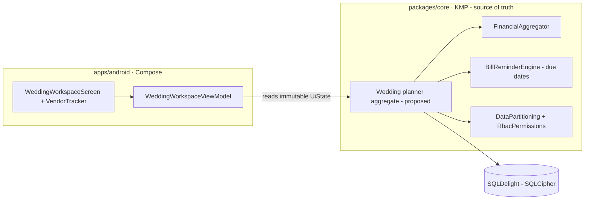
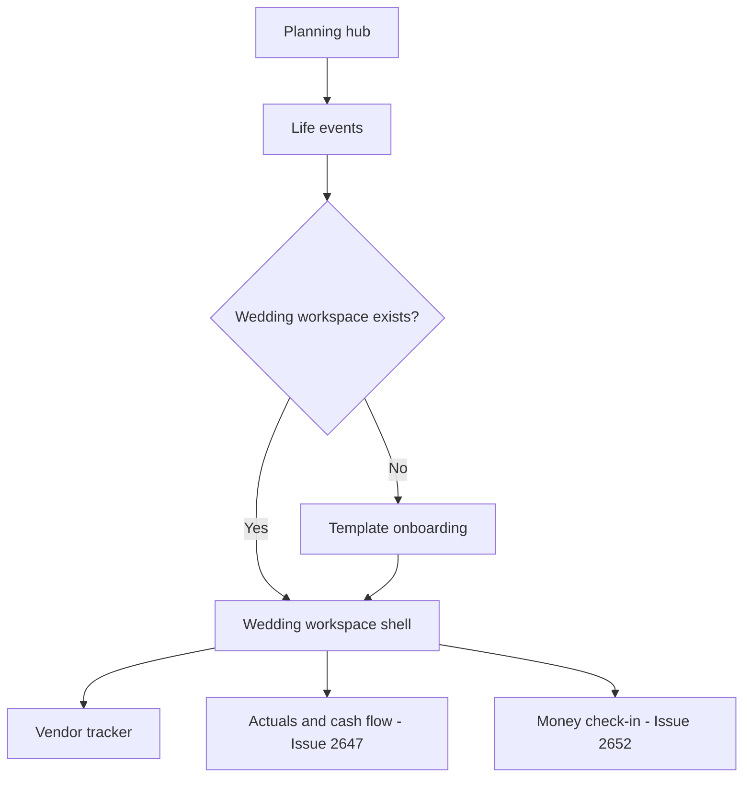
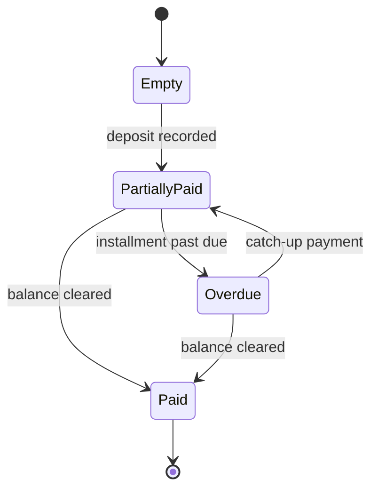

# Android Shared Wedding Workspace Shell & Vendor Tracker — Design

> **Status:** DESIGN — Implementation-ready (native build/test unblocked; store distribution gated by [#1242](https://github.com/jrmoulckers/finance/issues/1242))
> **Issue:** [#2645](https://github.com/jrmoulckers/finance/issues/2645) — _Part of [#2145](https://github.com/jrmoulckers/finance/issues/2145)_ (couples / life-event planning)
> **Platform:** Android (Jetpack Compose · Material 3)
> **Last Updated:** 2026-06-22

This document specifies the **Wedding Workspace shell** and the **vendor /
deposit tracker** for Android: a Jetpack Compose surface that a couple opens from
**Planning**, seeds from a wedding **template**, and uses to track vendors,
deposits, installment due dates, and balance states. It is the Android design
counterpart to the existing web life-event wedding concept and **renders
shared planner state computed in `packages/core`** — the Compose layer draws the
workspace, it does not own the money math or the partner-visibility policy.

Every shared figure here is a **projection / tracked actual**, not advice, and
every partner-visible value flows through the household privacy boundary so an
**invited partner sees what the workspace owner chose to share, in a read-only
mode** by default.

---

## Table of Contents

1. [Goals & Non-Goals](#1-goals--non-goals)
2. [Architecture Boundary (Compose ↔ KMP)](#2-architecture-boundary-compose--kmp)
3. [Grounding in Existing Code](#3-grounding-in-existing-code)
4. [Navigation: Planning → Wedding Workspace](#4-navigation-planning--wedding-workspace)
5. [Template Onboarding](#5-template-onboarding)
6. [Vendor & Deposit Tracker](#6-vendor--deposit-tracker)
7. [Vendor States: Empty, Overdue, Paid, Partially Paid](#7-vendor-states-empty-overdue-paid-partially-paid)
8. [Partner Privacy & Read-Only States](#8-partner-privacy--read-only-states)
9. [Composable & ViewModel Structure](#9-composable--viewmodel-structure)
10. [Accessibility (TalkBack, Switch Access, Font Scaling)](#10-accessibility-talkback-switch-access-font-scaling)
11. [Offline, Empty & Error States](#11-offline-empty--error-states)
12. [Test Plan](#12-test-plan)
13. [Implementation Readiness](#13-implementation-readiness)
14. [Open Questions](#14-open-questions)

---

## 1. Goals & Non-Goals

### Goals

- Give a couple a single **Wedding Workspace** reachable from Planning, seeded
  from a reusable **template** (catering, venue, photography, attire, rentals,
  invitations, etc.).
- Track each **vendor**: deposit paid, remaining balance, installment due dates,
  and a clear **state** (empty / overdue / paid / partially paid).
- Let an **invited partner** view the workspace **read-only** by default and
  contribute only where the owner has granted edit, honoring the household
  privacy boundary.
- Reuse the existing web wedding life-event product behavior and **shared models
  / engines** instead of duplicating business rules in Compose.
- Make every state and amount legible to **TalkBack, Switch Access, and 200%
  font scaling**, with non-color status cues.

### Non-Goals

- **No new money math in Compose.** Totals, remaining balances, due-date
  bucketing, and projections come from `packages/core` (see §2–§3). A gap in
  shared rules is a `packages/` task owned by @kmp-engineer, not a Compose
  workaround.
- **No actuals / cash-flow analytics here.** Budgeted-vs-actual, per-guest
  estimates, and remaining-cash views are designed in the sibling doc
  [Android Wedding Actuals & Cash-Flow Views](./android-wedding-actuals-cashflow.md)
  ([#2647](https://github.com/jrmoulckers/finance/issues/2647)).
- **No check-in ritual here.** The couples money check-in is
  [Android Couples Money Check-In](./android-couples-money-checkin.md)
  ([#2652](https://github.com/jrmoulckers/finance/issues/2652)).
- **No store distribution work.** Release signing, Play Console upload, and the
  release CI workflow stay gated by #1242 (see §13).
- **No XML layouts, AlarmManager/JobScheduler, or secrets in SharedPreferences.**

---

## 2. Architecture Boundary (Compose ↔ KMP)

The workspace is a **thin renderer of shared state**. The Compose layer owns
layout, navigation, accessibility, and input affordances; the **shared layer in
`packages/core` owns every monetary value, due-date bucket, and the
partner-visibility decision**.

- The ViewModel exposes **one immutable `StateFlow<WeddingWorkspaceUiState>`**;
  the screen collects it with `koinViewModel()`.
- **All amounts are `Cents`/`Money` from shared code.** Compose never adds,
  subtracts, or rounds money. It formats locale-aware strings for display only.
- The **proposed shared "wedding planner aggregate"** (a thin `packages/core`
  addition owned by @kmp-engineer) composes existing engines; this Android doc
  consumes it and does not define it. Until it lands, the workspace renders an
  empty/seed state.

---

## 3. Grounding in Existing Code

The workspace composes capabilities that already exist in the shared layer or are
a small, well-scoped addition to it.

| Concern                       | Source of truth (do **not** reimplement in Compose)                                                                                                                                                                           | Today's state                                      |
| ----------------------------- | ----------------------------------------------------------------------------------------------------------------------------------------------------------------------------------------------------------------------------- | -------------------------------------------------- |
| Vendor totals / remaining     | [`FinancialAggregator`](../../packages/core/src/commonMain/kotlin/com/finance/core/aggregation/FinancialAggregator.kt)                                                                                                        | Exists: totals, net cash flow, spend by category   |
| Installment / due-date bucket | [`BillReminderEngine`](../../packages/core/src/commonMain/kotlin/com/finance/core/recurring/BillReminderEngine.kt)                                                                                                            | Exists: `scheduleNextN`, `generateMonthlyCalendar` |
| Installment record analog     | [`LiabilityInstallment`](../../packages/models/src/commonMain/kotlin/com/finance/models/LiabilityInstallment.kt)                                                                                                              | Exists: due date + amount + paid model to mirror   |
| Goal linkage (wedding fund)   | [`Goal`](../../packages/models/src/commonMain/kotlin/com/finance/models/Goal.kt)                                                                                                                                              | Exists: target/current/progress, `householdId`     |
| Partner partition & roles     | [`DataPartitioning`](../../packages/core/src/commonMain/kotlin/com/finance/core/household/DataPartitioning.kt) + [`RbacPermissions`](../../packages/core/src/commonMain/kotlin/com/finance/core/household/RbacPermissions.kt) | Exists: `filterVisible`, `partition`, role gates   |
| Web parity reference          | Web life-event wedding concept (reuse copy/semantics, do not fork)                                                                                                                                                            | Exists: product reference per #2645 notes          |
| Wedding planner aggregate     | **Proposed** thin `packages/core` addition that composes the rows above                                                                                                                                                       | Not yet — @kmp-engineer follow-up under #2145      |

> **Models** ([`Goal`](../../packages/models/src/commonMain/kotlin/com/finance/models/Goal.kt),
> [`Budget`](../../packages/models/src/commonMain/kotlin/com/finance/models/Budget.kt))
> already carry `householdId`/`ownerId`, so partner scoping is consistent with
> the rest of the app. The vendor/deposit records the workspace reads are a
> shared-model addition (owned by @kmp-engineer); Compose renders whatever the
> shared layer exposes.

---

## 4. Navigation: Planning → Wedding Workspace

The workspace is a destination under Planning, not a new top-level tab — it
follows the app's existing information architecture (see
[information-architecture.md](./information-architecture.md)).

- Entry point: a **"Plan a wedding"** card in the Planning life-events list.
- The route is registered in the existing nav graph (`FinanceNavHost`), reusing
  Planning's back stack — no parallel navigation tree.
- Deep link `finance://planning/wedding` opens the workspace (or onboarding if
  none exists), so notifications and the check-in flow can route into it.

---

## 5. Template Onboarding

First open with no workspace shows a **template picker** that seeds a starter set
of vendor categories. The template is **product copy + category seeds only** —
amounts and dates stay empty until the couple enters them.

- **Template choices:** _Classic_, _Intimate_, _Destination_, _Build my own_.
  Each pre-creates vendor placeholders (e.g., Venue, Catering, Photography,
  Attire, Flowers, Music, Rentals, Invitations).
- **Couple basics (optional):** target date, who's invited as a partner, and an
  optional link to a **wedding savings `Goal`** so progress is visible.
- Seeding writes **placeholder vendor rows with zero amounts**; the couple fills
  in deposits and balances later. No projection is shown until at least one
  vendor has an amount.
- A **"Skip template"** path lands directly on an empty tracker with an
  add-vendor affordance.

> Onboarding copy follows [content-language-guidelines.md](./content-language-guidelines.md)
> and [cognitive-accessibility.md](./cognitive-accessibility.md): plain,
> supportive, no jargon, one decision per step.

---

## 6. Vendor & Deposit Tracker

The tracker is the workspace's core surface: a scrollable list of **vendor
cards**, each summarizing the deposit, remaining balance, and next due date.

| Field           | Meaning                                                  | Source                       |
| --------------- | -------------------------------------------------------- | ---------------------------- |
| Vendor name     | Free text (e.g., "Riverside Venue")                      | User input (shared model)    |
| Category        | Venue / Catering / Photography / …                       | Template seed or user        |
| Estimated total | What the couple expects to owe — **labeled "Estimate"**  | User input                   |
| Deposit paid    | Amount already paid                                      | User input → shared total    |
| Remaining       | Estimated total − paid — **computed in `packages/core`** | `FinancialAggregator`        |
| Installments    | Optional schedule of due dates + amounts                 | `BillReminderEngine` buckets |
| Next due date   | Soonest unpaid installment                               | Shared due-date bucket       |
| State           | Empty / Overdue / Paid / Partially paid (§7)             | Derived in shared layer      |

- **Data entry UX:** a bottom sheet (`VendorEditSheet`) with Material 3 fields;
  amount entry uses the app's shared money input. Adding an installment opens an
  inline date + amount row.
- **Remaining balance is never computed in Compose.** The ViewModel reads the
  shared `remaining` value; the card formats it.
- **Quick actions:** mark a deposit paid, add an installment, or attach the
  vendor to the wedding savings `Goal`.

---

## 7. Vendor States: Empty, Overdue, Paid, Partially Paid

Each vendor card renders exactly one **state**, derived in the shared layer and
surfaced with text + icon (never color alone — see
[data-visualization.md](./data-visualization.md) on non-color cues).

| State              | Visible cue                | Meaning                                               |
| ------------------ | -------------------------- | ----------------------------------------------------- |
| **Empty**          | "No amount yet" + outline  | Placeholder vendor, no estimate or deposit entered    |
| **Partially paid** | "Deposit paid" + half ring | Some paid, balance remaining, no past-due installment |
| **Overdue**        | ⚠ "Past due" + bold        | An installment due date has passed and is unpaid      |
| **Paid**           | ✓ "Paid in full"           | Remaining balance is zero                             |

- **Overdue** is determined by the shared due-date bucket against the device
  clock passed in from the platform — Compose does not compute "past due."
- Status order in the list: Overdue first, then Partially paid, then Empty, then
  Paid (a shared-sorted list; UI honors it).

---

## 8. Partner Privacy & Read-Only States

A wedding is a **shared life event**, but the workspace still respects the
household privacy boundary defined in
[android-household-privacy-dashboard.md](./android-household-privacy-dashboard.md).

- **Owner vs invited partner:** the workspace owner can edit; an **invited
  partner is read-only by default**. Edit grants come from `RbacPermissions`
  (e.g., a `PARTNER` role with edit vs a `VIEWER`), never from a Compose flag.
- **Read-only rendering:** when the viewer lacks edit, the edit sheet, quick
  actions, and add-vendor FAB are **absent (not just disabled)**, and a banner
  announces _"You're viewing {owner}'s wedding workspace."_
- **Privacy-safe summaries:** if a vendor or the linked savings goal is shared as
  a summary, the partner sees a **bucketed range / percent**, not exact amounts —
  reusing the same masking the privacy dashboard documents.
- **No leakage:** a Compose semantics test asserts no exact amount string appears
  in a partner-view node when the shared policy says "summary only."

---

## 9. Composable & ViewModel Structure

All UI is Jetpack Compose + Material 3 with dynamic color (Material You); no XML.

| Composable               | Responsibility                                                        |
| ------------------------ | --------------------------------------------------------------------- |
| `WeddingWorkspaceScreen` | Scaffold, header summary, vendor list, FAB, snackbar/live-region host |
| `TemplatePickerScreen`   | One-decision-per-step onboarding (§5)                                 |
| `VendorCard`             | Per-vendor summary: estimate, deposit, remaining, next due, state     |
| `VendorStateChip`        | Empty / Overdue / Paid / Partially-paid chip with merged semantics    |
| `VendorEditSheet`        | Material 3 bottom sheet for entry (owner / edit-granted only)         |
| `InstallmentRow`         | Inline due-date + amount row                                          |
| `PartnerReadOnlyBanner`  | "Viewing {owner}'s workspace" notice for invited partners             |

- **ViewModel:** `WeddingWorkspaceViewModel` (Koin `viewModelOf`, resolved via
  `koinViewModel()`), exposing one immutable `StateFlow<WeddingWorkspaceUiState>`
  and delegating every monetary/visibility decision to shared code.
- **Koin wiring (additions only):** `viewModelOf(::WeddingWorkspaceViewModel)` —
  reuses the existing household id provider, repositories, and aggregator.
- **Logging:** Timber only. **Never log vendor names, amounts, or balances** —
  log state transitions as enum names (e.g.
  `Timber.d("vendor state -> %s", state.name)`), never `Log.*`.
- **Theming:** Material 3 semantic tokens; no hard-coded hex.

---

## 10. Accessibility (TalkBack, Switch Access, Font Scaling)

All copy below is the `contentDescription` / `semantics` string per
[accessibility-patterns.md](./accessibility-patterns.md). `{owner}` /
`{partner}` resolve to display names; amounts come from the locale-aware
formatter.

| Surface               | Visible UI       | TalkBack `contentDescription`                                              |
| --------------------- | ---------------- | -------------------------------------------------------------------------- |
| Vendor card (partial) | "Deposit paid"   | "{vendor}, partially paid. Deposit recorded, estimated balance remaining." |
| Vendor card (overdue) | ⚠ "Past due"     | "{vendor}, payment past due. An installment due date has passed."          |
| Vendor card (paid)    | ✓ "Paid in full" | "{vendor}, paid in full."                                                  |
| Vendor card (empty)   | "No amount yet"  | "{vendor}, no amount entered yet. Double tap to add an estimate."          |
| Next due date         | "Due Jul 3"      | "Next installment due July 3rd, estimated."                                |
| Partner read-only     | banner           | "You're viewing {owner}'s wedding workspace. Editing is off for you."      |
| Add vendor FAB        | "+" FAB          | "Add a wedding vendor."                                                    |

- **Headings:** workspace section headers use `semantics { heading() }`.
- **No double-announcement:** when the state chip already says "Overdue," the
  amount node does not repeat it within the same focusable group.
- **Switch Access:** logical focus order Overdue → Partial → Empty → Paid,
  matching the shared sort; all targets ≥ 48dp.
- **200% font scaling:** vendor cards reflow (wrap, never truncate amounts);
  verified in Compose preview + Paparazzi at large-font configs.
- **Live region:** marking a deposit paid announces _"{vendor} marked paid"_ via
  a polite live region.
- **Non-color cues:** every state pairs an icon + text with its color (WCAG
  1.4.1).

---

## 11. Offline, Empty & Error States

- **Offline:** the workspace is **offline-first** — vendor data reads from the
  encrypted local SQLDelight store; edits queue and sync via WorkManager. An
  offline chip announces _"Offline — changes will sync later."_
- **Empty (no workspace):** template picker (§5).
- **Empty (workspace, no vendors):** an illustration + "Add your first vendor"
  with a single primary action; no projection shown.
- **Empty (placeholders only):** vendors exist but no amounts → cards in the
  Empty state; the header summary reads _"Add amounts to see your wedding
  total."_
- **Error (load):** skeleton cards → retry row with an announced live-region
  message; no raw stack traces, no sensitive data in the message.
- **Stale partner view:** if a partner's cached view is older than the owner's
  last sync, a subtle "Last updated …" line sets expectations.

---

## 12. Test Plan

- **Unit (ViewModel):** state mapping from shared planner output — Empty /
  Partial / Overdue / Paid; sort order (Overdue first); partner read-only when
  `RbacPermissions` denies edit; remaining balance taken verbatim from shared
  code (no Compose-side arithmetic).
- **Shared-rule parity:** a golden test asserts the rendered vendor states and
  remaining balances equal the shared aggregate's output for the same fixtures
  the web suite uses — proves the UI didn't fork business rules.
- **Compose UI / semantics:** assert `contentDescription` on every card, chip,
  amount, and the FAB; assert the edit sheet/FAB are **absent** for read-only
  partners; assert no exact amount leaks into a summary-only partner node.
- **Paparazzi snapshots:** each vendor state, plus owner vs partner read-only,
  at default and 200% font scale, light/dark + dynamic color.
- **Accessibility:** TalkBack walkthrough script per §10; Switch Access focus
  order; touch-target and contrast checks.
- **Offline:** edits made offline persist locally and reconcile on reconnect
  (WorkManager sync), with no duplicate vendor rows.

---

## 13. Implementation Readiness

Per [`../ops/human-gated-prerequisites.md`](../ops/human-gated-prerequisites.md)
§2 (Implementation vs. Distribution), this feature is **decoupled**: design and
native implementation are buildable and testable now; only store distribution
waits on #1242.

### ✅ Buildable now (debug / free signing — no enrollment, no secrets)

- This design doc and all shared-API consumption decisions.
- All Compose UI, `WeddingWorkspaceViewModel`, and Koin wiring.
- Unit tests, Compose semantics/UI tests, and Paparazzi snapshots.
- Local verification via `./gradlew :apps:android:assembleDebug` + sideload
  ("Install unknown apps"), per
  [`../ops/human-gated-prerequisites.md`](../ops/human-gated-prerequisites.md)
  §2 "Free local build/test paths."
- The **proposed wedding planner aggregate** is a `packages/core` change (owned
  by @kmp-engineer) — also unblocked; not store-gated.

### 🔒 Distribution tail — gated by [#1242](https://github.com/jrmoulckers/finance/issues/1242)

- Release signing with the production keystore.
- Google Play Console upload / release-track promotion.
- The signed-AAB release workflow and its CI secrets.

These are **human-gated** ($25 enrollment, identity verification, keystore
generation, GitHub secret config) and out of scope for SME agents — see the
[Human-Gated Prerequisites Runbook](../ops/human-gated-prerequisites.md) §3.1.
Until then the feature is fully exercisable via debug sideload.

---

## 14. Open Questions

1. **Vendor model location** — does the shared layer add a dedicated
   `WeddingVendor` record, or reuse a generic life-event line item with an
   installment child (mirroring `LiabilityInstallment`)? Compose renders either.
2. **Wedding planner aggregate shape** — confirm the proposed `packages/core`
   aggregate exposes pre-derived state + sort so all platforms render identical
   vendor states.
3. **Partner edit grants** — should "Ours" wedding workspaces default partners to
   edit, or stay read-only until explicitly granted via `RbacPermissions`?
4. **Goal linkage** — when a vendor is attached to a wedding savings `Goal`, do
   deposits decrement the goal target view, or stay independent? Likely a shared
   decision tracked under #2145.
