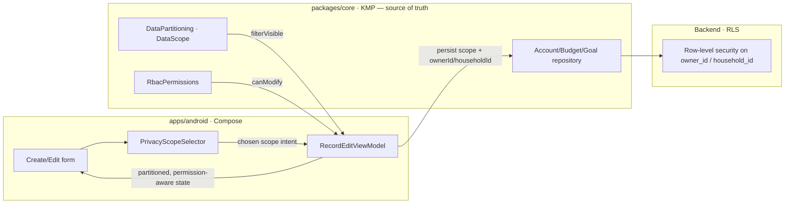
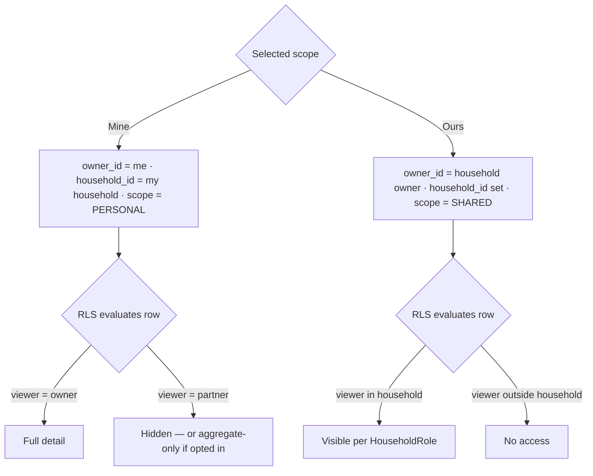
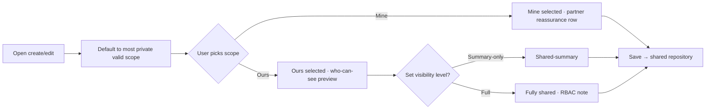

# Android Yours / Mine / Ours Privacy Selection — Create & Edit Flows — Design

> **Status:** DESIGN — Implementation-ready (native build/test unblocked; store distribution gated by [#1242](https://github.com/jrmoulckers/finance/issues/1242))
> **Issue:** [#2459](https://github.com/jrmoulckers/finance/issues/2459) — _Part of [#2142](https://github.com/jrmoulckers/finance/issues/2142)_ (yours/mine/ours household privacy foundation)
> **Platform:** Android (Jetpack Compose · Material 3)
> **Last Updated:** 2026-06-22

This document specifies the **Compose privacy selector** added to the **create and
edit** flows for **accounts, budgets, goals, and (future) liabilities**, so each
record can be classified as **Yours**, **Mine**, or **Ours**. The selector is the
authoring counterpart to the read-only
[Household Privacy Dashboard](android-household-privacy-dashboard.md): the dashboard
shows _how_ records are partitioned; this selector lets the owner _choose_ the
partition at the moment a record is created or edited.

This is a **privacy control, not a sharing prompt.** The default is the most
private sensible option, every choice is reversible, and the selected value drives
**household row-level visibility** in the shared layer — it is never interpreted or
enforced by Compose. No money math and no partition/RBAC rules are written here;
that logic is a **shared `packages/core` concern** (owned by @native-app-engineer), with
the web "yours, mine, ours" foundation as the parity reference.

---

## Table of Contents

1. [Goals & Non-Goals](#1-goals--non-goals)
2. [Architecture Boundary (Compose ↔ KMP)](#2-architecture-boundary-compose--kmp)
3. [Grounding in Existing Code](#3-grounding-in-existing-code)
4. [Privacy Vocabulary & Data-Model Mapping](#4-privacy-vocabulary--data-model-mapping)
5. [Data-Model & RLS Implications (owner_id / household_id)](#5-data-model--rls-implications-owner_id--household_id)
6. [Selector UX in Create & Edit](#6-selector-ux-in-create--edit)
7. [UI States: Owner, Visibility, Summary-Only, Edit Permission](#7-ui-states-owner-visibility-summary-only-edit-permission)
8. [Plain-Language Copy](#8-plain-language-copy)
9. [Composable & ViewModel Structure](#9-composable--viewmodel-structure)
10. [Accessibility (TalkBack, Switch Access, Font Scaling)](#10-accessibility-talkback-switch-access-font-scaling)
11. [Offline, Empty & Error States](#11-offline-empty--error-states)
12. [Test Plan](#12-test-plan)
13. [Implementation Readiness](#13-implementation-readiness)
14. [Open Questions](#14-open-questions)
15. [References](#15-references)

---

## 1. Goals & Non-Goals

### Goals

- Add a single, consistent **Yours / Mine / Ours** selector to the **create and
  edit** flows for **Account**, **Budget**, **Goal**, and a forward-compatible
  **Liability** type.
- Define **UI states** for the four concerns the issue calls out: **owner**,
  **household visibility**, **summary-only partner access**, and **edit
  permission**.
- Document how the selected value **maps to shared `Account`/`Budget`/`Goal`
  fields** (`ownerId` / `householdId` plus the parent-issue scope/visibility
  field) once the KMP models expose them.
- Cover **empty, error, and accessibility** states for couples where **one or both
  partners are not yet invited**.
- Default to the **most private** sensible option and make every change
  **reversible** without data loss.

### Non-Goals

- **No new shared business rules.** The selector renders and writes a scope value;
  it does not implement partitioning, RLS, or RBAC. That is a `packages/` change
  owned by @native-app-engineer (see §2–§3).
- **No money math in Compose.** Net-worth inclusion, masking, and aggregation are
  shared concerns consumed read-only.
- **No model schema authoring here.** Adding a per-record scope/visibility field to
  `Account`/`Budget`/`Goal` is parent-issue
  [#2142](https://github.com/jrmoulckers/finance/issues/2142) work in
  `packages/models`; this doc specifies the Android surface that reads/writes it.
- **No store distribution work** (gated by #1242 — see §13).

---

## 2. Architecture Boundary (Compose ↔ KMP)

The selector is a **thin authoring control over shared state.** Compose collects an
intent ("make this Ours"), the **shared layer decides what that means** for
visibility and persistence, and Compose re-renders the resulting partitioned state.

**Rule:** Compose never computes who-can-see-what. It surfaces the choice, sends it
to the shared repository, and renders the partitioned/permission-aware result
returned by `DataPartitioning` + `RbacPermissions`. RLS on the backend is the final
enforcement boundary — the selector value is an _input_ to that policy, never a
client-side gate.

---

## 3. Grounding in Existing Code

The selector composes capabilities that already exist or are planned in the shared
layer; it must not reimplement them in Compose.

| Concern                      | Source of truth (do **not** reimplement in Compose)                                                                                                                                      | Today's state                                            |
| ---------------------------- | ---------------------------------------------------------------------------------------------------------------------------------------------------------------------------------------- | -------------------------------------------------------- |
| Shared vs personal partition | [`DataPartitioning`](../../packages/core/src/commonMain/kotlin/com/finance/core/household/DataPartitioning.kt) (`DataScope.PERSONAL`/`SHARED`)                                           | Exists: `filterVisible`, `partition`, `canModify`        |
| Role permissions             | [`RbacPermissions`](../../packages/core/src/commonMain/kotlin/com/finance/core/household/RbacPermissions.kt) (OWNER/PARTNER/MEMBER/VIEWER)                                               | Exists: `editBudgets`, `manageMembers`, …                |
| Core models                  | [`Account.kt`](../../packages/models/src/commonMain/kotlin/com/finance/models/Account.kt), [`Household.kt`](../../packages/models/src/commonMain/kotlin/com/finance/models/Household.kt) | Carry `ownerId` / `householdId` + `HouseholdRole`        |
| Per-record scope field       | Parent issue [#2142](https://github.com/jrmoulckers/finance/issues/2142) in `packages/models`                                                                                            | Planned: Yours/Mine/Ours scope the selector reads/writes |
| Web parity reference         | Web "yours, mine, ours" create/edit privacy controls                                                                                                                                     | Exists: reuse copy/semantics, do not fork business rules |

> **Key framing:** `Account`/`Household`/`HouseholdMember` already carry
> `householdId` / `ownerId` and a `HouseholdRole`. The per-record **scope**
> (Yours/Mine/Ours) is the parent-issue addition this selector will write once
> [#2142](https://github.com/jrmoulckers/finance/issues/2142) lands it in the shared
> model. Until then the selector is built against an interface seam and verified
> with fakes.

---

## 4. Privacy Vocabulary & Data-Model Mapping

We render the persona's plain-language **"yours, mine, ours"** and map it onto the
shared `DataPartitioning.DataScope` plus a visibility level — identical to the
mapping established in the
[Household Privacy Dashboard](android-household-privacy-dashboard.md#3-privacy-model--vocabulary)
so authoring and viewing stay consistent.

| UI label  | Shared scope                 | Owner      | Who sees full detail | Who sees aggregate-only       |
| --------- | ---------------------------- | ---------- | -------------------- | ----------------------------- |
| **Mine**  | `PERSONAL` (owner = me)      | Me         | Only me              | No one (optional net-worth)   |
| **Ours**  | `SHARED`                     | Household  | Both partners        | —                             |
| **Yours** | `PERSONAL` (owner = partner) | My partner | Only my partner      | Me (aggregate-only, optional) |

Notes:

- **Mine** and **Yours** are the _same scope_ (`PERSONAL`) seen from opposite
  sides; an owner only ever authors **Mine** or **Ours** for records they create.
  **Yours** is how a record _someone else_ owns appears to me — shown read-only for
  context, never directly selectable when I am not the owner.
- The **visibility level** (private vs. shared-summary vs. fully shared) is a
  secondary control that only applies to `PERSONAL` records the owner opts into the
  combined net worth — again decided by the shared layer.

---

## 5. Data-Model & RLS Implications (owner_id / household_id)

This section is **conceptual** — it describes the data-model implications the
selector feeds, not an implementation. The actual columns, policies, and migration
are shared/back-end work; Android only writes the chosen scope.

Conceptual implications:

- **`owner_id`** records who authored the row and anchors **Mine/Yours**. A
  `PERSONAL` row is visible in full only to its `owner_id`; partners see nothing
  unless the owner opts it into a privacy-safe aggregate.
- **`household_id`** scopes the row to a household and anchors **Ours**. A `SHARED`
  row is visible to every household member, with edit gated by their
  `HouseholdRole` via `RbacPermissions`.
- The **selected scope is an input to row-level security**, not a client guard. The
  Compose selector persists `scope` + `ownerId`/`householdId`; the backend RLS
  policy and the shared `DataPartitioning.filterVisible` are what actually prevent a
  partner's private item from leaking.
- **Re-classifying** a record (Mine → Ours, or Ours → Mine) is a scope change the
  shared layer must validate against `RbacPermissions.canModify`; the UI surfaces it
  as a confirmable, reversible action (see §6) but does not enforce the rule.

> **Privacy invariant:** at no point does the Android client read or render another
> member's `PERSONAL` line items. If a partner's record is not visible to me per the
> shared filter, the selector and forms treat it as **absent**, not "hidden behind a
> lock with a peek" — there is nothing to peek at on the client.

---

## 6. Selector UX in Create & Edit

A single reusable **`PrivacyScopeSelector`** appears in the same position across all
four record types, just below the record's name/amount and above advanced options.

- **Control type:** a Material 3 **single-select segmented button** (`Mine` /
  `Ours`) for primary scope, with an inline **visibility** sub-control (a labelled
  switch row: _"Show partner a summary"_) revealed only when relevant. Segmented
  buttons keep all options visible (better for Switch Access and low recall than a
  hidden dropdown).
- **Default:** the **most private valid** option. For a brand-new record in a
  household with no partner yet, default is **Mine**; **Ours** is offered but
  annotated "shared once {partner} joins."
- **Live preview row:** a one-line, plain-language "**Who can see this**" summary
  updates as the user changes the scope (e.g., _"Only you"_, _"You and {partner}"_,
  _"You and {partner} — summary only"_).
- **Edit flow parity:** editing shows the current scope pre-selected; changing it
  presents a **confirmation** describing the visibility change ("Sharing this budget
  will let {partner} see its activity") and is fully reversible afterward.
- **Liabilities (future):** the same selector is wired behind a feature seam so the
  upcoming liability type inherits identical behavior with no redesign.

---

## 7. UI States: Owner, Visibility, Summary-Only, Edit Permission

The four acceptance-criteria states, each with explicit Compose treatment:

| State                    | When                                                  | Compose treatment                                                                                         |
| ------------------------ | ----------------------------------------------------- | --------------------------------------------------------------------------------------------------------- |
| **Owner**                | Viewer is the record `owner_id`                       | Full selector enabled; can switch Mine ⇄ Ours; shows "You own this."                                      |
| **Household visibility** | Scope = `SHARED` (Ours)                               | "Who can see this" = both partners; visibility sub-control offered; RBAC note clarifies edit rights.      |
| **Summary-only partner** | `PERSONAL` opted into combined net worth as aggregate | Switch row "Show partner a summary"; preview reads "summary only — no transactions"; uses shared masking. |
| **Edit permission**      | Viewer is not owner / role lacks `canModify`          | Selector is **read-only** with current scope shown + reason ("{partner} owns this"); no silent failure.   |

Cross-cutting rules:

- **Owner-gated editing:** if `RbacPermissions.canModify` is false, the selector
  renders disabled with a clear reason — never enabled-then-rejected.
- **Summary-only never reveals detail:** the aggregate preview uses the shared
  masking path (bucketed/percent), consistent with
  [Privacy-Safe Share Cards](android-privacy-safe-share-cards.md); Compose does not
  format raw amounts for a non-owner.
- **Visibility is independent of scope:** a `SHARED` record can still be
  full-detail or summary-only depending on the household's net-worth choice; the UI
  keeps the two controls visually distinct.

---

## 8. Plain-Language Copy

Copy is warm, neutral, and never implies suspicion. Examples (final strings live in
string resources for i18n + lint):

- Scope labels: **Mine**, **Ours** (with **Yours** used only when describing a
  partner-owned record).
- Helper under selector: _"You decide who sees this. You can change it anytime."_
- Mine preview: _"Only you can see this."_
- Ours preview: _"You and {partner} can see this."_
- Summary-only preview: _"{partner} sees a summary — not your transactions."_
- No-partner annotation: _"Shared automatically once {partner} joins."_
- Read-only reason: _"{partner} owns this, so only they can change who sees it."_
- Re-share confirmation: _"Share this {record} with {partner}? They'll see its
  activity. You can make it private again later."_

All copy avoids blame phrasing; a string-resource lint guards against accusatory or
surveillance language (e.g., "track," "monitor," "caught").

---

## 9. Composable & ViewModel Structure

Indicative structure (no Kotlin written until #1242 unblocks native work):

- **`PrivacyScopeSelector`** — stateless Composable taking `scope`,
  `availableScopes`, `visibility`, `isReadOnly`, `partnerName`, and emitting
  `onScopeChange` / `onVisibilityChange`. Reused by all four forms.
- **`PrivacyPreviewRow`** — derives the "Who can see this" line purely from props;
  no data access.
- **`RecordEditViewModel`** (per record type, or a shared base) — holds the draft,
  asks the shared repository for `availableScopes` and `canModify`, and persists the
  chosen scope through the shared repository. It **delegates** all visibility logic
  to `DataPartitioning` / `RbacPermissions`.
- **Koin wiring:** the selector needs no DI of its own; the owning
  `RecordEditViewModel` is provided via `viewModelOf(...)` and obtained in the form
  with `koinViewModel<…>()`, consistent with existing edit screens.
- **Logging:** any diagnostic logging uses **Timber** and **never** logs balances,
  amounts, account numbers, or the scope of a specific named record.

---

## 10. Accessibility (TalkBack, Switch Access, Font Scaling)

- **TalkBack:** each segmented option exposes role = radio/`selectableGroup()` with
  a `contentDescription` like _"Mine, only you can see this, selected."_ The
  "Who can see this" preview is a polite **live region** that announces the new
  audience when scope changes.
- **No redundant announcements:** the selected state is conveyed once (not "selected
  selected"); the preview row is not re-read on unrelated recompositions.
- **Switch Access:** logical order is scope options → visibility switch → preview →
  Save; all targets ≥ 48dp; the selector is fully operable without gestures.
- **200% font scaling:** segmented labels and preview text reflow and never
  truncate; verified via Compose previews and Paparazzi at large-font configs.
- **No color-only signaling:** scope and visibility pair an icon + text label with
  color (e.g., lock icon for Mine, two-people icon for Ours).
- **Disabled (read-only) state:** announces the reason, not just "disabled"
  (_"Mine, only your partner can change this"_).

---

## 11. Offline, Empty & Error States

- **Offline:** the selector works fully offline against cached partition state; a
  scope change saves locally and syncs via the existing pipeline. The preview notes
  _"Saved — will sync"_ rather than blocking.
- **Empty (no partner invited yet):** **Ours** is selectable but annotated "shared
  once {partner} joins"; **Mine** is the default. No error, no dead-end — the record
  saves and becomes shared automatically when the partner accepts.
- **Empty (one partner invited, not accepted):** same as above, plus a quiet
  reassurance _"{partner} hasn't joined yet — nothing is shared until they do."_
- **Error (scope change rejected by shared rule):** if the shared layer rejects a
  re-classification (e.g., role lacks `canModify`), the form reverts to the prior
  scope and shows a non-blocking message with the reason — no stack traces, no
  sensitive data, no partial save.
- **Error (partition/permission fetch fails):** the selector falls back to
  **read-only Mine** (the safest scope) with a "couldn't load sharing options"
  retry, never defaulting to accidental sharing.

---

## 12. Test Plan

- **Unit (ViewModel):** default-to-most-private logic; available scopes when
  partner absent/invited/joined; `canModify` gating; scope persistence calls the
  shared repository with correct `scope` + owner/household intent; reject-and-revert
  on shared-rule failure.
- **Privacy parity (critical):** assert a non-owner viewer never receives another
  member's `PERSONAL` detail through any selector/form path; assert summary-only
  uses the shared masking formatter and never raw amounts.
- **Compose UI / semantics:** assert `contentDescription` on every scope option,
  the visibility switch, and the preview; assert read-only state announces a reason;
  assert the selector is Switch-Access operable.
- **Copy / tone tests:** string-resource test asserts no accusatory/surveillance
  phrasing in selector, preview, confirmation, and accessibility strings.
- **Paparazzi snapshots:** create + edit forms in Mine, Ours, Ours-summary, and
  read-only states; at default and 200% font scale; light/dark + dynamic color.
- **Accessibility:** TalkBack walkthrough per §10; Switch Access order; touch-target
  and contrast checks; large-font reflow.
- **State coverage:** offline save, no-partner, invited-not-joined, rejected scope
  change, and partition-fetch failure all verified.

---

## 13. Implementation Readiness

Per [`../ops/human-gated-prerequisites.md`](../ops/human-gated-prerequisites.md) §2
(Implementation vs. Distribution), this feature is **decoupled**: design and native
implementation are buildable and testable now; only store distribution waits on
[#1242](https://github.com/jrmoulckers/finance/issues/1242).

### ✅ Buildable now (debug / free signing — no enrollment, no secrets)

- This design doc and all scope-mapping decisions.
- The `PrivacyScopeSelector`, `PrivacyPreviewRow`, and `RecordEditViewModel`
  changes, built against a shared interface seam (fakes until #2142 lands the scope
  field).
- Unit tests, privacy-parity tests, copy/tone tests, Compose semantics/UI tests, and
  Paparazzi snapshots.
- Local verification via `./gradlew :apps:android:assembleDebug` + sideload, per
  [`../ops/human-gated-prerequisites.md`](../ops/human-gated-prerequisites.md) §2
  "Free local build/test paths."
- The per-record **scope/visibility** field is a `packages/` change owned by
  @native-app-engineer — also unblocked; not store-gated.

### 🔒 Distribution tail — gated by [#1242](https://github.com/jrmoulckers/finance/issues/1242)

- Release signing with the production keystore.
- Google Play Console upload / release-track promotion.
- The signed-AAB release workflow and its CI secrets.

These are **human-gated** and out of scope for SME agents — see the
[Human-Gated Prerequisites Runbook](../ops/human-gated-prerequisites.md) §3.1. Until
then the selector is fully exercisable via debug sideload.

---

## 14. Open Questions

1. **Scope field shape** — does [#2142](https://github.com/jrmoulckers/finance/issues/2142)
   model scope as an enum on the record, or as a separate visibility row? The
   selector's persistence seam should match whatever lands.
2. **Default for shared-by-nature records** — should a jointly funded goal default
   to **Ours** rather than Mine, driven by a shared hint rather than a Compose
   heuristic?
3. **Re-classification audit** — should Mine → Ours (and back) be journaled in the
   shared layer so the dashboard can explain "shared on {date}"?
4. **Liability rollout** — confirm the future liability type reuses this selector
   verbatim or needs an additional "shared debt" nuance handled in `packages/core`.

---

## 15. References

- [Household Privacy Dashboard (read surface)](android-household-privacy-dashboard.md)
- [Shared Goal Contributors & Contribution History](android-shared-goal-contributors.md)
- [Couples Money Check-In Flow](android-couples-money-checkin.md)
- [Privacy-Safe Share Cards](android-privacy-safe-share-cards.md)
- [Personas (household / couples)](personas.md)
- [Data Model](data-model.md)
- [Human-Gated Prerequisites Runbook](../ops/human-gated-prerequisites.md)
