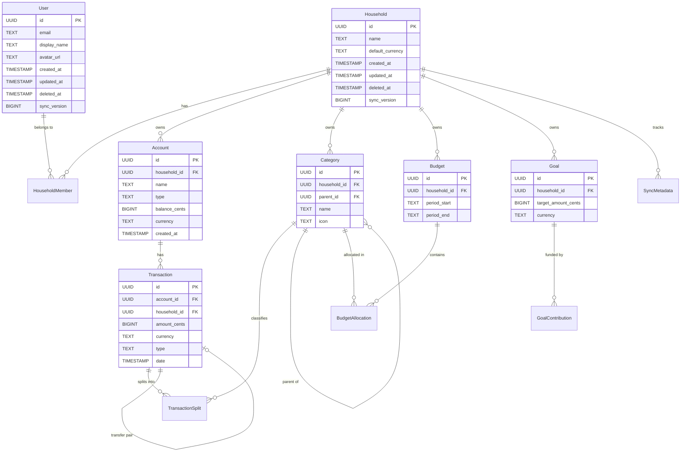

# Data Model — Finance

> **Status:** DRAFT — Pending human review
> **Last Updated:** 2025-07-17
> **Purpose:** Canonical schema reference for all platforms (Android, iOS, Desktop)

## Design Rules

1. **Money is integers.** All monetary values stored as `BIGINT` in the smallest currency unit (cents). Never use floating-point.
2. **Currency travels with money.** Every monetary column has a sibling `currency TEXT` column holding an ISO 4217 code.
3. **Offline-first IDs.** All primary keys are `UUID` generated client-side so records can be created without network access.
4. **Soft deletes for sync.** Every table carries `created_at`, `updated_at`, `deleted_at`, and `sync_version` columns.
5. **Tenant isolation.** Most tables include `household_id` to scope data; cross-household queries are never permitted.
6. **Banker's rounding.** When splitting amounts, remainders are allocated to the last item (round half to even).

---

## Entity-Relationship Diagram



---

## Entity Definitions

### User

| Field         | Type      | Constraints         | Notes                           |
| ------------- | --------- | ------------------- | ------------------------------- |
| id            | UUID      | PK                  | Generated client-side           |
| email         | TEXT      | UNIQUE, NOT NULL    | Login identifier                |
| display_name  | TEXT      | NOT NULL, max 100   | Shown in household member list  |
| avatar_url    | TEXT      |                     | Profile image URL or local path |
| auth_provider | TEXT      | NOT NULL            | `email`, `google`, `apple`      |
| created_at    | TIMESTAMP | NOT NULL            | Auto-set                        |
| updated_at    | TIMESTAMP | NOT NULL            | Auto-set on mutation            |
| deleted_at    | TIMESTAMP | NULL                | Soft delete for sync            |
| sync_version  | BIGINT    | NOT NULL, default 0 | Monotonic, for delta sync       |

---

### Household

| Field            | Type      | Constraints             | Notes                       |
| ---------------- | --------- | ----------------------- | --------------------------- |
| id               | UUID      | PK                      | Generated client-side       |
| name             | TEXT      | NOT NULL, max 100       | e.g. "Smith Family"         |
| default_currency | TEXT      | NOT NULL, default 'USD' | ISO 4217 — used as fallback |
| created_at       | TIMESTAMP | NOT NULL                | Auto-set                    |
| updated_at       | TIMESTAMP | NOT NULL                | Auto-set on mutation        |
| deleted_at       | TIMESTAMP | NULL                    | Soft delete for sync        |
| sync_version     | BIGINT    | NOT NULL, default 0     | Monotonic, for delta sync   |

---

### HouseholdMember

| Field        | Type      | Constraints              | Notes                              |
| ------------ | --------- | ------------------------ | ---------------------------------- |
| id           | UUID      | PK                       | Generated client-side              |
| household_id | UUID      | FK → Household, NOT NULL | Tenant scope                       |
| user_id      | UUID      | FK → User, NOT NULL      | The member                         |
| role         | TEXT      | NOT NULL, enum           | `owner`, `editor`, `viewer`        |
| joined_at    | TIMESTAMP | NOT NULL                 | When the user joined the household |
| created_at   | TIMESTAMP | NOT NULL                 | Auto-set                           |
| updated_at   | TIMESTAMP | NOT NULL                 | Auto-set on mutation               |
| deleted_at   | TIMESTAMP | NULL                     | Soft delete for sync               |
| sync_version | BIGINT    | NOT NULL, default 0      | Monotonic, for delta sync          |

> UNIQUE constraint on (`household_id`, `user_id`) — a user appears in a household at most once.

---

### Account

| Field         | Type      | Constraints              | Notes                                                                       |
| ------------- | --------- | ------------------------ | --------------------------------------------------------------------------- |
| id            | UUID      | PK                       | Generated client-side                                                       |
| household_id  | UUID      | FK → Household, NOT NULL | Tenant isolation                                                            |
| name          | TEXT      | NOT NULL, max 50         | Display name                                                                |
| type          | TEXT      | NOT NULL, enum           | `checking`, `savings`, `credit_card`, `cash`, `investment`, `loan`, `other` |
| balance_cents | BIGINT    | NOT NULL, default 0      | Current balance in smallest currency unit                                   |
| currency      | TEXT      | NOT NULL, default 'USD'  | ISO 4217                                                                    |
| icon          | TEXT      |                          | Platform icon identifier                                                    |
| is_archived   | BOOLEAN   | NOT NULL, default false  | Soft archive — hides from main list                                         |
| sort_order    | INTEGER   | NOT NULL, default 0      | User-defined ordering                                                       |
| created_at    | TIMESTAMP | NOT NULL                 | Auto-set                                                                    |
| updated_at    | TIMESTAMP | NOT NULL                 | Auto-set on mutation                                                        |
| deleted_at    | TIMESTAMP | NULL                     | Soft delete for sync                                                        |
| sync_version  | BIGINT    | NOT NULL, default 0      | Monotonic, for delta sync                                                   |

---

### Transaction

| Field            | Type      | Constraints              | Notes                                     |
| ---------------- | --------- | ------------------------ | ----------------------------------------- |
| id               | UUID      | PK                       | Generated client-side                     |
| household_id     | UUID      | FK → Household, NOT NULL | Tenant isolation                          |
| account_id       | UUID      | FK → Account, NOT NULL   | Owning account                            |
| type             | TEXT      | NOT NULL, enum           | `income`, `expense`, `transfer`           |
| amount_cents     | BIGINT    | NOT NULL                 | Always positive; sign derived from `type` |
| currency         | TEXT      | NOT NULL                 | ISO 4217 — matches account currency       |
| date             | TEXT      | NOT NULL                 | ISO 8601 date (`YYYY-MM-DD`)              |
| payee            | TEXT      | max 100                  | Merchant / source name                    |
| notes            | TEXT      | max 500                  | User notes                                |
| is_split         | BOOLEAN   | NOT NULL, default false  | True when splits exist                    |
| transfer_pair_id | UUID      | FK → Transaction, NULL   | Links the other half of a transfer        |
| created_at       | TIMESTAMP | NOT NULL                 | Auto-set                                  |
| updated_at       | TIMESTAMP | NOT NULL                 | Auto-set on mutation                      |
| deleted_at       | TIMESTAMP | NULL                     | Soft delete for sync                      |
| sync_version     | BIGINT    | NOT NULL, default 0      | Monotonic, for delta sync                 |

> For transfers, two `Transaction` rows are created — one debit, one credit — linked by `transfer_pair_id`.

---

### TransactionSplit

| Field          | Type      | Constraints                | Notes                             |
| -------------- | --------- | -------------------------- | --------------------------------- |
| id             | UUID      | PK                         | Generated client-side             |
| transaction_id | UUID      | FK → Transaction, NOT NULL | Parent transaction                |
| category_id    | UUID      | FK → Category, NOT NULL    | Budget category for this portion  |
| amount_cents   | BIGINT    | NOT NULL                   | Portion in smallest currency unit |
| currency       | TEXT      | NOT NULL                   | ISO 4217 — must match parent      |
| notes          | TEXT      | max 200                    | Optional per-split note           |
| created_at     | TIMESTAMP | NOT NULL                   | Auto-set                          |
| updated_at     | TIMESTAMP | NOT NULL                   | Auto-set on mutation              |
| deleted_at     | TIMESTAMP | NULL                       | Soft delete for sync              |
| sync_version   | BIGINT    | NOT NULL, default 0        | Monotonic, for delta sync         |

> **Invariant:** `SUM(splits.amount_cents) == transaction.amount_cents`. Remainder allocated to last split (banker's rounding).
>
> Non-split transactions still have exactly one `TransactionSplit` row so that budget queries need only one code path.

---

### Category

| Field        | Type      | Constraints              | Notes                                 |
| ------------ | --------- | ------------------------ | ------------------------------------- |
| id           | UUID      | PK                       | Generated client-side                 |
| household_id | UUID      | FK → Household, NOT NULL | Tenant isolation                      |
| parent_id    | UUID      | FK → Category, NULL      | NULL = top-level; max 3 levels deep   |
| name         | TEXT      | NOT NULL, max 50         | Unique within parent scope            |
| icon         | TEXT      |                          | Platform icon identifier              |
| color        | TEXT      |                          | Hex color for charts (e.g. `#4CAF50`) |
| is_income    | BOOLEAN   | NOT NULL, default false  | Income vs expense category            |
| sort_order   | INTEGER   | NOT NULL, default 0      | User-defined ordering                 |
| created_at   | TIMESTAMP | NOT NULL                 | Auto-set                              |
| updated_at   | TIMESTAMP | NOT NULL                 | Auto-set on mutation                  |
| deleted_at   | TIMESTAMP | NULL                     | Soft delete for sync                  |
| sync_version | BIGINT    | NOT NULL, default 0      | Monotonic, for delta sync             |

> UNIQUE constraint on (`household_id`, `parent_id`, `name`).

---

### Budget

| Field        | Type      | Constraints              | Notes                               |
| ------------ | --------- | ------------------------ | ----------------------------------- |
| id           | UUID      | PK                       | Generated client-side               |
| household_id | UUID      | FK → Household, NOT NULL | Tenant isolation                    |
| period_start | TEXT      | NOT NULL                 | ISO 8601 date — first day of period |
| period_end   | TEXT      | NOT NULL                 | ISO 8601 date — last day of period  |
| created_at   | TIMESTAMP | NOT NULL                 | Auto-set                            |
| updated_at   | TIMESTAMP | NOT NULL                 | Auto-set on mutation                |
| deleted_at   | TIMESTAMP | NULL                     | Soft delete for sync                |
| sync_version | BIGINT    | NOT NULL, default 0      | Monotonic, for delta sync           |

> UNIQUE constraint on (`household_id`, `period_start`) — one budget per household per period.

---

### BudgetAllocation

| Field           | Type      | Constraints             | Notes                                |
| --------------- | --------- | ----------------------- | ------------------------------------ |
| id              | UUID      | PK                      | Generated client-side                |
| budget_id       | UUID      | FK → Budget, NOT NULL   | Parent budget period                 |
| category_id     | UUID      | FK → Category, NOT NULL | Target category                      |
| allocated_cents | BIGINT    | NOT NULL, default 0     | Amount budgeted for this period      |
| currency        | TEXT      | NOT NULL                | ISO 4217                             |
| rollover_cents  | BIGINT    | NOT NULL, default 0     | Carried from previous period         |
| carry_forward   | BOOLEAN   | NOT NULL, default true  | Whether unspent rolls to next period |
| created_at      | TIMESTAMP | NOT NULL                | Auto-set                             |
| updated_at      | TIMESTAMP | NOT NULL                | Auto-set on mutation                 |
| deleted_at      | TIMESTAMP | NULL                    | Soft delete for sync                 |
| sync_version    | BIGINT    | NOT NULL, default 0     | Monotonic, for delta sync            |

> Computed at read time: `available = allocated_cents + rollover_cents - spent`, where `spent = SUM(TransactionSplit.amount_cents)` for the category in the budget period.

---

### Goal

| Field                | Type      | Constraints              | Notes                                 |
| -------------------- | --------- | ------------------------ | ------------------------------------- |
| id                   | UUID      | PK                       | Generated client-side                 |
| household_id         | UUID      | FK → Household, NOT NULL | Tenant isolation                      |
| name                 | TEXT      | NOT NULL, max 100        | e.g. "House Down Payment"             |
| target_amount_cents  | BIGINT    | NOT NULL                 | Goal target in smallest currency unit |
| current_amount_cents | BIGINT    | NOT NULL, default 0      | Running total of contributions        |
| currency             | TEXT      | NOT NULL                 | ISO 4217                              |
| deadline             | TEXT      | NULL                     | ISO 8601 date; NULL = no deadline     |
| icon                 | TEXT      |                          | Platform icon identifier              |
| color                | TEXT      |                          | Hex color for progress UI             |
| is_completed         | BOOLEAN   | NOT NULL, default false  | Set when target reached               |
| created_at           | TIMESTAMP | NOT NULL                 | Auto-set                              |
| updated_at           | TIMESTAMP | NOT NULL                 | Auto-set on mutation                  |
| deleted_at           | TIMESTAMP | NULL                     | Soft delete for sync                  |
| sync_version         | BIGINT    | NOT NULL, default 0      | Monotonic, for delta sync             |

> Computed at read time: `monthly_target = (target - current) / months_remaining`.

---

### GoalContribution

| Field        | Type      | Constraints         | Notes                                  |
| ------------ | --------- | ------------------- | -------------------------------------- |
| id           | UUID      | PK                  | Generated client-side                  |
| goal_id      | UUID      | FK → Goal, NOT NULL | Target goal                            |
| amount_cents | BIGINT    | NOT NULL            | Contribution in smallest currency unit |
| currency     | TEXT      | NOT NULL            | ISO 4217                               |
| date         | TEXT      | NOT NULL            | ISO 8601 date of contribution          |
| notes        | TEXT      | max 200             | Optional memo                          |
| created_at   | TIMESTAMP | NOT NULL            | Auto-set                               |
| updated_at   | TIMESTAMP | NOT NULL            | Auto-set on mutation                   |
| deleted_at   | TIMESTAMP | NULL                | Soft delete for sync                   |
| sync_version | BIGINT    | NOT NULL, default 0 | Monotonic, for delta sync              |

---

### SyncMetadata

| Field               | Type      | Constraints              | Notes                                   |
| ------------------- | --------- | ------------------------ | --------------------------------------- |
| id                  | UUID      | PK                       | Generated client-side                   |
| household_id        | UUID      | FK → Household, NOT NULL | Tenant scope                            |
| table_name          | TEXT      | NOT NULL                 | Entity table being tracked              |
| last_synced_version | BIGINT    | NOT NULL, default 0      | Highest sync_version pulled from server |
| last_synced_at      | TIMESTAMP | NULL                     | Wall-clock time of last successful sync |
| device_id           | TEXT      | NOT NULL                 | Identifies the syncing device           |
| created_at          | TIMESTAMP | NOT NULL                 | Auto-set                                |
| updated_at          | TIMESTAMP | NOT NULL                 | Auto-set on mutation                    |
| deleted_at          | TIMESTAMP | NULL                     | Soft delete for sync                    |
| sync_version        | BIGINT    | NOT NULL, default 0      | Monotonic, for delta sync               |

> UNIQUE constraint on (`household_id`, `table_name`, `device_id`).

---

## SQLDelight Examples

### `Account.sq`

```sql
CREATE TABLE Account (
    id            TEXT    NOT NULL PRIMARY KEY,
    household_id  TEXT    NOT NULL,
    name          TEXT    NOT NULL,
    type          TEXT    NOT NULL,
    balance_cents INTEGER NOT NULL DEFAULT 0,
    currency      TEXT    NOT NULL DEFAULT 'USD',
    icon          TEXT,
    is_archived   INTEGER NOT NULL DEFAULT 0,
    sort_order    INTEGER NOT NULL DEFAULT 0,
    created_at    TEXT    NOT NULL,
    updated_at    TEXT    NOT NULL,
    deleted_at    TEXT,
    sync_version  INTEGER NOT NULL DEFAULT 0,
    FOREIGN KEY (household_id) REFERENCES Household(id)
);

selectAllActive:
SELECT * FROM Account
WHERE household_id = :householdId
  AND is_archived = 0
  AND deleted_at IS NULL
ORDER BY sort_order ASC, name ASC;

selectById:
SELECT * FROM Account
WHERE id = :id AND deleted_at IS NULL;

insert:
INSERT INTO Account(id, household_id, name, type, balance_cents, currency,
                    icon, is_archived, sort_order, created_at, updated_at, sync_version)
VALUES (?, ?, ?, ?, ?, ?, ?, 0, ?, ?, ?, 0);

updateBalance:
UPDATE Account
SET balance_cents = :balanceCents,
    updated_at    = :updatedAt,
    sync_version  = sync_version + 1
WHERE id = :id;

softDelete:
UPDATE Account
SET deleted_at   = :now,
    updated_at   = :now,
    sync_version = sync_version + 1
WHERE id = :id;

changedSince:
SELECT * FROM Account
WHERE household_id = :householdId
  AND sync_version > :sinceVersion;
```

### `Transaction.sq`

```sql
CREATE TABLE TransactionEntity (
    id               TEXT    NOT NULL PRIMARY KEY,
    household_id     TEXT    NOT NULL,
    account_id       TEXT    NOT NULL,
    type             TEXT    NOT NULL,
    amount_cents     INTEGER NOT NULL,
    currency         TEXT    NOT NULL,
    date             TEXT    NOT NULL,
    payee            TEXT,
    notes            TEXT,
    is_split         INTEGER NOT NULL DEFAULT 0,
    transfer_pair_id TEXT,
    created_at       TEXT    NOT NULL,
    updated_at       TEXT    NOT NULL,
    deleted_at       TEXT,
    sync_version     INTEGER NOT NULL DEFAULT 0,
    FOREIGN KEY (household_id) REFERENCES Household(id),
    FOREIGN KEY (account_id)   REFERENCES Account(id),
    FOREIGN KEY (transfer_pair_id) REFERENCES TransactionEntity(id)
);

selectByAccount:
SELECT * FROM TransactionEntity
WHERE account_id = :accountId
  AND deleted_at IS NULL
ORDER BY date DESC, created_at DESC;

selectByDateRange:
SELECT * FROM TransactionEntity
WHERE household_id = :householdId
  AND date BETWEEN :startDate AND :endDate
  AND deleted_at IS NULL
ORDER BY date DESC;

insert:
INSERT INTO TransactionEntity(id, household_id, account_id, type, amount_cents,
                              currency, date, payee, notes, is_split,
                              transfer_pair_id, created_at, updated_at, sync_version)
VALUES (?, ?, ?, ?, ?, ?, ?, ?, ?, ?, ?, ?, ?, 0);

softDelete:
UPDATE TransactionEntity
SET deleted_at   = :now,
    updated_at   = :now,
    sync_version = sync_version + 1
WHERE id = :id;

changedSince:
SELECT * FROM TransactionEntity
WHERE household_id = :householdId
  AND sync_version > :sinceVersion;
```
