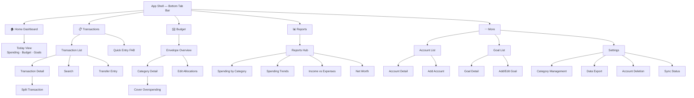

# Information Architecture — Finance

> **Status:** DRAFT — Pending human review
> **Last Updated:** 2025-07-17

---

## 1. Navigation Model

Bottom tab bar on all platforms — five top-level destinations, persistent and always visible.

| Tab | Icon     | Label        | Purpose                                            |
| --- | -------- | ------------ | -------------------------------------------------- |
| 1   | house    | Home         | Dashboard / today view — answers "How am I doing?" |
| 2   | list     | Transactions | Chronological list + quick-entry FAB               |
| 3   | envelope | Budget       | Envelope view — allocations, progress, rollover    |
| 4   | chart    | Reports      | Charts, trends, analytics                          |
| 5   | ellipsis | More         | Settings, goals, accounts, export                  |

**Design rationale:** Five tabs keeps the bar uncluttered (UX Principle 1: Clarity Over Completeness). The FAB on the Transactions tab enables 3-tap entry from anywhere (UX Principle 2). The More tab groups secondary features to avoid tab overload.

---

## 2. Screen Inventory

### Primary Screens (Tab Roots)

| Screen Name      | Parent            | Features Served                    | Key Data                                                                             |
| ---------------- | ----------------- | ---------------------------------- | ------------------------------------------------------------------------------------ |
| Home Dashboard   | Tab: Home         | ONB-001, BUD-002, SET-005          | Today's spending, budget health summary, goal progress, recent transactions, streaks |
| Transaction List | Tab: Transactions | TXNS-002, TXNS-007                 | Chronological transactions, filters, search, running balance                         |
| Budget Overview  | Tab: Budget       | BUD-001, BUD-002, BUD-003          | Envelope list, progress bars, "To Budget" counter, rollover amounts                  |
| Reports Hub      | Tab: Reports      | RPT-001, RPT-002, RPT-003, RPT-004 | Report type cards linking to individual report screens                               |
| More Menu        | Tab: More         | —                                  | Navigation list to settings, goals, accounts, export                                 |

### Detail / Child Screens

| Screen Name            | Parent             | Features Served              | Key Data                                                         |
| ---------------------- | ------------------ | ---------------------------- | ---------------------------------------------------------------- |
| Quick Entry            | Transactions (FAB) | TXNS-001                     | Amount keypad, smart category suggestion, account picker         |
| Transaction Detail     | Transaction List   | TXNS-003, TXNS-004, TXNS-006 | All transaction fields, split view, edit/delete actions          |
| Transaction Search     | Transaction List   | TXNS-007                     | Search input, results list, aggregate total                      |
| Transfer Entry         | Transaction List   | TXNS-005                     | Source/destination account pickers, amount                       |
| Budget Category Detail | Budget Overview    | BUD-002, BUD-004             | Category spend vs budgeted, transaction list, cover overspending |
| Budget Edit            | Budget Overview    | BUD-001                      | Category allocation inputs, "To Budget" counter                  |
| Spending by Category   | Reports Hub        | RPT-001                      | Donut chart + list, category drill-down, period picker           |
| Spending Trends        | Reports Hub        | RPT-002                      | Line/bar chart, category filter, 3/6/12-month toggle             |
| Income vs Expenses     | Reports Hub        | RPT-003                      | Stacked bar chart, savings rate, income breakdown                |
| Net Worth              | Reports Hub        | RPT-004                      | Line chart over time, account breakdown                          |
| Account List           | More               | ACCT-002                     | Accounts grouped by type, net worth total                        |
| Account Detail         | Account List       | ACCT-003, ACCT-004           | Account info, balance, transaction list for account              |
| Add Account            | Account List       | ACCT-001                     | Name, type, initial balance, icon picker                         |
| Goal List              | More               | GOAL-001, GOAL-002           | All goals with progress bars and projections                     |
| Goal Detail            | Goal List          | GOAL-002, GOAL-003           | Progress visualization, funding history, milestone celebrations  |
| Add/Edit Goal          | Goal List          | GOAL-001                     | Name, target amount, deadline, icon/color picker                 |
| Settings               | More               | SET-001 through SET-005      | Currency, biometric toggle, simplified view, notifications       |
| Data Export            | More (Settings)    | SET-003                      | Format picker (JSON/CSV), export action                          |
| Account Deletion       | More (Settings)    | SET-004                      | Confirmation flow, typed phrase input                            |
| Category Management    | More (Settings)    | CAT-001, CAT-002, CAT-003    | Category tree, drag-to-reorder, add/edit/delete                  |
| Onboarding Welcome     | App Entry          | ONB-001                      | 3–5 welcome screens, goal picker, first account                  |
| Guided First Budget    | Post-Onboarding    | ONB-002                      | 50/30/20 suggestion, allocation sliders                          |
| Sync Status            | More (Settings)    | SYNC-001, SYNC-002, SYNC-003 | Last sync time, pending changes, conflict queue                  |

---

## 3. Sitemap Diagram

---

## 4. Platform-Specific Navigation Notes

### iOS / macOS

- **TabView** for bottom tab bar with 5 tabs
- **NavigationStack** per tab for push/pop navigation
- Quick Entry presented as `.sheet` modal from FAB
- Swipe-back gesture for all detail screens
- SF Symbols for tab and screen icons
- Large title style on root screens, inline on detail screens

### Android

- **BottomNavigationView** (Material 3) with 5 destinations
- **NavHost** (Jetpack Navigation) per tab with back stack
- **FloatingActionButton** for quick entry on Transactions tab
- Predictive back gesture support
- Material Icons; dynamic color theming via Material You

### Web (PWA)

- **React Router** with nested routes per tab
- Bottom tab bar on mobile viewports (`< 768px`)
- Sidebar navigation on desktop viewports (`≥ 768px`) — tabs become sidebar items
- Quick Entry opens as dialog/modal
- URL-addressable screens (e.g., `/transactions/123`, `/reports/trends`)
- Browser back/forward maps to navigation stack

### Windows

- **NavigationView** (WinUI 3 / Fluent Design) with left pane
- Top-level items mirror the 5 tabs as navigation items
- Acrylic material for navigation pane background
- Quick Entry opens as ContentDialog
- System back button integrated with navigation stack
- Supports Narrator and UI Automation landmarks

---

## 5. Accessibility Navigation Requirements

### Skip-to-Content

- Every screen provides a skip-to-main-content link (web) or accessibility shortcut (native)
- Skip links bypass the tab bar and any header chrome
- On web: visible on focus, first focusable element in DOM

### Focus Order

- Logical tab order follows visual layout: top → bottom, left → right
- Tab bar items receive focus in left-to-right order
- Modal screens (Quick Entry, confirmations) trap focus until dismissed
- Focus returns to trigger element on modal dismiss
- FAB is reachable via keyboard (Tab key) on all platforms

### Landmark Regions

- **Navigation** landmark: bottom tab bar / sidebar
- **Main** landmark: primary content area of each screen
- **Complementary** landmark: summary cards on dashboard
- **Form** landmark: all input screens (Quick Entry, Budget Edit, Add Account)
- **Banner** landmark: app header with screen title and sync status
- All landmarks labeled with `aria-label` (web) or `accessibilityLabel` (native)

### Screen Reader Announcements

- Tab switches announced with destination name
- Screen transitions announced with new screen title
- Dynamic content updates (budget remaining, sync status) use live regions
- Charts provide accessible data tables as alternatives

---

_This document is the structural blueprint. Visual design, spacing, and interaction details live in the component design specs._
