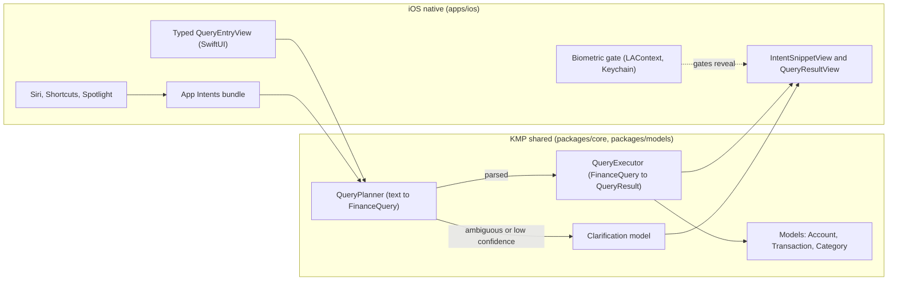
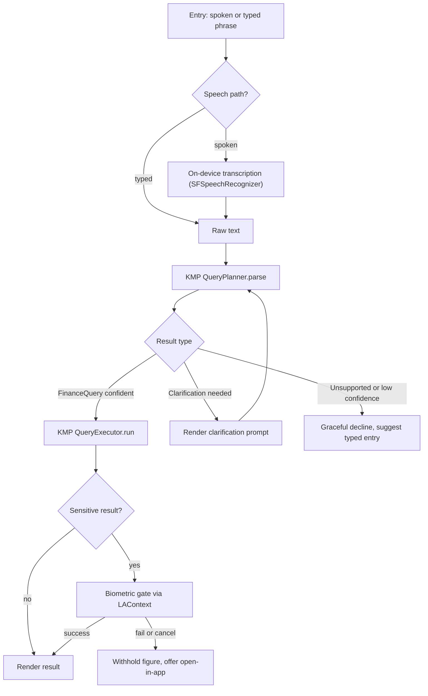

# iOS App Intents and Siri Finance Query Design

> Design specification for the iOS **voice and typed finance-query surface** —
> App Intents, Siri, Shortcuts, and Spotlight entry points that answer questions
> like _"What's my balance?"_ or _"How much did I spend on groceries this
> month?"_ **entirely on-device**, by delegating all query parsing and
> aggregation to shared KMP business logic.

**Status:** PROPOSED — design only (native implementation gated, see
[Implementation readiness](#implementation-readiness))
**Issue:** [#2617](https://github.com/jrmoulckers/finance/issues/2617) — _Part of
[#2386](https://github.com/jrmoulckers/finance/issues/2386)_
**Platform:** iOS 17+ (SwiftUI · App Intents · SiriKit) · watchOS 10+ (companion)
**Last updated:** 2026-06-22
**Related design docs:**
[information-architecture.md](./information-architecture.md) ·
[ux-principles.md](./ux-principles.md) ·
[accessibility-patterns.md](./accessibility-patterns.md) ·
[content-language-guidelines.md](./content-language-guidelines.md) ·
[data-model.md](./data-model.md)
**Sibling docs (this cluster):**
[ios-local-query-planner-clarification.md](./ios-local-query-planner-clarification.md) ·
[ios-nl-query-fixtures.md](./ios-nl-query-fixtures.md)

---

## Table of Contents

1. [Problem and Goal](#1-problem-and-goal)
2. [Affected iOS Surfaces](#2-affected-ios-surfaces)
3. [Shared Dependencies and the KMP Boundary](#3-shared-dependencies-and-the-kmp-boundary)
4. [Supported Local Intents](#4-supported-local-intents)
5. [Entry Points: Voice and Typed](#5-entry-points-voice-and-typed)
6. [Intent Resolution Flow](#6-intent-resolution-flow)
7. [Sensitive-Result Confirmation Rules](#7-sensitive-result-confirmation-rules)
8. [Accessibility](#8-accessibility)
9. [Privacy and Data Minimization](#9-privacy-and-data-minimization)
10. [Empty, Stale, Error, and Low-Confidence States](#10-empty-stale-error-and-low-confidence-states)
11. [Test Plan](#11-test-plan)
12. [Implementation readiness](#implementation-readiness)

---

## 1. Problem and Goal

People want quick answers to small money questions without opening the app and
navigating. The goal is a **hands-free and hands-on** query surface that:

- Answers a constrained set of finance questions ("balance", "spending by
  category / merchant / account / date range") from Siri, Shortcuts, Spotlight,
  and a typed in-app field.
- Runs **100% on-device** — no phrase, transcript, or financial figure is ever
  sent to a cloud NLP service.
- Treats **voice as one of several equal entry points**, never the only path:
  every voice action has a typed and a VoiceOver-navigable equivalent.
- Reuses one shared parser and aggregator (KMP `packages/core`) so iOS, and
  later Android, return identical answers for identical questions.

Non-goals: free-form conversational AI, multi-step transactional actions
(transfers, payments), and any natural-language _generation_ beyond a small set
of templated response strings.

## 2. Affected iOS Surfaces

| Surface             | Role                                                                   | New / changed                        |
| ------------------- | ---------------------------------------------------------------------- | ------------------------------------ |
| App Intents bundle  | `AppIntent` types (balance, spending) + `AppShortcutsProvider` phrases | New `Finance/Intents/`               |
| Siri / voice        | Spoken invocation and `IntentDialog` spoken response                   | New, via App Intents                 |
| Shortcuts app       | User-composable actions and parameters                                 | New, via App Intents                 |
| Spotlight           | Typed query suggestions surfaced as App Shortcuts                      | New, via App Intents                 |
| In-app query field  | SwiftUI typed-entry view that calls the same planner directly          | New `Finance/Query/QueryEntryView`   |
| Result presentation | SwiftUI snippet view (`IntentSnippetView`) + in-app result view        | New `Finance/Query/QueryResultView`  |
| Biometric gate      | `LAContext` + Keychain for sensitive-result reveal                     | Reuses existing `KeychainService`    |
| watchOS companion   | Read-only spoken/short result relay (no parsing on watch)              | New `FinanceWatch/Query` (follow-up) |

No existing screen is replaced; this is an additive surface that links back into
existing destinations defined in
[information-architecture.md](./information-architecture.md).

## 3. Shared Dependencies and the KMP Boundary

The hard rule for this cluster: **iOS owns the Apple-framework surface; KMP owns
the meaning of a query and the math.** The iOS layer never parses a sentence or
sums a transaction itself.

- **KMP (`packages/core`, `packages/models`)** — owns `QueryPlanner`,
  `FinanceQuery`, `QueryExecutor`, `QueryResult`, and `Clarification`. This is
  where category/merchant/account/date-range parsing and aggregation live (see
  [ios-local-query-planner-clarification.md](./ios-local-query-planner-clarification.md)).
  Shared models follow [data-model.md](./data-model.md).
- **iOS native (`apps/ios`)** — owns `AppIntent` conformances, the
  `AppShortcutsProvider` phrase catalog, `IntentDialog`, SwiftUI snippet and
  result views, VoiceOver semantics, Dynamic Type layout, and the biometric
  gate. It translates KMP types across the Swift Export bridge and renders them.
- **Type mapping** across the bridge follows the standard contract
  (`Int` → `Int32`, `String` → `String`, `List` → `Array`, Kotlin `sealed` →
  Swift `enum`). `Clarification` is a sealed type → Swift enum the UI switches
  over exhaustively.

> Any change to `QueryPlanner` / `FinanceQuery` shape is a **KMP change** and
> must be proposed to @kmp-engineer / @architect via ADR — this doc does not
> implement it.

## 4. Supported Local Intents

The v1 catalog is intentionally small and fully enumerable (each maps to one
`AppIntent` and one or more `AppShortcutPhrase`s):

| Intent                | Example phrases                                          | Shape returned                         |
| --------------------- | -------------------------------------------------------- | -------------------------------------- |
| `BalanceQueryIntent`  | "What's my balance?", "Balance on Checking"              | One account or net balance (sensitive) |
| `SpendingQueryIntent` | "How much did I spend on groceries this month?"          | Sum over a category / merchant / range |
| `SpendingByDimension` | "Spending by category last week", "Top merchants in May" | A small ranked list                    |
| `BudgetQueryIntent`   | "How much is left in my dining budget?"                  | Remaining-budget figure (sensitive)    |

All phrases are declared with `String(localized:)` so Siri vocabulary and
Shortcuts titles localize. Parameters (account, category, date range) are
resolved by the **KMP planner**, not by hand-written Swift parsing.

## 5. Entry Points: Voice and Typed

Voice is an _alternative_, never the sole path. Every supported question is
reachable four ways, all funneling into the same KMP `QueryPlanner`:

1. **Voice (Siri)** — spoken phrase → App Intent → planner. Spoken `IntentDialog`
   response, optionally with a visual snippet.
2. **Shortcuts (tap / automation)** — same App Intent, parameters pre-filled.
3. **Spotlight (typed)** — typed query surfaces an App Shortcut.
4. **In-app typed field** — `QueryEntryView` calls the planner directly; useful
   when speech is unavailable, in a quiet space, or for users who do not use
   voice. This is the **canonical fallback** and must always be present.

Speech recognition availability (`SFSpeechRecognizer` authorization, dictation
toggles) **must not** change which answers are reachable — only _how_ they are
entered. Fixtures in
[ios-nl-query-fixtures.md](./ios-nl-query-fixtures.md) exercise the planner with
text only, so the test suite is independent of speech availability.

## 6. Intent Resolution Flow

- On-device transcription uses `SFSpeechRecognizer` configured with
  `requiresOnDeviceRecognition = true`; if on-device recognition is
  unavailable, the surface falls back to **typed entry** rather than a network
  request.
- The clarification loop is bounded (see
  [planner doc §clarification](./ios-local-query-planner-clarification.md)); it
  is not an open-ended conversation.

## 7. Sensitive-Result Confirmation Rules

Balances, remaining-budget figures, and account-level totals are **sensitive**.
Spending aggregates phrased as a single number tied to an account are also
sensitive.

- **Reveal gate:** sensitive figures returned via Siri/Shortcuts require a
  successful `LAContext` evaluation (Face ID / Touch ID, falling back to device
  passcode) when the device is locked or when "Hide on Lock Screen" is enabled.
  Access control uses `kSecAttrAccessibleWhenUnlockedThisDeviceOnly`.
- **Spoken responses** never voice a sensitive figure on a locked device. The
  spoken `IntentDialog` instead says a non-sensitive prompt (e.g. _"Unlock
  Finance to hear your balance"_) — copy per
  [content-language-guidelines.md](./content-language-guidelines.md).
- **Snippet redaction:** before a successful gate, the snippet shows a masked
  placeholder (•••) with a "Tap to reveal in app" affordance.
- **No biometric bypass** for convenience — this is a hard boundary.

## 8. Accessibility

- **VoiceOver:** every interactive element in `QueryEntryView`,
  `QueryResultView`, and clarification prompts has an `.accessibilityLabel()`
  and, where the value is the point of the screen, an `.accessibilityValue()`.
  Result rows reuse the labeling grammar from
  [ios-transaction-row-voiceover-labels.md](./ios-transaction-row-voiceover-labels.md)
  and chart results reuse
  [ios-chart-voiceover-navigation.md](./ios-chart-voiceover-navigation.md).
- **Voice as alternative, not sole path:** because some VoiceOver and Switch
  Control users do not use Siri voice input, the typed `QueryEntryView` is the
  guaranteed-present equivalent; no answer is voice-only.
- **Announcements:** result availability posts an
  `AccessibilityNotification.Announcement` so the answer is spoken once rendered,
  even when focus has not moved.
- **Dynamic Type:** all strings use text styles (no hardcoded sizes); result and
  clarification layouts reflow and never truncate the figure. Tested at
  `accessibility5`.
- **Reduce Motion:** result transitions honor `accessibilityReduceMotion`.
- Cognitive-load guidance follows
  [cognitive-accessibility.md](./cognitive-accessibility.md): one question, one
  clear answer, plain-language prompts.

## 9. Privacy and Data Minimization

- **On-device only:** parsing, aggregation, and (where available) transcription
  run locally. No phrase, transcript, account name, or amount leaves the device.
  There is **no cloud NLP**.
- **Data minimization:** an App Intent receives only the fields it needs; the
  snippet/dialog carries the single answer, not the underlying transaction set.
- **Logging:** structured `os.Logger` only; financial values are `.private` and
  never interpolated as `.public`. Phrases are not logged verbatim.
- **Donations:** intent donation metadata excludes amounts and account
  identifiers; only the abstract intent type is donated to the system.
- **GDPR / CCPA:** because no personal financial data is transmitted or shared
  with a processor, this surface introduces **no new data-sharing**. On-device
  caches honor the app's existing data-deletion path; deleting the account
  clears any donated shortcuts and cached results. No new consent surface is
  required, but the privacy nutrition label must continue to declare "Data Not
  Collected" for this feature.

## 10. Empty, Stale, Error, and Low-Confidence States

| State              | Trigger                                      | Behavior                                                                 |
| ------------------ | -------------------------------------------- | ------------------------------------------------------------------------ |
| Empty result       | Valid query, no matching transactions        | "No spending found for …" + typed-entry affordance; never an error toast |
| Stale data         | Local store older than freshness window      | Show answer with a "as of <time>" qualifier; offer refresh in app        |
| Parse error        | Planner throws / bridge failure              | Decline gracefully, log non-sensitively, suggest typed entry             |
| Ambiguous          | Multiple entity candidates (see planner doc) | Clarification prompt with ≤3 candidates                                  |
| Low confidence     | Below auto-execute threshold                 | Offer best guess as a confirmable suggestion, do not auto-answer         |
| Unsupported intent | Phrase outside the v1 catalog                | "I can answer balance and spending questions" + examples                 |
| Locked / sensitive | Sensitive figure on locked device            | Masked + biometric gate (§7)                                             |

All copy is templated and localized; no state dead-ends — each offers a next
step (typed entry, open in app, or rephrase).

## 11. Test Plan

Smallest meaningful set before implementation is accepted. The deterministic NL
fixtures in [ios-nl-query-fixtures.md](./ios-nl-query-fixtures.md) are the
**anchor**: native and shared tests both consume the same fixture corpus.

**Shared (KMP, `packages/core`) — runs on JVM, no device:**

1. `QueryPlannerTest` — each fixture phrase parses to the expected `FinanceQuery`
   or `Clarification` (golden comparison).
2. `QueryExecutorTest` — each `FinanceQuery` over a seeded, fixed-clock dataset
   yields the expected `QueryResult`.

**Native (iOS, Simulator — free signing):**

3. `IntentResolutionTests` (XCTest) — each `AppIntent` maps a phrase to the
   planner call and renders the expected snippet/dialog for one fixture per
   intent.
4. `SensitiveGateTests` — sensitive results are masked until a stubbed
   `LAContext` succeeds; spoken response withholds figures when locked.
5. `QueryAccessibilityUITests` (XCUITest) — VoiceOver labels/values present,
   Dynamic Type at `accessibility5` does not truncate the figure, typed-entry
   path reaches every answer with speech disabled.

CI: shared tests in `ci-shared.yml`, native tests in `ci-ios.yml` (Simulator).
No device farm or signing required for any of the above.

## Implementation readiness

**Design: ready now. Native code: buildable now, distribution gated.**

Per the
[Human-Gated Prerequisites runbook](../ops/human-gated-prerequisites.md#2-implementation-vs-distribution--the-decoupling),
implementation and distribution are decoupled. The "blocked by
[#1239](https://github.com/jrmoulckers/finance/issues/1239)" note on
[#2617](https://github.com/jrmoulckers/finance/issues/2617) is a **distribution**
gate only.

| Phase              | What                                                                      | Gated by #1239?                     |
| ------------------ | ------------------------------------------------------------------------- | ----------------------------------- |
| **Design**         | This document, intent catalog, resolution flow, confirmation rules, tests | No — deliverable now                |
| **Implementation** | App Intents, `AppShortcutsProvider`, snippet/dialog views, planner bridge | **No** — free Personal Team signing |
| **Distribution**   | TestFlight / App Store build carrying the Siri surface                    | **Yes** — Apple Developer Program   |

- **Buildable now:** `AppIntent`, `AppShortcutsProvider`, `IntentDialog`,
  `SFSpeechRecognizer` on-device recognition, `LAContext`, and SwiftUI snippet
  views are all standard iOS 17 APIs with no paid entitlement; they run on
  Simulator and on a device via free Personal Team signing.
- **Gated tail (#1239):** only store/TestFlight distribution needs the paid
  enrollment + signing material in
  [human-gated-prerequisites.md §3.2](../ops/human-gated-prerequisites.md#32-ios-distribution--apple-developer-1239).
  An SME agent must **not** perform enrollment, certificate, or secret steps.

_Part of [#2386](https://github.com/jrmoulckers/finance/issues/2386). Sibling
designs:
[local query planner and clarification](./ios-local-query-planner-clarification.md)
· [deterministic NL fixtures](./ios-nl-query-fixtures.md)._
