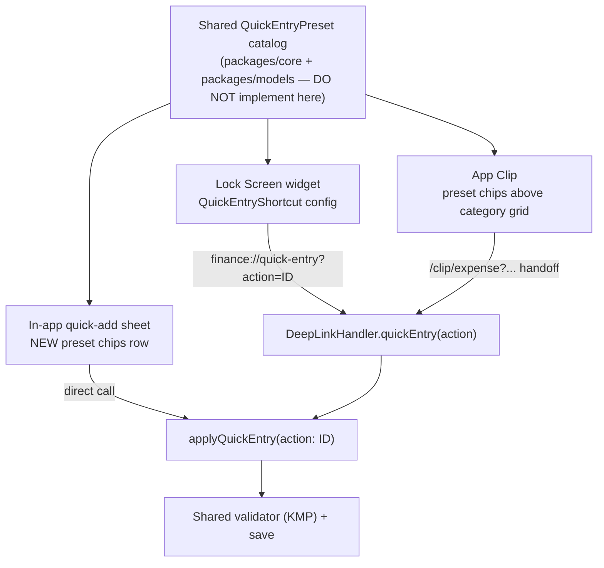
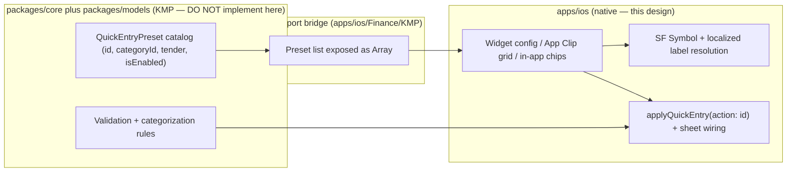

# Reuse App Clip & Widget Quick-Entry Presets In-App — iOS

> Three surfaces already capture a fast expense — the **Lock Screen quick-entry
> widget**, the **App Clip**, and the in-app **quick-add** sheet — but each
> carries its own private copy of the "coffee / lunch / transit / cash /
> Apple Cash" presets. This design defines a **single shared preset catalog** so
> the same named shortcuts power the widget, the App Clip, and a new row of
> **in-app quick-add chips**, mapping to the same category/tender defaults and
> the same shared validator.

**Status:** PROPOSED — design only (native implementation buildable now; store distribution gated)
**Issue:** [#2601](https://github.com/jrmoulckers/finance/issues/2601) — Part of [#2167](https://github.com/jrmoulckers/finance/issues/2167)
**Platform:** iOS / iPadOS (SwiftUI + WidgetKit + App Clip, iOS 17+)
**Owner:** @ios-engineer
**Related:** [ios-one-thumb-quick-add.md](./ios-one-thumb-quick-add.md) · [ios-compact-transaction-stepper.md](./ios-compact-transaction-stepper.md) · [ios-wallet-adjacent-capture-inbox.md](./ios-wallet-adjacent-capture-inbox.md) · [ios-grocery-affordability-appclip.md](./ios-grocery-affordability-appclip.md) · [accessibility-patterns.md](./accessibility-patterns.md) · [cognitive-accessibility.md](./cognitive-accessibility.md) · [content-language-guidelines.md](./content-language-guidelines.md) · [information-architecture.md](./information-architecture.md) · [Human-Gated Prerequisites](../ops/human-gated-prerequisites.md)

---

## Table of Contents

1. [Goal & Scope](#1-goal--scope)
2. [Current State (Three Copies of the Presets)](#2-current-state-three-copies-of-the-presets)
3. [The Shared Preset Catalog](#3-the-shared-preset-catalog)
4. [Preset-Reuse Flow](#4-preset-reuse-flow)
5. [In-App Quick-Add Chips](#5-in-app-quick-add-chips)
6. [Cash & Apple Cash (Tender, Not Category)](#6-cash--apple-cash-tender-not-category)
7. [Accessibility & Dynamic Type](#7-accessibility--dynamic-type)
8. [Privacy](#8-privacy)
9. [States: Empty, Stale & Error](#9-states-empty-stale--error)
10. [Native ↔ KMP Boundary](#10-native--kmp-boundary)
11. [Affected Surfaces & Shared Dependencies](#11-affected-surfaces--shared-dependencies)
12. [Test Plan (Smallest Tests First)](#12-test-plan-smallest-tests-first)
13. [Implementation Readiness](#13-implementation-readiness)
14. [Open Questions](#14-open-questions)

---

## 1. Goal & Scope

A user who logs "coffee" from the Lock Screen widget, then "coffee" from the App
Clip, then "coffee" inside the app should hit the **same** preset — same label,
same default category, same icon. Today they hit three slightly different lists
maintained in three files. This design collapses them to **one shared catalog**
and adds the missing fourth consumer: a row of **quick-add chips** in the in-app
sheet, so the express-lane capture from
[ios-one-thumb-quick-add.md](./ios-one-thumb-quick-add.md) gains the same
one-tap presets the widget and clip already have.

**In scope:**

- A **canonical preset catalog** (id, display label, default category mapping,
  optional default tender, SF Symbol) owned conceptually in shared
  `packages/core` / `packages/models`, consumed identically by all surfaces.
- A new **quick-add chips** strip in the in-app quick-add sheet that pre-seeds
  amount-keypad context from a preset — composing the existing
  `applyQuickEntry(action:)` path, not a new entry flow.
- Alignment of the widget enum, the App Clip category grid, and the in-app
  `applyQuickEntry` mapping onto that single catalog.
- Adding the **cash** and **Apple Cash** presets the issue names, modeled as
  **tender defaults** distinct from spending categories ([§6](#6-cash--apple-cash-tender-not-category)).

**Out of scope:**

- The **quick-add sheet mechanics** (detents, keypad, save/undo) — owned by
  [ios-one-thumb-quick-add.md](./ios-one-thumb-quick-add.md); this design only
  adds the preset chips that feed it.
- The **validation/save rules** — those stay in the shared validator the sheet
  already calls; presets only pre-seed inputs.
- New navigation/IA — chips live inside the existing sheet
  ([information-architecture.md](./information-architecture.md)).

> **Why one catalog:** divergent preset lists are a silent bug factory — a
> "transit" preset on the widget that maps to a different category in-app erodes
> trust in the totals. A single source removes that drift class entirely.

---

## 2. Current State (Three Copies of the Presets)

The same idea is encoded three times, each subtly different:

| Surface            | Where                                                                                                              | Preset set today                                                   |
| ------------------ | ------------------------------------------------------------------------------------------------------------------ | ------------------------------------------------------------------ |
| Lock Screen widget | [`QuickEntryWidget.swift`](../../apps/ios/FinanceWidget/QuickEntryWidget.swift) `QuickEntryShortcut`               | `none / lunch / coffee / groceries / gas`                          |
| In-app quick entry | [`TransactionCreateViewModel.applyQuickEntry`](../../apps/ios/Finance/ViewModels/TransactionCreateViewModel.swift) | `lunch → c2`, `coffee → c2`, `groceries → c1`, `gas → c3`          |
| App Clip           | [`TransactionCategory.quickCategories`](../../apps/ios/Shared/SharedConstants.swift)                               | `food / transport / shopping / … / groceries / other` (categories) |

- The widget and in-app paths agree on **named shortcuts** (lunch/coffee/…) and
  route through the **same deep link**: `QuickEntryShortcut.deepLinkAction` →
  [`FinanceWidgetDeepLinks.quickEntryURL`](../../apps/ios/Shared/WidgetPrivacy.swift)
  → [`DeepLinkHandler.quickEntry(action:)`](../../apps/ios/Finance/Navigation/DeepLinkHandler.swift)
  → `applyQuickEntry(action:)`. That string contract is the seam to standardize.
- The App Clip uses **categories**, not named shortcuts — a different axis
  ([`QuickTransactionView`](../../apps/ios/FinanceClip/QuickTransactionView.swift)
  renders `quickCategories` as a grid). The catalog must reconcile "named
  preset" and "category" cleanly.
- The issue explicitly adds **transit / cash / Apple Cash**, none of which exist
  in any current list — so the catalog both unifies and extends.

---

## 3. The Shared Preset Catalog

A single ordered catalog of quick-entry presets, each a small value type
(conceptually in `packages/core` / `packages/models`, **estimate** — final shape
owned by `@kmp-engineer` / `@architect`):

```text
QuickEntryPreset
  id            : String   // stable key, e.g. "coffee" (deep-link + telemetry)
  label         : String   // localized display, e.g. "Coffee"
  categoryId    : String?  // default spending category (nil for tender-only)
  defaultTender : String?  // default account/tender, e.g. "cash" / "apple-cash"
  symbolName    : String   // SF Symbol, resolved on iOS only
  isEnabled     : Bool     // surface gating (e.g. hide tender presets in widget)
```

Proposed catalog (the issue's set, unified):

| Preset id    | Label (en)   | Default category | Default tender | SF Symbol        |
| ------------ | ------------ | ---------------- | -------------- | ---------------- |
| `coffee`     | "Coffee"     | Dining           | —              | `cup.and.saucer` |
| `lunch`      | "Lunch"      | Dining           | —              | `fork.knife`     |
| `transit`    | "Transit"    | Transport        | —              | `tram.fill`      |
| `cash`       | "Cash"       | (last used)      | Cash           | `banknote`       |
| `apple-cash` | "Apple Cash" | (last used)      | Apple Cash     | `applelogo`      |

- **iOS resolves presentation only:** the SF Symbol and the localized `label`
  come from `String(localized:)` / SF Symbols on the Swift side; the catalog's
  job is the **mapping**, not the rendering.
- **id is the contract.** The existing `QuickEntryShortcut.rawValue` →
  `deepLinkAction` → `applyQuickEntry(action:)` string already uses these ids;
  standardizing on the catalog's `id` keeps the deep-link seam unchanged while
  removing the per-surface copies.
- **categoryId stays symbolic** (e.g. "dining"); the concrete category row id
  (`c1`/`c2`/…) is resolved in-app after `loadData()`, exactly as
  `applyQuickEntry` resolves today — so the catalog never hardcodes UI ids.

---

## 4. Preset-Reuse Flow



- Every surface resolves a preset to the **same `id`**, and every path converges
  on `applyQuickEntry(action: id)` → the **same shared validator** the full
  create flow uses. There is exactly one place where "coffee" becomes a category
  default, regardless of where the user tapped.
- The widget keeps emitting identifier-only deep links (no money in the URL,
  per [`FinanceWidgetDeepLinks`](../../apps/ios/Shared/WidgetPrivacy.swift)); the
  App Clip keeps its `/clip/expense` handoff; the in-app chips skip the URL and
  call `applyQuickEntry` directly.

---

## 5. In-App Quick-Add Chips

The new consumer: a horizontally scrollable **chips strip** at the top of the
in-app quick-add sheet from [ios-one-thumb-quick-add.md](./ios-one-thumb-quick-add.md).

```text
┌──────────────────────────────────────────────┐
│  [ ☕ Coffee ] [ 🍴 Lunch ] [ 🚊 Transit ] …   │  ← preset chips (this design)
│                                                │
│                 $ 4 . 50                       │  ← amount keypad (existing sheet)
│            Dining · Checking ▾                 │  ← default chips (existing sheet)
│                  [  Save  ]                    │
└──────────────────────────────────────────────┘
```

- **Tapping a chip** calls `applyQuickEntry(action: preset.id)`, pre-seeding the
  payee/category (and, for tender presets, the default account) while leaving
  the amount keypad focused — so the flow stays **amount → save** in one thumb
  arc.
- **Selection is non-destructive:** a chip seeds defaults the user can still
  override via the sheet's existing default chips; re-tapping a chip re-applies
  its preset; tapping the selected chip again clears it back to "remembered
  defaults."
- **Order & overflow:** catalog order, horizontally scrollable; the strip never
  pushes the keypad below the thumb arc. On the narrowest device the strip is one
  scrollable row, not a wrap that steals vertical space.
- **Reuse, don't fork:** the chips render from the **same catalog** as the
  widget config picker and the App Clip grid — adding a preset once lights it up
  everywhere.

---

## 6. Cash & Apple Cash (Tender, Not Category)

`cash` and `apple-cash` are **not spending categories** — they describe **how you
paid**. Modeling them as categories would corrupt category analytics.

- They carry `defaultTender` (the account/tender) and **leave `categoryId` to the
  user's last-used / suggested category** rather than forcing one.
- In the in-app sheet, a tender preset pre-selects the **account** chip and opens
  the keypad; the category remains the existing suggestion path
  (`updateCategorySuggestion()` via the KMP categorization engine).
- **Surface gating:** tender presets may be `isEnabled == false` on the **Lock
  Screen widget** (where a single named shortcut is configured) and in the **App
  Clip** (which has no signed-in account context), but **enabled** in-app where a
  real account exists. The catalog's `isEnabled` flag expresses this without
  forking the list.

---

## 7. Accessibility & Dynamic Type

Per [accessibility-patterns.md](./accessibility-patterns.md) and
[cognitive-accessibility.md](./cognitive-accessibility.md):

- **Each chip is a button** with an explicit `.accessibilityLabel` (the preset
  label, e.g. "Coffee"), an `.accessibilityHint` ("Pre-fills a coffee expense"),
  the `.isButton` trait, and `.isSelected` when active. The leading SF Symbol is
  `.accessibilityHidden(true)` — its meaning is already in the label.
- **Selection is announced** (not color-only): the selected chip exposes
  `.isSelected` and a subtle non-color affordance (filled background **and** a
  checkmark / bold label), matching the App Clip's existing selected-category
  treatment in [`QuickTransactionView`](../../apps/ios/FinanceClip/QuickTransactionView.swift).
- **Dynamic Type:** chip labels use semantic fonts; at accessibility sizes the
  strip stays a single scrollable row (labels grow, never truncate) and the
  44 pt minimum target height is preserved.
- **Reduce Motion:** the chip-apply transition collapses to an instant state
  change when `accessibilityReduceMotion` is on.
- **VoiceOver order:** chips precede the amount field in the swipe order, so a
  VoiceOver user can pick a preset first, then land on the keypad.

---

## 8. Privacy

- **Presets contain no money.** A preset is an id + category/tender mapping; deep
  links remain identifier-only ([`FinanceWidgetDeepLinks`](../../apps/ios/Shared/WidgetPrivacy.swift)),
  so nothing in the catalog or the widget/clip handoff can leak a balance.
- **Cash / Apple Cash reveal nothing** — they name a tender, not an amount.
- **Biometric gate preserved:** widget and deep-link entry into the in-app sheet
  still pass through the existing biometric-gated create path
  ([`DeepLinkHandler.quickEntry`](../../apps/ios/Finance/Navigation/DeepLinkHandler.swift));
  presets do not bypass it.
- **Logging:** preset selections may be logged by `id` as `.public` (non-sensitive
  routing facts); the **amount** the user then enters stays `.private`. Never log
  a preset together with its amount in a way that reconstructs a transaction.

---

## 9. States: Empty, Stale & Error

| State                    | Trigger                                                       | Rendering                                                                                  |
| ------------------------ | ------------------------------------------------------------- | ------------------------------------------------------------------------------------------ |
| **Empty catalog**        | Catalog returns no enabled presets                            | Hide the chips strip entirely; the sheet still works as plain amount-first entry (no gap)  |
| **Single preset**        | Only one enabled preset                                       | Show the one chip, left-aligned; no scroll affordance                                      |
| **Disabled-here preset** | `isEnabled == false` for this surface (e.g. tender in widget) | Omit the chip on that surface only; it still appears where enabled                         |
| **Unknown deep-link id** | `applyQuickEntry(action:)` gets an unmatched id               | Fall back to the default (no preset applied) exactly as the current `default:` branch does |
| **Stale defaults**       | Remembered category/account no longer exists                  | Apply the preset's category; drop the missing account silently and let the user pick       |
| **Save error**           | Shared validator/save fails after a preset seed               | The sheet's existing inline error + Retry handles it; the chip selection is preserved      |

- The chips strip must **degrade to nothing** gracefully: an empty or failed
  catalog never blocks plain expense entry.
- Unknown ids are non-fatal — matching `applyQuickEntry`'s existing tolerant
  `default:` behavior keeps old widget configs / stale links safe.

---

## 10. Native ↔ KMP Boundary



- The **catalog and its mappings** are shared business data (which category /
  tender a named preset implies). iOS receives the list across the bridge and is
  responsible only for **icon + label rendering** and for calling
  `applyQuickEntry(action: id)`.
- **Estimate (label):** exposing the catalog as a shared array (mapping
  Kotlin `List` → Swift `Array`) is the proposed contract; its final shape and
  whether tender lives in `packages/models` is decided by `@kmp-engineer` /
  `@architect` via ADR — **not** implemented here. iOS must not hardcode a fourth
  divergent copy of the presets.
- Existing shared seams reused unchanged: the deep-link `action` string contract
  and the shared validator the create flow already calls.

---

## 11. Affected Surfaces & Shared Dependencies

**New (this design):**

- `apps/ios/Finance/Components/QuickAddPresetChips.swift` (the in-app chips
  strip), plus a small Swift view model that maps catalog presets → chip view
  data and SF Symbols.

**Touched (to consume the one catalog instead of a private list):**

- [`QuickEntryWidget.swift`](../../apps/ios/FinanceWidget/QuickEntryWidget.swift) —
  `QuickEntryShortcut` cases sourced from the catalog (ids unchanged).
- [`QuickTransactionView.swift`](../../apps/ios/FinanceClip/QuickTransactionView.swift) —
  add preset chips above the existing category grid (App Clip).
- [`TransactionCreateViewModel.applyQuickEntry`](../../apps/ios/Finance/ViewModels/TransactionCreateViewModel.swift) —
  resolve `categoryId`/`defaultTender` from the catalog instead of an inline
  `switch`.
- The in-app quick-add sheet from [ios-one-thumb-quick-add.md](./ios-one-thumb-quick-add.md) —
  host the new chips strip.

**Reused unchanged:**

- [`FinanceWidgetDeepLinks.quickEntryURL`](../../apps/ios/Shared/WidgetPrivacy.swift),
  [`DeepLinkHandler`](../../apps/ios/Finance/Navigation/DeepLinkHandler.swift), the
  biometric-gated create path, and the shared validator.

**Shared dependency:** the KMP preset catalog ([§10](#10-native--kmp-boundary)).

---

## 12. Test Plan (Smallest Tests First)

1. **Catalog mapping (Swift unit):** each preset `id` resolves to the expected
   `categoryId` / `defaultTender` / symbol; `apply` seeds the create view model
   correctly and does **no** validation itself.
2. **Parity (Swift unit):** the widget enum, App Clip chips, and in-app chips
   derive from the **same** catalog — assert identical id sets per `isEnabled`
   surface gating (this is the regression that prevents drift).
3. **Tender preset (Swift unit):** `cash` / `apple-cash` set the account/tender
   and leave category to the suggestion path, not a forced category.
4. **Unknown id tolerance (Swift unit):** `applyQuickEntry("nope")` falls back to
   defaults with no crash (matches current `default:`).
5. **Deep-link round-trip (Swift unit):** `quickEntryURL(action: "coffee")` →
   `DeepLinkHandler` → `applyQuickEntry("coffee")` seeds the coffee preset.
6. **Chips accessibility (XCUITest, smallest):** chip exposes label/hint/button,
   selection toggles `.isSelected`, and chips precede the keypad in swipe order.
7. **Dynamic Type (snapshot):** chips strip at `.large` and `.accessibility5`
   stays one scrollable row, ≥ 44 pt, no truncation.
8. **Shared (KMP, owned by @kmp-engineer):** the catalog's category/tender
   mappings and `isEnabled` gating are unit-tested in `packages/core`.

---

## 13. Implementation Readiness

See [Human-Gated Prerequisites](../ops/human-gated-prerequisites.md).

**Buildable now (no paid enrollment) — free Personal Team signing:**

- The in-app chips and the `applyQuickEntry` refactor are **pure SwiftUI + Swift**
  — they build in the Simulator (no signing) and on a device under a **free Apple
  ID (Personal Team)**.
- The **App Clip** target and the **Lock Screen widget** both build and run under
  a free Personal Team for development and on-device testing; App Group sharing
  works locally. Only their public **distribution** is gated (below).
- All tests in [§12](#12-test-plan-smallest-tests-first) run without enrollment;
  the catalog tests run on cross-platform CI.

**Distribution tail — gated by [#1239](https://github.com/jrmoulckers/finance/issues/1239):**

- App Clip **distribution** (App Store, App Clip experiences / codes) and
  TestFlight/App Store delivery of the app and widget are gated by Apple Developer
  enrollment — **design and local build are not.** The PR should carry a
  `## Needs Human Action` note pointing only at the
  [§3.2 Apple Developer checklist](../ops/human-gated-prerequisites.md#32-ios-distribution--apple-developer-1239).
  Agents must **not** perform enrollment, signing, App Clip experience
  configuration, or secret setup, and must **not** modify shared `packages/`
  without `@architect` / an ADR.

---

## 14. Open Questions

1. **Preset set sign-off:** confirm the five-preset launch set (coffee, lunch,
   transit, cash, Apple Cash) and their default categories with @content/design.
2. **User-customizable presets:** is the catalog fixed for v1, or should users
   reorder/add presets later? Default: fixed shared catalog for v1.
3. **Tender model:** does `defaultTender` reference an account id, an account
   _type_, or a payment-method enum? Owned by `@kmp-engineer` / `@architect`.
4. **Widget single-shortcut vs. chips:** the Lock Screen widget shows one
   configured shortcut; should a medium widget show a small chip set, or stay
   single? Default: keep single on Lock Screen, chips in-app.
5. **App Clip tender presets:** confirm tender presets stay disabled in the App
   Clip (no signed-in account) and only category presets show there.
