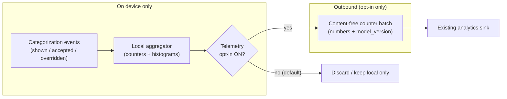
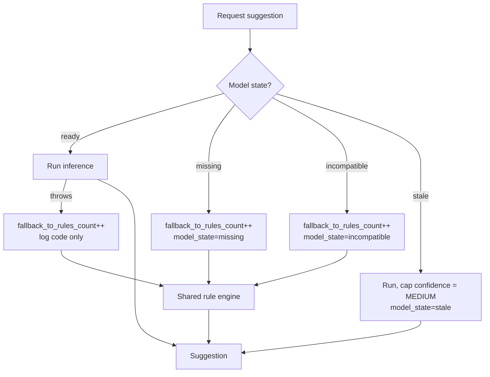

# Privacy-Preserving Categorization Telemetry & Tests — Design

> **Status:** Design only (no native build) · **Issue:** [#2615](https://github.com/jrmoulckers/finance/issues/2615) · **Epic:** [#2382](https://github.com/jrmoulckers/finance/issues/2382)
> **Platforms:** iOS 17+ (SwiftUI) · shared contract in KMP `packages/core`
> **Privacy posture:** Opt-in, aggregate-only. No merchant content, payee text, amounts, or category labels ever leave the device.

This document specifies the **health metrics**, the **no-merchant-content
telemetry constraints**, the **unavailable-model fallbacks**, and the
**deterministic adapter tests** for on-device transaction categorization on
iOS. It is the privacy and verification backbone for the cluster. It is a
**design only**: native Swift is gated behind Apple Developer enrollment
([#1239](https://github.com/jrmoulckers/finance/issues/1239)), but every test
and metric below is implementable today against a free Personal Team — see
[Implementation readiness](#implementation-readiness).

Companion docs in this cluster:

- [iOS Core ML categorization adapter](./ios-coreml-categorization-adapter.md) (#2613)
- [iOS category suggestion review & correction UX](./ios-category-suggestion-review-ux.md) (#2614)

---

## Table of Contents

1. [Goals & non-goals](#goals--non-goals)
2. [Privacy principles](#privacy-principles)
3. [What we measure (and what we never do)](#what-we-measure-and-what-we-never-do)
4. [Telemetry data flow](#telemetry-data-flow)
5. [Opt-in, consent & user control](#opt-in-consent--user-control)
6. [Unavailable-model fallbacks](#unavailable-model-fallbacks)
7. [Logging discipline](#logging-discipline)
8. [Accessibility of telemetry controls](#accessibility-of-telemetry-controls)
9. [State matrix: empty, stale, error & disabled](#state-matrix-empty-stale-error--disabled)
10. [Regulatory alignment (GDPR/CCPA)](#regulatory-alignment-gdprccpa)
11. [Affected iOS surfaces & shared dependencies](#affected-ios-surfaces--shared-dependencies)
12. [Smallest test plan](#smallest-test-plan)
13. [Implementation readiness](#implementation-readiness)
14. [Open questions](#open-questions)

---

## Goals & non-goals

**Goals**

- Define **aggregate health metrics** that let us judge whether on-device
  categorization is actually helping — accuracy proxy, coverage, latency,
  fallback rate — **without ever seeing a single transaction**.
- Make "no merchant content leaves the device" a **testable invariant**, not
  a promise.
- Specify deterministic adapter tests and unavailable-model fallbacks so the
  feature degrades safely and predictably.
- Default to the most private option at every fork: this is a financial app.

**Non-goals**

- Inference mechanics — see the [adapter doc](./ios-coreml-categorization-adapter.md).
- Suggestion UX — see the [review/correction doc](./ios-category-suggestion-review-ux.md).
- Any server-side analytics schema beyond the content-free counters defined
  here.
- Building or shipping Swift (gated by [#1239](https://github.com/jrmoulckers/finance/issues/1239)).

---

## Privacy principles

1. **On-device first.** Inference and metric computation happen on the device.
2. **Content-free egress.** Only opt-in, pre-aggregated, **numeric** counters
   may leave the device. Never payee text, amounts, notes, category names,
   category IDs, account IDs, or model inputs/outputs.
3. **Data minimization.** Collect the smallest set of counters that answers a
   real product question. If a metric isn't actionable, it isn't collected.
4. **Opt-in, revocable.** Telemetry is **off by default** and can be turned
   off at any time, with immediate effect.
5. **Unlinkability.** Counters carry no stable user/device identifier beyond
   what existing app analytics already establish; categorization adds no new
   identifier and no new processor.
6. **Fail private.** If anything is ambiguous, emit nothing.

---

## What we measure (and what we never do)

**Allowed (aggregate, numeric, content-free):**

| Metric                        | Type      | Example value   | Why it's safe                               |
| ----------------------------- | --------- | --------------- | ------------------------------------------- |
| `suggestion_shown_count`      | counter   | 42              | Volume only; no subject.                    |
| `suggestion_accepted_count`   | counter   | 31              | Acceptance proxy for accuracy.              |
| `suggestion_overridden_count` | counter   | 8               | Correction proxy (which category? unknown). |
| `suggestion_dismissed_count`  | counter   | 3               | Hint rejection rate.                        |
| `confidence_bucket_histogram` | histogram | {H:20,M:15,L:7} | Calibration only; no labels.                |
| `fallback_to_rules_count`     | counter   | 4               | Model-availability health.                  |
| `inference_latency_ms_bucket` | histogram | {<10:30,<50:11} | Performance, bucketed not raw.              |
| `model_state`                 | enum      | `ready`         | `ready`/`missing`/`incompatible`/`stale`.   |
| `model_version`               | string    | `1.2.0`         | Build metadata, not user data.              |

**Never collected:**

- Payee / merchant strings, transaction amounts, notes, dates.
- The suggested or chosen **category name or ID**.
- Any mapping that could re-identify a merchant or a person.
- Raw (unbucketed) timing tied to a specific transaction.
- Free-text of any kind.

The acceptance/override counters are deliberately **categoryless**: we learn
that 8 suggestions were corrected, never _which_ category or merchant was
involved. That is enough to track quality without surveilling spending.

---

## Telemetry data flow

Notes:

- Events are reduced to counters **before** the opt-in gate; raw events never
  queue for egress.
- The aggregator holds only integers/buckets — there is no buffer of
  per-transaction records to leak.
- The egress batch reuses the app's existing analytics transport; this feature
  introduces **no new endpoint and no new processor**.

---

## Opt-in, consent & user control

- **Default off.** Categorization telemetry ships disabled. The user must
  explicitly enable "Help improve suggestions" in Settings.
- **Separable.** This toggle is independent from the
  [suggestions on/off toggle](./ios-category-suggestion-review-ux.md#accept--override--disable-flows):
  you can use suggestions with zero telemetry.
- **Revocable with immediate effect.** Turning it off stops aggregation and
  discards any pending local counters.
- **Transparent.** A short, plain-language explainer states exactly what is
  and isn't sent (link to a privacy detail screen), following
  [content-language-guidelines.md](./content-language-guidelines.md).
- **No dark patterns.** Enable/disable have equal visual weight; default
  selection is the private one.

---

## Unavailable-model fallbacks

The model may be missing, incompatible, stale, or throw at runtime. Telemetry
treats each as a **first-class, content-free health signal**, and the user
experience always degrades to the deterministic shared rule engine.

- Every fallback increments `fallback_to_rules_count` and updates
  `model_state` — both content-free.
- A runtime error logs a **code/category only** (e.g. `predictionFailed`),
  never the input that triggered it.
- The user sees a normal rule-based suggestion (or manual picker); there is no
  error banner and no crash. See the cluster
  [state matrices](./ios-coreml-categorization-adapter.md#state-matrix-stale-error-empty--low-confidence).

---

## Logging discipline

Following the project `os.Logger` privacy rules:

- Subsystem `com.finance`, category `categorization`.
- **Public** fields only: `model_version`, `model_state`, latency bucket,
  confidence bucket, counter deltas.
- **Never logged:** payee, amount, note, category name/ID, account ID — these
  are treated as `.private` by simply never emitting them.
- No `print()`. No string interpolation of financial values into log lines.
- A CI guardrail already greps `.swift`/`.kt` for sensitive-data logging
  patterns; our test suite adds positive assertions (below) that the payee
  fixture never appears in captured log output.

---

## Accessibility of telemetry controls

The Settings controls (telemetry toggle + explainer) follow
[accessibility-patterns.md](./accessibility-patterns.md) and
[cognitive-accessibility.md](./cognitive-accessibility.md):

- **VoiceOver:** the toggle announces name, state, and consequence — e.g.
  `"Help improve suggestions, off. When on, the app sends anonymous,
numbers-only quality stats. No transactions are ever shared."`
- **Dynamic Type:** the explainer uses `String(localized:)` + semantic fonts
  and reflows at accessibility sizes without truncation.
- **Plain language:** short sentences; no jargon; reading level appropriate
  for cognitive-accessibility mode.
- **Reduce Motion:** no animated illustration on the privacy explainer when
  Reduce Motion is enabled.
- **Switch Control / keyboard:** toggle and "Learn more" link are focusable
  with ≥ 44×44 pt targets and explicit `.accessibilityLabel(_:)`.

---

## State matrix: empty, stale, error & disabled

| State                      | Telemetry behavior                                             | User-facing                         |
| -------------------------- | -------------------------------------------------------------- | ----------------------------------- |
| **Disabled (default)**     | Aggregate locally optional; **never** egress.                  | No prompts; suggestions still work. |
| **Empty**                  | No events → no counters → nothing to send.                     | Nothing.                            |
| **Stale model**            | `model_state=stale` recorded; suggestions capped at `MEDIUM`.  | No banner.                          |
| **Missing / incompatible** | `fallback_to_rules_count++`, `model_state` set.                | Rule-based suggestions; no error.   |
| **Error**                  | Code-only health event; input never logged.                    | No crash, no exposed data.          |
| **Offline**                | Counters buffer as integers; flush later **only if opted in**. | Identical UX (all on-device).       |

---

## Regulatory alignment (GDPR/CCPA)

- **Data minimization & purpose limitation:** only content-free counters tied
  to a single purpose (improving suggestion quality) are processed.
- **Lawful basis / consent:** opt-in, revocable consent; off by default.
- **No new processor / no new transfer:** reuses the existing analytics
  transport; categorization adds no cross-border data flow and no merchant
  content.
- **Right to access/erasure:** because no personal categorization data leaves
  the device, there is nothing merchant-specific to export or delete server
  side; local corrections are erasable via "Forget learned merchants" (see
  [review/correction doc](./ios-category-suggestion-review-ux.md#correction-persistence--learning)).
- **Children / sensitive inference:** spending categories can be sensitive;
  keeping inference and labels on-device avoids creating a sensitive-data
  processing record off-device.

---

## Affected iOS surfaces & shared dependencies

**iOS surfaces (read-only references; not modified in this design):**

- A new `CategorizationTelemetry` aggregator type in `apps/ios` (counters +
  buckets, `Sendable`, actor-isolated).
- A Settings row: "Help improve suggestions" toggle + privacy explainer.
- Hook points in
  [`TransactionCreateViewModel.swift`](../../apps/ios/Finance/ViewModels/TransactionCreateViewModel.swift)
  and the suggestion/review surfaces from
  [#2614](https://github.com/jrmoulckers/finance/issues/2614) that emit
  content-free events.

**Shared dependencies (KMP, owned by @native-app-engineer):**

- [`SmartCategorizationEngine.kt`](../../packages/core/src/commonMain/kotlin/com/finance/core/categorization/SmartCategorizationEngine.kt)
  — already exposes `getStats()` (`EngineStats`), a precedent for content-free
  aggregate diagnostics; the iOS aggregator mirrors that spirit.

---

## Smallest test plan

Deterministic, fixed-seed fixtures with **synthetic** payees. The privacy
assertions are the highest-priority gate.

**Privacy invariants (must pass before acceptance)**

1. `noMerchantContentInEgress` — serialize a telemetry batch built from a
   fixture run; assert the payee/category fixture strings are **absent** and
   the payload contains only numeric counters + `model_version`.
2. `noPayeeInLogs` — capture `os.Logger` output during inference; assert the
   payee fixture never appears.
3. `disabledMeansNoEgress` — with telemetry off, the egress queue is empty
   after a full suggestion/accept/override cycle.
4. `optOutDiscardsPendingCounters` — toggling off clears buffered counters.
5. `noNetworkInCategorizationPath` — a failing URL-protocol stub records
   **zero** outbound requests during suggestion + correction.

**Aggregation correctness**

6. `countersIncrementExactlyOnce` — one shown/accepted/overridden event yields
   exactly one increment each.
7. `confidenceHistogramBuckets` — `{HIGH, MEDIUM, LOW}` events land in the
   right buckets; no label leaks into the bucket key.
8. `latencyIsBucketedNotRaw` — recorded latency is a bucket, never a raw
   per-transaction value.

**Unavailable-model fallbacks (deterministic adapter tests)**

9. `missingModelIncrementsFallback` — `.missing` ⇒ `fallback_to_rules_count++`
   and rule-based suggestion returned.
10. `incompatibleModelIncrementsFallback` — label-set hash mismatch ⇒
    `.incompatible` ⇒ fallback, content-free health event.
11. `staleModelRecordsStateAndCapsConfidence` — cutoff > 12 months ⇒
    `model_state=stale`, confidence ≤ `MEDIUM`.
12. `predictionErrorLogsCodeOnly` — a thrown Core ML error logs a code, not
    the input, and falls back cleanly.

These share fixtures with the adapter suite in
[ios-coreml-categorization-adapter.md](./ios-coreml-categorization-adapter.md#smallest-test-plan)
and the UX suite in
[ios-category-suggestion-review-ux.md](./ios-category-suggestion-review-ux.md#smallest-test-plan).

---

## Implementation readiness

Split by what a free Apple **Personal Team** can build versus the distribution
tail gated by Apple Developer Program enrollment
([#1239](https://github.com/jrmoulckers/finance/issues/1239)). See
[../ops/human-gated-prerequisites.md](../ops/human-gated-prerequisites.md).

**Buildable now (no paid account, no human-gated signing):**

- Implement the `CategorizationTelemetry` aggregator, the opt-in Settings
  toggle + explainer, and all event hooks in `apps/ios`.
- Run the full privacy/aggregation/fallback XCTest suite locally and in CI
  (`ci-ios`), plus shared `commonTest` (`ci-shared`).
- The CI sensitive-data-logging guardrail (`ci-lint` / `ci-security`) already
  scans `.swift`/`.kt`; our positive privacy assertions complement it.

**Distribution tail — gated by [#1239](https://github.com/jrmoulckers/finance/issues/1239) (human-gated):**

- TestFlight/App Store distribution of telemetry-enabled builds.
- Any future App Group / Keychain access-group entitlements if telemetry is
  shared across processes (widgets/App Clip) — paid team required.
- App privacy "nutrition label" updates for store submission (human submits).

No provisioning profiles, certificates, or store submissions are created here.

---

## Open questions

- **Counter retention window:** how long may opted-in local counters buffer
  before flush/expiry? Proposal: short rolling window, integers only.
- **Differential privacy:** is added noise on histograms worth it given counts
  are already merchant-free and categoryless? Likely unnecessary; revisit if
  buckets ever narrow.
- **Health surfacing:** expose a local-only "suggestion accuracy" stat to the
  user (computed on device, never sent)? Could increase trust; out of scope
  for this pass.
