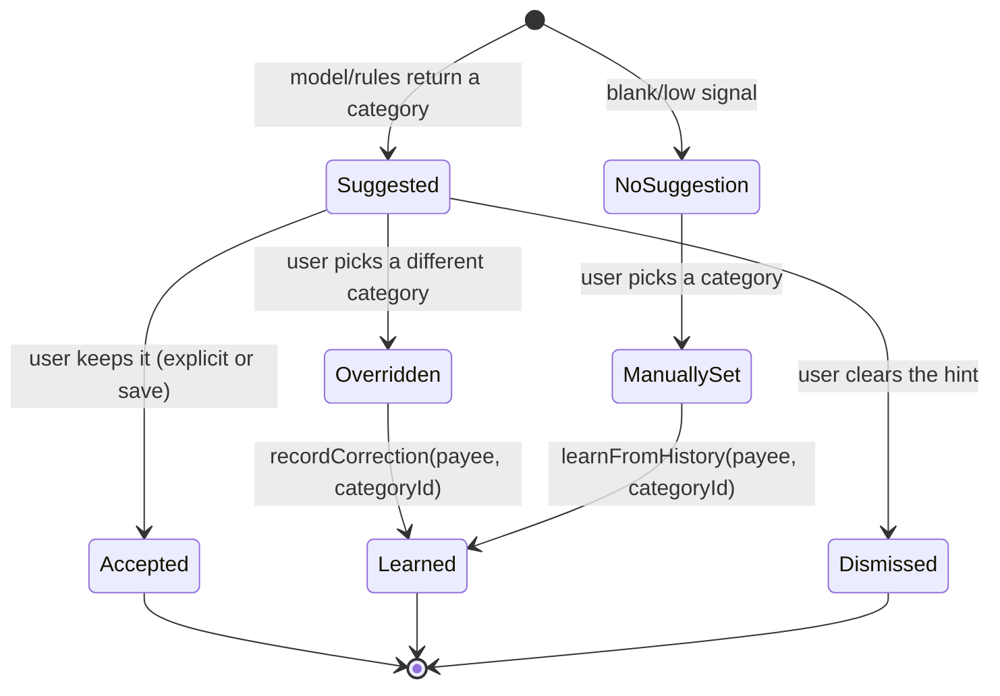
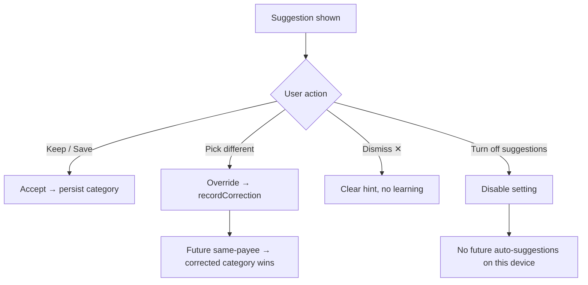
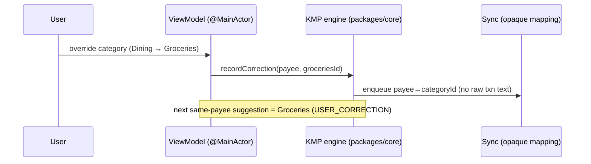

# iOS Category Suggestion Review & Correction UX — Design

> **Status:** Design only (no native build) · **Issue:** [#2614](https://github.com/jrmoulckers/finance/issues/2614) · **Epic:** [#2382](https://github.com/jrmoulckers/finance/issues/2382)
> **Platforms:** iOS 17+ (SwiftUI) · shared rules in KMP `packages/core`
> **Privacy posture:** On-device suggestions. Corrections sync as opaque `payee → categoryId` only.

This document designs how people **see, accept, override, and disable**
on-device category suggestions on iOS, and how a correction is persisted so
the system learns without ever sending raw transaction text off the device.
It is a **design only**: native Swift is gated behind Apple Developer
enrollment ([#1239](https://github.com/jrmoulckers/finance/issues/1239)); the
patterns here are implementable today against a free Personal Team — see
[Implementation readiness](#implementation-readiness).

Companion docs in this cluster:

- [iOS Core ML categorization adapter](./ios-coreml-categorization-adapter.md) (#2613)
- [Privacy-preserving categorization telemetry & tests](./ios-categorization-privacy-telemetry.md) (#2615)

---

## Table of Contents

1. [Goals & non-goals](#goals--non-goals)
2. [Where this fits: the KMP boundary](#where-this-fits-the-kmp-boundary)
3. [Suggestion lifecycle](#suggestion-lifecycle)
4. [Surfaces & layouts](#surfaces--layouts)
5. [Confidence display](#confidence-display)
6. [Accept / override / disable flows](#accept--override--disable-flows)
7. [Correction persistence & learning](#correction-persistence--learning)
8. [Accessibility](#accessibility)
9. [State matrix: empty, loading, stale, error & low-confidence](#state-matrix-empty-loading-stale-error--low-confidence)
10. [Privacy](#privacy)
11. [Affected iOS surfaces & shared dependencies](#affected-ios-surfaces--shared-dependencies)
12. [Smallest test plan](#smallest-test-plan)
13. [Implementation readiness](#implementation-readiness)
14. [Open questions](#open-questions)

---

## Goals & non-goals

**Goals**

- Make suggestions **glanceable, honest, and effortless to correct**. A wrong
  guess must cost one tap to fix and must visibly teach the system.
- Cover both **imported** transactions (batch review) and **manual** entry
  (inline suggestion while typing the payee).
- Express confidence truthfully and accessibly, never overstating a guess.
- Let users **disable** suggestions entirely, per device, with a clear,
  reversible setting.
- Persist corrections through the existing shared learning path so behavior
  improves across the household's devices.

**Non-goals**

- The inference mechanics — see the [adapter doc](./ios-coreml-categorization-adapter.md).
- Aggregate health metrics — see the [telemetry doc](./ios-categorization-privacy-telemetry.md).
- Building or shipping Swift (gated by [#1239](https://github.com/jrmoulckers/finance/issues/1239)).

---

## Where this fits: the KMP boundary

| Concern                                  | Home                     | Notes                                                 |
| ---------------------------------------- | ------------------------ | ----------------------------------------------------- |
| Suggestion + confidence contract         | `packages/core`          | `CategorizationSuggestion`, `Confidence`, `Strategy`. |
| Correction learning (`recordCorrection`) | `packages/core`          | Already exists in `SmartCategorizationEngine`.        |
| Suggestion preference (on/off)           | `packages/core` + device | Cross-device default; per-device override on iOS.     |
| SwiftUI screens, sheets, VoiceOver       | `apps/ios`               | Presentation + accessibility only.                    |

The shared engine already exposes correction learning in
[`SmartCategorizationEngine.kt`](../../packages/core/src/commonMain/kotlin/com/finance/core/categorization/SmartCategorizationEngine.kt)
(`recordCorrection(payee, categoryId)`), and the iOS bridge already calls
`learnFromHistory(payee:categoryId:)` from
[`TransactionCreateViewModel.swift`](../../apps/ios/Finance/ViewModels/TransactionCreateViewModel.swift).
This design adds **review/correction UX** on top of those existing hooks; it
does not change the shared contract.

---

## Suggestion lifecycle



A suggestion is always a **proposal, never a commitment**. It is only
persisted to the transaction when the user accepts (explicitly or by saving),
and a correction is only learned when the user assigns a different category.

---

## Surfaces & layouts

### 1. Manual entry — inline suggestion

In the transaction create/edit sheet, as the payee field changes, the
category row shows a non-modal suggestion:

```text
┌───────────────────────────────────────────────┐
│ Payee   Blue Bottle Coffee                     │
│ Category  ◉ Dining   ·  Suggested · Medium  ✕  │  ← chip + dismiss
│           Tap to change                         │
└───────────────────────────────────────────────┘
```

- The suggestion is **pre-selected but reversible**: the picker is one tap
  away, and the dismiss control (`✕`) clears it without choosing anything.
- `MEDIUM`/`LOW` suggestions are visually softer (outline chip) than `HIGH`
  (filled chip) — but always paired with text, never color alone.

### 2. Imported transactions — batch review

After an import, a dedicated review screen groups suggestions so users can
confirm many at once:

```text
Review 12 suggested categories
─────────────────────────────────────────────
Dining (high)            5 transactions   [Confirm all]
Groceries (high)         3 transactions   [Confirm all]
Transport (medium)       2 transactions   [Review]
Needs your input         2 transactions   [Choose]
─────────────────────────────────────────────
[Confirm all high-confidence]      [Skip]
```

- **High-confidence groups** offer bulk confirm; **medium/low** invite
  per-row review; **no suggestion** routes to manual choice.
- Bulk actions are fully undoable from the standard transaction list.

---

## Confidence display

Confidence maps to the shared `Confidence` enum (`HIGH`/`MEDIUM`/`LOW`) from
the adapter. Display follows the CVD-safe rules in
[data-visualization.md](./data-visualization.md#2-color-system) — encode by
**icon + text + position**, never hue alone.

| Confidence | Chip style   | Text label          | Auto-applied?   |
| ---------- | ------------ | ------------------- | --------------- |
| `HIGH`     | Filled       | "Suggested"         | Yes             |
| `MEDIUM`   | Outline      | "Suggested · Maybe" | Yes (easy undo) |
| `LOW`      | Ghost / hint | "Maybe: Dining?"    | No — hint only  |

Copy is non-judgmental per
[content-language-guidelines.md](./content-language-guidelines.md): we say
"We guessed Dining" and "Tap to change," never "You miscategorized this."

---

## Accept / override / disable flows



**Accept.** Keeping the pre-selected category and saving persists it. No extra
confirmation tax for the common case.

**Override.** Choosing a different category:

1. Updates the transaction's category.
2. Calls the shared correction hook (`recordCorrection` /
   `learnFromHistory`) so the **next** transaction with the same payee is
   categorized by the user's choice (the engine ranks `USER_CORRECTION`
   highest).
3. Emits a content-free "correction" health signal (opt-in only — see
   [telemetry doc](./ios-categorization-privacy-telemetry.md)).

**Disable.** A Settings toggle — `String(localized: "Suggest categories")` —
defaults **on** but is one tap to turn off. When off:

- No suggestions are computed or shown anywhere.
- Existing learned corrections are retained (disabling display ≠ deleting
  data); a separate "Forget learned merchants" action clears them.
- The setting is per-device (a privacy-respecting local override) and is
  stored as a non-sensitive preference, not in Keychain.

---

## Correction persistence & learning

- **What is stored:** an opaque `payee → categoryId` mapping in the shared
  correction store, exactly as the engine already models it. No amounts,
  notes, dates, or free text.
- **Where:** `packages/core` owns the store; it rides the existing sync path
  so corrections follow the household across devices. iOS does not invent a
  parallel store.
- **Precedence:** corrections outrank every other signal, including the
  on-device model — a user's explicit choice is always honored.
- **Forgetting:** "Forget learned merchants" clears corrections locally and
  propagates the deletion through sync, supporting the user's right to
  erasure (see [Privacy](#privacy)).



---

## Accessibility

Patterns follow [accessibility-patterns.md](./accessibility-patterns.md) and
[cognitive-accessibility.md](./cognitive-accessibility.md). Specific
requirements:

- **VoiceOver — suggestion:** the category control announces label,
  confidence, and the action, e.g. `"Suggested category, Dining, high
confidence. Double-tap to change."` Confidence is spoken text, not implied
  by color.
- **VoiceOver — correction:** after an override, post an
  `.announcement` (or `AccessibilityNotification.Announcement`) such as
  `"Category changed to Groceries. We'll remember Blue Bottle Coffee."`
- **VoiceOver — batch review:** each group is a single element summarizing
  count + confidence + action ("Dining, high confidence, 5 transactions,
  Confirm all button").
- **Dynamic Type:** all chips, labels, and the batch list use
  `String(localized:)` + semantic fonts; rows grow and wrap at accessibility
  sizes without truncating the confidence text.
- **Switch Control / keyboard:** dismiss (`✕`), accept, and override are all
  focusable, ordered logically, with ≥ 44×44 pt targets.
- **Reduce Motion:** no celebratory animation on accept; use a static state
  change.
- **Accessible names everywhere:** every interactive control has an explicit
  `.accessibilityLabel(_:)`.

---

## State matrix: empty, loading, stale, error & low-confidence

| State                     | What the user sees                                                                    |
| ------------------------- | ------------------------------------------------------------------------------------- |
| **Empty**                 | No payee or no signal → plain category picker, no chip, no error.                     |
| **Loading**               | Brief neutral placeholder on the category row; typing is never blocked.               |
| **Low-confidence**        | Ghost "Maybe: …?" hint; nothing auto-applied; one tap to accept or ignore.            |
| **Stale model**           | Suggestions still appear (capped at `MEDIUM`); no scary banner.                       |
| **Error / model missing** | Silent fallback to rule-based suggestion or manual choice; no crash, no exposed data. |
| **Disabled**              | No suggestions anywhere; manual categorization works exactly as before.               |
| **Offline**               | Identical to online — categorization is fully on-device.                              |

Guiding principle: **a low-confidence or failed guess must never get in the
way of just picking a category.**

---

## Privacy

- Suggestions are computed on-device; the payee string never leaves the
  device for inference (see [adapter doc](./ios-coreml-categorization-adapter.md#privacy-boundary-no-remote-data)).
- Corrections sync only as opaque `payee → categoryId` pairs already covered
  by existing sync privacy rules — no amounts, notes, or transaction bodies.
- The suggestions toggle and "Forget learned merchants" give users
  **control and erasure**, aligning with GDPR/CCPA data-minimization and
  right-to-delete expectations.
- No suggestion content is written to logs; only opt-in, aggregate health
  signals are emitted (see [#2615](https://github.com/jrmoulckers/finance/issues/2615)).

---

## Affected iOS surfaces & shared dependencies

**iOS surfaces (read-only references; not modified in this design):**

- [`TransactionCreateViewModel.swift`](../../apps/ios/Finance/ViewModels/TransactionCreateViewModel.swift)
  — already has `suggestedCategoryId` + `updateCategorySuggestion()`; this
  design specifies the surrounding UX.
- `apps/ios/Finance/Screens/TransactionCreateView.swift`,
  `TransactionEditView.swift`, `TransactionDetailView.swift` — render the
  inline suggestion + confidence chip.
- New (future) `ImportReviewView` + `ImportReviewViewModel` for batch review.
- `apps/ios/Finance/Components/TransactionRowView.swift` — optional inline
  "needs category" affordance.
- A Settings row for the suggestions toggle and "Forget learned merchants."

**Shared dependencies (KMP, owned by @kmp-engineer):**

- [`SmartCategorizationEngine.kt`](../../packages/core/src/commonMain/kotlin/com/finance/core/categorization/SmartCategorizationEngine.kt)
  — `recordCorrection`, `suggest`, `Confidence`.
- [`Category.kt`](../../packages/models/src/commonMain/kotlin/com/finance/models/Category.kt)
  — correction target.

---

## Smallest test plan

Deterministic, fixture-based, no real user data.

**iOS view-model (XCTest — buildable now on a free Personal Team)**

1. `acceptKeepsSuggestedCategory` — saving with the pre-selected suggestion
   persists it unchanged.
2. `overrideRecordsCorrection` — choosing a different category calls the
   shared correction hook exactly once with the right `payee → categoryId`.
3. `dismissDoesNotLearn` — clearing the hint records **no** correction.
4. `disableSuppressesSuggestions` — with the toggle off, `suggestedCategoryId`
   stays `nil` for all inputs.
5. `lowConfidenceIsNotAutoApplied` — a `LOW` suggestion leaves
   `selectedCategoryId == nil`.
6. `batchConfirmHighOnly` — "Confirm all high-confidence" applies only `HIGH`
   rows and leaves others untouched.

**Shared (KMP, `commonTest`)**

7. `correctionOutranksModelAndRules` — after `recordCorrection`, the same
   payee returns `USER_CORRECTION`.
8. `forgetMerchantsClearsCorrections` — erasure removes the mapping and the
   next suggestion no longer reflects it.

**Accessibility & privacy assertions**

9. `suggestionHasAccessibilityLabelWithConfidence` — snapshot the
   accessibility tree; confidence text is present and not color-encoded.
10. `correctionPayloadCarriesNoRawText` — the persisted/synced correction
    contains only `payee` + `categoryId`, asserted field-by-field.

---

## Implementation readiness

Split by what a free Apple **Personal Team** can build versus the distribution
tail gated by Apple Developer Program enrollment
([#1239](https://github.com/jrmoulckers/finance/issues/1239)). See
[../ops/human-gated-prerequisites.md](../ops/human-gated-prerequisites.md).

**Buildable now (no paid account, no human-gated signing):**

- Build the inline suggestion chip, batch `ImportReviewView`, Settings
  toggle, and "Forget learned merchants" in `apps/ios`.
- Wire accept/override/dismiss to the existing shared correction hooks.
- Run all XCTest view-model + accessibility snapshot tests and KMP
  `commonTest` in CI (`ci-ios`, `ci-shared`).

**Distribution tail — gated by [#1239](https://github.com/jrmoulckers/finance/issues/1239) (human-gated):**

- TestFlight/App Store distribution of builds that include suggestions.
- Any future widget/App Clip surfacing of suggestions that needs App Group or
  Keychain access-group entitlements (paid team required).

No provisioning profiles, certificates, or store submissions are created here.

---

## Open questions

- **Batch review entry point:** dedicated screen post-import vs. an inline
  banner on the transaction list? This doc proposes a dedicated screen for
  large imports and inline for small ones (threshold TBD).
- **Correction scope:** household-wide vs. per-user corrections when multiple
  members share a household? Defer to the shared sync model; UX assumes
  household-wide with the existing precedence rules.
- **Undo window:** should bulk-confirm offer a timed undo toast in addition to
  per-row undo? Leaning yes for imports > 10 rows.
