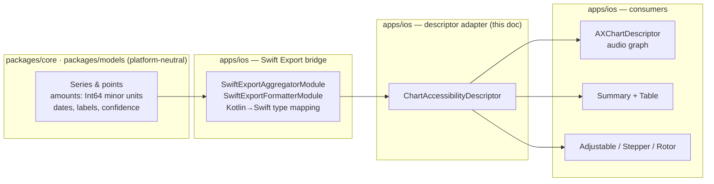

# iOS Chart Descriptor Adapters for Swift Charts

> Design specification for **view-model descriptors** that map shared chart
> series into Swift Charts accessibility descriptors (`AXChartDescriptor` /
> audio graph) and the adjacent non-gesture controls that drive selection.

**Status:** PROPOSED — design only (native implementation gated, see
[Implementation readiness](#implementation-readiness))
**Issue:** [#2542](https://github.com/jrmoulckers/finance/issues/2542) — _Part of
[#2115](https://github.com/jrmoulckers/finance/issues/2115)_
**Platform:** iOS (SwiftUI · Swift Charts · Accessibility)
**Last updated:** 2026-06-22
**Related design docs:** [data-visualization.md](./data-visualization.md) ·
[chart-component-specs.md](./chart-component-specs.md) ·
[accessibility-patterns.md](./accessibility-patterns.md)
**Sibling docs (this cluster):**
[ios-chart-summaries-data-tables.md](./ios-chart-summaries-data-tables.md) ·
[ios-chart-voiceover-navigation.md](./ios-chart-voiceover-navigation.md)

---

## Table of Contents

1. [Problem & Goal](#1-problem--goal)
2. [Affected iOS Surfaces](#2-affected-ios-surfaces)
3. [Shared Dependencies & the iOS / KMP Boundary](#3-shared-dependencies--the-ios--kmp-boundary)
4. [The Descriptor Model](#4-the-descriptor-model)
5. [Mapping to `AXChartDescriptor`](#5-mapping-to-axchartdescriptor)
6. [Adjacent Non-Gesture Controls](#6-adjacent-non-gesture-controls)
7. [Accessibility](#7-accessibility)
8. [Dynamic Type](#8-dynamic-type)
9. [Privacy & Balance Hiding](#9-privacy--balance-hiding)
10. [Empty, Stale & Error States](#10-empty-stale--error-states)
11. [Test Plan](#11-test-plan)
12. [Implementation readiness](#implementation-readiness)

---

## 1. Problem & Goal

The summaries/tables doc and the navigation doc both need the **same answer** to
"what are the points, axes, and series of this chart, as accessible facts?".
Today every chart re-derives that ad hoc and none of them feed Swift Charts'
built-in audio-graph support:

- The charts assign per-mark `.accessibilityLabel` / `.accessibilityValue` (e.g.
  [`SpendingChart.swift`](../../apps/ios/Finance/Charts/SpendingChart.swift)
  ≈ lines 47–50,
  [`TrendChart.swift`](../../apps/ios/Finance/Charts/TrendChart.swift)
  ≈ lines 64–67) but stop there.
- None of them implement `AXChartDescriptorRepresentable` /
  `.accessibilityChartDescriptor(…)`, so VoiceOver's **"Play Audio Graph" /
  "Describe Chart"** rotor actions are unavailable
  ([#2115](https://github.com/jrmoulckers/finance/issues/2115)).
- Each chart owns its own selection state (`selectedDate`, `selectedAngle`),
  derived independently from the data, so the summary, the table, the audio
  graph, and the selection control can drift.

**Goal:** define one reusable, testable **`ChartAccessibilityDescriptor`**
view-model type that:

1. Is built once from the shared, platform-neutral series data.
2. Adapts into a Swift Charts **`AXChartDescriptor`** (axes, series, data points)
   to power the audio graph.
3. Feeds the **spoken summary + table** ([ios-chart-summaries-data-tables.md](./ios-chart-summaries-data-tables.md)).
4. Feeds the **adjustable/stepper/rotor selection**
   ([ios-chart-voiceover-navigation.md](./ios-chart-voiceover-navigation.md)) and
   the **adjacent non-gesture controls** described here.

This descriptor is the **single source of truth** that makes the whole cluster
consistent.

---

## 2. Affected iOS Surfaces

| Surface                                                                                      | Series shape                                                                     | Descriptor produced                                   |
| -------------------------------------------------------------------------------------------- | -------------------------------------------------------------------------------- | ----------------------------------------------------- |
| [`SpendingChart.swift`](../../apps/ios/Finance/Charts/SpendingChart.swift)                   | `[CategorySpending]` (category, amount)                                          | 1 categorical axis × 1 numeric axis, 1 series         |
| [`CategoryBreakdownChart.swift`](../../apps/ios/Finance/Charts/CategoryBreakdownChart.swift) | `[CategorySlice]` (category, amount, %)                                          | Categorical × numeric (value + derived %), 1 series   |
| [`TrendChart.swift`](../../apps/ios/Finance/Charts/TrendChart.swift)                         | `[TrendDataPoint]` (date, value, series)                                         | Temporal × numeric, **N series**                      |
| [`PredictionChart.swift`](../../apps/ios/Finance/Charts/PredictionChart.swift)               | history `[TrendDataPoint]` + `[TrendPrediction]` (predicted, lower, upper, conf) | Temporal × numeric, history + predicted series + band |
| [`InsightsView.swift`](../../apps/ios/Finance/Screens/InsightsView.swift)                    | `[SpendingBreakdown]`, `[MonthlyAmount]`                                         | Categorical and temporal descriptors                  |
| [`AnalyticsView.swift`](../../apps/ios/Finance/Screens/AnalyticsView.swift)                  | `[CategoryTrend]`, `[TrendPrediction]`                                           | Temporal × numeric, multi-series                      |
| [`InvestmentDetailView.swift`](../../apps/ios/Finance/Screens/InvestmentDetailView.swift)    | price history (date, value)                                                      | Temporal × numeric, 1 series                          |

All consume the same `ChartColorPalette`
([`ChartColorPalette.swift`](../../apps/ios/Finance/Charts/ChartColorPalette.swift))
— the descriptor carries **identity by name**, not colour, so the audio graph and
the table are colour-independent.

---

## 3. Shared Dependencies & the iOS / KMP Boundary

The descriptor is **iOS-owned** (it speaks Apple's `AXChartDescriptor` and
SwiftUI types), but its **inputs are platform-neutral**. This is the explicit
boundary the issue calls for: shared series data in
`packages/core` / `packages/models`; Apple accessibility semantics in `apps/ios`.



| Concern                                                                       | Lives in                            | Notes                                                                                                                                                                 |
| ----------------------------------------------------------------------------- | ----------------------------------- | --------------------------------------------------------------------------------------------------------------------------------------------------------------------- |
| Series & point data (dates, labels, amounts in minor units, confidence)       | `packages/core` / `packages/models` | Already vended through `SwiftExportAggregatorModule` / `SwiftExportFormatterModule` ([`SwiftExportBridge.swift`](../../apps/ios/Finance/KMP/SwiftExportBridge.swift)) |
| Kotlin → Swift type mapping (`Int`→`Int32`, `List`→`Array`, sealed→enum)      | Bridge boundary                     | Per Swift Export conventions; **no KMP types leak past the bridge**                                                                                                   |
| `ChartAccessibilityDescriptor` struct + adapter to `AXChartDescriptor`        | `apps/ios`                          | This document                                                                                                                                                         |
| Audio-graph axes/series/points (`AXNumericDataAxisDescriptor`, `AXDataPoint`) | `apps/ios`                          | Apple framework, iOS 17+                                                                                                                                              |
| Adjacent non-gesture controls (series toggle, point stepper)                  | `apps/ios`                          | Shares `selectedIndex` with [ios-chart-voiceover-navigation.md](./ios-chart-voiceover-navigation.md)                                                                  |

> **Boundary rule:** the descriptor **reads** shared aggregates; it never adds
> business math. Currency strings come from the shared formatter so the audio
> graph's spoken axis labels are locale-correct. Amounts cross as `Int64` minor
> units and are converted to `Double` only at the `AXDataPoint` boundary (Swift
> Charts axes are `Double`), consistent with
> [data-visualization.md §6.1](./data-visualization.md#61-cents-to-dollars-conversion).

> **No `packages/` edits in this PR.** If the shared layer should expose a
> ready-made "chart series DTO", that is proposed to @native-app-engineer via ADR
> ([AGENTS.md](../../AGENTS.md)); this design names the contract only.

---

## 4. The Descriptor Model

A value type (Sendable) the view model builds once per data load:

```
ChartAccessibilityDescriptor            // conceptual shape — not an implementation
├─ title: String                        // localized
├─ kind: .bar | .donut | .line | .prediction
├─ xAxis: AxisDescriptor                // categorical OR temporal
│    ├─ title: String
│    └─ values: [labelled categories]  OR  [date range + ticks]
├─ yAxis: NumericAxisDescriptor
│    ├─ title: String
│    ├─ range: (minMinorUnits, maxMinorUnits)
│    └─ format: (Int64) -> String       // delegates to shared formatter
├─ series: [SeriesDescriptor]
│    ├─ name: String                     // identity, NOT colour
│    ├─ points: [PointDescriptor]
│    │    ├─ x: category | date
│    │    ├─ valueMinorUnits: Int64
│    │    ├─ lowerMinorUnits / upperMinorUnits: Int64?   // prediction band
│    │    └─ confidencePercent: Double?                  // prediction
│    └─ isForecast: Bool
└─ summaryFacts: SummaryFacts            // total, min, max, delta, top — see doc #2534
```

- **One descriptor per chart**, built from the bridged aggregates.
- Carries `Int64` minor units end-to-end; formatting is deferred to the shared
  formatter (`yAxis.format`) so every consumer renders identical strings.
- `summaryFacts` is the same structure consumed by
  [ios-chart-summaries-data-tables.md](./ios-chart-summaries-data-tables.md);
  `series[*].points` is the same ordering consumed by the selection navigation in
  [ios-chart-voiceover-navigation.md](./ios-chart-voiceover-navigation.md).

---

## 5. Mapping to `AXChartDescriptor`

The adapter conforms the chart container to `AXChartDescriptorRepresentable` and
returns an `AXChartDescriptor`, attached via `.accessibilityChartDescriptor(self)`.
This is what powers VoiceOver's **audio graph** ("Play Audio Graph" / "Describe
Chart" rotor actions).

| `ChartAccessibilityDescriptor` | Swift Charts accessibility type                                                            |
| ------------------------------ | ------------------------------------------------------------------------------------------ |
| `xAxis` (temporal)             | `AXNumericDataAxisDescriptor` (date as time-interval) + tick labels                        |
| `xAxis` (categorical)          | `AXCategoricalDataAxisDescriptor` (ordered category names)                                 |
| `yAxis` (numeric, currency)    | `AXNumericDataAxisDescriptor` with `valueDescriptionProvider` calling the shared formatter |
| `series[i]`                    | `AXDataSeriesDescriptor(name:isContinuous:dataPoints:)`                                    |
| `series[i].points[j]`          | `AXDataPoint(x:y:additionalValues:label:)`                                                 |
| `confidencePercent` / band     | `AXDataPoint.additionalValues` (spoken as "range … , N% confidence")                       |
| `summaryFacts`                 | `AXChartDescriptor.summary` string                                                         |

**Mapping rules**

- **Axis labels are spoken via the shared formatter** — the
  `valueDescriptionProvider` converts the `Double` axis value back through
  `SwiftExportFormatterModule.format(amountMinorUnits:…)` so the audio graph says
  "$12,500", not "12500.0".
- **Continuity:** line/prediction series set `isContinuous: true`; bar/donut set
  `isContinuous: false` (discrete categories).
- **Donut → 1-D:** a donut maps to a single categorical series whose `y` is the
  slice value and whose `additionalValues` carry the percentage.
- **Prediction band:** the predicted series adds `lower`/`upper` as
  `additionalValues`; the historical and predicted series are **named distinctly**
  ("Spending", "Forecast") so the audio graph separates them.
- The audio graph is **complementary** to — not a replacement for — the summary,
  table, and adjustable selection. A user can play the graph, read the table, and
  step the selection, all backed by the one descriptor.

> Mirrors the four web strategies in
> [accessibility-patterns.md §7.2](./accessibility-patterns.md#72-chart-accessibility)
> (CVD palette, container description, per-point labels, keyboard/AT navigation) —
> the descriptor is the iOS analogue of `buildChartDescription()` plus the
> per-`Cell` labels, unified.

---

## 6. Adjacent Non-Gesture Controls

The descriptor also drives the **visible controls** that make a chart inspectable
without a drag gesture (the partner of the adjustable action in
[ios-chart-voiceover-navigation.md §4](./ios-chart-voiceover-navigation.md#4-interaction-design)):

| Control                | Bound to                           | Purpose                                                                        |
| ---------------------- | ---------------------------------- | ------------------------------------------------------------------------------ |
| Series toggle / Picker | `series[*].name`                   | Choose the active series on multi-series charts (Trend)                        |
| Point `Stepper`        | `selectedIndex` into active series | Move the selection point-by-point (keyboard / Switch Control)                  |
| "Show data table"      | `summaryFacts` + `series.points`   | Reveal the row alternative ([doc #2534](./ios-chart-summaries-data-tables.md)) |

- These controls and the VoiceOver adjustable action **share one `selectedIndex`**
  held by the view model, so highlight, spoken value, audio graph cursor, and
  stepper never disagree.
- Controls are standard SwiftUI (`Picker`, `Stepper`), so they inherit keyboard,
  Switch Control, Full Keyboard Access, and pointer support for free, at ≥ 44×44 pt.

---

## 7. Accessibility

| Requirement                  | Implementation                                                                                                    |
| ---------------------------- | ----------------------------------------------------------------------------------------------------------------- |
| Audio graph                  | `.accessibilityChartDescriptor(self)` returning the mapped `AXChartDescriptor`                                    |
| Axis labels spoken correctly | `valueDescriptionProvider` → shared formatter (locale-correct currency, "negative"/"expense")                     |
| Per-point detail             | `AXDataPoint.label` + `additionalValues` (range, confidence)                                                      |
| Chart summary                | `AXChartDescriptor.summary` = `summaryFacts` sentence (same as [doc #2534](./ios-chart-summaries-data-tables.md)) |
| Selection without drag       | Shared `selectedIndex` → adjustable action + stepper ([doc #2540](./ios-chart-voiceover-navigation.md))           |
| Colour independence          | Series identity by name; descriptor never encodes colour                                                          |
| CVD-safe palette             | Visual layer still uses [`ChartColorPalette`](../../apps/ios/Finance/Charts/ChartColorPalette.swift)              |

---

## 8. Dynamic Type

- The descriptor is data, not layout, so it is inherently size-independent; the
  **adjacent controls** it drives follow the `FinanceTextStyle` ramp /
  `.financeFont()` and `@ScaledMetric`
  ([accessibility-patterns.md §9.2](./accessibility-patterns.md#92-ios-swiftui)).
- Series pickers and point steppers reflow via `AdaptiveFinanceStack` at
  accessibility text sizes so control labels never clip.
- Audio-graph spoken output is unaffected by Dynamic Type, but the visible
  selected-value caption fed by the descriptor wraps and never truncates.

---

## 9. Privacy & Balance Hiding

- The descriptor is built from the **already-redacted** model when balance-hiding
  is active: `valueMinorUnits` and the formatter output resolve to "Hidden", so
  the audio graph, summary, table, and selection all speak the same redaction.
- Because there is exactly one descriptor, there is **no path** where the visual
  is hidden but the audio graph leaks the amount — the redaction is applied once,
  upstream of all consumers.
- Non-monetary facts (series names, dates, counts, confidence %) may remain;
  every `Int64` amount honours the redaction flag.
- Amounts are `.private` in `os.Logger`; the descriptor is never logged with raw
  values.

---

## 10. Empty, Stale & Error States

| State       | Descriptor                                 | `AXChartDescriptor`                              | Controls          |
| ----------- | ------------------------------------------ | ------------------------------------------------ | ----------------- |
| **Empty**   | `series == []`, `summaryFacts` = "no data" | Not attached; chart replaced by `EmptyStateView` | Hidden            |
| **Loading** | `nil` (not yet built)                      | Not attached; labelled `ProgressView`            | Disabled          |
| **Stale**   | Built from cached data + `asOf` timestamp  | `summary` includes "as of {time}"                | Enabled           |
| **Error**   | `nil`; error model instead                 | Not attached; labelled "Retry" button            | Replaced by Retry |

- Stale state reads the sync/offline signal (`SwiftExportSyncModule`,
  `OfflineBanner`) and stamps `asOf` into the descriptor so the audio-graph summary
  states the data age.
- Consistent with [data-visualization.md §7](./data-visualization.md#7-empty-loading--error-states)
  and the companion state tables in
  [doc #2534 §9](./ios-chart-summaries-data-tables.md#9-empty-stale--error-states)
  and [doc #2540 §9](./ios-chart-voiceover-navigation.md#9-empty-stale--error-states).

---

## 11. Test Plan

Smallest tests required before acceptance. Native tests run on Simulator with
**free Personal Team signing** (see [Implementation readiness](#implementation-readiness)).

### Native (iOS) — XCTest / Swift Testing in `apps/ios/Tests`

- `ChartDescriptorBuilderTests`: building a descriptor from each fixture
  (`[CategorySpending]`, `[TrendDataPoint]` multi-series, history + `[TrendPrediction]`)
  yields the expected axis kinds, series count, ordered points, and `summaryFacts`.
- `AXChartDescriptorMappingTests`: the adapter produces an `AXChartDescriptor`
  with the correct axis descriptor types (numeric vs. categorical), `isContinuous`
  per kind, one `AXDataSeriesDescriptor` per series, and `AXDataPoint` counts equal
  to point counts; prediction `additionalValues` include lower/upper/confidence.
- `AXAxisLabelFormatTests`: `valueDescriptionProvider` round-trips a `Double` axis
  value back to the shared formatter's currency string for `en-US`, `de-DE`, `JPY`.
- `ChartDescriptorPrivacyTests`: with balance-hiding on, the descriptor's formatted
  values and the mapped `AXDataPoint` labels contain no raw amount.
- `ChartDescriptorStateTests`: empty/loading/error produce no attached descriptor
  and the documented fallback; stale stamps `asOf` into the summary.
- Extend `WidgetRenderingTests` / `AnalyticsViewModelTests` to assert the view
  model exposes a non-nil descriptor for populated data.

### Shared (KMP) — `packages/core` `commonTest` _(only if the series DTO is adopted; ADR-gated)_

- `ChartSeriesDtoTest`: if a shared chart-series DTO is introduced, verify
  aggregation → DTO mapping for category, trend, and prediction shapes. Until the
  ADR lands, the iOS adapter builds the descriptor from existing bridged aggregates
  and this test is N/A.

---

## Implementation readiness

**Design: ready now. Native code: buildable now, distribution gated.**

Per the
[Human-Gated Prerequisites runbook](../ops/human-gated-prerequisites.md#2-implementation-vs-distribution--the-decoupling),
implementation and distribution are decoupled. The "blocked by
[#1239](https://github.com/jrmoulckers/finance/issues/1239)" note on
[#2542](https://github.com/jrmoulckers/finance/issues/2542) is a **distribution**
gate only.

| Phase              | What                                                                                      | Gated by #1239?                         |
| ------------------ | ----------------------------------------------------------------------------------------- | --------------------------------------- |
| **Design**         | This document, the descriptor model, the `AXChartDescriptor` mapping, the test plan       | No — deliverable now                    |
| **Implementation** | `ChartAccessibilityDescriptor`, `AXChartDescriptorRepresentable` adapter, controls, tests | **No** — free Personal Team signing     |
| **Distribution**   | TestFlight / App Store build carrying the feature                                         | **Yes** — Apple Developer Program enrol |

- **Buildable now:** `AXChartDescriptor`, `AXNumericDataAxisDescriptor`,
  `AXCategoricalDataAxisDescriptor`, `AXDataSeriesDescriptor`, `AXDataPoint`, and
  `.accessibilityChartDescriptor(…)` are standard iOS 17 accessibility APIs with no
  paid entitlement; the descriptor and its tests run on Simulator and on a device
  via free Personal Team signing.
- **Gated tail (#1239):** only store/TestFlight distribution needs the paid
  enrollment + signing material in
  [human-gated-prerequisites.md §3.2](../ops/human-gated-prerequisites.md#32-ios-distribution--apple-developer-1239).
  An SME agent must **not** perform enrollment, certificate, or secret steps.
- **Shared-logic tail:** a shared chart-series DTO in `packages/` is optional and
  ADR-gated (@native-app-engineer); the descriptor is fully implementable today from the
  already-bridged aggregates.

_Part of [#2115](https://github.com/jrmoulckers/finance/issues/2115). Sibling
designs: [summaries & data tables](./ios-chart-summaries-data-tables.md) ·
[VoiceOver navigation](./ios-chart-voiceover-navigation.md)._
