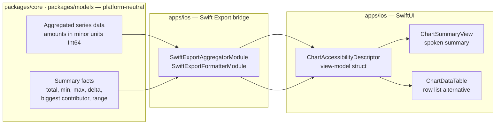

# iOS Chart Summaries & Data-Table Alternatives

> Design specification for a **reusable spoken-summary + table/list alternative**
> pattern that pairs every financial chart on iOS with an equivalent text
> representation, kept in the same VoiceOver swipe order as the chart.

**Status:** PROPOSED — design only (native implementation gated, see
[Implementation readiness](#implementation-readiness))
**Issue:** [#2534](https://github.com/jrmoulckers/finance/issues/2534) — _Part of
[#2113](https://github.com/jrmoulckers/finance/issues/2113)_
**Platform:** iOS (SwiftUI · Swift Charts)
**Last updated:** 2026-06-22
**Related design docs:** [data-visualization.md](./data-visualization.md) ·
[chart-component-specs.md](./chart-component-specs.md) ·
[accessibility-patterns.md](./accessibility-patterns.md)
**Sibling docs (this cluster):**
[ios-chart-voiceover-navigation.md](./ios-chart-voiceover-navigation.md) ·
[ios-chart-descriptor-adapters.md](./ios-chart-descriptor-adapters.md)

---

## Table of Contents

1. [Problem & Goal](#1-problem--goal)
2. [Affected iOS Surfaces](#2-affected-ios-surfaces)
3. [Shared Dependencies & the iOS / KMP Boundary](#3-shared-dependencies--the-ios--kmp-boundary)
4. [Pattern Design](#4-pattern-design)
5. [Spoken Summary Grammar](#5-spoken-summary-grammar)
6. [Accessibility](#6-accessibility)
7. [Dynamic Type](#7-dynamic-type)
8. [Privacy & Balance Hiding](#8-privacy--balance-hiding)
9. [Empty, Stale & Error States](#9-empty-stale--error-states)
10. [Test Plan](#10-test-plan)
11. [Implementation readiness](#implementation-readiness)

---

## 1. Problem & Goal

A VoiceOver-first user with severe central vision loss
([#2113](https://github.com/jrmoulckers/finance/issues/2113)) cannot perceive a
chart at all — for them an unlabelled `Chart { … }` is blank space. Today, the
iOS charts stop at a single generic container label:

- [`InsightsView.swift`](../../apps/ios/Finance/Screens/InsightsView.swift)
  (≈ lines 158–180) renders the spending breakdown donut with only
  `accessibilityLabel("Spending breakdown chart")` + a generic hint.
- [`TrendChart.swift`](../../apps/ios/Finance/Charts/TrendChart.swift)
  (≈ lines 135–139) and
  [`PredictionChart.swift`](../../apps/ios/Finance/Charts/PredictionChart.swift)
  (≈ lines 122–126) stop at a chart label; there is no adjacent data list or
  numeric summary.
- [`InvestmentDetailView.swift`](../../apps/ios/Finance/Screens/InvestmentDetailView.swift)
  (≈ lines 158–187) exposes price history as a chart-only visualization.

The app already proves a reusable text-alternative pattern exists:
[`ReportResultView.swift`](../../apps/ios/Finance/Screens/ReportResultView.swift)
ships a `reportDataTable` (≈ line 256) that renders category / monthly / net-worth
results as an accessible row list. **This document generalises that proven
pattern into a single reusable component set** so every chart surface gets:

1. A **spoken summary** — one focusable element stating the headline facts
   (date range, total, biggest contributor, highest/lowest point, forecast
   range) _before_ the chart in swipe order.
2. A **browsable table/list alternative** — every underlying data point as an
   accessible row, in the same swipe order as the chart, never hidden behind a
   visual-only "View as table" toggle for VoiceOver users.

This is the **text-alternative** half of the chart-accessibility cluster. The
**point-by-point inspection** half (rotor / stepper / adjustable actions) lives
in [ios-chart-voiceover-navigation.md](./ios-chart-voiceover-navigation.md), and
the **audio-graph descriptor** mapping lives in
[ios-chart-descriptor-adapters.md](./ios-chart-descriptor-adapters.md). All three
read the same view-model descriptor (see [§3](#3-shared-dependencies--the-ios--kmp-boundary)).

---

## 2. Affected iOS Surfaces

| Surface                                                                                      | Chart today                            | Summary needed                                                  | Table/list needed                          |
| -------------------------------------------------------------------------------------------- | -------------------------------------- | --------------------------------------------------------------- | ------------------------------------------ |
| [`InsightsView.swift`](../../apps/ios/Finance/Screens/InsightsView.swift)                    | Category donut + monthly-spending bars | Total + biggest category + period; trend direction + peak month | Per-category rows; per-month rows          |
| [`AnalyticsView.swift`](../../apps/ios/Finance/Screens/AnalyticsView.swift)                  | Trend, prediction, top-category charts | Avg/projected spend, savings rate, forecast range, top movers   | Category-trend rows; prediction rows       |
| [`TrendChart.swift`](../../apps/ios/Finance/Charts/TrendChart.swift)                         | Multi-series line                      | Series count, range min→max per series, start vs. end delta     | Per-date, per-series rows                  |
| [`PredictionChart.swift`](../../apps/ios/Finance/Charts/PredictionChart.swift)               | History line + confidence band         | Forecast value + confidence interval + confidence %             | Historical rows + predicted rows w/ bounds |
| [`CategoryBreakdownChart.swift`](../../apps/ios/Finance/Charts/CategoryBreakdownChart.swift) | Donut (`chartAngleSelection`)          | Total + top slice + slice count                                 | Per-slice rows (amount + %)                |
| [`SpendingChart.swift`](../../apps/ios/Finance/Charts/SpendingChart.swift)                   | Category bar                           | Total + highest/lowest category                                 | Per-category rows                          |
| [`InvestmentDetailView.swift`](../../apps/ios/Finance/Screens/InvestmentDetailView.swift)    | Price-history line (chart-only)        | First→last value, % change, high/low                            | Per-date price rows                        |

> **Reuse, don't fork:** `reportDataTable` in
> [`ReportResultView.swift`](../../apps/ios/Finance/Screens/ReportResultView.swift)
> stays as-is and adopts the shared `ChartDataTable` component once extracted, so
> there is a single text-alternative implementation across the app.

---

## 3. Shared Dependencies & the iOS / KMP Boundary

The summary _content_ (which numbers matter) is platform-neutral business logic;
the summary _presentation_ (VoiceOver semantics, SwiftUI layout, Dynamic Type) is
Apple-specific. The cluster draws one boundary, shared by all three docs:



| Concern                                                                         | Lives in                            | Notes                                                                                                                                |
| ------------------------------------------------------------------------------- | ----------------------------------- | ------------------------------------------------------------------------------------------------------------------------------------ |
| Series aggregation (spending-by-category, totals, savings rate, cash flow)      | `packages/core`                     | Already bridged via `SwiftExportAggregatorModule` in [`SwiftExportBridge.swift`](../../apps/ios/Finance/KMP/SwiftExportBridge.swift) |
| Summary facts (min, max, first/last delta, biggest contributor, forecast range) | `packages/core` (proposed addition) | Platform-neutral, unit-testable in `commonTest`; **proposed via ADR**, not implemented here                                          |
| Currency → display string (minor units → locale string, signed)                 | `packages/core`                     | `SwiftExportFormatterModule.format(amountMinorUnits:currencyCode:showSign:)`                                                         |
| `ChartAccessibilityDescriptor` view-model struct                                | `apps/ios`                          | Owned by [ios-chart-descriptor-adapters.md](./ios-chart-descriptor-adapters.md)                                                      |
| `ChartSummaryView`, `ChartDataTable` SwiftUI views + VoiceOver semantics        | `apps/ios`                          | This document                                                                                                                        |
| Audio-graph `AXChartDescriptor`                                                 | `apps/ios`                          | [ios-chart-descriptor-adapters.md](./ios-chart-descriptor-adapters.md)                                                               |

> **Boundary rule:** amounts cross the bridge as **`Int64` minor units**; the
> iOS layer never re-implements currency math. Per
> [data-visualization.md §6.1](./data-visualization.md#61-cents-to-dollars-conversion),
> chart marks may consume major-unit `Double`, but summaries and tables format
> through the shared formatter to stay locale-correct.

> **KMP changes are out of scope for this PR.** Any new `commonMain` summary
> helper is proposed to @native-app-engineer via ADR per
> [AGENTS.md](../../AGENTS.md); this design names the contract, it does not edit
> `packages/`.

---

## 4. Pattern Design

Two reusable SwiftUI views, both driven by the shared
`ChartAccessibilityDescriptor` (defined in
[ios-chart-descriptor-adapters.md](./ios-chart-descriptor-adapters.md)). Swipe
order is deliberate: **summary → chart → table**, so a VoiceOver user hears the
headline, can skip the visual, and still reach every data point.

```
┌──────────────────────────────────────────────┐
│ [ChartSummaryView]   ← 1 element, swipe order #1
│   "Spending by category. 6 categories,        │
│    total $1,855 this month. Largest: Food,    │
│    $520, 28 percent."                         │
├──────────────────────────────────────────────┤
│ [Chart { … }]        ← visual, swipe order #2  │
│   .accessibilityChartDescriptor(…) (audio graph)│
├──────────────────────────────────────────────┤
│ [ChartDataTable]     ← swipe order #3          │
│   Food …………… $520 · 28%                        │
│   Transport …… $310 · 17%                       │
│   …                                            │
└──────────────────────────────────────────────┘
```

### 4.1 `ChartSummaryView`

- A single `Text` exposed as one accessibility element with
  `.accessibilityAddTraits(.isSummaryElement)` so VoiceOver can read it first via
  the "Summary" hint and the rotor.
- Visible by default (sighted low-vision + Dynamic Type users benefit too), but
  collapses gracefully — it is plain wrapping text, never truncated.
- Content comes from the descriptor's `summarySentence` (see [§5](#5-spoken-summary-grammar)).

### 4.2 `ChartDataTable`

- Generalises the existing `reportDataTable` row pattern from
  [`ReportResultView.swift`](../../apps/ios/Finance/Screens/ReportResultView.swift):
  each row is `.accessibilityElement(children: .combine)` with a
  `.accessibilityLabel` (name) + `.accessibilityValue` (formatted amount + %).
- Renders as a `Grid` / row stack — **not** hidden behind a visual toggle. The
  table is always in the accessibility tree; sighted users may collapse it behind
  a `DisclosureGroup` ("Show data table") but VoiceOver users reach it by swipe
  regardless (the disclosure defaults open under VoiceOver).
- For time-series charts the rows are date-ordered; for breakdowns they are
  value-descending to match the visual legend.

### 4.3 Row content per chart family

| Chart family         | Row label              | Row value                                  |
| -------------------- | ---------------------- | ------------------------------------------ |
| Category bar / donut | Category name          | "$520, 28 percent"                         |
| Trend line (multi)   | "Mar 2026 · Net Worth" | "$12,500"                                  |
| Prediction           | "Aug 2026 (predicted)" | "$3,900, range $3,400 to $4,200, 90% conf" |
| Investment price     | "Mar 3"                | "$184.20"                                  |

---

## 5. Spoken Summary Grammar

The summary is **one sentence built from platform-neutral facts**, formatted on
device for locale. Patterns mirror `buildChartDescription()` documented in
[data-visualization.md §5.2](./data-visualization.md#52-text-descriptions) so the
web and iOS phrasings stay consistent.

| Chart type     | Sentence template                                                                                                                   |
| -------------- | ----------------------------------------------------------------------------------------------------------------------------------- |
| Bar / category | `"{title}. {n} categories, total {total} {period}. Largest: {topName}, {topAmount}, {topPct} percent."`                             |
| Donut          | `"{title}. {n} categories totalling {total}. Largest slice {topName} at {topPct} percent."`                                         |
| Line (single)  | `"{title}. {n} points from {firstDate} to {lastDate}. {first} rising/falling to {last}, {deltaPct} percent change."`                |
| Line (multi)   | `"{title}. {m} series over {n} points. {seriesName}: {min} to {max}. …"`                                                            |
| Prediction     | `"{title}. {histN} months history, {predN} months forecast. Next: {predAmount}, range {low} to {high}, {conf} percent confidence."` |

**Rules**

- All amounts go through `SwiftExportFormatterModule.format(…)` — never hardcode
  `$` or separators (see
  [accessibility-patterns.md §7.1](./accessibility-patterns.md#71-currency-formatting-for-screen-readers)).
- Direction words ("rising", "falling") come from the sign of the platform-neutral
  delta, not from colour — colour is never the sole signal
  ([data-visualization.md §2.4](./data-visualization.md#24-never-color-alone)).
- Negative amounts say "negative" / "expense", never rely on a minus glyph.
- The sentence is locale-formatted but **not** translated ad hoc — every literal
  uses `String(localized:)`.

---

## 6. Accessibility

| Requirement              | Implementation                                                                                                             |
| ------------------------ | -------------------------------------------------------------------------------------------------------------------------- |
| Spoken summary           | `ChartSummaryView` as a single element with `.accessibilityAddTraits(.isSummaryElement)`, swipe-order #1                   |
| Text alternative present | `ChartDataTable` always in the accessibility tree, swipe-order #3, same data as chart                                      |
| Audio graph              | Chart keeps `.accessibilityChartDescriptor(…)` from [ios-chart-descriptor-adapters.md](./ios-chart-descriptor-adapters.md) |
| Per-row labels           | `.accessibilityElement(children: .combine)` + label (name) + value (amount, %)                                             |
| Headings                 | Section titles use `.accessibilityAddTraits(.isHeader)` (already the convention in the affected views)                     |
| Data-update announcement | On reload, post `AccessibilityNotification.Announcement` with the new summary sentence (polite)                            |
| Colour independence      | Legend swatches stay `.accessibilityHidden(true)`; identity comes from the row label text                                  |
| CVD-safe palette         | Unchanged — [`ChartColorPalette`](../../apps/ios/Finance/Charts/ChartColorPalette.swift)                                   |

The point-by-point selection announcements (date/value/series on selection change)
are specified in
[ios-chart-voiceover-navigation.md §Announcements](./ios-chart-voiceover-navigation.md);
this doc only covers the **static** summary + table.

---

## 7. Dynamic Type

- Summary and table text use the `FinanceTextStyle` ramp + `.financeFont()` /
  Dynamic Type system styles described in
  [accessibility-patterns.md §9.2](./accessibility-patterns.md#92-ios-swiftui) —
  **never** hardcoded point sizes.
- The summary sentence **wraps** (`.fixedSize(horizontal: false, vertical: true)`),
  never truncates, at the largest accessibility text size.
- Table rows adopt `AdaptiveFinanceStack` so a label + amount + percentage row
  reflows from `HStack` to `VStack` at accessibility sizes instead of clipping.
- Percentages and amounts use `.minimumScaleFactor` only on the visual chart
  legend, never on the table (the table must show full values).

---

## 8. Privacy & Balance Hiding

Financial summaries are sensitive: a spoken total leaks the same data a hidden
on-screen balance protects.

- When the app's **balance-hiding / privacy mode** is active, `ChartSummaryView`
  and `ChartDataTable` redact amounts to a placeholder ("Hidden") in **both** the
  visible text **and** the VoiceOver label — the accessibility string is derived
  from the same redacted model, never from the raw amount.
- The redaction decision is made in the view model that builds the descriptor, so
  the chart, summary, and table are always consistent (no path that hides the
  visual but speaks the number).
- Per [os.Logger guidance](../../AGENTS.md) and
  [accessibility-patterns.md §7.1](./accessibility-patterns.md#71-currency-formatting-for-screen-readers),
  amounts are treated as `.private` in logs; summaries are never logged verbatim.
- Counts and category names that are not themselves sensitive may remain ("6
  categories"), but every monetary figure follows the redaction flag.

---

## 9. Empty, Stale & Error States

These mirror the chart states in
[data-visualization.md §7](./data-visualization.md#7-empty-loading--error-states)
and the existing `EmptyStateView` usage in `InsightsView` / `AnalyticsView`.

| State       | Summary text                                                | Table                                              | A11y behaviour                                                |
| ----------- | ----------------------------------------------------------- | -------------------------------------------------- | ------------------------------------------------------------- |
| **Empty**   | "No data yet. Add transactions to see this {chartType}."    | Hidden; replaced by the same empty message         | Single focusable element; matches `EmptyStateView`            |
| **Loading** | "Loading {chartType}…" (announced once, polite)             | Skeleton rows, marked `.accessibilityHidden(true)` | No spinner-only state — `ProgressView` has a label            |
| **Stale**   | Prefix: "Showing data as of {timestamp}. " + normal summary | Rendered normally with a "last updated" caption    | Stale badge announced as part of the summary, not colour-only |
| **Error**   | "Couldn't load {chartType}. {reason}."                      | Hidden; retry control exposed as a button          | Error is a labelled `Button("Retry")`, focus moves to it      |

- **Stale** reuses the offline/last-synced signal already surfaced by
  `OfflineBanner` and the sync module
  ([`SwiftExportBridge.swift`](../../apps/ios/Finance/KMP/SwiftExportBridge.swift)
  `SwiftExportSyncModule`); the summary states the as-of time so a VoiceOver user
  knows the numbers may lag.
- **Error** copy is non-judgemental per
  [UX Principles](./ux-principles.md) and never blames the user.

---

## 10. Test Plan

Smallest tests that must pass before implementation is accepted. Native UI tests
run on Simulator with **free Personal Team signing** — no paid enrollment
(see [Implementation readiness](#implementation-readiness)).

### Shared (KMP) — `packages/core` `commonTest` _(proposed via ADR; not in this PR)_

- `SummaryFactsTest`: given a fixed series, `total`, `min`, `max`,
  `biggestContributor`, and `firstToLastDelta` are computed correctly, including
  empty, single-point, all-zero, and negative-amount cases.
- `SummaryFactsTest.locale`: formatter produces locale-correct strings for
  `en-US`, `de-DE`, and a zero-decimal currency (e.g. `JPY`).

### Native (iOS) — XCTest / Swift Testing in `apps/ios/Tests`

- `ChartSummaryViewTests`: the descriptor → sentence mapping yields the expected
  string per chart family (bar, donut, line, prediction), including the
  negative-amount ("expense") and zero-data wording.
- `ChartDataTableTests`: row count equals data-point count; each row's
  `accessibilityLabel`/`accessibilityValue` contains name + formatted amount.
- `ChartAccessibilityOrderTests` (XCUITest): VoiceOver swipe order is
  summary → chart → table on Insights and Analytics.
- `ChartPrivacyRedactionTests`: with balance-hiding on, neither the visible text
  nor the accessibility label contains a raw amount.
- `ChartStateTests`: empty / loading / stale / error each expose exactly one
  labelled focusable element (or labelled retry button) and no unlabelled chart.
- Extend `InsightsViewModelTests` / `AnalyticsViewModelTests` to assert the
  view model emits a populated `ChartAccessibilityDescriptor` for non-empty data.

---

## Implementation readiness

**Design: ready now. Native code: buildable now, distribution gated.**

Per the
[Human-Gated Prerequisites runbook](../ops/human-gated-prerequisites.md#2-implementation-vs-distribution--the-decoupling),
implementation and distribution are decoupled. The "blocked by
[#1239](https://github.com/jrmoulckers/finance/issues/1239)" note on
[#2534](https://github.com/jrmoulckers/finance/issues/2534) is a **distribution**
gate only.

| Phase              | What                                                                                  | Gated by #1239?                         |
| ------------------ | ------------------------------------------------------------------------------------- | --------------------------------------- |
| **Design**         | This document, the summary grammar, the boundary, the test plan                       | No — deliverable now                    |
| **Implementation** | `ChartSummaryView`, `ChartDataTable`, descriptor wiring, unit + XCUITest on Simulator | **No** — free Personal Team signing     |
| **Distribution**   | TestFlight / App Store build carrying the feature                                     | **Yes** — Apple Developer Program enrol |

- **Buildable now:** all SwiftUI views, VoiceOver semantics, Dynamic Type
  behaviour, and the listed tests run on Simulator / a device via free Personal
  Team signing. No paid entitlements are required (no push, no Associated
  Domains).
- **Gated tail (#1239):** only shipping this through TestFlight / the App Store
  needs the paid Apple Developer enrollment and signing material described in
  [human-gated-prerequisites.md §3.2](../ops/human-gated-prerequisites.md#32-ios-distribution--apple-developer-1239).
  An SME agent must **not** perform enrollment, certificate, or secret steps.
- **Shared-logic tail:** the proposed `commonMain` summary helper is an
  @native-app-engineer change via ADR; until then the iOS layer can compute summary facts
  locally from already-bridged aggregates, then migrate.

_Part of [#2113](https://github.com/jrmoulckers/finance/issues/2113). Sibling
designs: [VoiceOver navigation](./ios-chart-voiceover-navigation.md) ·
[descriptor adapters](./ios-chart-descriptor-adapters.md)._
