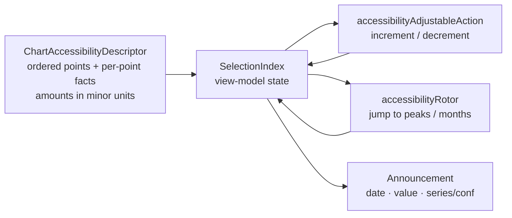

# iOS Chart VoiceOver Navigation (No-Drag Inspection)

> Design specification for inspecting iOS financial charts **point-by-point
> without touch-drag gestures** — using adjustable actions, a rotor/stepper
> fallback, and spoken announcements for date / value / series selection.

**Status:** PROPOSED — design only (native implementation gated, see
[Implementation readiness](#implementation-readiness))
**Issue:** [#2540](https://github.com/jrmoulckers/finance/issues/2540) — _Part of
[#2115](https://github.com/jrmoulckers/finance/issues/2115)_
**Platform:** iOS (SwiftUI · Swift Charts)
**Last updated:** 2026-06-22
**Related design docs:** [data-visualization.md](./data-visualization.md) ·
[chart-component-specs.md](./chart-component-specs.md) ·
[accessibility-patterns.md](./accessibility-patterns.md)
**Sibling docs (this cluster):**
[ios-chart-summaries-data-tables.md](./ios-chart-summaries-data-tables.md) ·
[ios-chart-descriptor-adapters.md](./ios-chart-descriptor-adapters.md)

---

## Table of Contents

1. [Problem & Goal](#1-problem--goal)
2. [Affected iOS Surfaces](#2-affected-ios-surfaces)
3. [Shared Dependencies & the iOS / KMP Boundary](#3-shared-dependencies--the-ios--kmp-boundary)
4. [Interaction Design](#4-interaction-design)
5. [Announcements](#5-announcements)
6. [Accessibility](#6-accessibility)
7. [Dynamic Type](#7-dynamic-type)
8. [Privacy & Balance Hiding](#8-privacy--balance-hiding)
9. [Empty, Stale & Error States](#9-empty-stale--error-states)
10. [Test Plan](#10-test-plan)
11. [Implementation readiness](#implementation-readiness)

---

## 1. Problem & Goal

Today, the only way to inspect a value on the trend and prediction charts is a
**transparent overlay with a custom `DragGesture`**:

- [`TrendChart.swift`](../../apps/ios/Finance/Charts/TrendChart.swift)
  (≈ lines 115–133) adds a clear `Rectangle` overlay and a
  `DragGesture(minimumDistance: 0)` to map the touch X position to a date.
- [`PredictionChart.swift`](../../apps/ios/Finance/Charts/PredictionChart.swift)
  (≈ lines 102–121) uses the same drag-only interaction for forecast inspection.
- [`CategoryBreakdownChart.swift`](../../apps/ios/Finance/Charts/CategoryBreakdownChart.swift)
  drives selection through `.chartAngleSelection`, which is likewise a pointer
  gesture.

There is **no** `accessibilityAdjustableAction`, `accessibilityAction`,
`accessibilityRotor`, or chart-descriptor-driven selection on these charts
([#2115](https://github.com/jrmoulckers/finance/issues/2115)). When VoiceOver is
on, the drag overlay is unreachable — a VoiceOver user can hear the static
summary ([ios-chart-summaries-data-tables.md](./ios-chart-summaries-data-tables.md))
but cannot move to "the August point" and ask "what's the forecast there?".

**Goal:** give VoiceOver users a standard, gesture-free way to move the selection
point-by-point through chart data and hear the selected date, value, and
series/forecast-confidence on every change — without removing the existing
drag affordance for sighted pointer users.

This is the **navigation** half of the chart-accessibility cluster. The
**text alternative** is in
[ios-chart-summaries-data-tables.md](./ios-chart-summaries-data-tables.md); the
**audio-graph descriptor** mapping (the other VoiceOver gesture, "Play Audio
Graph") is in
[ios-chart-descriptor-adapters.md](./ios-chart-descriptor-adapters.md). All three
read the same `ChartAccessibilityDescriptor`.

---

## 2. Affected iOS Surfaces

| Surface                                                                                      | Current inspection             | Add                                                           |
| -------------------------------------------------------------------------------------------- | ------------------------------ | ------------------------------------------------------------- |
| [`TrendChart.swift`](../../apps/ios/Finance/Charts/TrendChart.swift)                         | Drag overlay → `selectedDate`  | Adjustable action stepping date; per-series read on selection |
| [`PredictionChart.swift`](../../apps/ios/Finance/Charts/PredictionChart.swift)               | Drag overlay → `selectedDate`  | Adjustable action; announce value + confidence interval       |
| [`CategoryBreakdownChart.swift`](../../apps/ios/Finance/Charts/CategoryBreakdownChart.swift) | `chartAngleSelection`          | Adjustable action stepping slices; announce slice + %         |
| [`InsightsView.swift`](../../apps/ios/Finance/Screens/InsightsView.swift)                    | Inline donut + bars, no select | Inherit pattern via shared modifier                           |
| [`AnalyticsView.swift`](../../apps/ios/Finance/Screens/AnalyticsView.swift)                  | Inline charts                  | Inherit pattern via shared modifier                           |
| [`InvestmentDetailView.swift`](../../apps/ios/Finance/Screens/InvestmentDetailView.swift)    | Price-history line, no select  | Adjustable action stepping dates; announce price              |

The drag overlay stays for pointer users; the new behaviour is **additive** and
activates under VoiceOver.

---

## 3. Shared Dependencies & the iOS / KMP Boundary

Selection navigation is **pure presentation/interaction** — it has no business
rules of its own. It reads the **same view-model descriptor** the other two docs
use, so there is one source of "what is point _i_".



| Concern                                                              | Lives in                                               | Notes                                                                                                           |
| -------------------------------------------------------------------- | ------------------------------------------------------ | --------------------------------------------------------------------------------------------------------------- |
| Ordered points + per-point facts (date, value, series, bounds, conf) | `apps/ios` VM, sourced from `packages/core` aggregates | Built by the descriptor adapter — see [ios-chart-descriptor-adapters.md](./ios-chart-descriptor-adapters.md)    |
| Currency formatting of the announced value                           | `packages/core`                                        | `SwiftExportFormatterModule` in [`SwiftExportBridge.swift`](../../apps/ios/Finance/KMP/SwiftExportBridge.swift) |
| Selection index + increment/decrement logic                          | `apps/ios`                                             | Trivial bounds-checked index; no shared logic needed                                                            |
| Adjustable action, rotor, announcement wiring                        | `apps/ios`                                             | This document                                                                                                   |

> **Boundary rule:** this layer adds **no** new platform-neutral logic. It
> consumes already-bridged aggregates and the shared formatter. No `packages/`
> edits; any future shared helper is an @native-app-engineer ADR.

---

## 4. Interaction Design

Three complementary, gesture-free mechanisms, in priority order.

### 4.1 Adjustable action (primary)

Each chart container becomes a single **adjustable** accessibility element:

- `.accessibilityElement(children: .contain)` on the chart (already present) plus
  `.accessibilityAddTraits(.allowsDirectInteraction)` is **avoided** — instead the
  container exposes `.accessibilityAdjustableAction { direction in … }`.
- VoiceOver users swipe **up/down** (the standard "adjustable" gesture) to move
  the selection `.increment` / `.decrement` by one data point.
- `.accessibilityValue` reflects the current selection so VoiceOver reads it after
  each adjustment (see [§5](#5-announcements)).
- This is the same gesture users already know from sliders/steppers — no custom
  training, no drag.

```
Chart (adjustable element)
  swipe up   → selectedIndex += 1  → announce point
  swipe down → selectedIndex -= 1  → announce point
  value      → "Mar 2026, Net Worth $12,500"
```

### 4.2 Rotor (secondary, for "jump to")

A custom `.accessibilityRotor` lets users jump to meaningful points without
stepping through every one:

| Rotor entry       | Jumps to                                               |
| ----------------- | ------------------------------------------------------ |
| "Highest"         | Max-value point (per visible series)                   |
| "Lowest"          | Min-value point                                        |
| "Latest"          | Most recent point                                      |
| "Forecast"        | First predicted point (PredictionChart)                |
| Per-month entries | Each month/slice by name (`AccessibilityRotorContent`) |

The rotor is built from the descriptor's ordered points, so it stays in sync with
the data and the table.

### 4.3 Stepper fallback (tertiary, always-visible control)

An **adjacent, non-gesture** `Stepper`/segmented control sits beside the chart for
users who are not on VoiceOver but cannot drag (motor, Switch Control, external
keyboard):

- A SwiftUI `Stepper("Selected point", onIncrement:onDecrement:)` or
  `Picker` of point labels, bound to the same `selectedIndex`.
- Fully keyboard- and Switch-Control-operable; 44×44 pt minimum target
  ([accessibility-patterns.md §8](./accessibility-patterns.md#8-touch-target-sizing)).
- This control is the visible twin of the adjustable action — the
  **adjacent non-gesture control** the descriptor-adapter doc also references.

> The adjacent control and the adjustable action are bound to **one**
> `selectedIndex` so the chart highlight, the spoken value, and the stepper never
> disagree.

### 4.4 Multi-series handling

For `TrendChart` with >1 series, the adjustable action steps **dates**, and a
secondary rotor (or the series control from
[ios-chart-descriptor-adapters.md](./ios-chart-descriptor-adapters.md)) switches
the **active series**. The announcement always names the series so the user never
loses context.

---

## 5. Announcements

On every selection change, VoiceOver must speak the **date, value, and
series/forecast confidence**. Two mechanisms, chosen by source of change:

1. **Adjustable action** → update `.accessibilityValue`; VoiceOver reads it
   automatically (no manual post needed). This is the preferred path.
2. **Stepper / rotor / programmatic jump** → post
   `AccessibilityNotification.Announcement(text)` (polite) since the value change
   originates outside the adjustable gesture.

### Announcement grammar

| Chart          | Spoken value template                                                           |
| -------------- | ------------------------------------------------------------------------------- |
| Trend (single) | `"{date}, {value}"` → "March 2026, $12,500"                                     |
| Trend (multi)  | `"{date}, {series}, {value}"` → "March 2026, Net Worth, $12,500"                |
| Prediction     | `"{date}, predicted {value}, range {low} to {high}, {conf} percent confidence"` |
| Category donut | `"{category}, {value}, {pct} percent"` → "Food, $520, 28 percent"               |
| Investment     | `"{date}, {value}"` → "March 3, $184.20"                                        |

**Rules**

- Values format through `SwiftExportFormatterModule.format(…)` — locale-correct,
  signed; negatives say "negative"/"expense"
  ([accessibility-patterns.md §7.1](./accessibility-patterns.md#71-currency-formatting-for-screen-readers)).
- Announcements are **polite**, never assertive, so they don't interrupt the
  user mid-gesture.
- Confidence is spoken as a percentage word ("90 percent confidence"), never a
  bare number or colour.
- Edges: at the first/last point an `.decrement`/`.increment` past the end is a
  no-op that re-announces the current point (no silent dead-end).

---

## 6. Accessibility

| Requirement                      | Implementation                                                                                                  |
| -------------------------------- | --------------------------------------------------------------------------------------------------------------- |
| Gesture-free inspection          | `.accessibilityAdjustableAction` (swipe up/down) on the chart element                                           |
| "Jump to" navigation             | `.accessibilityRotor` for highest/lowest/latest/forecast/per-month                                              |
| Non-VoiceOver fallback           | Adjacent `Stepper`/`Picker` bound to the same `selectedIndex`, keyboard + Switch Control operable               |
| Selection announced              | `.accessibilityValue` (adjustable path) or `AccessibilityNotification.Announcement` (programmatic path)         |
| Audio graph (complementary)      | `.accessibilityChartDescriptor(…)` — see [ios-chart-descriptor-adapters.md](./ios-chart-descriptor-adapters.md) |
| Text alternative (complementary) | Summary + table — see [ios-chart-summaries-data-tables.md](./ios-chart-summaries-data-tables.md)                |
| Reduce Motion                    | Selection highlight transition skipped when `accessibilityReduceMotion` is on (charts already read it)          |
| Hit targets                      | Stepper/segment controls ≥ 44×44 pt                                                                             |
| Colour independence              | Selected point identity is spoken text, not just the highlight ring                                             |

The drag overlay remains for pointer users but is marked
`.accessibilityHidden(true)` (as the `RuleMark` already is in `TrendChart`), so it
never competes with the adjustable element.

---

## 7. Dynamic Type

- The adjacent stepper/picker labels use the `FinanceTextStyle` ramp /
  `.financeFont()` and `@ScaledMetric` control sizing
  ([accessibility-patterns.md §9.2](./accessibility-patterns.md#92-ios-swiftui)) —
  no hardcoded sizes.
- At accessibility text sizes the stepper row reflows via `AdaptiveFinanceStack`
  (HStack → VStack) so the label and the ± controls don't clip.
- Spoken announcements are size-independent, but the **visible** selected-value
  caption (if shown) wraps and never truncates.

---

## 8. Privacy & Balance Hiding

- When **balance-hiding / privacy mode** is on, the spoken `.accessibilityValue`
  and any announcement redact the amount ("Hidden") — derived from the same
  redacted descriptor used by the summary/table, so a hidden balance is never
  spoken.
- The selection date, series name, and confidence (non-monetary) may still be
  announced; only monetary figures follow the redaction flag.
- Amounts stay `.private` in `os.Logger`; selection changes are not logged with
  values.
- Rotor entries like "Highest"/"Lowest" still navigate, but the announced value is
  redacted — position is not itself sensitive, the amount is.

---

## 9. Empty, Stale & Error States

| State       | Adjustable action        | Stepper / rotor                     | Announcement                                                            |
| ----------- | ------------------------ | ----------------------------------- | ----------------------------------------------------------------------- |
| **Empty**   | Disabled (no points)     | Hidden                              | None; the empty summary element is focusable                            |
| **Loading** | Disabled                 | Disabled                            | "Loading…" once (polite), via `ProgressView`                            |
| **Stale**   | Enabled on cached points | Enabled                             | Selection value prefixed/suffixed "(as of {time})" once per chart focus |
| **Error**   | Disabled                 | Replaced by labelled "Retry" button | Error announced; focus moves to Retry                                   |

- Stale data reuses the sync/offline signal (`SwiftExportSyncModule`,
  `OfflineBanner`); the user is told the inspected numbers may lag.
- These mirror [data-visualization.md §7](./data-visualization.md#7-empty-loading--error-states)
  and the companion states in
  [ios-chart-summaries-data-tables.md §9](./ios-chart-summaries-data-tables.md#9-empty-stale--error-states).

---

## 10. Test Plan

Smallest tests required before acceptance. Native UI tests run on Simulator with
**free Personal Team signing** (see [Implementation readiness](#implementation-readiness)).

### Native (iOS) — XCTest / Swift Testing in `apps/ios/Tests`

- `ChartSelectionViewModelTests`: `increment`/`decrement` move `selectedIndex`
  within bounds; past-end is a no-op that re-targets the same point; multi-series
  series-switch keeps the date.
- `ChartAdjustableValueTests`: for each chart family the computed
  `accessibilityValue` matches the announcement grammar (single, multi, prediction
  with confidence, donut with %).
- `ChartRotorTests`: "Highest"/"Lowest"/"Latest"/"Forecast" resolve to the correct
  indices for a fixed dataset, including ties.
- `ChartNoDragInspectionUITests` (XCUITest, VoiceOver-style traversal): the chart
  is reachable and adjustable **without** issuing a drag; swipe-up/down changes the
  announced value; the adjacent stepper changes the same selection.
- `ChartSelectionPrivacyTests`: with balance-hiding on, the adjustable value and
  announcements contain no raw amount.
- `ChartSelectionStateTests`: empty/loading/error disable the adjustable action and
  expose the correct fallback (no value, or labelled Retry).

### Shared (KMP) — none new

Navigation adds no platform-neutral logic; it relies on the already-tested
aggregator/formatter modules. (Any future shared "peaks" helper would be an
@native-app-engineer ADR with its own `commonTest`.)

---

## Implementation readiness

**Design: ready now. Native code: buildable now, distribution gated.**

Per the
[Human-Gated Prerequisites runbook](../ops/human-gated-prerequisites.md#2-implementation-vs-distribution--the-decoupling),
implementation and distribution are decoupled. The "blocked by
[#1239](https://github.com/jrmoulckers/finance/issues/1239)" note on
[#2540](https://github.com/jrmoulckers/finance/issues/2540) is a **distribution**
gate only.

| Phase              | What                                                                             | Gated by #1239?                         |
| ------------------ | -------------------------------------------------------------------------------- | --------------------------------------- |
| **Design**         | This document, interaction model, announcement grammar, test plan                | No — deliverable now                    |
| **Implementation** | Adjustable action, rotor, adjacent stepper, announcements, XCUITest on Simulator | **No** — free Personal Team signing     |
| **Distribution**   | TestFlight / App Store build carrying the feature                                | **Yes** — Apple Developer Program enrol |

- **Buildable now:** `accessibilityAdjustableAction`, `accessibilityRotor`,
  `AccessibilityNotification.Announcement`, and the adjacent stepper are all
  standard SwiftUI iOS 17 APIs with no paid entitlement; they run on Simulator and
  on a device via free Personal Team signing.
- **Gated tail (#1239):** only store/TestFlight distribution needs the paid
  enrollment + signing material in
  [human-gated-prerequisites.md §3.2](../ops/human-gated-prerequisites.md#32-ios-distribution--apple-developer-1239).
  An SME agent must **not** perform enrollment, certificate, or secret steps.

_Part of [#2115](https://github.com/jrmoulckers/finance/issues/2115). Sibling
designs: [summaries & data tables](./ios-chart-summaries-data-tables.md) ·
[descriptor adapters](./ios-chart-descriptor-adapters.md)._
