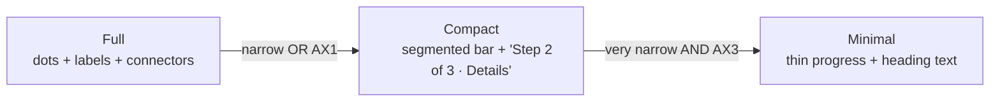

# Compact Transaction-Create Stepper — iOS

> Design specification for how the multi-step `Type → Details → Review`
> transaction-create flow adapts on **small screens** (iPhone SE, 320–375pt
> width) and at **large Dynamic Type / accessibility sizes**. It defines a
> collapsing step indicator, content-priority rules for the Details step, and a
> strict invariant: the visual collapse must **never** change the VoiceOver,
> Switch Control, or validation semantics of the underlying flow.

**Status:** Design (implementation-ready) · pre-implementation
**Issue:** [#2608](https://github.com/jrmoulckers/finance/issues/2608) — Compact transaction-create stepper and entry flow for iOS
**Part of:** [#2190](https://github.com/jrmoulckers/finance/issues/2190)
**Platforms:** iOS · iPadOS · macOS (SwiftUI)
**WCAG target:** 2.2 Level AA — SC 1.4.4 Resize Text, SC 1.4.10 Reflow, SC 1.3.1 Info & Relationships, SC 2.5.5 Target Size
**Related:** [responsive-breakpoints.md](./responsive-breakpoints.md) · [accessibility-patterns.md](./accessibility-patterns.md) · [cognitive-accessibility.md](./cognitive-accessibility.md) · [ios-one-thumb-quick-add.md](./ios-one-thumb-quick-add.md) · [ios-wallet-adjacent-capture-inbox.md](./ios-wallet-adjacent-capture-inbox.md) · [Human-Gated Prerequisites](../ops/human-gated-prerequisites.md)

---

## Table of Contents

1. [Problem & Goals](#1-problem--goals)
2. [Adaptation Triggers](#2-adaptation-triggers)
3. [Step Indicator: Full → Compact → Minimal](#3-step-indicator-full--compact--minimal)
4. [Content Priorities on the Details Step](#4-content-priorities-on-the-details-step)
5. [Affected iOS Surfaces](#5-affected-ios-surfaces)
6. [Shared Dependencies & the Validation Boundary](#6-shared-dependencies--the-validation-boundary)
7. [Accessibility, Dynamic Type & Reachability](#7-accessibility-dynamic-type--reachability)
8. [Privacy](#8-privacy)
9. [Stale, Error & Empty States](#9-stale-error--empty-states)
10. [Test Plan](#10-test-plan)
11. [Implementation Readiness](#11-implementation-readiness)
12. [Open Questions](#12-open-questions)

---

## 1. Problem & Goals

`apps/ios/Finance/Screens/TransactionCreateView.swift` renders a three-step
wizard with a horizontal step indicator (`stepIndicator`): three labeled dots
(`Type`, `Details`, `Review`) joined by connector lines, each in an
`.frame(maxWidth: .infinity)` column. This layout is fine on a 390pt+ screen at
default text size, but it breaks down in two directions:

- **Small width (iPhone SE, 320–375pt).** Three equal columns with `.caption2`
  labels plus connectors leave very little room; the Details `Form` then stacks
  Amount keypad + Payee + Account + Category + Status + BNPL + Tags + Mood +
  Date + Note, forcing heavy scrolling before the user reaches the `Next`
  button.
- **Large Dynamic Type (AX1–AX5).** The fixed 12pt dots and `.caption2` labels
  don't scale with text; meanwhile the labels themselves grow and **truncate or
  collide** with the connector lines, and the Details form's section density
  becomes overwhelming.

**Goals**

1. **A step indicator that degrades gracefully** from full (dots + labels +
   connectors) to compact (progress bar + "Step 2 of 3 · Details") to minimal
   (current step label only), chosen by available width and text size.
2. **Content priority** on the dense Details step: always show amount + the
   required fields; progressively disclose the optional ones.
3. **Semantic invariance.** Whatever the visual form, assistive technology and
   the shared validator see the same three-step model with the same gating.

**Non-goals.** This design does not add or remove steps, does not change which
fields are required (that is shared validation), and does not redesign the
express one-thumb path (see [ios-one-thumb-quick-add.md](./ios-one-thumb-quick-add.md)).
It governs how the **existing** wizard reflows.

---

## 2. Adaptation Triggers

Selection is driven by SwiftUI environment values, not device model checks:

| Input                 | API                                         | Used for                                    |
| --------------------- | ------------------------------------------- | ------------------------------------------- |
| Available width       | `GeometryReader` / `ViewThatFits`           | Full vs. compact indicator; chip wrapping   |
| Text size             | `@Environment(\.dynamicTypeSize)`           | Collapse to compact at `>= .accessibility1` |
| Horizontal size class | `@Environment(\.horizontalSizeClass)`       | Regular (iPad/Mac) keeps full indicator     |
| Reduce Motion         | `@Environment(\.accessibilityReduceMotion)` | Cross-fade vs. animate step transitions     |

**Primary rule:** prefer `ViewThatFits` to let the layout pick the richest
indicator that fits the current width _and_ text size, with an explicit
Dynamic-Type override so accessibility sizes force the compact form even when
width alone would allow the full one. Avoid hardcoded screen-width breakpoints;
align thresholds with [responsive-breakpoints.md](./responsive-breakpoints.md).

---

## 3. Step Indicator: Full → Compact → Minimal

Three presentations of the **same** `TransactionCreateViewModel.Step` model:

### Full (default — regular width, ≤ `.xxLarge`)

The existing design: three dots, per-step labels, connector lines, checkmark on
completed steps. Unchanged.

### Compact (narrow width OR `>= .accessibility1`)

- A single full-width **segmented progress bar** (3 segments; filled up to and
  including the current step).
- One line of text beneath: **"Step 2 of 3 · Details"** using `.subheadline`,
  wrapping (never truncating) the step title.
- No per-step labels, no checkmark glyph clutter — completion is conveyed by the
  filled segments and the "2 of 3" count.

### Minimal (extreme: very narrow AND `>= .accessibility3`)

- Drop the segmented bar to a thin determinate `ProgressView(value:)`.
- Keep only **"Step 2 of 3 · Details"** as the heading, styled as a section
  header so it remains a VoiceOver heading and a Dynamic-Type anchor.

**Invariant (all three):** the indicator is one combined accessibility element
whose label is **"Step 2 of 3, Details, current step"** and whose value tracks
progress — identical to today's
`accessibilityLabel("Step \(n): \(title)")` + `accessibilityValue("Current
step")`. The visual collapse changes pixels only; VoiceOver output is constant.

---

## 4. Content Priorities on the Details Step

The Details `Form` is the densest screen. Define a priority order and disclose
by priority when space/text-size is constrained:

| Priority      | Fields                                     | Behavior when compact                                                  |
| ------------- | ------------------------------------------ | ---------------------------------------------------------------------- |
| **P0 always** | Amount (keypad), Account                   | Always visible, top of form; these back the shared required-field gate |
| **P1 high**   | Payee, Category                            | Visible; Category shows the engine suggestion inline                   |
| **P2 medium** | Date, Status                               | Visible but below P1                                                   |
| **P3 low**    | Tags, Note                                 | Collapsed into a **"More details"** `DisclosureGroup`, expanded off    |
| **P4 niche**  | BNPL liability, Mood tag (feature-flagged) | Inside "More details"; Mood only when `moodTagsEnabled`                |

Rules:

- On small width / large type, P3–P4 start **collapsed** so the user reaches the
  `Next`/`Save` button with minimal scrolling; on regular width they may stay
  expanded.
- The amount keypad's 3-column `LazyVGrid` keys grow with Dynamic Type while
  keeping ≥ 44×44pt targets; if width is too small for three comfortable
  columns, key spacing tightens before key size drops below the minimum target.
- "More details" remembers its expanded/collapsed state within the session so a
  power user isn't forced to re-open it on every step return.
- The Review step is unaffected in field set but uses the same compact indicator;
  long summaries wrap rather than truncate.

---

## 5. Affected iOS Surfaces

| Surface                                                        | Change                                                                                             |
| -------------------------------------------------------------- | -------------------------------------------------------------------------------------------------- |
| `apps/ios/Finance/Screens/TransactionCreateView.swift`         | `stepIndicator` becomes adaptive (Full/Compact/Minimal via `ViewThatFits` + env); P3–P4 disclosure |
| **New** `apps/ios/Finance/Components/StepIndicator.swift`      | Extracted, reusable adaptive indicator with the fixed accessibility contract                       |
| `apps/ios/Finance/ViewModels/TransactionCreateViewModel.swift` | No rule change; may expose a `progress` convenience (`currentStep / stepCount`)                    |
| `apps/ios/Finance/Screens/QuickAddView.swift` (from #2599)     | Reuses `StepIndicator` when the express sheet expands to full form                                 |
| `apps/ios/Tests/TransactionCreateViewModelTests.swift`         | Add `canAdvance`/progress assertions per step                                                      |
| **New** `apps/ios/Tests/StepIndicatorSnapshotTests.swift`      | Snapshot the three presentations across size classes / Dynamic Type                                |

---

## 6. Shared Dependencies & the Validation Boundary

- **Step count, order, and labels are pure iOS presentation.** The
  `TransactionCreateViewModel.Step` enum (`type/details/review`) is a SwiftUI
  wizard construct and stays in `apps/ios`. Collapsing the indicator is a layout
  decision with no shared counterpart.
- **What is required at each step comes from shared rules.** `canAdvance` and the
  final save gate defer to `TransactionValidator`
  (`packages/core/src/.../validation/TransactionValidator.kt`) via
  `KMPTransactionValidatorProtocol`: the Details step's "Amount + Account
  required" mirrors `ZeroAmount` / `AccountNotFound`, and Category remains
  optional because the shared model permits a null category. Content-priority
  P0/P1 buckets are chosen to match those shared requirements, so the visual
  collapse never hides a field the validator requires without surfacing it.
- **No `packages/` change is needed.** If future work wanted the step model
  itself to be shared/driven by KMP (e.g. cross-platform wizard config), that is
  an ADR to `@native-app-engineer` — explicitly out of scope. Boundary: **rules in KMP,
  reflow in SwiftUI.**

---

## 7. Accessibility, Dynamic Type & Reachability

- **Dynamic Type is the headline requirement.** No hardcoded sizes for indicator
  labels or step text; the current 12pt dots / `.caption2` labels are replaced
  by scalable styles (`.subheadline`, section-header for minimal). The indicator
  must remain legible and uncollided from `.xSmall` through `.accessibility5` —
  this is the core acceptance bar for #2608.
- **Reflow (SC 1.4.10).** Content reflows without horizontal scrolling at 200%
  text; the connector-line layout that overflows today is exactly what the
  compact/minimal forms fix.
- **Stable VoiceOver semantics.** As stated in §3, the combined accessibility
  element and its label/value are identical across all three visual forms;
  collapsing must not drop the "Step N of 3" information (SC 1.3.1).
- **Switch Control / focus order.** Focus order is indicator (heading) → step
  content (top to bottom by priority) → bottom bar (`Back`/`Next`/`Save`). The
  "More details" disclosure is focusable and announces expanded/collapsed.
- **Reachability.** The `Back`/`Next`/`Save` bottom bar already sits in the thumb
  zone; the compact indicator frees vertical space so required fields are closer
  to it, reducing one-handed scrolling on small phones.
- **Reduce Motion.** Step transitions and indicator fills cross-fade instead of
  sliding/animating when Reduce Motion is on.

---

## 8. Privacy

- The step indicator and reflow logic handle **no financial values** — they
  arrange chrome, not data. The amount appears only within the Details/Review
  content, governed by the same `.private` logging policy as the rest of the
  flow.
- No new persistence is introduced; "More details" expansion state is transient
  session UI state, not stored, and certainly never written to the Keychain or
  synced.
- No screenshots, analytics, or logs should capture the rendered amount as part
  of layout instrumentation; any layout telemetry stays structural (which form
  was chosen), never value-bearing.

---

## 9. Stale, Error & Empty States

- **Validation error while collapsed.** When a step can't advance, the inline
  error must name the offending step/field even though per-step labels are
  hidden — e.g. "Step 2 (Details): enter an amount". The error text is the
  message returned by `TransactionValidator`, surfaced near the bottom bar where
  the user's attention (and thumb) already is.
- **Empty pickers.** If accounts/categories haven't loaded, the P0 Account
  picker shows the existing "Select Account" prompt and `Next` stays disabled —
  unchanged behavior, just within the compact layout.
- **Stale layout.** Rotating, entering Split View/Stage Manager, or changing the
  system text size mid-flow must re-evaluate the trigger and swap presentation
  without losing field state — the indicator is derived state, the field values
  live in the view model.
- **Review step with sparse data.** Optional fields omitted from the summary
  (already the behavior) simply don't render; the compact indicator still reads
  "Step 3 of 3 · Review".

---

## 10. Test Plan

### 10.1 Shared (Kotlin · `packages/core` · `commonTest`)

- `TransactionValidatorTest`: amount + account required, category optional —
  confirms the requirement set the P0/P1 content priorities are built around
  (so a collapsed layout can't hide a truly required field).

### 10.2 Native (Swift · iOS Simulator · XCTest)

- `StepIndicatorSnapshotTests` (new): render Full / Compact / Minimal across
  - widths: iPhone SE (375pt) and a Pro Max,
  - Dynamic Type: `.large`, `.accessibility1`, `.accessibility5`,
  - light + OLED dark,
    asserting no truncation/collision and that the correct form is chosen.
- `StepIndicatorAccessibilityTests` (new): assert the combined element's
  `accessibilityLabel` is "Step N of 3, <Title>, current step" **identically**
  in all three visual forms.
- `TransactionCreateViewModelTests` (extend
  `apps/ios/Tests/TransactionCreateViewModelTests.swift`): `canAdvance` is
  `false` on Details until amount + account set; `progress` equals
  `currentStep+1 / stepCount`.
- A Details-step snapshot at `.accessibility3` asserting P3–P4 ("More details")
  start collapsed and `Next` is reachable with minimal scrolling.

### 10.3 Manual / QA gate (every UI PR)

- iPhone SE at AX5: walk Type → Details → Review; verify indicator is legible,
  uncollided, and required fields reach the bottom bar without long scrolls.
- VoiceOver: confirm "Step 2 of 3, Details" is announced in every visual form.
- Rotate / resize mid-flow: field state preserved, presentation re-chosen.

---

## 11. Implementation Readiness

### ✅ Buildable now — no enrollment required

The adaptive `StepIndicator`, the Details content-priority disclosure, and all
snapshot/accessibility/view-model tests are pure SwiftUI + existing shared
validation reached through `KMPBridge`. They build and run today on device or
simulator under **free Personal Team signing**. There are no new entitlements,
no networking, and no `packages/` changes — this is among the most
straightforwardly implementable items in the cluster.

### 🔒 Distribution tail — gated by [#1239](https://github.com/jrmoulckers/finance/issues/1239) (human action)

Only TestFlight/App Store distribution, release signing, and CI release
workflows are human-gated by Apple Developer Program enrollment, per
[Human-Gated Prerequisites](../ops/human-gated-prerequisites.md) §2.
Implementation and local verification are **not** blocked. No provisioning,
certificates, or secrets are created here.

---

## 12. Open Questions

1. Should the Full→Compact threshold be derived purely from `ViewThatFits`, or
   pinned to a named breakpoint in
   [responsive-breakpoints.md](./responsive-breakpoints.md) for cross-surface
   consistency? Proposal: `ViewThatFits` with a Dynamic-Type override floor.
2. Should "More details" expansion state persist across sessions (UserDefaults)
   rather than per-session? Leaning per-session to avoid surprising defaults.
3. Is the Minimal tier ever reached in practice, or does Compact + reflow cover
   AX5 on the smallest supported device? Validate with the SE/AX5 snapshot.
